# The First Casualty of Statistics: Part Two
<big>**Directed Acyclic Graphs**</big>

<br/>
Jiří Fejlek

2026-08-08
<br/>

<br/> When introducing confounder and collider bias in Part One, we used a
graphical tool for expressing causal relations: a directed acyclic graph
(DAG). In this Second Part, we will expand on this and show how to use a
DAG to estimate expected causal effects. <br/>

## Table of Contents

- [Directed Acyclic Graphs](#directed-acyclic-graphs)
  - [Chain](#chain)
  - [Fork](#fork)
  - [Collider (v-structure)](#collider-v-structure)
- [D-Separation](#d-separation)
- [Back-Door Criterion](#back-door-criterion)
- [Front-Door Criterion](#front-door-criterion)
- [References](#references)

``` r
library(tidyr)
library(dplyr)
library(ggplot2)
library(patchwork)
library(dagitty)
library(ggdag)
```

## Directed Acyclic Graphs

Directed Acyclic Graphs (DAG) $`\mathcal{G}`$ is, as the name would
suggest, a directed graph, i.e.,
$`\mathcal{G} = (\mathcal{V},\mathcal{E})`$, where
$`\mathcal{V} = {A_1, A_2, \ldots }`$ is a set of vertices and
$`\mathcal{E}`$ is a set of directed edges $`(A_i, A_j)`$. A DAG has no
cycles, i.e., there is no sequence of directed edges
$`(A_i, A_j), (A_j, A_k), \ldots`$ that ends in $`A_i`$.

We know from the first part that we use DAGs to represent causal
relations. An edge $`(A, B)`$ in a DAG represents a causal relation
$`A \rightarrow B`$ ($`A`$ causes $`B`$). Consequently, the condition on
DAG being acyclic means that we disallow any feedback loops such as
$`A \leftrightarrow B`$. We should note that we can overcome this
limitation if needed by unrolling the relation in time (e.g.,
$`A_{t-1} \rightarrow B_{t-1}  \rightarrow A_{t} \rightarrow B_{t}`$).
However, this approach is quite inefficient in terms of the number of
variables (Molak 2023).

Let us assume a DAG $`\mathcal{G}`$ with three vertices $`A`$, $`B`$ and
$`C`$. We will analyze possible configurations.

### Chain

First, we will consider a *chain*. We assume that $`A \rightarrow B`$
and $`B \rightarrow C`$.

``` r
dag <- dagify(C ~ B, B ~ A,  exposure = 'A', outcome = 'C')
ggdag_status(dag) + theme_dag() + theme(legend.position = "none")
```

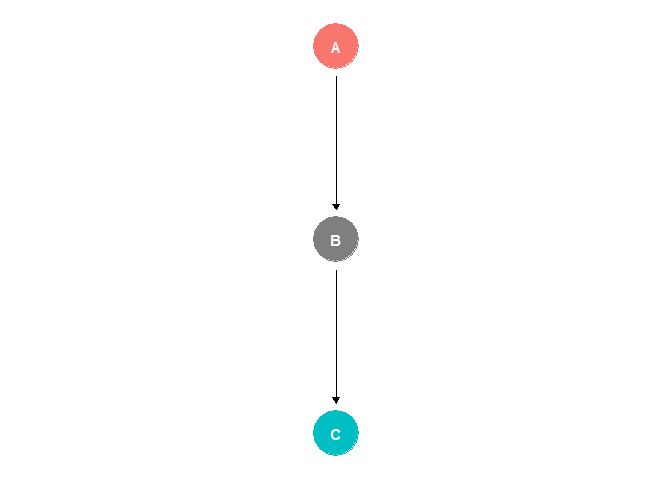<!-- -->

Provided that $`A`$ denotes the treatment and $`C`$ is the outcome,
$`B`$ is known as a *mediator*. Let’s assume the following simple linear
relations.

``` r
set.seed(123)
A <- rnorm(1000, 0, 1)          # treatment
B <- 5*A + rnorm(1000, 0, 0.5)  # mediator
C <- 2*B + rnorm(1000, 0, 0.1)  # outcome
```

We can easily estimate the causal effect of $`A`$ on $`C`$ by regressing
$`C`$ on $`A`$.

``` r
summary(lm(C ~ A))
```

    ## 
    ## Call:
    ## lm(formula = C ~ A)
    ## 
    ## Residuals:
    ##     Min      1Q  Median      3Q     Max 
    ## -3.1921 -0.7067  0.0049  0.7105  3.3772 
    ## 
    ## Coefficients:
    ##             Estimate Std. Error t value Pr(>|t|)    
    ## (Intercept)  0.03906    0.03207   1.218    0.223    
    ## A           10.08614    0.03235 311.812   <2e-16 ***
    ## ---
    ## Signif. codes:  0 '***' 0.001 '**' 0.01 '*' 0.05 '.' 0.1 ' ' 1
    ## 
    ## Residual standard error: 1.014 on 998 degrees of freedom
    ## Multiple R-squared:  0.9898, Adjusted R-squared:  0.9898 
    ## F-statistic: 9.723e+04 on 1 and 998 DF,  p-value: < 2.2e-16

Let us include mediator $`B`$ as an additional predictor.

``` r
summary(lm(C ~ A + B))
```

    ## 
    ## Call:
    ## lm(formula = C ~ A + B)
    ## 
    ## Residuals:
    ##      Min       1Q   Median       3Q      Max 
    ## -0.28360 -0.06277 -0.00370  0.06538  0.33787 
    ## 
    ## Coefficients:
    ##              Estimate Std. Error t value Pr(>|t|)    
    ## (Intercept) -0.002093   0.003098  -0.676    0.499    
    ## A           -0.029656   0.031213  -0.950    0.342    
    ## B            2.005501   0.006157 325.724   <2e-16 ***
    ## ---
    ## Signif. codes:  0 '***' 0.001 '**' 0.01 '*' 0.05 '.' 0.1 ' ' 1
    ## 
    ## Residual standard error: 0.09788 on 997 degrees of freedom
    ## Multiple R-squared:  0.9999, Adjusted R-squared:  0.9999 
    ## F-statistic: 5.27e+06 on 2 and 997 DF,  p-value: < 2.2e-16

We notice that the regression coefficient corresponding to $`A`$ is now
almost $`0`$. This is because after conditioning on $`B`$, $`A`$ and
$`C`$ are *independent*
``` math
 P(C \mid A, B) = P(C \mid B).
```

Let us change the DAG a bit and add a direct causal path from $`A`$ to
$`C`$

``` r
dag <- dagify(C ~ A + B, B ~ A,  exposure = 'A', outcome = 'C')
ggdag_status(dag) + theme_dag() + theme(legend.position = "none")
```

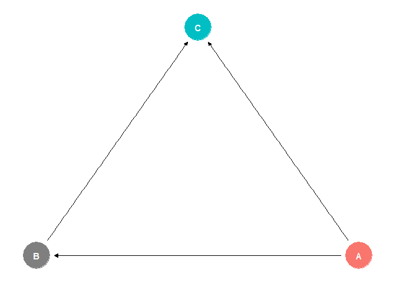<!-- -->

Let’s modify our example to correspond to this new setup.

``` r
set.seed(123)
A <- rnorm(1000, 0, 1)                  # treatment
B <- 4*A + rnorm(1000, 0, 0.5)          # mediator
C <- 2*B + 2*A + rnorm(1000, 0, 0.1)    # outcome
```

Regression $`C`$ on $`A`$ now estimates the total causal effect of $`A`$
on $`C`$ (we modified the data so that the total effect stayed the
same).

``` r
summary(lm(C ~ A))
```

    ## 
    ## Call:
    ## lm(formula = C ~ A)
    ## 
    ## Residuals:
    ##     Min      1Q  Median      3Q     Max 
    ## -3.1921 -0.7067  0.0049  0.7105  3.3772 
    ## 
    ## Coefficients:
    ##             Estimate Std. Error t value Pr(>|t|)    
    ## (Intercept)  0.03906    0.03207   1.218    0.223    
    ## A           10.08614    0.03235 311.812   <2e-16 ***
    ## ---
    ## Signif. codes:  0 '***' 0.001 '**' 0.01 '*' 0.05 '.' 0.1 ' ' 1
    ## 
    ## Residual standard error: 1.014 on 998 degrees of freedom
    ## Multiple R-squared:  0.9898, Adjusted R-squared:  0.9898 
    ## F-statistic: 9.723e+04 on 1 and 998 DF,  p-value: < 2.2e-16

However, thanks to the direct effect of $`A`$ on $`C`$, $`A`$ and $`C`$
are dependent even after conditioning on the mediator $`B`$. The
corresponding regression model now estimates the direct effect of $`A`$
on $`C`$.

``` r
summary(lm(C ~ A + B))
```

    ## 
    ## Call:
    ## lm(formula = C ~ A + B)
    ## 
    ## Residuals:
    ##      Min       1Q   Median       3Q      Max 
    ## -0.28360 -0.06277 -0.00370  0.06538  0.33787 
    ## 
    ## Coefficients:
    ##              Estimate Std. Error t value Pr(>|t|)    
    ## (Intercept) -0.002093   0.003098  -0.676    0.499    
    ## A            1.975845   0.025094  78.737   <2e-16 ***
    ## B            2.005501   0.006157 325.724   <2e-16 ***
    ## ---
    ## Signif. codes:  0 '***' 0.001 '**' 0.01 '*' 0.05 '.' 0.1 ' ' 1
    ## 
    ## Residual standard error: 0.09788 on 997 degrees of freedom
    ## Multiple R-squared:  0.9999, Adjusted R-squared:  0.9999 
    ## F-statistic: 5.27e+06 on 2 and 997 DF,  p-value: < 2.2e-16

Overall, we conclude that we do not want to condition on mediators
unless we wish to estimate the direct causal effects.

### Fork

A *fork* is a causal structure with a *confounder*

``` r
dag <- dagify(C ~ A + B, A ~ B,  exposure = 'A', outcome = 'C')
ggdag_status(dag) + theme_dag() + theme(legend.position = "none")
```

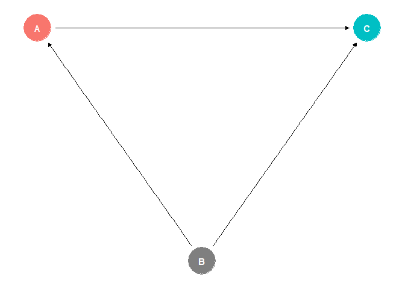<!-- -->

and hence, we already know the drill: to get an unbiased estimate of the
causal effect of $`A`$ on $`C`$, we need to condition on the confounder
$`B`$.

``` r
set.seed(123)
B <- rnorm(1000, 0, 0.5)             # confounder
A <- rnorm(1000, 0, 1) + 0.5*B       # treatment
C <- A - 10*B + rnorm(1000, 0, 0.1)  # outcome
```

``` r
summary(lm(C ~ A + B))
```

    ## 
    ## Call:
    ## lm(formula = C ~ A + B)
    ## 
    ## Residuals:
    ##      Min       1Q   Median       3Q      Max 
    ## -0.28360 -0.06277 -0.00370  0.06538  0.33787 
    ## 
    ## Coefficients:
    ##               Estimate Std. Error   t value Pr(>|t|)    
    ## (Intercept)  -0.002093   0.003098    -0.676    0.499    
    ## A             1.002751   0.003079   325.724   <2e-16 ***
    ## B           -10.005674   0.006583 -1519.946   <2e-16 ***
    ## ---
    ## Signif. codes:  0 '***' 0.001 '**' 0.01 '*' 0.05 '.' 0.1 ' ' 1
    ## 
    ## Residual standard error: 0.09788 on 997 degrees of freedom
    ## Multiple R-squared:  0.9996, Adjusted R-squared:  0.9996 
    ## F-statistic: 1.168e+06 on 2 and 997 DF,  p-value: < 2.2e-16

``` r
summary(lm(C ~ A))
```

    ## 
    ## Call:
    ## lm(formula = C ~ A)
    ## 
    ## Residuals:
    ##      Min       1Q   Median       3Q      Max 
    ## -15.1923  -3.1383   0.0326   3.0228  13.0846 
    ## 
    ## Coefficients:
    ##             Estimate Std. Error t value Pr(>|t|)    
    ## (Intercept) -0.01399    0.14909  -0.094 0.925273    
    ## A           -0.47672    0.14055  -3.392 0.000722 ***
    ## ---
    ## Signif. codes:  0 '***' 0.001 '**' 0.01 '*' 0.05 '.' 0.1 ' ' 1
    ## 
    ## Residual standard error: 4.71 on 998 degrees of freedom
    ## Multiple R-squared:  0.0114, Adjusted R-squared:  0.01041 
    ## F-statistic:  11.5 on 1 and 998 DF,  p-value: 0.0007216

An important example of confounding is when $`A`$ has no causal effect
on $`C`$.

``` r
set.seed(123)
B <- rnorm(1000, 0, 0.5)         # confounder
A <- rnorm(1000, 0, 1) + 0.5*B   # treatment
C <- 10*B + rnorm(1000, 0, 0.1)  # outcome
```

Then failure to condition on the confounder $`B`$ creates a false
association. In other words, even though $`A`$ has no causal effect on
$`C`$, $`A`$ and $`C`$ are not conditionally independent.

``` r
summary(lm(C ~ A))
```

    ## 
    ## Call:
    ## lm(formula = C ~ A)
    ## 
    ## Residuals:
    ##      Min       1Q   Median       3Q      Max 
    ## -13.0897  -3.0635   0.0184   3.1242  15.1390 
    ## 
    ## Coefficients:
    ##             Estimate Std. Error t value Pr(>|t|)    
    ## (Intercept) 0.009787   0.148922   0.066    0.948    
    ## A           1.480539   0.140390  10.546   <2e-16 ***
    ## ---
    ## Signif. codes:  0 '***' 0.001 '**' 0.01 '*' 0.05 '.' 0.1 ' ' 1
    ## 
    ## Residual standard error: 4.705 on 998 degrees of freedom
    ## Multiple R-squared:  0.1003, Adjusted R-squared:  0.09936 
    ## F-statistic: 111.2 on 1 and 998 DF,  p-value: < 2.2e-16

Conditioning on $`B`$ removes the non-causal association from the model.

``` r
summary(lm(C ~ A + B))
```

    ## 
    ## Call:
    ## lm(formula = C ~ A + B)
    ## 
    ## Residuals:
    ##      Min       1Q   Median       3Q      Max 
    ## -0.28360 -0.06277 -0.00370  0.06538  0.33787 
    ## 
    ## Coefficients:
    ##              Estimate Std. Error  t value Pr(>|t|)    
    ## (Intercept) -0.002093   0.003098   -0.676    0.499    
    ## A            0.002751   0.003079    0.894    0.372    
    ## B            9.994326   0.006583 1518.222   <2e-16 ***
    ## ---
    ## Signif. codes:  0 '***' 0.001 '**' 0.01 '*' 0.05 '.' 0.1 ' ' 1
    ## 
    ## Residual standard error: 0.09788 on 997 degrees of freedom
    ## Multiple R-squared:  0.9996, Adjusted R-squared:  0.9996 
    ## F-statistic: 1.281e+06 on 2 and 997 DF,  p-value: < 2.2e-16

### Collider (v-structure)

Lastly, we have a *collider*, which is a consequence of both the
treatment and the outcome

``` r
dag <- dagify(C~A, B ~ A + C,  exposure = 'A', outcome = 'C')
ggdag_status(dag) + theme_dag() + theme(legend.position = "none")
```

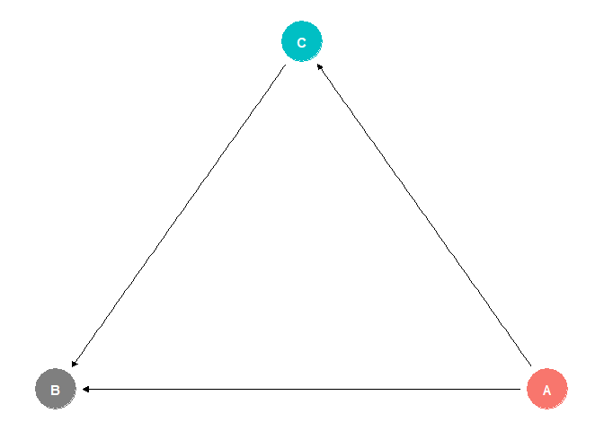<!-- -->

and on which we must not condition. We provided an example in the First
Part, in which conditioning on the collider changed the sign of the
effect of $`A`$ on $`C`$ in the model.

``` r
set.seed(123)
A <- rnorm(1000, 0, 1)                # treatment
C <- A + rnorm(1000, 0, 0.5)          # outcome
B <- A + 0.5*C + rnorm(1000, 0, 0.1)  # collider
```

``` r
summary(lm(C ~ A + B))
```

    ## 
    ## Call:
    ## lm(formula = C ~ A + B)
    ## 
    ## Residuals:
    ##     Min      1Q  Median      3Q     Max 
    ## -0.5908 -0.1254  0.0018  0.1186  0.5160 
    ## 
    ## Coefficients:
    ##              Estimate Std. Error t value Pr(>|t|)    
    ## (Intercept)  0.006252   0.005718   1.093    0.275    
    ## A           -1.575627   0.032424 -48.594   <2e-16 ***
    ## B            1.723335   0.020990  82.101   <2e-16 ***
    ## ---
    ## Signif. codes:  0 '***' 0.001 '**' 0.01 '*' 0.05 '.' 0.1 ' ' 1
    ## 
    ## Residual standard error: 0.1807 on 997 degrees of freedom
    ## Multiple R-squared:  0.9754, Adjusted R-squared:  0.9754 
    ## F-statistic: 1.977e+04 on 2 and 997 DF,  p-value: < 2.2e-16

Conditioning on the collider can also create a (non-causal) association
of $`A`$ and $`C`$, even though there is no causal effect.

``` r
dag <- dagify(B ~ A + C,  exposure = 'A', outcome = 'C')
ggdag_status(dag) + theme_dag() + theme(legend.position = "none")
```

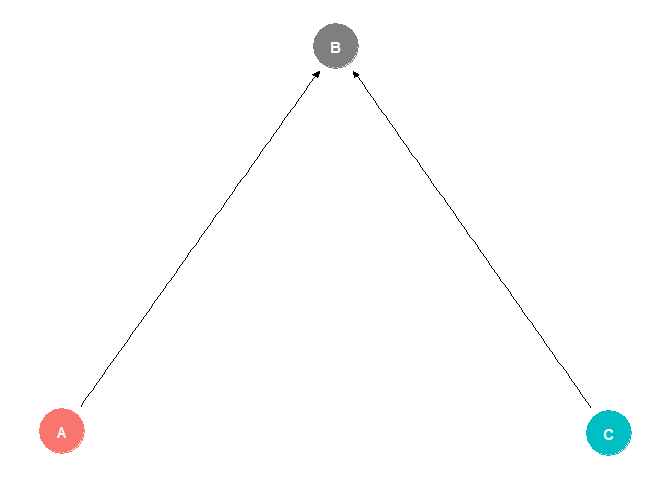<!-- -->

``` r
set.seed(123)
A <- rnorm(1000, 0, 1)            # treatment
C <- rnorm(1000, 0, 0.5)          # outcome
B <- A - C + rnorm(1000, 0, 5)    # collider
```

``` r
summary(lm(C ~ A + B))
```

    ## 
    ## Call:
    ## lm(formula = C ~ A + B)
    ## 
    ## Residuals:
    ##      Min       1Q   Median       3Q      Max 
    ## -1.56505 -0.34789 -0.00224  0.35120  1.66584 
    ## 
    ## Coefficients:
    ##             Estimate Std. Error t value Pr(>|t|)   
    ## (Intercept)  0.01961    0.01588   1.235  0.21724   
    ## A            0.05059    0.01626   3.112  0.00191 **
    ## B           -0.00763    0.00324  -2.355  0.01873 * 
    ## ---
    ## Signif. codes:  0 '***' 0.001 '**' 0.01 '*' 0.05 '.' 0.1 ' ' 1
    ## 
    ## Residual standard error: 0.5021 on 997 degrees of freedom
    ## Multiple R-squared:  0.01297,    Adjusted R-squared:  0.01099 
    ## F-statistic:  6.55 on 2 and 997 DF,  p-value: 0.001493

## D-Separation

Naturally, we can include many more vertices than three into DAGs.
Fortunately, we can generalize observations from the three-vertex
structures:

- Chain $`A  \rightarrow B \rightarrow C`$: the path is *open* by
  default ($`A \not\perp C`$) and conditioning on $`B`$ *blocks* the
  path from $`A`$ to $`B`$, i.e., $`A \perp C \mid B`$
- Fork $`A \leftarrow B \rightarrow C`$: the path is *open* by default
  ($`A \not\perp C`$) and conditioning on $`B`$ *blocks* the path
  ($`A \perp C \mid B`$)
- Collider $`A \rightarrow B \leftarrow C`$: the path is *closed* by default ($`A \perp C`$) and
  conditioning on $`B`$ (or any descendant $`Z`$:
  $`B \rightarrow \dots \rightarrow Z`$) *opens* the path
  ($`A \not\perp C \mid B`$)

Let’s assume vertices $`A`$ and $`C`$ and a set of vertices
$`\mathcal{B}`$. Let’s assume that there is an (undirected) path from
$`A`$ to $`C`$. We say that $`A`$ and $`C`$ are d-separated given
$`\mathcal{B}`$ if every path from $`A`$ to $`C`$ is blocked by
$`\mathcal{B}`$ (using the rules above). We will denote this fact as
``` math
 A \perp_\mathcal{G} C  \mid \mathcal{B}.
```
Let’s assume a *local Markov property* (Peters et al. 2017): each random
variable is independent of its non-descendants given its parent. Then
``` math
 A \perp_\mathcal{G} C  \mid \mathcal{B} \Rightarrow A \perp C  \mid \mathcal{B},
```
i.e., d-separation implies conditional independence under the local
Markov property. We should note that the local Markov property requires
that there are no unobserved confounders (missing in the graph) that
would create additional open paths that are missing in the DAG. Provided
that the reverse implication holds
``` math
A \perp C  \mid \mathcal{B} \Rightarrow A \perp_\mathcal{G} C  \mid \mathcal{B},
```
the distribution is called *faithful* (Peters et al. 2017). To give an
example when the distribution is not faithful, let us assume a DAG

``` r
dag <- dagify(C ~ A + B, B~A,  exposure = 'A', outcome = 'C')
ggdag_status(dag) + theme_dag() + theme(legend.position = "none")
```

<!-- -->
and let’s assume that $`A \sim N(0, 1)`$, $`B \sim N(- 2A,1)`$ and
$`C \sim N(2A + B, 1)`$

``` r
set.seed(123)
A <- rnorm(10000, 0, 1)
B <- rnorm(10000, 0, 1) - 2*A          
C <- rnorm(10000, 0, 1) + 2*A + B
```

We choose the coefficients in such a way that the effect on $`C`$
cancels out, i.e., $`A \perp C`$.

``` r
summary(lm(C ~ A ))
```

    ## 
    ## Call:
    ## lm(formula = C ~ A)
    ## 
    ## Residuals:
    ##     Min      1Q  Median      3Q     Max 
    ## -4.9068 -0.9691  0.0078  0.9582  4.9681 
    ## 
    ## Coefficients:
    ##             Estimate Std. Error t value Pr(>|t|)  
    ## (Intercept) -0.01614    0.01413  -1.142   0.2534  
    ## A            0.02608    0.01415   1.843   0.0654 .
    ## ---
    ## Signif. codes:  0 '***' 0.001 '**' 0.01 '*' 0.05 '.' 0.1 ' ' 1
    ## 
    ## Residual standard error: 1.413 on 9998 degrees of freedom
    ## Multiple R-squared:  0.0003395,  Adjusted R-squared:  0.0002395 
    ## F-statistic: 3.396 on 1 and 9998 DF,  p-value: 0.06539

However, we get from the graph that $`A \not\perp_\mathcal{G} C`$.
Naturally, such exact cancellations occur rarely in practice.

Let’s demonstrate the application of d-separation. We will assume the
following DAG (*A* is the treatment and *O* is the outcome).

``` r
dag <- dagify(O ~ A + C + D + E, D ~ A  + C, B ~ A + E + G, A ~ E + G, exposure = 'A', outcome = 'O')
ggdag_status(dag) + theme_dag() + theme(legend.position = "none")
```

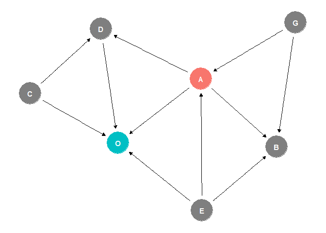<!-- -->

Let’s plot all the open paths with no conditioning.

``` r
ggdag_paths(dag, node_size = 6) + theme_dag() + theme(legend.position = "none")
```

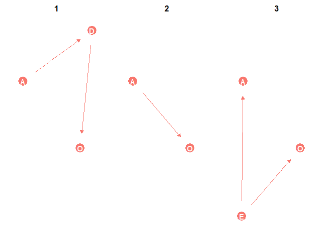<!-- -->

Let’s assume that we want to estimate the direct causal effect of $`A`$.
Hence, we need to block the path by conditioning on the mediator $`D`$.
We also need to condition on the confounder $`E`$.

``` r
ggdag_paths(dag, adjust_for = c("D", "E"), node_size = 6) + theme_dag()
```

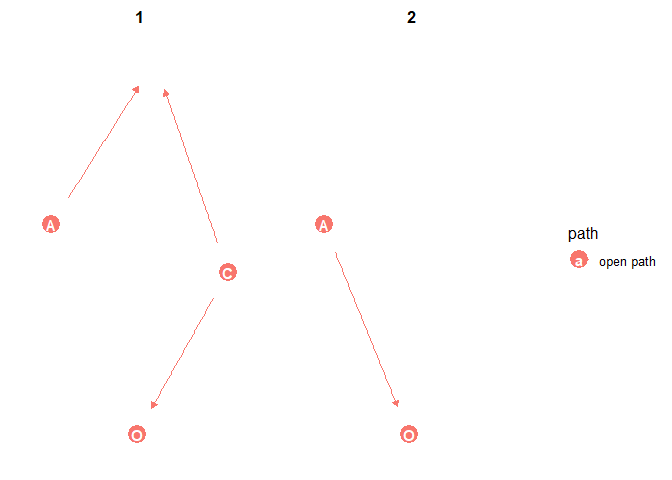<!-- -->

We observe that a new path opened up. This is because $`D`$ also acts as
a collider and by conditioning on it we opened a new path through $`C`$.
Hence, let us also condition on $`C`$.

``` r
ggdag_paths(dag, adjust_for = c("D", "E", "C"), node_size = 6) + theme_dag()
```

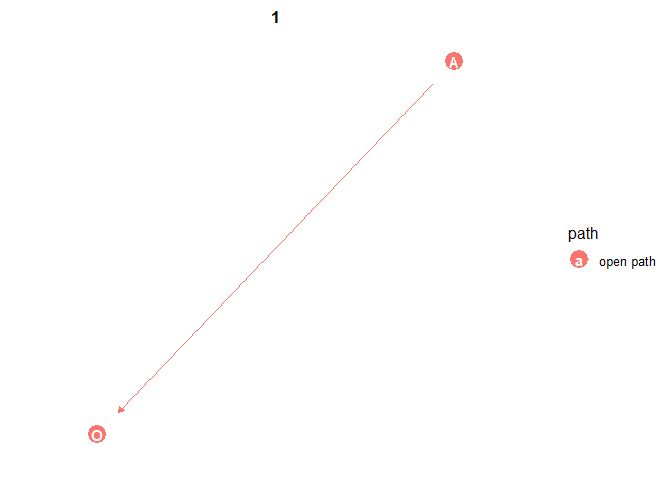<!-- -->

## Back-Door Criterion

To conclude, we will use what we learned about opening and blocking the
paths to estimate the causal effect by blocking non-causal associations.
We know from the First Part that we want condition is such a way that
``` math
 P(O \mid \text{do}(A), \mathcal{B}) = P(O \mid A, \mathcal{B}),
```
where we can model $`P(O \mid A, \mathcal{B})`$ using standard
statistical means, e.g., linear regression. Provided that the equation
above holds for some observed $`\mathcal{B}`$, the causal effect is
called identifiable.

There are two main criteria to ensure that the causal effect is
identifiable using a DAG. The first is known as the *back-door
criterion* (Peters et al. 2017).

*A set of variables $`\mathcal{Z}`$, satisfies the back-door criterion,
given a DAG $`\mathcal{G}`$ for the treatment $`A`$ and the outcome
$`O`$, if no node of $`\mathcal{Z}`$ is a descendant of $`A`$ and
$`\mathcal{Z}`$ blocks all the paths between $`A`$ and $`O`$ that
contain an arrow into $`A`$ (the back-door path).*

Let us return to the DAG

``` r
dag <- dagify(O ~ A + C + D + E, D ~ A  + C, B ~ A + E + G, A ~ E + G, exposure = 'A', outcome = 'O')
ggdag_status(dag) + theme_dag() + theme(legend.position = "none")
```

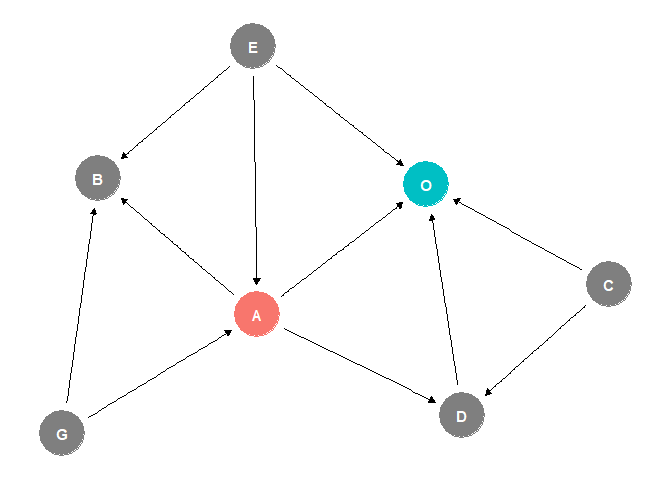<!-- -->

There is a back-door path into $`A`$ from $`E`$, and hence we must
condition on $`E`$.

``` r
isAdjustmentSet(dag, Z = c("E"), exposure = "A", outcome = "O")
```

    ## [1] TRUE

``` r
ggdag_adjustment_set(dag) + theme_dag()
```

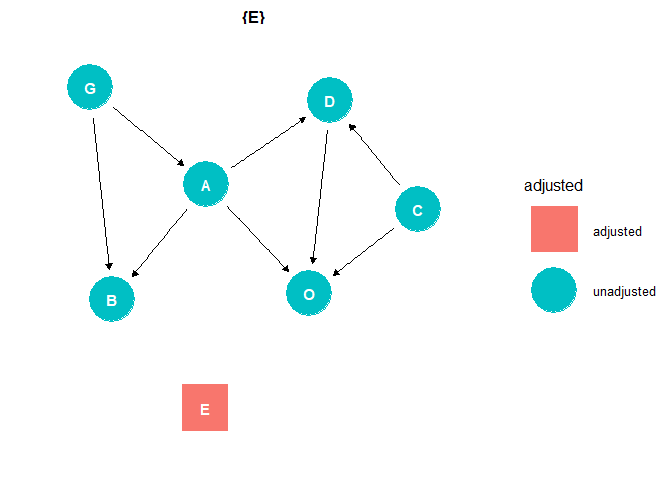<!-- -->

Let’s simulate some data.

``` r
set.seed(123)
C <- rnorm(10000, 0, 2)
G <- rnorm(10000, 0, 2)
E <- rnorm(10000, 0, 2)

A <- G + E + rnorm(10000, 0, 1)
D <- A + C + rnorm(10000, 0, 1)
B <- A + G + E + rnorm(10000, 0, 1)

O <- C + D + E + A + rnorm(10000, 0, 1)
```

The naive estimate of the causal effect is biased due to confounding.

``` r
summary(lm(O ~ A ))
```

    ## 
    ## Call:
    ## lm(formula = O ~ A)
    ## 
    ## Residuals:
    ##      Min       1Q   Median       3Q      Max 
    ## -17.0312  -3.0389  -0.0859   3.0646  16.8377 
    ## 
    ## Coefficients:
    ##             Estimate Std. Error t value Pr(>|t|)    
    ## (Intercept)  0.01053    0.04521   0.233    0.816    
    ## A            2.46105    0.01516 162.285   <2e-16 ***
    ## ---
    ## Signif. codes:  0 '***' 0.001 '**' 0.01 '*' 0.05 '.' 0.1 ' ' 1
    ## 
    ## Residual standard error: 4.521 on 9998 degrees of freedom
    ## Multiple R-squared:  0.7248, Adjusted R-squared:  0.7248 
    ## F-statistic: 2.634e+04 on 1 and 9998 DF,  p-value: < 2.2e-16

Let’s condition on $`E`$.

``` r
summary(lm(O ~ A + E ))
```

    ## 
    ## Call:
    ## lm(formula = O ~ A + E)
    ## 
    ## Residuals:
    ##      Min       1Q   Median       3Q      Max 
    ## -17.3979  -2.8338  -0.0155   2.8904  15.8371 
    ## 
    ## Coefficients:
    ##             Estimate Std. Error t value Pr(>|t|)    
    ## (Intercept) 0.007867   0.042442   0.185    0.853    
    ## A           1.998102   0.019013 105.091   <2e-16 ***
    ## E           1.040586   0.028329  36.732   <2e-16 ***
    ## ---
    ## Signif. codes:  0 '***' 0.001 '**' 0.01 '*' 0.05 '.' 0.1 ' ' 1
    ## 
    ## Residual standard error: 4.244 on 9997 degrees of freedom
    ## Multiple R-squared:  0.7576, Adjusted R-squared:  0.7575 
    ## F-statistic: 1.562e+04 on 2 and 9997 DF,  p-value: < 2.2e-16

Our estimate of the causal effect is now unbiased. We should note that
this is just a *minimally sufficient adjustment set*. We can adjust for
more variables provided that the back-door criterion is met.

``` r
isAdjustmentSet(dag, Z = c("E", "C", "G"), exposure = "A", outcome = "O")
```

    ## [1] TRUE

``` r
summary(lm(O ~ A + E + C + G))
```

    ## 
    ## Call:
    ## lm(formula = O ~ A + E + C + G)
    ## 
    ## Residuals:
    ##     Min      1Q  Median      3Q     Max 
    ## -5.6714 -0.9382  0.0100  0.9472  5.1688 
    ## 
    ## Coefficients:
    ##              Estimate Std. Error t value Pr(>|t|)    
    ## (Intercept)  0.016918   0.014200   1.191    0.233    
    ## A            2.018930   0.014216 142.020   <2e-16 ***
    ## E            0.979959   0.015774  62.125   <2e-16 ***
    ## C            2.002765   0.007112 281.607   <2e-16 ***
    ## G           -0.020446   0.015842  -1.291    0.197    
    ## ---
    ## Signif. codes:  0 '***' 0.001 '**' 0.01 '*' 0.05 '.' 0.1 ' ' 1
    ## 
    ## Residual standard error: 1.42 on 9995 degrees of freedom
    ## Multiple R-squared:  0.9729, Adjusted R-squared:  0.9729 
    ## F-statistic: 8.96e+04 on 4 and 9995 DF,  p-value: < 2.2e-16

The result shows why we might want to condition more than is required.
Notice that since we introduced more variables (and explained more of
the residual variance), the standard error for the estimate of $`A`$
dropped. Our estimate of the causal effect becomes more accurate.

## Front-Door Criterion

To successfully apply the back-door criterion, we need to observe all
confounders so we can condition on them. However, sometimes we might
know about the existence of a confounder but be unable to observe it.
Then, we can still use a DAG. Let’s assume the following structure.

``` r
dag <- dagify(O ~ B + C, B ~ A + D, A ~ C, exposure = 'A', outcome = 'O')
ggdag_status(dag) + theme_dag() + theme(legend.position = "none")
```

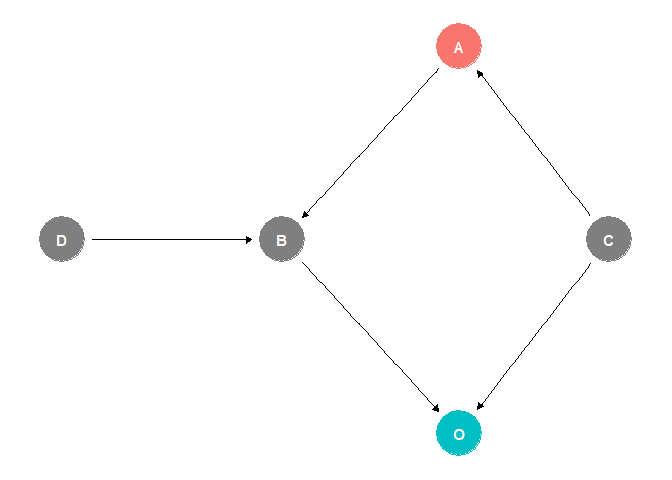<!-- -->

There is an (unobserved) confounder $`C`$, and thus we cannot estimate
the causal effect of $`A`$. However, $`A`$ has a single descendant that
serves as a mediator, and there is no direct path from $`C`$ into $`B`$.
Hence, we can first estimate the causal effect of $`A`$ on $`B`$. Then
we estimate the actual effect of $`B`$ on the outcome. Notice that there
is still a back-door path into $`B`$ from $`O`$ across $`C`$ and $`A`$.
But we can block this path by conditioning on $`A`$! Finally, provided
that we assume simple linear models, we get the causal effect of $`A`$
by multiplying the causal effect of $`A`$ on $`B`$ by the causal effect
of $`B`$ on $`O`$.

In a more general case in which we know the marginal density $`p(a)`$,
conditional marginal densities $`p(b \mid a)`$ and $`p(o \mid a,b)`$, we
compute the causal effect $`p(o \mid \text{do}(a))`$ as (Molak 2023)

``` math
p(o \mid \text{do}(a)) = \int_B p(b\mid a) p(y \mid b)\text{ db} =  \int_B p(b \mid a) \left(\int_A p(y \mid b,a')p(a')\text{ d}a'\right)\text{ db}.
```

Let’s simulate an example.

``` r
set.seed(123)

C <- rnorm(10000, 0, 2)
D <- rnorm(10000, 0, 2)

A <- C + rnorm(10000, 0, 1)
B <- 2.5*A - D + rnorm(10000, 0, 1)

O <- 2*B - C + rnorm(10000, 0, 1)
```

Due to confounding, the direct estimation is biased.

``` r
summary(lm(O ~ A))
```

    ## 
    ## Call:
    ## lm(formula = O ~ A)
    ## 
    ## Residuals:
    ##     Min      1Q  Median      3Q     Max 
    ## -17.839  -3.175   0.025   3.170  18.788 
    ## 
    ## Coefficients:
    ##             Estimate Std. Error t value Pr(>|t|)    
    ## (Intercept)  0.03607    0.04687    0.77    0.442    
    ## A            4.17977    0.02082  200.78   <2e-16 ***
    ## ---
    ## Signif. codes:  0 '***' 0.001 '**' 0.01 '*' 0.05 '.' 0.1 ' ' 1
    ## 
    ## Residual standard error: 4.687 on 9998 degrees of freedom
    ## Multiple R-squared:  0.8013, Adjusted R-squared:  0.8013 
    ## F-statistic: 4.031e+04 on 1 and 9998 DF,  p-value: < 2.2e-16

We assume that the confounder $`C`$ is unobserved. However, we can use
the front-door criterion thanks to the mediator $`B`$. Hence, we first
estimate the causal effect of $`A`$ on $`B`$.

``` r
summary(lm(B ~ A))
```

    ## 
    ## Call:
    ## lm(formula = B ~ A)
    ## 
    ## Residuals:
    ##    Min     1Q Median     3Q    Max 
    ## -9.042 -1.536  0.016  1.522  9.095 
    ## 
    ## Coefficients:
    ##             Estimate Std. Error t value Pr(>|t|)    
    ## (Intercept) 0.012799   0.022446    0.57    0.569    
    ## A           2.485699   0.009969  249.34   <2e-16 ***
    ## ---
    ## Signif. codes:  0 '***' 0.001 '**' 0.01 '*' 0.05 '.' 0.1 ' ' 1
    ## 
    ## Residual standard error: 2.245 on 9998 degrees of freedom
    ## Multiple R-squared:  0.8615, Adjusted R-squared:  0.8615 
    ## F-statistic: 6.217e+04 on 1 and 9998 DF,  p-value: < 2.2e-16

Then, we estimate the causal effect of $`B`$ on the outcome $`O`$ (we
have to remember to condition on $`A`$!).

``` r
summary(lm(O ~ B + A))
```

    ## 
    ## Call:
    ## lm(formula = O ~ B + A)
    ## 
    ## Residuals:
    ##     Min      1Q  Median      3Q     Max 
    ## -4.6819 -0.8993 -0.0022  0.8901  5.3961 
    ## 
    ## Coefficients:
    ##              Estimate Std. Error t value Pr(>|t|)    
    ## (Intercept)  0.010455   0.013380   0.781    0.435    
    ## B            2.001331   0.005962 335.707   <2e-16 ***
    ## A           -0.794933   0.015966 -49.790   <2e-16 ***
    ## ---
    ## Signif. codes:  0 '***' 0.001 '**' 0.01 '*' 0.05 '.' 0.1 ' ' 1
    ## 
    ## Residual standard error: 1.338 on 9997 degrees of freedom
    ## Multiple R-squared:  0.9838, Adjusted R-squared:  0.9838 
    ## F-statistic: 3.037e+05 on 2 and 9997 DF,  p-value: < 2.2e-16

The correct estimate of the causal effect of $`A`$ is a simple
multiplication of the computed coefficients.

``` r
coef(lm(B ~ A))[2]*coef(lm(O ~ B + A))[2]
```

    ##        A 
    ## 4.974707

We demonstrated the open-door criterion for one mediator. But the
criterion will work for the whole set of mediators provided they
intercept all paths from $`A`$ to $`O`$ (Molak 2023).

``` r
dag <- dagify(O ~ B1 + B2 + B3 + C, B1 ~ A, B2 ~ A, B3 ~ A, A ~ C, exposure = 'A', outcome = 'O')
ggdag_status(dag) + theme_dag() + theme(legend.position = "none")
```

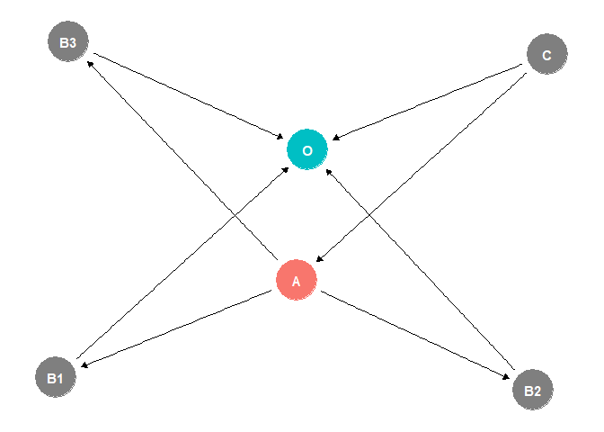<!-- -->

``` r
set.seed(123)

C <- rnorm(10000, 0, 2)
A <- C + rnorm(10000, 0, 1)

B1 <- 5*A + rnorm(10000, 0, 1)
B2 <- -3*A + rnorm(10000, 0, 1)
B3 <- 2*A + rnorm(10000, 0, 1)

O <- B1 - B2 + B3 - C + rnorm(10000, 0, 1)
```

The expected causal effect of $`A`$ on $`O`$ is 10. Let us apply the
front-door criterion.

``` r
coef(lm(B1 ~ A))[2]*coef(lm(O ~ B1 + A))[2] + coef(lm(B2 ~ A))[2]*coef(lm(O ~ B2 + A))[2] + coef(lm(B3 ~ A))[2]*coef(lm(O ~ B3 + A))[2]
```

    ##        A 
    ## 10.10757

It might seem after Part Two that we are done. We simply need to
construct a DAG and perform correct conditioning based on the given
rules. But the DAG works only when it is correctly specified, and we
rarely can be sure of that in practice. There might be hidden
confounders that we did not even think to put into a DAG, and we cannot
just assume unobserved confounders *everywhere*, since then we would not
be able to estimate *anything*. So no, we are not done, not even close …

## References

<div id="refs" class="references csl-bib-body hanging-indent">

<div id="ref-molak2023causal" class="csl-entry">

Molak, Aleksander. 2023. *Causal Inference and Discovery in Python*.
Packt Publishing Birmingham.

</div>

<div id="ref-peters2017elements" class="csl-entry">

Peters, Jonas, Dominik Janzing, and Bernhard Schölkopf. 2017. *Elements
of Causal Inference: Foundations and Learning Algorithms*. The MIT
press.

</div>

</div>
