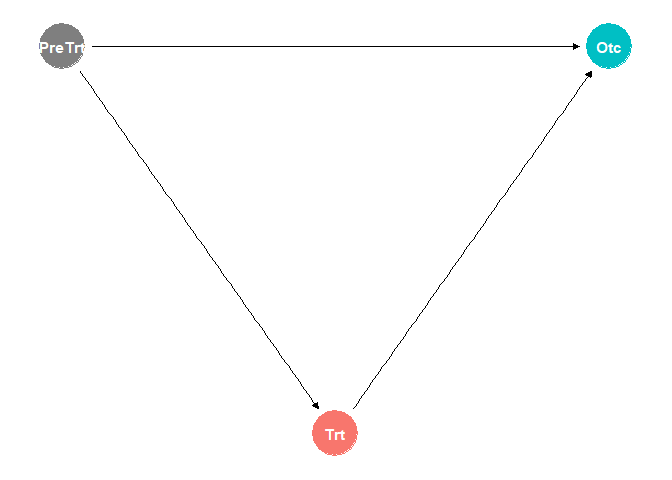
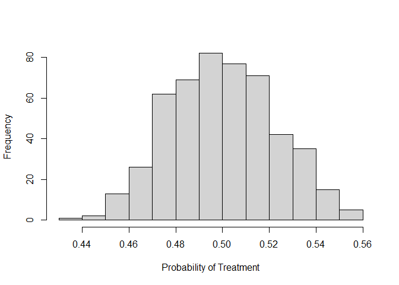
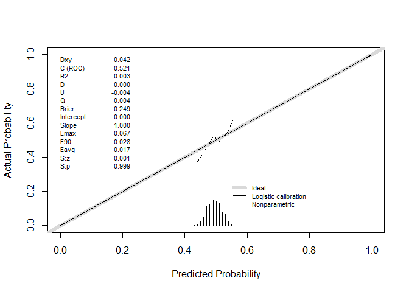
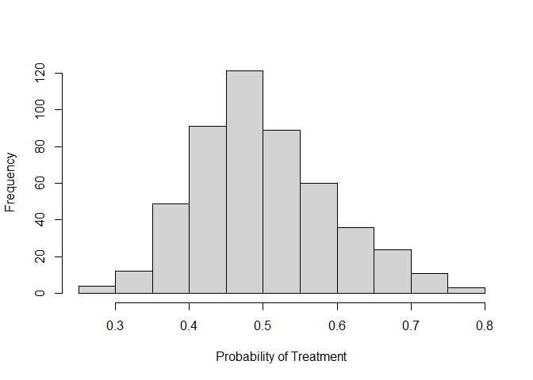
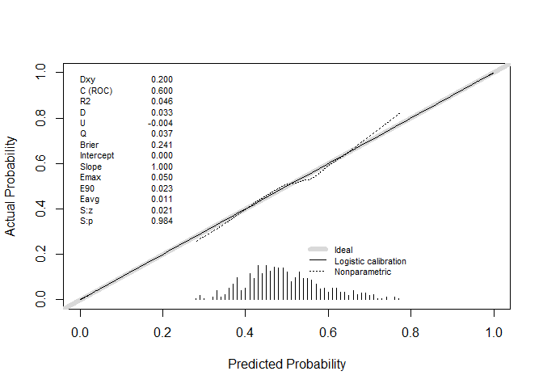
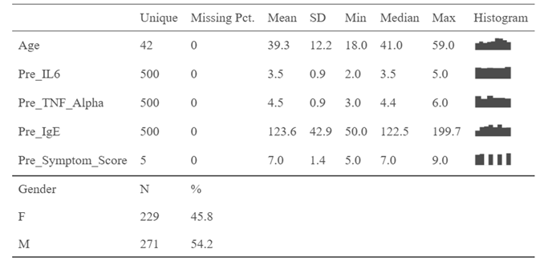
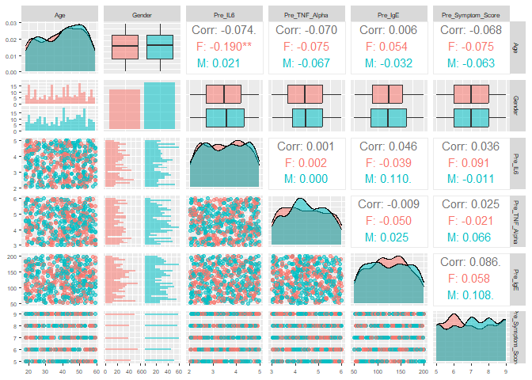
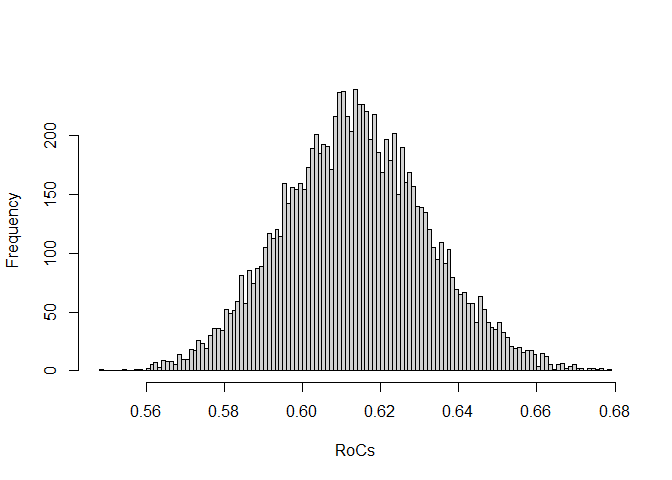
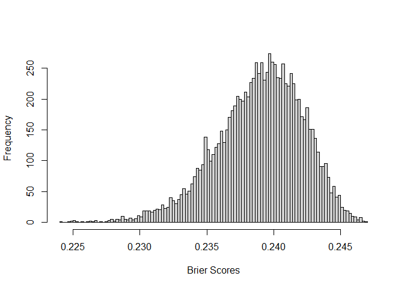
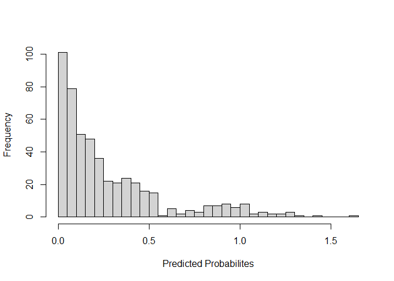

# The First Casualty of Statistics: Part Three
<big>**Randomized Experiment**</big>

<br/>
Jiří Fejlek

2026-08-11
<br/>


---
author: Jiří Fejlek
bibliography: first_casualty.bib
code_folding: hide
date: 2025-08-10
output:
  md_document:
    toc: true
    variant: GFM
title: "The First Casualty of Statistics: Part Three"
---
## Table of Contents

- [Potential Outcomes](#potential-outcomes)
- [Randomized Experiment](#randomized-experiment)
- [Transcranial Direct Current Stimulation (tCDS)
  Dataset](#transcranial-direct-current-stimulation-tcds-dataset)
- [Limitations of Randomized
  Experiments](#limitations-of-randomized-experiments)


``` r
library(tidyr)
library(dplyr)
library(ggplot2)
library(patchwork)
library(dagitty)
library(ggdag)
```

In the Third Part of this series, we take a step back and look at the
problem of causal inference from a different viewpoint: potential
outcomes and counterfactuals. We will also introduce a randomized
experiment, a gold-standard experimental design used for estimating
causal effects.

## Potential Outcomes

Let’s assume an individual who either receives or does not receive a
treatment $`T`$. If the individual receives the treatment, we observe
the outcome $`Y_i(1)`$. If the individual does not receive the
treatment, we observe the outcome $`Y_i(0)`$. We will also assume the
stable unit treatment value assumption (SUTVA): the outcomes for the
individual depend only on its own the treatment status of that unit and
not on the treatment status of any other unit and that the treatments
are administered uniformly without hidden variations (this might not be
true in general, e.g., an add can influence not only the individual who
sees but its influence can spill over to also his friends) (Chernozhukov
et al. 2024).

The individual treatment effect is
``` math
 Y_i(1) - Y_i(0).
```
Of course, there is a big weakness in evaluating the individual
treatment effect: the *fundamental problem of causal inference*. We can
never observe the same individual with and without treatment. The
individual either received the treatment or not, i.e., we observe
$`Y(1)`$ *or* $`Y(0)`$. One outcome is observed, but the second outcome
is a potential outcome that would have happened, but it did not. This
second potential outcome is known as a *counterfactual* (Chernozhukov et
al. 2024).

Since the individual treatment effects are often intangible, we can
instead look at the whole population and try to estimate the *average
treatment effect* (ATE)
``` math
 \text{ATE} = \mathbb{E}(Y(1)- Y(0))
```
or the *average treatment effect on the treated* (ATT)
``` math
 \text{ATT} = \mathbb{E}(Y(1)- Y(0) \mid  T = 1).
```
There is also *average treatment effect on the untreated* (ATU)
(Cunningham 2021)
``` math
 \text{ATU} = \mathbb{E}(Y(1)- Y(0) \mid  T = 0).
```
Let’s simulate some simple data in which the counterfactuals are
actually observed

``` r
set.seed(123)
trt_effect_table <- data.frame(i = seq(1,500), Treatment = round(runif(500)), Y0 = round(10*runif(500)-5), Y1 = round(10*runif(500) -3))
trt_effect_table
```

    ##       i Treatment Y0 Y1
    ## 1     1         0 -1  0
    ## 2     2         1 -1  3
    ## 3     3         0 -2 -1
    ## 4     4         1 -4  6
    ## 5     5         1 -1  5
    ## 6     6         0 -3  2
    ## 7     7         1  0  5
    ## 8     8         1  0  0
    ## 9     9         1  4 -2
    ## 10   10         0 -2  1
    ## 11   11         1  0  2
    ## 12   12         0 -4  0
    ## 13   13         1  4 -1
    ## 14   14         1 -1  2
    ## 15   15         0  2 -3
    ## 16   16         1 -3  5
    ## 17   17         0  0  3
    ## 18   18         0  3  3
    ## 19   19         0 -4  2
    ## 20   20         1  3  0

and thus, we can compute ATE, ATT, and ATU directly.

``` r
# ATE
mean(trt_effect_table$Y1 - trt_effect_table$Y0)
```

    ## [1] 1.916

``` r
# ATT
mean(trt_effect_table$Y1[trt_effect_table$Treatment == 1] - trt_effect_table$Y0[trt_effect_table$Treatment == 1] )
```

    ## [1] 1.817021

``` r
# ATU
mean(trt_effect_table$Y1[trt_effect_table$Treatment == 0] - trt_effect_table$Y0[trt_effect_table$Treatment == 0] )
```

    ## [1] 2.003774

We observe that all three values correspond to the actual effect of the
treatment (in our simple example, ATE = ATT = ATU since the group that
actually received the treatment and the group that did not behave the
same).

In practice, we would not observe the counterfactuals; therefore, our
dataset would look like this.

``` r
trt_effect_table$Y1[trt_effect_table$Treatment== 0] <- NA
trt_effect_table$Y0[trt_effect_table$Treatment == 1] <- NA
trt_effect_table
```

    ##       i Treatment Y0 Y1
    ## 1     1         0 -1 NA
    ## 2     2         1 NA  3
    ## 3     3         0 -2 NA
    ## 4     4         1 NA  6
    ## 5     5         1 NA  5
    ## 6     6         0 -3 NA
    ## 7     7         1 NA  5
    ## 8     8         1 NA  0
    ## 9     9         1 NA -2
    ## 10   10         0 -2 NA
    ## 11   11         1 NA  2
    ## 12   12         0 -4 NA
    ## 13   13         1 NA -1
    ## 14   14         1 NA  2
    ## 15   15         0  2 NA
    ## 16   16         1 NA  5
    ## 17   17         0  0 NA
    ## 18   18         0  3 NA
    ## 19   19         0 -4 NA
    ## 20   20         1 NA  0
 
We see that, in some sense, the causal inference is a problem with
*missing* data.

Since we cannot compute observed ATE/ATT/ATU directly, we might be
tempted to write
``` math
\text{ATE} = \mathbb{E}(Y(1)- Y(0)) = \mathbb{E}Y(1) - \mathbb{E}Y(0),
```
which we could consider estimating using the observed data by computing
the so-called *average predictive effect* (Chernozhukov et al. 2024)
``` math
 \text{APE} = \mathbb{E}(Y \mid T = 1) - \mathbb{E}(Y \mid T = 0).
```
Can we do that? Well, it turns out that (Cunningham 2021)
``` math
 \text{APE} = \text{ATE} + \text{selection bias} + \text{heterogenous treatement bias},
```
where
``` math
 \text{selection bias} = \mathbb{E}(Y(0)\mid T = 1) -\mathbb{E}(Y(0)\mid T = 0)
```
and where ($`\pi`$ denotes the expected proportion of those that receive
treatment)
``` math
\text{heterogenous treatement bias} = (1-\pi)(\text{ATT} - \text{ATU}).
```

Thus, provided that the bias terms are zero, we can estimate ATE from
the observed data. If we do not want to estimate ATE and we need just
ATT, the formula simplifies a bit
(<https://matheusfacure.github.io/python-causality-handbook/01-Introduction-To-Causality.html>)

``` math
 
\begin{split}
\text{APE} = \mathbb{E}(Y \mid T = 1) - \mathbb{E}(Y \mid T = 0)   &= \mathbb{E}(Y(1) \mid T = 1) - \mathbb{E}(Y(0) \mid T = 0) \\
& = \mathbb{E}(Y(1)-Y(0) \mid T = 1) + \left(\mathbb{E}(Y(0)\mid T = 1) -\mathbb{E}(Y(0)\mid T = 0)\right)\\
& = \text{ATT} + \text{selection bias}. 
\end{split}
```
In other words, provided that there is no selection bias
($`\mathbb{E}(Y(0)\mid T = 1) -\mathbb{E}(Y(0)\mid T = 0)`$), we can
estimate ATT from APE. The selection bias expresses the difference in
outcomes between the treatment group and the untreated group (the
control group), provided that no treatment would be applied. And if we
further assume that the expected effect of the treatment is the same for
both groups (ATT = ATU), then APE also estimates ATE.

## Randomized Experiment

We learned that we can use APE to estimate the causal effect provided
that there is no bias. A straightforward way to remove bias is by
balancing the treatment group and the control group via a random
assignment of the treatment
``` math
 T \perp (Y(0),Y(1)),
```
i.e., the treatment is independent of potential outcomes. This is the
case in our simple example, and hence, the APE works well.

``` r
mean(trt_effect_table$Y1[trt_effect_table$Treatment == 1] - trt_effect_table$Y0[trt_effect_table$Treatment == 0] )
```

    ## [1] 1.924528

However, let us assume a simple example in which we assign treatment
based on the pre-treatment status (we will assign treatment to those for
which the pre-treatment effect is less than zero).

``` r
set.seed(123)
pre_treat_effect = rnorm(1000, 0, 2.5) # pre-treatment effect
treatment = as.numeric(pre_treat_effect<0) # treatment
post_treat_effect = pre_treat_effect + rnorm(1000,0, 0.5) + 2*treatment # treatment effect
  
  
trt_effect_table <- data.frame(
  pre_treat_effect = pre_treat_effect,
  treatment = treatment,
  post_treat_effect = post_treat_effect
)

trt_effect_table
```

    ##      pre_treat_effect treatment post_treat_effect
    ## 1        -1.401189116         1       0.100911521
    ## 2        -0.575443724         1       0.904578754
    ## 3         3.896770785         0       3.887780665
    ## 4         0.176270979         0       0.110183412
    ## 5         0.323219338         0      -0.951452049
    ## 6         4.287662467         0       4.807949195
    ## 7         1.152290515         0       1.277153383
    ## 8        -3.162653087         1       0.045450600
    ## 9        -1.717132130         1       0.625466989
    ## 10       -1.114154925         1       0.662365420
    ## 11        3.060204494         0       4.458900067
    ## 12        0.899534568         0       2.315647580
    ## 13        1.001928626         0       0.392572718
    ## 14        0.276706790         0       0.511222768
    ## 15       -1.389602837         1       0.504773704
    ## 16        4.467282842         0       4.560808415
    ## 17        1.244626196         0       1.358397560
    ## 18       -4.916542892         1      -3.547493123
    ## 19        1.753389754         0       1.896184544
    ## 20       -1.181978519         1       1.692645162

If we naively estimate the treatment effect, we get a biased result (in
our case, the sign is even opposite).

``` r
mean(trt_effect_table$post_treat_effect[trt_effect_table$treatment == 1]) - mean(trt_effect_table$post_treat_effect[trt_effect_table$treatment == 0])
```

    ## [1] -2.003092

We can get the identical estimate using the regression.

``` r
summary(lm(post_treat_effect ~ treatment, data = trt_effect_table))
```

    ## 
    ## Call:
    ## lm(formula = post_treat_effect ~ treatment, data = trt_effect_table)
    ## 
    ## Residuals:
    ##    Min     1Q Median     3Q    Max 
    ## -6.137 -1.120 -0.025  1.109  6.002 
    ## 
    ## Coefficients:
    ##             Estimate Std. Error t value Pr(>|t|)    
    ## (Intercept)   2.0431     0.0719   28.41   <2e-16 ***
    ## treatment    -2.0031     0.1022  -19.60   <2e-16 ***
    ## ---
    ## Signif. codes:  0 '***' 0.001 '**' 0.01 '*' 0.05 '.' 0.1 ' ' 1
    ## 
    ## Residual standard error: 1.616 on 998 degrees of freedom
    ## Multiple R-squared:  0.2779, Adjusted R-squared:  0.2772 
    ## F-statistic: 384.2 on 1 and 998 DF,  p-value: < 2.2e-16

In this simple example, the solution to this bias is actually pretty
simple, since the pre-treatment effect serves as a confounder.

``` r
dag <- dagify(Otc ~ Trt + PreTrt, Trt~PreTrt,  exposure = 'Trt', outcome = 'Otc')
ggdag_status(dag) + theme_dag() + theme(legend.position = "none")
```

<!-- -->

Thus, all we need to do is condition on it.

``` r
summary(lm(post_treat_effect ~ treatment + pre_treat_effect, data = trt_effect_table))
```

    ## 
    ## Call:
    ## lm(formula = post_treat_effect ~ treatment + pre_treat_effect, 
    ##     data = trt_effect_table)
    ## 
    ## Residuals:
    ##      Min       1Q   Median       3Q      Max 
    ## -1.50980 -0.34723  0.00148  0.35717  1.64114 
    ## 
    ## Coefficients:
    ##                  Estimate Std. Error t value Pr(>|t|)    
    ## (Intercept)       0.02989    0.03063   0.976    0.329    
    ## treatment         1.98131    0.05219  37.964   <2e-16 ***
    ## pre_treat_effect  1.01462    0.01053  96.354   <2e-16 ***
    ## ---
    ## Signif. codes:  0 '***' 0.001 '**' 0.01 '*' 0.05 '.' 0.1 ' ' 1
    ## 
    ## Residual standard error: 0.5034 on 997 degrees of freedom
    ## Multiple R-squared:   0.93,  Adjusted R-squared:  0.9298 
    ## F-statistic:  6621 on 2 and 997 DF,  p-value: < 2.2e-16

Of course, the correction would not be as easy in practice, since there
would probably be some hidden confounders lurking around.

The estimate we compute here is known as *conditional average treatment
effect* (CATE) (Chernozhukov et al. 2024). Provided that we perform a
randomized experiment, the treatment needs to be independent of both
potential outcomes and pre-determined covariates $`X`$, i.e.,
``` math
 T \perp (Y(0), Y(1), X).
```
Then (Chernozhukov et al. 2024),
``` math
 \text{CATE} = \mathbb{E}(Y(1)-Y(0)\mid X) = \mathbb{E}(Y\mid T = 1, X) - \mathbb{E}(Y\mid T = 0, X).
```

It might be tempting to use so-called *post-treatment* covariates.
However, treatment may have a causal effect on these, and hence the
independence assumption is violated; this means that the post-treatment
effects may be mediators and (worse) colliders.

We should note that since we randomize the treatment with respect to
covariates $`X`$, the distribution of covariates should be the same
under both the treated group and the control group. We can test this
randomization of the treatment with respect to $`X`$ via a regression
$`T \sim X`$ (Chernozhukov et al. 2024).

## Transcranial Direct Current Stimulation (tCDS) Dataset

Let us consider a randomized experiment
<https://www.kaggle.com/datasets/ziya07/randomized-controlled-trial-dataset>,
in which the effects of Transcranial Direct Current Stimulation (tCDS)
on neuroimmune pathways and symptom relief in individuals with Allergic
Rhinitis were investigated. The study evaluates how tDCS influences
cytokine levels (IL-6, TNF-Alpha, IgE), symptom scores, and overall
patient response compared to a sham (placebo) group.

The variables are as follows.

- Intervention: tDCS (1.5 mA, 20 min, Anodal/Cathodal) vs Sham (Placebo)
- Measured Biomarkers: IL-6, TNF-Alpha, IgE (Pre & Post)
- Symptom Scores: Baseline, 24-hour, and 7-day assessments

``` r
tDCS <- read.csv("C:/Users/elini/Desktop/first casualty/RCT_tDCS_Allergic_Rhinitist.csv")
tDCS
```

    ##     Subject_ID Age Gender Group Current_mA Duration_min Polarity  Pre_IL6
    ## 1         P001  56      M  tDCS        1.5           20 Cathodal 4.539357
    ## 2         P002  46      F  Sham        0.0            0        - 2.382466
    ## 3         P003  32      M  tDCS        1.5           20   Anodal 3.191862
    ## 4         P004  25      M  tDCS        1.5           20 Cathodal 4.391886
    ## 5         P005  38      M  tDCS        1.5           20 Cathodal 2.449752
    ## 6         P006  56      M  tDCS        1.5           20   Anodal 2.687754
    ## 7         P007  36      M  Sham        0.0            0        - 4.166758
    ## 8         P008  40      M  tDCS        1.5           20   Anodal 4.160110
    ## 9         P009  28      M  tDCS        1.5           20   Anodal 3.923443
    ## 10        P010  28      F  Sham        0.0            0        - 4.081845
    ## 11        P011  41      M  Sham        0.0            0        - 3.628173
    ## 12        P012  53      M  Sham        0.0            0        - 2.755397
    ## 13        P013  57      F  tDCS        1.5           20 Cathodal 3.037088
    ## 14        P014  41      F  tDCS        1.5           20   Anodal 2.544793
    ## 15        P015  20      F  Sham        0.0            0        - 4.725352
    ## 16        P016  39      M  tDCS        1.5           20 Cathodal 3.750175
    ## 17        P017  19      F  Sham        0.0            0        - 3.202554
    ## 18        P018  41      M  tDCS        1.5           20   Anodal 3.386017
    ## 19        P019  47      M  tDCS        1.5           20 Cathodal 4.841850
    ## 20        P020  55      M  Sham        0.0            0        - 2.460054
    ##      Post_IL6 Pre_TNF_Alpha Post_TNF_Alpha   Pre_IgE  Post_IgE
    ## 1   3.2953506      4.153534       3.314133 185.36195 175.11527
    ## 2   4.5179699      4.463001       5.565585 101.59365  73.88862
    ## 3   0.6635218      4.956673       3.343338 159.95002  95.23504
    ## 4   2.1546175      5.851593       3.303614 148.79920 123.52440
    ## 5   1.4993836      4.801953       2.977060 189.73324 110.71002
    ## 6   1.5380003      5.230782       1.788374 173.14715 100.20731
    ## 7   5.0475084      4.518798       3.594268 134.99079 102.25176
    ## 8   1.6728160      4.902312       3.502997 148.55457  54.20030
    ## 9   2.1557929      3.212797       2.335998 184.75797  94.09002
    ## 10  3.8621525      3.763175       3.240196 109.92782  74.74006
    ## 11  4.2877473      4.085559       5.567637  99.01921 161.09047
    ## 12  3.7712415      4.417480       6.114572  51.62166  84.10239
    ## 13  0.8921111      3.136946       3.996869 173.98266  42.95757
    ## 14  1.8200300      3.420072       4.595045 170.14711 114.50703
    ## 15  3.7321585      3.830443       3.741071  65.66818 141.16879
    ## 16  1.1269298      5.914598       4.994055 136.52861 153.26886
    ## 17  3.1746675      3.994041       3.751485 119.59725 141.07374
    ## 18  1.5329573      4.446123       4.452515  67.80636  81.96299
    ## 19  1.2173275      3.588293       5.280985 197.08523 153.84866
    ## 20  3.2208036      4.832340       5.148563  82.20438 131.57584
    ##     Pre_Symptom_Score Post_tDCS_Symptom_Score X24_Hour_Symptom_Score
    ## 1                   8                       5                      5
    ## 2                   8                       6                      6
    ## 3                   8                       5                      6
    ## 4                   8                       3                      4
    ## 5                   7                       3                      8
    ## 6                   9                       4                      7
    ## 7                   8                       6                      8
    ## 8                   5                       2                      5
    ## 9                   8                       6                      6
    ## 10                  9                       9                      9
    ## 11                  8                       8                      5
    ## 12                  7                       8                      5
    ## 13                  6                       2                      5
    ## 14                  6                       1                      4
    ## 15                  9                       5                      5
    ## 16                  6                       5                      7
    ## 17                  6                       5                      6
    ## 18                  5                       7                      7
    ## 19                  9                       6                      6
    ## 20                  9                       9                      9
    ##     X7_Day_Symptom_Score Response
    ## 1                      6        0
    ## 2                      5        1
    ## 3                      6        0
    ## 4                      4        1
    ## 5                      4        1
    ## 6                      3        1
    ## 7                      9        0
    ## 8                      2        1
    ## 9                      6        0
    ## 10                     7        0
    ## 11                     5        1
    ## 12                     9        0
    ## 13                     3        1
    ## 14                     5        0
    ## 15                     5        1
    ## 16                     7        0
    ## 17                     5        0
    ## 18                     6        0
    ## 19                     2        1
    ## 20                     6        1

For simplicity, we will ignore Polarity in evaluateing the effect of the treatemnt.
Let’s first look at how randomized the treatment actually was. Let’s
regress the treatment on the pre-treatment covariates. Let us try a
logistic model with no interactions first.

``` r
tDCS$Treatment <- as.numeric(tDCS$Group == 'tDCS')
treatment_logistic <- glm(Treatment ~ (Age + Gender + Pre_IL6 + Pre_TNF_Alpha + Pre_IgE + Pre_Symptom_Score), family = binomial(link = "logit"), data = tDCS)
summary(treatment_logistic)
```

    ## 
    ## Call:
    ## glm(formula = Treatment ~ (Age + Gender + Pre_IL6 + Pre_TNF_Alpha + 
    ##     Pre_IgE + Pre_Symptom_Score), family = binomial(link = "logit"), 
    ##     data = tDCS)
    ## 
    ## Coefficients:
    ##                    Estimate Std. Error z value Pr(>|z|)
    ## (Intercept)        0.237008   0.844502   0.281    0.779
    ## Age                0.000433   0.007403   0.058    0.953
    ## GenderM            0.050984   0.179940   0.283    0.777
    ## Pre_IL6            0.036918   0.101932   0.362    0.717
    ## Pre_TNF_Alpha      0.001082   0.103979   0.010    0.992
    ## Pre_IgE           -0.001473   0.002101  -0.701    0.483
    ## Pre_Symptom_Score -0.033204   0.063560  -0.522    0.601
    ## 
    ## (Dispersion parameter for binomial family taken to be 1)
    ## 
    ##     Null deviance: 693.15  on 499  degrees of freedom
    ## Residual deviance: 692.14  on 493  degrees of freedom
    ## AIC: 706.14
    ## 
    ## Number of Fisher Scoring iterations: 3

``` r
hist(predict(treatment_logistic, type='response'), main = '', xlab = 'Probability of Treatment')
```

<!-- -->

``` r
library(rms)
val.prob(predict(treatment_logistic, type='response'),tDCS$Treatment)
```

<!-- -->

    ##           Dxy       C (ROC)            R2             D      D:Chi-sq 
    ##  4.249600e-02  5.212480e-01  2.686114e-03  1.661779e-05  1.008309e+00 
    ##           D:p             U      U:Chi-sq           U:p             Q 
    ##  3.153083e-01 -4.000000e-03 -2.273737e-13  1.000000e+00  4.016618e-03 
    ##         Brier     Intercept         Slope          Emax           E90 
    ##  2.494975e-01  1.504507e-12  1.000000e+00  6.669286e-02  2.752927e-02 
    ##          Eavg           S:z           S:p 
    ##  1.678869e-02  1.240357e-03  9.990103e-01

We observe that no main effect helps with the prediction. Let us try the
model with interactions next.

``` r
tDCS$Treatment <- as.numeric(tDCS$Group == 'tDCS')
treatment_logistic <- glm(Treatment ~ (Age + Gender + Pre_IL6 + Pre_TNF_Alpha + Pre_IgE + Pre_Symptom_Score)^2, family = binomial(link = "logit"), data = tDCS)
summary(treatment_logistic)
```

    ## 
    ## Call:
    ## glm(formula = Treatment ~ (Age + Gender + Pre_IL6 + Pre_TNF_Alpha + 
    ##     Pre_IgE + Pre_Symptom_Score)^2, family = binomial(link = "logit"), 
    ##     data = tDCS)
    ## 
    ## Coefficients:
    ##                                   Estimate Std. Error z value Pr(>|z|)  
    ## (Intercept)                     -8.4020427  5.3621542  -1.567   0.1171  
    ## Age                              0.1213599  0.0682892   1.777   0.0755 .
    ## GenderM                          0.8517654  1.7590895   0.484   0.6282  
    ## Pre_IL6                          0.2415221  0.9016706   0.268   0.7888  
    ## Pre_TNF_Alpha                    1.4263520  0.8537601   1.671   0.0948 .
    ## Pre_IgE                          0.0058693  0.0198164   0.296   0.7671  
    ## Pre_Symptom_Score                0.5410139  0.5460282   0.991   0.3218  
    ## Age:GenderM                      0.0056324  0.0155345   0.363   0.7169  
    ## Age:Pre_IL6                     -0.0026878  0.0088965  -0.302   0.7626  
    ## Age:Pre_TNF_Alpha               -0.0177901  0.0090772  -1.960   0.0500 .
    ## Age:Pre_IgE                      0.0000477  0.0001847   0.258   0.7962  
    ## Age:Pre_Symptom_Score           -0.0057651  0.0055674  -1.036   0.3004  
    ## GenderM:Pre_IL6                 -0.0055055  0.2142337  -0.026   0.9795  
    ## GenderM:Pre_TNF_Alpha           -0.5233187  0.2176348  -2.405   0.0162 *
    ## GenderM:Pre_IgE                 -0.0038138  0.0043649  -0.874   0.3823  
    ## GenderM:Pre_Symptom_Score        0.2594363  0.1317454   1.969   0.0489 *
    ## Pre_IL6:Pre_TNF_Alpha            0.0029873  0.1231433   0.024   0.9806  
    ## Pre_IL6:Pre_IgE                 -0.0011739  0.0025907  -0.453   0.6505  
    ## Pre_IL6:Pre_Symptom_Score        0.0052440  0.0786116   0.067   0.9468  
    ## Pre_TNF_Alpha:Pre_IgE            0.0010027  0.0026003   0.386   0.6998  
    ## Pre_TNF_Alpha:Pre_Symptom_Score -0.0851842  0.0759097  -1.122   0.2618  
    ## Pre_IgE:Pre_Symptom_Score       -0.0009840  0.0014875  -0.662   0.5083  
    ## ---
    ## Signif. codes:  0 '***' 0.001 '**' 0.01 '*' 0.05 '.' 0.1 ' ' 1
    ## 
    ## (Dispersion parameter for binomial family taken to be 1)
    ## 
    ##     Null deviance: 693.15  on 499  degrees of freedom
    ## Residual deviance: 675.62  on 478  degrees of freedom
    ## AIC: 719.62
    ## 
    ## Number of Fisher Scoring iterations: 4

``` r
hist(predict(treatment_logistic, type='response'), main = '', xlab = 'Probability of Treatment')
```

<!-- -->

``` r
val.prob(predict(treatment_logistic, type='response'),tDCS$Treatment)
```

<!-- -->

    ##           Dxy       C (ROC)            R2             D      D:Chi-sq 
    ##  2.003200e-01  6.001600e-01  4.592153e-02  3.304823e-02  1.752411e+01 
    ##           D:p             U      U:Chi-sq           U:p             Q 
    ##  2.836868e-05 -4.000000e-03  0.000000e+00  1.000000e+00  3.704823e-02 
    ##         Brier     Intercept         Slope          Emax           E90 
    ##  2.414759e-01  2.062599e-14  1.000000e+00  4.955131e-02  2.267184e-02 
    ##          Eavg           S:z           S:p 
    ##  1.100432e-02  2.066436e-02  9.835134e-01

The model with interactions is a bit more discriminative, but it is
still quite weak (ROC = 0.6). Let us check the pre-treatment covariates.

``` r
library(modelsummary)
datasummary_skim(tDCS[,c(2,3,8,10,12,14)])
```
<!-- -->

We observe that the covariates are fairly uniform. We can also check the
correlations.

``` r
library(GGally)
pre_treat_cov <- tDCS[,c(2,3,8,10,12,14)]
pre_treat_cov$Gender <- as.factor(pre_treat_cov$Gender)
ggpairs(pre_treat_cov, aes(color = Gender, alpha = 0.5)) + theme(axis.text = element_text(size = 5), strip.text = element_text(size = 6))
```

<!-- -->

We observe very little correlation between covariates. Hence, for
comparison, let us simulate new datasets and perform the regression on
the treatment. We can then check what kind of discrimination we can
expect.

``` r
n_sim <- 10000
ROCs <- numeric(n_sim)
briers <- numeric(n_sim)

for (i in 1:n_sim){
  
  synth_data <- data.frame(
    Treatment = round(runif(500,0,1)),
    Age = runif(500,18,60), 
    Gender = round(runif(500,0,1)), 
    Pre_IL6 = runif(500,2,5), 
    Pre_TNF_Alpha = runif(500,3,6), 
    Pre_IgE = runif(500,50,200),
    Pre_Symptom_Score = round(runif(500,5,9))
    )
  
  treatment_logistic_synth <- glm(Treatment ~ (Age + Gender + Pre_IL6 + Pre_TNF_Alpha + Pre_IgE + Pre_Symptom_Score)^2, family = binomial(link = "logit"), data = synth_data)
  
  scores <- val.prob(predict(treatment_logistic_synth, type='response'),synth_data$Treatment, pl = FALSE)
  
  ROCs[i] <- scores[2]
  briers[i] <-scores[11]
}
```

``` r
hist(ROCs, breaks = 100, main = '', xlab = 'RoCs')
```

<!-- -->

``` r
hist(briers, breaks = 100, main = '', xlab = 'Brier Scores')
```

<!-- -->

We observe that the scores we obtained are perfectly in line with our
simulations.

Let’s estimate the treatment effect on the biomarkers.

``` r
treatment_effects <- matrix(0,3,4)

treatment_effects[1,1] <-  summary(lm(Post_IL6 ~ Treatment, data = tDCS))$coefficients[2, "Estimate"]
treatment_effects[1,2] <-  summary(lm(Post_IL6 ~ Treatment, data = tDCS))$coefficients[2, "Std. Error"]
treatment_effects[1,3] <-  summary(lm(Post_IL6 ~ Treatment + (Age + Gender + Pre_IL6 + Pre_TNF_Alpha + Pre_IgE + Pre_Symptom_Score)^2, data = tDCS))$coefficients[2, "Estimate"]
treatment_effects[1,4] <-  summary(lm(Post_IL6 ~ Treatment + (Age + Gender + Pre_IL6 + Pre_TNF_Alpha + Pre_IgE + Pre_Symptom_Score)^2, data = tDCS))$coefficients[2, "Std. Error"]

treatment_effects[2,1] <-  summary(lm(Post_TNF_Alpha ~ Treatment, data = tDCS))$coefficients[2, "Estimate"]
treatment_effects[2,2] <-  summary(lm(Post_TNF_Alpha ~ Treatment, data = tDCS))$coefficients[2, "Std. Error"]
treatment_effects[2,3] <-  summary(lm(Post_TNF_Alpha ~ Treatment + (Age + Gender + Pre_IL6 + Pre_TNF_Alpha + Pre_IgE + Pre_Symptom_Score)^2, data = tDCS))$coefficients[2, "Estimate"]
treatment_effects[2,4] <-  summary(lm(Post_TNF_Alpha ~ Treatment + (Age + Gender + Pre_IL6 + Pre_TNF_Alpha + Pre_IgE + Pre_Symptom_Score)^2, data = tDCS))$coefficients[2, "Std. Error"]


treatment_effects[3,1] <-  summary(lm(Post_IgE ~ Treatment, data = tDCS))$coefficients[2, "Estimate"]
treatment_effects[3,2] <-  summary(lm(Post_IgE ~ Treatment, data = tDCS))$coefficients[2, "Std. Error"]
treatment_effects[3,3] <-  summary(lm(Post_IgE ~ Treatment + (Age + Gender + Pre_IL6 + Pre_TNF_Alpha + Pre_IgE + Pre_Symptom_Score)^2, data = tDCS))$coefficients[2, "Estimate"]
treatment_effects[3,4] <-  summary(lm(Post_IgE ~ Treatment + (Age + Gender + Pre_IL6 + Pre_TNF_Alpha + Pre_IgE + Pre_Symptom_Score)^2, data = tDCS))$coefficients[2, "Std. Error"]


colnames(treatment_effects) <- c('Estimate', 'SE', 'Estimate (adj.)', 'SE (adj.)')
rownames(treatment_effects) <- c('IL6', 'TNF_Alpha', 'IgE')
treatment_effects
```

    ##             Estimate         SE Estimate (adj.)  SE (adj.)
    ## IL6        -1.173763 0.07989335       -1.174722 0.08195292
    ## TNF_Alpha  -1.125812 0.07830039       -1.149715 0.07909559
    ## IgE       -22.242222 3.86219399      -23.562646 3.90637551

We observe that the results for unadjusted and adjusted treatment
effects are largely similar as expected. Let’s estimate the effect of
treatment on the response (whether the participant showed significant
symptom relief).

``` r
summary(glm(Response ~ Treatment, family = binomial(link = "logit"), data = tDCS))
```

    ## 
    ## Call:
    ## glm(formula = Response ~ Treatment, family = binomial(link = "logit"), 
    ##     data = tDCS)
    ## 
    ## Coefficients:
    ##             Estimate Std. Error z value Pr(>|z|)    
    ## (Intercept)  -1.6883     0.1743  -9.686  < 2e-16 ***
    ## Treatment     1.2995     0.2168   5.994 2.04e-09 ***
    ## ---
    ## Signif. codes:  0 '***' 0.001 '**' 0.01 '*' 0.05 '.' 0.1 ' ' 1
    ## 
    ## (Dispersion parameter for binomial family taken to be 1)
    ## 
    ##     Null deviance: 592.95  on 499  degrees of freedom
    ## Residual deviance: 553.79  on 498  degrees of freedom
    ## AIC: 557.79
    ## 
    ## Number of Fisher Scoring iterations: 4

``` r
summary(glm(Response ~ Treatment + (Age + Gender + Pre_IL6 + Pre_TNF_Alpha + Pre_IgE + Pre_Symptom_Score)^2,family = binomial(link = "logit"), data = tDCS))
```

    ## 
    ## Call:
    ## glm(formula = Response ~ Treatment + (Age + Gender + Pre_IL6 + 
    ##     Pre_TNF_Alpha + Pre_IgE + Pre_Symptom_Score)^2, family = binomial(link = "logit"), 
    ##     data = tDCS)
    ## 
    ## Coefficients:
    ##                                   Estimate Std. Error z value Pr(>|z|)    
    ## (Intercept)                     -2.776e+01  1.087e+01  -2.554   0.0106 *  
    ## Treatment                        1.963e+00  2.921e-01   6.721 1.81e-11 ***
    ## Age                             -7.746e-02  1.176e-01  -0.658   0.5103    
    ## GenderM                          5.550e-01  2.983e+00   0.186   0.8524    
    ## Pre_IL6                          2.206e+00  1.581e+00   1.395   0.1631    
    ## Pre_TNF_Alpha                    3.368e+00  1.547e+00   2.177   0.0295 *  
    ## Pre_IgE                          2.745e-02  3.513e-02   0.781   0.4347    
    ## Pre_Symptom_Score                2.355e+00  1.059e+00   2.224   0.0262 *  
    ## Age:GenderM                      7.419e-03  2.229e-02   0.333   0.7392    
    ## Age:Pre_IL6                     -1.334e-02  1.274e-02  -1.047   0.2951    
    ## Age:Pre_TNF_Alpha                4.636e-03  1.348e-02   0.344   0.7309    
    ## Age:Pre_IgE                      3.337e-04  2.608e-04   1.280   0.2007    
    ## Age:Pre_Symptom_Score            6.666e-03  9.614e-03   0.693   0.4881    
    ## GenderM:Pre_IL6                  1.647e-01  3.107e-01   0.530   0.5961    
    ## GenderM:Pre_TNF_Alpha            6.322e-02  3.233e-01   0.196   0.8450    
    ## GenderM:Pre_IgE                 -5.160e-03  6.304e-03  -0.819   0.4130    
    ## GenderM:Pre_Symptom_Score       -1.457e-01  2.336e-01  -0.624   0.5328    
    ## Pre_IL6:Pre_TNF_Alpha           -4.672e-01  1.849e-01  -2.527   0.0115 *  
    ## Pre_IL6:Pre_IgE                 -2.519e-04  3.743e-03  -0.067   0.9464    
    ## Pre_IL6:Pre_Symptom_Score        3.296e-02  1.357e-01   0.243   0.8081    
    ## Pre_TNF_Alpha:Pre_IgE           -7.075e-04  3.805e-03  -0.186   0.8525    
    ## Pre_TNF_Alpha:Pre_Symptom_Score -2.111e-01  1.382e-01  -1.527   0.1267    
    ## Pre_IgE:Pre_Symptom_Score       -3.941e-03  2.699e-03  -1.460   0.1442    
    ## ---
    ## Signif. codes:  0 '***' 0.001 '**' 0.01 '*' 0.05 '.' 0.1 ' ' 1
    ## 
    ## (Dispersion parameter for binomial family taken to be 1)
    ## 
    ##     Null deviance: 592.95  on 499  degrees of freedom
    ## Residual deviance: 377.05  on 477  degrees of freedom
    ## AIC: 423.05
    ## 
    ## Number of Fisher Scoring iterations: 6

We observe that after adjustment, the treatment effect seems noticeably
stronger. This might seem surprising since we established that the
treatment is not associated with other covariates. Hence, one could
suspect the effect is due to some hidden confounder that was not
suppressed even after randomizing treatment assignments.

However, this might not be the case. We mentioned passingly when
discussing logistic regression in *Nine Circles of Statistical Modeling*
that logistic regression is subject to omitted variable bias even when
omitting variables that are not associated with the rest of the
confounders. This is due to the so-called *noncollapsibility* (Schuster
et al. 2021).

Linear regression is collapsible; an estimate of $`\beta_1`$ in the
model $`\mathbb{E}Y =  \beta_1X_1`$ and adjusted estimate
$`\mathbb{E}Y =  \beta_1X_1 + \beta_2X_2`$ will be the same provided
that $`X_1 \perp X_2`$. Logistic regression does not behave this way due
to the logistic link. In other words, non-collapsibility means that the
conditional estimates are different from the marginal (unadjusted)
estimates even when no confounding is present.

One way to understand what is going on is to write the probability
$`Y_i = 0`$ under the logistic regression model
``` math
 P(Y_i = 1 \mid X) = \frac{1}{1+e^{-X_i^T\beta}}
```
Now, let’s assume that we add other relevant covariates to the model.
Since these covariates are relevant, they should improve the accuracy of
the estimates and hence push $`P(Y_i = 1 \mid X)`$ closer to 0 or 1. But
the only way to do this is to increase the magnitude $`|X_i^T\beta|`$,
i.e., increase the magnitude of elements of $`\beta`$. In other words,
the magnitude of coefficients $`\beta`$ is closely tied to the
heterogeneity of the outcome. Linear regression does not suffer from
this because heterogeneity of the outcome is accounted for in the
residual variance.

One straightforward solution to this problem is use a different estimate
of the effect size: a risk ratio rather than an odds ratio. We can use
Poisson regression for this purpose (using the so-called *Zou’s method*
(Zou 2004)), i.e., our model is
``` math
 \log {p_i} = X_i^T\beta.
```
Unlike logistic regression, Poisson regression is collapsible.

``` r
risk_ratio_poisson <- glm(Response ~ Treatment, family = poisson(link = "log"), data = tDCS)
summary(risk_ratio_poisson)
```

    ## 
    ## Call:
    ## glm(formula = Response ~ Treatment, family = poisson(link = "log"), 
    ##     data = tDCS)
    ## 
    ## Coefficients:
    ##             Estimate Std. Error z value Pr(>|z|)    
    ## (Intercept)  -1.8579     0.1601 -11.603  < 2e-16 ***
    ## Treatment     0.9516     0.1885   5.047 4.48e-07 ***
    ## ---
    ## Signif. codes:  0 '***' 0.001 '**' 0.01 '*' 0.05 '.' 0.1 ' ' 1
    ## 
    ## (Dispersion parameter for poisson family taken to be 1)
    ## 
    ##     Null deviance: 356.43  on 499  degrees of freedom
    ## Residual deviance: 328.00  on 498  degrees of freedom
    ## AIC: 612
    ## 
    ## Number of Fisher Scoring iterations: 6

``` r
risk_ratio_poisson <- glm(Response ~ Treatment + (Age + Gender + Pre_IL6 + Pre_TNF_Alpha + Pre_IgE + Pre_Symptom_Score)^2, family = poisson(link = "log"), data = tDCS)
summary(risk_ratio_poisson)
```

    ## 
    ## Call:
    ## glm(formula = Response ~ Treatment + (Age + Gender + Pre_IL6 + 
    ##     Pre_TNF_Alpha + Pre_IgE + Pre_Symptom_Score)^2, family = poisson(link = "log"), 
    ##     data = tDCS)
    ## 
    ## Coefficients:
    ##                                   Estimate Std. Error z value Pr(>|z|)    
    ## (Intercept)                     -1.600e+01  7.529e+00  -2.125   0.0336 *  
    ## Treatment                        9.398e-01  1.935e-01   4.856  1.2e-06 ***
    ## Age                             -4.169e-02  8.326e-02  -0.501   0.6166    
    ## GenderM                          4.878e-02  2.099e+00   0.023   0.9815    
    ## Pre_IL6                          5.408e-01  1.090e+00   0.496   0.6199    
    ## Pre_TNF_Alpha                    1.982e+00  1.088e+00   1.822   0.0685 .  
    ## Pre_IgE                          1.744e-02  2.429e-02   0.718   0.4727    
    ## Pre_Symptom_Score                1.419e+00  7.378e-01   1.923   0.0545 .  
    ## Age:GenderM                      5.925e-03  1.511e-02   0.392   0.6949    
    ## Age:Pre_IL6                     -3.904e-03  8.824e-03  -0.442   0.6581    
    ## Age:Pre_TNF_Alpha                1.917e-04  8.987e-03   0.021   0.9830    
    ## Age:Pre_IgE                      1.572e-04  1.783e-04   0.881   0.3781    
    ## Age:Pre_Symptom_Score            3.635e-03  6.665e-03   0.545   0.5855    
    ## GenderM:Pre_IL6                  7.405e-02  2.132e-01   0.347   0.7284    
    ## GenderM:Pre_TNF_Alpha           -8.732e-03  2.085e-01  -0.042   0.9666    
    ## GenderM:Pre_IgE                 -9.110e-04  4.089e-03  -0.223   0.8237    
    ## GenderM:Pre_Symptom_Score       -5.428e-02  1.596e-01  -0.340   0.7338    
    ## Pre_IL6:Pre_TNF_Alpha           -1.835e-01  1.210e-01  -1.516   0.1296    
    ## Pre_IL6:Pre_IgE                  6.936e-04  2.465e-03   0.281   0.7785    
    ## Pre_IL6:Pre_Symptom_Score        2.909e-02  9.494e-02   0.306   0.7593    
    ## Pre_TNF_Alpha:Pre_IgE           -6.588e-04  2.537e-03  -0.260   0.7951    
    ## Pre_TNF_Alpha:Pre_Symptom_Score -1.404e-01  9.566e-02  -1.468   0.1421    
    ## Pre_IgE:Pre_Symptom_Score       -2.563e-03  1.861e-03  -1.377   0.1685    
    ## ---
    ## Signif. codes:  0 '***' 0.001 '**' 0.01 '*' 0.05 '.' 0.1 ' ' 1
    ## 
    ## (Dispersion parameter for poisson family taken to be 1)
    ## 
    ##     Null deviance: 356.43  on 499  degrees of freedom
    ## Residual deviance: 219.27  on 477  degrees of freedom
    ## AIC: 545.27
    ## 
    ## Number of Fisher Scoring iterations: 6

We observe that the treatment effect in both models is very similar. We
should note that the variance function for the Poisson model is violated
when used on binary data; hence, we need to use
heteroskedasticity-robust standard errors as a correction (Zou 2004) (or
a bootstrap).

``` r
library(sandwich)
library(lmtest)
```

    ## Loading required package: zoo

    ## 
    ## Attaching package: 'zoo'

    ## The following objects are masked from 'package:base':
    ## 
    ##     as.Date, as.Date.numeric

    ## 
    ## Attaching package: 'lmtest'

    ## The following object is masked from 'package:rms':
    ## 
    ##     lrtest

``` r
coefci(risk_ratio_poisson, vcov = sandwich::vcovHC(risk_ratio_poisson, type = "HC0"))
```

    ##                                         2.5 %        97.5 %
    ## (Intercept)                     -2.812421e+01 -3.873871e+00
    ## Treatment                        6.556119e-01  1.223985e+00
    ## Age                             -1.690830e-01  8.570063e-02
    ## GenderM                         -3.238639e+00  3.336192e+00
    ## Pre_IL6                         -1.035166e+00  2.116789e+00
    ## Pre_TNF_Alpha                    1.152372e-01  3.848251e+00
    ## Pre_IgE                         -1.782240e-02  5.270874e-02
    ## Pre_Symptom_Score                2.705009e-01  2.566908e+00
    ## Age:GenderM                     -1.464501e-02  2.649459e-02
    ## Age:Pre_IL6                     -1.624312e-02  8.434238e-03
    ## Age:Pre_TNF_Alpha               -1.248243e-02  1.286586e-02
    ## Age:Pre_IgE                     -8.403227e-05  3.983511e-04
    ## Age:Pre_Symptom_Score           -5.767023e-03  1.303611e-02
    ## GenderM:Pre_IL6                 -2.204544e-01  3.685493e-01
    ## GenderM:Pre_TNF_Alpha           -2.956877e-01  2.782235e-01
    ## GenderM:Pre_IgE                 -6.190227e-03  4.368162e-03
    ## GenderM:Pre_Symptom_Score       -3.028470e-01  1.942880e-01
    ## Pre_IL6:Pre_TNF_Alpha           -3.456529e-01 -2.125473e-02
    ## Pre_IL6:Pre_IgE                 -2.630152e-03  4.017333e-03
    ## Pre_IL6:Pre_Symptom_Score       -1.104128e-01  1.685977e-01
    ## Pre_TNF_Alpha:Pre_IgE           -3.992945e-03  2.675409e-03
    ## Pre_TNF_Alpha:Pre_Symptom_Score -3.087676e-01  2.789333e-02
    ## Pre_IgE:Pre_Symptom_Score       -5.084741e-03 -4.185625e-05

``` r
# pairs bootstrap
set.seed(123) # for reproducibility
nb <- 5000
coefs <- numeric(nb)

for(i in 1:nb){
  
  tDCS_new <-  tDCS[sample(nrow(tDCS) , rep=TRUE),]
  
  model_new <- glm(
    Response ~ Treatment + (Age + Gender + Pre_IL6 +  Pre_TNF_Alpha + Pre_IgE + Pre_Symptom_Score)^2,
    family = poisson(link = "log"), data = tDCS_new)
  
  coefs[i] <- coef(model_new)[2]
}


quantile(coefs, c(0.025,0.975))
```

    ##      2.5%     97.5% 
    ## 0.6779874 1.2987615

One issue with using the Poisson regression is that it does not put an
upper bound of 1 on predicted $`p`$, and thus, while the estimated
effects on risk ratios given by $`\beta`$ are valid (Zou 2004), the
Poisson model might not be appropriate for individual predictions.

``` r
hist(exp(predict(risk_ratio_poisson)), main = '', xlab = 'Predicted Probabilites', breaks = 50)
```

<!-- -->

This happens to be our case as well.

## Limitations of Randomized Experiments

Randomization is a powerful tool to suppress confounding, but it is not
an universal solution. First, we cannot lock the whole world into an
experimental box. There are many things that we cannot directly control
but their causal effects are of interest. Secondly, sometime a
randomized experiment would be immoral or illegal, e.g., we cannot just
infect peaople with dangerous diases to see what happen … Thirdly,
picking random individuals from a population might not be feasiable in
practice. After all, people have to agree to be a part of the experiment
in the first place … This is already source of a bias. The randomized
experiments is also based on the SUTVA assumption, which might be
violated. Sample sizes of a randomized experiment also have to be large
enough so that the counfoudning balances out. In does not matter,
whether the treatment was assigned randomly when the realization of the
randomization produced imbalanced treatment and control groups. Which
brings us to the last point, randomized experiments are more expensive
and laborious than observational studies. Randomized experiment also
usually takes much more time, since we have to wait for the outcome.

Overall, we have the same conclusion as the last time. Randomized
experiments are an essential tool but far too restrictive to be the
exclusive one.

## References

<div id="refs" class="references csl-bib-body hanging-indent">

<div id="ref-chernozhukov2024applied" class="csl-entry">

Chernozhukov, Victor, Christian Hansen, Nathan Kallus, Martin Spindler,
and Vasilis Syrgkanis. 2024. “Applied Causal Inference Powered by ML and
AI.” *arXiv Preprint arXiv:2403.02467* 7.

</div>

<div id="ref-cunningham2021causal" class="csl-entry">

Cunningham, Scott. 2021. *Causal Inference: The Mixtape*. Yale
university press.

</div>

<div id="ref-schuster2021noncollapsibility" class="csl-entry">

Schuster, Noah A, Jos WR Twisk, Gerben Ter Riet, Martijn W Heymans, and
Judith JM Rijnhart. 2021. “Noncollapsibility and Its Role in Quantifying
Confounding Bias in Logistic Regression.” *BMC Medical Research
Methodology* 21 (1): 136.

</div>

<div id="ref-zou2004modified" class="csl-entry">

Zou, Guangyong. 2004. “A Modified Poisson Regression Approach to
Prospective Studies with Binary Data.” *American Journal of
Epidemiology* 159 (7): 702–6.

</div>

</div>
