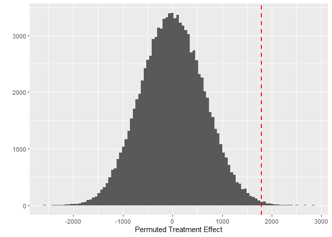
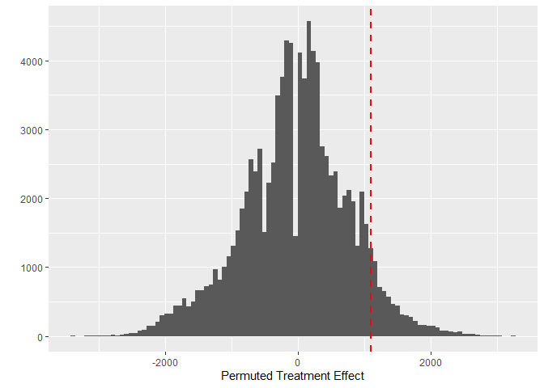

# The First Casualty of Statistics: Part Four
<big>**Inference Methods for Completely Randomized Experiments**</big>

<br/>
Jiří Fejlek

2026-08-12
<br/>

<br/> In part four of this series, we will investigate inference for
(completely) randomized experiments in more detail. We did some
inference in the previous parts using (mostly linear) regression. So let
us justify this approach and present the main alternatives: Fisher
randomization test and Neyman inference. <br/>

## Table of Contents

- [Fisher Randomization Test](#fisher-randomization-test)
- [Neymanian Repeated Sampling
  Inference](#neymanian-repeated-sampling-inference)
- [Regression Approach](#regression-approach)
- [References](#references)

``` r
library(tidyr)
library(dplyr)
library(ggplot2)
library(patchwork)
library(dagitty)
library(ggdag)
```

## Fisher Randomization Test

Let’s assume a so-called *completely randomized experiment* (CRE) (Imbens and Rubin 2015).  We assume $`n`$ units, $`n_1`$ receive the treatment and $`n_0`$
do not ($`n_1`$ and $`n_0`$ are both fixed). Let us denote the
*treatment assignment* for $`n`$ units as
``` math
 \text{T} = (t_1, \ldots,t_n),
```
where $`t_i \in \{0, 1\}`$ for all $`i`$. Then a completely randomized
experiment has a treatment assignment mechanism
``` math
 P(T = t) = \frac{1}{\binom{n}{n_1}},
```
i.e., each treatment assignment configuration has the same probability.
We should note that an alternative would be to consider a *Bernoulli
randomized experiment* (BRE), in which the probability of treatment for
each unit is 1/2. The main disadvantage of BRE over CRE is that we do
not control for $`n_1`$, and thus, BRE can be severely imbalanced for
small numbers of samples.

Fisher randomization test assumes a *sharp null hypothesis* (Imbens and Rubin 2015).
``` math
 H_0: Y_i(0) = Y_i(1) \text{ for all units } i = 1, \ldots, n
```
and works as follows. Let’s assume some test statistic $`S(Y, T)`$
(e.g., difference in observed means for the treatment group and the
control group). If the null hypothesis is correct, the treatment
assignment does not matter. Thus, we can *permute* the treatment
assignment and recompute for each permutation
$`S(Y, T_\text{permuted})`$. Under the null, the value of the statistic
$`S(Y, T)`$ should not differ from other $`S(Y, T_\text{permuted})`$.

Let us return to the *cps1re74* dataset, namely to the original
randomized experiment by (LaLonde 1986). The research objective was to
determine whether training programs have a causal effect on earnings.

``` r
lalonde <- read.csv("C:/Users/elini/Desktop/first casualty/lalonde.csv")
lalonde
```

    ##     age educ black hisp married nodegr      re74       re75       re78 u74 u75 treat
    ## 1    37   11     1    0       1      1     0.000     0.0000  9930.0500   1   1     1
    ## 2    22    9     0    1       0      1     0.000     0.0000  3595.8900   1   1     1
    ## 3    30   12     1    0       0      0     0.000     0.0000 24909.5000   1   1     1
    ## 4    27   11     1    0       0      1     0.000     0.0000  7506.1500   1   1     1
    ## 5    33    8     1    0       0      1     0.000     0.0000   289.7900   1   1     1
    ## 6    22    9     1    0       0      1     0.000     0.0000  4056.4900   1   1     1
    ## 7    23   12     1    0       0      0     0.000     0.0000     0.0000   1   1     1
    ## 8    32   11     1    0       0      1     0.000     0.0000  8472.1600   1   1     1
    ## 9    22   16     1    0       0      0     0.000     0.0000  2164.0200   1   1     1
    ## 10   33   12     0    0       1      0     0.000     0.0000 12418.1000   1   1     1
    ## 11   19    9     1    0       0      1     0.000     0.0000  8173.9100   1   1     1
    ## 12   21   13     1    0       0      0     0.000     0.0000 17094.6000   1   1     1
    ## 13   18    8     1    0       0      1     0.000     0.0000     0.0000   1   1     1
    ## 14   27   10     1    0       1      1     0.000     0.0000 18739.9000   1   1     1
    ## 15   17    7     1    0       0      1     0.000     0.0000  3023.8800   1   1     1
    ## 16   19   10     1    0       0      1     0.000     0.0000  3228.5000   1   1     1
    ## 17   27   13     1    0       0      0     0.000     0.0000 14581.9000   1   1     1
    ## 18   23   10     1    0       0      1     0.000     0.0000  7693.4000   1   1     1
    ## 19   40   12     1    0       0      0     0.000     0.0000 10804.3000   1   1     1
    ## 20   26   12     1    0       0      0     0.000     0.0000 10747.4000   1   1     1
    
   
The difference in means for the treatment group and the control group (APE) is

``` r
mean(lalonde$re78[lalonde$treat == 1]) - mean(lalonde$re78[lalonde$treat == 0])
```

    ## [1] 1794.343

By the way, this is the estimate used as a benchmark for methods that
estimate causal effect from the *cps1re74* dataset. Let us perform the
Fisher randomization test. There are too many permutations, and hence,
we will approximate the test by randomly sampling just a few of them.

``` r
n_samples <- 100000
frt_diff_means <- numeric(n_samples)

for (i in 1:n_samples){
  treat_perm <- sample(lalonde$treat)   # permuted treatment
  frt_diff_means[i] <- mean(lalonde$re78[treat_perm == 1]) - mean(lalonde$re78[treat_perm == 0])
}
```

``` r
ggplot(data = as.data.frame(frt_diff_means), aes(x = frt_diff_means))  + geom_histogram(bins = 100) + xlab('Permuted Treatment Effect') + geom_vline(xintercept = mean(lalonde$re78[lalonde$treat == 1]) - mean(lalonde$re78[lalonde$treat == 0]), color = "red", linetype = "dashed", linewidth = 1)
```

<!-- -->

We observe that the test statistic computed on the unpermuted data is
quite extreme compared to the permuted statistic. We can make the
comparison formally by computing the p-value.

``` r
mean(abs(frt_diff_means) > abs(mean(lalonde$re78[lalonde$treat == 1]) - mean(lalonde$re78[lalonde$treat == 0])))
```

    ## [1] 0.00433

The result we got would be deemed statistically significant. Naturally,
the result will depend on the chosen statistic. If we compare medians
instead of means, the evidence against the null is much weaker in terms
of the p-value.

``` r
n_samples <- 100000
frt_diff_medians <- numeric(n_samples)

for (i in 1:n_samples){
  treat_perm <- sample(lalonde$treat)   # permuted treatment
  frt_diff_medians[i] <- median(lalonde$re78[treat_perm == 1]) - median(lalonde$re78[treat_perm == 0])
}
```

``` r
ggplot(data = as.data.frame(frt_diff_medians), aes(x = frt_diff_medians))  + geom_histogram(bins = 100) + xlab('Permuted Treatment Effect') + geom_vline(xintercept = median(lalonde$re78[lalonde$treat == 1]) - median(lalonde$re78[lalonde$treat == 0]), color = "red", linetype = "dashed", linewidth = 1)
```

<!-- -->

``` r
mean(abs(frt_diff_medians) > abs(median(lalonde$re78[lalonde$treat == 1]) - median(lalonde$re78[lalonde$treat == 0])))
```

    ## [1] 0.16291

Let us compute the Fisher randomization test for the typical statistics
used in this context (Student’s t-test, Wilcoxon sum rank test, the
Kolmogorov-Smirnov test) (Imbens and Rubin 2015).

``` r
set.seed(123)

n_samples <- 100000
frt_diff_medians <- numeric(n_samples)

test_statistics <- c(
  t.test(lalonde$re78[lalonde$treat == 1], lalonde$re78[lalonde$treat == 0], var.equal = TRUE)$statistic,
  t.test(lalonde$re78[lalonde$treat == 1], lalonde$re78[lalonde$treat == 0], var.equal = FALSE)$statistic,
  wilcox.test(lalonde$re78[lalonde$treat == 1], lalonde$re78[lalonde$treat == 0])$statistic,
  ks.test(lalonde$re78[lalonde$treat == 1], lalonde$re78[lalonde$treat == 0])$statistic
)

perm_test_statistics <- matrix(0,n_samples,4)

for (i in 1:n_samples){
  
  treat_perm <- sample(lalonde$treat)   # permuted treatment
  
  perm_test_statistics[i,1] <- t.test(lalonde$re78[treat_perm == 1], lalonde$re78[treat_perm == 0], var.equal = TRUE)$statistic
  perm_test_statistics[i,2] <- t.test(lalonde$re78[treat_perm == 1], lalonde$re78[treat_perm == 0], var.equal = FALSE)$statistic
  perm_test_statistics[i,3] <- wilcox.test(lalonde$re78[treat_perm == 1], lalonde$re78[treat_perm == 0])$statistic
  perm_test_statistics[i,4] <- ks.test(lalonde$re78[treat_perm == 1], lalonde$re78[treat_perm == 0])$statistic
}

p_values <- c(mean(abs(perm_test_statistics[,1]) > abs(test_statistics[1])), mean(abs(perm_test_statistics[,2]) > abs(test_statistics[2])), mean(abs(perm_test_statistics[,3]) > abs(test_statistics[3])),mean(abs(perm_test_statistics[,4]) > abs(test_statistics[4])))

results <- data.frame(
  test_statistics,
   p_values
)

rownames(results) <-  c('t-test (equal var.)', 't-test (unequal var.)', 'Wilcoxon rank sum', 'Kolmogorov–Smirnov')
results
```

    ##                       test_statistics p_values
    ## t-test (equal var.)      2.835321e+00  0.00424
    ## t-test (unequal var.)    2.674146e+00  0.00718
    ## Wilcoxon rank sum        2.740250e+04  0.00543
    ## Kolmogorov–Smirnov       1.321206e-01  0.03868

Overall, the Fisher randomization test is pretty straightforward.
However, we have to select an appropriate test statistic so that it has
high power to distinguish the alternative hypothesis from the null. The
main drawback is that strictly speaking, the output from the Fisher
randomization test is just a p-value, which by itself does not tell much
about the treatment effect.

## Neymanian Repeated Sampling Inference

Neymanian inference is based on the difference in observed means. Let us
denote
``` math
\hat Y(1) = \frac{1}{n_1}\sum_{i = 1}^{n_1} t_iY_i
```
and
``` math
\hat Y(0) = \frac{1}{n_0}\sum_{i = 1}^{n_0}(1-t_i)Y_i.
```
We will also compute the sample variances
``` math
\hat{V}(1) = \frac{1}{n_1-1}\sum_{i = 1}^{n_1} t_i(Y_i-\hat Y(1))^2
```
and
``` math
\hat{V}(0) = \frac{1}{n_0-1}\sum_{i = 1}^{n_1} (1-t_i)(Y_i-\hat Y(0))^2
```
Neyman proved that (Ding 2024)

- $`\hat Y(1) - \hat Y(0)`$ is an unbiased estimate of ATE
- $`\hat Y(1) - \hat Y(0)`$ has variance
  $`n_0V(1)/n_1n + n_1V(0)/n_0 n + 2V(1,0)/n`$, where $`V(1,0)`$ is
  covariance of $`Y_i(0)`$ and $`Y_i(1)`$
- $`\hat V = \hat V(1)/n_1 + \hat V(0)/n_0`$ is a conservative estimate
  of the variance of $`\hat Y(1) - \hat Y(0)`$

We need to clarify that expectations and variances in the theorem are
all with respect to the treatment assignments; the potential outcomes
themselves are considered to be fixed (Ding 2024). Also notice that we
need to use a conservative estimate for the variance of
$`\hat Y(1) - \hat Y(0)`$, since it depends on covariance, which
involves counterfactuals. The expected error of the estimate $`\hat V`$
can be shown to be equal to
``` math
\text{Var}(\hat Y(1) - \hat Y(0)) - \mathbb{E}\hat V = V(\tau)/n \geq 0,
```
where
``` math
V(\tau) = \frac{1}{n-1} \sum_{i = 1}^n (Y_i(1) - Y_i(0) - (\bar Y(1) - \bar Y(0))^2
```
and where $`\bar Y(0)`$ and $`\bar Y(1)`$ denotes the population mean
potential outcomes. Thus, the error of the estimate $`\hat V`$ equals
the variance of individual treatment effects divided by $`n`$, i.e., the
bias of the estimate decreases with increasing $`n`$.

In addition, it can be shown (Li and Ding 2017) that under some
regularity conditions $`\hat Y(1) - \hat Y(0)`$ is asymptotically
normal. Thus, we can use a conservative confidence interval for the ATE
``` math
\hat Y(1) - \hat Y(0) \pm z_{1-\alpha/2} \sqrt{\hat V}.
```

Let’s use the Neyman inference procedure on the *lalonde* dataset. The
estimate of ATE is

``` r
est_ate <- mean(lalonde$re78[lalonde$treat == 1]) - mean(lalonde$re78[lalonde$treat == 0])
est_ate
```

    ## [1] 1794.343

and the conservative estimate of the standard error

``` r
sd_ate <- sqrt(var(lalonde$re78[lalonde$treat == 1])/sum(lalonde$treat == 1) +  var(lalonde$re78[lalonde$treat == 0])/sum(lalonde$treat == 0))
sd_ate
```

    ## [1] 670.9967

Thus, we get the conservative large-sample confidence interval.

``` r
c(est_ate - qnorm(0.975)*sd_ate, est_ate + qnorm(0.975)*sd_ate)
```

    ## [1]  479.2137 3109.4725

## Regression Approach

The last approach we will mention here is the regression approach, which
we used in the previous parts to estimate ATE. We can obtain the Neyman
estimate of ATE using a simple linear regression. For the *lalonde*
dataset, we get the following result.

``` r
summary(lm(re78~treat, data = lalonde))
```

    ## 
    ## Call:
    ## lm(formula = re78 ~ treat, data = lalonde)
    ## 
    ## Residuals:
    ##    Min     1Q Median     3Q    Max 
    ##  -6349  -4555  -1829   2917  53959 
    ## 
    ## Coefficients:
    ##             Estimate Std. Error t value Pr(>|t|)    
    ## (Intercept)   4554.8      408.0  11.162  < 2e-16 ***
    ## treat         1794.3      632.9   2.835  0.00479 ** 
    ## ---
    ## Signif. codes:  0 '***' 0.001 '**' 0.01 '*' 0.05 '.' 0.1 ' ' 1
    ## 
    ## Residual standard error: 6580 on 443 degrees of freedom
    ## Multiple R-squared:  0.01782,    Adjusted R-squared:  0.01561 
    ## F-statistic: 8.039 on 1 and 443 DF,  p-value: 0.004788

The estimate itself is the same as the one using the Neyman approach. 
But we notice that the standard error is different. The
difference is that OLS assumes homoskedastic errors whereas the Neyman
inference does not. Fortunately, we can recover Neyman estimates by
computing Eicker–Huber–White (HC0) errors (Ding 2024).

``` r
library(sandwich)
library(lmtest)

model <- lm(re78~treat, data = lalonde)
coeftest(model, vcov. = vcovHC(model, type = "HC0"))
```

    ## 
    ## t test of coefficients:
    ## 
    ##             Estimate Std. Error t value  Pr(>|t|)    
    ## (Intercept)  4554.80     339.44 13.4186 < 2.2e-16 ***
    ## treat        1794.34     669.32  2.6809  0.007617 ** 
    ## ---
    ## Signif. codes:  0 '***' 0.001 '**' 0.01 '*' 0.05 '.' 0.1 ' ' 1

This brings us to an important point. The Fisher randomization test and Neyman inference are built on the assumptions of CRE design and make no further distributional assumptions (we only need distributional assumptions to establish the asymptotic normality of the observed APE). On the other hand, regression models make strong distributional assumptions that are not justified by CRE alone and may be severely violated, rendering the inference possibly invalid.  

We should note that the differences run much deeper. Fisher/Neyman approaches are based on the potential outcome framework. The source of randomness is the treatment assignment, and the potential outcomes for each individual are fixed. However, when using regression, we usually assume that the model matrix (i.e., the treatment assignment) is fixed, and the source of randomness is the outcomes themselves. This is because, in regression, we assume that individuals are sampled from a superpopulation in each experimental realization (Ding 2024).

These observations led to some criticism of using regression for inference for CRE, especially when covariates are involved (Freedman 2008). This is because, in addition to problems with variance estimation, naive covariate adjustments via linear regression yield biased ATE estimates in small samples (the bias is of order $1/n$). We will discuss this more in the next part.

However, dealing with covariates is much more straightforward using regression methods. We want (and need) to include covariates in the inference, even for CRE. First, as we discussed previously, including strong covariates reduces model uncertainty, making treatment effect estimates more accurate. Secondly, it allows us to estimate the conditional ATE (CATE), which can be as important as the ATE, provided that there is an interaction between the treatment effect and some covariates (i.e., a so-called *heterogeneity of treatment effect*). After all, we are not just interested in how a drug affects a person on average;  we are interested in how it affects a *sick* person. And lastly, there is the issue of the noncollapsibility of odds ratios and hazard ratios (if we go beyond linear regression), which we discussed in the previous part, that makes the marginal effects hard to interpret (https://www.fharrell.com/post/marg/ and https://www.fharrell.com/post/robcov/).


## References

<div id="refs" class="references csl-bib-body hanging-indent">

<div id="ref-ding2024first" class="csl-entry">

Ding, Peng. 2024. *A First Course in Causal Inference*. CRC press.

</div>

<div id="ref-freedman2008regression" class="csl-entry">

Freedman, David A. 2008. “On Regression Adjustments to Experimental
Data.” *Advances in Applied Mathematics* 40 (2): 180–93.

</div>

<div id="ref-imbens2015causal" class="csl-entry">

Imbens, Guido W, and Donald B Rubin. 2015. “Causal Inference in
Statistics, Social, and Biomedical Sciences.” *New York* 517.

</div>

<div id="ref-lalonde1986evaluating" class="csl-entry">

LaLonde, Robert J. 1986. “Evaluating the Econometric Evaluations of
Training Programs with Experimental Data.” *The American Economic
Review*, 604–20.

</div>

<div id="ref-li2017general" class="csl-entry">

Li, Xinran, and Peng Ding. 2017. “General Forms of Finite Population
Central Limit Theorems with Applications to Causal Inference.” *Journal
of the American Statistical Association* 112 (520): 1759–69.

</div>

</div>
