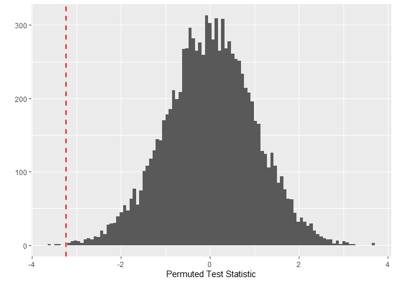
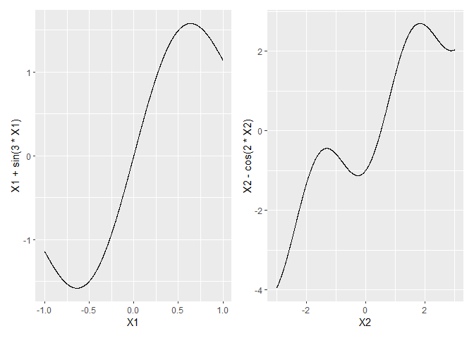
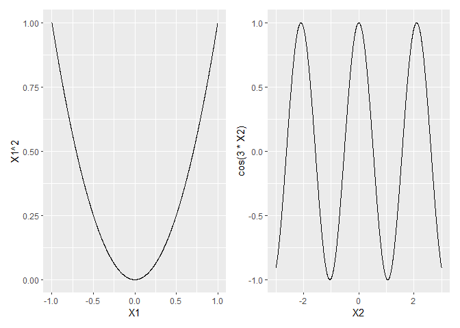

# The First Casualty of Statistics: Part Five
<big>**Stratification and Rerandomization**</big>

<br/>
Jiří Fejlek

2026-08-14
<br/>

<br/> When analyzing the treatment effect, we often include additional covariates
that have a strong influence on the outcome. Including these covariates in
CRE is important to keep the design experiment balanced, and as we will show
it helps us improve the accuracy of estimating the treatment effect. <br/>

## Table of Contents

- [Stratification](#stratification)
  - [Neyman Inference for SRE](#neyman-inference-for-sre)
  - [Regression Approach](#regression-approach)
  - [Post-stratification](#post-stratification)
- [Rerandomization](#rerandomization)
- [References](#references)

``` r
library(tidyr)
library(dplyr)
library(ggplot2)
library(patchwork)
library(dagitty)
library(ggdag)
```

## Stratification

Let’s assume a standard completely randomized experiment (CRE) and a
discrete covariate $`X = {1, 2, \ldots, K}`$. Depending on the
randomization of the CRE, the treatment assignments
``` math
 n_{[k],1} = \#\{T = 1, X = k\}
```
and
``` math
n_{[k],0} = \#\{T = 0, X = k\}
```

might not be balanced, i.e.,
``` math
\frac{n_{[k],1}}{n_1} - \frac{n_{[k],0}}{n_0} \not\approx 0
```
and this difference can be quite large. Sometimes $`n_{[k],0}`$ or
$`n_{[k],1}`$ can be even zero. Heavy covariate imbalance makes the
treatment and control groups incomparable; thus, the difference in
outcomes could be explained by either the treatment or the covariate
imbalance.

To ensure that such covariate imbalance does not occur for a given
covariate, we can employ a *stratified randomized experiment* (SRE),
also known as *blocking*, in which we perform independent CRE within
each stratum $`X = k`$. Then, we have for each stratum a
stratum-specific treatment effect
``` math
 \tau_k = \frac{1}{n_{[k]}} \sum_{i = 1}^{n_{[k]}} Y_{[k], i}(1) -  Y_{[k], i}(0)
```
and we can compute the overall treatment effect as
``` math
 \text{ATE} = \frac{1}{n} \sum_{k = 1}^K n_{[k]}\tau_{{[k]}} = \sum_{k = 1}^K \pi_{[k]}\tau_{[k]}
```
\### Fisher Randomization Test for SRE

Fisher randomization test (FRT) generalizes to an SRE. We only need to
remember that the permutations must respect the experimental design,
i.e., that they occur independently within each stratum. Secondly, we
must choose an appropriate test statistic for stratified data. For
example, we can define a stratified studentized estimator as (Ding 2024)
``` math
 t_S  = \frac{\hat \tau_S}{\sqrt{\hat V_S}},
```
where
``` math
\hat \tau_S = \sum_{k=1}^K \pi_{[k]} \hat \tau_{[k]}
```
with
``` math
\hat \tau_{[k]} = \frac{1}{n_{[k],1}} \sum_{i=1}^{n} I(Y_i = 1, X = k) -  \frac{1}{n_{[k],0}} \sum_{i=1}^{n} I(Y_i = 0, X = k)
```
and with
``` math
\hat V_S = \sum_{k = 1}^K \pi^2_{[k]} \left( \frac{\hat V_{[k]}(1)}{n_{[k],1}} + \frac{\hat V_{[k]}(0)}{n_{[k],0}}\right),
```
where $`\hat V_{[k]}(1)`$ and $`\hat V_{[k]}(0)`$ are strata-specific
sample variances of outcomes under treatment and control, respectively.

We can also define combined Wilcoxon rank-sum statistics and combined
Kolmogorov-Smirnov statistics for SRE (Ding 2024).

Let’s assume the *Penn46* dataset (Ding 2024), which is based on the
Pennsylvania Reemployment Bonus experiment. The goal was to investigate
whether cash bonuses shorten the duration of unemployment.

``` r
Penn46 <- read.csv('C:/Users/elini/Desktop/first casualty/Penn46.csv')
Penn46
```

    ##        duration treatment female black hispanic ndependents recall young old quarter durable lusd
    ## 1    18.0113427         0      0     0        0           2      0     0   0       5       0    0
    ## 2     1.0033995         0      0     0        0           0      0     0   0       5       0    1
    ## 3    26.9603963         0      0     0        0           0      0     0   0       4       0    1
    ## 4     7.0090444         1      0     0        0           0      0     0   0       2       0    0
    ## 5     9.0224091         1      0     0        0           0      0     1   0       3       0    0
    ## 6    26.9913896         0      0     0        0           1      0     0   1       5       1    1
    ## 7    27.0008197         0      1     0        0           0      0     0   1       5       0    1
    ## 8     9.0005176         0      1     0        0           1      0     0   1       5       0    1
    ## 9    27.0036953         0      1     0        0           1      0     0   0       0       0    1
    ## 10   26.0118904         1      1     0        0           0      0     0   1       3       0    0
    ## 11   15.0117483         0      1     0        0           0      0     0   0       2       0    1
    ## 12   28.0056048         0      1     0        0           0      0     0   1       3       0    1
    ## 13   11.9976096         0      1     0        0           2      1     1   0       4       0    0
    ## 14   22.0214310         1      1     0        1           2      0     1   0       2       0    0
    ## 15   17.9849767         0      1     0        0           0      0     0   1       5       0    0
    ## 16    0.9973454         0      1     0        0           2      0     0   0       2       0    0
    ## 17    1.0079799         1      0     0        0           0      0     1   0       4       0    1
    ## 18    7.0018907         1      1     0        0           0      0     0   0       3       0    1
    ## 19   17.0212650         1      1     0        0           0      0     0   1       3       0    0
    ## 20   18.0018872         0      0     0        0           0      0     0   0       0       1    1
 
Let’s assume that the experiment was stratified by **quarter** (quarter
in which unemployment insurance claimants entered the job bonus
experiment).

``` r
Penn46$quarter <- as.factor(Penn46$quarter)
summary(Penn46$quarter)
```

    ##    0    1    2    3    4    5 
    ##  321   89 1444 1660 1549 1321

First, we need to compute $`n_{[k],0}, n_{[k],1}`$ and proportions
$`\pi_{[k]}`$.

``` r
factor_levels <- levels(Penn46$quarter)
n_matrix <- matrix(0,length(factor_levels),3)

for (i in 1:length(factor_levels)){
  n_matrix[i,1] <- sum(Penn46$treatment[Penn46$quarter == factor_levels[i]] == 0)
  n_matrix[i,2] <- sum(Penn46$treatment[Penn46$quarter == factor_levels[i]] == 1)
  n_matrix[i,3] <- (n_matrix[i,1] + n_matrix[i,2])/dim(Penn46)[1]
}

rownames(n_matrix) <- factor_levels
colnames(n_matrix) <- c(0,1, 'Pi')
n_matrix
```

    ##     0   1         Pi
    ## 0 234  87 0.05028195
    ## 1  41  48 0.01394110
    ## 2 687 757 0.22619048
    ## 3 794 866 0.26002506
    ## 4 738 811 0.24263784
    ## 5 860 461 0.20692356

Then we compute the observed differences $`\hat \tau_{[k]}`$ and
variances of the outcome $`\hat V_{[k],0}, \hat V_{[k],1}`$ for each
strata.

``` r
tstat_matrix <- matrix(0,length(factor_levels),3)

for (i in 1:length(factor_levels)){
  
  treat_0 <- Penn46$duration[Penn46$quarter == factor_levels[i] & Penn46$treatment == 0]
  treat_1 <- Penn46$duration[Penn46$quarter == factor_levels[i] & Penn46$treatment == 1]
  
  tstat_matrix[i, 1] <- mean(treat_1) - mean(treat_0)
  tstat_matrix[i, 2] <- var(treat_0)
  tstat_matrix[i, 3] <- var(treat_1) 
}

colnames(tstat_matrix) <- c('tau', 'V0', 'V1')
rownames(tstat_matrix) <- factor_levels
tstat_matrix
```

    ##           tau        V0        V1
    ## 0  0.05858355 122.48804 127.63785
    ## 1 -0.70958579 111.38001 102.92978
    ## 2 -0.82631274  96.49915  97.95115
    ## 3 -1.13120763 112.85045 104.41819
    ## 4 -1.01734474 107.35404 106.34790
    ## 5 -0.62473302 126.02770 119.52228

The stratified studentized statistic is as follows.

``` r
vstat <- sum(n_matrix[,3]^2*(tstat_matrix[,2]/n_matrix[,1] + tstat_matrix[,3]/n_matrix[,2]))
tstat <- sum(n_matrix[,3]*tstat_matrix[,1])/sqrt(vstat)
tstat
```

    ## [1] -3.238255

Lastly, we need to recompute the statistic for permuted treatment
assignments.

``` r
set.seed(123)

n_samples <- 10000
t_stats <- numeric(n_samples)
treatment_new <- Penn46$treatment
tstat_matrix_new <- matrix(0,length(factor_levels),3)

for (i in 1:n_samples){
  
  for (j in 1:length(factor_levels)){
    treatment_new[Penn46$quarter == factor_levels[j]] <- sample(Penn46$treatment[Penn46$quarter == factor_levels[j]])
  }
  
  for (j in 1:length(factor_levels)){
    treat_0 <- Penn46$duration[Penn46$quarter == factor_levels[j] & treatment_new == 0]
    treat_1 <- Penn46$duration[Penn46$quarter == factor_levels[j] & treatment_new == 1]
    
    tstat_matrix_new[j, 1] <- mean(treat_1) - mean(treat_0)
    tstat_matrix_new[j, 2] <- var(treat_0)
    tstat_matrix_new[j, 3] <- var(treat_1) 
  }
  
  vstat_new = sum(n_matrix[,3]^2*(tstat_matrix_new[,2]/n_matrix[,1] + tstat_matrix_new[,3]/n_matrix[,2]))
  tstat_new <- sum(n_matrix[,3]*tstat_matrix_new[,1])/sqrt(vstat_new)
  
  t_stats[i] <- tstat_new
}
```

We observe that the treatment effect is based on our test statistic is
clearly statistically significant.

``` r
ggplot(data = as.data.frame(t_stats), aes(x = t_stats))  + geom_histogram(bins = 100) + xlab('Permuted Test Statistic') + ylab('') + geom_vline(xintercept = tstat, color = "red", linetype = "dashed", linewidth = 1)
```

<!-- -->

``` r
mean(abs(t_stats)>abs(tstat))
```

    ## [1] 6e-04

### Neyman Inference for SRE

We can also employ the Neyman inference (Ding 2024). Actually, the
stratified studentized statistic we used for the Fisher randomization
test is motivated by the Neymanian framework for estimation of ATE
``` math
 \text{ATE} =  \sum_{k = 1}^K \pi_{[k]}\tau_k.
```
It can be shown that $`\hat \tau_S`$ is an unbiased estimate of ATE,
$`\hat V_S`$ is a conservative variance estimator of $`\hat \tau_S`$,
and that $`\hat \tau_S`$ is asymptotically normal (Ding 2024). Thus, we
can construct a Wald confidence interval for ATE as
``` math
 \hat \tau_S \pm z_{1-\alpha/2} \sqrt{\hat V_S}
```

We already performed all necessary computations.

``` r
tstat_matrix
```

    ##           tau        V0        V1
    ## 0  0.05858355 122.48804 127.63785
    ## 1 -0.70958579 111.38001 102.92978
    ## 2 -0.82631274  96.49915  97.95115
    ## 3 -1.13120763 112.85045 104.41819
    ## 4 -1.01734474 107.35404 106.34790
    ## 5 -0.62473302 126.02770 119.52228

``` r
# ATE estimate
sum(n_matrix[,3]*tstat_matrix[,1])
```

    ## [1] -0.8641114

``` r
# standard error
sqrt(vstat)
```

    ## [1] 0.2668448

Thus, we get the following estimate of ATE with Wald confidence
intervals.

``` r
ate_est <- c(
  sum(n_matrix[,3]*tstat_matrix[,1])-sqrt(vstat)*qnorm(0.975), 
  sum(n_matrix[,3]*tstat_matrix[,1]), 
  sum(n_matrix[,3]*tstat_matrix[,1])+sqrt(vstat)*qnorm(0.975))

names(ate_est) <- c('2.5%','ATE Estimate','97.5%')
ate_est
```

    ##         2.5% ATE Estimate        97.5% 
    ##   -1.3871176   -0.8641114   -0.3411053

### Regression Approach

We can also employ a regression approach by simply adjusting for
**quarter**.

``` r
summary(lm(duration ~ treatment + quarter, data = Penn46))
```

    ## 
    ## Call:
    ## lm(formula = duration ~ treatment + quarter, data = Penn46)
    ## 
    ## Residuals:
    ##     Min      1Q  Median      3Q     Max 
    ## -13.547 -10.079  -2.152  11.048  39.870 
    ## 
    ## Coefficients:
    ##             Estimate Std. Error t value Pr(>|t|)    
    ## (Intercept)  14.5284     0.5882  24.702  < 2e-16 ***
    ## treatment    -0.8786     0.2659  -3.304 0.000959 ***
    ## quarter1     -1.2908     1.2549  -1.029 0.303710    
    ## quarter2     -0.5811     0.6489  -0.896 0.370480    
    ## quarter3     -1.5066     0.6411  -2.350 0.018811 *  
    ## quarter4     -1.4990     0.6449  -2.324 0.020130 *  
    ## quarter5     -1.4399     0.6511  -2.211 0.027046 *  
    ## ---
    ## Signif. codes:  0 '***' 0.001 '**' 0.01 '*' 0.05 '.' 0.1 ' ' 1
    ## 
    ## Residual standard error: 10.46 on 6377 degrees of freedom
    ## Multiple R-squared:  0.003839,   Adjusted R-squared:  0.002902 
    ## F-statistic: 4.096 on 6 and 6377 DF,  p-value: 0.0004156

Again, we need to adjust the error estimates.

``` r
library(sandwich)
library(lmtest)

lm_penn <- lm(duration ~ treatment + quarter, data = Penn46)
coeftest(lm_penn, vcov. = vcovHC(lm_penn, type = "HC0"))
```

    ## 
    ## t test of coefficients:
    ## 
    ##             Estimate Std. Error t value  Pr(>|t|)    
    ## (Intercept) 14.52843    0.62361 23.2974 < 2.2e-16 ***
    ## treatment   -0.87863    0.26504 -3.3150 0.0009214 ***
    ## quarter1    -1.29077    1.25035 -1.0323 0.3019580    
    ## quarter2    -0.58114    0.67527 -0.8606 0.3894904    
    ## quarter3    -1.50659    0.67431 -2.2343 0.0254999 *  
    ## quarter4    -1.49898    0.67660 -2.2155 0.0267625 *  
    ## quarter5    -1.43986    0.69157 -2.0820 0.0373802 *  
    ## ---
    ## Signif. codes:  0 '***' 0.001 '**' 0.01 '*' 0.05 '.' 0.1 ' ' 1

However, we can see that the estimate of the treatment effect differs
slightly from the Neyman inference. We mentioned this at the end of the
previous part. Linear regression makes different assumptions than the
potential outcome framework. Hence, it can be shown that its estimate of
the treatment effect (the corresponding coefficients) is generally
biased (Freedman 2008). Now, the bias is of order $`1/n`$, and hence the
difference between the Neyman inference and the OLS disappears for large
enough $`n`$. Freedman also showed that adjusting can lead to a less
precise (i.e., less efficient) estimate in imbalanced designs.

However, we can do a bit better and obtain a more precise estimate. The
method is known as Lin's estimator (Lin 2013). First, we need to
center the covariates.

``` r
model_matrix <- scale(model.matrix(lm_penn)[,c(-1,-2)], center = TRUE, scale = TRUE)
model_matrix <- data.frame(treatment = Penn46$treatment,model_matrix)
```

Then we fit an OLS model with the treatment and the centered covariates,
and with the interactions between the treatment and the centered
covariates.

``` r
lm_penn_lin <- lm(Penn46$duration ~ . + treatment:quarter1 + treatment:quarter2 + treatment:quarter3 + treatment:quarter4 + + treatment:quarter5, data = model_matrix)
summary(lm_penn_lin)
```

    ## 
    ## Call:
    ## lm(formula = Penn46$duration ~ . + treatment:quarter1 + treatment:quarter2 + 
    ##     treatment:quarter3 + treatment:quarter4 + +treatment:quarter5, 
    ##     data = model_matrix)
    ## 
    ## Residuals:
    ##     Min      1Q  Median      3Q     Max 
    ## -13.348 -10.079  -2.154  11.074  39.991 
    ## 
    ## Coefficients:
    ##                    Estimate Std. Error t value Pr(>|t|)    
    ## (Intercept)        13.33889    0.18262  73.041  < 2e-16 ***
    ## treatment          -0.86411    0.26651  -3.242  0.00119 ** 
    ## quarter1           -0.13226    0.20768  -0.637  0.52426    
    ## quarter2           -0.14834    0.33130  -0.448  0.65434    
    ## quarter3           -0.49168    0.34137  -1.440  0.14982    
    ## quarter4           -0.50260    0.33648  -1.494  0.13530    
    ## quarter5           -0.51632    0.31249  -1.652  0.09853 .  
    ## treatment:quarter1 -0.09007    0.30294  -0.297  0.76623    
    ## treatment:quarter2 -0.37024    0.59606  -0.621  0.53453    
    ## treatment:quarter3 -0.52194    0.61882  -0.843  0.39901    
    ## treatment:quarter4 -0.46126    0.60764  -0.759  0.44782    
    ## treatment:quarter5 -0.27683    0.58574  -0.473  0.63650    
    ## ---
    ## Signif. codes:  0 '***' 0.001 '**' 0.01 '*' 0.05 '.' 0.1 ' ' 1
    ## 
    ## Residual standard error: 10.46 on 6372 degrees of freedom
    ## Multiple R-squared:  0.003997,   Adjusted R-squared:  0.002278 
    ## F-statistic: 2.325 on 11 and 6372 DF,  p-value: 0.007596

The main effect estimate for the treatment now corresponds exactly to
the Neyman estimate of ATE. We can also correct the standard errors
again.

``` r
coeftest(lm_penn_lin, vcov. = vcovHC(lm_penn_lin, type = "HC0"))
```

    ## 
    ## t test of coefficients:
    ## 
    ##                     Estimate Std. Error t value  Pr(>|t|)    
    ## (Intercept)        13.338887   0.182829 72.9584 < 2.2e-16 ***
    ## treatment          -0.864111   0.266539 -3.2420  0.001193 ** 
    ## quarter1           -0.132256   0.208819 -0.6334  0.526525    
    ## quarter2           -0.148344   0.340287 -0.4359  0.662897    
    ## quarter3           -0.491683   0.357241 -1.3763  0.168767    
    ## quarter4           -0.502598   0.349994 -1.4360  0.151046    
    ## quarter5           -0.516323   0.331018 -1.5598  0.118856    
    ## treatment:quarter1 -0.090072   0.303995 -0.2963  0.767014    
    ## treatment:quarter2 -0.370238   0.626330 -0.5911  0.554459    
    ## treatment:quarter3 -0.521940   0.655656 -0.7961  0.426028    
    ## treatment:quarter4 -0.461263   0.642738 -0.7177  0.472997    
    ## treatment:quarter5 -0.276833   0.624552 -0.4433  0.657599    
    ## ---
    ## Signif. codes:  0 '***' 0.001 '**' 0.01 '*' 0.05 '.' 0.1 ' ' 1

We can fit the model directly using the package *estimatr*.

``` r
library(estimatr)
summary(lm_lin(duration  ~ treatment, covariates = ~ quarter, data = Penn46))
```

    ## 
    ## Call:
    ## lm_lin(formula = duration ~ treatment, covariates = ~quarter, 
    ##     data = Penn46)
    ## 
    ## Standard error type:  HC2 
    ## 
    ## Coefficients:
    ##                      Estimate Std. Error t value Pr(>|t|) CI Lower CI Upper
    ## (Intercept)           13.3389     0.1830 72.8930 0.000000   12.980  13.6976
    ## treatment             -0.8641     0.2668 -3.2383 0.001209   -1.387  -0.3410
    ## quarter1_c            -1.1279     1.8000 -0.6266 0.530929   -4.657   2.4007
    ## quarter2_c            -0.3546     0.8148 -0.4351 0.663479   -1.952   1.2428
    ## quarter3_c            -1.1208     0.8158 -1.3738 0.169542   -2.720   0.4785
    ## quarter4_c            -1.1723     0.8179 -1.4334 0.151791   -2.776   0.4310
    ## quarter5_c            -1.2745     0.8185 -1.5570 0.119520   -2.879   0.3301
    ## treatment:quarter1_c  -0.7682     2.6175 -0.2935 0.769172   -5.899   4.3631
    ## treatment:quarter2_c  -0.8849     1.5035 -0.5886 0.556170   -3.832   2.0624
    ## treatment:quarter3_c  -1.1898     1.5011 -0.7926 0.428029   -4.132   1.7528
    ## treatment:quarter4_c  -1.0759     1.5057 -0.7146 0.474903   -4.028   1.8758
    ## treatment:quarter5_c  -0.6833     1.5480 -0.4414 0.658929   -3.718   2.3513
    ##                        DF
    ## (Intercept)          6372
    ## treatment            6372
    ## quarter1_c           6372
    ## quarter2_c           6372
    ## quarter3_c           6372
    ## quarter4_c           6372
    ## quarter5_c           6372
    ## treatment:quarter1_c 6372
    ## treatment:quarter2_c 6372
    ## treatment:quarter3_c 6372
    ## treatment:quarter4_c 6372
    ## treatment:quarter5_c 6372
    ## 
    ## Multiple R-squared:  0.003997 ,  Adjusted R-squared:  0.002278 
    ## F-statistic: 2.376 on 11 and 6372 DF,  p-value: 0.006261

The standard error estimate is slightly different because it uses HC2
errors rather than HC0.

``` r
coeftest(lm_penn_lin, vcov. = vcovHC(lm_penn_lin, type = "HC2"))
```

    ## 
    ## t test of coefficients:
    ## 
    ##                     Estimate Std. Error t value  Pr(>|t|)    
    ## (Intercept)        13.338887   0.182993 72.8930 < 2.2e-16 ***
    ## treatment          -0.864111   0.266845 -3.2383  0.001209 ** 
    ## quarter1           -0.132256   0.211062 -0.6266  0.530929    
    ## quarter2           -0.148344   0.340914 -0.4351  0.663479    
    ## quarter3           -0.491683   0.357891 -1.3738  0.169542    
    ## quarter4           -0.502598   0.350632 -1.4334  0.151791    
    ## quarter5           -0.516323   0.331614 -1.5570  0.119520    
    ## treatment:quarter1 -0.090072   0.306921 -0.2935  0.769172    
    ## treatment:quarter2 -0.370238   0.629046 -0.5886  0.556170    
    ## treatment:quarter3 -0.521940   0.658500 -0.7926  0.428029    
    ## treatment:quarter4 -0.461263   0.645514 -0.7146  0.474903    
    ## treatment:quarter5 -0.276833   0.627152 -0.4414  0.658929    
    ## ---
    ## Signif. codes:  0 '***' 0.001 '**' 0.01 '*' 0.05 '.' 0.1 ' ' 1

### Post-stratification

We can employ stratified estimates on regular CRE conditional on the
observed split of $`X`$. This strategy is called *post-stratification*,
and numerical experiments have shown that it usually provides more
accurate estimates of treatment effects than unadjusted estimates (Ding
2024).

Let us consider the following simulation experiment, in which we compare
unadjusted and adjusted estimates of treatment effect. We consider four
strata, the potential outcomes are $`Y(0)|X=1 \sim N(0,0.25)`$,
$`Y(0)|X=2 \sim N(2,1)`$, $`Y(0)|X=3 \sim N(5,4)`$, and
$`Y(0)|X=4 \sim N(10,25)`$ and $`Y(1) = Y(0) + 1`$. We will assign
treatment using CRE, i.e., no balancing within each stratum.

``` r
set.seed(123)
n_sim <- 1000                     # number of simulations
n_x <- c(100, 50, 50, 100)         # individuals in each strata
n <- sum(n_x)                      # population size

betas <- matrix(0, n_sim,3)

for (i in 1:n_sim){

Y0 <- c(rnorm(n_x[1],0,0.5), rnorm(n_x[2],2,1), rnorm(n_x[3],5,2), rnorm(n_x[4],10,5))
Y1 <- Y0 + 1
X <- c(rep(1,n_x[1]),rep(2,n_x[2]),rep(3,n_x[3]),rep(4,n_x[4]))

treatment <- sample(c(rep(0,n/2),rep(1,n/2)))

Y <- Y0
Y[treatment == 1] <- Y1[treatment == 1]

exp_data <- data.frame(Y = Y, treatment = treatment, X = as.factor(X))

betas[i,1] <- summary(lm(Y ~ treatment, data = exp_data))$coef[2]
betas[i,2] <- summary(lm(Y ~ treatment + X, data = exp_data))$coef[2]
betas[i,3] <- summary(lm_lin(Y  ~ treatment, covariates = ~ X, data = exp_data))$coef[2]
}


results <- rbind(
  apply(betas,2,mean),
  apply(betas,2,sd)
) 

colnames(results) <- c('no adj.','adj.','lin est.')
rownames(results) <- c('mean', 'sd')
results
```

    ##        no adj.      adj.  lin est.
    ## mean 1.0142285 1.0043482 1.0040566
    ## sd   0.6075695 0.3696437 0.3685447

We observe that all three estimates are unbiased estimates of the
treatment effect. But the unadjusted estimate has almost twice the
standard deviation of the two adjusted estimates. The difference between
the standard adjusted OLS and Lin's estimator is, in this example,
negligible.

## Rerandomization

Stratification and post-stratification apply to discrete covariates. So
the obvious question is how to deal with the continuous ones.
Discretizing continuous covariates would be one option, but it is not
practical for multiple covariates, and choosing discretization bins is
ultimately quite arbitrary. Instead, we can consider balancing the CRE
via *rerandomization* (Ding 2024).

Let us assume covariates $`X \in \mathbb{R}^K`$ and we will assume that
$`X`$ are centered across the population $`\sum_{i=1}^n X_i = 0.`$ We
denote the difference in the means of covariates as
``` math
\hat \tau_X = \frac{1}{n_1}\sum_{i = 1}^n T_iX_i - \frac{1}{n_0}\sum_{i = 1}^n (1-T_i)X_i.
```
This difference is expected to be zero under RCE; however, a specific
treatment assignment can be unbalanced. To ensure that we pick the
balanced treatment assignment, we define the Mahalanobis distance
measure (Ding 2024)
``` math
M = \hat \tau_X^T \text{cov}(\hat\tau_X)^{-1} \hat\tau_X = \hat \tau_X^T \left(\frac{n}{n_1n_0}V_X\right)^{-1} \hat\tau_X,
```
where $`V_X = \frac{1}{n-1} X_iX_i^T`$.

The idea of rerandomization using $`M`$ (ReM) is to pick a treatment
assignment that is as balanced as possible, i.e., for which $`M`$ is
small. Thus, we will employ the rule: Draw $`T`$ from CRE and accept the
treatment assignment if and only if $`M \leq a`$ for some predetermiend
constant $`a >0`$ (e.g., $`a = 0.001`$) (Ding 2024). We should note that
$`M`$ has approximately a $`\chi^2_K`$ distribution, which we can use to
select a suitable $`a`$.

As far as inference is concerned, Li and Rubin (Li et al. 2018) derived
the asymptotic distribution of APE under some regularity conditions. You
can find the full result in (Ding 2024), we will just state the
simplified result for $`a = + \infty`$ (i.e., under CRE) which is
($`\dot\sim`$ denotes asymptotical distribution)
``` math
 \frac{\hat \tau - \tau}{\sqrt{\text{var}(\hat \tau)}} \dot\sim N(0,1),
```
where
$`\text{var}(\hat \tau) = n_0V(1)/n_1n + n_1V(0)/n_0 n + 2V(1,0)/n`$ is
the variance from the Neyman inference. In other words, this is the
standard Neyman result. For small $`a`$, we get
``` math
 \frac{\hat \tau - \tau}{\sqrt{(1-R^2)\text{var}(\hat \tau)}} \dot\sim N(0,1),
```
where $`R^2 =  \text{corr}(\hat\tau,\hat \tau_X)`$. Consequently, we
observe that rerandomization can increase the accuracy of ATE
estimation, depending on the magnitude of $`R^2`$.

(Li et al. 2018) derived an estimate of $`R^2`$, but it is more
straightforward to employ the regression approach using Lin's
estimator. It can be shown that, provided Lin's estimator uses the
same covariates as ReM and $`a`$ is small, the asymptotic distribution
of Lin's estimator is almost identical to that of $`\hat \ tau`$ under
ReM (Li and Ding 2020).

Let’s perform some simulations. We consider a model with two covariates
$`X_1`$ and $`X_2`$ and the treatment effect of one. First, we assume
that the effects of $`X_1`$ and $`X_2`$ on the outcome are linear. The
simulations for the CRE design are as follows.

``` r
set.seed(123)

n_sim <- 1000 
n_unit <- 250
betas <- matrix(0, n_sim,3)

for (i in 1:n_sim){
  
  X1 <- runif(n_unit, -1, 1)
  X2 <- X1 +  rnorm(n_unit, 0, 1)
  
  X1 <- X1 - mean(X1)
  X2 <- X2 - mean(X2)
  
  Y0 <- X1 + X2 + rnorm(n_unit, 0, 0.5)
  Y1 <- Y0 + 1
  
  treatment <- sample(c(rep(0,n_unit/2),rep(1,n_unit/2)))
  
  Y <- Y0
  Y[treatment == 1] <- Y1[treatment == 1]
  
  exp_data <- data.frame(Y = Y, treatment = treatment, X1 = X1, X2 = X2)
  
  betas[i,1] <- summary(lm(Y ~ treatment, data = exp_data))$coef[2]
  betas[i,2] <- summary(lm(Y ~ treatment + X1 + X2, data = exp_data))$coef[2]
  betas[i,3] <- summary(lm_lin(Y  ~ treatment, covariates = ~ X1 + X2, data = exp_data))$coef[2]
  
}

results <- rbind(
  apply(betas,2,mean),
  apply(betas,2,sd)
) 

colnames(results) <- c('no adj.','adj.','lin est.')
rownames(results) <- c('mean', 'sd')
results
```

    ##       no adj.       adj.   lin est.
    ## mean 1.002078 0.99996928 0.99994625
    ## sd   0.198380 0.06391368 0.06390392

We observe that estimates of the treatment effect are unbiased. However,
adjusting for $`X_1`$ and $`X_2`$ provides a much more accurate
estimate. Again, the difference between a simple adjusting OLS estimator
and Lin's estimator is small. Let’s consider the same problem, but we
will employ rerandomization instead of CRE.

We will choose the constant $`a`$ based on a quantile of the
$`\chi^2_2`$ distribution.

``` r
qchisq(0.001,2)
```

    ## [1] 0.002001001

``` r
set.seed(123)

n_sim <- 1000 
n_unit <- 250
betas <- matrix(0, n_sim,3)

for (i in 1:n_sim){
  
  X1 <- runif(n_unit, -1, 1)
  X2 <- X1 +  rnorm(n_unit, 0, 1)
  
  
  X1 <- X1 - mean(X1)
  X2 <- X2 - mean(X2)
  
  Y0 <- X1 + X2 + rnorm(n_unit, 0, 0.5)
  Y1 <- Y0 + 1
  
  X <- cbind(X1,X2)
  V <- t(X)%*%X/(n_unit-1)
  
  while (TRUE){
    
    treatment <- sample(c(rep(0,n_unit/2),rep(1,n_unit/2)))
    tau_X <- 2*(apply(cbind(X1,X2)*treatment, 2, sum) - apply(cbind(X1,X2)*(1-treatment), 2, sum))/n_unit
    M <- (n_unit*n_unit/(4*n_unit))*(t(tau_X) %*%  solve(V) %*% (tau_X))
    
    if (M<0.002){break}
    }

  
  Y <- Y0
  Y[treatment == 1] <- Y1[treatment == 1]
  
  exp_data <- data.frame(Y = Y, treatment = treatment, X1 = X1, X2 = X2)
  
  betas[i,1] <- summary(lm(Y ~ treatment, data = exp_data))$coef[2]
  betas[i,2] <- summary(lm(Y ~ treatment + X1 + X2, data = exp_data))$coef[2]
  betas[i,3] <- summary(lm_lin(Y  ~ treatment, covariates = ~ X1 + X2, data = exp_data))$coef[2]
  
}

results <- rbind(
  apply(betas,2,mean),
  apply(betas,2,sd)
) 

colnames(results) <- c('no adj.','adj.','lin est.')
rownames(results) <- c('mean', 'sd')
results
```

    ##         no adj.       adj.   lin est.
    ## mean 0.99857273 0.99857279 0.99857222
    ## sd   0.06294577 0.06268407 0.06268487

We observe that after rerandomization, unadjusted estimates are
identical to the adjusted ones.

However, what if our model is misspecified, i.e., the true generating
process is not linear? Let’s assume the following effects of $`X_1`$ and
$`X_2`$ on the outcome.

``` r
X1 <- seq(-1,1,0.001)
X2 <- seq(-1,1,0.001) +  seq(-2,2,0.002)
X1 <- X1 - mean(X1)
X2 <- X2 - mean(X2)
  
  
p1 <- ggplot() + geom_line(aes(x = X1, y = X1 + sin(3*X1)))
p2 <- ggplot() + geom_line(aes(x = X2, y = X2 - cos(2*X2)))

(p1 + p2) + plot_layout(ncol = 2)
```

<!-- -->

``` r
set.seed(123)

n_sim <- 1000 
n_unit <- 250
betas <- matrix(0, n_sim,3)

for (i in 1:n_sim){
  
  X1 <- runif(n_unit, -1, 1)
  X2 <- X1 +  rnorm(n_unit, 0, 1)
  
  X1 <- X1 - mean(X1)
  X2 <- X2 - mean(X2)
  
  Y0 <- X1 + sin(3*X1) + X2 - cos(2*X2) + rnorm(n_unit, 0, 0.5)
  Y1 <- Y0 + 1
  
  treatment <- sample(c(rep(0,n_unit/2),rep(1,n_unit/2)))
  
  Y <- Y0
  Y[treatment == 1] <- Y1[treatment == 1]
  
  exp_data <- data.frame(Y = Y, treatment = treatment, X1 = X1, X2 = X2)
  
  betas[i,1] <- summary(lm(Y ~ treatment, data = exp_data))$coef[2]
  betas[i,2] <- summary(lm(Y ~ treatment + X1 + X2, data = exp_data))$coef[2]
  betas[i,3] <- summary(lm_lin(Y  ~ treatment, covariates = ~ X1 + X2, data = exp_data))$coef[2]
  
}

results <- rbind(
  apply(betas,2,mean),
  apply(betas,2,sd)
) 

colnames(results) <- c('no adj.','adj.','lin est.')
rownames(results) <- c('mean', 'sd')
results
```

    ##        no adj.      adj.  lin est.
    ## mean 1.0064270 1.0040664 1.0040162
    ## sd   0.2839087 0.1292599 0.1293246

We observe that even when the linear adjustment is misspecified, it
helps improve precision. Again, we can get a similarly accurate estimate
via rerandomization.

``` r
set.seed(123)

n_sim <- 1000 
n_unit <- 250
betas <- matrix(0, n_sim,3)

for (i in 1:n_sim){
  
  X1 <- runif(n_unit, -1, 1)
  X2 <- X1 +  rnorm(n_unit, 0, 1)
  
  
  X1 <- X1 - mean(X1)
  X2 <- X2 - mean(X2)
  
  Y0 <- X1 + sin(3*X1) + X2 - cos(2*X2) + rnorm(n_unit, 0, 0.5)
  Y1 <- Y0 + 1
  
  X <- cbind(X1,X2)
  V <- t(X)%*%X/(n_unit-1)
  
  while (TRUE){
    
    treatment <- sample(c(rep(0,n_unit/2),rep(1,n_unit/2)))
    tau_X <- 2*(apply(cbind(X1,X2)*treatment, 2, sum) - apply(cbind(X1,X2)*(1-treatment), 2, sum))/n_unit
    M <- (n_unit*n_unit/(4*n_unit))*(t(tau_X) %*%  solve(V) %*% (tau_X))
    
    if (M<0.002){break}
    }

  
  Y <- Y0
  Y[treatment == 1] <- Y1[treatment == 1]
  
  exp_data <- data.frame(Y = Y, treatment = treatment, X1 = X1, X2 = X2)
  
  betas[i,1] <- summary(lm(Y ~ treatment, data = exp_data))$coef[2]
  betas[i,2] <- summary(lm(Y ~ treatment + X1 + X2, data = exp_data))$coef[2]
  betas[i,3] <- summary(lm_lin(Y  ~ treatment, covariates = ~ X1 + X2, data = exp_data))$coef[2]
  
}

results <- rbind(
  apply(betas,2,mean),
  apply(betas,2,sd)
) 

colnames(results) <- c('no adj.','adj.','lin est.')
rownames(results) <- c('mean', 'sd')
results
```

    ##        no adj.      adj.  lin est.
    ## mean 0.9970779 0.9970438 0.9970431
    ## sd   0.1202856 0.1202042 0.1202042

One might wonder what would happen if there is no linear relation to
speak of.

``` r
X1 <- seq(-1,1,0.001)
X2 <- seq(-1,1,0.001) +  seq(-2,2,0.002)
X1 <- X1 - mean(X1)
X2 <- X2 - mean(X2)
  
  
p1 <- ggplot() + geom_line(aes(x = X1, y = X1^2))
p2 <- ggplot() + geom_line(aes(x = X2, y = cos(3*X2)))

(p1 + p2) + plot_layout(ncol = 2)
```

<!-- -->

``` r
set.seed(123)

n_sim <- 1000 
n_unit <- 250
betas <- matrix(0, n_sim,3)

for (i in 1:n_sim){
  
  X1 <- runif(n_unit, -1, 1)
  X2 <- X1 +  rnorm(n_unit, 0, 1)
  
  X1 <- X1 - mean(X1)
  X2 <- X2 - mean(X2)
  
  Y0 <- X1^2 - cos(3*X2) + rnorm(250, 0, 0.5)
  Y1 <- Y0 + 1
  
  treatment <- sample(c(rep(0,n_unit/2),rep(1,n_unit/2)))
  
  Y <- Y0
  Y[treatment == 1] <- Y1[treatment == 1]
  
  exp_data <- data.frame(Y = Y, treatment = treatment, X1 = X1, X2 = X2)
  
  betas[i,1] <- summary(lm(Y ~ treatment, data = exp_data))$coef[2]
  betas[i,2] <- summary(lm(Y ~ treatment + X1 + X2, data = exp_data))$coef[2]
  betas[i,3] <- summary(lm_lin(Y  ~ treatment, covariates = ~ X1 + X2, data = exp_data))$coef[2]
  
}

results <- rbind(
  apply(betas,2,mean),
  apply(betas,2,sd)
) 

colnames(results) <- c('no adj.','adj.','lin est.')
rownames(results) <- c('mean', 'sd')
results
```

    ##        no adj.      adj.  lin est.
    ## mean 1.0009349 1.0011195 1.0011204
    ## sd   0.1204905 0.1206883 0.1207596

We observe that the adjusted and unadjusted estimates now perform
identically. Even rerandomization does not help much.

``` r
set.seed(123)

n_sim <- 1000 
n_unit <- 250
betas <- matrix(0, n_sim,3)

for (i in 1:n_sim){
  
  X1 <- runif(n_unit, -1, 1)
  X2 <- X1 +  rnorm(n_unit, 0, 1)
  
  
  X1 <- X1 - mean(X1)
  X2 <- X2 - mean(X2)
  
  Y0 <- X1^2 - cos(3*X2) + rnorm(250, 0, 0.5)
  Y1 <- Y0 + 1
  
  X <- cbind(X1,X2)
  V <- t(X)%*%X/(n_unit-1)
  
  while (TRUE){
    
    treatment <- sample(c(rep(0,n_unit/2),rep(1,n_unit/2)))
    tau_X <- 2*(apply(cbind(X1,X2)*treatment, 2, sum) - apply(cbind(X1,X2)*(1-treatment), 2, sum))/n_unit
    M <- (n_unit*n_unit/(4*n_unit))*(t(tau_X) %*%  solve(V) %*% (tau_X))
    
    if (M<0.002){break}
    }

  
  Y <- Y0
  Y[treatment == 1] <- Y1[treatment == 1]
  
  exp_data <- data.frame(Y = Y, treatment = treatment, X1 = X1, X2 = X2)
  
  betas[i,1] <- summary(lm(Y ~ treatment, data = exp_data))$coef[2]
  betas[i,2] <- summary(lm(Y ~ treatment + X1 + X2, data = exp_data))$coef[2]
  betas[i,3] <- summary(lm_lin(Y  ~ treatment, covariates = ~ X1 + X2, data = exp_data))$coef[2]
  
}

results <- rbind(
  apply(betas,2,mean),
  apply(betas,2,sd)
) 

colnames(results) <- c('no adj.','adj.','lin est.')
rownames(results) <- c('mean', 'sd')
results
```

    ##        no adj.      adj.  lin est.
    ## mean 1.0021568 1.0021709 1.0021703
    ## sd   0.1110859 0.1110852 0.1110843

But naturally, if we suspect that significant nonlinearities are at
play, we are not forced to consider only simple linear regression. Let
us fit a generalized additive model with thin-plate splines to model the
nonlinear effects.

``` r
library(mgcv)

set.seed(123)

n_sim <- 1000 
n_unit <- 250
betas <- numeric(n_sim)

for (i in 1:n_sim){
  
  X1 <- runif(n_unit, -1, 1)
  X2 <- X1 +  rnorm(n_unit, 0, 1)
  
  X1 <- X1 - mean(X1)
  X2 <- X2 - mean(X2)
  
  Y0 <- X1^2 - cos(3*X2) + rnorm(250, 0, 0.5)
  Y1 <- Y0 + 1
  
  treatment <- sample(c(rep(0,n_unit/2),rep(1,n_unit/2)))
  
  Y <- Y0
  Y[treatment == 1] <- Y1[treatment == 1]
  
  exp_data <- data.frame(Y = Y, treatment = treatment, X1 = X1, X2 = X2)
  

  betas[i] <- gam(Y ~ treatment + s(X1, k = 20,bs = 'tp') + s(X2, k = 20,bs = 'tp'), data = exp_data, method = 'REML')$coefficients[2]
}

results <- rbind(
  mean(betas),
  sd(betas)
) 

colnames(results) <- c('adj.')
rownames(results) <- c('mean', 'sd')
results
```

    ##            adj.
    ## mean 0.99992385
    ## sd   0.06490133

We observe a massive increase in the accuracy of the estimate.

What this small experiment showed us is that we should adjust when we
can and rerandomize/stratify when we can. Even if our adjustment is
misspecified, there is no cost to the accuracy of the estimates
compared to unadjusted marginal effects. These observations are
consistent with more extensive simulation experiments, such as those in
(Tackney et al. 2023). Provided that the number of observations is
sufficiently high and the number of covariates is not large, all
adjustment methods compared in (Tackney et al. 2023) performed well. One
caveat is that there should be no strong interaction between covariates
and the treatment effect, i.e., no strong heterogeneous treatment
effect. Otherwise, bias can be induced by adjustment, particularly in
small samples. However, if this is the case, marginal effects are kind
of a meaningless metric anyway.

## References

<div id="refs" class="references csl-bib-body hanging-indent">

<div id="ref-ding2024first" class="csl-entry">

Ding, Peng. 2024. *A First Course in Causal Inference*. CRC press.

</div>

<div id="ref-freedman2008regression" class="csl-entry">

Freedman, David A. 2008. “On Regression Adjustments to Experimental
Data.” *Advances in Applied Mathematics* 40 (2): 180–93.

</div>

<div id="ref-li2020rerandomization" class="csl-entry">

Li, Xinran, and Peng Ding. 2020. “Rerandomization and Regression
Adjustment.” *Journal of the Royal Statistical Society Series B:
Statistical Methodology* 82 (1): 241–68.

</div>

<div id="ref-li2018asymptotic" class="csl-entry">

Li, Xinran, Peng Ding, and Donald B Rubin. 2018. “Asymptotic Theory of
Rerandomization in Treatment–Control Experiments.” *Proceedings of the
National Academy of Sciences* 115 (37): 9157–62.

</div>

<div id="ref-lin2013agnostic" class="csl-entry">

Lin, Winston. 2013. “Agnostic Notes on Regression Adjustments to
Experimental Data: Reexamining Freedman’s Critique.” *The Annals of
Applied Statistics*, 295–318.

</div>

<div id="ref-tackney2023comparison" class="csl-entry">

Tackney, Mia S, Tim Morris, Ian White, Clemence Leyrat, Karla
Diaz-Ordaz, and Elizabeth Williamson. 2023. “A Comparison of Covariate
Adjustment Approaches Under Model Misspecification in Individually
Randomized Trials.” *Trials* 24 (1): 14.

</div>

</div>
