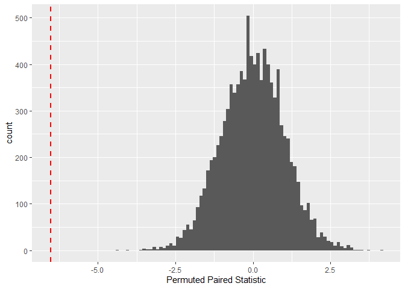
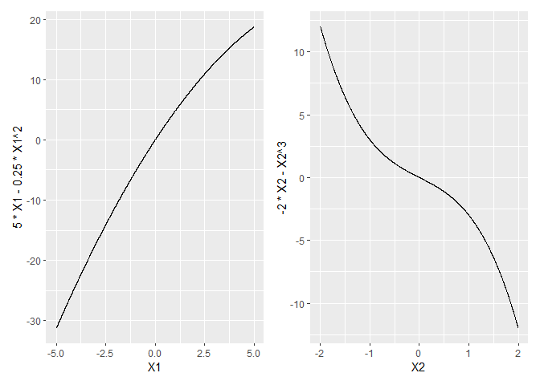

# The First Casualty of Statistics: Part Six
<big>**Matched-Pairs Experiment**</big>

<br/>
Jiří Fejlek

2026-08-16
<br/>

<br/> A matched-pairs experiment (MPE) is an extreme version of a stratified
randomized experiment, in which each stratum consists of merely two
individuals. The idea is that paired individuals are similar to each
other, and thus we can estimate the treatment effect by comparing the
differences in paired outcomes. We will discuss this in later parts as
matching strategies in observational studies. <br/>

## Table of Contents

- [Matched-Pairs Experiment](#matched-pairs-experiment)
- [Fisher Randomization Test for
  MPE](#fisher-randomization-test-for-mpe)
- [Neyman Inference for MPE and Regression
  Approach](#neyman-inference-for-mpe-and-regression-approach)
- [Covariate Adjustments](#covariate-adjustments)
- [References](#references)

``` r
library(tidyr)
library(dplyr)
library(ggplot2)
library(patchwork)
library(dagitty)
library(ggdag)
```

## Matched-Pairs Experiment

Formally speaking, we define MPE as follows. Let us assume two
individuals with potential outcomes (Ding 2024)
``` math
 Y_{1} = Y_1(1)(1-T) + Y_1(0)T
```
``` math
 Y_{2} = Y_2(0)(1-T) + Y_2(1)T,
```
where the treatment assignment $`T`$ is generated as
``` math
T \sim \text{Bernoulli}(0.5).
```
Although MPE is a special case of SRE, it has its own inference
strategies that we will discuss next.

## Fisher Randomization Test for MPE

Let us start with the Fisher randomization test (FRT), i.e., we assume a
sharp null hypothesis
``` math
 H_0: Y_{ij}(0) = Y_{ij}(1) \text{ for all } i = 1,2, \ldots n \text{ and } j = 1,2, \ldots
```
Let us denote
``` math
\hat \tau_i = S_i(Y_{i1}-Y_{i2}),
```
where $`S_i`$ is a sign that depends on the treatment assignments
$`T_i`$. As a statistic for FRT, we can use the paired t-statistic (Ding
2024)
``` math
\frac{\hat \tau}{\sqrt{\frac{1}{n(n-1)}\sum_{i = 1}^n (\hat{\tau}_i - \hat \tau)^2}}.
```
This statistic is motivated by the fact, that provided
$`\hat\tau_i \sim N(0, \sigma^2)`$, then the paired t-statistic has
Student’s distribution with $`n-1`$ degrees of freedom (Ding 2024).

To demonstrate the FRT, let us assume the *Traffic* dataset. An
experiment was performed in Sweden in 1961 and 1962 to assess the effect
of a speed limit on the motorway accident rate. The days were matched so
that the day in 1962 was comparable to the day in 1961. The treatment
concerned whether the speed limit was in effect and enforced.

``` r
library(MASS)
Traffic
```

    ##     year day limit  y
    ## 1   1961   1    no  9
    ## 2   1961   2    no 11
    ## 3   1961   3    no  9
    ## 4   1961   4    no 20
    ## 5   1961   5    no 31
    ## 6   1961   6    no 26
    ## 7   1961   7    no 18
    ## 8   1961   8    no 19
    ## 9   1961   9    no 18
    ## 10  1961  10    no 13
    ## 11  1961  11    no 29
    ## 12  1961  12    no 40
    ## 13  1961  13    no 28
    ## 14  1961  14    no 17
    ## 15  1961  15    no 15
    ## 16  1961  16    no 21
    ## 17  1961  17    no 24
    ## 18  1961  18    no 15
    ## 19  1961  19    no 32
    ## 20  1961  20    no 22

Let’s reorganize the dataset into pairs.

``` r
traffic_paired <- cbind(Traffic[1:92,], Traffic[93:184,])
traffic_paired <- traffic_paired[(traffic_paired[,3] == 'no' & traffic_paired[,7] == 'yes') | (traffic_paired[,3] == 'yes' & traffic_paired[,7] == 'no'),]
traffic_paired <- traffic_paired[, c(2,1,3,4,5,7,8)]
traffic_paired
```

    ##    day year limit  y year.1 limit.1 y.1
    ## 11  11 1961    no 29   1962     yes  17
    ## 12  12 1961    no 40   1962     yes  23
    ## 13  13 1961    no 28   1962     yes  16
    ## 14  14 1961    no 17   1962     yes  20
    ## 15  15 1961    no 15   1962     yes  13
    ## 16  16 1961    no 21   1962     yes  13
    ## 17  17 1961    no 24   1962     yes   9
    ## 18  18 1961    no 15   1962     yes  10
    ## 19  19 1961    no 32   1962     yes  27
    ## 20  20 1961    no 22   1962     yes  12
    ## 21  21 1961    no 24   1962     yes   7
    ## 22  22 1961    no 11   1962     yes  11
    ## 23  23 1961    no 27   1962     yes  15
    ## 29  29 1961   yes 19   1962      no  10
    ## 30  30 1961   yes 19   1962      no  14
    ## 31  31 1961   yes  9   1962      no  18
    ## 32  32 1961   yes 21   1962      no  26
    ## 33  33 1961   yes 22   1962      no  38
    ## 34  34 1961   yes 23   1962      no  31
    ## 35  35 1961   yes 14   1962      no  12
    
Now, treatment or no treatment was applied to both days for some pairs.
Hence, we will remove these pairs to get the MPE design.

``` r
traffic_paired$Y0 <- traffic_paired$y
traffic_paired$Y1 <- traffic_paired$y
traffic_paired$Y0[traffic_paired$limit == 'yes'] <- traffic_paired$y.1[traffic_paired$limit == 'yes']
traffic_paired$Y1[traffic_paired$limit == 'no'] <- traffic_paired$y.1[traffic_paired$limit == 'no']
traffic_paired <- traffic_paired[, c(8,9)]
traffic_paired
```

    ##    Y0 Y1
    ## 11 29 17
    ## 12 40 23
    ## 13 28 16
    ## 14 17 20
    ## 15 15 13
    ## 16 21 13
    ## 17 24  9
    ## 18 15 10
    ## 19 32 27
    ## 20 22 12
    ## 21 24  7
    ## 22 11 11
    ## 23 27 15
    ## 29 10 19
    ## 30 14 19
    ## 31 18  9
    ## 32 26 21
    ## 33 38 22
    ## 34 31 23
    ## 35 12 14
    
Let us compute the paired t-statistic.

``` r
paired_t_stat <- mean(traffic_paired$Y1-traffic_paired$Y0)/sqrt((dim(traffic_paired)[1]*(dim(traffic_paired)[1]-1))^(-1)*sum((traffic_paired$Y1-traffic_paired$Y0 - mean(traffic_paired$Y1-traffic_paired$Y0))^2))
paired_t_stat
```

    ## [1] -6.534399

Next, we computed the paired t-statistics for permuted treatment
assignments (we perform the permutation within each pair).

``` r
n_sim <- 10000
paired_t_stats <- numeric(n_sim)

for (i in 1:n_sim){
  
  traffic_paired_new <- t(apply(traffic_paired, 1, sample))
  Y0_new <- traffic_paired_new[,1]
  Y1_new <- traffic_paired_new[,2]
  
  paired_t_stats[i] <- mean(Y1_new-Y0_new)/sqrt((dim(traffic_paired)[1]*(dim(traffic_paired)[1]-1))^(-1)*sum((Y1_new-Y0_new - mean(Y1_new-Y0_new))^2))
}
```

``` r
ggplot(data = as.data.frame(paired_t_stats), aes(x = paired_t_stats))  + geom_histogram(bins = 100) + xlab('Permuted Paired Statistic') + geom_vline(xintercept = paired_t_stat, color = "red", linetype = "dashed", linewidth = 1)
```

<!-- -->

``` r
mean(abs(paired_t_stats)>abs(paired_t_stat))
```

    ## [1] 0

We observe that the treatment clearly has a statistically significant
effect. We can also perform this test using Student’s distribution
(assuming that $`\hat\tau_i`$ are reasonably close to normally
distributed)

``` r
2*pt(paired_t_stat, dim(traffic_paired)[1]-1)
```

    ## [1] 1.766342e-08

We can perform this test simply using *t.test*.

``` r
t.test(traffic_paired$Y1, traffic_paired$Y0, paired = TRUE)
```

    ## 
    ##  Paired t-test
    ## 
    ## data:  traffic_paired$Y1 and traffic_paired$Y0
    ## t = -6.5344, df = 58, p-value = 1.766e-08
    ## alternative hypothesis: true mean difference is not equal to 0
    ## 95 percent confidence interval:
    ##  -8.413685 -4.467671
    ## sample estimates:
    ## mean difference 
    ##       -6.440678

## Neyman Inference for MPE and Regression Approach

As usual, the alternative to the FRT is the Neyman inference. It can be
shown that under MRE
``` math
\hat V = \frac{1}{n(n-1)}\sum_{i = 1}^n \hat{\tau}_i^2.
```
is a conservative estimator of $`\text{var}(\hat\tau)`$ (Ding 2024). And
hence, we can use the large-sample approximation
``` math
\frac{\hat\tau}{\sqrt{\text{var}(\hat \tau)}} \dot\sim N(0,1)
```
and construct a conservative Wald interval
``` math
 \hat\tau \pm z_{1-\alpha/2}\sqrt{\hat V}
```

``` r
sd_hat <- sqrt((dim(traffic_paired)[1]*(dim(traffic_paired)[1]-1))^(-1)*sum((traffic_paired$Y1-traffic_paired$Y0 - mean(traffic_paired$Y1-traffic_paired$Y0))^2))


c(
  mean(traffic_paired$Y1-traffic_paired$Y0) - sd_hat*qnorm(0.975),
  mean(traffic_paired$Y1-traffic_paired$Y0) + sd_hat*qnorm(0.975)
)
```

    ## [1] -8.372531 -4.508825

Lastly, we can obtain the same estimate by regressing the differences
$`\hat\tau`$ on an intercept.

``` r
summary(lm(traffic_paired$Y1-traffic_paired$Y0~1))
```

    ## 
    ## Call:
    ## lm(formula = traffic_paired$Y1 - traffic_paired$Y0 ~ 1)
    ## 
    ## Residuals:
    ##     Min      1Q  Median      3Q     Max 
    ## -16.559  -5.559  -1.559   3.941  17.441 
    ## 
    ## Coefficients:
    ##             Estimate Std. Error t value Pr(>|t|)    
    ## (Intercept)  -6.4407     0.9857  -6.534 1.77e-08 ***
    ## ---
    ## Signif. codes:  0 '***' 0.001 '**' 0.01 '*' 0.05 '.' 0.1 ' ' 1
    ## 
    ## Residual standard error: 7.571 on 58 degrees of freedom

## Covariate Adjustments

In MRE, two individuals that are paired should be as similar as
possible. But naturally, they will not be the same. Hence, it is
beneficial to adjust for observed differences in covariates. Let us
assume the following simulated dataset for demonstration.

``` r
set.seed(123)

n_pairs <- 50
  
sim_data <- data.frame(
  x1.control = round(rnorm(n_pairs,runif(n_pairs,-5,5),0.25),2),
  x2.control = round(rnorm(n_pairs,runif(n_pairs,-2,2),0.25),2)
)

sim_data$x1.treatment = round(rnorm(n_pairs,sim_data$x1.control,0.25),2)
sim_data$x2.treatment = round(rnorm(n_pairs,sim_data$x2.control,0.15),2)


sim_data$y.control <- round(rnorm(n_pairs,0,0.25),1) + 5*sim_data$x1.control - 0.25*sim_data$x1.control^2 - 2*sim_data$x2.control - sim_data$x2.control^3


sim_data$y.treatment <- 1 + round(rnorm(n_pairs,0,0.25),1) + 5*sim_data$x1.treatment - 0.25*sim_data$x1.treatment^2- 2*sim_data$x2.treatment - sim_data$x2.treatment^3

sim_data$xdiff1 <- sim_data$x1.treatment - sim_data$x1.control
sim_data$xdiff2 <- sim_data$x2.treatment - sim_data$x2.control
sim_data$ydiff <- sim_data$y.treatment - sim_data$y.control

sim_data
```

    ##    x1.control x2.control x1.treatment x2.treatment  y.control y.treatment xdiff1 xdiff2     ydiff
    ## 1       -2.55       1.21        -2.35         1.54 -18.667186  -19.062889   0.20   0.33 -0.395703
    ## 2        3.09       0.05         3.28         0.25  12.862850   13.994775   0.19   0.20  1.131925
    ## 3       -0.87      -0.51        -0.79        -0.55  -3.486574   -2.039650   0.08  -0.04  1.446924
    ## 4        3.55      -1.10         3.30        -1.02  18.130375   17.578708  -0.25   0.08 -0.551667
    ## 5        4.72      -1.79         4.69        -1.85  27.745739   28.882600  -0.03  -0.06  1.136861
    ## 6       -4.44      -0.45        -4.51        -0.52 -26.137275  -25.354417  -0.07  -0.07  0.782858
    ## 7        0.21       0.09         0.35        -0.03   1.158246    2.279402   0.14  -0.12  1.121156
    ## 8        4.15      -1.55         4.06        -1.64  23.468250   24.970044  -0.09  -0.09  1.501794
    ## 9        0.73      -0.32         0.97        -0.07   4.189543    6.055118   0.24   0.25  1.865575
    ## 10      -0.23      -0.90        -0.32        -0.91   0.965775    2.447971  -0.09  -0.01  1.482196
    ## 11       4.74      -0.13         5.00        -0.11  18.245297   20.271331   0.26   0.02  2.026034
    ## 12      -0.33      -0.43        -0.59        -0.39  -0.837718   -0.997706  -0.26   0.04 -0.159988
    ## 13       1.76       0.20         1.44         0.38   7.617600    6.466728  -0.32   0.18 -1.150872
    ## 14       0.65      -0.52         1.46        -0.60   4.624983    8.983100   0.81  -0.08  4.358117
    ## 15      -4.07      -0.45        -4.17        -0.60 -22.900100  -22.881225  -0.10  -0.15  0.018875
    ## 16       3.82       0.21         3.89         0.46  15.422639   15.849639   0.07   0.25  0.427000
    ## 17      -2.59       0.99        -2.43         0.92 -17.577324  -15.244913   0.16  -0.07  2.332411
    ## 18      -4.90      -1.28        -5.02        -1.39 -26.245348  -25.234481  -0.12  -0.11  1.010867
    ## 19      -1.18      -0.56        -1.05        -0.75  -5.052484   -2.203750   0.13  -0.19  2.848734
    ## 20       4.85      -1.19         4.94        -1.38  22.434534   25.187172   0.09  -0.19  2.752638
    
We assume two covariates and a slight nonlinear effect on the outcome.

``` r
X1 <- seq(-5,5,0.001)
X2 <- seq(-2,2,0.002)

p1 <- ggplot() + geom_line(aes(x = X1, y = 5*X1 - 0.25*X1^2))
p2 <- ggplot() + geom_line(aes(x = X2, y = -2*X2 - X2^3))

(p1 + p2) + plot_layout(ncol = 2)
```

<!-- -->

``` r
summary (lm(ydiff ~ 1 , data = sim_data ))
```

    ## 
    ## Call:
    ## lm(formula = ydiff ~ 1, data = sim_data)
    ## 
    ## Residuals:
    ##     Min      1Q  Median      3Q     Max 
    ## -3.4817 -0.6663  0.0566  0.6748  3.4804 
    ## 
    ## Coefficients:
    ##             Estimate Std. Error t value Pr(>|t|)    
    ## (Intercept)   0.8777     0.1767   4.967 8.67e-06 ***
    ## ---
    ## Signif. codes:  0 '***' 0.001 '**' 0.01 '*' 0.05 '.' 0.1 ' ' 1
    ## 
    ## Residual standard error: 1.25 on 49 degrees of freedom

``` r
summary(lm(ydiff ~ xdiff1 +  xdiff2, data = sim_data))
```

    ## 
    ## Call:
    ## lm(formula = ydiff ~ xdiff1 + xdiff2, data = sim_data)
    ## 
    ## Residuals:
    ##      Min       1Q   Median       3Q      Max 
    ## -1.03967 -0.35804  0.03439  0.28450  1.50559 
    ## 
    ## Coefficients:
    ##             Estimate Std. Error t value Pr(>|t|)    
    ## (Intercept)  0.82489    0.08418   9.799 6.15e-13 ***
    ## xdiff1       4.52816    0.37238  12.160 4.04e-16 ***
    ## xdiff2      -4.22157    0.60826  -6.940 1.01e-08 ***
    ## ---
    ## Signif. codes:  0 '***' 0.001 '**' 0.01 '*' 0.05 '.' 0.1 ' ' 1
    ## 
    ## Residual standard error: 0.5946 on 47 degrees of freedom
    ## Multiple R-squared:  0.7828, Adjusted R-squared:  0.7736 
    ## F-statistic: 84.72 on 2 and 47 DF,  p-value: 2.595e-16

We observe that the estimates are similar. However, we notice that the
model without adjustment has a greater standard error. One interesting
option would be to ignore the matching and analyze the data as SRE.

``` r
library(estimatr)

treatment <- c(rep(0,50),rep(1,50))
y <- c(sim_data$y.control,sim_data$y.treatment)
x1 <- c(sim_data$x1.control,sim_data$x1.treatment)
x2 <- c(sim_data$x2.control,sim_data$x2.treatment)
summary(lm_lin(y  ~ treatment, covariates = ~ x1 + x2))
```

    ## 
    ## Call:
    ## lm_lin(formula = y ~ treatment, covariates = ~x1 + x2)
    ## 
    ## Standard error type:  HC2 
    ## 
    ## Coefficients:
    ##                Estimate Std. Error  t value  Pr(>|t|) CI Lower CI Upper DF
    ## (Intercept)    -1.16800     0.3317 -3.52136 6.643e-04  -1.8266  -0.5094 94
    ## treatment       0.82158     0.4768  1.72316 8.815e-02  -0.1251   1.7682 94
    ## x1_c            4.96115     0.1509 32.88127 2.366e-53   4.6616   5.2607 94
    ## x2_c           -3.64393     0.4984 -7.31129 8.649e-11  -4.6335  -2.6543 94
    ## treatment:x1_c -0.01098     0.2166 -0.05072 9.597e-01  -0.4410   0.4190 94
    ## treatment:x2_c -0.27847     0.6878 -0.40489 6.865e-01  -1.6441   1.0871 94
    ## 
    ## Multiple R-squared:  0.979 , Adjusted R-squared:  0.9778 
    ## F-statistic: 820.9 on 5 and 94 DF,  p-value: < 2.2e-16

We observe that the estimate is almost the same. However, we see that
the standard errors are even greater than those for the unadjusted
model. This is because we ignore the fact that data were generated by
matching. We can demonstrate this using a bootstrap.

Let us first bootstrap the dataset and compute the standard deviation of
the bootstrapped estimates, ignoring matching (we use a pairs-cluster
bootstrap to keep the treatment and control groups balanced).

``` r
data_boot_treat <- data.frame(x1 = sim_data$x1.treatment, x2 = sim_data$x2.treatment, y = sim_data$y.treatment, treatment = rep(1,length(sim_data$x1.treatment)))

data_boot_control <- data.frame(x1 = sim_data$x1.control, x2 = sim_data$x2.control, y = sim_data$y.control, treatment = rep(0,length(sim_data$x1.treatment)))

betas_boot <- numeric(1000)

for (i in 1:1000){
  
  data_boot_new <- rbind(
    data_boot_treat[sample(nrow(data_boot_treat) , rep=TRUE),],
    data_boot_control[sample(nrow(data_boot_control) , rep=TRUE),])
  
  betas_boot[i]<- summary(lm_lin(y  ~ treatment, covariates = ~ x1 + x2, data = data_boot_new))$coef[2]
}

sd(betas_boot)
```

    ## [1] 0.450244

We observe that we got a value that corresponds to the Lin estimator.
However, let us now respect the matching used to generate the dataset
and bootstrap *over matched pairs*.

``` r
betas_boot <- numeric(1000)

for (i in 1:1000){
  
  sim_data_new <- sim_data[sample(nrow(sim_data) , rep=TRUE),]
  
  y_new <- c(sim_data_new$y.control,sim_data_new$y.treatment)
  x1_new <- c(sim_data_new$x1.control,sim_data_new$x1.treatment)
  x2_new <- c(sim_data_new$x2.control,sim_data_new$x2.treatment)
  
  treatment_new <- c(rep(0,50),rep(1,50))
  
  betas_boot[i]<- summary(lm_lin(y_new  ~ treatment_new, covariates = ~ x1_new + x2_new))$coef[2]
}

sd(betas_boot)
```

    ## [1] 0.08256064

We now obtain the standard error, which is in line with the adjusted MRE
estimate. By preserving the matching in resamples, we drastically
reduced the estimate’s variance.

Let us investigate this more by repeating the simulation.

``` r
set.seed(123)

n_sim <- 1000
betas <- matrix(0,n_sim,3)
sd_betas <- matrix(0,n_sim,3)

for (i in 1:n_sim){

n_pairs <- 50
  
sim_data <- data.frame(
  x1.control = round(rnorm(n_pairs,runif(n_pairs,-5,5),0.25),2),
  x2.control = round(rnorm(n_pairs,runif(n_pairs,-2,2),0.25),2)
)

sim_data$x1.treatment = round(rnorm(n_pairs,sim_data$x1.control,0.25),2)
sim_data$x2.treatment = round(rnorm(n_pairs,sim_data$x2.control,0.15),2)
sim_data$y.control <- round(rnorm(n_pairs,0,0.25),1) + 5*sim_data$x1.control - 0.25*sim_data$x1.control^2 - 2*sim_data$x2.control - sim_data$x2.control^3

sim_data$y.treatment <- 1 + round(rnorm(n_pairs,0,0.25),1) + 5*sim_data$x1.treatment - 0.25*sim_data$x1.treatment^2- 2*sim_data$x2.treatment - sim_data$x2.treatment^3

sim_data$xdiff1 <- sim_data$x1.treatment - sim_data$x1.control
sim_data$xdiff2 <- sim_data$x2.treatment - sim_data$x2.control
sim_data$ydiff <- sim_data$y.treatment - sim_data$y.control


treatment <- c(rep(0,50),rep(1,50))
y <- c(sim_data$y.control,sim_data$y.treatment)
x1 <- c(sim_data$x1.control,sim_data$x1.treatment)
x2 <- c(sim_data$x2.control,sim_data$x2.treatment)


betas[i,1] <- summary(lm(ydiff ~ 1 , data = sim_data ))$coef[1]
betas[i,2] <- summary(lm(ydiff ~ xdiff1 + xdiff2, data = sim_data))$coef[1]
betas[i,3] <- summary(lm_lin(y  ~ treatment, covariates = ~ x1 + x2))$coef[2]

sd_betas[i,1] <- summary(lm(ydiff ~ 1 , data = sim_data ))$coef[1,2]
sd_betas[i,2] <- summary(lm(ydiff ~ xdiff1 + xdiff2 , data = sim_data))$coef[1,2]
sd_betas[i,3] <- summary(lm_lin(y  ~ treatment, covariates = ~ x1 + x2))$coef[2,2]

}

results <- cbind(
apply(betas,2,mean),
apply(betas,2,sd)
)

colnames(results) <- c('mean', 'sd')
rownames(results) <- c('unadj. MRE', 'adj. MRE','Lin postSRE')
results
```

    ##                  mean        sd
    ## unadj. MRE  0.9940556 0.2437217
    ## adj. MRE    0.9862106 0.1144994
    ## Lin postSRE 0.9831345 0.1190339

We observe that the adjusted MRE estimate and the Lin estimator perform
about the same. The unadjusted estimate is noticeably worse. Let’s check
estimates of the standard error.

``` r
results <- cbind(
apply(sd_betas,2,mean),
apply(sd_betas,2,sd)
)

colnames(results) <- c('mean', 'sd')
rownames(results) <- c('unadj. MRE', 'adj. MRE','Lin postSRE')
results
```

    ##                  mean         sd
    ## unadj. MRE  0.2459426 0.03159032
    ## adj. MRE    0.1119902 0.01801550
    ## Lin postSRE 0.5044303 0.05717444

We observe that the standard error estimate of the Lin estimator is
severely overestimated, as expected; i.e., the standard error estimate
predicts much greater error than the estimator actually exhibits.

The fact that the Lin estimator performs comparably to the matching
estimator also indicates that the benefit lies in having these close
pairs systematically in the dataset (as if we were observing
counterfactuals). Provided that we generate the pairs and distrupt them
by shuffling, the estimators still perform as well.

``` r
set.seed(123)

n_sim <- 1000
betas <- matrix(0,n_sim,3)
sd_betas <- matrix(0,n_sim,3)

for (i in 1:n_sim){

n_pairs <- 50
  
sim_data <- data.frame(
  x1.control = round(rnorm(n_pairs,runif(n_pairs,-5,5),0.25),2),
  x2.control = round(rnorm(n_pairs,runif(n_pairs,-2,2),0.25),2)
)

sim_data$x1.treatment <- round(rnorm(n_pairs,sim_data$x1.control,0.25),2)
sim_data$x2.treatment <- round(rnorm(n_pairs,sim_data$x2.control,0.15),2)

sim_data[,c(3,4)] <- sim_data[sample(nrow(sim_data)),c(3,4)]

sim_data$y.control <- round(rnorm(n_pairs,0,0.25),1) + 5*sim_data$x1.control - 0.25*sim_data$x1.control^2 - 2*sim_data$x2.control - sim_data$x2.control^3
sim_data$y.treatment <- 1 + round(rnorm(n_pairs,0,0.25),1) + 5*sim_data$x1.treatment - 0.25*sim_data$x1.treatment^2- 2*sim_data$x2.treatment - sim_data$x2.treatment^3


sim_data$xdiff1 <- sim_data$x1.treatment - sim_data$x1.control
sim_data$xdiff2 <- sim_data$x2.treatment - sim_data$x2.control
sim_data$ydiff <- sim_data$y.treatment - sim_data$y.control

treatment <- c(rep(0,50),rep(1,50))
y <- c(sim_data$y.control,sim_data$y.treatment)
x1 <- c(sim_data$x1.control,sim_data$x1.treatment)
x2 <- c(sim_data$x2.control,sim_data$x2.treatment)


betas[i,1] <- summary(lm(ydiff ~ 1 , data = sim_data ))$coef[1]
betas[i,2] <- summary(lm(ydiff ~ xdiff1 + xdiff2, data = sim_data))$coef[1]
betas[i,3] <- summary(lm_lin(y  ~ treatment, covariates = ~ x1 + x2))$coef[2]

sd_betas[i,1] <- summary(lm(ydiff ~ 1 , data = sim_data ))$coef[1,2]
sd_betas[i,2] <- summary(lm(ydiff ~ xdiff1 + xdiff2 , data = sim_data))$coef[1,2]
sd_betas[i,3] <- summary(lm_lin(y  ~ treatment, covariates = ~ x1 + x2))$coef[2,2]

}

results <- cbind(
apply(betas,2,mean),
apply(betas,2,sd)
)

colnames(results) <- c('mean', 'sd')
rownames(results) <- c('unadj. MRE', 'adj. MRE','Lin postSRE')
results
```

    ##                  mean        sd
    ## unadj. MRE  0.9764646 0.2501216
    ## adj. MRE    0.9801398 0.1143364
    ## Lin postSRE 0.9798088 0.1145640

However, now all the error estimates are off because we did not perform
the correct matching.

``` r
results <- cbind(
apply(sd_betas,2,mean),
apply(sd_betas,2,sd)
)

colnames(results) <- c('mean', 'sd')
rownames(results) <- c('unadj. MRE', 'adj. MRE','Lin postSRE')
results
```

    ##                  mean         sd
    ## unadj. MRE  3.1440057 0.34290160
    ## adj. MRE    0.4907383 0.06576791
    ## Lin postSRE 0.5013449 0.05551302

Let’s, for comparison, generate the data using SRE instead of MRE by
generating the second individual independently of the first, i.e., there
are no pairs in the dataset.

``` r
set.seed(123)

n_sim <- 1000
betas <- matrix(0,n_sim,3)
sd_betas <- matrix(0,n_sim,3)

for (i in 1:n_sim){
  
sim_data <- data.frame(
  x1.control = round(rnorm(n_pairs,runif(n_pairs,-5,5),0.25),2),
  x2.control = round(rnorm(n_pairs,runif(n_pairs,-2,2),0.25),2),
  x1.treatment = round(rnorm(n_pairs,runif(n_pairs,-5,5),0.25),2),
  x2.treatment = round(rnorm(n_pairs,runif(n_pairs,-2,2),0.25),2)
)

sim_data$y.control <- round(rnorm(n_pairs,0,0.25),1) + 5*sim_data$x1.control - 0.25*sim_data$x1.control^2 - 2*sim_data$x2.control - sim_data$x2.control^3
sim_data$y.treatment <- 1 + round(rnorm(n_pairs,0,0.25),1) + 5*sim_data$x1.treatment - 0.25*sim_data$x1.treatment^2- 2*sim_data$x2.treatment - sim_data$x2.treatment^3


sim_data$xdiff1 <- sim_data$x1.treatment - sim_data$x1.control
sim_data$xdiff2 <- sim_data$x2.treatment - sim_data$x2.control
sim_data$ydiff <- sim_data$y.treatment - sim_data$y.control

treatment <- c(rep(0,50),rep(1,50))
y <- c(sim_data$y.control,sim_data$y.treatment)
x1 <- c(sim_data$x1.control,sim_data$x1.treatment)
x2 <- c(sim_data$x2.control,sim_data$x2.treatment)


betas[i,1] <- summary(lm(ydiff ~ 1 , data = sim_data ))$coef[1]
betas[i,2] <- summary(lm(ydiff ~ xdiff1 + xdiff2, data = sim_data))$coef[1]
betas[i,3] <- summary(lm_lin(y  ~ treatment, covariates = ~ x1 + x2))$coef[2]

sd_betas[i,1] <- summary(lm(ydiff ~ 1 , data = sim_data ))$coef[1,2]
sd_betas[i,2] <- summary(lm(ydiff ~ xdiff1 + xdiff2 , data = sim_data))$coef[1,2]
sd_betas[i,3] <- summary(lm_lin(y  ~ treatment, covariates = ~ x1 + x2))$coef[2,2]


}

results <- cbind(
apply(betas,2,mean),
apply(betas,2,sd)
)

colnames(results) <- c('mean', 'sd')
rownames(results) <- c('unadj. MRE', 'adj. MRE','Lin postSRE')
results
```

    ##                 mean        sd
    ## unadj. MRE  1.034587 3.1560877
    ## adj. MRE    1.008536 0.5274749
    ## Lin postSRE 1.010623 0.5260725

``` r
results <- cbind(
apply(sd_betas,2,mean),
apply(sd_betas,2,sd)
)

colnames(results) <- c('mean', 'sd')
rownames(results) <- c('unadj. MRE', 'adj. MRE','Lin postSRE')
results
```

    ##                  mean         sd
    ## unadj. MRE  3.1347138 0.28400125
    ## adj. MRE    0.5011235 0.05633093
    ## Lin postSRE 0.5018243 0.04498791

We observe that the standard errors of the estimates are much larger,
and the estimated errors correspond to the observed ones. We can also
notice that the observed standard errors now correspond to the
“shuffled” errors and to the error estimates that the Lin estimator was
giving under MRE.

So we conclude from our little experiment that matching can greatly
increase the accuracy of the estimates, and thus increase the power of
the inference. However, we have to be careful to make an appropriate
modification to the inference; if we treat the data as unmatched, we
overestimate the errors.

So, matching is great; where is the catch? Well, for matching to be at
its best, we need covariates that predict the outcome and matching to be
done well (Ding 2024). To do so, we need to know which covariates are
important in advance at the design stage, and we need to have suitable
individual pairs that are close with respect to these covariates. And as
far as the second point is concerned, we need to take into account that
the likelihood of having these perfect matches rapidly diminishes with
the number of covariates (aka the curse of dimensionality). There is
also the issue of attrition: if one individual drops out of the
experiment, we lose the whole pair.

## References

<div id="refs" class="references csl-bib-body hanging-indent">

<div id="ref-ding2024first" class="csl-entry">

Ding, Peng. 2024. *A First Course in Causal Inference*. CRC press.

</div>

</div>
