# The First Casualty of Statistics: Part Seven
<big>**Observational Studies**</big>

<br/>
Jiří Fejlek

2026-08-19
<br/>

<br/> From now on, we move from randomized experiments to observational
studies, i.e., we no longer assume that the treatment assignment is
independent of potential outcomes. We will still assume a homogeneous
treatment effect, but selection bias is now our main focus. <br/>

## Table of Contents

- [Observational Studies](#observational-studies)
- [Identification](#identification)
- [Single World Intervention Graphs](#single-world-intervention-graphs)
- [Simple Regression Approach under Conditional
  Ignorability](#simple-regression-approach-under-conditional-ignorability)
- [Homocyst Dataset](#homocyst-dataset)
- [References](#references)

``` r
library(tidyr)
library(dplyr)
library(ggplot2)
library(patchwork)
library(dagitty)
library(ggdag)
```

## Observational Studies

We defined back in Part Three the average treatment effect (ATE)
``` math
\text{ATE} = \mathbb{E}(Y(1)- Y(0))
```
and the average predictive effect
``` math
\text{APE} = \mathbb{E}(Y \mid T = 1) - \mathbb{E}(Y \mid T = 0).
```
The average predictive effect can be quite easily estimated from the
data; however, the average treatment effect, which is the main object of
interest under the assumption of homogeneous treatment effect, cannot be
estimated from the data in general. We stated that (Cunningham 2021)
``` math
\text{APE} = \text{ATE} + \text{selection bias}.
```
The selection bias equals
``` math
\text{selection bias} = \mathbb{E}(Y(0)\mid T = 1) -\mathbb{E}(Y(0)\mid T = 0).
```
In previous parts, we dealt with this bias by assuming randomization of
treatment assignment
``` math
T \perp (Y(0),Y(1)),
```
which guarantees that selection bias is zero (in practice, we need to
ensure we have enough samples so that randomization can balance
treatment and control groups). In observational studies, there is no
such guarantee, even for very large samples; hence, we will have to make
additional strong assumptions to make causal inference work.

## Identification

The main strategy in causal inference in observational studies is to
observe a set of covariates $`X`$, such that (Ding 2024)
``` math
\mathbb{E}(Y(0)\mid T = 1, X)  = \mathbb{E}(Y(0)\mid T = 0, X)
```
and
``` math
\mathbb{E}(Y(1)\mid T = 1, X)  = \mathbb{E}(Y(1)\mid T = 0, X),
```
i.e., such that the differences in the means of the potential outcomes
across the treatment and control groups are entirely due to the
difference in the observed covariates. Since we already discussed DAGs
in Part Two, we should all know where this is going: we need to observe
all the confounders (common causes) between the treatment and the
outcome.

We should add that we know from Part Three that
``` math
\text{APE} = \text{ATT} + \text{selection bias} = \mathbb{E}(Y(1)- Y(0) \mid  T = 1) + (\mathbb{E}(Y(0)\mid T = 1) -\mathbb{E}(Y(0)\mid T = 0)).
```
However, we could also write
``` math
 
\begin{split}
\text{APE} = \mathbb{E}(Y \mid T = 1) - \mathbb{E}(Y \mid T = 0)   &= \mathbb{E}(Y(1) \mid T = 1) - \mathbb{E}(Y(0) \mid T = 0) \\
& = \mathbb{E}(Y(1)-Y(0) \mid T = 0) + \left(\mathbb{E}(Y(1)\mid T = 1) -\mathbb{E}(Y(1)\mid T = 0)\right)\\
& = \text{ATU} + \text{selection bias}, 
\end{split}
```
i.e., we have strictly speaking two types of selection bias
``` math
\text{selection bias} = \mathbb{E}(Y(0)\mid T = 1) -\mathbb{E}(Y(0)\mid T = 0)
```
and
``` math
\text{selection bias} = \mathbb{E}(Y(1)\mid T = 1) -\mathbb{E}(Y(1)\mid T = 0).
```
However, these two terms are equal provided $`\text{ATT}= \text{ATU}`$
(i.e., under no heterogeneous treatment bias), since
``` math
\text{ATT} = \mathbb{E}(Y(1)- Y(0) \mid  T = 1) = \mathbb{E}(Y(1)- Y(0) \mid  T = 0) = \text{ATU},
```
which implies
``` math
\mathbb{E}(Y(1) \mid T = 1) - \mathbb{E}(Y(1)\mid  T = 0) = \mathbb{E}(Y(0)\mid T = 1) - \mathbb{E}(Y(0)\mid T = 0),
```
i.e., both selection biases are equal. Consequently, the second
condition on $`X`$ for $`Y(1)`$ is not something extra on top of the
condition on $`Y(0)`$.

The assumptions
``` math
\mathbb{E}(Y(0)\mid T = 1, X)  = \mathbb{E}(Y(0)\mid T = 0, X)
```
and
``` math
\mathbb{E}(Y(1)\mid T = 1, X)  = \mathbb{E}(Y(1)\mid T = 0, X),
```
ensures that
``` math
\mathbb{E}(Y \mid T = 1, X) - \mathbb{E}(Y \mid T = 0, X) = \mathbb{E}(Y(1)-Y(0) \mid T = 1, X) = \mathbb{E}(Y(1)-Y(0) \mid T = 0, X) = \mathbb{E}(Y(1)-Y(0) \mid X),
```
i.e., $`\text{APE} = \text{ATT} = \text{ATU} = \text{ATE}`$
conditionally on $`X`$. Consequently, we can now estimate the
*conditional average treatment effect* (CATE) (Ding 2024)
``` math
\text{CATE} = \mathbb{E}(Y(1)-Y(0) \mid X).
```
This fact that the CATE can be estimated from the data (using the
formula $`\mathbb{E}(Y \mid T = 1, X) - \mathbb{E}(Y \mid T = 0, X)`$)
is formally known as being *nonparametrically identifiable*, which means
that it can be be written as a function of the distribution of the
observed data without any parametric model assumptions (Ding 2024). In
addition, we get by using the total law of expectation the so-called
*g-formula* (Ding 2024)
``` math
 \text{ATE} = \mathbb{E}_X \text{ CATE} = \int_X (\mathbb{E}(Y \mid T = 1, X) - \mathbb{E}(Y \mid T = 0, X)) F(\mathrm{d}X),
```
where $`F(\mathrm{d}X)`$ denotes the probability measure induced by
$`X`$ (we can understand it as a fancy formal way of writing an
expectation with respect to both continuous and discrete random
variables using an integral notation). This also implies that ATE is
also nonparametrically identifiable.

Lastly, we should note that these assumptions only guarantee
identifiability of ATE, but we might want to estimate other quantities
(e.g., quantiles), and thus, we often need to assume *ignorability*
(Ding 2024)
``` math
Y(0) \perp  T \mid X \text{ and } Y(1) \perp  T \mid X
```
or *strong ignorability*
``` math
(Y(0),Y(1)) \perp T \mid X,
```
which are identical conditions in most reasonable statistical models
(Ding 2024).

## Single World Intervention Graphs

We discussed two frameworks in our series about causal inference: the
potential outcomes framework and the DAG framework. From the potential
outcomes perspective, we got the ignorability condition
``` math
Y(0) \perp  T \mid X \text{ and } Y(1) \perp  T \mid X
```
and from the DAG, we got the back-door criterion (Peters et al. 2017) *A
set of variables $`X`$ satisfies the back-door criterion, given a DAG
$`\mathcal{G}`$ for the treatment $`T`$ and the outcome $`Y`$, if no
node of $`X`$ is a descendant of $`T`$ and $`X`$ blocks all the paths
between $`T`$ and $`Y`$ that contain an arrow into $`T`$ (the back-door
path).*

It might not be clear how these two criteria are related, since DAG does
not operate with potential outcomes at all. To demonstrate that both
frameworks are equivalent, let us consider an extension of the DAG known
as a single world intervention graph (SWIG) (Richardson and Robins
2013).

First, we will consider a DAG for a simple completely randomized
experiment.

``` r
dag <- dagify(Y ~ T + U, exposure = 'T', outcome = 'Y')
ggdag_status(dag) + theme_dag() + theme(legend.position = "none")
```

<!-- -->

The node $`U`$ denotes unobserved variables that influence the outcome
$`Y`$, but are not confounded with $`T`$. Next, we transform this DAG
into SWIG. We “split” the node $`T`$ into a “random part” $`T`$ and a
fixed part, a treatment assignment $`t = 0`$ or $`t = 1`$. All the
arrows that point to $`T`$ are considered to go into the random part;
all the arrows that leave the node $`T`$ are leaving from the fixed
part. Lastly, we apply the treatment assignment to all nodes downstream
of $`T`$, i.e., in our case, $`Y`$ becomes $`Y(0)`$ or $`Y(1)`$.

Overall, we get the following graphs (since *dagitty* and *ggdag* does
not support SWIG, we denote the split using $`\mid`$)

``` r
dag <- dagify(Y ~ T + U, exposure = 'T', outcome = 'Y')
ggdag_status(dag, text = FALSE) + geom_dag_text(label = c("T|t=0", "U" ,"Y(0)"), color = "white") + theme_dag() + theme(legend.position = "none")
```

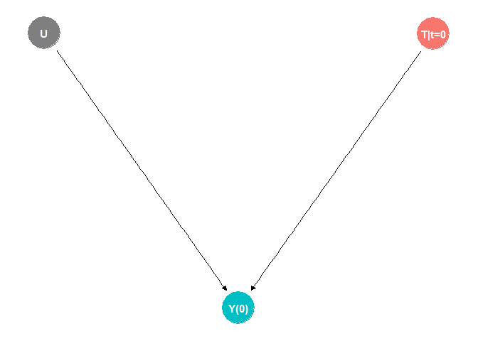<!-- -->

``` r
dag <- dagify(Y ~ T + U, exposure = 'T', outcome = 'Y')
ggdag_status(dag, text = FALSE) + geom_dag_text(label = c("T|t=1", "U" ,"Y(1)"), color = "white") + theme_dag() + theme(legend.position = "none")
```

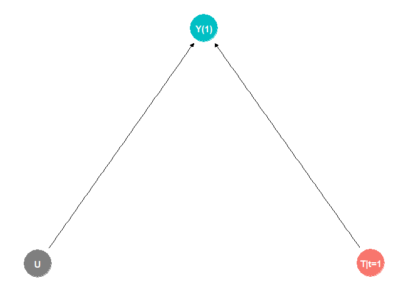<!-- -->

We can combine these two graphs into a single one.

``` r
dag <- dagify(Y ~ T + U, exposure = 'T', outcome = 'Y')
ggdag_status(dag, text = FALSE) + geom_dag_text(label = c("T|t", "U" ,"Y(t)"), color = "white") + theme_dag() + theme(legend.position = "none")
```

<!-- -->

These modified DAGs are known as SWIGs, and crucially, the rules of
d-separation still apply. We only need to add a rule stating that the
path between the random and fixed parts of the split is always closed
(Richardson and Robins 2013). Consequently, we get from the SWIG that
``` math
Y(0) \perp T \text{ and }  Y(1) \perp T.
```
Let’s assume a confounder $`C`$.

``` r
dag <- dagify(Y ~ T + U + C, T ~ C, exposure = 'T', outcome = 'Y')
ggdag_status(dag, text = FALSE) + geom_dag_text(label = c("C", "T|t" , "U", "Y(t)"), color = "white") + theme_dag() + theme(legend.position = "none")
```

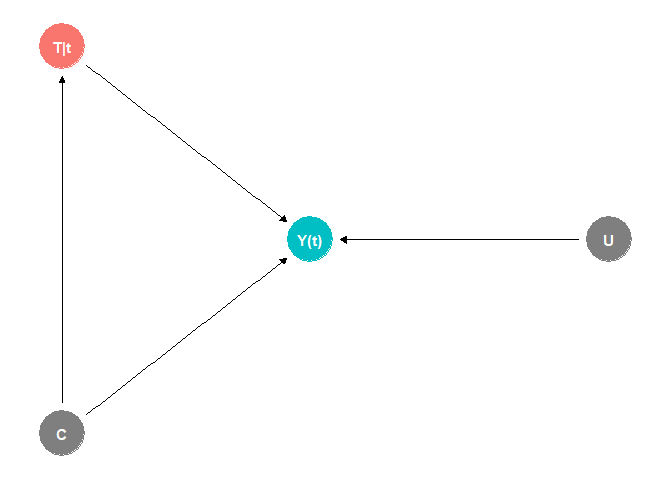<!-- -->

Now $`Y(0) \perp T`$ and $`Y(1) \perp T`$ no longer holds since $`T`$
and $`Y(t)`$ are no longer d-separated. However, we can block the
back-door path by conditioning on $`C`$, i.e.,
``` math
Y(0) \perp T \mid C \text{ and }  Y(1) \perp T \mid C.
```

One interesting configuration we have not explicitly discussed before is
as follows.

``` r
dag <- dagify(Y ~ T + U, Z ~ Y, exposure = 'T', outcome = 'Y')
ggdag_status(dag, text = FALSE) + geom_dag_text(label = c("T|t" , "U", "Y(t)", "Z(t)"), color = "white") + theme_dag() + theme(legend.position = "none")
```

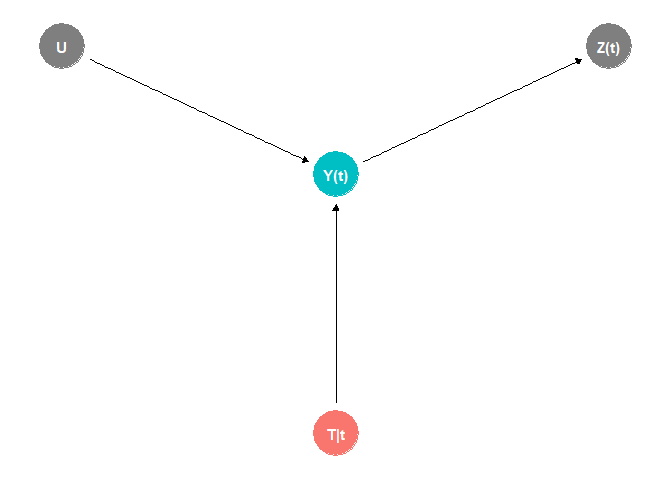<!-- -->

The variable $`Z`$ is a direct descendant of $`Y`$, but there is no
arrow pointing from $`T`$, i.e., $`Z`$ is not a collider. We see from
the SWIN that
``` math
Y(0) \perp T \mid Z(0) \text{ and }  Y(1) \perp T \mid Z(1),
```
but this fact does *not* imply that
``` math
Y(0) \perp T \mid Z \text{ and }  Y(1) \perp T \mid Z.
```
Notice that the back-door criterion acknowledges this problem by
requiring that adjustment variables $`X`$ must not include a descendant
of $`T`$.

The variable $`Z`$ is known as a *virtual collider*, and is a bad
control, as we can demonstrate with a quick simulation.

``` r
set.seed(123)
T <- rnorm(1000, 0, 1)                # treatment
Y <- T + rnorm(1000, 0, 0.5)          # outcome
Z <- 0.25*Y + rnorm(1000, 0, 0.1)     # virtual collider

summary(lm(Y ~ T + Z))
```

    ## 
    ## Call:
    ## lm(formula = Y ~ T + Z)
    ## 
    ## Residuals:
    ##     Min      1Q  Median      3Q     Max 
    ## -1.0002 -0.2041 -0.0016  0.2021  0.8521 
    ## 
    ## Coefficients:
    ##             Estimate Std. Error t value Pr(>|t|)    
    ## (Intercept) 0.012714   0.009644   1.318    0.188    
    ## T           0.401782   0.018279  21.980   <2e-16 ***
    ## Z           2.478750   0.059733  41.497   <2e-16 ***
    ## ---
    ## Signif. codes:  0 '***' 0.001 '**' 0.01 '*' 0.05 '.' 0.1 ' ' 1
    ## 
    ## Residual standard error: 0.3049 on 997 degrees of freedom
    ## Multiple R-squared:   0.93,  Adjusted R-squared:  0.9299 
    ## F-statistic:  6622 on 2 and 997 DF,  p-value: < 2.2e-16

The second structure, which we will shut out here since we did not do so
in the past, is the *M-structure*.

``` r
dag <- dagify(Y ~ T + U2, T ~ U1, M ~ U1 + U2,  exposure = 'T', outcome = 'Y')
ggdag_status(dag, text = FALSE) + geom_dag_text(label = c("M" , "T|t", "U1", "U2", "Y(t)"), color = "white") + theme_dag() + theme(legend.position = "none")
```

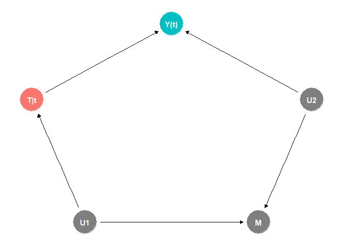<!-- -->

The M-structure challenges the heuristic of simply adjusting for *every
pretreatment* variable, since $`M`$ is a collider even though it is
neither a descendant of the outcome $`Y`$ nor of $`T`$.

``` r
set.seed(123)
U1 <- rnorm(10000, 0, 1)               # hidden cause 1
U2 <- rnorm(10000, 0, 1)               # hidden cause 2

T <- U1 + rnorm(10000, 0, 1)           # treatment
Y <- T + U2 + rnorm(10000, 0, 0.5)     # outcome
M <- U1 - U2 + rnorm(10000, 0, 0.1)    # collider

summary(lm(Y ~ T + M))
```

    ## 
    ## Call:
    ## lm(formula = Y ~ T + M)
    ## 
    ## Residuals:
    ##      Min       1Q   Median       3Q      Max 
    ## -3.00828 -0.51614 -0.00212  0.50625  2.94506 
    ## 
    ## Coefficients:
    ##              Estimate Std. Error  t value Pr(>|t|)    
    ## (Intercept) -0.003170   0.007644   -0.415    0.678    
    ## T            1.324123   0.006195  213.738   <2e-16 ***
    ## M           -0.665751   0.006256 -106.412   <2e-16 ***
    ## ---
    ## Signif. codes:  0 '***' 0.001 '**' 0.01 '*' 0.05 '.' 0.1 ' ' 1
    ## 
    ## Residual standard error: 0.7643 on 9997 degrees of freedom
    ## Multiple R-squared:  0.8205, Adjusted R-squared:  0.8204 
    ## F-statistic: 2.284e+04 on 2 and 9997 DF,  p-value: < 2.2e-16

``` r
set.seed(123)
U1 <- rnorm(10000, 0, 1)               # hidden cause 1
U2 <- rnorm(10000, 0, 1)               # hidden cause 2

T <- U1 + rnorm(10000, 0, 1)           # treatment
Y <- T + U2 + rnorm(10000, 0, 0.5)     # outcome
M <- U1 - U2 + rnorm(10000, 0, 0.1)    # collider

summary(lm(Y ~ T))
```

    ## 
    ## Call:
    ## lm(formula = Y ~ T)
    ## 
    ## Residuals:
    ##     Min      1Q  Median      3Q     Max 
    ## -3.9058 -0.7567 -0.0149  0.7440  3.9133 
    ## 
    ## Coefficients:
    ##              Estimate Std. Error t value Pr(>|t|)    
    ## (Intercept) -0.011800   0.011162  -1.057     0.29    
    ## T            0.992487   0.007819 126.939   <2e-16 ***
    ## ---
    ## Signif. codes:  0 '***' 0.001 '**' 0.01 '*' 0.05 '.' 0.1 ' ' 1
    ## 
    ## Residual standard error: 1.116 on 9998 degrees of freedom
    ## Multiple R-squared:  0.6171, Adjusted R-squared:  0.6171 
    ## F-statistic: 1.611e+04 on 1 and 9998 DF,  p-value: < 2.2e-16

We observe that indeed conditioning on $`M`$ introduces a bias in the
estimate. However, it is probably quite unlikely that we will observe a
pure M-structure. $`M`$ could also be a confounder, and then adjusting
might be the lesser evil.

``` r
dag <- dagify(Y ~ T + U2 + M, T ~ U1, M ~ U1 + U2,  exposure = 'T', outcome = 'Y')
ggdag_status(dag, text = FALSE) + geom_dag_text(label = c("M" , "T|t", "U1", "U2", "Y(t)"), color = "white") + theme_dag() + theme(legend.position = "none")
```

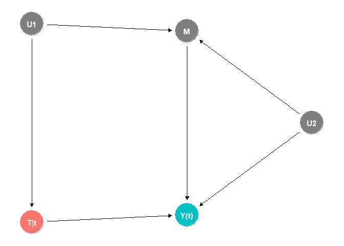<!-- -->

``` r
set.seed(123)
U1 <- rnorm(10000, 0, 1)                  # hidden cause 1
U2 <- rnorm(10000, 0, 1)                  # hidden cause 2

T <- U1 + rnorm(10000, 0, 1)              # treatment
M <- U1 - U2 + rnorm(10000, 0, 0.1)       # collider and counfounder
Y <- 2*M + T + U2 + rnorm(10000, 0, 0.5)  # outcome

summary(lm(Y ~ T))
```

    ## 
    ## Call:
    ## lm(formula = Y ~ T)
    ## 
    ## Residuals:
    ##     Min      1Q  Median      3Q     Max 
    ## -7.3231 -1.2293  0.0069  1.2435  5.9639 
    ## 
    ## Coefficients:
    ##             Estimate Std. Error t value Pr(>|t|)    
    ## (Intercept)  0.02030    0.01799   1.128    0.259    
    ## T            1.99557    0.01260 158.365   <2e-16 ***
    ## ---
    ## Signif. codes:  0 '***' 0.001 '**' 0.01 '*' 0.05 '.' 0.1 ' ' 1
    ## 
    ## Residual standard error: 1.799 on 9998 degrees of freedom
    ## Multiple R-squared:  0.715,  Adjusted R-squared:  0.7149 
    ## F-statistic: 2.508e+04 on 1 and 9998 DF,  p-value: < 2.2e-16

``` r
set.seed(123)
U1 <- rnorm(10000, 0, 1)                  # hidden cause 1
U2 <- rnorm(10000, 0, 1)                  # hidden cause 2

T <- U1 + rnorm(10000, 0, 1)              # treatment
M <- U1 - U2 + rnorm(10000, 0, 0.1)       # collider and counfounder
Y <- 2*M + T + U2 + rnorm(10000, 0, 0.5)  # outcome

summary(lm(Y ~ T + M))
```

    ## 
    ## Call:
    ## lm(formula = Y ~ T + M)
    ## 
    ## Residuals:
    ##      Min       1Q   Median       3Q      Max 
    ## -2.95510 -0.51096 -0.00137  0.51464  2.72419 
    ## 
    ## Coefficients:
    ##             Estimate Std. Error t value Pr(>|t|)    
    ## (Intercept) 0.005783   0.007675   0.753    0.451    
    ## T           1.335775   0.006212 215.027   <2e-16 ***
    ## M           1.330595   0.006277 211.973   <2e-16 ***
    ## ---
    ## Signif. codes:  0 '***' 0.001 '**' 0.01 '*' 0.05 '.' 0.1 ' ' 1
    ## 
    ## Residual standard error: 0.7675 on 9997 degrees of freedom
    ## Multiple R-squared:  0.9481, Adjusted R-squared:  0.9481 
    ## F-statistic: 9.136e+04 on 2 and 9997 DF,  p-value: < 2.2e-16

Or $`U_1`$ and $`U_2`$ might be correlated, which might be the case
since they often represent some latent characteristic of individuals.

``` r
dag <- dagify(Y ~ T + U2 + M, T ~ U1, M ~ U1 + U2, U2 ~ U1,  exposure = 'T', outcome = 'Y')
ggdag_status(dag, text = FALSE) + geom_dag_text(label = c("M" , "T|t", "U1", "U2", "Y(t)"), color = "white") + theme_dag() + theme(legend.position = "none")
```

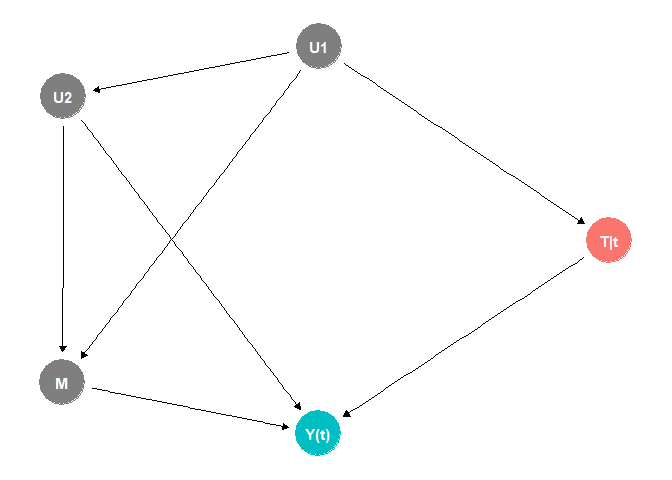<!-- -->

``` r
set.seed(123)
U1 <- rnorm(10000, 0, 1)                  # hidden cause 1
U2 <- -U1 + rnorm(10000, 0, 1)            # hidden cause 2

T <- U1 + rnorm(10000, 0, 1)              # treatment
M <- U1 - U2 + rnorm(10000, 0, 0.1)       # collider
Y <- T + U2 + rnorm(10000, 0, 0.5)        # outcome

summary(lm(Y ~ T))
```

    ## 
    ## Call:
    ## lm(formula = Y ~ T)
    ## 
    ## Residuals:
    ##     Min      1Q  Median      3Q     Max 
    ## -4.8193 -0.8768 -0.0011  0.8887  5.4833 
    ## 
    ## Coefficients:
    ##              Estimate Std. Error t value Pr(>|t|)    
    ## (Intercept) -0.003873   0.013185  -0.294    0.769    
    ## T            0.504733   0.009236  54.648   <2e-16 ***
    ## ---
    ## Signif. codes:  0 '***' 0.001 '**' 0.01 '*' 0.05 '.' 0.1 ' ' 1
    ## 
    ## Residual standard error: 1.319 on 9998 degrees of freedom
    ## Multiple R-squared:   0.23,  Adjusted R-squared:  0.2299 
    ## F-statistic:  2986 on 1 and 9998 DF,  p-value: < 2.2e-16

``` r
set.seed(123)
U1 <- rnorm(10000, 0, 1)                  # hidden cause 1
U2 <- -U1 + rnorm(10000, 0, 1)            # hidden cause 2

T <- U1 + rnorm(10000, 0, 1)              # treatment
M <- U1 - U2 + rnorm(10000, 0, 0.1)       # collider
Y <- T + U2 + rnorm(10000, 0, 0.5)        # outcome

summary(lm(Y ~ T + M))
```

    ## 
    ## Call:
    ## lm(formula = Y ~ T + M)
    ## 
    ## Residuals:
    ##      Min       1Q   Median       3Q      Max 
    ## -2.40327 -0.43489  0.00193  0.43632  2.21896 
    ## 
    ## Coefficients:
    ##              Estimate Std. Error  t value Pr(>|t|)    
    ## (Intercept)  0.004971   0.006515    0.763    0.446    
    ## T            1.168244   0.005920  197.323   <2e-16 ***
    ## M           -0.666863   0.003791 -175.930   <2e-16 ***
    ## ---
    ## Signif. codes:  0 '***' 0.001 '**' 0.01 '*' 0.05 '.' 0.1 ' ' 1
    ## 
    ## Residual standard error: 0.6515 on 9997 degrees of freedom
    ## Multiple R-squared:  0.812,  Adjusted R-squared:  0.812 
    ## F-statistic: 2.159e+04 on 2 and 9997 DF,  p-value: < 2.2e-16

Again, in this setting, adjusting is better. These examples show us
again that we have to be careful how we adjust. Of course, in practice,
we do not know which model is correct. However, we can check whether
adjustment makes a difference and perform a *sensitivity analysis*:
assume artificial unobserved confounders and simulate the effect on the
estimates. We will cover sensitivity analysis in a later project.

The aforementioned M-structure was a subject of a notable dispute (and
it is not the only one) between Rubin (the “father” of the modern
potential outcomes framework) and Pearl (the founder of Structural
Causal Models (SEMs), which is the framework to which DAG belongs) in
2007 (causal inference is still quite a young field) (Ding and Miratrix
2015).

Nowadays, practitioners mostly use a pragmatic approach and apply both
frameworks as we will do here. Structural causal models are great at
posulating causal relations and determining the correct conditioning
under these assumed relations. However, the potential outcome framework
is used to derive the actual estimates. Overall, we observe that we can
use DAGs (and their extensions) to reason within the potential-outcome
framework and combine the two approaches.

## Simple Regression Approach under Conditional Ignorability

Let us assume an observational study in which we observed all the
confounders such that the ignorability condition holds.
``` math
Y(0) \perp  T \mid X \text{ and } Y(1) \perp  T \mid X
```
The most straightforward way to estimate ATE is to assume an OLS model
``` math
 \mathbb{E}Y = \beta_0 + X\beta_X + \beta\text{ Treatment}.
```
If this model is correct, then
``` math
 \text{ATE} = \mathbb{E}_X(\beta_0 + X\beta_X + \beta - \beta_0 - X\beta_X) = \beta.
```

In other words, we can estimate the treatment effect the same way as for
randomized experiments. However, there is a substantial difference here.
For randomized experiments, even simple unadjusted estimates perform
with sufficiently large samples, and adjusting for covariates is a nice
extra step that improves the precision of our estimates. And as we saw
in our computational experiments, even severe misspecification did not
hurt our estimates.

Observational studies are fundamentally different. Not only do we have
to get the confounding covariates right, but we also need to specify the
model well, as the following example shows.

``` r
set.seed(123)
C <- rnorm(10000, 0, 5)                # confounder
T <- 0.25*C + rnorm(10000, 0, 1)       # treatment
Y <- T - C^2 + rnorm(10000, 0, 0.5)    # outcome
summary(lm(Y ~ T + C))
```

    ## 
    ## Call:
    ## lm(formula = Y ~ T + C)
    ## 
    ## Residuals:
    ##     Min      1Q  Median      3Q     Max 
    ## -345.28   -7.67   13.61   22.44   27.05 
    ## 
    ## Coefficients:
    ##              Estimate Std. Error t value Pr(>|t|)    
    ## (Intercept) -24.93681    0.35351 -70.540   <2e-16 ***
    ## T             0.60868    0.35297   1.724   0.0847 .  
    ## C             0.08309    0.11347   0.732   0.4640    
    ## ---
    ## Signif. codes:  0 '***' 0.001 '**' 0.01 '*' 0.05 '.' 0.1 ' ' 1
    ## 
    ## Residual standard error: 35.35 on 9997 degrees of freedom
    ## Multiple R-squared:  0.001407,   Adjusted R-squared:  0.001207 
    ## F-statistic: 7.042 on 2 and 9997 DF,  p-value: 0.0008787

Even though we correctly identified the confounder, we misspecified the
model; hence, the bias in our treatment effect estimate remains severe.

``` r
set.seed(123)
C <- rnorm(10000, 0, 5)                # confounder
T <- 0.25*C + rnorm(10000, 0, 1)       # treatment
Y <- T - C^2 + rnorm(10000, 0, 0.5)    # outcome
summary(lm(Y ~ T + C + I(C^2)))
```

    ## 
    ## Call:
    ## lm(formula = Y ~ T + C + I(C^2))
    ## 
    ## Residuals:
    ##      Min       1Q   Median       3Q      Max 
    ## -1.80951 -0.34138 -0.00213  0.34656  2.16978 
    ## 
    ## Coefficients:
    ##               Estimate Std. Error   t value Pr(>|t|)    
    ## (Intercept) -0.0117298  0.0061194    -1.917   0.0553 .  
    ## T            0.9982796  0.0049935   199.916   <2e-16 ***
    ## C            0.0024307  0.0016052     1.514   0.1300    
    ## I(C^2)      -0.9996715  0.0001415 -7067.238   <2e-16 ***
    ## ---
    ## Signif. codes:  0 '***' 0.001 '**' 0.01 '*' 0.05 '.' 0.1 ' ' 1
    ## 
    ## Residual standard error: 0.5001 on 9996 degrees of freedom
    ## Multiple R-squared:  0.9998, Adjusted R-squared:  0.9998 
    ## F-statistic: 1.667e+07 on 3 and 9996 DF,  p-value: < 2.2e-16

Only after the correct model specification is the estimate unbiased.
This observation also implies that there is no general solution to
estimating causal effects for observational data. There is, in fact, a
plethora of modeling strategies and approaches for causal inference,
based on both traditional statistical models and modern machine learning
methods. And we will cover quite a few of them in the following parts.

Let’s end this part with an example of a regression-based approach.

## Homocyst Dataset

The dataset is from
<https://www.rdocumentation.org/packages/senstrat/versions/1.0.3> and is
based on data from NHANES 2005-2006 on homocysteine levels in daily
smokers; (Bazzano et al. 2003) reported higher homocysteine levels in
smokers than in nonsmokers. The variables of interest are as follows.

- **homocysteine**: homocysteine level, umol/L. Based on LBXHCY.
- **z**: z=1 for a daily smoker (at least 10 cigarettes per day for the
  last 30 days), z=0 for a never smoker (fewer than 100 cigarettes in
  their lives, does not smoke now)
- **female**: 1=female, 0=male
- **age3**: three age categories, 20-39, 40-50, \>=60.
- **ed3**: three education categories, \<High School, High School, at
  least some College
- **bmi3**: three of the body-mass-index, BMI, \<30, \[30,35), \>= 35.
- **pov2**: TRUE=income at least twice the poverty level, FALSE
  otherwise

The goal is to estimate the effect of smoking (**z**) on a homocysteine
level.

``` r
homocyst <- read.csv("C:/Users/elini/Desktop/first casualty/homocyst.csv")
homocyst <- data.frame(homocyst[,c(2,3,6,7,8,9,10)])

homocyst$z <- factor(homocyst$z)
homocyst$female <- factor(homocyst$female)
homocyst$age3 <- factor(homocyst$age3, ordered = TRUE)
homocyst$ed3 <- factor(homocyst$ed3, ordered = TRUE)
homocyst$bmi3 <- factor(homocyst$bmi3, ordered = TRUE)
homocyst$pov2 <- factor(homocyst$pov2)
homocyst[1:20,]
```

    ##    homocysteine z female age3 ed3 bmi3  pov2
    ## 1          9.33 0      1    2   3    2  TRUE
    ## 2          8.96 0      0    3   3    1  TRUE
    ## 3          7.97 0      0    1   2    1 FALSE
    ## 4         10.29 0      1    3   1    1 FALSE
    ## 5          3.97 0      1    1   2    3 FALSE
    ## 6         45.20 1      0    3   2    1 FALSE
    ## 7          6.75 0      0    1   3    1  TRUE
    ## 8          8.87 1      0    3   3    1  TRUE
    ## 9          7.98 0      1    1   1    3 FALSE
    ## 10         8.18 0      1    3   2    1  TRUE
    ## 11         9.68 0      0    2   3    1  TRUE
    ## 12         6.69 1      0    1   3    2  TRUE
    ## 13         5.53 0      1    1   3    1  TRUE
    ## 14         6.98 0      1    1   3    1  TRUE
    ## 15         4.67 0      1    1   1    1 FALSE
    ## 16         5.32 0      1    2   1    3 FALSE
    ## 17         3.99 0      1    1   3    1 FALSE
    ## 18         4.48 0      1    1   1    1 FALSE
    ## 19         4.21 0      1    2   3    2  TRUE
    ## 20         4.46 0      1    1   3    1 FALSE

Let us check the dataset.

``` r
library(modelsummary)
datasummary_skim(homocyst[,-1])
```

|        |       | N    | %    |
|--------|-------|------|------|
| z      | 0     | 1963 | 79.3 |
|        | 1     | 512  | 20.7 |
| female | 0     | 1025 | 41.4 |
|        | 1     | 1450 | 58.6 |
| age3   | 1     | 1049 | 42.4 |
|        | 2     | 805  | 32.5 |
|        | 3     | 621  | 25.1 |
| ed3    | 1     | 646  | 26.1 |
|        | 2     | 588  | 23.8 |
|        | 3     | 1241 | 50.1 |
| bmi3   | 1     | 1596 | 64.5 |
|        | 2     | 481  | 19.4 |
|        | 3     | 398  | 16.1 |
| pov2   | FALSE | 1035 | 41.8 |
|        | TRUE  | 1440 | 58.2 |

All categories are adequately represented. Let us plot the proportions
with respect to the treatment and control groups.

``` r
library(GGally)
cov <- homocyst[,-1]
ggpairs(cov, aes(color = z, alpha = 0.5)) + theme(axis.text = element_text(size = 5), strip.text = element_text(size = 6))
```

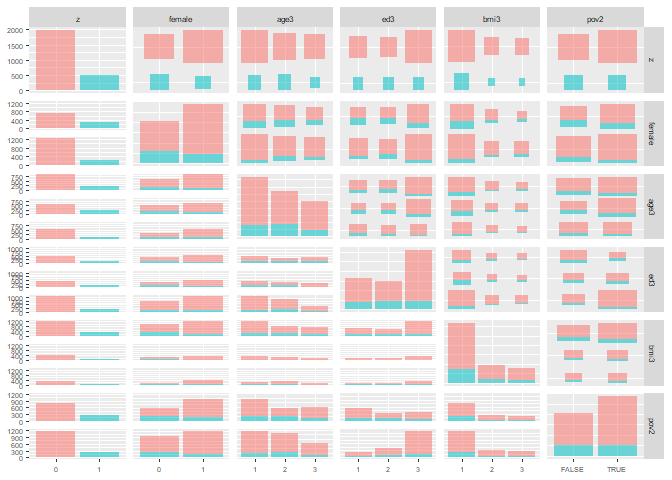<!-- -->

All categories are represented in both groups, and even combinations
seem somewhat reasonable. Let us construct the DAG for the dataset.

``` r
dag <- dagify(homo ~ z + fem + age3 + ed3 + bmi3 + pov2, z~ fem + age3 + ed3 + bmi3 + pov2, ed3 ~ age3 + fem + pov2, bmi3 ~ age3 +  fem + z, pov2 ~ age3 + z + fem + ed3, exposure = 'z', outcome = 'homo')
ggdag_status(dag) + theme_dag() + theme(legend.position = "none")
```

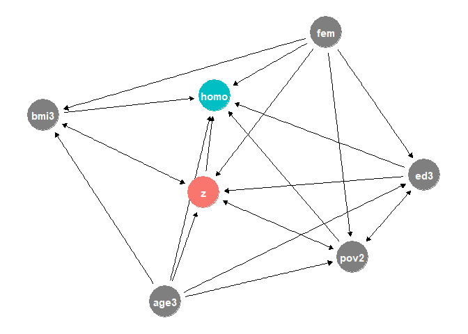<!-- -->

We see quite a lot of causal relations. Age and gender influence
everything else. There are also bidirectional relations: poverty and
education, and crucially, BMI and smoking, and poverty and smoking. We
could already be in a lot of trouble with no easy way out.

The DAG framework cannot have cycles, and thus, we will only consider
the stronger causal directions: poverty causes education, smoking causes
BMI, and poverty causes smoking. And we hope that the potential bias
resulting from this simplification is small. Let’s compute the
adjustment set.

``` r
dag <- dagify(homo ~ z + fem + age3 + ed3 + bmi3 + pov2, z ~ fem + age3 + ed3 + pov2, ed3 ~ age3 + fem + pov2, bmi3 ~ age3 +  fem + z, pov2 ~ age3 + fem + ed3, exposure = 'z', outcome = 'homo')
ggdag_adjustment_set(dag) + theme_dag()
```

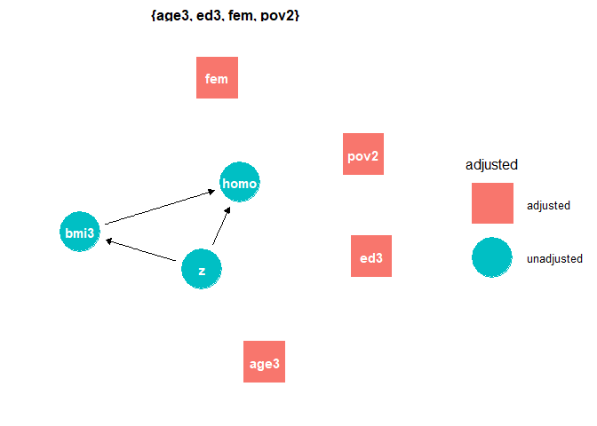<!-- -->

Since BMI is a mediator, we should exclude it from the model.

First, we will consider a simple linear regression.

``` r
lm_homocyst <- lm(homocysteine  ~ z + (female + age3 + ed3 + pov2)^2, data = homocyst)
summary(lm_homocyst)
```

    ## 
    ## Call:
    ## lm(formula = homocysteine ~ z + (female + age3 + ed3 + pov2)^2, 
    ##     data = homocyst)
    ## 
    ## Residuals:
    ##     Min      1Q  Median      3Q     Max 
    ##  -6.750  -1.838  -0.594   0.909 135.163 
    ## 
    ## Coefficients:
    ##                  Estimate Std. Error t value Pr(>|t|)    
    ## (Intercept)       9.34976    0.27520  33.974  < 2e-16 ***
    ## z1                1.36689    0.25054   5.456 5.36e-08 ***
    ## female1          -1.53942    0.32564  -4.727 2.40e-06 ***
    ## age3.L            2.61393    0.35677   7.327 3.19e-13 ***
    ## age3.Q            0.13419    0.35854   0.374   0.7082    
    ## ed3.L            -0.11920    0.35502  -0.336   0.7371    
    ## ed3.Q             0.14443    0.38067   0.379   0.7044    
    ## pov2TRUE         -0.47932    0.34738  -1.380   0.1678    
    ## female1:age3.L    0.32419    0.36253   0.894   0.3713    
    ## female1:age3.Q   -0.48786    0.35323  -1.381   0.1674    
    ## female1:ed3.L    -0.23636    0.37720  -0.627   0.5310    
    ## female1:ed3.Q    -0.09101    0.39019  -0.233   0.8156    
    ## female1:pov2TRUE  0.23138    0.44767   0.517   0.6053    
    ## age3.L:ed3.L     -0.69412    0.32651  -2.126   0.0336 *  
    ## age3.Q:ed3.L     -0.07168    0.33075  -0.217   0.8285    
    ## age3.L:ed3.Q      0.23093    0.33159   0.696   0.4862    
    ## age3.Q:ed3.Q     -0.41849    0.34520  -1.212   0.2255    
    ## age3.L:pov2TRUE  -0.29716    0.39255  -0.757   0.4491    
    ## age3.Q:pov2TRUE   0.42759    0.38834   1.101   0.2710    
    ## ed3.L:pov2TRUE    0.12078    0.39191   0.308   0.7580    
    ## ed3.Q:pov2TRUE   -0.04141    0.39956  -0.104   0.9175    
    ## ---
    ## Signif. codes:  0 '***' 0.001 '**' 0.01 '*' 0.05 '.' 0.1 ' ' 1
    ## 
    ## Residual standard error: 4.84 on 2454 degrees of freedom
    ## Multiple R-squared:  0.1273, Adjusted R-squared:  0.1202 
    ## F-statistic:  17.9 on 20 and 2454 DF,  p-value: < 2.2e-16

Smoking increases homocysteine levels based on our model. However,
before we jump to conclusions, we need to check our model. Let’s have a
look at residuals.

``` r
qqnorm(residuals(lm_homocyst))
qqline(residuals(lm_homocyst))
```

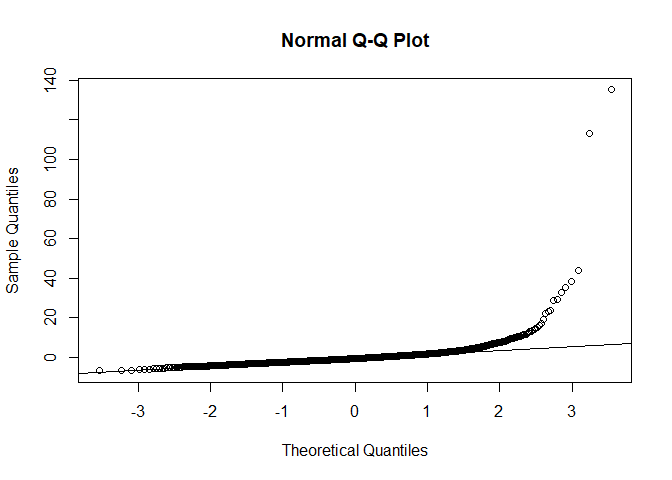<!-- -->

The residuals are noticeably skewed. We can check this by plotting a
histogram.

``` r
hist(residuals(lm_homocyst), xlim = c(-20,100), breaks = 100, main = 'Residuals')
```

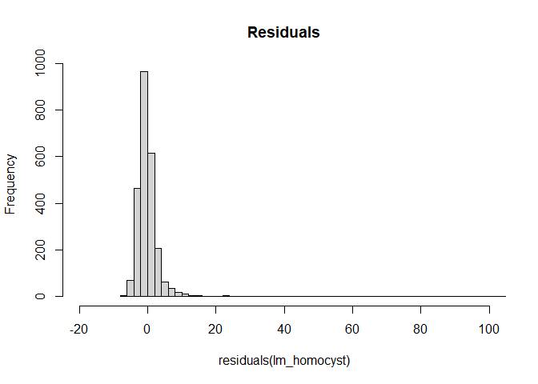<!-- -->

Indeed, the positive residuals are larger than the negative ones. This
makes sense, since homocysteine levels can be quite large but are always
positive and thus bounded from zero. Let’s plot residuals vs predicted.

``` r
plot(predict(lm_homocyst, type = 'response'),residuals(lm_homocyst), ylim = c(-20,50), ylab = 'Residuals', xlab = 'Predicted Homocysteine')
```

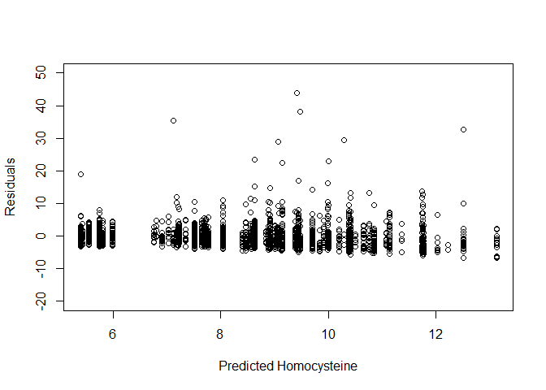<!-- -->

We also observe slight heteroskedasticity (the discrete pattern is due
to the categorical nature of our predictors). Lastly, we will use
simulated residuals from the *DHARMa* package.

``` r
library(DHARMa)
simulationOutput <- simulateResiduals(fittedModel = lm_homocyst)
plotQQunif(simulationOutput,testUniformity = TRUE, testOutliers = FALSE, testDispersion = FALSE)
```

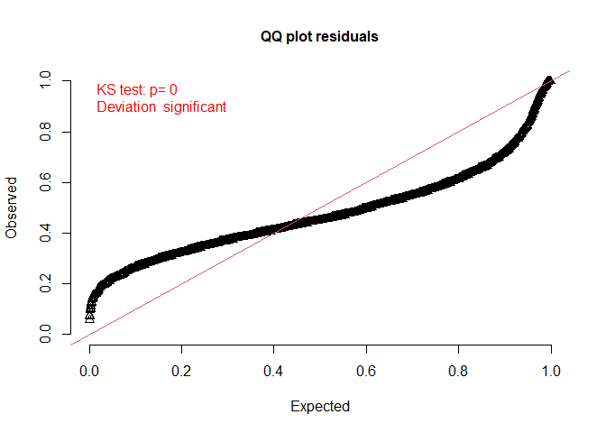<!-- -->

``` r
plotResiduals(simulationOutput)
```

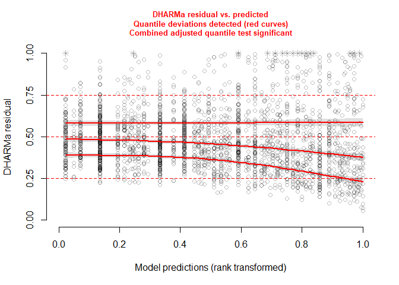<!-- -->

Our model is clearly misspecified.

Let us try to do a bit better. A logical choice is to assume a gamma
regression model.

``` r
gamma_homocyst <- glm(homocysteine  ~ z + female + age3 + ed3 + pov2, family = Gamma(link = "log"), data = homocyst)
summary(gamma_homocyst)
```

    ## 
    ## Call:
    ## glm(formula = homocysteine ~ z + female + age3 + ed3 + pov2, 
    ##     family = Gamma(link = "log"), data = homocyst)
    ## 
    ## Coefficients:
    ##              Estimate Std. Error t value Pr(>|t|)    
    ## (Intercept)  2.212670   0.023414  94.504  < 2e-16 ***
    ## z1           0.176643   0.026934   6.558  6.6e-11 ***
    ## female1     -0.194718   0.021830  -8.920  < 2e-16 ***
    ## age3.L       0.322287   0.019012  16.951  < 2e-16 ***
    ## age3.Q      -0.002433   0.018937  -0.128    0.898    
    ## ed3.L       -0.008933   0.020082  -0.445    0.656    
    ## ed3.Q        0.003203   0.020597   0.155    0.876    
    ## pov2TRUE    -0.021778   0.023663  -0.920    0.357    
    ## ---
    ## Signif. codes:  0 '***' 0.001 '**' 0.01 '*' 0.05 '.' 0.1 ' ' 1
    ## 
    ## (Dispersion parameter for Gamma family taken to be 0.275152)
    ## 
    ##     Null deviance: 419.20  on 2474  degrees of freedom
    ## Residual deviance: 298.05  on 2467  degrees of freedom
    ## AIC: 11860
    ## 
    ## Number of Fisher Scoring iterations: 5

We observe that the effect is increasing still (our model is
$`\log\mathbb{E}Y = X\beta + \text{treatment}`$). Let’s check the
(deviance) residuals.

``` r
plot(predict(gamma_homocyst, type = 'response'),residuals(gamma_homocyst,type = 'deviance'), ylab = 'Residuals', xlab = 'Predicted log(Rent)')
```

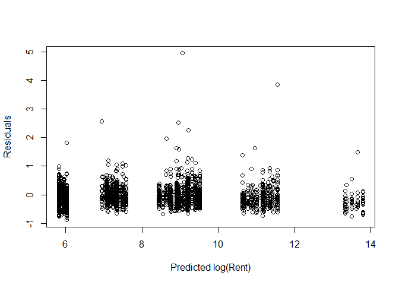<!-- -->

The gamma variance function stabilized the residuals. Let us check the
simulated residuals.

``` r
simulationOutput <- simulateResiduals(fittedModel = gamma_homocyst)
plotQQunif(simulationOutput,testUniformity = TRUE, testOutliers = FALSE, testDispersion = FALSE)
```

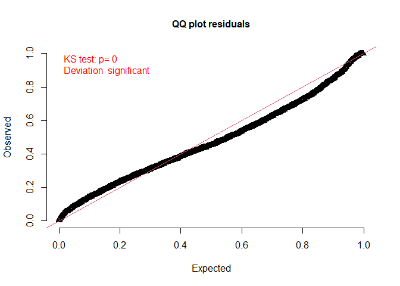<!-- -->

``` r
plotResiduals(simulationOutput)
```

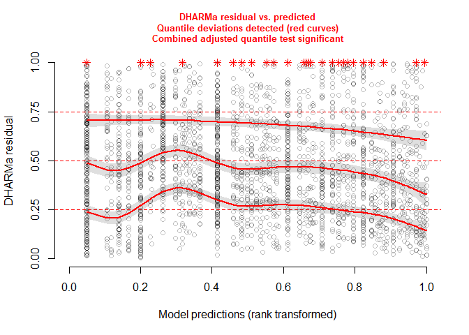<!-- -->

There are still some discrepancies, but overall the model is noticeably
better. We can compare the models more formally using AIC.

``` r
data.frame(AIC(lm_homocyst), AIC(gamma_homocyst))
```

    ##   AIC.lm_homocyst. AIC.gamma_homocyst.
    ## 1         14851.87            11859.79

The gamma model predicts the data much better. We could stop here, but
we will try one more thing. Let’s check Cook’s distance.

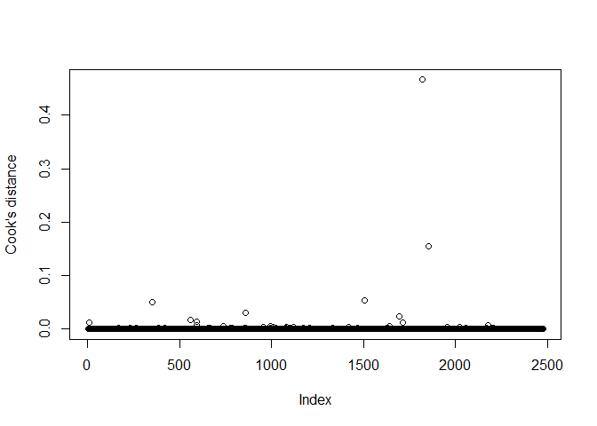<!-- -->

    ## [1] 0.0004895106

Some of the observations are very influential on the fit. Let us try to
fit the model without observations with the most extreme values of
Cook’s distance.

    ## [1] 29

``` r
gamma_homocyst2 <- glm(homocysteine  ~ z + (female + age3 + ed3 + pov2)^2, family = Gamma(link = "log"), data = homocyst[cooks.distance(gamma_homocyst)< 0.0025,])
```

``` r
simulationOutput <- simulateResiduals(fittedModel = gamma_homocyst2)
plotQQunif(simulationOutput,testUniformity = TRUE, testOutliers = FALSE, testDispersion = FALSE)
```

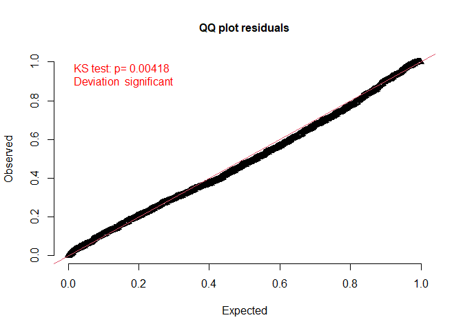<!-- -->

``` r
plotResiduals(simulationOutput)
```

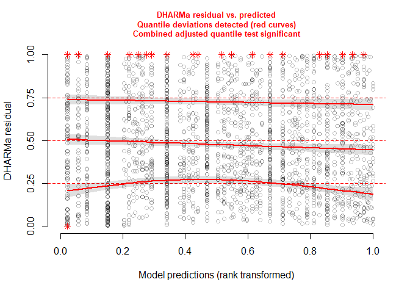<!-- -->

We observe that the model is now quite good with respect to the
simulated residuals. Let us have a look at what individuals we have
actually removed from the model.

``` r
homocyst[cooks.distance(gamma_homocyst)> 0.0025,]
```

    ##      homocysteine z female age3 ed3 bmi3  pov2
    ## 6           45.20 1      0    3   2    1 FALSE
    ## 264         18.20 1      0    1   2    1 FALSE
    ## 351         42.60 1      1    1   3    1  TRUE
    ## 559         39.73 1      1    3   3    1  TRUE
    ## 590         31.50 1      1    2   2    1 FALSE
    ## 594         33.00 1      0    2   3    1  TRUE
    ## 656         17.40 0      1    2   3    2 FALSE
    ## 663         23.73 0      1    3   3    1  TRUE
    ## 736         26.50 0      1    3   2    2  TRUE
    ## 859         47.74 0      0    2   1    1 FALSE
    ## 952         23.92 1      0    2   3    3 FALSE
    ## 992         26.10 0      1    3   1    1  TRUE
    ## 1007        24.00 0      1    3   2    1 FALSE
    ## 1080        19.70 1      1    2   2    3 FALSE
    ## 1100        23.82 0      0    2   3    1  TRUE
    ## 1117        25.50 1      1    3   1    1 FALSE
    ## 1171        19.30 1      1    2   3    1  TRUE
    ## 1418        18.33 0      1    2   1    1 FALSE
    ## 1506        53.20 1      1    2   3    1 FALSE
    ## 1627        20.52 0      1    3   1    1  TRUE
    ## 1640        19.20 1      1    1   2    3 FALSE
    ## 1694        38.00 1      0    1   2    1 FALSE
    ## 1712        24.40 0      1    1   1    1 FALSE
    ## 1819       145.00 1      1    2   1    1 FALSE
    ## 1853       125.00 0      0    3   1    1 FALSE
    ## 1953        19.00 0      1    2   3    3 FALSE
    ## 2021        17.50 1      1    1   2    1 FALSE
    ## 2058        20.00 0      0    2   1    1  TRUE
    ## 2175        32.20 0      0    2   3    2  TRUE

We observe that all individuals have higher homocysteine levels than the
population as a whole.

``` r
quantile(homocyst$homocysteine, c(0.1,0.25,0.5,0.75,0.9, 0.95,0.99))
```

    ##     10%     25%     50%     75%     90%     95%     99% 
    ##  4.8540  6.0600  7.4800  9.3550 11.6000 14.1150 20.9824

So let us instead regress on the population with non-extremely high
levels of homocysteine, say, lower than 30.

``` r
gamma_homocyst3 <- glm(homocysteine  ~ z + (female + age3 + ed3 + pov2)^2, family = Gamma(link = "log"), data = homocyst[homocyst$homocysteine < 30,])
```

``` r
simulationOutput <- simulateResiduals(fittedModel = gamma_homocyst3)
plotQQunif(simulationOutput,testUniformity = TRUE, testOutliers = FALSE, testDispersion = FALSE)
```

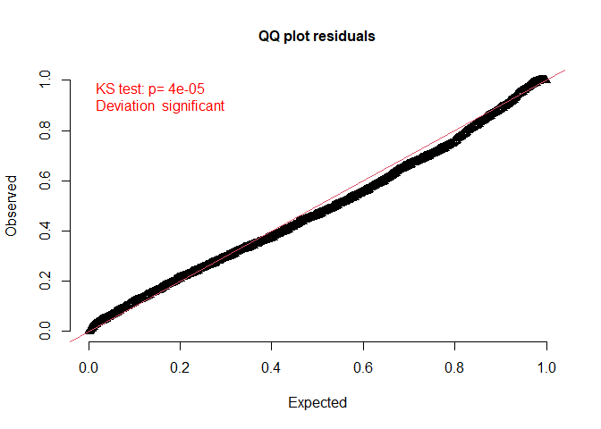<!-- -->

``` r
plotResiduals(simulationOutput)
```

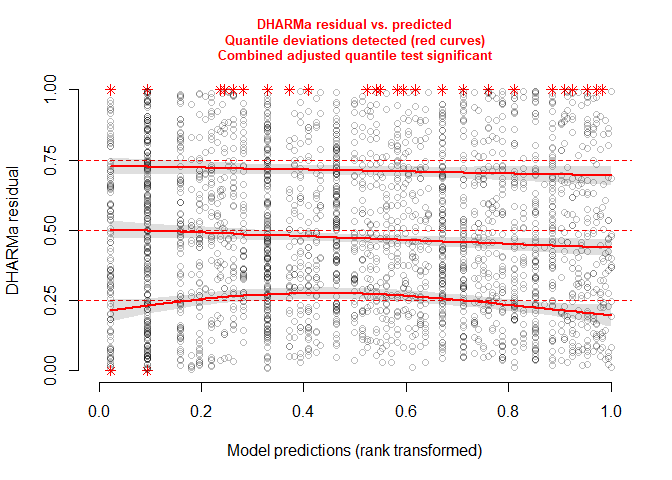<!-- -->

Again, the fit is good. We can check whether this would fix the problem
with linear regression.

``` r
lm_homocyst2 <- lm(homocysteine  ~ z + (female + age3 + ed3 + pov2)^2, data = homocyst[homocyst$homocysteine < 30,])
```

``` r
simulationOutput <- simulateResiduals(fittedModel = lm_homocyst2)
plotQQunif(simulationOutput,testUniformity = TRUE, testOutliers = FALSE, testDispersion = FALSE)
```

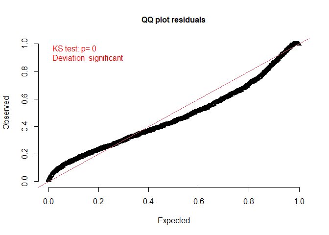<!-- -->

``` r
plotResiduals(simulationOutput)
```

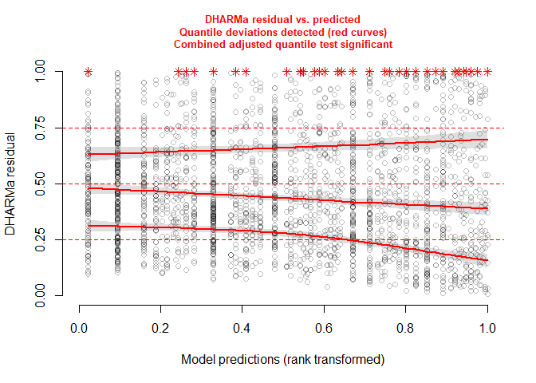<!-- -->

Not really; there is still a noticeable heteroskedasticity. So, we will
use the gamma model.

Let’s assume that studying the population without extremely high
homocysteine levels is reasonable. Let us check the treatment effect.

``` r
summary(gamma_homocyst3)
```

    ## 
    ## Call:
    ## glm(formula = homocysteine ~ z + (female + age3 + ed3 + pov2)^2, 
    ##     family = Gamma(link = "log"), data = homocyst[homocyst$homocysteine < 
    ##         30, ])
    ## 
    ## Coefficients:
    ##                    Estimate Std. Error t value Pr(>|t|)    
    ## (Intercept)       2.1782912  0.0183278 118.852  < 2e-16 ***
    ## z1                0.1058214  0.0167128   6.332 2.88e-10 ***
    ## female1          -0.1814608  0.0216880  -8.367  < 2e-16 ***
    ## age3.L            0.2347215  0.0237598   9.879  < 2e-16 ***
    ## age3.Q            0.0288503  0.0238654   1.209   0.2268    
    ## ed3.L             0.0414137  0.0235754   1.757   0.0791 .  
    ## ed3.Q             0.0200516  0.0253659   0.790   0.4293    
    ## pov2TRUE         -0.0009709  0.0230800  -0.042   0.9664    
    ## female1:age3.L    0.1415938  0.0240936   5.877 4.75e-09 ***
    ## female1:age3.Q   -0.0255045  0.0234868  -1.086   0.2776    
    ## female1:ed3.L    -0.0304345  0.0250401  -1.215   0.2243    
    ## female1:ed3.Q    -0.0370332  0.0259490  -1.427   0.1537    
    ## female1:pov2TRUE  0.0163059  0.0297300   0.548   0.5834    
    ## age3.L:ed3.L     -0.0504952  0.0216549  -2.332   0.0198 *  
    ## age3.Q:ed3.L     -0.0399625  0.0219871  -1.818   0.0693 .  
    ## age3.L:ed3.Q      0.0290538  0.0220329   1.319   0.1874    
    ## age3.Q:ed3.Q     -0.0129349  0.0229585  -0.563   0.5732    
    ## age3.L:pov2TRUE  -0.0243302  0.0260520  -0.934   0.3504    
    ## age3.Q:pov2TRUE   0.0080741  0.0258148   0.313   0.7545    
    ## ed3.L:pov2TRUE   -0.0517328  0.0260072  -1.989   0.0468 *  
    ## ed3.Q:pov2TRUE   -0.0040158  0.0265460  -0.151   0.8798    
    ## ---
    ## Signif. codes:  0 '***' 0.001 '**' 0.01 '*' 0.05 '.' 0.1 ' ' 1
    ## 
    ## (Dispersion parameter for Gamma family taken to be 0.10282)
    ## 
    ##     Null deviance: 324.86  on 2463  degrees of freedom
    ## Residual deviance: 213.78  on 2443  degrees of freedom
    ## AIC: 10970
    ## 
    ## Number of Fisher Scoring iterations: 4

The effect is still increasing, but much smaller than in our original
gamma model (the threatment effct is about 10% compared to 18% in the
original model).

Covariates **bmi3** and **pov2** have bidirectional causal relationships
with smoking, so let us check whether different choices of
inclusion/exclusion would change our estimate.

``` r
gamma_homocyst4 <- glm(homocysteine  ~ z + (female + age3 + ed3)^2, family = Gamma(link = "log"), data = homocyst[homocyst$homocysteine < 30,])
summary(gamma_homocyst4)
```

    ## 
    ## Call:
    ## glm(formula = homocysteine ~ z + (female + age3 + ed3)^2, family = Gamma(link = "log"), 
    ##     data = homocyst[homocyst$homocysteine < 30, ])
    ## 
    ## Coefficients:
    ##                Estimate Std. Error t value Pr(>|t|)    
    ## (Intercept)     2.17100    0.01198 181.214  < 2e-16 ***
    ## z1              0.10827    0.01660   6.521 8.46e-11 ***
    ## female1        -0.17335    0.01440 -12.041  < 2e-16 ***
    ## age3.L          0.22163    0.01880  11.788  < 2e-16 ***
    ## age3.Q          0.03183    0.01799   1.769  0.07707 .  
    ## ed3.L           0.01175    0.01736   0.677  0.49868    
    ## ed3.Q           0.01095    0.01977   0.554  0.57961    
    ## female1:age3.L  0.14496    0.02395   6.051 1.66e-09 ***
    ## female1:age3.Q -0.02549    0.02337  -1.091  0.27558    
    ## female1:ed3.L  -0.02090    0.02276  -0.919  0.35839    
    ## female1:ed3.Q  -0.03696    0.02578  -1.433  0.15185    
    ## age3.L:ed3.L   -0.06142    0.01949  -3.151  0.00165 ** 
    ## age3.Q:ed3.L   -0.03405    0.02035  -1.673  0.09449 .  
    ## age3.L:ed3.Q    0.02955    0.02200   1.343  0.17941    
    ## age3.Q:ed3.Q   -0.01410    0.02276  -0.619  0.53568    
    ## ---
    ## Signif. codes:  0 '***' 0.001 '**' 0.01 '*' 0.05 '.' 0.1 ' ' 1
    ## 
    ## (Dispersion parameter for Gamma family taken to be 0.1027655)
    ## 
    ##     Null deviance: 324.86  on 2463  degrees of freedom
    ## Residual deviance: 214.29  on 2449  degrees of freedom
    ## AIC: 10964
    ## 
    ## Number of Fisher Scoring iterations: 4

``` r
gamma_homocyst5 <- glm(homocysteine  ~ z + (female + age3 + ed3 + pov2)^2, family = Gamma(link = "log"), data = homocyst[homocyst$homocysteine < 30,])
summary(gamma_homocyst5)
```

    ## 
    ## Call:
    ## glm(formula = homocysteine ~ z + (female + age3 + ed3 + pov2)^2, 
    ##     family = Gamma(link = "log"), data = homocyst[homocyst$homocysteine < 
    ##         30, ])
    ## 
    ## Coefficients:
    ##                    Estimate Std. Error t value Pr(>|t|)    
    ## (Intercept)       2.1782912  0.0183278 118.852  < 2e-16 ***
    ## z1                0.1058214  0.0167128   6.332 2.88e-10 ***
    ## female1          -0.1814608  0.0216880  -8.367  < 2e-16 ***
    ## age3.L            0.2347215  0.0237598   9.879  < 2e-16 ***
    ## age3.Q            0.0288503  0.0238654   1.209   0.2268    
    ## ed3.L             0.0414137  0.0235754   1.757   0.0791 .  
    ## ed3.Q             0.0200516  0.0253659   0.790   0.4293    
    ## pov2TRUE         -0.0009709  0.0230800  -0.042   0.9664    
    ## female1:age3.L    0.1415938  0.0240936   5.877 4.75e-09 ***
    ## female1:age3.Q   -0.0255045  0.0234868  -1.086   0.2776    
    ## female1:ed3.L    -0.0304345  0.0250401  -1.215   0.2243    
    ## female1:ed3.Q    -0.0370332  0.0259490  -1.427   0.1537    
    ## female1:pov2TRUE  0.0163059  0.0297300   0.548   0.5834    
    ## age3.L:ed3.L     -0.0504952  0.0216549  -2.332   0.0198 *  
    ## age3.Q:ed3.L     -0.0399625  0.0219871  -1.818   0.0693 .  
    ## age3.L:ed3.Q      0.0290538  0.0220329   1.319   0.1874    
    ## age3.Q:ed3.Q     -0.0129349  0.0229585  -0.563   0.5732    
    ## age3.L:pov2TRUE  -0.0243302  0.0260520  -0.934   0.3504    
    ## age3.Q:pov2TRUE   0.0080741  0.0258148   0.313   0.7545    
    ## ed3.L:pov2TRUE   -0.0517328  0.0260072  -1.989   0.0468 *  
    ## ed3.Q:pov2TRUE   -0.0040158  0.0265460  -0.151   0.8798    
    ## ---
    ## Signif. codes:  0 '***' 0.001 '**' 0.01 '*' 0.05 '.' 0.1 ' ' 1
    ## 
    ## (Dispersion parameter for Gamma family taken to be 0.10282)
    ## 
    ##     Null deviance: 324.86  on 2463  degrees of freedom
    ## Residual deviance: 213.78  on 2443  degrees of freedom
    ## AIC: 10970
    ## 
    ## Number of Fisher Scoring iterations: 4

The estimates are almost the same. Fortunately, their confounding effect
on the outcome appears to be weak. Lastly, let us compute the confidence
intervals for the ATE using likelihood profiling and a pairs bootstrap.

``` r
confint(gamma_homocyst3, type = c("profile"))
```

    ##                         2.5 %        97.5 %
    ## (Intercept)       2.142511429  2.2144375845
    ## z1                0.073177730  0.1386394265
    ## female1          -0.223977720 -0.1391023456
    ## age3.L            0.188327794  0.2813286263
    ## age3.Q           -0.018301711  0.0757929211
    ## ed3.L            -0.004973381  0.0879627898
    ## ed3.Q            -0.029633541  0.0694146046
    ## pov2TRUE         -0.046409505  0.0443710990
    ## female1:age3.L    0.094359551  0.1887607715
    ## female1:age3.Q   -0.071581264  0.0205837571
    ## female1:ed3.L    -0.079631511  0.0187184167
    ## female1:ed3.Q    -0.087801930  0.0138131325
    ## female1:pov2TRUE -0.042033082  0.0747615082
    ## age3.L:ed3.L     -0.092926733 -0.0079538218
    ## age3.Q:ed3.L     -0.082983934  0.0032133300
    ## age3.L:ed3.Q     -0.014162829  0.0721879254
    ## age3.Q:ed3.Q     -0.057879255  0.0321787592
    ## age3.L:pov2TRUE  -0.075464341  0.0267015266
    ## age3.Q:pov2TRUE  -0.042533160  0.0587626950
    ## ed3.L:pov2TRUE   -0.103012745 -0.0007643918
    ## ed3.Q:pov2TRUE   -0.056001676  0.0480427803

``` r
nb <- 5000

betas_treat <- numeric(nb)
homocyst_red <- homocyst[homocyst$homocysteine < 30,]
  
for(i in 1:nb){

  homocyst_new <-  homocyst_red[sample(nrow(homocyst_red) , rep=TRUE),]
  model_new <- glm(homocysteine  ~ z + female + age3 + ed3 + pov2, family = Gamma(link = "log"), data = homocyst_new)
  betas_treat[i] <- coef(model_new)[2]
}

quantile(betas_treat, c(0.025,0.975))
```

    ##       2.5%      97.5% 
    ## 0.07835065 0.14432560

The bootstrap result corresponds to the likelihood profiling, again
indicating that the model is specified well enough.

## References

<div id="refs" class="references csl-bib-body hanging-indent">

<div id="ref-bazzano2003relationship" class="csl-entry">

Bazzano, Lydia A, Jiang He, Paul Muntner, Suma Vupputuri, and Paul K
Whelton. 2003. “Relationship Between Cigarette Smoking and Novel Risk
Factors for Cardiovascular Disease in the United States.” *Annals of
Internal Medicine* 138 (11): 891–97.

</div>

<div id="ref-cunningham2021causal" class="csl-entry">

Cunningham, Scott. 2021. *Causal Inference: The Mixtape*. Yale
university press.

</div>

<div id="ref-ding2024first" class="csl-entry">

Ding, Peng. 2024. *A First Course in Causal Inference*. CRC press.

</div>

<div id="ref-ding2015adjust" class="csl-entry">

Ding, Peng, and Luke W Miratrix. 2015. “To Adjust or Not to Adjust?
Sensitivity Analysis of m-Bias and Butterfly-Bias.” *Journal of Causal
Inference* 3 (1): 41–57.

</div>

<div id="ref-peters2017elements" class="csl-entry">

Peters, Jonas, Dominik Janzing, and Bernhard Schölkopf. 2017. *Elements
of Causal Inference: Foundations and Learning Algorithms*. The MIT
press.

</div>

<div id="ref-richardson2013single" class="csl-entry">

Richardson, Thomas S, and James M Robins. 2013. “Single World
Intervention Graphs (SWIGs): A Unification of the Counterfactual and
Graphical Approaches to Causality.” *Center for the Statistics and the
Social Sciences, University of Washington Series. Working Paper* 128
(30): 2013.

</div>

</div>
