# The First Casualty of Statistics: Part Eight
<big>**Propensity Scores**</big>

<br/>
Jiří Fejlek

2026-08-21
<br/>

<br/> In this part, we will introduce the core concept for dealing 
with bias in observational studies: propensity scores, conditional 
probabilities of treatment assignment. <br/>

## Table of Contents

- [Propensity Scores](#propensity-scores)
- [Stratification via Propensity
  Scores](#stratification-via-propensity-scores)
- [Propensity Score Weighting](#propensity-score-weighting)
- [References](#references)

``` r
library(tidyr)
library(dplyr)
library(ggplot2)
library(patchwork)
library(dagitty)
library(ggdag)
library(modelsummary)
library(GGally)
library(estimatr)
```

## Propensity Scores

Let us assume and individual $`(Y(0),Y(1),T,X)`$, where $`Y(0)`$ and
$`Y(1)`$ are potential outcomes, $`T`$ is the treatment and, $`X`$ are
observed covariates. We define the *propensity scores* as
``` math
e(X,Y(0),Y(1)) = P(T = 1 \mid X, Y(0), Y(1)).
```
Under strong ignorability
``` math
e(X,Y(0),Y(1)) = P(T = 1 \mid X, Y(0), Y(1)) = P(T = 1 \mid X),
```
i.e., the propensity score equals the probability of receiving the
treatment given the observed covariates (Ding 2024).

The crucial property of propensity scores is that
``` math
T \perp (Y(0),Y(1)) \mid X \Rightarrow T \perp (Y(0),Y(1)) \mid e(X),
```
i.e., the propensity scores can serve as a *dimensionality-reduction
tool* from $`X`$ to a vector of conditional probabilities.

## Stratification via Propensity Scores

Let us demonstrate a simple way to use propensity scores to estimate the
ATE. We will demonstrate this using the dataset from the 2007-2008
National Health and Nutrition Examination Survey (NHANES)
(<https://rdrr.io/cran/ATE/man/nhanes_bmi.html>). The goal is to assess
whether participation in school meal programs increases body mass index
(BMI). The variables are as follows.

- **BMI**: body mass index
- **School_meal**: participation in school meal programs (1: Yes, 0: No)
- **age**: age of child
- **ChildSex**: gender of the child (1: Male, 0: Female)
- **black**: child is black (1: Black, 0: otherwise)
- **mexam**: child is Hispanic (1: Hispanic, 0: otherwise)
- **pir200_plus**: family above 200% of the federal poverty level (1:
  Yes, 0: No)
- **WIC**: participation in Special Supplemental Nutrition program (1:
  Yes, 0: No)
- **Food_Stamp**: participation in food stamp program (1: Yes, 0: No)
- **fsdchbi**: childhood food security (1: Secure, 0: insecure)
- **AnyIns**: any insurance (1: Yes, 0: No)
- **RefSex**: gender of the adult respondent (1: Male, 0: Female)
- **RefAge**: Age of the adult respondent

``` r
nhanes_bmi <- read.csv("C:/Users/elini/Desktop/first casualty/nhanes_bmi.csv")

nhanes_bmi$School_meal <- factor(nhanes_bmi$School_meal)
nhanes_bmi$ChildSex <- factor(nhanes_bmi$ChildSex)
nhanes_bmi$black <- factor(nhanes_bmi$black)
nhanes_bmi$mexam <- factor(nhanes_bmi$mexam)
nhanes_bmi$pir200_plus <- factor(nhanes_bmi$pir200_plus)
nhanes_bmi$WIC <- factor(nhanes_bmi$WIC)
nhanes_bmi$Food_Stamp <- factor(nhanes_bmi$Food_Stamp)
nhanes_bmi$fsdchbi <- factor(nhanes_bmi$fsdchbi)
nhanes_bmi$AnyIns <- factor(nhanes_bmi$AnyIns)
nhanes_bmi$RefSex <- factor(nhanes_bmi$RefSex)

nhanes_bmi <- data.frame(nhanes_bmi)
nhanes_bmi[1:20,]
```

    ##      BMI School_meal age ChildSex black mexam pir200_plus WIC Food_Stamp fsdchbi AnyIns RefSex RefAge
    ## 1  15.18           0   6        0     0     0           1   0          0       0      1      1     51
    ## 2  17.93           0   6        1     0     1           0   1          0       1      1      1     27
    ## 3  15.15           1   5        1     0     1           0   0          0       0      0      0     24
    ## 4  15.69           1  11        0     0     0           0   0          0       0      1      1     44
    ## 5  37.40           0  14        0     0     1           0   0          0       0      0      0     48
    ## 6  13.83           1   6        0     1     0           1   0          0       0      1      1     42
    ## 7  18.48           1   5        0     0     1           0   0          0       0      1      0     34
    ## 8  14.71           0   4        0     1     0           1   0          0       1      1      1     35
    ## 9  20.20           0  16        0     0     1           1   0          0       1      0      0     37
    ## 10 16.73           1   8        1     1     0           0   0          1       0      1      0     32
    ## 11 16.37           0   7        0     0     0           1   0          0       0      1      1     31
    ## 12 26.53           0  16        0     0     0           0   0          0       0      1      0     20
    ## 13 36.47           1  15        0     1     0           1   0          0       0      1      0     38
    ## 14 12.61           0  12        0     0     0           1   0          0       0      1      1     41
    ## 15 17.44           0   6        1     1     0           1   0          0       0      1      1     48
    ## 16 20.08           0   4        1     0     1           0   1          0       0      1      1     22
    ## 17 23.71           1   8        1     0     1           0   0          0       0      1      1     40
    ## 18 20.39           1   5        0     1     0           0   0          0       0      1      0     38
    ## 19 19.82           0  17        1     0     0           0   0          0       0      1      0     54
    ## 20 16.66           0  11        1     0     0           0   0          0       0      1      1     54

``` r
datasummary_skim(nhanes_bmi[,-1])
```

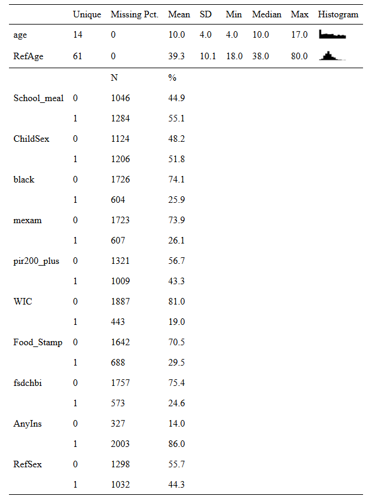<!-- -->

Let us also plot each covariate against each other stratified by the
treatment. We will split the plot into multiple figures.

``` r
cov <- nhanes_bmi[,c(2,3,4,5,6)]
ggpairs(cov, aes(color = School_meal, alpha = 0.5)) + theme(axis.text = element_text(size = 5), strip.text = element_text(size = 6))
```

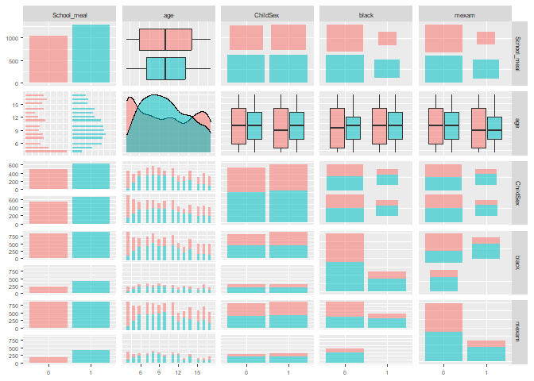<!-- -->

``` r
cov <- nhanes_bmi[,c(2,7,8,9,10)]
ggpairs(cov, aes(color = School_meal, alpha = 0.5)) + theme(axis.text = element_text(size = 5), strip.text = element_text(size = 6))
```

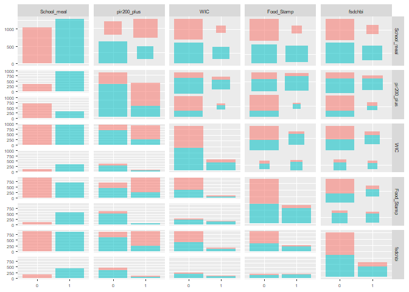<!-- -->

``` r
cov <- nhanes_bmi[,c(2,11,12,13)]
ggpairs(cov, aes(color = School_meal, alpha = 0.5)) + theme(axis.text = element_text(size = 5), strip.text = element_text(size = 6))
```

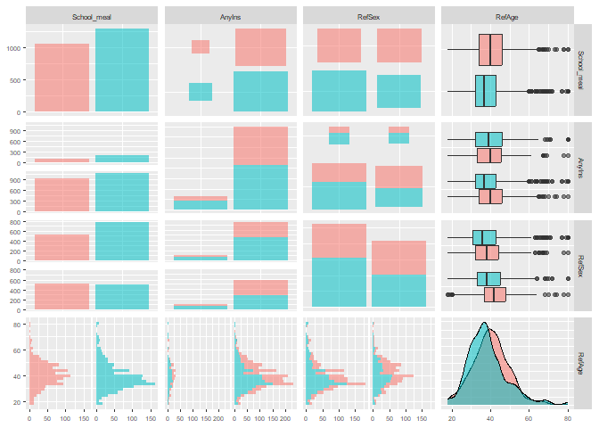<!-- -->

We can plot the missing graphs as follows.

``` r
cov <- nhanes_bmi[, c(2,3,4,5,6,7,8,9,10)]
ggduo(data = cov, aes(color = School_meal, alpha = 0.5), columnsX = c(2,3,4,5), columnsY = c(6,7,8,9)) + theme(axis.text = element_text(size = 5), strip.text = element_text(size = 6))
```

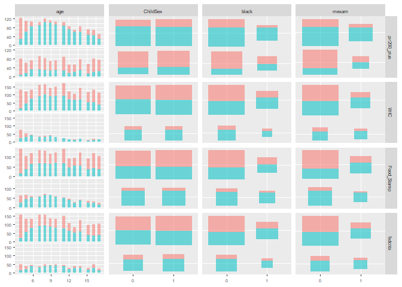<!-- -->

``` r
cov <- nhanes_bmi[, c(2,3,4,5,6,11,12,13)]
ggduo(data = cov, aes(color = School_meal, alpha = 0.5), columnsX = c(2,3,4,5), columnsY = c(6,7,8)) + theme(axis.text = element_text(size = 5), strip.text = element_text(size = 6))
```

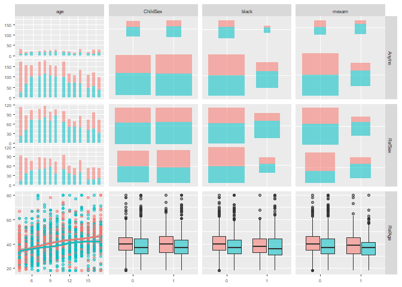<!-- -->

``` r
cov <- nhanes_bmi[, c(2,7,8,9,10,11,12,13)]
ggduo(data = cov, aes(color = School_meal, alpha = 0.5), columnsX = c(2,3,4,5), columnsY = c(6,7,8)) + theme(axis.text = element_text(size = 5), strip.text = element_text(size = 6))
```

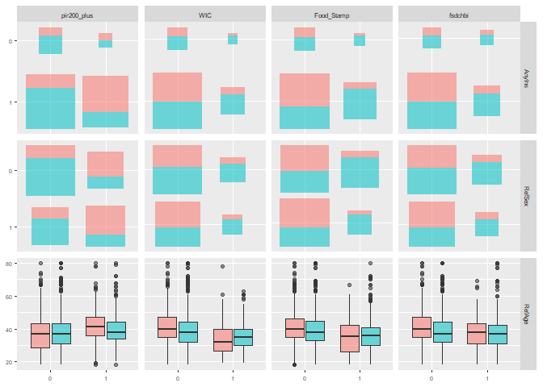<!-- -->

All covariates are reasonably represented in both the treatment and
control groups. Let us compute the naive ATE estimate.

``` r
ate_naive <- c(mean(nhanes_bmi$BMI[nhanes_bmi$School_meal == 1]) - mean(nhanes_bmi$BMI[nhanes_bmi$School_meal == 0]),
sqrt(var(nhanes_bmi$BMI[nhanes_bmi$School_meal == 1])/sum(nhanes_bmi$School_meal == 1) + var(nhanes_bmi$BMI[nhanes_bmi$School_meal == 0])/sum(nhanes_bmi$School_meal == 0)))

names(ate_naive) <- c('est', 'sd')
ate_naive
```

    ##       est        sd 
    ## 0.5339044 0.2253199

The effect seems positive. However, when we adjust for the covariates,
the effect is no longer significant.

``` r
lm_nhanes_bmi <- lm(BMI ~ .,  data = nhanes_bmi)
ate_reg <- c(coef(summary(lm_nhanes_bmi))[2,1], coef(summary(lm_nhanes_bmi))[2,2])
names(ate_reg) <- c('est', 'sd')
ate_reg
```

    ##        est         sd 
    ## 0.06124785 0.22088294

We can also compute Lin’s estimator.

``` r
lm_lin_nhanes_bmi <- lm_lin(BMI   ~ School_meal, covariates = ~ age + ChildSex + black + mexam + pir200_plus + WIC + Food_Stamp + fsdchbi + AnyIns + RefSex + RefAge, data = nhanes_bmi)
ate_reg_lin <- c(coef(summary(lm_lin_nhanes_bmi))[2,1], coef(summary(lm_lin_nhanes_bmi))[2,2])
names(ate_reg_lin) <- c('est', 'sd')
ate_reg_lin
```

    ##         est          sd 
    ## -0.01695389  0.22426676

Instead of adjusting for covariates using regression, we can use
propensity scores. First, we need to estimate them, i.e., the
probability of the treatment assignment given the covariates, using
logistic regression.

``` r
prop_scores_model <- glm(School_meal ~  . - BMI, family = binomial, data = nhanes_bmi)
summary(prop_scores_model)
```

    ## 
    ## Call:
    ## glm(formula = School_meal ~ . - BMI, family = binomial, data = nhanes_bmi)
    ## 
    ## Coefficients:
    ##               Estimate Std. Error z value Pr(>|z|)    
    ## (Intercept)  -0.669089   0.274769  -2.435  0.01489 *  
    ## age           0.052257   0.013219   3.953 7.71e-05 ***
    ## ChildSex1    -0.010276   0.097646  -0.105  0.91619    
    ## black1        1.047076   0.122822   8.525  < 2e-16 ***
    ## mexam1        1.086415   0.122698   8.854  < 2e-16 ***
    ## pir200_plus1 -1.406662   0.109782 -12.813  < 2e-16 ***
    ## WIC1          0.244439   0.139749   1.749  0.08027 .  
    ## Food_Stamp1   1.116833   0.130640   8.549  < 2e-16 ***
    ## fsdchbi1      0.345129   0.122167   2.825  0.00473 ** 
    ## AnyIns1      -0.020748   0.143190  -0.145  0.88479    
    ## RefSex1       0.022685   0.102074   0.222  0.82412    
    ## RefAge        0.001021   0.005150   0.198  0.84290    
    ## ---
    ## Signif. codes:  0 '***' 0.001 '**' 0.01 '*' 0.05 '.' 0.1 ' ' 1
    ## 
    ## (Dispersion parameter for binomial family taken to be 1)
    ## 
    ##     Null deviance: 3205.7  on 2329  degrees of freedom
    ## Residual deviance: 2521.6  on 2318  degrees of freedom
    ## AIC: 2545.6
    ## 
    ## Number of Fisher Scoring iterations: 4

Let us briefly check the model.

``` r
library(rms)
val.prob(predict(prop_scores_model, type = 'response'),as.numeric(nhanes_bmi$School_meal))
```

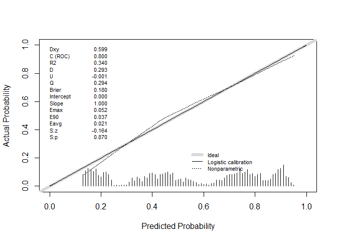<!-- -->

    ##            Dxy        C (ROC)             R2              D       D:Chi-sq 
    ##   5.990124e-01   7.995062e-01   3.404164e-01   2.931611e-01   6.840654e+02 
    ##            D:p              U       U:Chi-sq            U:p              Q 
    ##   0.000000e+00  -5.720634e-01  -1.330908e+03   1.000000e+00   8.652245e-01 
    ##          Brier      Intercept          Slope           Emax            E90 
    ##   1.180293e+00   1.107664e-12   1.000000e+00   1.035828e+00   1.031574e+00 
    ##           Eavg            S:z            S:p 
    ##   9.965884e-01  -2.560354e+01  1.393126e-144

``` r
library(DHARMa)
simulationOutput <- simulateResiduals(fittedModel = prop_scores_model)
plot(simulationOutput)
```

<!-- -->

We observe that the propensity score model is clearly discriminative
(ROC = 0.8), which indicates that the treatment assignment is far from
random.

``` r
prop_scores <- prop_scores_model$fitted.values

data <- data.frame(prop_scores = prop_scores, School_meal = nhanes_bmi$School_meal)
ggplot(data, aes(x = prop_scores, fill = School_meal)) +
  geom_histogram(position = "identity", alpha = 0.5, bins = 30, color = "white") +
  theme_minimal()
```

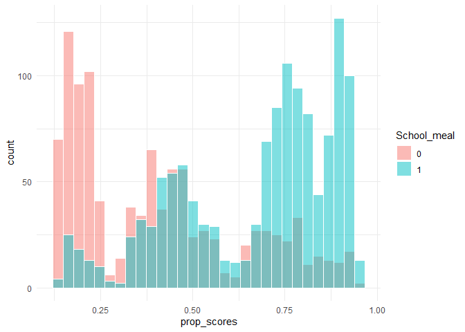<!-- -->

Then, we stratify the data by the quantiles of the propensity scores.

``` r
prop_scores_breaks <- quantile(prop_scores, probs = seq(0, 1, by = 0.2))

stratified_prop_scores <- cut(prop_scores, breaks = prop_scores_breaks, include.lowest = TRUE, labels = names(prop_scores_breaks)[-1])

table(stratified_prop_scores,nhanes_bmi$School_meal)
```

    ##                       
    ## stratified_prop_scores   0   1
    ##                   20%  405  63
    ##                   40%  270 194
    ##                   60%  199 267
    ##                   80%  106 360
    ##                   100%  66 400

We see that each stratum has enough observations with and without the
treatment. One notable observation is that, after stratifying by
propensity scores, the covariates distributions are similar between the
treatment and control groups.

``` r
nhanes_bmi_ext <- nhanes_bmi
nhanes_bmi_ext$prop <- stratified_prop_scores

cov <- nhanes_bmi_ext[,c(3,4,5,6, 14)]
ggduo(data = cov, aes(color = nhanes_bmi_ext$School_meal, alpha = 0.5), columnsX = c(5), columnsY = c(1,2,3,4)) + theme(axis.text = element_text(size = 5), strip.text = element_text(size = 6))
```

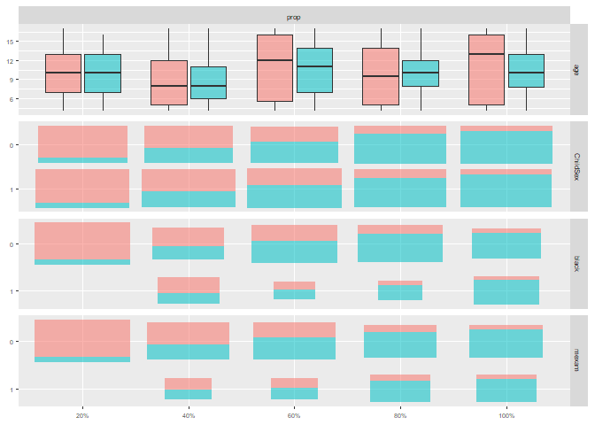<!-- -->

``` r
nhanes_bmi_ext <- nhanes_bmi
nhanes_bmi_ext$prop <- stratified_prop_scores

cov <- nhanes_bmi_ext[,c(7,8,9,10, 14)]
ggduo(data = cov, aes(color = nhanes_bmi_ext$School_meal, alpha = 0.5), columnsX = c(5), columnsY = c(1,2,3,4)) + theme(axis.text = element_text(size = 5), strip.text = element_text(size = 6))
```

<!-- -->

``` r
nhanes_bmi_ext <- nhanes_bmi
nhanes_bmi_ext$prop <- stratified_prop_scores

cov <- nhanes_bmi_ext[,c(11,12,13, 14)]
ggduo(data = cov, aes(color = nhanes_bmi_ext$School_meal, alpha = 0.5), columnsX = c(4), columnsY = c(1,2,3)) + theme(axis.text = element_text(size = 5), strip.text = element_text(size = 6))
```

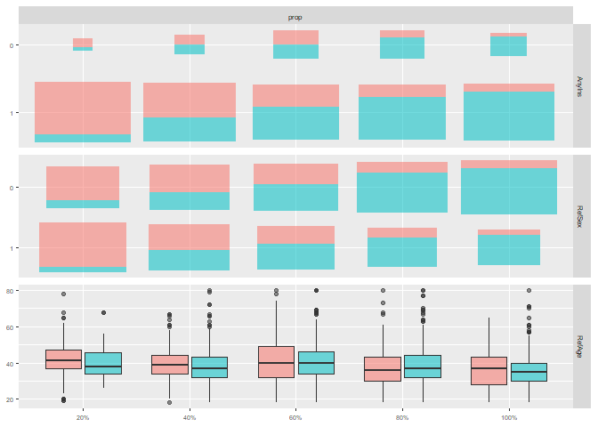<!-- -->

Intuitively, this makes sense, since we modeled the probability of
treatment assignment as a function of $`X`$; individuals with similar
propensity scores should have similar covariate values. We will return
to this observation in the next section.

Finally, we estimate the treatment effect using the stratification based
on the propensity scores (in the same way we would analyze a stratified
randomized experiment). For example, Lin’s estimator is as follows.

``` r
strat_ps_lin_nhanes_bmi <- lm_lin(BMI  ~ School_meal, covariates = ~ stratified_prop_scores, data = nhanes_bmi)
ate_strat_ps_lin <- c(coef(summary(strat_ps_lin_nhanes_bmi))[2,1], coef(summary(strat_ps_lin_nhanes_bmi))[2,2])
names(ate_strat_ps_lin) <- c('est', 'sd')
ate_strat_ps_lin
```

    ##        est         sd 
    ## -0.1160964  0.2833304

We should recompute the error via bootstrapping, since the regression’s
standard error estimate assumes the propensity scores are fixed in
advance (i.e., not estimated from the data).

``` r
set.seed(123)
nb <- 1000

betas_treat <- numeric(nb)
  
for(i in 1:nb){

  nhanes_bmi_new <-  nhanes_bmi[sample(nrow(nhanes_bmi) , rep=TRUE),]
  prop_scores_new <- glm(School_meal ~  . - BMI, family = binomial, data = nhanes_bmi_new)$fitted.values
  stratified_prop_scores_new <- cut(prop_scores_new, breaks = prop_scores_breaks, include.lowest = TRUE, labels = names(prop_scores_breaks)[-1])
  
  strat_ps_lin_nhanes_bmi_new <- lm_lin(BMI  ~ School_meal, covariates = ~ stratified_prop_scores_new, data = nhanes_bmi_new)
  
  betas_treat[i] <- coef(summary(strat_ps_lin_nhanes_bmi_new))[2,1]
}

quantile(betas_treat, c(0.025,0.975))
```

    ##       2.5%      97.5% 
    ## -0.5395443  0.3868783

The bootstrapped confidence interval is very similar to the one we would
have obtained from the regression.

``` r
ci <- c(ate_strat_ps_lin[1] - qnorm(0.975)*ate_strat_ps_lin[2], ate_strat_ps_lin[1] + qnorm(0.975)*ate_strat_ps_lin[2])
names(ci) <- c('2.5%', '97.5%')
ci
```

    ##       2.5%      97.5% 
    ## -0.6714138  0.4392210

Overall, we got a result that closely matches the one from the standard
regression approach.

We should note that we do not have to stratify. We can directly regress
the outcome on propensity scores. There is no reason to believe that the
relationship is approximately linear; thus, we will consider a
generalized additive model (Myers and Louis 2012).

``` r
library(mgcv)
gam_ps_nhanes_bmi <- gam(BMI~School_meal + s(prop_scores, k = 40, bs = 'tp'), data = nhanes_bmi, method = 'REML')
summary(gam_ps_nhanes_bmi)
```

    ## 
    ## Family: gaussian 
    ## Link function: identity 
    ## 
    ## Formula:
    ## BMI ~ School_meal + s(prop_scores, k = 40, bs = "tp")
    ## 
    ## Parametric coefficients:
    ##              Estimate Std. Error t value Pr(>|t|)    
    ## (Intercept)  20.13585    0.17345 116.089   <2e-16 ***
    ## School_meal1 -0.04613    0.25029  -0.184    0.854    
    ## ---
    ## Signif. codes:  0 '***' 0.001 '**' 0.01 '*' 0.05 '.' 0.1 ' ' 1
    ## 
    ## Approximate significance of smooth terms:
    ##                 edf Ref.df    F p-value    
    ## s(prop_scores) 18.4  22.67 14.1  <2e-16 ***
    ## ---
    ## Signif. codes:  0 '***' 0.001 '**' 0.01 '*' 0.05 '.' 0.1 ' ' 1
    ## 
    ## R-sq.(adj) =  0.124   Deviance explained = 13.1%
    ## -REML = 7123.3  Scale est. = 25.774    n = 2330

We got a similar result to the other approaches. Let us plot the trend
in propensity scores.

``` r
library(sjPlot)
plot_model(gam_ps_nhanes_bmi, type = "pred", terms = c('prop_scores')) + geom_point(data = nhanes_bmi, aes(x = prop_scores, y = BMI), size = 0.5)  + labs(x = 'Propensity Scores', y = '')
```

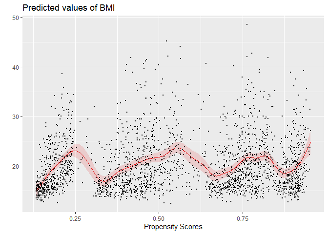<!-- -->

There is not much of a trend to speak of. Still, we can notice that
children with very low propensity scores (i.e., low probability of
receiving the treatment) have lower BMI compared to children with high
propensity scores. This explains why the unadjusted estimate detected
the treatment effect.

Again, we should bootstrap the result.

``` r
set.seed(123)
nb <- 1000

betas_treat <- numeric(nb)
  
for(i in 1:nb){

  nhanes_bmi_new <-  nhanes_bmi[sample(nrow(nhanes_bmi) , rep=TRUE),]
  prop_scores_new <- glm(School_meal ~  . - BMI, family = binomial, data = nhanes_bmi_new)$fitted.values
  betas_treat[i] <- coef(gam_ps_nhanes_bmi <- gam(BMI~School_meal + s(prop_scores_new, k = 40, bs = 'tp'), data = nhanes_bmi_new, method = 'REML'))[2]
}

quantile(betas_treat, c(0.025,0.975))
```

    ##       2.5%      97.5% 
    ## -0.4759806  0.4608662

One might wonder which method to prefer, regression on outcomes or
propensity scores. The correct answer is that it depends, since the two
approaches are not directly comparable. Standard regression models the
outcomes, whereas propensity scores model the treatment assignment. We
should also add that we will cover doubly robust estimators in the next
part, which combine both approaches.

## Propensity Score Weighting

There is an alternative to using propensity scores to estimate ATE:
*inverse propensity score weighting* (IPW) estimators. They are based on
the following theorem (Ding 2024)

*If* $`T \perp (Y(0),Y(1)) \mid X`$ *and* $`0 < e(X) < 1`$*, then*
``` math
\mathbb{E}Y(1) = \mathbb{E}\left(\frac{TY}{e(X)}\right) \text{ , }  \mathbb{E}Y(0) = \mathbb{E}\left(\frac{(1-T)Y}{(1-e(X))}\right),
```
*and*
``` math
 \text{ATE} = \mathbb{E}(Y(1) - Y(0)) = \mathbb{E}\left(\frac{TY}{e(X)} - \frac{(1-T)Y}{(1-e(X))}\right).
```
The theorem directly provides the so-called Horvitz–Thompson estimator
(Ding 2024)
``` math
\hat\tau_{HT} = \frac{1}{n} \sum_{i = 1}^n \left(\frac{T_iY_i}{\hat e(X_i)} - \frac{(1-T_i)Y_i}{(1-\hat e(X_i))}\right)
```
There are major issues with the Horvitz–Thompson estimator. Notably, the
Horvitz–Thompson estimator is not invariant even to a simple
transformation $`Y \rightarrow Y + C`$. In addition, it can be quite
unstable provided that some propensity scores are close to 0 or 1 (the
“engineering” solution is to truncate the propensity scores away from
zero or remove the corresponding observations (Ding 2024)).

The alternative estimator that proved to be more stable in finite
samples is the Hájek estimator

``` math
\hat \tau_H = \frac{\sum_{i = 1}^n \frac{T_iY_i}{\hat e(X_i)}}{\sum_{i = 1}^n \frac{Y_i}{\hat e(X_i)}} - \frac{\sum_{i = 1}^n \frac{(1-T_i)Y_i}{(1-\hat e(X_i))}}{\sum_{i = 1}^n \frac{1-Y_i}{\hat e(X_i)}}.
```

Let us compute ATE estimates using both IPW estimators for various
truncation values.

``` r
sch_meal <- as.numeric(nhanes_bmi$School_meal)-1
bmi <- nhanes_bmi$BMI

prop_scores2 <- pmin(pmax(prop_scores, 0.01),0.99)
prop_scores3 <- pmin(pmax(prop_scores, 0.05),0.95)
prop_scores4 <- pmin(pmax(prop_scores, 0.1),0.9)


ipw_est <- cbind(
c(mean((sch_meal*bmi/prop_scores-(1-sch_meal)*bmi/(1-prop_scores))),
mean((sch_meal*bmi/prop_scores2-(1-sch_meal)*bmi/(1-prop_scores2))),
mean((sch_meal*bmi/prop_scores3-(1-sch_meal)*bmi/(1-prop_scores3))),
mean((sch_meal*bmi/prop_scores4-(1-sch_meal)*bmi/(1-prop_scores4)))),


c(sum((sch_meal*bmi/prop_scores))/sum(((sch_meal/prop_scores))) - sum(((1-sch_meal)*bmi/(1-prop_scores)))/sum((((1-sch_meal)/(1-prop_scores)))),

sum((sch_meal*bmi/prop_scores2))/sum(((sch_meal/prop_scores2))) - sum(((1-sch_meal)*bmi/(1-prop_scores2)))/sum((((1-sch_meal)/(1-prop_scores2)))),

sum((sch_meal*bmi/prop_scores3))/sum(((sch_meal/prop_scores3))) - sum(((1-sch_meal)*bmi/(1-prop_scores3)))/sum((((1-sch_meal)/(1-prop_scores3)))),

sum((sch_meal*bmi/prop_scores4))/sum(((sch_meal/prop_scores4))) - sum(((1-sch_meal)*bmi/(1-prop_scores4)))/sum((((1-sch_meal)/(1-prop_scores4))))))


colnames(ipw_est) <- c('Horvitz–Thompson','Hájek')
rownames(ipw_est) <- c('(0,1)', '(0.01,0.99)', '(0.05,0.95)', '(0.1,0.9)')   
ipw_est
```

    ##             Horvitz–Thompson       Hájek
    ## (0,1)             -1.5162838 -0.15566888
    ## (0.01,0.99)       -1.5162838 -0.15566888
    ## (0.05,0.95)       -1.4990957 -0.15153260
    ## (0.1,0.9)         -0.7133979 -0.05356969

We observe that the Horvitz–Thompson estimator is much more inaccurate
than the Hájek estimator. We can get confidence intervals via a
bootstrap.

``` r
set.seed(123)
nb <- 1000

ipw_ests <- matrix(0,nb,8)
  
for(i in 1:nb){

  nhanes_bmi_new <-  nhanes_bmi[sample(nrow(nhanes_bmi) , rep=TRUE),]
  
  sch_meal_new <- as.numeric(nhanes_bmi_new$School_meal)-1
  bmi_new <- nhanes_bmi_new$BMI
  
  
  prop_scores_new <- glm(School_meal ~  . - BMI, family = binomial, data = nhanes_bmi_new)$fitted.values
  prop_scores_new2 <- pmin(pmax(prop_scores_new, 0.01),0.99)
  prop_scores_new3 <- pmin(pmax(prop_scores_new, 0.05),0.95)
  prop_scores_new4 <- pmin(pmax(prop_scores_new, 0.1),0.9)
  
  
  ipw_ests[i,1] <- mean((sch_meal_new*bmi_new/prop_scores_new-(1-sch_meal_new)*bmi_new/(1-prop_scores_new)))
  ipw_ests[i,2] <- mean((sch_meal_new*bmi_new/prop_scores_new2-(1-sch_meal_new)*bmi_new/(1-prop_scores_new2)))
  ipw_ests[i,3] <- mean((sch_meal_new*bmi_new/prop_scores_new3-(1-sch_meal_new)*bmi_new/(1-prop_scores_new3)))
  ipw_ests[i,4] <- mean((sch_meal_new*bmi_new/prop_scores_new4-(1-sch_meal_new)*bmi_new/(1-prop_scores_new4)))

  ipw_ests[i,5] <- sum((sch_meal_new*bmi_new/prop_scores_new))/sum(((sch_meal_new/prop_scores_new))) - sum(((1-sch_meal_new)*bmi_new/(1-prop_scores_new)))/sum((((1-sch_meal_new)/(1-prop_scores_new))))
  
  ipw_ests[i,6] <- sum((sch_meal_new*bmi_new/prop_scores_new2))/sum(((sch_meal_new/prop_scores_new2))) - sum(((1-sch_meal_new)*bmi_new/(1-prop_scores_new2)))/sum((((1-sch_meal_new)/(1-prop_scores_new2))))
  
  ipw_ests[i,7] <- sum((sch_meal_new*bmi_new/prop_scores_new3))/sum(((sch_meal_new/prop_scores_new3))) - sum(((1-sch_meal_new)*bmi_new/(1-prop_scores_new3)))/sum((((1-sch_meal_new)/(1-prop_scores_new3))))
  
  ipw_ests[i,8] <- sum((sch_meal_new*bmi_new/prop_scores_new4))/sum(((sch_meal_new/prop_scores_new4))) - sum(((1-sch_meal_new)*bmi_new/(1-prop_scores_new4)))/sum((((1-sch_meal_new)/(1-prop_scores_new4))))
}

results <- apply(ipw_ests, 2, function (x) quantile(x, c(0.025,0.975)))
colnames(results) <- c('HT 0','HT 0.01','HT 0.05','HT 0.1','H 0','H 0.01','H 0.05','H 0.1')
results
```

    ##             HT 0    HT 0.01    HT 0.05     HT 0.1        H 0     H 0.01
    ## 2.5%  -2.4072589 -2.4072589 -2.3448401 -1.4265988 -0.6088350 -0.6088350
    ## 97.5% -0.6185974 -0.6185974 -0.6119929  0.1285643  0.3433845  0.3433845
    ##           H 0.05     H 0.1
    ## 2.5%  -0.5880791 -0.492331
    ## 97.5%  0.3447978  0.422023

Some values of the Horvitz–Thompson estimator would even indicate that
the effect is significant! On the other hand, the Hájek estimator is
very close to the other methods.

The inverse propensity scores can also be used to assess the balancing
of the predictors, as we mentioned earlier. The following theorem holds
(Ding 2024).

*Propensity scores meet*
``` math
 T \perp X\mid e(X)
```
*and*
``` math
\mathbb{E}\left(\frac{Th(X)}{e(X)}\right)  = \mathbb{E}\left(\frac{(1-T)h(X)}{(1-e(X))}\right)
```
*for any function* $`h`$ *(provided both sides exist)*.

Consequently, provided that the propensity scores are well specified, we
expect that the differences in expectation will be zero (the canonical
choice for $`h(X)`$ is $`X`$ (Ding 2024)). Let’s use the Hájek estimator
to assess the covariate balance.

``` r
age <- nhanes_bmi$age
ChildSex <- as.numeric(nhanes_bmi$ChildSex) -1
black <- as.numeric(nhanes_bmi$black) -1
mexam <- as.numeric(nhanes_bmi$mexam) -1
pir200_plus <- as.numeric(nhanes_bmi$pir200_plus) -1
WIC <- as.numeric(nhanes_bmi$WIC) -1
Food_Stamp <- as.numeric(nhanes_bmi$Food_Stamp) -1
fsdchbi <- as.numeric(nhanes_bmi$fsdchbi) -1
AnyIns <- as.numeric(nhanes_bmi$AnyIns) -1
RefSex <- as.numeric(nhanes_bmi$RefSex) -1
RefAge <- nhanes_bmi$RefAge

balance_scores <- c(
sum((sch_meal*age/prop_scores))/sum(((sch_meal/prop_scores))) - sum(((1-sch_meal)*age/(1-prop_scores)))/sum((((1-sch_meal)/(1-prop_scores)))),

sum((sch_meal*ChildSex/prop_scores))/sum(((sch_meal/prop_scores))) - sum(((1-sch_meal)*ChildSex/(1-prop_scores)))/sum((((1-sch_meal)/(1-prop_scores)))),

sum((sch_meal*black/prop_scores))/sum(((sch_meal/prop_scores))) - sum(((1-sch_meal)*black/(1-prop_scores)))/sum((((1-sch_meal)/(1-prop_scores)))),

sum((sch_meal*mexam/prop_scores))/sum(((sch_meal/prop_scores))) - sum(((1-sch_meal)*mexam/(1-prop_scores)))/sum((((1-sch_meal)/(1-prop_scores)))),

sum((sch_meal*pir200_plus/prop_scores))/sum(((sch_meal/prop_scores))) - sum(((1-sch_meal)*pir200_plus/(1-prop_scores)))/sum((((1-sch_meal)/(1-prop_scores)))),

sum((sch_meal*WIC/prop_scores))/sum(((sch_meal/prop_scores))) - sum(((1-sch_meal)*WIC/(1-prop_scores)))/sum((((1-sch_meal)/(1-prop_scores)))),

sum((sch_meal*Food_Stamp/prop_scores))/sum(((sch_meal/prop_scores))) - sum(((1-sch_meal)*Food_Stamp/(1-prop_scores)))/sum((((1-sch_meal)/(1-prop_scores)))),

sum((sch_meal*fsdchbi/prop_scores))/sum(((sch_meal/prop_scores))) - sum(((1-sch_meal)*fsdchbi/(1-prop_scores)))/sum((((1-sch_meal)/(1-prop_scores)))),

sum((sch_meal*AnyIns/prop_scores))/sum(((sch_meal/prop_scores))) - sum(((1-sch_meal)*AnyIns/(1-prop_scores)))/sum((((1-sch_meal)/(1-prop_scores)))),

sum((sch_meal*RefSex/prop_scores))/sum(((sch_meal/prop_scores))) - sum(((1-sch_meal)*RefSex/(1-prop_scores)))/sum((((1-sch_meal)/(1-prop_scores)))),

sum((sch_meal*RefAge/prop_scores))/sum(((sch_meal/prop_scores))) - sum(((1-sch_meal)*RefAge/(1-prop_scores)))/sum((((1-sch_meal)/(1-prop_scores))))
)

names(balance_scores) <- colnames(nhanes_bmi[,c(-1,-2)])
balance_scores
```

    ##          age     ChildSex        black        mexam  pir200_plus          WIC 
    ## -0.114681705 -0.001339250 -0.002361587 -0.002387086  0.006988054 -0.012254371 
    ##   Food_Stamp      fsdchbi       AnyIns       RefSex       RefAge 
    ## -0.021144798 -0.018353269 -0.005677668 -0.002504383 -0.008795325

All values are quite close to zero as they should be. Let’s bootstrap
the results to get the confidence intervals.

``` r
set.seed(123)
nb <- 1000

balance_ests <- matrix(0,nb,11)
  
for(i in 1:nb){

  nhanes_bmi_new <-  nhanes_bmi[sample(nrow(nhanes_bmi) , rep=TRUE),]
  
  sch_meal_new <- as.numeric(nhanes_bmi_new$School_meal)-1
  age_new <- nhanes_bmi_new$age
  ChildSex_new <- as.numeric(nhanes_bmi_new$ChildSex) -1
  black_new <- as.numeric(nhanes_bmi_new$black) -1
  mexam_new <- as.numeric(nhanes_bmi_new$mexam) -1
  pir200_plus_new <- as.numeric(nhanes_bmi_new$pir200_plus) -1
  WIC_new <- as.numeric(nhanes_bmi_new$WIC) -1
  Food_Stamp_new <- as.numeric(nhanes_bmi_new$Food_Stamp) -1
  fsdchbi_new <- as.numeric(nhanes_bmi_new$fsdchbi) -1
  AnyIns_new <- as.numeric(nhanes_bmi_new$AnyIns) -1
  RefSex_new <- as.numeric(nhanes_bmi_new$RefSex) -1
  RefAge_new <- nhanes_bmi_new$RefAge
  
  
  prop_scores_new <- glm(School_meal ~  . - BMI, family = binomial, data = nhanes_bmi_new)$fitted.values
  
  
  balance_ests[i,1] <- sum((sch_meal_new*age_new/prop_scores_new))/sum(((sch_meal_new/prop_scores_new))) - sum(((1-sch_meal_new)*age_new/(1-prop_scores_new)))/sum((((1-sch_meal_new)/(1-prop_scores_new))))

  balance_ests[i,2] <- sum((sch_meal_new*ChildSex_new/prop_scores_new))/sum(((sch_meal_new/prop_scores_new))) - sum(((1-sch_meal_new)*ChildSex_new/(1-prop_scores_new)))/sum((((1-sch_meal_new)/(1-prop_scores_new))))

  balance_ests[i,3] <- sum((sch_meal_new*black_new/prop_scores_new))/sum(((sch_meal_new/prop_scores_new))) - sum(((1-sch_meal_new)*black_new/(1-prop_scores_new)))/sum((((1-sch_meal_new)/(1-prop_scores_new))))

  balance_ests[i,4] <- sum((sch_meal_new*mexam_new/prop_scores_new))/sum(((sch_meal_new/prop_scores_new))) - sum(((1-sch_meal_new)*mexam_new/(1-prop_scores_new)))/sum((((1-sch_meal_new)/(1-prop_scores_new))))

  balance_ests[i,5] <- sum((sch_meal_new*pir200_plus_new/prop_scores_new))/sum(((sch_meal_new/prop_scores_new))) - sum(((1-sch_meal_new)*pir200_plus_new/(1-prop_scores_new)))/sum((((1-sch_meal_new)/(1-prop_scores_new))))

  balance_ests[i,6] <- sum((sch_meal_new*WIC_new/prop_scores_new))/sum(((sch_meal_new/prop_scores_new))) - sum(((1-sch_meal_new)*WIC_new/(1-prop_scores_new)))/sum((((1-sch_meal_new)/(1-prop_scores_new))))

  balance_ests[i,7] <- sum((sch_meal_new*Food_Stamp_new/prop_scores_new))/sum(((sch_meal_new/prop_scores_new))) - sum(((1-sch_meal_new)*Food_Stamp_new/(1-prop_scores_new)))/sum((((1-sch_meal_new)/(1-prop_scores_new))))

  balance_ests[i,8] <- sum((sch_meal_new*fsdchbi_new/prop_scores_new))/sum(((sch_meal_new/prop_scores_new))) - sum(((1-sch_meal_new)*fsdchbi_new/(1-prop_scores_new)))/sum((((1-sch_meal_new)/(1-prop_scores_new))))

  balance_ests[i,9] <- sum((sch_meal_new*AnyIns_new/prop_scores_new))/sum(((sch_meal_new/prop_scores_new))) - sum(((1-sch_meal_new)*AnyIns_new/(1-prop_scores_new)))/sum((((1-sch_meal_new)/(1-prop_scores_new))))

  balance_ests[i,10] <- sum((sch_meal_new*RefSex_new/prop_scores_new))/sum(((sch_meal_new/prop_scores_new))) - sum(((1-sch_meal_new)*RefSex_new/(1-prop_scores_new)))/sum((((1-sch_meal_new)/(1-prop_scores_new))))

  balance_ests[i,11] <- sum((sch_meal_new*RefAge_new/prop_scores_new))/sum(((sch_meal_new/prop_scores_new))) - sum(((1-sch_meal_new)*RefAge_new/(1-prop_scores_new)))/sum((((1-sch_meal_new)/(1-prop_scores_new))))
}

results <- apply(balance_ests, 2, function (x) quantile(x, c(0.025,0.975)))
colnames(results) <- colnames(nhanes_bmi[,c(-1,-2)])
results
```

    ##              age    ChildSex       black       mexam  pir200_plus         WIC
    ## 2.5%  -0.3253651 -0.02154650 -0.02574755 -0.02442353 -0.003669745 -0.03521908
    ## 97.5%  0.1176507  0.02011692  0.01669067  0.02029153  0.019782624  0.01072735
    ##         Food_Stamp      fsdchbi      AnyIns      RefSex     RefAge
    ## 2.5%  -0.042915380 -0.041490798 -0.02105456 -0.02153773 -0.4979763
    ## 97.5% -0.001109246  0.004124039  0.01450664  0.01801869  0.4577248

All confidence intervals include zero; hence, we can trust our
specification for the propensity scores a bit more.

We will conclude this review of propensity scores here. However, we are
far from being done with them. In the next part, we will cover doubly
robust estimators that combine regression with the propensity scores.

## References

<div id="refs" class="references csl-bib-body hanging-indent">

<div id="ref-ding2024first" class="csl-entry">

Ding, Peng. 2024. *A First Course in Causal Inference*. CRC press.

</div>

<div id="ref-myers2012comparing" class="csl-entry">

Myers, Jessica A, and Thomas A Louis. 2012. “Comparing Treatments via
the Propensity Score: Stratification or Modeling?” *Health Services and
Outcomes Research Methodology* 12 (1): 29–43.

</div>

</div>
