# The First Casualty of Statistics: Part Nine
<big>**Doubly Robust Estimators**</big>

<br/>
Jiří Fejlek

2026-08-24
<br/>

<br/> We discuss doubly robust estimators that combine
regression adjustment and propensity scores. This combination makes them
doubly robust: they are unbiased if either the regression model for the
outcome or the propensity scores model for the treatment is correctly
specified. <br/>

## Table of Contents

- [Doubly Robust Estimator](#doubly-robust-estimator)
- [Cattaneo2 Dataset](#cattaneo2-dataset)
  - [Naive ATE Estimate](#naive-ate-estimate)
  - [Regression Adjustment](#regression-adjustment)
  - [Propensity Scores](#propensity-scores)
  - [IPW Estimators](#ipw-estimators)
  - [Doubly Robust Estimators](#doubly-robust-estimators)
- [References](#references)

``` r
library(tidyr)
library(dplyr)
library(ggplot2)
library(patchwork)
library(dagitty)
library(ggdag)
library(modelsummary)
library(GGally)
library(estimatr)
```

## Doubly Robust Estimator

Let’s assume strong ignorability $`T \perp (Y(0),Y(1)) \mid X`$ and the
*overlap* condition $`0 < e(X) < 1`$, where $`Y(0)`$ and $`Y(1)`$ are
potential outcomes, $`T`$ is the treatment, $`X`$ are observed
covariates, and $`e(X) = P(T = 1 \mid X)`$ are propensity scores. We
know from the previous parts about two estimators of the average
treatment effect
``` math
\text{ATE} = \mathbb{E}\mu_1(X) - \mathbb{E}\mu_0(X) = \mathbb{E}(Y \mid T = 1, X) - \mathbb{E}(Y \mid T = 0, X)
```
and
``` math
\text{ATE} = \mathbb{E}\left(\frac{TY}{e(X)} - \frac{(1-T)Y}{(1-e(X))}\right).
```

Let us assume a *working model* for potential outcomes
$`\mu_1(X,\beta_1)`$, $`\mu_0(X,\beta_0)`$ parametrized by $`\beta_1`$
and $`\beta_0`$. If the working model is correctly specified, then
$`\mu_1(X,\beta_1) = \mu_1(X)`$ and $`\mu_0(X,\beta_0) = \mu_0(X)`$.
Additionally, we construct a working model for propensity scores
$`e(X,\alpha)`$, which when correctly specified meets
$`e(X,\alpha) = e(X).`$

In practice, these models might be misspecified and, thus, we will
consider a hybrid estimator (Ding 2024)
``` math
\mu_1^\text{DR} = \mathbb{E}\left[\frac{T(Y-\mu_1(X, \beta_1))}{e(X,\alpha)} + \mu_1(X, \beta_1)\right]
```
``` math
\mu_0^\text{DR} = \mathbb{E}\left[\frac{(1-T)(Y-\mu_0(X, \beta_0))}{1-e(X,\alpha)} + \mu_0(X, \beta_0)\right].
```
We notice that the estimator is a working model of potential outcomes,
in which the propensity scores weight the residuals. This estimator can
be equivalently written as (Ding 2024)
``` math
\mu_1^\text{DR} = \mathbb{E}\left[\frac{TY}{e(X,\alpha)} + \frac{T-e(X,\alpha)}{e(X,\alpha)}\mu_1(X, \beta_1)\right]
```
and
``` math
\mu_0^\text{DR} = \mathbb{E}\left[\frac{(1-T)Y}{1-e(X,\alpha)} + \frac{e(X,\alpha) - T}{1-e(X,\alpha)}\mu_0(X, \beta_0)\right],
```
i.e., it is also an inverse propensity score weighting estimator
augmented with potential outcome predictions. This estimator is known as
the *doubly robust estimator* or the *augmented inverse propensity score
weighting* (AIPW) estimator.

The estimator is known as *doubly* robust because it requires only *one*
of the propensity score or potential outcome working models to be
well-specified for the estimator to be unbiased (Ding 2024).

*Let* $`T \perp (Y(0),Y(1)) \mid X`$ *and* $`0 < e(X) < 1`$*. Then*

* *If* $`e(X,\alpha) = e(X)`$ *or* $`\mu_1(X,\beta_1) = \mu_1(X)`$*, then*
$`\mu_1^\text{DR} = \mathbb{E}Y(1)`$ 
* *If* $`e(X,\alpha) = e(X)`$ *or* $`\mu_0(X,\beta_0) = \mu_0(X)`$*, then*
$`\mu_0^\text{DR} = \mathbb{E}Y(0)`$  
* *If* $`e(X,\alpha) = e(X)`$ *or* $`\mu_1(X,\beta_1) = \mu_1(X)`$ *and* $`\mu_0(X,\beta_0) = \mu_0(X)`$*, then* $`ATE = \mu_1^\text{DR} - \mu_0^\text{DR}`$

The finite-sample version of the doubly robust estimator is simply
``` math
\hat\mu_1^\text{DR} = \frac{1}{n}\sum_{i = 1}^n\left[\frac{T_i(Y_i-\mu_1(X_i, \hat\beta_1))}{e(X_i,\hat\alpha)} + \mu_1(X_i, \hat\beta_1)\right],
```

``` math
\hat\mu_0^\text{DR} = \frac{1}{n}\sum_{i = 1}^n\left[\frac{(1-T_i)(Y_i-\mu_0(X_i, \hat\beta_0))}{1-e(X_i,\hat\alpha)} + \mu_0(X_i, \hat\beta_0)\right].
```

## Cattaneo2 Dataset

We will discuss the doubly robust estimator on an example. Let’s have a
look at the *Cattaneo2* dataset
(<https://www.stata-press.com/data/r14/te.html>). The goal of the study
was to assess the causal effects of maternal smoking on infant birth
weight.

We will consider the following variables from the dataset

- **bweight**: infant birth weight
- **mmarried**: mother is married (1: Yes, 0: No)
- **mhisp**: mother is Hispanic (1: Hispanic, 0: otherwise)
- **foreign**: mother is foreign-born (1: Yes, 0: No)
- **alcohol**: mother consumed alcohol during pregnancy (1: Yes, 0: No)
- **deadkids**: number of previous children who died (1: One or more, 0:
  None)
- **mage**: mother’s age
- **medu**: mother’s education in years
- **monthslb**: number of months since the last birth
- **monthslb**: mother smoked during pregnancy (1: Yes, 0: No)
- **mrace**: mother is black (1: Yes, 0: No)
- **fbaby**: this is the mother’s first child (1: Yes, 0: No)
- **prenatal1**: mother’s first prenatal care visit occurred during her
  first trimester (1: Yes, 0: No)

``` r
cattaneo2 <- read.csv("C:/Users/elini/Desktop/first casualty/cattaneo2.csv")
cattaneo2 <- cattaneo2[,-c(4,10,11,12,14,15,18,19,20,21)]
  
cattaneo2$mmarried <- factor(cattaneo2$mmarried)
cattaneo2$mhisp <- factor(cattaneo2$mhisp)
cattaneo2$foreign <- factor(cattaneo2$foreign)
cattaneo2$alcohol <- factor(cattaneo2$alcohol)
cattaneo2$deadkids <- factor(cattaneo2$deadkids)
cattaneo2$mbsmoke <- factor(cattaneo2$mbsmoke)
cattaneo2$mrace <- factor(cattaneo2$mrace)
cattaneo2$fbaby <- factor(cattaneo2$fbaby)
cattaneo2$prenatal1 <- factor(cattaneo2$prenatal1)

cattaneo2 <- data.frame(cattaneo2)
cattaneo2[1:20,]
```

    ##    bweight mmarried mhisp foreign alcohol deadkids mage medu monthslb mbsmoke mrace fbaby prenatal1
    ## 1     3459        1     0       0       0        0   24   14       30       0     1     0         1
    ## 2     3260        0     0       1       0        0   20   10       42       0     0     0         1
    ## 3     3572        1     0       1       0        0   22    9       17       0     1     0         1
    ## 4     2948        1     0       0       0        0   26   12       34       0     1     0         1
    ## 5     2410        1     0       0       0        0   20   12        0       0     1     1         1
    ## 6     3147        0     0       0       0        0   27   12        0       0     1     1         1
    ## 7     3799        1     0       0       0        0   27   12       29       0     1     0         1
    ## 8     3629        1     0       0       0        0   24   12        0       0     1     1         1
    ## 9     2835        1     0       0       0        0   21   12        0       0     1     1         1
    ## 10    3880        1     0       0       0        0   30   15       27       0     1     0         1
    ## 11    3090        1     0       0       0        0   26   12        0       1     1     1         1
    ## 12    3345        0     0       0       0        1   20   12        0       0     0     1         1
    ## 13    4013        1     0       0       0        0   34   14       26       0     1     0         1
    ## 14    3771        1     0       0       0        0   21    8        0       0     1     1         1
    ## 15     662        0     0       0       0        0   23   12        0       0     0     1         0
    ## 16    3657        1     0       0       0        0   22   12       21       0     1     0         1
    ## 17    3572        1     0       0       0        0   26   12       33       0     1     0         1
    ## 18    3430        1     0       0       0        0   40   16       99       0     1     0         1
    ## 19    4479        1     0       0       0        0   34   12       24       0     1     0         1
    ## 20    3166        0     0       0       0        1   27   12       24       1     0     0         0

``` r
datasummary_skim(cattaneo2[,-1])
```

<table style="width:97%;">
<colgroup>
<col style="width: 5%" />
<col style="width: 10%" />
<col style="width: 7%" />
<col style="width: 3%" />
<col style="width: 3%" />
<col style="width: 3%" />
<col style="width: 4%" />
<col style="width: 3%" />
<col style="width: 54%" />
</colgroup>
<thead>
<tr>
<th></th>
<th>Unique</th>
<th>Missing Pct.</th>
<th>Mean</th>
<th>SD</th>
<th>Min</th>
<th>Median</th>
<th>Max</th>
<th>Histogram</th>
</tr>
</thead>
<tbody>
<tr>
<td>mage</td> 
<td>33</td>
<td> 0 </td>
<td>26.5</td> 
<td>5.6</td> 
<td>13.0</td>
<td>26.0</td> 
<td>45.0</td> 
<td>
</tr>
<tr>
<td>medu</td> 
<td>18</td>
<td> 0 </td>
<td>12.7</td> 
<td>2.5</td> 
<td>0.0</td>
<td>12.0</td> 
<td>17.0</td> 
<td>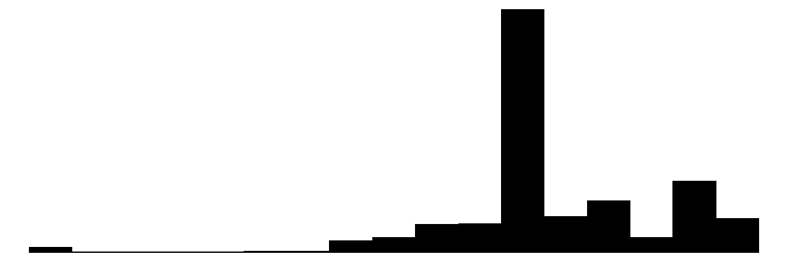
</tr>
<tr>
<td>height</td> 
<td>173</td>
<td> 0 </td>
<td>23.1</td> 
<td>32.7</td> 
<td>0.0</td>
<td>13.0</td> 
<td>272.0</td> 
<td>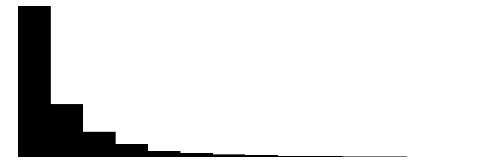
</tr>
<tr>
<td></td>
<td></td>
<td>N</td>
<td>%</td>
<td></td>
<td></td>
<td></td>
<td></td>
<td></td>
</tr>
<tr>
<td>mmarried</td>
<td>0</td>
<td>1394</td>
<td>30.0</td>
<td></td>
<td></td>
<td></td>
<td></td>
<td></td>
</tr>
<tr>
<td></td>
<td>1</td>
<td>3248</td>
<td>70.0</td>
<td></td>
<td></td>
<td></td>
<td></td>
<td></td>
</tr>
<tr>
<td>mhisp</td>
<td>0</td>
<td>4484</td>
<td>96.6</td>
<td></td>
<td></td>
<td></td>
<td></td>
<td></td>
</tr>
<tr>
<td></td>
<td>1</td>
<td>158</td>
<td>3.4</td>
<td></td>
<td></td>
<td></td>
<td></td>
<td></td>
</tr>
<tr>
<td>foreign</td>
<td>0</td>
<td>4394</td>
<td>94.7</td>
<td></td>
<td></td>
<td></td>
<td></td>
<td></td>
</tr>
<tr>
<td></td>
<td>1</td>
<td>248</td>
<td>5.3</td>
<td></td>
<td></td>
<td></td>
<td></td>
<td></td>
</tr>
<tr>
<td>alcohol</td>
<td>0</td>
<td>4492</td>
<td>96.8</td>
<td></td>
<td></td>
<td></td>
<td></td>
<td></td>
</tr>
<tr>
<td></td>
<td>1</td>
<td>150</td>
<td>3.2</td>
<td></td>
<td></td>
<td></td>
<td></td>
<td></td>
</tr>
<tr>
<td>deadkids</td>
<td>0</td>
<td>3438</td>
<td>74.1</td>
<td></td>
<td></td>
<td></td>
<td></td>
<td></td>
</tr>
<tr>
<td></td>
<td>1</td>
<td>1204</td>
<td>25.9</td>
<td></td>
<td></td>
<td></td>
<td></td>
<td></td>
</tr>
<tr>
<td>mbsmoke</td>
<td>0</td>
<td>3778</td>
<td>81.4</td>
<td></td>
<td></td>
<td></td>
<td></td>
<td></td>
</tr>
<tr>
<td></td>
<td>1</td>
<td>864</td>
<td>18.6</td>
<td></td>
<td></td>
<td></td>
<td></td>
<td></td>
</tr>
<tr>
<td>mrace</td>
<td>0</td>
<td>740</td>
<td>15.9</td>
<td></td>
<td></td>
<td></td>
<td></td>
<td></td>
</tr>
<tr>
<td></td>
<td>1</td>
<td>3902</td>
<td>84.1</td>
<td></td>
<td></td>
<td></td>
<td></td>
<td></td>
</tr>
<tr>
<td>fbaby</td>
<td>0</td>
<td>2609</td>
<td>56.2</td>
<td></td>
<td></td>
<td></td>
<td></td>
<td></td>
</tr>
<tr>
<td></td>
<td>1</td>
<td>2033</td>
<td>43.8</td>
<td></td>
<td></td>
<td></td>
<td></td>
<td></td>
</tr>
<tr>
<td>prenatal1</td>
<td>0</td>
<td>922</td>
<td>19.9</td>
<td></td>
<td></td>
<td></td>
<td></td>
<td></td>
</tr>
<tr>
<td></td>
<td>1</td>
<td>3720</td>
<td>80.1</td>
<td></td>
<td></td>
<td></td>
<td></td>
<td></td>
<tr>
</tbody>
</table>
<tr>
</tbody>
</table>

Let’s visualize the dataset.

``` r
cov <- cattaneo2[,c(2,3,4,5)]
ggpairs(cov, aes(color = cattaneo2$mbsmoke, alpha = 0.5)) + theme(axis.text = element_text(size = 5), strip.text = element_text(size = 6))
```

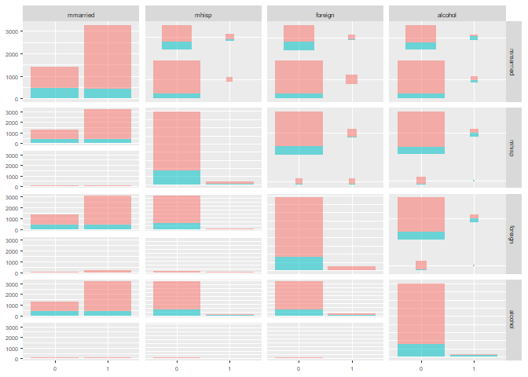<!-- -->

``` r
cov <- cattaneo2[,c(6,7,8,9)]
ggpairs(cov, aes(color = cattaneo2$mbsmoke, alpha = 0.5)) + theme(axis.text = element_text(size = 5), strip.text = element_text(size = 6))
```

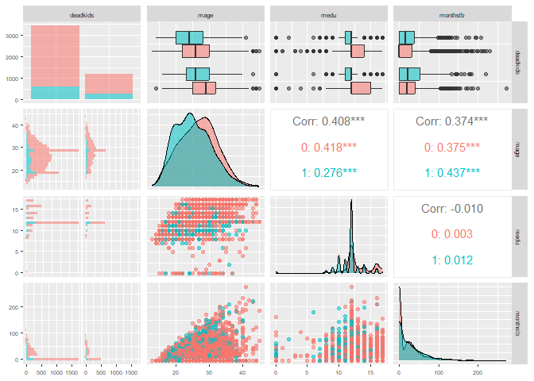<!-- -->

``` r
cov <- cattaneo2[,c(11,12,13)]
ggpairs(cov, aes(color = cattaneo2$mbsmoke, alpha = 0.5)) + theme(axis.text = element_text(size = 5), strip.text = element_text(size = 6))
```

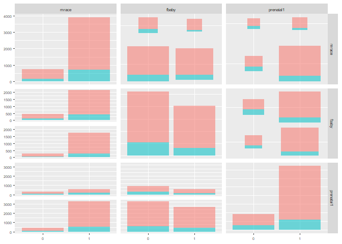<!-- -->

``` r
cov <- cattaneo2[, c(2,3,4,5,6,7,8,9)]
ggduo(data = cov, aes(color = cattaneo2$mbsmoke, alpha = 0.5), columnsX = c(1,2,3,4), columnsY = c(5,6,7,8)) + theme(axis.text = element_text(size = 5), strip.text = element_text(size = 6))
```

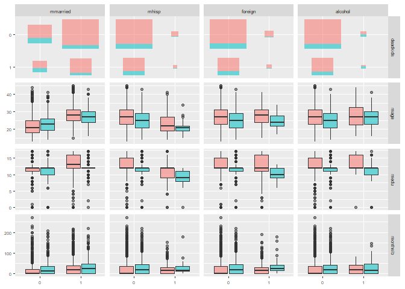<!-- -->

``` r
cov <- cattaneo2[, c(2,3,4,5,11,12,13)]
ggduo(data = cov, aes(color = cattaneo2$mbsmoke, alpha = 0.5), columnsX = c(1,2,3,4), columnsY = c(5,6,7)) + theme(axis.text = element_text(size = 5), strip.text = element_text(size = 6))
```

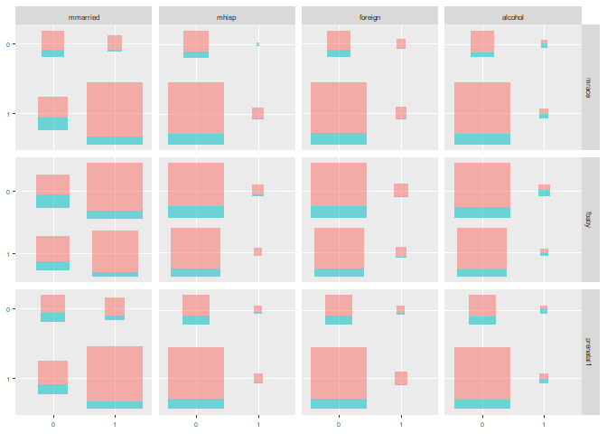<!-- -->

``` r
cov <- cattaneo2[, c(6,7,8,9,11,12,13)]
ggduo(data = cov, aes(color = cattaneo2$mbsmoke, alpha = 0.5), columnsX = c(1,2,3,4), columnsY = c(5,6,7)) + theme(axis.text = element_text(size = 5), strip.text = element_text(size = 6))
```

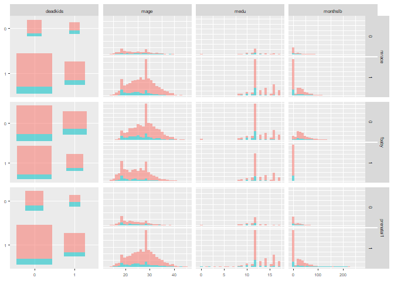<!-- -->

### Naive ATE Estimate

First, we compute the “naive” ATE estimate.

``` r
ate_naive <- c(mean(cattaneo2$bweight[cattaneo2$mbsmoke == 1]) - mean(cattaneo2$bweight[cattaneo2$mbsmoke == 0]),
sqrt(var(cattaneo2$bweight[cattaneo2$mbsmoke == 1])/sum(cattaneo2$mbsmoke == 1) + var(cattaneo2$bweight[cattaneo2$mbsmoke == 0])/sum(cattaneo2$mbsmoke == 0)))

names(ate_naive) <- c('est', 'sd')
ate_naive
```

    ##        est         sd 
    ## -275.25187   21.22091

Let’s compute the bootstrapped confidence interval to get a clear
comparison with other methods we will use later.

``` r
set.seed(123)
nb <- 1000

ate_naive_ests <- numeric(nb)
  
for(i in 1:nb){
  cattaneo2_new <-  cattaneo2[sample(nrow(cattaneo2) , rep=TRUE),]
  ate_naive_ests[i] <- mean(cattaneo2_new$bweight[cattaneo2_new$mbsmoke == 1]) - mean(cattaneo2_new$bweight[cattaneo2_new$mbsmoke == 0])
}

quantile(ate_naive_ests, c(0.025,0.975))
```

    ##      2.5%     97.5% 
    ## -315.1685 -234.7995

### Regression Adjustment

Next, we will consider the ATE estimate adjusted for the covariates
using a regression. We repeatedly used two versions—the standard one
without the interaction of the treatment with covariates.

``` r
lm_cattaneo2 <- lm(bweight ~ .,  data = cattaneo2)
ate_reg <- c(coef(summary(lm_cattaneo2))[10,1], coef(summary(lm_cattaneo2))[10,2])
names(ate_reg) <- c('est', 'sd')
ate_reg
```

    ##        est         sd 
    ## -239.97947   22.27584

And Lin’s estimator includes the interaction, even though we assume that
the treatment effect is homogeneous. Lin’s estimator includes these
interactions because it ensures that it will never lose efficiency
asymptotically when estimating ATE compared to the unadjusted estimator,
a guarantee that the previous regression does not have.

``` r
lm_lin_cattaneo2 <- lm_lin(bweight ~ mbsmoke , covariates = ~ mmarried + mhisp + foreign + alcohol + deadkids + mage + medu + monthslb + mrace + fbaby + prenatal1, data = cattaneo2)
ate_reg_lin <- c(coef(summary(lm_lin_cattaneo2))[2,1], coef(summary(lm_lin_cattaneo2))[2,2])
names(ate_reg_lin) <- c('est', 'sd')
ate_reg_lin
```

    ##        est         sd 
    ## -238.92675   26.16774

The difference between the estimates is very minor (remember that
*lm_lin* uses HC0 errors by default, so the *sd* estimator is a bit
larger).

Lin’s estimator centers the covariates to obtain the ATE estimate
directly as the regression coefficient for the treatment. However, we
could also proceed as follows without any centering.

``` r
lm_cattaneo2_alt <- lm(bweight ~ . + mbsmoke:(.-mbsmoke),  data = cattaneo2)

cattaneo2_0 <- cattaneo2
cattaneo2_1 <- cattaneo2
cattaneo2_0$mbsmoke <- "0"
cattaneo2_1$mbsmoke <- "1"

mean(predict(lm_cattaneo2_alt, cattaneo2_1)) - mean(predict(lm_cattaneo2_alt, cattaneo2_0))
```

    ## [1] -238.9267

What we did there was directly predict potential outcomes from the
model; we performed *imputation* of potential outcomes. Then, we used
these values to compute ATE.

Since we are assuming a linear regression model, this fit with treatment
interaction is equivalent to fitting two models; one for the treated and
one for the untreated.

``` r
lm_cattaneo2_alt0 <- lm(bweight ~ mmarried + mhisp + foreign + alcohol + deadkids + mage + medu + monthslb + mrace + fbaby + prenatal1,  data = cattaneo2[cattaneo2$mbsmoke == 0,])
lm_cattaneo2_alt1 <- lm(bweight ~ mmarried + mhisp + foreign + alcohol + deadkids + mage + medu + monthslb + mrace + fbaby + prenatal1,  data = cattaneo2[cattaneo2$mbsmoke == 1,])

cattaneo2_0 <- cattaneo2
cattaneo2_1 <- cattaneo2
cattaneo2_0$mbsmoke <- "0"
cattaneo2_1$mbsmoke <- "1"

mean(predict(lm_cattaneo2_alt1, cattaneo2_1)) - mean(predict(lm_cattaneo2_alt0, cattaneo2_0))
```

    ## [1] -238.9267

The reason why we showed this equivalence between these three models is
if we go back to the definition of a doubly robust estimator, we need to
construct two working models of potential outcome $`\mu_0(X,\beta_0)`$
and $`\mu_1(X,\beta_1)`$. Now, we know that these two models correspond
to Lin’s estimator; thus, fitting these two models does not
asymptotically reduce the precision of our ATE estimator (compared to
the standard regression adjustment).

Let us bootstrap Lin’s estimator and the standard regression adjustment.

``` r
set.seed(123)
nb <- 1000

ate_reg_ests <- numeric(nb)
ate_lin_ests <- numeric(nb)

for(i in 1:nb){
  
  cattaneo2_new <-  cattaneo2[sample(nrow(cattaneo2) , rep=TRUE),]
  
  lm_cattaneo2_new <- lm(bweight ~ .,  data = cattaneo2_new)
  lm_lin_cattaneo2_new <- lm_lin(bweight ~ mbsmoke , covariates = ~ mmarried + mhisp + foreign + alcohol + deadkids + mage + medu + monthslb + mrace + fbaby + prenatal1, data = cattaneo2_new)
  
  ate_reg_ests[i] <- coef(summary(lm_cattaneo2_new))[10,1]
  ate_lin_ests[i] <- coef(summary(lm_lin_cattaneo2_new))[2,1]
}

results <- rbind(quantile(ate_reg_ests, c(0.025,0.975)),
quantile(ate_lin_ests, c(0.025,0.975)))
rownames(results) <- c('RA', 'RA (Lin)')
results
```

    ##               2.5%     97.5%
    ## RA       -281.8192 -195.9253
    ## RA (Lin) -291.1249 -189.4397

### Propensity Scores

The second piece we need is the propensity score model.

``` r
prop_scores_model <- glm(mbsmoke ~ . - bweight, family = binomial, data = cattaneo2)
prop_scores <- prop_scores_model$fitted.values
```

We observe the needed overlap in the propensity scores for the treated
and the untreated.

``` r
data <- data.frame(prop_scores = prop_scores, mbsmoke = cattaneo2$mbsmoke)
ggplot(data, aes(x = prop_scores, fill = mbsmoke)) +
  geom_histogram(position = "identity", alpha = 0.5, bins = 30, color = "white") +
  theme_minimal()
```

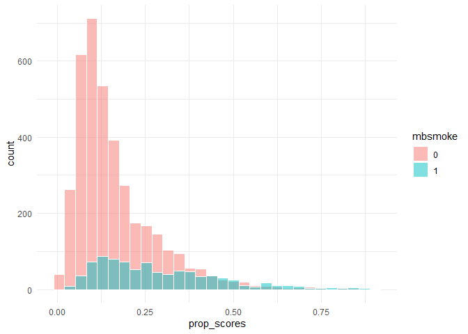<!-- -->

We see that the treatment assignment can be estimated from the data,
i.e., it is not fully randomized.

``` r
library(rms)
val.prob(predict(prop_scores_model, type = 'response'),as.numeric(cattaneo2$mbsmoke))
```

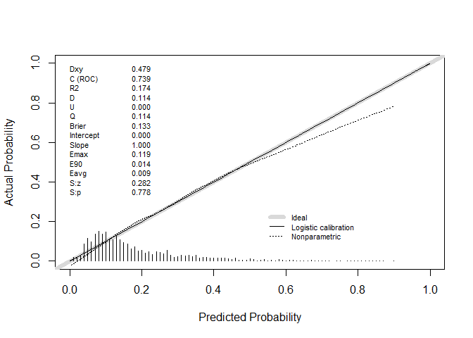<!-- -->

    ##           Dxy       C (ROC)            R2             D      D:Chi-sq 
    ##  4.786376e-01  7.393188e-01  1.740606e-01  1.135002e-01  5.278681e+02 
    ##           D:p             U      U:Chi-sq           U:p             Q 
    ##  0.000000e+00  3.399638e+00  1.578312e+04  0.000000e+00 -3.286138e+00 
    ##         Brier     Intercept         Slope          Emax           E90 
    ##  1.133426e+00  3.359698e-12  1.000000e+00  1.013486e+00  1.010364e+00 
    ##          Eavg           S:z           S:p 
    ##  9.994236e-01  1.982310e+02  0.000000e+00

``` r
library(DHARMa)
simulationOutput <- simulateResiduals(fittedModel = prop_scores_model)
plot(simulationOutput)
```

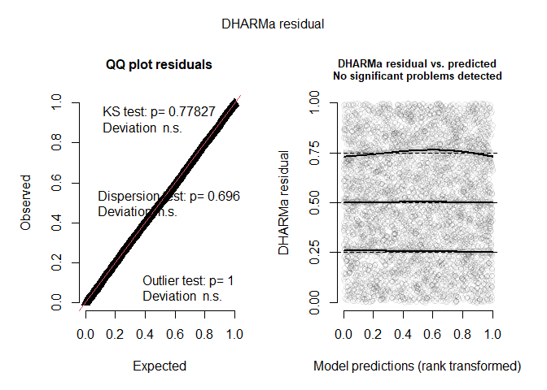<!-- -->


We should note that we can also compute the propensity scores using the
package *WeightIt*.

``` r
library(WeightIt)
prop_scores_model2 <- weightit(mbsmoke ~ . - bweight, data = cattaneo2, method = "glm", estimand = "ATE")
```

We can quickly check that the result is the same.

``` r
max(abs(prop_scores -prop_scores_model2$ps))
```

    ## [1] 2.275957e-15

The main output from the function *weightit* is the weights
``` math
w_i = \frac{T_i}{P(T_i = 1 \mid X_i)} + \frac{1-T_i}{1- P(T_i = 1 \mid X_i)},
```
which are used to easily compute the IPW estimators we introduce in the
last part.

``` r
mbsmoke <- as.numeric(cattaneo2$mbsmoke)-1
ips_weights<- (mbsmoke/ prop_scores) + ((1 - mbsmoke) / (1 - prop_scores))
max(abs(ips_weights - prop_scores_model2$weights))
```

    ## [1] 1.350031e-13

We know from the last part that an important property of propensity
scores is that they should “balance” the covariates. We demonstrated
this visually last time, when we compared the covariates across strata
defined by quantiles of the propensity scores.

However, we can do this more elegantly by computing an *adjusted
sample*, obtained by weighting the original sample with the inverse
propensity weights $`w_i`$. We can then plot weighted proportions and
weighted density estimates to assess covariate balance visually.

``` r
p1 <- ggplot(cattaneo2, aes(x = alcohol, fill = mbsmoke)) +
  
  geom_bar(aes(y = after_stat(prop), group = mbsmoke), 
           position = position_dodge(preserve = "single"), color = "white") +
  scale_y_continuous(labels = scales::percent) +
  labs(
    title = "Unadjusted Proportions",
    x = "Alcohol",
    y = "Percentage",
    fill = "Group"
  ) +
  theme_minimal()

p2 <- ggplot(cattaneo2, aes(x = alcohol, weight = ips_weights, fill = mbsmoke)) +
  
  geom_bar(aes(y = after_stat(prop), group = mbsmoke), 
           position = position_dodge(preserve = "single"), color = "white") +
  scale_y_continuous(labels = scales::percent) +
  labs(
    title = "Adjusted (Weighted) Proportions",
    x = "Alcohol",
    y = "Percentage",
    fill = "Group"
  ) +
  theme_minimal()

(p1 + p2) + plot_layout(ncol = 2)
```

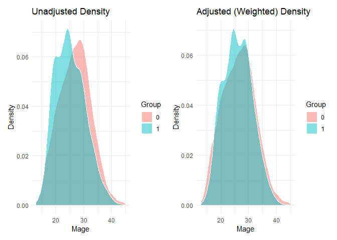<!-- -->

``` r
p1 <-  ggplot(cattaneo2, aes(x = mage, fill = mbsmoke)) +
  geom_density(alpha = 0.5, position = "identity", bins = 30, color = "white") +
  labs(
    title = "Unadjusted Density",
    x = "Mage",
    y = "Density",
    fill = "Group"
  ) +
  theme_minimal()

p2 <-  ggplot(cattaneo2, aes(x = mage, weight = ips_weights, fill = mbsmoke)) +
  geom_density(alpha = 0.5, position = "identity", bins = 30, color = "white") +
  labs(
    title = "Adjusted (Weighted) Density",
    x = "Mage",
    y = "Density",
    fill = "Group"
  ) +
  theme_minimal()

(p1 + p2) + plot_layout(ncol = 2)
```

<!-- -->

We see that the adjusted proportions/densities are much more balanced
(i.e., similar) for the treated and the untreated groups. We do not have
to construct these ourselves. We can use the package *cobalt* and plot
these graphs for both our manually computed inverse propensity weights
and for the model computed using *WeightIt*.

``` r
library(cobalt)
covs = cattaneo2[, c(-1,-10)]
treat = cattaneo2$mbsmoke 

p1 <- bal.plot(treat ~ covs, weights = ips_weights, var = c('mmarried'))
p2 <- bal.plot(treat ~ covs, weights = ips_weights, var = c('mhisp'))
p3 <- bal.plot(treat ~ covs, weights = ips_weights, var = c('foreign'))
p4 <- bal.plot(treat ~ covs, weights = ips_weights, var = c('alcohol'))

(p1 + p2 + p3 + p4) + plot_layout(ncol = 2)
```

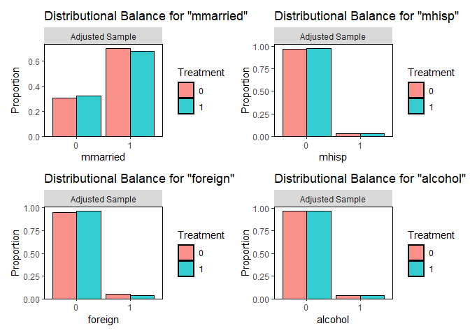<!-- -->

``` r
p1 <- bal.plot(prop_scores_model2, var = c('deadkids'))
p2 <- bal.plot(prop_scores_model2, var = c('mage'))
p3 <- bal.plot(prop_scores_model2, var = c('medu'))
p4 <- bal.plot(prop_scores_model2, var = c('monthslb'))

(p1 + p2 + p3 + p4) + plot_layout(ncol = 2)
```

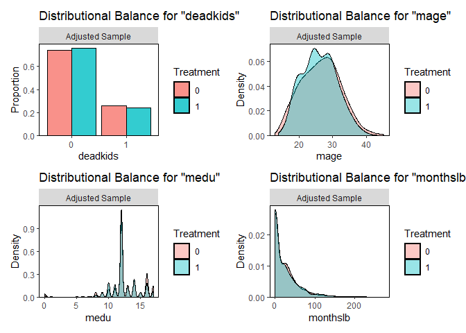<!-- -->

``` r
p1 <- bal.plot(prop_scores_model2, var = c('mrace'))
p2 <- bal.plot(prop_scores_model2, var = c('fbaby'))
p3 <- bal.plot(prop_scores_model2, var = c('prenatal1'))
(p1 + p2 + p3) + plot_layout(ncol = 2)
```

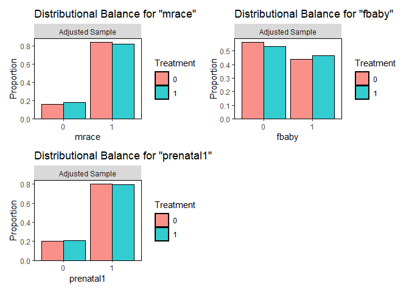<!-- -->

We can also compute the adjusted difference in the means.

``` r
bal.tab(prop_scores_model2, continuous = 'raw', binary = 'raw')
```

    ## Balance Measures
    ##                Type Diff.Adj
    ## prop.score Distance   0.0025
    ## mmarried     Binary  -0.0183
    ## mhisp        Binary  -0.0053
    ## foreign      Binary  -0.0174
    ## alcohol      Binary   0.0010
    ## deadkids     Binary  -0.0145
    ## mage        Contin.  -0.4161
    ## medu        Contin.  -0.2426
    ## monthslb    Contin.  -0.8669
    ## mrace        Binary  -0.0192
    ## fbaby        Binary   0.0298
    ## prenatal1    Binary  -0.0077
    ## 
    ## Effective sample sizes
    ##            Control Treated
    ## Unadjusted 3778.     864. 
    ## Adjusted   3543.16   559.6

These values are nothing other than the Hájek estimates for the
covariate values we used to check covariate balance at the end of the
last part.

``` r
cattaneo2_red <- cattaneo2[, c(-1,-10)]

balance_ests <- numeric(11)
sum_w_treated <- sum(ips_weights[mbsmoke == 1])
sum_w_control <- sum(ips_weights[mbsmoke== 0])
ips_weights_hajek <- ifelse(mbsmoke == 1, ips_weights / sum_w_treated, ips_weights / sum_w_control)


for (j in 1:11){
  
  covariate <- cattaneo2_red[,j]
  
  if(is.factor(covariate)){covariate <- as.numeric(covariate)-1}
  
  balance_ests[j] <- sum(covariate[mbsmoke == 1]*ips_weights_hajek[mbsmoke == 1]) - sum(covariate[mbsmoke == 0]*ips_weights_hajek[mbsmoke == 0])
  
}

names(balance_ests) <- colnames(cattaneo2[,c(-1,-10)])
balance_ests
```

    ##      mmarried         mhisp       foreign       alcohol      deadkids 
    ## -0.0182892919 -0.0053231929 -0.0173613720  0.0009871165 -0.0144828200 
    ##          mage          medu      monthslb         mrace         fbaby 
    ## -0.4160891590 -0.2426239627 -0.8669482501 -0.0191897069  0.0297833257 
    ##     prenatal1 
    ## -0.0076724856

Let us bootstrap these.

``` r
set.seed(123)
nb <- 1000

balance_ests <- matrix(0,nb,11)
  
for(i in 1:nb){
  
  cattaneo2_new <-  cattaneo2[sample(nrow(cattaneo2) , rep=TRUE),]
  prop_scores_new <- glm(mbsmoke ~ . - bweight, family = binomial, data = cattaneo2_new)$fitted.values
  
  mbsmoke_new <- as.numeric(cattaneo2_new$mbsmoke)-1

  ips_weights_new <- (mbsmoke_new / prop_scores_new) + ((1 - mbsmoke_new) / (1 - prop_scores_new))
  sum_w_treated_new <- sum(ips_weights_new[mbsmoke_new == 1])
  sum_w_control_new <- sum(ips_weights_new[mbsmoke_new== 0])
  ips_weights_h_new <- ifelse(mbsmoke_new == 1, ips_weights_new/sum_w_treated_new, ips_weights_new/sum_w_control_new)
  
  cattaneo2_new_red <- cattaneo2_new[, c(-1,-10)]
  
  for (j in 1:11){
  covariate <- cattaneo2_new_red[,j]
    
    if(is.factor(covariate)){covariate <-  as.numeric(covariate)-1}
    
    balance_ests[i,j] <- sum(covariate[mbsmoke == 1]*ips_weights_h_new[mbsmoke_new == 1]) - sum(covariate[mbsmoke_new == 0]*ips_weights_h_new[mbsmoke_new == 0])
    
  }
}

results <- apply(balance_ests, 2, function (x) quantile(x, c(0.025,0.975)))
colnames(results) <- colnames(cattaneo2[,c(-1,-10)])
results
```

    ##          mmarried      mhisp     foreign     alcohol    deadkids       mage
    ## 2.5%  -0.02844187 -0.0125288 -0.01499216 -0.01407621 -0.03023548 -0.3470401
    ## 97.5%  0.05931967  0.0170406  0.02158498  0.01350846  0.03974715  1.8349094
    ##             medu  monthslb       mrace       fbaby   prenatal1
    ## 2.5%  -0.1095361 -2.451959 -0.02492510 -0.03311545 -0.02689747
    ## 97.5%  0.8982749  3.010560  0.06024192  0.04736955  0.06301257

We observe that none of the estimated differences in adjusted means is
significantly different from zero.

We can notice that these adjusted differences can be quite a bit larger,
especially for continuous covariates, since these values depend on the
covariate’s variance. Thus, *bal.tab* also allows us to compute
standardized adjusted mean differences to make all these values more
comparable.

``` r
bal.tab(prop_scores_model2, continuous = 'std', binary = 'std', s.d.denom = 'pooled')
```

    ## Balance Measures
    ##                Type Diff.Adj
    ## prop.score Distance   0.0170
    ## mmarried     Binary  -0.0392
    ## mhisp        Binary  -0.0311
    ## foreign      Binary  -0.0862
    ## alcohol      Binary   0.0044
    ## deadkids     Binary  -0.0323
    ## mage        Contin.  -0.0760
    ## medu        Contin.  -0.1029
    ## monthslb    Contin.  -0.0253
    ## mrace        Binary  -0.0510
    ## fbaby        Binary   0.0607
    ## prenatal1    Binary  -0.0182
    ## 
    ## Effective sample sizes
    ##            Control Treated
    ## Unadjusted 3778.     864. 
    ## Adjusted   3543.16   559.6

The variance used for standardization is simply the average of the
observed (unadjusted!) variances for the treatment group and the control
group.

``` r
cattaneo2_red <- cattaneo2[, c(-1,-10)]

balance_ests <- numeric(11)

for (j in 1:11){
  
  covariate <- cattaneo2_red[,j]
  is_factor_cov <- is.factor(covariate)
  
  if(is_factor_cov){covariate <- as.numeric(covariate)-1}
  
  balance_ests[j] <- sum(covariate[mbsmoke == 1]*ips_weights_hajek[mbsmoke == 1]) - sum(covariate[mbsmoke == 0]*ips_weights_hajek[mbsmoke == 0])
  
  # divide by average variance
  balance_ests[j] <- balance_ests[j]/sqrt(
      (var(covariate[mbsmoke == 1]) + var(covariate[mbsmoke == 0]))/2
      )

}

names(balance_ests) <- colnames(cattaneo2[,c(-1,-10)])
balance_ests
```

    ##     mmarried        mhisp      foreign      alcohol     deadkids         mage 
    ## -0.039153419 -0.031072155 -0.086216242  0.004379281 -0.032275312 -0.075982531 
    ##         medu     monthslb        mrace        fbaby    prenatal1 
    ## -0.102884804 -0.025261134 -0.050946798  0.060691611 -0.018149947

We can also bootstrap these.

``` r
set.seed(123)
nb <- 1000

balance_ests <- matrix(0,nb,11)
  
for(i in 1:nb){
  
  cattaneo2_new <-  cattaneo2[sample(nrow(cattaneo2) , rep=TRUE),]
  prop_scores_new <- glm(mbsmoke ~ . - bweight, family = binomial, data = cattaneo2_new)$fitted.values
  
  mbsmoke_new <- as.numeric(cattaneo2_new$mbsmoke)-1

  ips_weights_new <- (mbsmoke_new / prop_scores_new) + ((1 - mbsmoke_new) / (1 - prop_scores_new))
  sum_w_treated_new <- sum(ips_weights_new[mbsmoke_new == 1])
  sum_w_control_new <- sum(ips_weights_new[mbsmoke_new== 0])
  ips_weights_h_new <- ifelse(mbsmoke_new == 1, ips_weights_new/sum_w_treated_new, ips_weights_new/sum_w_control_new)
  
  cattaneo2_new_red <- cattaneo2_new[, c(-1,-10)]
  
  for (j in 1:11){
  covariate <- cattaneo2_new_red[,j]
    
    if(is.factor(covariate)){covariate <-  as.numeric(covariate)-1}
    
    balance_ests[i,j] <- sum(covariate[mbsmoke == 1]*ips_weights_h_new[mbsmoke_new == 1]) - sum(covariate[mbsmoke_new == 0]*ips_weights_h_new[mbsmoke_new == 0])
    
  balance_ests[i,j] <- balance_ests[i,j]/sqrt(
      (var(covariate[mbsmoke == 1]) + var(covariate[mbsmoke == 0]))/2
      )
  }
}

results <- apply(balance_ests, 2, function (x) quantile(x, c(0.025,0.975)))
colnames(results) <- colnames(cattaneo2[,c(-1,-10)])
results
```

    ##          mmarried       mhisp     foreign     alcohol    deadkids        mage
    ## 2.5%  -0.06196409 -0.07284798 -0.06934899 -0.08253566 -0.06982161 -0.06190615
    ## 97.5%  0.12885164  0.08897887  0.09091525  0.07354130  0.09067137  0.32514341
    ##              medu    monthslb       mrace       fbaby   prenatal1
    ## 2.5%  -0.04401198 -0.07555278 -0.06674597 -0.06698166 -0.06682158
    ## 97.5%  0.34797453  0.08960124  0.16562401  0.09554815  0.15873817

Overall, it seems that propensity scores did a reasonable job at
balancing the covariates.

### IPW Estimators

Now that we have the propensity score model, we can compute the IPW
estimators (Horvitz–Thompson and Hájek) from the previous part. We will
again compute the estimators for several truncating bounds.

``` r
bweight <- cattaneo2$bweight

prop_scores2 <- pmin(pmax(prop_scores, 0.01),0.99)
prop_scores3 <- pmin(pmax(prop_scores, 0.05),0.95)
prop_scores4 <- pmin(pmax(prop_scores, 0.1),0.9)


ipw_est <- cbind(
c(mean((mbsmoke*bweight/prop_scores-(1-mbsmoke)*bweight/(1-prop_scores))),
mean((mbsmoke*bweight/prop_scores2-(1-mbsmoke)*bweight/(1-prop_scores2))),
mean((mbsmoke*bweight/prop_scores3-(1-mbsmoke)*bweight/(1-prop_scores3))),
mean((mbsmoke*bweight/prop_scores4-(1-mbsmoke)*bweight/(1-prop_scores4)))),


c(sum((mbsmoke*bweight/prop_scores))/sum(((mbsmoke/prop_scores))) - sum(((1-mbsmoke)*bweight/(1-prop_scores)))/sum((((1-mbsmoke)/(1-prop_scores)))),

sum((mbsmoke*bweight/prop_scores2))/sum(((mbsmoke/prop_scores2))) - sum(((1-mbsmoke)*bweight/(1-prop_scores2)))/sum((((1-mbsmoke)/(1-prop_scores2)))),

sum((mbsmoke*bweight/prop_scores3))/sum(((mbsmoke/prop_scores3))) - sum(((1-mbsmoke)*bweight/(1-prop_scores3)))/sum((((1-mbsmoke)/(1-prop_scores3)))),

sum((mbsmoke*bweight/prop_scores4))/sum(((mbsmoke/prop_scores4))) - sum(((1-mbsmoke)*bweight/(1-prop_scores4)))/sum((((1-mbsmoke)/(1-prop_scores4))))))


colnames(ipw_est) <- c('Horvitz–Thompson','Hájek')
rownames(ipw_est) <- c('(0,1)', '(0.01,0.99)', '(0.05,0.95)', '(0.1,0.9)')   
ipw_est
```

    ##             Horvitz–Thompson     Hájek
    ## (0,1)              -357.3011 -241.6941
    ## (0.01,0.99)        -357.3071 -241.6942
    ## (0.05,0.95)        -389.1412 -241.4583
    ## (0.1,0.9)          -616.8934 -243.1857

We observe that the Hájek estimator is quite stable, whereas the
Horvitz–Thompson estimator is quite a bit off, as is often the case. Let
us bootstrap the Hájek estimators.

``` r
set.seed(123)
nb <- 1000

ate_ests <- matrix(0,nb,4)
  
for(i in 1:nb){
  
  cattaneo2_new <-  cattaneo2[sample(nrow(cattaneo2) , rep=TRUE),]
  prop_scores_new <- glm(mbsmoke ~ . - bweight, family = binomial, data = cattaneo2_new)$fitted.values
  prop_scores2_new <- pmin(pmax(prop_scores_new, 0.01),0.99)
  prop_scores3_new <- pmin(pmax(prop_scores_new, 0.05),0.95)
  prop_scores4_new <- pmin(pmax(prop_scores_new, 0.1),0.9)
  
  mbsmoke_new <- as.numeric(cattaneo2_new$mbsmoke)-1
  bweight_new <- cattaneo2_new$bweight

  ips_weights_new1 <- (mbsmoke_new / prop_scores_new) +  ((1 - mbsmoke_new) / (1 - prop_scores_new))
  ips_weights_new2 <- (mbsmoke_new / prop_scores2_new) + ((1 - mbsmoke_new) / (1 - prop_scores2_new))
  ips_weights_new3 <- (mbsmoke_new / prop_scores3_new) + ((1 - mbsmoke_new) / (1 - prop_scores3_new))
  ips_weights_new4 <- (mbsmoke_new / prop_scores4_new) + ((1 - mbsmoke_new) / (1 - prop_scores4_new))
  
  
  ips_weights_h_new1 <- ifelse(mbsmoke_new == 1, ips_weights_new1/sum(ips_weights_new1[mbsmoke_new == 1]), ips_weights_new1/sum(ips_weights_new1[mbsmoke_new== 0]))
  ips_weights_h_new2 <- ifelse(mbsmoke_new == 1, ips_weights_new2/sum(ips_weights_new2[mbsmoke_new == 1]), ips_weights_new2/sum(ips_weights_new2[mbsmoke_new== 0]))
  ips_weights_h_new3 <- ifelse(mbsmoke_new == 1, ips_weights_new3/sum(ips_weights_new3[mbsmoke_new == 1]), ips_weights_new3/sum(ips_weights_new3[mbsmoke_new== 0]))
  ips_weights_h_new4 <- ifelse(mbsmoke_new == 1, ips_weights_new4/sum(ips_weights_new4[mbsmoke_new == 1]), ips_weights_new4/sum(ips_weights_new4[mbsmoke_new== 0]))
  
  
  ate_ests[i,1] <- sum(bweight_new[mbsmoke_new == 1]*ips_weights_h_new1[mbsmoke_new == 1]) - sum(bweight_new[mbsmoke_new == 0]*ips_weights_h_new1[mbsmoke_new == 0])
  ate_ests[i,2] <- sum(bweight_new[mbsmoke_new == 1]*ips_weights_h_new2[mbsmoke_new == 1]) - sum(bweight_new[mbsmoke_new == 0]*ips_weights_h_new2[mbsmoke_new == 0])
  ate_ests[i,3] <- sum(bweight_new[mbsmoke_new == 1]*ips_weights_h_new3[mbsmoke_new == 1]) - sum(bweight_new[mbsmoke_new == 0]*ips_weights_h_new3[mbsmoke_new == 0])
  ate_ests[i,4] <- sum(bweight_new[mbsmoke_new == 1]*ips_weights_h_new4[mbsmoke_new == 1]) - sum(bweight_new[mbsmoke_new == 0]*ips_weights_h_new4[mbsmoke_new == 0])
  
}


results <- apply(ate_ests,2, function (x) quantile(x, c(0.025,0.975)))
colnames(results) <- c('(0,1)', '(0.01,0.99)', '(0.05,0.95)', '(0.1,0.9)')
results
```

    ##           (0,1) (0.01,0.99) (0.05,0.95) (0.1,0.9)
    ## 2.5%  -295.0341   -295.0343   -294.2723 -290.5748
    ## 97.5% -192.9859   -192.9858   -193.9453 -197.6324

The results correspond to the estimates based on the regression
adjustment.

One thing we did not mention about the Hájek estimator the last time is
its connection to the regression. It can be shown that the Hájek
estimator is equivalent to the weighted linear regression of the
treatment on the outcome, with inverse propensity scores weights $`w_i`$
(Ding 2024).

``` r
lm_weighted_cattaneo2 <- lm(bweight ~ mbsmoke, weights = ips_weights, data = cattaneo2)
ate_IPW <- coef(lm_weighted_cattaneo2)[2]
summary(lm_weighted_cattaneo2)
```

    ## 
    ## Call:
    ## lm(formula = bweight ~ mbsmoke, data = cattaneo2, weights = ips_weights)
    ## 
    ## Weighted Residuals:
    ##     Min      1Q  Median      3Q     Max 
    ## -8327.8  -379.8    32.7   434.0  4872.4 
    ## 
    ## Coefficients:
    ##             Estimate Std. Error t value Pr(>|t|)    
    ## (Intercept)  3406.40      11.80  288.56   <2e-16 ***
    ## mbsmoke1     -241.69      16.85  -14.34   <2e-16 ***
    ## ---
    ## Signif. codes:  0 '***' 0.001 '**' 0.01 '*' 0.05 '.' 0.1 ' ' 1
    ## 
    ## Residual standard error: 806.1 on 4640 degrees of freedom
    ## Multiple R-squared:  0.04246,    Adjusted R-squared:  0.04225 
    ## F-statistic: 205.7 on 1 and 4640 DF,  p-value: < 2.2e-16

``` r
set.seed(123)
nb <- 1000

ate_IPW_ests <- numeric(nb)
  
for(i in 1:nb){
  
  cattaneo2_new <-  cattaneo2[sample(nrow(cattaneo2) , rep=TRUE),]
  prop_scores_new <- glm(mbsmoke ~ . - bweight, family = binomial, data = cattaneo2_new)$fitted.values
  
  mbsmoke_new <- as.numeric(cattaneo2_new$mbsmoke)-1
  bweight_new <- cattaneo2_new$bweight

  ips_weights_new <- (mbsmoke_new / prop_scores_new) + ((1 - mbsmoke_new) / (1 - prop_scores_new))

  ate_IPW_ests[i] <- coefficients(lm_weighted_cattaneo2 <- lm(bweight ~ mbsmoke, weights = ips_weights_new, data = cattaneo2_new))[2]
  
}

quantile(ate_IPW_ests, c(0.025,0.975))
```

    ##      2.5%     97.5% 
    ## -295.0341 -192.9859

We got exactly the same result as for the *(0,1)* Hájek estimator. We
can also estimate these weighted regression models using *lm_weightit*
from the *WeightIt* package. The nice thing about it is that
*lm_weightit* produces the adjusted error estimates.

``` r
lm_weighted2_cattaneo2 <- lm_weightit(bweight ~ mbsmoke, weightit = prop_scores_model2, data = cattaneo2)
summary(lm_weighted2_cattaneo2)
```

    ## 
    ## Call:
    ## lm_weightit(formula = bweight ~ mbsmoke, data = cattaneo2, weightit = prop_scores_model2)
    ## 
    ## Coefficients:
    ##             Estimate Std. Error z value Pr(>|z|)    
    ## (Intercept)  3406.40       9.62 354.099   <1e-06 ***
    ## mbsmoke1     -241.69      26.33  -9.181   <1e-06 ***
    ## Standard error: HC0 robust (adjusted for estimation of weights)

``` r
confint(lm_weighted2_cattaneo2)
```

    ##                 2.5 %    97.5 %
    ## (Intercept) 3387.5441 3425.2534
    ## mbsmoke1    -293.2915 -190.0966

We observe that the confidence interval produced by *lm_weightit* is
quite close to our bootstrap estimate.

### Doubly Robust Estimators

Finally, we will consider the doubly robust estimator (augmented inverse
propensity score weighting, AIPW). As we have discussed, our working
model for the potential outcomes is based on Lin’s estimator. We combine
it with the IPW estimator using the formulas
``` math
\hat\mu_1^\text{DR} = \frac{1}{n}\sum_{i = 1}^n\left[\frac{T_i(Y_i-\mu_1(X_i, \hat\beta_1))}{e(X_i,\hat\alpha)} + \mu_1(X_i, \hat\beta_1)\right],
```
and
``` math
\hat\mu_0^\text{DR} = \frac{1}{n}\sum_{i = 1}^n\left[\frac{(1-T_i)(Y_i-\mu_0(X_i, \hat\beta_0))}{1-e(X_i,\hat\alpha)} + \mu_0(X_i, \hat\beta_0)\right].
```

``` r
lm_cattaneo2_0 <- lm(bweight ~ mmarried + mhisp + foreign + alcohol + deadkids + mage + medu + monthslb + mrace + fbaby + prenatal1, data = cattaneo2[mbsmoke == 0,])
lm_cattaneo2_1 <- lm(bweight ~ mmarried + mhisp + foreign + alcohol + deadkids + mage + medu + monthslb + mrace + fbaby + prenatal1, data = cattaneo2[mbsmoke == 1,])


cattaneo2_0 <- cattaneo2
cattaneo2_1 <- cattaneo2
cattaneo2_0$mbsmoke <- "0"
cattaneo2_1$mbsmoke <- "1"

po_0 <- predict(lm_cattaneo2_0, cattaneo2_0)
po_1 <- predict(lm_cattaneo2_1, cattaneo2_1)

ate_DR <- mean(po_1 - po_0 + mbsmoke*(bweight-po_1)/prop_scores - (1-mbsmoke)*(bweight-po_0)/(1-prop_scores))
ate_DR
```

    ## [1] -236.6764

``` r
set.seed(123)
nb <- 1000

ate_DR_ests <- numeric(nb)
  
for(i in 1:nb){
  
  cattaneo2_new <-  cattaneo2[sample(nrow(cattaneo2) , rep=TRUE),]
  prop_scores_new <- glm(mbsmoke ~ . - bweight, family = binomial, data = cattaneo2_new)$fitted.values
  
  lm_cattaneo2_0_new <- lm(bweight ~ mmarried + mhisp + foreign + alcohol + deadkids + mage + medu + monthslb + mrace + fbaby + prenatal1, data = cattaneo2_new[cattaneo2_new$mbsmoke == 0,])
  
  lm_cattaneo2_1_new <- lm(bweight ~ mmarried + mhisp + foreign + alcohol + deadkids + mage + medu + monthslb + mrace + fbaby + prenatal1, data = cattaneo2_new[cattaneo2_new$mbsmoke == 1,])
  
  mbsmoke_new <- cattaneo2_new$mbsmoke
  bweight_new <- cattaneo2_new$bweight
  cattaneo2_0_new <- cattaneo2_new
  cattaneo2_1_new <- cattaneo2_new
  cattaneo2_0_new$mbsmoke <- "0"
  cattaneo2_1_new$mbsmoke <- "1"
  
  po_0_new <- predict(lm_cattaneo2_0_new, cattaneo2_0_new)
  po_1_new <- predict(lm_cattaneo2_1_new, cattaneo2_1_new)
  
  mbsmoke_new <- as.numeric(cattaneo2_new$mbsmoke)-1
  bweight_new <- cattaneo2_new$bweight

  ate_DR_ests[i] <- mean(po_1_new - po_0_new + mbsmoke_new*(bweight_new-po_1_new)/prop_scores_new - (1-mbsmoke_new)*(bweight_new-po_0_new)/(1-prop_scores_new))
}

quantile(ate_DR_ests, c(0.025,0.975))
```

    ##      2.5%     97.5% 
    ## -292.5534 -186.0117

We can construct a slightly different AIPW estimate using the Hájek
estimator (Zhang et al. 2026).
``` math
\hat\mu_1^\text{DR, Hájek} = \frac{\sum_{i = 1}^nT_i(Y_i-\mu_1(X_i, \hat\beta_1))}{\sum_{i = 1}^n e(X_i,\hat\alpha)T_i} +\frac{1}{n}\sum_{i=1}^n\mu_1(X_i, \hat\beta_1),
```
``` math
\hat\mu_0^\text{DR, Hájek} = \frac{\sum_{i = 1}^n(1-T_i)(Y_i-\mu_1(X_i, \hat\beta_0))}{\sum_{i = 1}^n (1-e(X_i,\hat\alpha))(1-T_i)} +\frac{1}{n}\sum_{i=1}^n \mu_0(X_i, \hat\beta_0).
```

Simulations showed that these estimators are usually almost identical
(Zhang et al. 2026).

``` r
ate_DRH <- mean(po_1-po_0) + sum(mbsmoke*(bweight-po_1)/prop_scores)/sum(mbsmoke/prop_scores) - sum((1-mbsmoke)*(bweight-po_0)/(1-prop_scores))/sum((1-mbsmoke)/(1-prop_scores))
ate_DRH
```

    ## [1] -236.6041

``` r
set.seed(123)
nb <- 1000

ate_DRH_ests <- numeric(nb)
  
for(i in 1:nb){
  
  cattaneo2_new <-  cattaneo2[sample(nrow(cattaneo2) , rep=TRUE),]
  prop_scores_new <- glm(mbsmoke ~ . - bweight, family = binomial, data = cattaneo2_new)$fitted.values
  
  lm_cattaneo2_0_new <- lm(bweight ~ mmarried + mhisp + foreign + alcohol + deadkids + mage + medu + monthslb + mrace + fbaby + prenatal1, data = cattaneo2_new[cattaneo2_new$mbsmoke == 0,])
  
  lm_cattaneo2_1_new <- lm(bweight ~ mmarried + mhisp + foreign + alcohol + deadkids + mage + medu + monthslb + mrace + fbaby + prenatal1, data = cattaneo2_new[cattaneo2_new$mbsmoke == 1,])
  
  mbsmoke_new <- cattaneo2_new$mbsmoke
  bweight_new <- cattaneo2_new$bweight
  cattaneo2_0_new <- cattaneo2_new
  cattaneo2_1_new <- cattaneo2_new
  cattaneo2_0_new$mbsmoke <- "0"
  cattaneo2_1_new$mbsmoke <- "1"
  
  po_0_new <- predict(lm_cattaneo2_0_new, cattaneo2_0_new)
  po_1_new <- predict(lm_cattaneo2_1_new, cattaneo2_1_new)
  
  mbsmoke_new <- as.numeric(cattaneo2_new$mbsmoke)-1
  bweight_new <- cattaneo2_new$bweight

  ate_DRH_ests[i] <- mean(po_1_new-po_0_new) + sum(mbsmoke_new*(bweight_new-po_1_new)/prop_scores_new)/sum(mbsmoke_new/prop_scores_new) - sum((1-mbsmoke_new)*(bweight_new-po_0_new)/(1-prop_scores_new))/sum((1-mbsmoke_new)/(1-prop_scores_new))
}

quantile(ate_DRH_ests, c(0.025,0.975))
```

    ##      2.5%     97.5% 
    ## -292.6726 -185.9007

We discussed that Hájek IPW estimator is equivalent to the weighted
regression of the treatment on the outcome. Thus, one might wonder
whether we can obtain a doubly robust estimator by performing weighted
regression of the treatment and the covariates on the outcome. It turns
out that this is indeed the case. This estimator is known as *IPWRA*
(inverse probability weighted regression adjustment) (Zhang et al.
2026).

``` r
w0 = ips_weights[mbsmoke == 0]
lm_cattaneo2_0 <- lm(bweight ~ mmarried + mhisp + foreign + alcohol + deadkids + mage + medu + monthslb + mrace + fbaby + prenatal1, data = cattaneo2[mbsmoke == 0,], weights = w0)

w1 = ips_weights[mbsmoke == 1]
lm_cattaneo2_1 <- lm(bweight ~ mmarried + mhisp + foreign + alcohol + deadkids + mage + medu + monthslb + mrace + fbaby + prenatal1, data = cattaneo2[mbsmoke == 1,], weights = w1)

cattaneo2_0 <- cattaneo2
cattaneo2_1 <- cattaneo2
cattaneo2_0$mbsmoke <- "0"
cattaneo2_1$mbsmoke <- "1"

po_0 <- predict(lm_cattaneo2_0, cattaneo2_0)
po_1 <- predict(lm_cattaneo2_1, cattaneo2_1)

ate_IPWRA <- mean(po_1-po_0)
ate_IPWRA
```

    ## [1] -233.7781

``` r
set.seed(123)
nb <- 1000

ate_IPWRA_ests <- numeric(nb)
  
for(i in 1:nb){
  
  cattaneo2_new <-  cattaneo2[sample(nrow(cattaneo2) , rep=TRUE),]
  prop_scores_new <- glm(mbsmoke ~ . - bweight, family = binomial, data = cattaneo2_new)$fitted.values
  
  mbsmoke_new <- cattaneo2_new$mbsmoke
  mbsmoke_new <- as.numeric(cattaneo2_new$mbsmoke)-1

  ips_weights_new <- (mbsmoke_new/ prop_scores_new) + ((1 - mbsmoke_new) / (1 - prop_scores_new))
  
  w0_new = ips_weights_new[mbsmoke_new == 0]
  w1_new = ips_weights_new[mbsmoke_new == 1]
  
  lm_cattaneo2_0_new <- lm(bweight ~ mmarried + mhisp + foreign + alcohol + deadkids + mage + medu + monthslb + mrace + fbaby + prenatal1, data = cattaneo2_new[cattaneo2_new$mbsmoke == 0,], weights = w0_new)
  
  lm_cattaneo2_1_new  <- lm(bweight ~ mmarried + mhisp + foreign + alcohol + deadkids + mage + medu + monthslb + mrace + fbaby + prenatal1, data = cattaneo2_new[cattaneo2_new$mbsmoke == 1,], weights = w1_new)

  cattaneo2_0_new <- cattaneo2_new
  cattaneo2_1_new <- cattaneo2_new
  cattaneo2_0_new$mbsmoke <- "0"
  cattaneo2_1_new$mbsmoke <- "1"
  
  po_0_new <- predict(lm_cattaneo2_0_new, cattaneo2_0_new)
  po_1_new <- predict(lm_cattaneo2_1_new, cattaneo2_1_new)
  
  ate_IPWRA_ests[i] <- mean(po_1_new-po_0_new)
}

quantile(ate_IPWRA_ests, c(0.025,0.975))
```

    ##      2.5%     97.5% 
    ## -290.8784 -181.1647

Let’s summarize our results.

``` r
final_results <- rbind(
c(ate_naive[1], quantile(ate_naive_ests, c(0.025,0.975))),
c(ate_reg[1], quantile(ate_reg_ests, c(0.025,0.975))),
c(ate_reg_lin[1], quantile(ate_lin_ests, c(0.025,0.975))),
c(ate_IPW, quantile(ate_IPW_ests, c(0.025,0.975))),
c(ate_DR, quantile(ate_DR_ests, c(0.025,0.975))),
c(ate_DRH, quantile(ate_DRH_ests, c(0.025,0.975))),
c(ate_IPWRA, quantile(ate_IPWRA_ests, c(0.025,0.975)))
)
rownames(final_results) <- c('naive', 'RA', 'RA (Lin)', 'IPW', 'AIPW', 'AIPW (Hájek)', 'IWRA')
final_results
```

    ##                    est      2.5%     97.5%
    ## naive        -275.2519 -315.1685 -234.7995
    ## RA           -239.9795 -281.8192 -195.9253
    ## RA (Lin)     -238.9267 -291.1249 -189.4397
    ## IPW          -241.6941 -295.0341 -192.9859
    ## AIPW         -236.6764 -292.5534 -186.0117
    ## AIPW (Hájek) -236.6041 -292.6726 -185.9007
    ## IWRA         -233.7781 -290.8784 -181.1647

The results, except for the naive estimate, are all similar, both the
point estimates and the confidence intervals.

## References

<div id="refs" class="references csl-bib-body hanging-indent">

<div id="ref-ding2024first" class="csl-entry">

Ding, Peng. 2024. *A First Course in Causal Inference*. CRC press.

</div>

<div id="ref-zhang2026review" class="csl-entry">

Zhang, Jingyu, Oliver Lüdtke, and Alexander Robitzsch. 2026. “A Review
and Evaluation of Doubly Robust Approaches for Estimating Average
Treatment Effects.” *Behavior Research Methods* 58 (5): 137.

</div>

</div>
