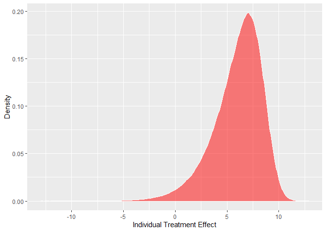
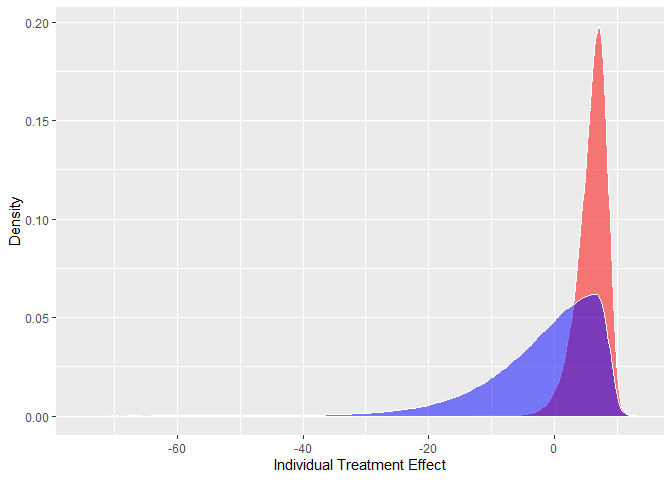
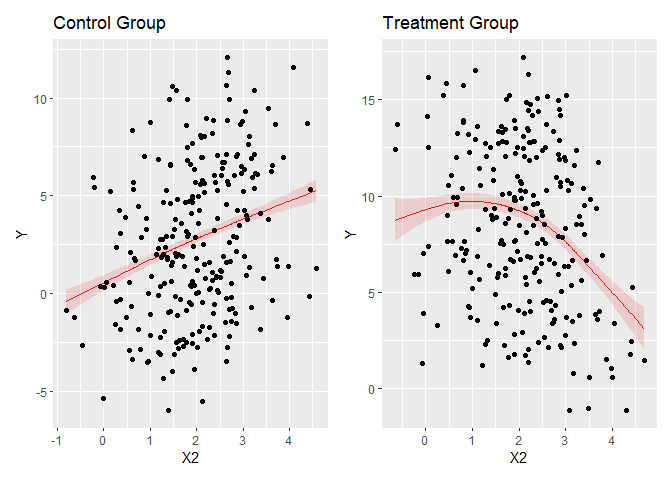
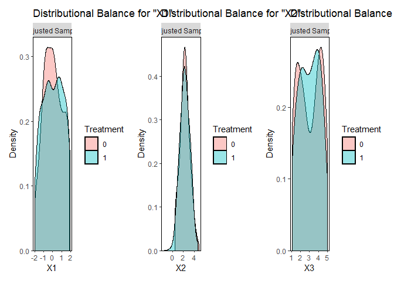
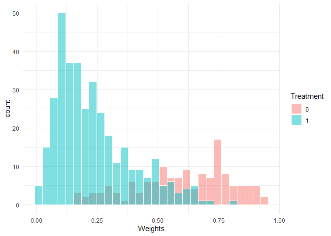

# The First Casualty of Statistics: Part Ten
<big>**ATT, ATU and ATO**</big>

<br/>
Jiří Fejlek

2026-08-26
<br/>

<br/> Up to this point, we have focused on estimating the average treatment
effect (ATE). We will now demonstrate how the ATE can be misleading when
the treatment effect is heterogeneous, since the ATE then depends on the
distribution of covariates in the population. If we also assume that the
treatment assignment depends on the covariates (i.e., we are dealing
with observational data), average effect on the treated (ATT) and
average effect on the untreated (ATU) become separate estimands. Thus,
we need to be careful about what the estimand of interest is and whether
we are using an appropriate estimator. <br/>

## Table of Contents

- [Estimating ATE For Randomized Experiments under
  Heterogeneity](#estimating-ate-for-randomized-experiments-under-heterogeneity)
- [Estimating ATE For Observational Study under
  Heterogeneity](#estimating-ate-for-observational-study-under-heterogeneity)
- [Estimating ATT](#estimating-att)
- [Average Treatment Effect in the Overlap
  Population](#average-treatment-effect-in-the-overlap-population)
- [References](#references)

``` r
library(tidyr)
library(dplyr)
library(ggplot2)
library(patchwork)
library(dagitty)
library(ggdag)
library(modelsummary)
library(GGally)
library(estimatr)
library(WeightIt)
library(cobalt)
library(mgcv)
```

### Estimating ATE For Randomized Experiments under Heterogeneity

Let’s assume a simulated completely randomized experiment, where the
potential outcomes are
``` math
Y(0) = 3X_1+ X_2 + \sin(X_3) + \varepsilon_1
```
and
``` math
Y(1) = Y(0) + 8 - 0.25X_1 + 0.5X_2 - 0.5X_2^2 + \varepsilon_2,
```
where $`\varepsilon_1, \varepsilon_2 \sim N(0, 0.25)`$. This means that
we are dealing with a clearly heterogeneous treatment effect. Let’s
simulate several datasets of covariates and potential outcomes.

``` r
set.seed(123)
nsim <- 1000
nobs <- 500


# simulate covariates and potential outcomes

X1 <- matrix(0, nsim, nobs)
X2 <- matrix(0, nsim, nobs)
X3 <- matrix(0, nsim, nobs)

Y0 <- matrix(0, nsim, nobs)
Y1 <- matrix(0, nsim, nobs)
tr_effect <- matrix(0, nsim, nobs)

for (i in 1:nsim){
  X1[i,] <- runif(nobs,-2,2) 
  X2[i,] <- rnorm(nobs,2,1) 
  X3[i,] <- runif(nobs,1,5) 
  
  Y0[i,] <- rnorm(nobs, 0.5) + 3*X1[i,] + X2[i,] + sin(X3[i,])
  Y1[i,] <- rnorm(nobs, 0.5) + Y0[i,] +  8 + 0.25*X1[i,] - 0.5*X2[i,]^2
  tr_effect[i,] <- Y1[i,] - Y0[i,]
}
```

Next, we compute ATE, ATT, and ATU for each dataset.

``` r
# simulate ATE, ATU, ATT for the given treatment assignment

ATE_sim <- numeric(nsim)
ATU_sim <- numeric(nsim)
ATT_sim <- numeric(nsim)
pi <- numeric(nsim)

Tr <- matrix(0, nsim, nobs)

for (i in 1:nsim){
  
  Tr[i,] <- round(runif(nobs,0,1))
 
  ATE_sim[i] <- mean(Y1[i,]-Y0[i,])
  ATT_sim[i] <- mean(Y1[i,Tr[i,] == 1]-Y0[i,Tr[i,] == 1])
  ATU_sim[i] <- mean(Y1[i,Tr[i,] == 0]-Y0[i,Tr[i,] == 0])
  pi[i] <- mean(Tr[i,])
}

results <- rbind(
  c(mean(ATE_sim), sd(ATE_sim)),
  c(mean(ATT_sim), sd(ATT_sim)),
  c(mean(ATU_sim), sd(ATU_sim)),
  c(mean(pi), sd(pi))
)

colnames(results) <- c('mean','sd')
rownames(results) <- c('ATE', 'ATT', 'ATU', 'treatment_probability')
results
```

    ##                           mean         sd
    ## ATE                   6.007404 0.10700645
    ## ATT                   6.008535 0.15098807
    ## ATU                   6.006099 0.15058354
    ## treatment_probability 0.499790 0.02320194

We assumed that the treatment assignment is $`P[T=1] = 0.5`$, i.e.,
independent of covariates $`X_1`$, $`X_2`$, and $`X_3`$. Thus, the
treatment group and the control group are balanced with respect to the
covariates (their distributions are the same in both groups).
Consequently, $`\text{ATE} = \text{ATT} = \text{ATU}`$ even though the
treatment effect is heterogeneous.

``` r
ggplot(data = data.frame(tr_effect = c(tr_effect))) + geom_density(aes(x = tr_effect), fill = 'red', color = "white", alpha = 0.5) + labs(x = 'Individual Treatment Effect', y = 'Density')
```

<!-- -->

The treatment effect is actually negative for some individuals. We will
return to this point later. The “naive” ATE estimates for each dataset
are as follows.

``` r
ATE_naive_est <- numeric(nsim)

for (i in 1:nsim){
  ATE_naive_est[i] <- mean(Y1[i,Tr[i,] == 1]) - mean(Y0[i,Tr[i,] == 0])
}

results <- rbind(
  c(mean(ATE_naive_est), sd(ATE_naive_est))
)

colnames(results) <- c('mean','sd')
rownames(results) <- c('naive')
results
```

    ##           mean        sd
    ## naive 6.002908 0.3517119

The estimate is unbiased and pretty accurate. Let’s perform a standard
regression adjustment with no interactions next.

``` r
ATE_reg_est <- numeric(nsim)

for (i in 1:nsim){
  
  Y <- Y0[i,]
  Y[Tr[i,] == 1] <- Y1[i, Tr[i,] == 1]

  data <- data.frame(Y = Y, Tr = Tr[i,], X1 = X1[i,], X2 = X2[i,], X3 = X3[i,])
  
  ATE_reg_est[i] <- coefficients(lm(Y~  Tr + X1 + X2 + X3, data = data))[2]
}

results <- rbind(
  c(mean(ATE_naive_est), sd(ATE_naive_est)),
  c(mean(ATE_reg_est), sd(ATE_reg_est))
)

colnames(results) <- c('mean','sd')
rownames(results) <- c('naive', 'lin_reg')
results
```

    ##             mean        sd
    ## naive   6.002908 0.3517119
    ## lin_reg 6.003990 0.1506385

Even though our model is clearly misspecified, we obtain an unbiased
estimate thanks to the randomization of treatment assignment. In
addition, the variance of this estimator is noticeably lower than that
of the naive estimator, thanks to the adjustment for relevant covariates
(we discussed this in more detail in Part Five).

Let us consider Lin’s estimator that includes the interaction between
the treatment and the covariates.

``` r
ATE_reg_lin_est <- numeric(nsim)

for (i in 1:nsim){
  
  Y <- Y0[i,]
  Y[Tr[i,] == 1] <- Y1[i, Tr[i,] == 1]

  data <- data.frame(Y = Y, Tr = Tr[i,], X1 = X1[i,], X2 = X2[i,], X3 = X3[i,])
  
  ATE_reg_lin_est[i] <- coefficients(lm_lin(Y ~ Tr, covariates = ~ X1 + X2 + X3, data = data))[2]
}

results <- rbind(
  c(mean(ATE_naive_est), sd(ATE_naive_est)),
  c(mean(ATE_reg_est), sd(ATE_reg_est)),
  c(mean(ATE_reg_lin_est), sd(ATE_reg_lin_est))
)

colnames(results) <- c('mean','sd')
rownames(results) <- c('naive', 'lin_reg', "Lin's est")
results
```

    ##               mean        sd
    ## naive     6.002908 0.3517119
    ## lin_reg   6.003990 0.1506385
    ## Lin's est 6.004180 0.1497393

We see that the model is the same with respect to the ATE estimator’s
variance. Lastly, let us fit a GAM-based potential outcome model for
both groups.

``` r
ATE_reg_gam_est <- numeric(nsim)

for (i in 1:nsim){
  
  Y <- Y0[i,]
  Y[Tr[i,] == 1] <- Y1[i, Tr[i,] == 1]

  data <- data.frame(Y = Y, Tr = Tr[i,], X1 = X1[i,], X2 = X2[i,], X3 = X3[i,])
  
  
  model0 <- gam(Y ~  s(X1) + s(X2) + s(X3), data = data[data$Tr == 0,])
  model1 <- gam(Y ~  s(X1) + s(X2) + s(X3), data = data[data$Tr == 1,])
  
  ATE_reg_gam_est[i] <- mean(predict(model1, data) - predict(model0, data))
  
}

results <- rbind(
  c(mean(ATE_naive_est), sd(ATE_naive_est)),
  c(mean(ATE_reg_est), sd(ATE_reg_est)),
  c(mean(ATE_reg_lin_est), sd(ATE_reg_lin_est)),
  c(mean(ATE_reg_gam_est), sd(ATE_reg_gam_est))
)

colnames(results) <- c('mean','sd')
rownames(results) <- c('naive', 'lin_reg', "Lin's est", 'GAM')
results
```

    ##               mean        sd
    ## naive     6.002908 0.3517119
    ## lin_reg   6.003990 0.1506385
    ## Lin's est 6.004180 0.1497393
    ## GAM       6.002632 0.1477398

Although this model is the most correctly specified, we see that it does
not provide a significantly more accurate estimate of ATE.

However, although all three regression models provided unbiased
estimates of ATE, they are not identical. Let’s assume that we fitted
the standard regression model or merely performed a simple comparison of
means and determined that the treatment effect is clearly and
significantly positive.

``` r
Y <- Y0[1,]
Y[Tr[1,] == 1] <- Y1[1, Tr[1,] == 1]
data <- data.frame(Y = Y, Tr = Tr[1,], X1 = X1[1,], X2 = X2[1,], X3 = X3[1,])
summary(lm(Y~  Tr + X1 + X2 + X3, data = data))
```

    ## 
    ## Call:
    ## lm(formula = Y ~ Tr + X1 + X2 + X3, data = data)
    ## 
    ## Residuals:
    ##     Min      1Q  Median      3Q     Max 
    ## -6.5741 -1.0346  0.1053  1.2015  3.7899 
    ## 
    ## Coefficients:
    ##               Estimate Std. Error t value Pr(>|t|)    
    ## (Intercept)  4.631e+00  2.676e-01   17.31   <2e-16 ***
    ## Tr           6.031e+00  1.512e-01   39.89   <2e-16 ***
    ## X1           3.152e+00  6.643e-02   47.44   <2e-16 ***
    ## X2           3.662e-05  7.516e-02    0.00        1    
    ## X3          -6.869e-01  6.549e-02  -10.49   <2e-16 ***
    ## ---
    ## Signif. codes:  0 '***' 0.001 '**' 0.01 '*' 0.05 '.' 0.1 ' ' 1
    ## 
    ## Residual standard error: 1.686 on 495 degrees of freedom
    ## Multiple R-squared:  0.8847, Adjusted R-squared:  0.8837 
    ## F-statistic: 949.2 on 4 and 495 DF,  p-value: < 2.2e-16

Based on this observation, we apply the treatment in the general
population, which is, crucially, *different* from the one we used in the
experiment.

``` r
set.seed(123)
nsim <- 1000
nobs <- 10000

ATE_sim <- numeric(nsim)
ATU_sim <- numeric(nsim)
ATT_sim <- numeric(nsim)
pi <- numeric(nsim)
tr_effect_new <- matrix(0, nsim, nobs)
Tr_all <- numeric(nsim)

for (i in 1:nsim){
  
  X1_new <- runif(nobs,-2.5,2.5) 
  X2_new <- rnorm(nobs,4,2) 
  X3_new <- runif(nobs,1,5) 
  
  Y0_new <- rnorm(nobs, 0.5) + 3*X1_new + X2_new + sin(X3_new)
  Y1_new <- rnorm(nobs, 0.5) + Y0_new +  8 + 0.25*X1_new - 0.5*X2_new^2
  
  tr_effect_new[i,] <- Y1_new - Y0_new
  
  Tr_all[1:nsim] <- 1
 
  ATE_sim[i] <- mean(Y1_new-Y0_new)
  ATT_sim[i] <- mean(Y1_new[Tr_all == 1]-Y0_new[Tr_all == 1])
  ATU_sim[i] <- mean(Y1_new[Tr_all == 0]-Y0_new[Tr_all == 0])
  pi[i] <- mean(Tr_all)
}

results <- rbind(
  c(mean(ATE_sim), sd(ATE_sim)),
  c(mean(ATT_sim), sd(ATT_sim)),
  c(mean(ATU_sim), sd(ATU_sim)),
  c(mean(pi), sd(pi))
)

colnames(results) <- c('mean','sd')
rownames(results) <- c('ATE', 'ATT', 'ATU', 'pi')
results
```

    ##          mean         sd
    ## ATE -1.499769 0.08708954
    ## ATT -1.499769 0.08708954
    ## ATU       NaN         NA
    ## pi   1.000000 0.00000000

Oops. That did not work as the analysis would suggest. Naturally, the
problem is that the distribution of $`X`$ was altered, and since the
treatment effect is heterogeneous, the ATE now depends on the
distribution of $`X`$ in the given population.

``` r
ggplot(data = data.frame(tr_effect = c(tr_effect))) + geom_density(aes(x = tr_effect), fill = 'red', color = "white", alpha = 0.5) + labs(x = 'Individual Treatment Effect') + geom_density(aes(x = c(tr_effect_new)[1:500000]), fill = 'blue', color = "white", alpha = 0.5) + labs(x = 'Individual Treatment Effect', y = 'Density')
```

<!-- -->

This little demonstration shows that estimating ATE under
treatment-effect heterogeneity is not enough when we want to extrapolate
beyond the original population.

The two regression models that included the treatment interaction could
warn us about this.

``` r
summary(lm_lin(Y ~ Tr, covariates = ~ X1 + X2 + X3, data = data))
```

    ## 
    ## Call:
    ## lm_lin(formula = Y ~ Tr, covariates = ~X1 + X2 + X3, data = data)
    ## 
    ## Standard error type:  HC2 
    ## 
    ## Coefficients:
    ##             Estimate Std. Error  t value   Pr(>|t|) CI Lower CI Upper  DF
    ## (Intercept)  2.55193    0.06601  38.6590 3.236e-151   2.4222   2.6816 492
    ## Tr           6.03256    0.11677  51.6605 7.334e-201   5.8031   6.2620 492
    ## X1_c         2.96402    0.06278  47.2147 7.412e-185   2.8407   3.0874 492
    ## X2_c         1.05356    0.06674  15.7865  1.019e-45   0.9224   1.1847 492
    ## X3_c        -0.68468    0.05548 -12.3418  1.123e-30  -0.7937  -0.5757 492
    ## Tr:X1_c      0.37895    0.10566   3.5866  3.685e-04   0.1714   0.5866 492
    ## Tr:X2_c     -2.10686    0.13944 -15.1096  1.198e-42  -2.3808  -1.8329 492
    ## Tr:X3_c     -0.02449    0.10526  -0.2326  8.161e-01  -0.2313   0.1823 492
    ## 
    ## Multiple R-squared:  0.9321 ,    Adjusted R-squared:  0.9312 
    ## F-statistic:  1083 on 7 and 492 DF,  p-value: < 2.2e-16

``` r
library(sjPlot)
model0 <- gam(Y ~  s(X1) + s(X2) + s(X3), data = data[data$Tr == 0,])
model1 <- gam(Y ~  s(X1) + s(X2) + s(X3), data = data[data$Tr == 1,])

p1 <- plot_model(model0, type = "pred", terms = c('X2')) + geom_point(data = data[data$Tr == 0,], aes(x = X2, y =Y)) + labs(x = 'X2', y = 'Y', title = 'Control Group')
p2 <- plot_model(model1, type = "pred", terms = c('X2')) + geom_point(data = data[data$Tr == 1,], aes(x = X2, y =Y)) + labs(x = 'X2', y = 'Y', title = 'Treatment Group')

(p1 + p2) + plot_layout(ncol = 2)
```

<!-- -->

Both models clearly predict a strong negative correlation between the
treatment and $`X_2`$. Of course, this is easier said than done in
practice. The interactions are much more difficult to estimate
accurately than the main effects
(<https://statmodeling.stat.columbia.edu/2018/03/15/need16/> and
<https://statmodeling.stat.columbia.edu/2023/11/09/you-need-16-times-the-sample-size-to-estimate-an-interaction-than-to-estimate-a-main-effect-explained/>).
This implies that an experiment or a study designed around having enough
power toe estimate the treatment main effect (e.g., ATE or ATT) will be
most likely underpowered to estimate interactions.

### Estimating ATE For Observational Study under Heterogeneity

Let’s now assume that the treatment assignment is no longer independent
of covariates.

``` r
# simulate ATE, ATU, ATT for the given treatment assignment
nsim <- 1000
nobs <- 500

ATE_sim <- numeric(nsim)
ATU_sim <- numeric(nsim)
ATT_sim <- numeric(nsim)
pi <- numeric(nsim)

Tr <- matrix(0, nsim, nobs)

for (i in 1:nsim){
  
  
  Tr[i,] <- as.numeric(runif(nobs,0,1) <  plogis(X2[i,] - 3))
  
  ATE_sim[i] <- mean(Y1[i,]-Y0[i,])
  ATT_sim[i] <- mean(Y1[i,Tr[i,] == 1]-Y0[i,Tr[i,] == 1])
  ATU_sim[i] <- mean(Y1[i,Tr[i,] == 0]-Y0[i,Tr[i,] == 0])
  pi[i] <- mean(Tr[i,])
}

results <- rbind(
  c(mean(ATE_sim), sd(ATE_sim)),
  c(mean(ATT_sim), sd(ATT_sim)),
  c(mean(ATU_sim), sd(ATU_sim)),
  c(mean(pi), sd(pi))
)

colnames(results) <- c('mean','sd')
rownames(results) <- c('ATE', 'ATT', 'ATU', 'treatment_probability')
results
```

    ##                           mean         sd
    ## ATE                   6.007404 0.10700645
    ## ATT                   4.742899 0.21033302
    ## ATU                   6.556479 0.10493048
    ## treatment_probability 0.302708 0.02149644

We observe that, unlike CRE, ATE, ATT and ATU are no longer identical.
The average treatment effect for a given group depends on the
distribution of covariates in that group. Since the treatment assignment
is no longer independent of the covariates, the treated and untreated
groups differ with respect to these covariates. Thus, the average
treatment effect is also different.

Consequently, we are not just dealing with selection bias. We now also
have to specify which treatment effect we want to estimate. Let’s assume
we wish to estimate the average treatment effect for the whole
experiment population, i.e., the ATE.

First, we will consider the estimates we used for CRE.

``` r
ATE_naive_est <- numeric(nsim)
ATE_reg_est <- numeric(nsim)
ATE_reg_lin_est <- numeric(nsim)
ATE_reg_gam_est <- numeric(nsim)

for (i in 1:nsim){
  
  Y <- Y0[i,]
  Y[Tr[i,] == 1] <- Y1[i, Tr[i,] == 1]

  data <- data.frame(Y = Y, Tr = Tr[i,], X1 = X1[i,], X2 = X2[i,], X3 = X3[i,])
  
  model0 <- gam(Y ~  s(X1) + s(X2) + s(X3), data = data[data$Tr == 0,])
  model1 <- gam(Y ~  s(X1) + s(X2) + s(X3), data = data[data$Tr == 1,])

  ATE_naive_est[i] <- mean(Y1[i,Tr[i,] == 1]) - mean(Y0[i,Tr[i,] == 0])
  ATE_reg_est[i] <- coefficients(lm(Y~  Tr + X1 + X2 + X3, data = data))[2]
  ATE_reg_lin_est[i] <- coefficients(lm_lin(Y ~ Tr, covariates = ~ X1 + X2 + X3, data = data))[2]
  ATE_reg_gam_est[i] <- mean(predict(model1, data) - predict(model0, data))
  
}

results <- rbind(
  c(mean(ATE_naive_est), sd(ATE_naive_est)),
  c(mean(ATE_reg_est), sd(ATE_reg_est)),
  c(mean(ATE_reg_lin_est), sd(ATE_reg_lin_est)),
  c(mean(ATE_reg_gam_est), sd(ATE_reg_gam_est))
)

colnames(results) <- c('mean','sd')
rownames(results) <- c('naive', 'lin_reg', "Lin's est", 'GAM')
results
```

    ##               mean        sd
    ## naive     5.569450 0.4117847
    ## lin_reg   5.390207 0.1904936
    ## Lin's est 6.269847 0.2009749
    ## GAM       6.057781 0.1971877

We observe that the most accurate estimate is the one based on GAM. The
other three models are clearly misspecified, and a correct adjustment in
the observational studies requires correct model specification, as we
discussed in Part Eight.

Let us now compute the IPW (Hájek) estimator. We will compute it using
weighted regression; see Part Nine.

``` r
ATE_IPW_ests <-  numeric(nsim)

for (i in 1:nsim){
  
  Y <- Y0[i,]
  Y[Tr[i,] == 1] <- Y1[i, Tr[i,] == 1]
  
  
  data <- data.frame(Y = Y, Tr = Tr[i,], X1 = X1[i,], X2 = X2[i,], X3 = X3[i,])
  prop_scores <- glm(Tr ~ . - Y, family = binomial, data = data)$fitted.values
   
  ips_weights<- (data$Tr/ prop_scores) + ((1 - data$Tr) / (1 - prop_scores))
   
  ATE_IPW_ests[i] <- coefficients(lm(Y ~ Tr, weights = ips_weights, data = data))[2]
}


results <- rbind(
  c(mean(ATE_naive_est), sd(ATE_naive_est)),
  c(mean(ATE_reg_est), sd(ATE_reg_est)),
  c(mean(ATE_reg_lin_est), sd(ATE_reg_lin_est)),
  c(mean(ATE_reg_gam_est), sd(ATE_reg_gam_est)),
  c(mean(ATE_IPW_ests), sd(ATE_IPW_ests))
)

colnames(results) <- c('mean','sd')
rownames(results) <- c('naive', 'lin_reg', "Lin's est", 'GAM', 'IPW')
results
```

    ##               mean        sd
    ## naive     5.569450 0.4117847
    ## lin_reg   5.390207 0.1904936
    ## Lin's est 6.269847 0.2009749
    ## GAM       6.057781 0.1971877
    ## IPW       6.011817 0.2832764

We see that the IPW estimator has no bias to speak of. This is because
the propensity score model is actually correctly specified. However, we
notice that the variance of the estimator is noticeably higher than that
of estimates based on regression adjustment.

Let’s move to doubly robust estimators. We start with AIPW.

``` r
ATE_AIPW_reg_ests <-  numeric(nsim)
ATE_AIPW_gam_ests <-  numeric(nsim)

for (i in 1:nsim){
  
  Y <- Y0[i,]
  Y[Tr[i,] == 1] <- Y1[i, Tr[i,] == 1]
  
  
  data = data.frame(Y = Y, Tr = Tr[i,], X1 = X1[i,], X2 = X2[i,], X3 = X3[i,])
  prop_scores <- glm(Tr ~ . - Y, family = binomial, data = data)$fitted.values
   
  ips_weights<- (data$Tr/ prop_scores) + ((1 - data$Tr) / (1 - prop_scores))
  
  modelreg0 <- lm(Y ~ X1 + X2 + X3, data = data[data$Tr == 0,])
  modelreg1 <- lm(Y ~ X1 + X2 + X3, data = data[data$Tr == 1,])
  
  modelgam0 <- gam(Y ~  s(X1) + s(X2) + s(X3), data = data[data$Tr == 0,])
  modelgam1 <- gam(Y ~  s(X1) + s(X2) + s(X3), data = data[data$Tr == 1,])
  
  po_0 <- predict(modelreg0, data)
  po_1 <- predict(modelreg1, data)
  

  ATE_AIPW_reg_ests[i] <- mean(po_1 - po_0 + data$Tr*(data$Y-po_1)/prop_scores - (1-data$Tr)*(data$Y-po_0)/(1-prop_scores))
  
  
  po_0 <- predict(modelgam0, data)
  po_1 <- predict(modelgam1, data)
  
  ATE_AIPW_gam_ests[i] <- mean(po_1 - po_0 + data$Tr*(data$Y-po_1)/prop_scores - (1-data$Tr)*(data$Y-po_0)/(1-prop_scores))
  
}

results <- rbind(
  c(mean(ATE_naive_est), sd(ATE_naive_est)),
  c(mean(ATE_reg_est), sd(ATE_reg_est)),
  c(mean(ATE_reg_lin_est), sd(ATE_reg_lin_est)),
  c(mean(ATE_reg_gam_est), sd(ATE_reg_gam_est)),
  c(mean(ATE_IPW_ests), sd(ATE_IPW_ests)),
  c(mean(ATE_AIPW_reg_ests), sd(ATE_AIPW_reg_ests)),
  c(mean(ATE_AIPW_gam_ests), sd(ATE_AIPW_gam_ests))
)

colnames(results) <- c('mean','sd')
rownames(results) <- c('naive', 'lin_reg', "Lin's est", 'GAM', 'IPW', 'AIPW (lin_reg)', 'AIPW (GAM)')
results
```

    ##                    mean        sd
    ## naive          5.569450 0.4117847
    ## lin_reg        5.390207 0.1904936
    ## Lin's est      6.269847 0.2009749
    ## GAM            6.057781 0.1971877
    ## IPW            6.011817 0.2832764
    ## AIPW (lin_reg) 6.028342 0.2804520
    ## AIPW (GAM)     6.027958 0.1988343

In terms of variance, AIPW estimators are slightly better than IPW
estimators. Lastly, we try IPWRA in two versions, with linear adjustment
and with GAM.

``` r
ATE_IPWRA_reg_ests <-  numeric(nsim)
ATE_IPWRA_GAM_ests <-  numeric(nsim)

for (i in 1:nsim){
  
  Y <- Y0[i,]
  Y[Tr[i,] == 1] <- Y1[i, Tr[i,] == 1]
  
  data <- data.frame(Y = Y, Tr = Tr[i,], X1 = X1[i,], X2 = X2[i,], X3 = X3[i,])
  prop_scores <- glm(Tr ~ . - Y, family = binomial, data = data)$fitted.values
  ips_weights <- (data$Tr/ prop_scores) + ((1 - data$Tr) / (1 - prop_scores))
   
  weights0 <- ips_weights[Tr[i,] == 0]
  weights1 <- ips_weights[Tr[i,] == 1]
  
  modelreg0 <- lm(Y ~ X1 + X2 + X3, data = data[data$Tr == 0,], weights = weights0)
  modelreg1 <- lm(Y ~ X1 + X2 + X3, data = data[data$Tr == 1,], weights = weights1)
  
  modelgam0 <- gam(Y ~  s(X1) + s(X2) + s(X3), data = data[data$Tr == 0,], weights = weights0)
  modelgam1 <- gam(Y ~  s(X1) + s(X2) + s(X3), data = data[data$Tr == 1,], weights = weights1)
  
  ATE_IPWRA_reg_ests[i] <- mean(predict(modelreg1, data) - predict(modelreg0, data))
  ATE_IPWRA_GAM_ests[i] <- mean(predict(modelgam1, data) - predict(modelgam0, data))
}


results <- rbind(
  c(mean(ATE_naive_est), sd(ATE_naive_est)),
  c(mean(ATE_reg_est), sd(ATE_reg_est)),
  c(mean(ATE_reg_lin_est), sd(ATE_reg_lin_est)),
  c(mean(ATE_reg_gam_est), sd(ATE_reg_gam_est)),
  c(mean(ATE_IPW_ests), sd(ATE_IPW_ests)),
  c(mean(ATE_AIPW_reg_ests), sd(ATE_AIPW_reg_ests)),
  c(mean(ATE_AIPW_gam_ests), sd(ATE_AIPW_gam_ests)),
  c(mean(ATE_IPWRA_reg_ests), sd(ATE_IPWRA_reg_ests)),
  c(mean(ATE_IPWRA_GAM_ests), sd(ATE_IPWRA_GAM_ests))
)

colnames(results) <- c('mean','sd')
rownames(results) <- c('naive', 'lin_reg', "Lin's est", 'GAM', 'IPW', 'AIPW (lin_reg)', 'AIPW (GAM)', 'IPWRA (lin_reg)', 'IPWRA (GAM)')
results
```

    ##                     mean        sd
    ## naive           5.569450 0.4117847
    ## lin_reg         5.390207 0.1904936
    ## Lin's est       6.269847 0.2009749
    ## GAM             6.057781 0.1971877
    ## IPW             6.011817 0.2832764
    ## AIPW (lin_reg)  6.028342 0.2804520
    ## AIPW (GAM)      6.027958 0.1988343
    ## IPWRA (lin_reg) 6.044076 0.2128753
    ## IPWRA (GAM)     6.027363 0.2067839

We see that IPWRA estimates are similar to AIPW. We notice that AIPW and
IPWRA are indeed doubly robust, as they yield unbiased estimates even
when the regression model is misspecified. We also notice that the GAM
estimator has the least variance. This is a general expectation since
regression is usually based on some MLE estimates, which are
asymptotically efficient, and thus should be superior to other
estimators provided that the model is well-specified (although, strictly
speaking, GAM is not a pure MLE estimator, since it maximizes penalized
likelihood).

Overall, we see that heterogeneous treatment effects do not change the
sense in which ATE is estimated. All the methods we discussed throughout
this whole series work the same way. What changes is the interpretation
of ATE; ATE is no longer equal to the expected individual treatment
effect. It is now tied to the population it was estimated on, and the
individual treatment effects can be completely different.

This brings us to an important point. What if we do not want to estimate
ATE? What if our population of interest is more similar only to the
treated group, not to the whole population of the observational study?
Clearly, the estimand to go for is ATT, not ATE.

### Estimating ATT

Fortunately, estimating ATT is pretty straightforward. Since regression
can be understood as an imputation of potential outcomes, we should
immediately know one way how to estimate ATT.

``` r
ATT_reg_lin_est <- numeric(nsim)
ATT_reg_gam_est <- numeric(nsim)

for (i in 1:nsim){
  
  Y <- Y0[i,]
  Y[Tr[i,] == 1] <- Y1[i, Tr[i,] == 1]

  data <- data.frame(Y = Y, Tr = Tr[i,], X1 = X1[i,], X2 = X2[i,], X3 = X3[i,])
  
  modelreg0 <- lm(Y ~  X1 + X2 + X3, data = data[data$Tr == 0,])
  modelgam0 <- gam(Y ~  s(X1) + s(X2) + s(X3), data = data[data$Tr == 0,])

  ATT_reg_lin_est[i] <- mean(Y[Tr[i,] == 1] - predict(modelreg0, data[data$Tr == 1,]))
  ATT_reg_gam_est[i] <- mean(Y[Tr[i,] == 1] - predict(modelgam0, data[data$Tr == 1,]))
}

results <- rbind(
  c(mean(ATT_reg_lin_est), sd(ATT_reg_lin_est)),
  c(mean(ATT_reg_gam_est), sd(ATT_reg_gam_est))
  )
colnames(results) <- c('mean','sd')
rownames(results) <- c('lin_reg', 'GAM')
results
```

    ##             mean        sd
    ## lin_reg 4.745748 0.2380188
    ## GAM     4.745436 0.2384826

What we did there was use the control group to fit a model of potential
outcomes without treatment, which we then used to predict the potential
outcomes for the treated group. Notice that the linear regression is
doing a fine job, since the model without treatment is almost linear.

We can also use the weighted estimator (Ding 2024)
``` math
\text{IPW}_\text{ATT} = \frac{1}{n_1}\sum_{i = 1}^n T_iY_i - \frac{1}{n_1}\sum_{i=1}^n \frac{\hat e(X_i)}{1-\hat e(X_i)}(1-T_i)Y_i,
```
i.e., instead of weights $`1/\hat e(X_i)`$ and $`1/(1-\hat e(X_i))`$, we
must use weights $`1`$ and $`\hat e(X_i)/(1-\hat e(X_i))`$. In addition,
there is again the Hájek variant (Ding 2024)
``` math
 \text{IPW}^{\text{Hájek}}_\text{ATT} = \frac{1}{n_1}\sum_{i = 1}^n T_iY_i - \frac{\sum_{i=1}^n \frac{\hat e(X_i)}{1-\hat e(X_i)}(1-T_i)Y_i}{\sum_{i=1}^n \frac{\hat e(X_i)}{1-\hat e(X_i)}}.
```

``` r
ATT_IPW_ests <-  numeric(nsim)
ATT_IPW_h_ests <-  numeric(nsim)

for (i in 1:nsim){
  
  Y <- Y0[i,]
  Y[Tr[i,] == 1] <- Y1[i, Tr[i,] == 1]
  
  
  data <- data.frame(Y = Y, Tr = Tr[i,], X1 = X1[i,], X2 = X2[i,], X3 = X3[i,])
  prop_scores <- glm(Tr ~ . - Y, family = binomial, data = data)$fitted.values
   
  ATT_IPW_ests[i] <- sum(Y*data$Tr)/sum(data$Tr == 1) - sum((prop_scores/(1-prop_scores))*(Y*(1-data$Tr)))/sum(data$Tr == 1)
  
  ATT_IPW_h_ests[i] <- sum(Y*data$Tr)/sum(data$Tr == 1) - sum((prop_scores/(1-prop_scores))*(Y*(1-data$Tr)))/sum((prop_scores/(1-prop_scores))*((1-data$Tr)))
}

results <- rbind(
  c(mean(ATT_reg_lin_est), sd(ATT_reg_lin_est)),
  c(mean(ATT_reg_gam_est), sd(ATT_reg_gam_est)),
  c(mean(ATT_IPW_ests), sd(ATT_IPW_ests)),
  c(mean(ATT_IPW_h_ests), sd(ATT_IPW_h_ests))
)


colnames(results) <- c('mean','sd')
rownames(results) <- c('lin_reg','GAM', 'IPW', 'IPW (Hájek)')
results
```

    ##                 mean        sd
    ## lin_reg     4.745748 0.2380188
    ## GAM         4.745436 0.2384826
    ## IPW         4.749489 0.3053546
    ## IPW (Hájek) 4.749434 0.2826844

Again, we can compute the Hájek estimator more simply via the weighted
regression using the weights ($`T \in \{0,1\}`$)
``` math
w_i = T_i + (1-T_i)\frac{\hat e(X_i)}{1-\hat e(X_i)}
```

``` r
ATT_IPW_h_ests2 <-  numeric(nsim)

for (i in 1:nsim){
  
  Y <- Y0[i,]
  Y[Tr[i,] == 1] <- Y1[i, Tr[i,] == 1]
  
  
  data <- data.frame(Y = Y, Tr = Tr[i,], X1 = X1[i,], X2 = X2[i,], X3 = X3[i,])
  prop_scores <- glm(Tr ~ . - Y, family = binomial, data = data)$fitted.values
  
  
  ips_weights  <- data$Tr + (1-data$Tr)*(prop_scores / (1 - prop_scores))
  ATT_IPW_h_ests2[i] <- coefficients(lm(Y ~ Tr, weights = ips_weights, data = data))[2]
}

results <- rbind(
  c(mean(ATT_reg_lin_est), sd(ATT_reg_lin_est)),
  c(mean(ATT_reg_gam_est), sd(ATT_reg_gam_est)),
  c(mean(ATT_IPW_ests), sd(ATT_IPW_ests)),
  c(mean(ATT_IPW_h_ests), sd(ATT_IPW_h_ests)),
  c(mean(ATT_IPW_h_ests2), sd(ATT_IPW_h_ests2))
)

colnames(results) <- c('mean','sd')
rownames(results) <- c('lin_reg','GAM', 'IPW', 'IPW (Hájek)', 'IPW (Hájek via reg)')
results
```

    ##                         mean        sd
    ## lin_reg             4.745748 0.2380188
    ## GAM                 4.745436 0.2384826
    ## IPW                 4.749489 0.3053546
    ## IPW (Hájek)         4.749434 0.2826844
    ## IPW (Hájek via reg) 4.749434 0.2826844

Doubly robust estimators are analogous as well. The AIPW estimator is as
follows.

``` math
\text{AIPW}_\text{ATT}  = \frac{1}{n_1}\sum_{i=1}^n T_i(Y_i - \mu_0(X_i, \hat \beta_0)) - \frac{1}{n_1}\sum_{i=1}^n (1-T_i)\frac{\hat e(X_i)}{1-\hat e(X_i)}(Y_i - \mu_0(X_i, \hat \beta_0)) 
```

``` r
ATT_AIPW_reg_ests <-  numeric(nsim)
ATT_AIPW_gam_ests <-  numeric(nsim)

for (i in 1:nsim){
  
  Y <- Y0[i,]
  Y[Tr[i,] == 1] <- Y1[i, Tr[i,] == 1]
  
  
  data <- data.frame(Y = Y, Tr = Tr[i,], X1 = X1[i,], X2 = X2[i,], X3 = X3[i,])
  prop_scores <- glm(Tr ~ . - Y, family = binomial, data = data)$fitted.values
  
  modelreg0 <- lm(Y ~ X1 + X2 + X3, data = data[data$Tr == 0,])
  modelgam0 <- gam(Y ~  s(X1) + s(X2) + s(X3), data = data[data$Tr == 0,])
  
  ATT_AIPW_reg_ests[i] <- sum(data$Tr*(Y-predict(modelreg0,data)))/sum(data$Tr == 1) - 
    sum((1-data$Tr)*(prop_scores / (1 - prop_scores))*(Y-predict(modelreg0,data)))/sum(data$Tr == 1)
  
  
  ATT_AIPW_gam_ests[i] <- sum(data$Tr*(Y-predict(modelgam0,data)))/sum(data$Tr == 1) - 
    sum((1-data$Tr)*(prop_scores / (1 - prop_scores))*(Y-predict(modelgam0,data)))/sum(data$Tr == 1)
}

results <- rbind(
  c(mean(ATT_reg_lin_est), sd(ATT_reg_lin_est)),
  c(mean(ATT_reg_gam_est), sd(ATT_reg_gam_est)),
  c(mean(ATT_IPW_ests), sd(ATT_IPW_ests)),
  c(mean(ATT_IPW_h_ests), sd(ATT_IPW_h_ests)),
  c(mean(ATT_IPW_h_ests2), sd(ATT_IPW_h_ests2)),
  c(mean(ATT_AIPW_reg_ests), sd(ATT_AIPW_reg_ests)),
  c(mean(ATT_AIPW_gam_ests), sd(ATT_AIPW_gam_ests))
)


colnames(results) <- c('mean','sd')
rownames(results) <- c('lin_reg','GAM', 'IPW', 'IPW (Hájek)', 'IPW (Hájek via reg) ', 'AIPW (lin_reg)', 'AIPW (GAM)')
results
```

    ##                          mean        sd
    ## lin_reg              4.745748 0.2380188
    ## GAM                  4.745436 0.2384826
    ## IPW                  4.749489 0.3053546
    ## IPW (Hájek)          4.749434 0.2826844
    ## IPW (Hájek via reg)  4.749434 0.2826844
    ## AIPW (lin_reg)       4.744913 0.2385460
    ## AIPW (GAM)           4.744503 0.2392302

We can also compute the IPWRA estimators.

``` r
ATT_IPWRA_reg_ests <-  numeric(nsim)
ATT_IPWRA_GAM_ests <-  numeric(nsim)

for (i in 1:nsim){
  
  Y <- Y0[i,]
  Y[Tr[i,] == 1] <- Y1[i, Tr[i,] == 1]
  
  data <- data.frame(Y = Y, Tr = Tr[i,], X1 = X1[i,], X2 = X2[i,], X3 = X3[i,])
  prop_scores <- glm(Tr ~ . - Y, family = binomial, data = data)$fitted.values
  
  weights0 <- prop_scores[Tr[i,] == 0]/(1-prop_scores[Tr[i,] == 0])
    
  modelreg0 <- lm(Y ~ X1 + X2 + X3, data = data[data$Tr == 0,], weights = weights0)
  modelgam0 <- gam(Y ~  s(X1) + s(X2) + s(X3), data = data[data$Tr == 0,], weights = weights0)
  
  ATT_IPWRA_reg_ests[i] <- mean(Y[Tr[i,] == 1] - predict(modelreg0, data[data$Tr == 1,]))
  ATT_IPWRA_GAM_ests[i] <- mean(Y[Tr[i,] == 1] - predict(modelgam0, data[data$Tr == 1,]))
}


results <- rbind(
  c(mean(ATT_reg_lin_est), sd(ATT_reg_lin_est)),
  c(mean(ATT_reg_gam_est), sd(ATT_reg_gam_est)),
  c(mean(ATT_IPW_ests), sd(ATT_IPW_ests)),
  c(mean(ATT_IPW_h_ests), sd(ATT_IPW_h_ests)),
  c(mean(ATT_IPW_h_ests2), sd(ATT_IPW_h_ests2)),
  c(mean(ATT_AIPW_reg_ests), sd(ATT_AIPW_reg_ests)),
  c(mean(ATT_AIPW_gam_ests), sd(ATT_AIPW_gam_ests)),
  c(mean(ATT_IPWRA_reg_ests), sd(ATT_IPWRA_reg_ests)),
  c(mean(ATT_IPWRA_GAM_ests), sd(ATT_IPWRA_GAM_ests))
)

colnames(results) <- c('mean','sd')
rownames(results) <- c('lin_reg','GAM', 'IPW', 'IPW (Hájek)', 'IPW (Hájek via reg)', 'AIPW (lin_reg)', 'AIPW (GAM)' , 'IPWRA (lin_reg)', 'IPWRA (GAM)')
results
```

    ##                         mean        sd
    ## lin_reg             4.745748 0.2380188
    ## GAM                 4.745436 0.2384826
    ## IPW                 4.749489 0.3053546
    ## IPW (Hájek)         4.749434 0.2826844
    ## IPW (Hájek via reg) 4.749434 0.2826844
    ## AIPW (lin_reg)      4.744913 0.2385460
    ## AIPW (GAM)          4.744503 0.2392302
    ## IPWRA (lin_reg)     4.744933 0.2386647
    ## IPWRA (GAM)         4.745482 0.2412421

We observe that all estimates are quite similar, which is not
surprising, since both regression models and the propensity score are
well specified.

We can also estimate ATU. We can just set the treatment indicator from 1
to 0. We have to remember to reverse the sign of the result.

``` r
ATU_reg_lin_est <-  numeric(nsim)
ATU_reg_gam_est <-  numeric(nsim)
ATU_AIPW_reg_ests <-  numeric(nsim)
ATU_AIPW_gam_ests <-  numeric(nsim)
ATU_IPW_ests <-  numeric(nsim)
ATU_IPW_h_ests <-  numeric(nsim)
ATU_IPW_ests <-  numeric(nsim)
ATU_IPW_h_ests <-  numeric(nsim)
ATU_IPWRA_reg_ests <-  numeric(nsim)
ATU_IPWRA_GAM_ests <-  numeric(nsim)

for (i in 1:nsim){
  
  Y <- Y0[i,]
  Y[Tr[i,] == 1] <- Y1[i, Tr[i,] == 1]
  
  Tr[i,] = 1 - Tr[i,]
  
  data <- data.frame(Y = Y, Tr = Tr[i,], X1 = X1[i,], X2 = X2[i,], X3 = X3[i,])
  prop_scores <- glm(Tr ~ . - Y, family = binomial, data = data)$fitted.values
  weights0 <- prop_scores[Tr[i,] == 0]/(1-prop_scores[Tr[i,] == 0])
  
  modelreg0_now <- lm(Y ~  X1 + X2 + X3, data = data[data$Tr == 0,])
  modelgam0_now <- gam(Y ~  s(X1) + s(X2) + s(X3), data = data[data$Tr == 0,])
  modelreg0_w <- lm(Y ~ X1 + X2 + X3, data = data[data$Tr == 0,], weights = weights0)
  modelgam0_w <- gam(Y ~  s(X1) + s(X2) + s(X3), data = data[data$Tr == 0,], weights = weights0)
  
 
  ATU_reg_lin_est[i] <- -mean(Y[Tr[i,] == 1] - predict(modelreg0_now, data[data$Tr == 1,]))
  ATU_reg_gam_est[i] <- -mean(Y[Tr[i,] == 1] - predict(modelgam0_now, data[data$Tr == 1,]))
  
  ATU_IPW_ests[i] <- -sum(Y*data$Tr)/sum(data$Tr == 1) + sum((prop_scores/(1-prop_scores))*(Y*(1-data$Tr)))/sum(data$Tr == 1)
  
  ATU_IPW_h_ests[i] <- -sum(Y*data$Tr)/sum(data$Tr == 1) + sum((prop_scores/(1-prop_scores))*(Y*(1-data$Tr)))/sum((prop_scores/(1-prop_scores))*((1-data$Tr)))
  
  
  ATU_AIPW_reg_ests[i] <- -sum(data$Tr*(Y-predict(modelreg0_now,data)))/sum(data$Tr == 1) + sum((1-data$Tr)*(prop_scores / (1 - prop_scores))*(Y-predict(modelreg0_now,data)))/sum(data$Tr == 1)
  
  
  ATU_AIPW_gam_ests[i] <- -sum(data$Tr*(Y-predict(modelgam0_now,data)))/sum(data$Tr == 1) + sum((1-data$Tr)*(prop_scores / (1 - prop_scores))*(Y-predict(modelgam0_now,data)))/sum(data$Tr == 1)
  

  ATU_IPWRA_reg_ests[i] <- -mean(Y[Tr[i,] == 1] - predict(modelreg0_w, data[data$Tr == 1,]))
  ATU_IPWRA_GAM_ests[i] <- -mean(Y[Tr[i,] == 1] - predict(modelgam0_w, data[data$Tr == 1,]))
  
  Tr[i,] = 1 - Tr[i,]
}

results <- rbind(
  c(mean(ATU_reg_lin_est), sd(ATU_reg_lin_est)),
  c(mean(ATU_reg_gam_est), sd(ATU_reg_gam_est)),
  c(mean(ATU_IPW_ests), sd(ATU_IPW_ests)),
  c(mean(ATU_IPW_h_ests), sd(ATU_IPW_h_ests)),
  c(mean(ATU_AIPW_reg_ests), sd(ATU_AIPW_reg_ests)),
  c(mean(ATU_AIPW_gam_ests), sd(ATU_AIPW_gam_ests)),
  c(mean(ATU_IPWRA_reg_ests), sd(ATU_IPWRA_reg_ests)),
  c(mean(ATU_IPWRA_GAM_ests), sd(ATU_IPWRA_GAM_ests))
)


colnames(results) <- c('mean','sd')
rownames(results) <- c('lin_reg','GAM', 'IPW', 'IPW (Hájek)', 'AIPW (lin_reg)', 'AIPW (GAM)' , 'IPWRA (lin_reg)', 'IPWRA (GAM)')
results
```

    ##                     mean        sd
    ## lin_reg         6.931281 0.2422024
    ## GAM             6.627436 0.2257726
    ## IPW             6.550847 0.6301125
    ## IPW (Hájek)     6.561635 0.3847969
    ## AIPW (lin_reg)  6.585128 0.3552469
    ## AIPW (GAM)      6.585050 0.2269811
    ## IPWRA (lin_reg) 6.604004 0.2354820
    ## IPWRA (GAM)     6.584044 0.2465537

First, we observe that the estimate from the linear regression is
clearly biased because the model is strongly misspecified. The GAM model
is also not doing so well. This is likely because we have far fewer
observations and the treatment-effect model is harder to learn than the
treatment-assignment model. Hence, in this case, estimates based on
propensity scores are superior to pure regression on outcome.

### Average Treatment Effect in the Overlap Population

We learned that the average treatment effect under heterogeneity depends
on the population of interest. There is one particular popular
“abstract” population, for which the average treatment effect is pretty
straightforward to estimate: the *overlap population*. We called it
abstract because it does not correspond to a precisely defined subgroup
in the population, but, roughly speaking, it consists of individuals
with a propensity score close to $`0.5`$.

Formally, it is given by the weights $`w_i = 1 - \hat e(X_i)`$ for
individuals who received the treatment and $`w_i = \hat e(X_i)`$ for
those who did not receive the treatment (Ding 2024). We can compute
these weights either manually or with the *WeightIt* package.

``` r
prop_scores_model <- weightit(Tr ~ . - Y, data = data, method = "glm", estimand = "ATO")
prop_scores <- glm(Tr ~ . - Y, family = binomial, data = data)$fitted.values

ips_weights  <- (1 - prop_scores)*data$Tr + (1-data$Tr)*(prop_scores)

max(abs(prop_scores_model$weights-ips_weights))
```

    ## [1] 1.110223e-15

These weights have some nice properties. First of all, adjusted means of
the covariates are always exactly zero due to the way logistic
regression fits the data
(<https://ngreifer.github.io/blog/logistic-regression-cbps-overlap-weights/>).

``` r
bal.tab(prop_scores_model, continuous = 'raw', binary = 'raw')
```

    ## Balance Measures
    ##                Type Diff.Adj
    ## prop.score Distance  -0.0025
    ## X1          Contin.   0.0000
    ## X2          Contin.  -0.0000
    ## X3          Contin.  -0.0000
    ## 
    ## Effective sample sizes
    ##            Control Treated
    ## Unadjusted  140.    360.  
    ## Adjusted    126.62  250.71

Thus, we can expect a nice overlap between the treatment and control
groups.

``` r
covs = data[, c(3,4,5)]
p1 <- bal.plot(prop_scores_model, var = c('X1'))
p2 <- bal.plot(prop_scores_model, var = c('X2'))
p3 <- bal.plot(prop_scores_model, var = c('X3'))

(p1 + p2 + p3) + plot_layout(ncol = 3)
```

<!-- -->

Secondly, these weights are much more stable than traditional inverse
propensity scores, which explode when the treatment assignment
probabilities are near 0 or 1.

``` r
weights_plot<- data.frame(Weights = ips_weights, Treatment = factor(data$Tr))
ggplot(weights_plot, aes(x = Weights, fill = Treatment)) +
  geom_histogram(position = "identity", alpha = 0.5, bins = 30, color = "white") +
  theme_minimal()
```

<!-- -->

We can compute the average treatment effect in the overlap population
(ATO) using the standard Hájek estimator (Ding 2024),
``` math
\hat\tau^\text{Hájek}_\text{ATO} = \frac{\sum_{i=1}^n T_iY_i(1-\hat e(X_i))}{\sum_{i=1}^n T_i(1-\hat e(X_i))} - \frac{\sum_{i=1}^n (1-T_i)Y_i\hat e(X_i)}{\sum_{i=1}^n (1-T_i)\hat e(X_i)}
```
which we can also compute using weighted regression of the treatment on
the outcome. Thus is also equivalent to the linear regression of the
treatment and the propensity scores on the outcome $`Y`$ (Ding 2024):
``` math
 \mathbb{E}Y = T+ e(X).
```
Lastly, we can use regression estimates (Ding 2024)
``` math
\hat\tau^\text{reg}_\text{ATO} = \frac{\sum_{i = 1}^N (\hat e(X_i)(1-\hat e(X_i))(\mu_1(X_i, \hat \beta_1) - \mu_0(X_i, \hat \beta_0))}{\sum_{i = 1}^N (\hat e(X_i)(1-\hat e(X_i))}.
```
This form best shows that this is indeed the average treatment effect in
the overlap population; it is a weighted average of predicted individual
treatment effects, where the largest weights are placed on individuals
with $`\hat e(X_i)`$ close to 0.5. We can combine the regression
estimator with the Hájek estimator and get the augmented version (Mao et
al. 2019)
``` math
\hat\tau^\text{augm. Hájek}_\text{ATO} = \frac{\sum_{i = 1}^N (\hat e(X_i)(1-\hat e(X_i))(\mu_1(X_i, \hat \beta_1) - \mu_0(X_i, \hat \beta_0))}{\sum_{i = 1}^N (\hat e(X_i)(1-\hat e(X_i))} + \frac{\sum_{i=1}^n T_i(Y_i-\mu_1(X_i, \hat \beta_1))(1-\hat e(X_i))}{\sum_{i=1}^n T_i(1-\hat e(X_i))} - \frac{\sum_{i=1}^n (1-T_i)(Y_i - \mu_0(X_i, \hat \beta_0)\hat e(X_i)}{\sum_{i=1}^n (1-T_i)\hat e(X_i)}.
```

This last estimate is doubly robust; however, we have to keep in mind
that the population is given by the misspecified propensity score model,
provided that the propensity model is wrong. In other words, this
estimate consistently estimates a treatment effect, but for a “wrong”
overlap population. Let’s compute all the estimates.

``` r
ATO_h_ests <-  numeric(nsim)
ATO_h_ests2 <-  numeric(nsim)
ATO_reg <-  numeric(nsim)
ATO_dr1 <- numeric(nsim)
ATO_dr2 <- numeric(nsim)
ATO_linreg <- numeric(nsim)
ATO_gam <- numeric(nsim)

for (i in 1:nsim){
  
  Y <- Y0[i,]
  Y[Tr[i,] == 1] <- Y1[i, Tr[i,] == 1]
  
  data <- data.frame(Y = Y, Tr = Tr[i,], X1 = X1[i,], X2 = X2[i,], X3 = X3[i,])
  prop_scores <- glm(Tr ~ . - Y, family = binomial, data = data)$fitted.values
  
  ps_weights  <- (1 - prop_scores)*data$Tr + (1-data$Tr)*(prop_scores)
  w0 <- ((1 - prop_scores)*prop_scores)[data$Tr == 0]
  w1 <- ((1 - prop_scores)*prop_scores)[data$Tr == 1]
  
  ATO_h_ests[i] <- sum(Y*data$Tr*(1-prop_scores))/sum(data$Tr*(1-prop_scores)) - sum(prop_scores*(Y*(1-data$Tr)))/sum(prop_scores*(1-data$Tr))
  
  ATO_h_ests2[i] <- coefficients(lm(Y ~ Tr, weights = ps_weights, data = data))[2]
  
  ATO_reg[i] <- coefficients(lm(Y~Tr+prop_scores, data = data))[2]
  
  modelreg0_now <- lm(Y ~  X1 + X2 + X3, data = data[data$Tr == 0,])
  modelreg1_now <- lm(Y ~  X1 + X2 + X3, data = data[data$Tr == 1,])
  modelgam0_now <- gam(Y ~  s(X1) + s(X2) + s(X3), data = data[data$Tr == 0,])
  modelgam1_now <- gam(Y ~  s(X1) + s(X2) + s(X3), data = data[data$Tr == 1,])

   ATO_dr1[i] <- 
     sum((1 - prop_scores)*prop_scores*(predict(modelreg1_now,data) - predict(modelreg0_now,data)))/sum((1 - prop_scores)*prop_scores) +
     sum(data$Tr*(1-prop_scores)*(Y-predict(modelreg1_now,data)))/sum((1-prop_scores)*data$Tr) - 
     sum((1-data$Tr)*prop_scores*(Y-predict(modelreg0_now,data)))/sum(prop_scores*(1-data$Tr))
     
  ATO_dr2[i] <- 
     sum((1 - prop_scores)*prop_scores*(predict(modelgam1_now,data) - predict(modelgam0_now,data)))/sum((1 - prop_scores)*prop_scores) +
     sum(data$Tr*(1-prop_scores)*(Y-predict(modelgam1_now,data)))/sum((1-prop_scores)*data$Tr) - 
     sum((1-data$Tr)*prop_scores*(Y-predict(modelgam0_now,data)))/sum(prop_scores*(1-data$Tr))
   
   ATO_linreg[i] <-  sum((1 - prop_scores)*prop_scores*(predict(modelreg1_now,data) - predict(modelreg0_now,data)))/sum((1 - prop_scores)*prop_scores)
   ATO_gam[i] <-  sum((1 - prop_scores)*prop_scores*(predict(modelgam1_now,data) - predict(modelgam0_now,data)))/sum((1 - prop_scores)*prop_scores)
}

results <- rbind(
  c(mean(ATO_h_ests), sd(ATO_h_ests)),
  c(mean(ATO_h_ests2), sd(ATO_h_ests2)),
  c(mean(ATO_reg), sd((ATO_reg))),
  c(mean(ATO_linreg), sd((ATO_linreg))),  
  c(mean(ATO_gam), sd((ATO_gam))),
  c(mean(ATO_dr1), sd((ATO_dr1))),
  c(mean(ATO_dr2), sd((ATO_dr2)))
)

colnames(results) <- c('mean','sd')
rownames(results) <- c('Hájek', 'Hájek via reg', 'Reg on PS', 'lin_reg', 'GAM', 'Aug. Hájek (lin_reg)', 'Aug. Hájek (GAM)')
results
```

    ##                          mean        sd
    ## Hájek                5.518514 0.1803206
    ## Hájek via reg        5.518514 0.1803206
    ## Reg on PS            5.518998 0.1807092
    ## lin_reg              5.503770 0.1856434
    ## GAM                  5.518082 0.1801528
    ## Aug. Hájek (lin_reg) 5.518346 0.1834946
    ## Aug. Hájek (GAM)     5.519496 0.1802017

All the estimates are almost the same except the estimator based on
linear regression, which is slightly biased due to model
misspecification. We notice that the augmented estimator does not suffer
from this since it is doubly robust. In addition, we see that we
obtained an estimate with a very low variance compared to our other
treatment-effect estimators. Since the covariates are well-balanced, we
can expect no significant selection bias, provided there is no
unobserved confounding.

Of course, we had to pay a price. We got a nice, accurate estimate, but
of what exactly? Unless we are willing to believe that the treatment
effect is homogeneous, this is not ATE nor ATT. This is an estimate of
the treatment effect for the population in the overlap, i.e., those with
treatment assignment probabilities close to 0.5 under the propensity
score model. This might be useful in some cases, but definitely not
always …

Average treatment effect in the overlap population provides an important
strategy for estimating the treatment effect by picking a subpopulation
for which the observed covariates are as balanced as possible, thereby
allowing us to accurately estimate the treatment effect with, hopefully,
very little selection bias. We explore this strategy in more depth when
we discuss *matching* in Part Twelve.

## References

<div id="refs" class="references csl-bib-body hanging-indent">

<div id="ref-ding2024first" class="csl-entry">

Ding, Peng. 2024. *A First Course in Causal Inference*. CRC press.

</div>

<div id="ref-mao2019propensity" class="csl-entry">

Mao, Huzhang, Liang Li, and Tom Greene. 2019. “Propensity Score
Weighting Analysis and Treatment Effect Discovery.” *Statistical Methods
in Medical Research* 28 (8): 2439–54.

</div>

</div>
