# The First Casualty of Statistics: Part Eleven
<big>**Weighting**</big>

<br/>
Jiří Fejlek

2026-08-29
<br/>

<br/> When we applied propensity scores to estimate treatment effects, we
noticed that within the groups created by stratification based on these
scores, the covariate distributions were more similar between the
treatment and control groups than before stratification. In other words,
stratification by propensity scores made the treatment and control
groups more comparable and balanced. We also looked at populations
adjusted by inverse propensity score weights and again noticed that
weighted means and even weighted kernel density estimates were more
similar.

The propensity score weights are not specifically modeled to balance
covariate distributions between the adjusted treatment and control
groups. The propensity scores are created as the estimates of the
treatment assignment probability. However, we can consider an
alternative approach that skips the step of modeling
treatment-assignment probabilities. Instead, we directly estimate
weights to enforce the covariate balance between the groups. After all,
provided that the joint distributions of covariates in the adjusted
samples are identical, the difference in outcomes between these groups
is only in the treatment (provided there is no unobserved confounding). <br/>

## Table of Contents

- [RHC dataset](#rhc-dataset)
- [Propensity Scores](#propensity-scores)
- [Average Treatment Effect for the Overlap
  Population](#average-treatment-effect-for-the-overlap-population)
- [Covariate Balancing Propensity
  Score](#covariate-balancing-propensity-score)
- [Entropy Balancing](#entropy-balancing)
- [Energy Balancing](#energy-balancing)
- [References](#references)


``` r
library(tidyr)
library(dplyr)
library(ggplot2)
library(patchwork)
library(dagitty)
library(ggdag)
library(modelsummary)
library(GGally)
library(estimatr)
library(WeightIt)
library(cobalt)
library(mgcv)
```

## RHC dataset

The dataset we will consider for this demonstration is the RHC dataset
(<https://ehsanx.github.io/TMLEworkshop/rhc-data-description.html#variables>),
which is based on the study (<span class="nocase">Connors et al.</span>
1996) that investigated whether right heart catheterization (RHC)
improves outcomes in critically ill patients in the intensive care unit.

``` r
rhc <- read.csv("C:/Users/elini/Desktop/first casualty/rhc.csv")
head(rhc)
```

    ##   X              cat1          cat2  ca sadmdte dschdte dthdte lstctdte death
    ## 1 1              COPD          <NA> Yes   11142   11151     NA    11382    No
    ## 2 2     MOSF w/Sepsis          <NA>  No   11799   11844  11844    11844   Yes
    ## 3 3 MOSF w/Malignancy MOSF w/Sepsis Yes   12083   12143     NA    12400    No
    ## 4 4               ARF          <NA>  No   11146   11183  11183    11182   Yes
    ## 5 5     MOSF w/Sepsis          <NA>  No   12035   12037  12037    12036   Yes
    ## 6 6              COPD          <NA>  No   12389   12396     NA    12590    No
    ##   cardiohx chfhx dementhx psychhx chrpulhx renalhx liverhx gibledhx malighx
    ## 1        0     0        0       0        1       0       0        0       1
    ## 2        1     1        0       0        0       0       0        0       0
    ## 3        0     0        0       0        0       0       0        0       1
    ## 4        0     0        0       0        0       0       0        0       0
    ## 5        0     0        0       0        0       0       0        0       0
    ## 6        0     1        0       0        1       0       0        0       0
    ##   immunhx transhx amihx      age    sex       edu  surv2md1 das2d3pc t3d30
    ## 1       0       0     0 70.25098   Male 12.000000 0.6409912 23.50000    30
    ## 2       1       1     0 78.17896 Female 12.000000 0.7549996 14.75195    30
    ## 3       1       0     0 46.09198 Female 14.069916 0.3169999 18.13672    30
    ## 4       1       0     0 75.33197 Female  9.000000 0.4409790 22.92969    30
    ## 5       0       0     0 67.90997   Male  9.945259 0.4369998 21.05078     2
    ## 6       0       0     0 86.07794 Female  8.000000 0.6650000 17.50000    30
    ##   dth30 aps1 scoma1 meanbp1       wblc1 hrt1 resp1    temp1    pafi1     alb1
    ## 1    No   46      0      41 22.09765620  124    10 38.69531  68.0000 3.500000
    ## 2    No   50      0      63 28.89843750  137    38 38.89844 218.3125 2.599609
    ## 3    No   82      0      57  0.04999542  130    40 36.39844 275.5000 3.500000
    ## 4    No   48      0      55 23.29687500   58    26 35.79688 156.6562 3.500000
    ## 5   Yes   72     41      65 29.69921880  125    27 34.79688 478.0000 3.500000
    ## 6    No   38      0     115 18.00000000  134    36 39.19531 184.1875 3.099609
    ##      hema1     bili1     crea1 sod1     pot1 paco21      ph1 swang1  wtkilo1
    ## 1 58.00000 1.0097656 1.1999512  145 4.000000     40 7.359375 No RHC 64.69995
    ## 2 32.50000 0.6999512 0.5999756  137 3.299805     34 7.329102    RHC 45.69998
    ## 3 21.09766 1.0097656 2.5996094  146 2.899902     16 7.359375    RHC  0.00000
    ## 4 26.29688 0.3999634 1.6999512  117 5.799805     30 7.459961 No RHC 54.59998
    ## 5 24.00000 1.0097656 3.5996094  126 5.799805     17 7.229492    RHC 78.39996
    ## 6 30.50000 1.0097656 1.3999023  138 5.399414     68 7.299805 No RHC 54.89999
    ##   dnr1           ninsclas resp card neuro gastr renal meta hema seps trauma
    ## 1   No           Medicare  Yes  Yes    No    No    No   No   No   No     No
    ## 2   No Private & Medicare   No   No    No    No    No   No   No  Yes     No
    ## 3   No            Private   No  Yes    No    No    No   No   No   No     No
    ## 4   No Private & Medicare  Yes   No    No    No    No   No   No   No     No
    ## 5  Yes           Medicare   No  Yes    No    No    No   No   No   No     No
    ## 6   No           Medicare  Yes   No    No    No    No   No   No   No     No
    ##   ortho adld3p urin1  race     income ptid
    ## 1    No      0    NA white Under $11k    5
    ## 2    No     NA  1437 white Under $11k    7
    ## 3    No     NA   599 white   $25-$50k    9
    ## 4    No     NA    NA white   $11-$25k   10
    ## 5    No     NA    64 white Under $11k   11
    ## 6    No      0   242 white Under $11k   12

``` r
dim(rhc)
```

    ## [1] 5735   63

The variables in the dataset are as follows.

- **cat1**: primary disease category (ARF: acute respiratory failure,
  cirrhosis, colon cancer, coma, COPD: chronic obstructive pulmonary
  disease, CHF: congestive heart failure, lung cancer, MOSF w/malignancy
  and MOSF w/sepsis: multiple organ system failure)
- **cat2**: secondary disease category (cirrhosis, colo cancer, coma,
  lung cancer, MOSF w/malignancy, MOSF w/sepsis, NA)
- **ca**: cancer (Metastatic, Yes, No)
- **sadmdte**: study admission date
- **dschdte**: discharge date
- **dthdte**: death date
- **lstctdte**: date of last contact
- **death**: a patient survived after 30 days of admission (Yes, No)
- **cardiohx**: cardiovascular symptoms (1: Yes, 0: No)
- **chfhx**: congestive Heart Failure (1: Yes, 0: No)
- **dementhx**: dementia, stroke or cerebral infarct, Parkinson’s
  disease (1: Yes, 0: No)
- **psychhx**: psychiatric history, active psychosis or severe
  depression (1: Yes, 0: No)
- **chrpulhx**: chronic pulmonary disease, severe pulmonary disease (1:
  Yes, 0: No)
- **renalhx**: chronic renal disease, chronic hemodialysis or peritoneal
  dialysis (1: Yes, 0: No)
- **liverhx**: cirrhosis, hepatic failure (1: Yes, 0: No)
- **gibledhx**: upper GI bleeding (1: Yes, 0: No)
- **malighx**: solid tumor, metastatic disease, chronic
  leukemia/myeloma, acute leukemia, lymphoma (1: Yes, 0: No)
- **immunhx**: immunosuppression, organ transplant, HIV, Diabetes
  Mellitus, Connective Tissue Disease (1: Yes, 0: No)
- **transhx**: transfer (\> 24 hours) from another hospital
- **amihx**: definite myocardial infarction
- **age**: age in years
- **sex**
- **edu**: years of education
- **surv2md1**: SUPPORT model estimate of the probability of surviving 2
  months, measured on day 1 of ICU admission
- **das2d3pc**: Duke activity status index (DASI)
- **t3d30**: time to death within 30 days (computed from **sadmdte** and
  **dthdte**)
- **dth30**: death within 30 days
- **aps1**: APACHE III physiology score measured on day 1 of ICU
  admission
- **scoma1**: Glasgow Coma Score measured on day 1 of ICU admission
- **meanbp1**: mean blood pressure measured on day 1 of ICU admission
- **wblc1**: white blood cell count measured on day 1 of ICU admission
- **hrt1**: heart rate measured on day 1 of ICU admission
- **resp1**: respiratory rate measured on day 1 of ICU admission
- **temp1**: body temperature measured on day 1 of ICU admission
- **pafi1**: PaO2/FI02 ratio (measure of lung oxygen transfer
  efficiency) measured on day 1 of ICU admission
- **alb1**: albumin measured on day 1 of ICU admission
- **hema1**: hematocrit (volume percentage of red blood cells in blood)
  measured on day 1 of ICU admission
- **bili1**: bilirubin measured on day 1 of ICU admission
- **crea1**: creatinine measured on day 1 of ICU admission
- **sod1**: sodium measured on day 1 of ICU admission
- **pot1**: potassium measured on day 1 of ICU admission
- **paco21**: partial pressure of carbon dioxide in the arterial blood
  measured on day 1 of ICU admission
- **ph1**: arterial blood pH measured on day 1 of ICU admission
- **swang1** (treatment): Swan-Ganz catheter was applied within 24 hours
  of admission (No RHC, RHC)
- **wtkilo1**: weight measured on day 1 of ICU admission
- **dnr1**: do to resuscitate status on day 1 (Yes, No)
- **ninsclas**: national insurance class (Medicaid, Medicare, Medicare &
  Medicaid, No insurance, Private, Private & Medicare)
- **resp**: respiratory diagnosis (Yes, No)
- **card**: cardiovascular diagnosis (Yes, No)
- **neuro**: neurological diagnosis (Yes, No)
- **gastr**: gastrointestinal diagnosis (Yes, No)
- **renal**: renal diagnosis (Yes, No)
- **meta**: metabolic diagnosis (Yes, No)
- **hema**: hematological diagnosis (Yes, No)
- **seps**: sepsis diagnosis (Yes, No)
- **trauma**: trauma diagnosis (Yes, No)
- **ortho**: orthopedic diagnosis (Yes, No)
- **adld3p**: Activities of Daily Living (ADL) score
- **urin1**: Urine Output measured on day 1 of ICU admission
- **race**: black, white, other
- **income**: \$11-\$25k, \$25-\$50k, \> \$50k Under, \$11k
- **ptid**: Patient ID

We will consider length of stay at a hospital as the outcome variable to
keep things simple (we will not have to deal with censoring).

``` r
rhc$Y <- rhc$dschdte - rhc$sadmdte
```

One outcome is missing; we will remove it.

``` r
sum(is.na(rhc$Y))
```

    ## [1] 1

``` r
rhc <- rhc[is.na(rhc$Y) == FALSE,]
```

We will perform similar processing steps as in
<https://ehsanx.github.io/TMLEworkshop/rhc-data-description.html#variables>.
First, we remove the remaining outcome (i.e., post-treatment) variables
from the dataset and the three covariates that have the vast majority of
values as NA.

``` r
# outcome variables
rhc <- dplyr::select(rhc, !c(sadmdte, dschdte, dthdte, lstctdte, death, t3d30, dth30))

# patients ids, row number
rhc <- dplyr::select(rhc, !c(X, ptid))

# covariates with NAs
rhc <- dplyr::select(rhc, !c(cat2, adld3p, urin1))
```

Then, we will denote all the categorical variables.

``` r
factors <- c("cat1", "ca", "cardiohx", "chfhx", "dementhx", "psychhx", 
             "chrpulhx", "renalhx", "liverhx", "gibledhx", "malighx", 
             "immunhx", "transhx", "amihx", "sex", "dnr1", "ninsclas", 
             "resp", "card", "neuro", "gastr", "renal", "meta", "hema", 
             "seps", "trauma", "ortho", "race")

rhc[factors] <- lapply(rhc[factors], as.factor)

rhc$income <- ordered(rhc$income, levels = c("Under $11k", "$11-$25k", "$25-$50k", "> $50k"))
# reorder levels for race
rhc$race <- relevel(rhc$race, ref = "white")
```

We will rename the treatment variable.

``` r
rhc$Tr <- factor(ifelse(rhc$swang1 == "RHC", 1, 0))
rhc <- dplyr::select(rhc, !c(swang1))
```

Lastly, we will also simplify **cat1**.

``` r
levels(rhc$cat1) <- c("ARF","CHF","Other","Other","Other", "Other","Other","MOSF","MOSF")
```

Overall, we get the following covariates.

``` r
datasummary_skim(rhc[,-51])
```

<table style="width:97%;">
<colgroup>
<col style="width: 5%" />
<col style="width: 10%" />
<col style="width: 7%" />
<col style="width: 3%" />
<col style="width: 3%" />
<col style="width: 3%" />
<col style="width: 4%" />
<col style="width: 3%" />
<col style="width: 54%" />
</colgroup>
<thead>
<tr>
<th></th>
<th>Unique</th>
<th>Missing Pct.</th>
<th>Mean</th>
<th>SD</th>
<th>Min</th>
<th>Median</th>
<th>Max</th>
<th>Histogram</th>
</tr>
</thead>
<tbody>
<tr>
<td>age</td>
<td>5035</td>
<td>0</td>
<td>61.4</td>
<td>16.7</td>
<td>18.0</td>
<td>64.1</td>
<td>101.8</td>
<td></td>
</tr>
<tr>
<td>edu</td>
<td>42</td>
<td>0</td>
<td>11.7</td>
<td>3.1</td>
<td>0.0</td>
<td>12.0</td>
<td>30.0</td>
<td>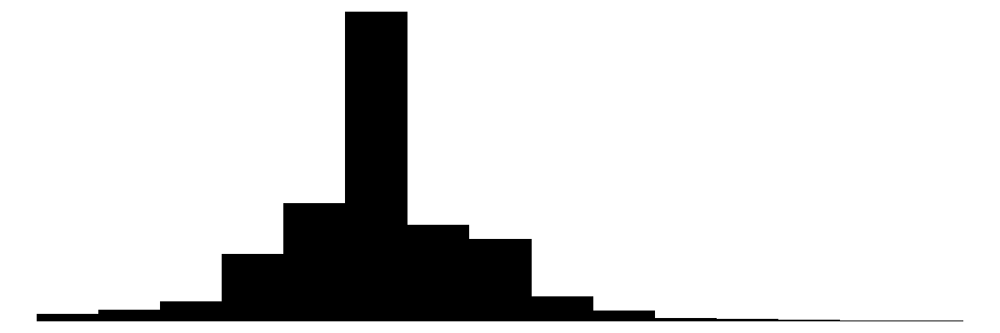</td>
</tr>
<tr>
<td>surv2md1</td>
<td>1522</td>
<td>0</td>
<td>0.6</td>
<td>0.2</td>
<td>0.0</td>
<td>0.6</td>
<td>1.0</td>
<td></td>
</tr>
<tr>
<td>das2d3pc</td>
<td>1023</td>
<td>0</td>
<td>20.5</td>
<td>5.3</td>
<td>11.0</td>
<td>19.8</td>
<td>33.0</td>
<td></td>
</tr>
<tr>
<td>aps1</td>
<td>123</td>
<td>0</td>
<td>54.7</td>
<td>20.0</td>
<td>3.0</td>
<td>54.0</td>
<td>147.0</td>
<td></td>
</tr>
<tr>
<td>scoma1</td>
<td>11</td>
<td>0</td>
<td>21.0</td>
<td>30.3</td>
<td>0.0</td>
<td>0.0</td>
<td>100.0</td>
<td></td>
</tr>
<tr>
<td>meanbp1</td>
<td>178</td>
<td>0</td>
<td>78.5</td>
<td>38.0</td>
<td>0.0</td>
<td>63.0</td>
<td>259.0</td>
<td>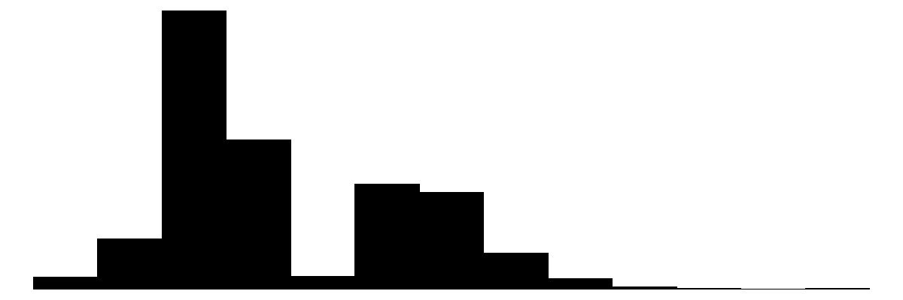</td>
</tr>
<tr>
<td>wblc1</td>
<td>520</td>
<td>0</td>
<td>15.6</td>
<td>11.9</td>
<td>0.0</td>
<td>14.1</td>
<td>192.0</td>
<td></td>
</tr>
<tr>
<td>hrt1</td>
<td>189</td>
<td>0</td>
<td>115.2</td>
<td>41.2</td>
<td>0.0</td>
<td>124.0</td>
<td>250.0</td>
<td>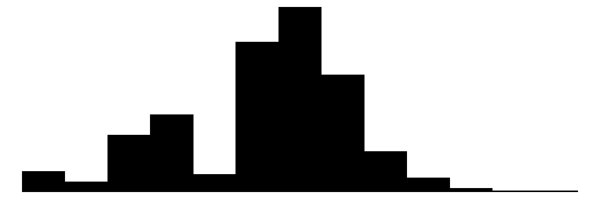</td>
</tr>
<tr>
<td>resp1</td>
<td>72</td>
<td>0</td>
<td>28.1</td>
<td>14.1</td>
<td>0.0</td>
<td>30.0</td>
<td>100.0</td>
<td></td>
</tr>
<tr>
<td>temp1</td>
<td>118</td>
<td>0</td>
<td>37.6</td>
<td>1.8</td>
<td>27.0</td>
<td>38.1</td>
<td>43.0</td>
<td>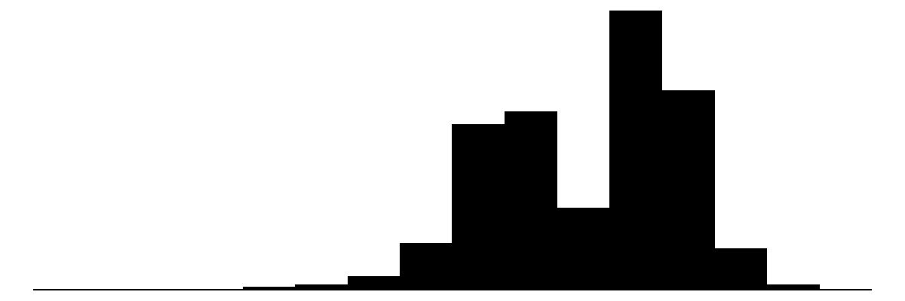</td>
</tr>
<tr>
<td>pafi1</td>
<td>1341</td>
<td>0</td>
<td>222.3</td>
<td>115.0</td>
<td>11.6</td>
<td>202.5</td>
<td>937.5</td>
<td>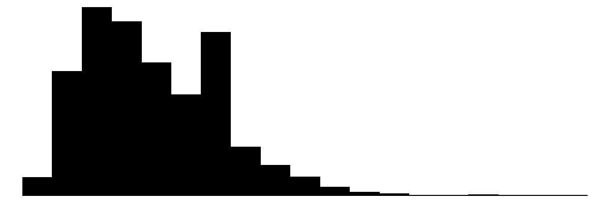</td>
</tr>
<tr>
<td>alb1</td>
<td>57</td>
<td>0</td>
<td>3.1</td>
<td>0.8</td>
<td>0.3</td>
<td>3.5</td>
<td>29.0</td>
<td></td>
</tr>
<tr>
<td>hema1</td>
<td>450</td>
<td>0</td>
<td>31.9</td>
<td>8.4</td>
<td>2.0</td>
<td>30.0</td>
<td>66.2</td>
<td>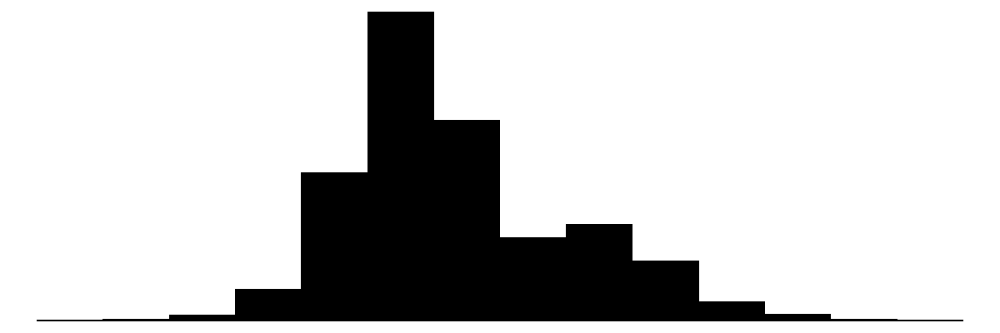</td>
</tr>
<tr>
<td>bili1</td>
<td>266</td>
<td>0</td>
<td>2.3</td>
<td>4.8</td>
<td>0.1</td>
<td>1.0</td>
<td>58.2</td>
<td></td>
</tr>
<tr>
<td>crea1</td>
<td>148</td>
<td>0</td>
<td>2.1</td>
<td>2.1</td>
<td>0.1</td>
<td>1.5</td>
<td>25.1</td>
<td></td>
</tr>
<tr>
<td>sod1</td>
<td>73</td>
<td>0</td>
<td>136.8</td>
<td>7.7</td>
<td>101.0</td>
<td>136.0</td>
<td>178.0</td>
<td>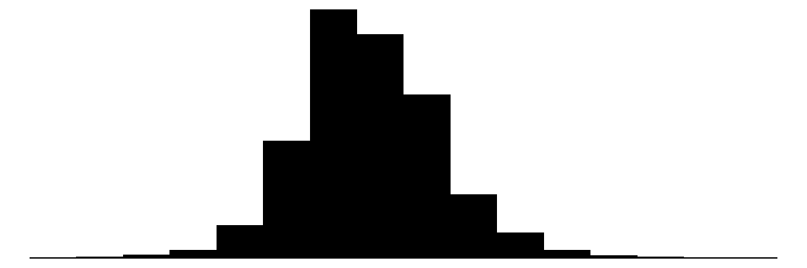</td>
</tr>
<tr>
<td>pot1</td>
<td>81</td>
<td>0</td>
<td>4.1</td>
<td>1.0</td>
<td>1.1</td>
<td>3.8</td>
<td>11.9</td>
<td>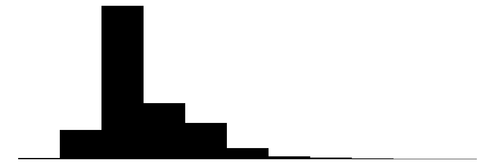</td>
</tr>
<tr>
<td>paco21</td>
<td>266</td>
<td>0</td>
<td>38.8</td>
<td>13.2</td>
<td>1.0</td>
<td>37.0</td>
<td>156.0</td>
<td>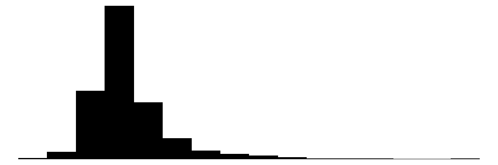</td>
</tr>
<tr>
<td>ph1</td>
<td>96</td>
<td>0</td>
<td>7.4</td>
<td>0.1</td>
<td>6.6</td>
<td>7.4</td>
<td>7.8</td>
<td></td>
</tr>
<tr>
<td>wtkilo1</td>
<td>922</td>
<td>0</td>
<td>67.8</td>
<td>29.1</td>
<td>0.0</td>
<td>70.0</td>
<td>244.0</td>
<td>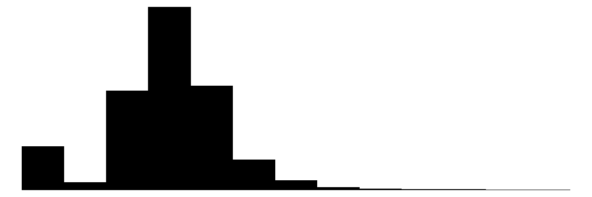</td>
</tr>
<tr>
<td></td>
<td></td>
<td>N</td>
<td>%</td>
<td></td>
<td></td>
<td></td>
<td></td>
<td></td>
</tr>
<tr>
<td>cat1</td>
<td>ARF</td>
<td>2490</td>
<td>43.4</td>
<td></td>
<td></td>
<td></td>
<td></td>
<td></td>
</tr>
<tr>
<td></td>
<td>CHF</td>
<td>224</td>
<td>3.9</td>
<td></td>
<td></td>
<td></td>
<td></td>
<td></td>
</tr>
<tr>
<td></td>
<td>Other</td>
<td>1395</td>
<td>24.3</td>
<td></td>
<td></td>
<td></td>
<td></td>
<td></td>
</tr>
<tr>
<td></td>
<td>MOSF</td>
<td>1625</td>
<td>28.3</td>
<td></td>
<td></td>
<td></td>
<td></td>
<td></td>
</tr>
<tr>
<td>ca</td>
<td>Metastatic</td>
<td>384</td>
<td>6.7</td>
<td></td>
<td></td>
<td></td>
<td></td>
<td></td>
</tr>
<tr>
<td></td>
<td>No</td>
<td>4378</td>
<td>76.4</td>
<td></td>
<td></td>
<td></td>
<td></td>
<td></td>
</tr>
<tr>
<td></td>
<td>Yes</td>
<td>972</td>
<td>17.0</td>
<td></td>
<td></td>
<td></td>
<td></td>
<td></td>
</tr>
<tr>
<td>cardiohx</td>
<td>0</td>
<td>4721</td>
<td>82.3</td>
<td></td>
<td></td>
<td></td>
<td></td>
<td></td>
</tr>
<tr>
<td></td>
<td>1</td>
<td>1013</td>
<td>17.7</td>
<td></td>
<td></td>
<td></td>
<td></td>
<td></td>
</tr>
<tr>
<td>chfhx</td>
<td>0</td>
<td>4713</td>
<td>82.2</td>
<td></td>
<td></td>
<td></td>
<td></td>
<td></td>
</tr>
<tr>
<td></td>
<td>1</td>
<td>1021</td>
<td>17.8</td>
<td></td>
<td></td>
<td></td>
<td></td>
<td></td>
</tr>
<tr>
<td>dementhx</td>
<td>0</td>
<td>5170</td>
<td>90.2</td>
<td></td>
<td></td>
<td></td>
<td></td>
<td></td>
</tr>
<tr>
<td></td>
<td>1</td>
<td>564</td>
<td>9.8</td>
<td></td>
<td></td>
<td></td>
<td></td>
<td></td>
</tr>
<tr>
<td>psychhx</td>
<td>0</td>
<td>5348</td>
<td>93.3</td>
<td></td>
<td></td>
<td></td>
<td></td>
<td></td>
</tr>
<tr>
<td></td>
<td>1</td>
<td>386</td>
<td>6.7</td>
<td></td>
<td></td>
<td></td>
<td></td>
<td></td>
</tr>
<tr>
<td>chrpulhx</td>
<td>0</td>
<td>4646</td>
<td>81.0</td>
<td></td>
<td></td>
<td></td>
<td></td>
<td></td>
</tr>
<tr>
<td></td>
<td>1</td>
<td>1088</td>
<td>19.0</td>
<td></td>
<td></td>
<td></td>
<td></td>
<td></td>
</tr>
<tr>
<td>renalhx</td>
<td>0</td>
<td>5479</td>
<td>95.6</td>
<td></td>
<td></td>
<td></td>
<td></td>
<td></td>
</tr>
<tr>
<td></td>
<td>1</td>
<td>255</td>
<td>4.4</td>
<td></td>
<td></td>
<td></td>
<td></td>
<td></td>
</tr>
<tr>
<td>liverhx</td>
<td>0</td>
<td>5333</td>
<td>93.0</td>
<td></td>
<td></td>
<td></td>
<td></td>
<td></td>
</tr>
<tr>
<td></td>
<td>1</td>
<td>401</td>
<td>7.0</td>
<td></td>
<td></td>
<td></td>
<td></td>
<td></td>
</tr>
<tr>
<td>gibledhx</td>
<td>0</td>
<td>5549</td>
<td>96.8</td>
<td></td>
<td></td>
<td></td>
<td></td>
<td></td>
</tr>
<tr>
<td></td>
<td>1</td>
<td>185</td>
<td>3.2</td>
<td></td>
<td></td>
<td></td>
<td></td>
<td></td>
</tr>
<tr>
<td>malighx</td>
<td>0</td>
<td>4418</td>
<td>77.0</td>
<td></td>
<td></td>
<td></td>
<td></td>
<td></td>
</tr>
<tr>
<td></td>
<td>1</td>
<td>1316</td>
<td>23.0</td>
<td></td>
<td></td>
<td></td>
<td></td>
<td></td>
</tr>
<tr>
<td>immunhx</td>
<td>0</td>
<td>4192</td>
<td>73.1</td>
<td></td>
<td></td>
<td></td>
<td></td>
<td></td>
</tr>
<tr>
<td></td>
<td>1</td>
<td>1542</td>
<td>26.9</td>
<td></td>
<td></td>
<td></td>
<td></td>
<td></td>
</tr>
<tr>
<td>transhx</td>
<td>0</td>
<td>5073</td>
<td>88.5</td>
<td></td>
<td></td>
<td></td>
<td></td>
<td></td>
</tr>
<tr>
<td></td>
<td>1</td>
<td>661</td>
<td>11.5</td>
<td></td>
<td></td>
<td></td>
<td></td>
<td></td>
</tr>
<tr>
<td>amihx</td>
<td>0</td>
<td>5534</td>
<td>96.5</td>
<td></td>
<td></td>
<td></td>
<td></td>
<td></td>
</tr>
<tr>
<td></td>
<td>1</td>
<td>200</td>
<td>3.5</td>
<td></td>
<td></td>
<td></td>
<td></td>
<td></td>
</tr>
<tr>
<td>sex</td>
<td>Female</td>
<td>2542</td>
<td>44.3</td>
<td></td>
<td></td>
<td></td>
<td></td>
<td></td>
</tr>
<tr>
<td></td>
<td>Male</td>
<td>3192</td>
<td>55.7</td>
<td></td>
<td></td>
<td></td>
<td></td>
<td></td>
</tr>
<tr>
<td>dnr1</td>
<td>No</td>
<td>5080</td>
<td>88.6</td>
<td></td>
<td></td>
<td></td>
<td></td>
<td></td>
</tr>
<tr>
<td></td>
<td>Yes</td>
<td>654</td>
<td>11.4</td>
<td></td>
<td></td>
<td></td>
<td></td>
<td></td>
</tr>
<tr>
<td>ninsclas</td>
<td>Medicaid</td>
<td>647</td>
<td>11.3</td>
<td></td>
<td></td>
<td></td>
<td></td>
<td></td>
</tr>
<tr>
<td></td>
<td>Medicare</td>
<td>1458</td>
<td>25.4</td>
<td></td>
<td></td>
<td></td>
<td></td>
<td></td>
</tr>
<tr>
<td></td>
<td>Medicare &amp; Medicaid</td>
<td>374</td>
<td>6.5</td>
<td></td>
<td></td>
<td></td>
<td></td>
<td></td>
</tr>
<tr>
<td></td>
<td>No insurance</td>
<td>322</td>
<td>5.6</td>
<td></td>
<td></td>
<td></td>
<td></td>
<td></td>
</tr>
<tr>
<td></td>
<td>Private</td>
<td>1697</td>
<td>29.6</td>
<td></td>
<td></td>
<td></td>
<td></td>
<td></td>
</tr>
<tr>
<td></td>
<td>Private &amp; Medicare</td>
<td>1236</td>
<td>21.6</td>
<td></td>
<td></td>
<td></td>
<td></td>
<td></td>
</tr>
<tr>
<td>resp</td>
<td>No</td>
<td>3621</td>
<td>63.1</td>
<td></td>
<td></td>
<td></td>
<td></td>
<td></td>
</tr>
<tr>
<td></td>
<td>Yes</td>
<td>2113</td>
<td>36.9</td>
<td></td>
<td></td>
<td></td>
<td></td>
<td></td>
</tr>
<tr>
<td>card</td>
<td>No</td>
<td>3803</td>
<td>66.3</td>
<td></td>
<td></td>
<td></td>
<td></td>
<td></td>
</tr>
<tr>
<td></td>
<td>Yes</td>
<td>1931</td>
<td>33.7</td>
<td></td>
<td></td>
<td></td>
<td></td>
<td></td>
</tr>
<tr>
<td>neuro</td>
<td>No</td>
<td>5041</td>
<td>87.9</td>
<td></td>
<td></td>
<td></td>
<td></td>
<td></td>
</tr>
<tr>
<td></td>
<td>Yes</td>
<td>693</td>
<td>12.1</td>
<td></td>
<td></td>
<td></td>
<td></td>
<td></td>
</tr>
<tr>
<td>gastr</td>
<td>No</td>
<td>4793</td>
<td>83.6</td>
<td></td>
<td></td>
<td></td>
<td></td>
<td></td>
</tr>
<tr>
<td></td>
<td>Yes</td>
<td>941</td>
<td>16.4</td>
<td></td>
<td></td>
<td></td>
<td></td>
<td></td>
</tr>
<tr>
<td>renal</td>
<td>No</td>
<td>5439</td>
<td>94.9</td>
<td></td>
<td></td>
<td></td>
<td></td>
<td></td>
</tr>
<tr>
<td></td>
<td>Yes</td>
<td>295</td>
<td>5.1</td>
<td></td>
<td></td>
<td></td>
<td></td>
<td></td>
</tr>
<tr>
<td>meta</td>
<td>No</td>
<td>5469</td>
<td>95.4</td>
<td></td>
<td></td>
<td></td>
<td></td>
<td></td>
</tr>
<tr>
<td></td>
<td>Yes</td>
<td>265</td>
<td>4.6</td>
<td></td>
<td></td>
<td></td>
<td></td>
<td></td>
</tr>
<tr>
<td>hema</td>
<td>No</td>
<td>5380</td>
<td>93.8</td>
<td></td>
<td></td>
<td></td>
<td></td>
<td></td>
</tr>
<tr>
<td></td>
<td>Yes</td>
<td>354</td>
<td>6.2</td>
<td></td>
<td></td>
<td></td>
<td></td>
<td></td>
</tr>
<tr>
<td>seps</td>
<td>No</td>
<td>4703</td>
<td>82.0</td>
<td></td>
<td></td>
<td></td>
<td></td>
<td></td>
</tr>
<tr>
<td></td>
<td>Yes</td>
<td>1031</td>
<td>18.0</td>
<td></td>
<td></td>
<td></td>
<td></td>
<td></td>
</tr>
<tr>
<td>trauma</td>
<td>No</td>
<td>5682</td>
<td>99.1</td>
<td></td>
<td></td>
<td></td>
<td></td>
<td></td>
</tr>
<tr>
<td></td>
<td>Yes</td>
<td>52</td>
<td>0.9</td>
<td></td>
<td></td>
<td></td>
<td></td>
<td></td>
</tr>
<tr>
<td>ortho</td>
<td>No</td>
<td>5727</td>
<td>99.9</td>
<td></td>
<td></td>
<td></td>
<td></td>
<td></td>
</tr>
<tr>
<td></td>
<td>Yes</td>
<td>7</td>
<td>0.1</td>
<td></td>
<td></td>
<td></td>
<td></td>
<td></td>
</tr>
<tr>
<td>race</td>
<td>white</td>
<td>4459</td>
<td>77.8</td>
<td></td>
<td></td>
<td></td>
<td></td>
<td></td>
</tr>
<tr>
<td></td>
<td>black</td>
<td>920</td>
<td>16.0</td>
<td></td>
<td></td>
<td></td>
<td></td>
<td></td>
</tr>
<tr>
<td></td>
<td>other</td>
<td>355</td>
<td>6.2</td>
<td></td>
<td></td>
<td></td>
<td></td>
<td></td>
</tr>
<tr>
<td>income</td>
<td>Under $11k</td>
<td>3226</td>
<td>56.3</td>
<td></td>
<td></td>
<td></td>
<td></td>
<td></td>
</tr>
<tr>
<td></td>
<td>$11-$25k</td>
<td>1165</td>
<td>20.3</td>
<td></td>
<td></td>
<td></td>
<td></td>
<td></td>
</tr>
<tr>
<td></td>
<td>$25-$50k</td>
<td>892</td>
<td>15.6</td>
<td></td>
<td></td>
<td></td>
<td></td>
<td></td>
</tr>
<tr>
<td></td>
<td><blockquote>
<p>$50k</p>
</blockquote></td>
<td>451</td>
<td>7.9</td>
<td></td>
<td></td>
<td></td>
<td></td>
<td></td>
</tr>
<tr>
<td>Tr</td>
<td>0</td>
<td>3551</td>
<td>61.9</td>
<td></td>
<td></td>
<td></td>
<td></td>
<td></td>
</tr>
<tr>
<td></td>
<td>1</td>
<td>2183</td>
<td>38.1</td>
<td></td>
<td></td>
<td></td>
<td></td>
<td></td>
</tr>
</tbody>
</table>

Let’s perform a naive estimate of our ATE.

``` r
ate_naive_model <- lm(Y ~ Tr, data = rhc)
summary(ate_naive_model)
```

    ## 
    ## Call:
    ## lm(formula = Y ~ Tr, data = rhc)
    ## 
    ## Residuals:
    ##    Min     1Q Median     3Q    Max 
    ## -22.69 -13.53  -7.53   4.31 318.47 
    ## 
    ## Coefficients:
    ##             Estimate Std. Error t value Pr(>|t|)    
    ## (Intercept)  19.5291     0.4242  46.042  < 2e-16 ***
    ## Tr1           5.1621     0.6874   7.509 6.86e-14 ***
    ## ---
    ## Signif. codes:  0 '***' 0.001 '**' 0.01 '*' 0.05 '.' 0.1 ' ' 1
    ## 
    ## Residual standard error: 25.28 on 5732 degrees of freedom
    ## Multiple R-squared:  0.009742,   Adjusted R-squared:  0.009569 
    ## F-statistic: 56.39 on 1 and 5732 DF,  p-value: 6.857e-14

We will recompute the standard error to get a more accurate estimate. We
will not use bootstrap in this part since it would take too long for the
estimators we will use later.

``` r
library(sandwich)
library(lmtest)

result <- coeftest(ate_naive_model, vcov = sandwich::vcovHC(ate_naive_model, type = "HC0"))[2,c(1,2)]
names(result) <- c('naive ATE estimator', 'sd')
result
```

    ## naive ATE estimator                  sd 
    ##           5.1621039           0.7145751

## Propensity Scores

We will start with estimators based on weighting that we already know,
based on propensity scores.

``` r
prop_scores_model_ATE <- weightit(Tr ~ . - Y, data = rhc, method = "glm", estimand = "ATE")
summary(prop_scores_model_ATE)
```

    ##                   Summary of weights
    ## 
    ## - Weight ranges:
    ## 
    ##           Min                                  Max
    ## treated 1.029 |---------------------------| 35.855
    ## control 1.004 |-----------------|           23.558
    ## 
    ## - Units with the 5 most extreme weights by group:
    ##                                            
    ##             742   3828   4131   1905   4890
    ##  treated 18.112 20.131 25.043 25.109 35.855
    ##            1788   4007   1000   2174    505
    ##  control 16.098  16.78 18.414 18.672 23.558
    ## 
    ## - Weight statistics:
    ## 
    ##         Coef of Var   MAD Entropy # Zeros
    ## treated       0.878 0.509   0.236       0
    ## control       0.675 0.343   0.127       0
    ## 
    ## - Effective Sample Sizes:
    ## 
    ##            Control Treated
    ## Unweighted 3551.   2183.  
    ## Weighted   2440.49 1233.22

``` r
library(rms)
val.prob(prop_scores_model_ATE$ps,as.numeric(rhc$Tr)-1)
```

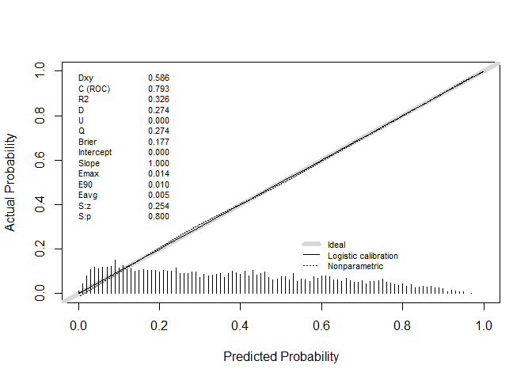<!-- -->

    ##           Dxy       C (ROC)            R2             D      D:Chi-sq 
    ##  5.863458e-01  7.931729e-01  3.258399e-01  2.736852e-01  1.570311e+03 
    ##           D:p             U      U:Chi-sq           U:p             Q 
    ##  0.000000e+00 -3.487967e-04 -7.275958e-12  1.000000e+00  2.740340e-01 
    ##         Brier     Intercept         Slope          Emax           E90 
    ##  1.774952e-01 -1.329053e-09  1.000000e+00  1.383262e-02  1.033442e-02 
    ##          Eavg           S:z           S:p 
    ##  5.270832e-03  2.535543e-01  7.998399e-01

``` r
library(DHARMa)
prop_scores_model_reg <- glm(Tr ~ . - Y, family = binomial, data = rhc)
simulationOutput <- simulateResiduals(fittedModel = prop_scores_model_reg)
plot(simulationOutput)
```

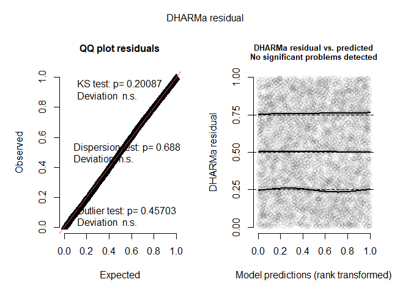<!-- -->

The propensity scores model seems reasonably specified and is clearly
discriminative; thus, we can expect that the naive ATE estimate is
biased. Let us check the overlap.

``` r
bal.plot(prop_scores_model_ATE, var.name = "prop.score", which = "un", type = "density")
```

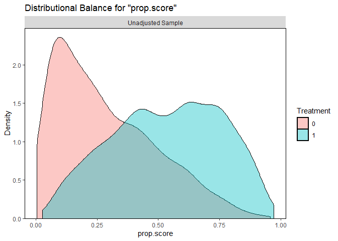<!-- -->

We have a reasonable overlap between the treatment and control groups;
hence, we should be able to obtain a reasonable estimate of ATE with
respect to the observed covariates. Let us check the balance of
covariates in terms of adjusted means.

``` r
bal.tab(prop_scores_model_ATE, continuous = 'std', binary = 'raw', un = TRUE)
```

    ## Balance Measures
    ##                                  Type Diff.Un Diff.Adj
    ## prop.score                   Distance  1.1683   0.0328
    ## cat1_ARF                       Binary -0.0288   0.0156
    ## cat1_CHF                       Binary -0.0268  -0.0021
    ## cat1_Other                     Binary -0.1206  -0.0240
    ## cat1_MOSF                      Binary  0.1763   0.0106
    ## ca_Metastatic                  Binary -0.0172  -0.0019
    ## ca_No                          Binary  0.0438  -0.0066
    ## ca_Yes                         Binary -0.0267   0.0086
    ## cardiohx                       Binary  0.0446   0.0029
    ## chfhx                          Binary  0.0268   0.0001
    ## dementhx                       Binary -0.0471  -0.0147
    ## psychhx                        Binary -0.0347  -0.0035
    ## chrpulhx                       Binary -0.0741  -0.0112
    ## renalhx                        Binary  0.0066   0.0027
    ## liverhx                        Binary -0.0123   0.0011
    ## gibledhx                       Binary -0.0122  -0.0016
    ## malighx                        Binary -0.0422   0.0065
    ## immunhx                        Binary  0.0355  -0.0024
    ## transhx                        Binary  0.0550   0.0079
    ## amihx                          Binary  0.0139   0.0008
    ## age                           Contin. -0.0610  -0.0081
    ## sex_Male                       Binary  0.0464   0.0114
    ## edu                           Contin.  0.0916   0.0151
    ## surv2md1                      Contin. -0.1990  -0.0081
    ## das2d3pc                      Contin.  0.0630   0.0315
    ## aps1                          Contin.  0.5014   0.0257
    ## scoma1                        Contin. -0.1101  -0.0112
    ## meanbp1                       Contin. -0.4550  -0.0082
    ## wblc1                         Contin.  0.0840   0.0624
    ## hrt1                          Contin.  0.1467   0.0398
    ## resp1                         Contin. -0.1656   0.0223
    ## temp1                         Contin. -0.0219   0.0140
    ## pafi1                         Contin. -0.4338  -0.0119
    ## alb1                          Contin. -0.2290   0.0156
    ## hema1                         Contin. -0.2690  -0.0345
    ## bili1                         Contin.  0.1447  -0.0070
    ## crea1                         Contin.  0.2698   0.0210
    ## sod1                          Contin. -0.0930  -0.0194
    ## pot1                          Contin. -0.0270  -0.0211
    ## paco21                        Contin. -0.2482  -0.0174
    ## ph1                           Contin. -0.1196   0.0175
    ## wtkilo1                       Contin.  0.2554   0.0205
    ## dnr1_Yes                       Binary -0.0695  -0.0084
    ## ninsclas_Medicaid              Binary -0.0394  -0.0017
    ## ninsclas_Medicare              Binary -0.0326  -0.0174
    ## ninsclas_Medicare & Medicaid   Binary -0.0143   0.0038
    ## ninsclas_No insurance          Binary  0.0099   0.0022
    ## ninsclas_Private               Binary  0.0621   0.0075
    ## ninsclas_Private & Medicare    Binary  0.0144   0.0055
    ## resp_Yes                       Binary -0.1276  -0.0070
    ## card_Yes                       Binary  0.1397   0.0052
    ## neuro_Yes                      Binary -0.1079  -0.0111
    ## gastr_Yes                      Binary  0.0449  -0.0006
    ## renal_Yes                      Binary  0.0264   0.0032
    ## meta_Yes                       Binary -0.0058   0.0008
    ## hema_Yes                       Binary -0.0146   0.0034
    ## seps_Yes                       Binary  0.0913   0.0101
    ## trauma_Yes                     Binary  0.0105   0.0010
    ## ortho_Yes                      Binary  0.0010   0.0002
    ## race_white                     Binary  0.0062  -0.0002
    ## race_black                     Binary -0.0113   0.0021
    ## race_other                     Binary  0.0051  -0.0019
    ## income_Under $11k              Binary -0.0615  -0.0012
    ## income_$11-$25k                Binary  0.0063  -0.0063
    ## income_$25-$50k                Binary  0.0388   0.0045
    ## income_> $50k                  Binary  0.0165   0.0030
    ## 
    ## Effective sample sizes
    ##            Control Treated
    ## Unadjusted 3551.   2183.  
    ## Adjusted   2440.49 1233.22

We see that propensity scores improved the balance as expected. We can
illustrate this visually using a *love.plot*.

``` r
love.plot(prop_scores_model_ATE, thresholds = c(m = .05), abs = TRUE, var.order = "unadjusted") + theme(axis.text.y = element_text(size = 5))
```

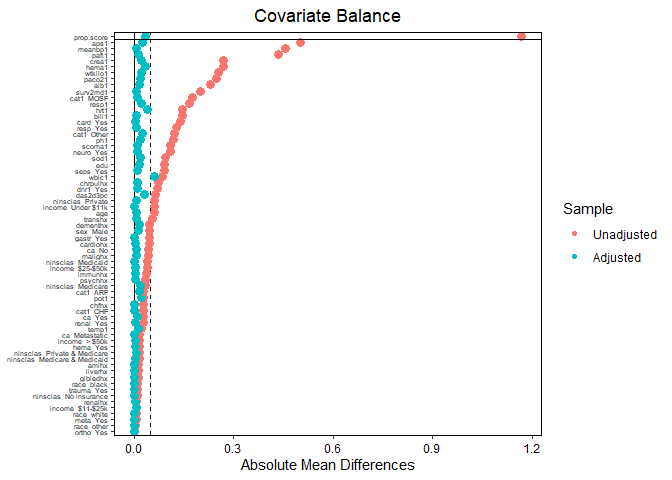<!-- -->

Let us estimate ATE using the IPW estimator.

``` r
outcome_model_ipw <- lm_weightit(Y ~ Tr, data = rhc, weightit = prop_scores_model_ATE)
summary(outcome_model_ipw)
```

    ## 
    ## Call:
    ## lm_weightit(formula = Y ~ Tr, data = rhc, weightit = prop_scores_model_ATE)
    ## 
    ## Coefficients:
    ##             Estimate Std. Error z value Pr(>|z|)    
    ## (Intercept)  20.7776     0.5606  37.064  < 1e-06 ***
    ## Tr1           2.8583     0.8554   3.341 0.000833 ***
    ## Standard error: HC0 robust (adjusted for estimation of weights)

We notice that *lm_weightit* adjusts the standard errors for lm_weightit
(using M-estimation,
<https://ngreifer.github.io/WeightIt/reference/glm_weightit.html>). This
will *not* be true for every method going forward.

``` r
result <- rbind(
  coeftest(ate_naive_model, vcov = sandwich::vcovHC(ate_naive_model, type = "HC0"))[2,c(1,2)],
  c(outcome_model_ipw$coefficients[2],summary(outcome_model_ipw)$coefficients[2,2])
)
  
colnames(result) <- c('Estimator', 'sd')
rownames(result) <- c('naive ATE', 'IPW ATE')
result
```

    ##           Estimator        sd
    ## naive ATE  5.162104 0.7145751
    ## IPW ATE    2.858327 0.8554132

The naive ATE is likely to be noticeably biased. The inverse propensity
score weighting improved balance, but even in covariate means there are
still some imbalances, suggesting that there could be some remaining
selection bias. So, let’s move to other methods.

## Average Treatment Effect for the Overlap Population

We already discussed the average treatment effect for the overlap
population (ATO) in Part Ten. The overlap population is, roughly
speaking, the set of individuals for whom the propensity score model
predicts a treatment assignment close to 0.5. The reason ATO is used is
that inverse propensity score weighting achieves the exact mean balance.
The corresponding IPW ATO estimator also has minimum variance among all
Hájek estimators (provided that the variance of the potential outcomes
is homoscedastic) (Zubizarreta et al. 2023)
``` math
 \hat\tau^\text{Hájek} = \frac{\sum_{i=1}^n w_1(X_i)T_iY_i}{\sum_{i=1}^nw_1(X_i)T_i} - \frac{\sum_{i=1}^n w_0(X_i)(1-T_i)Y_i}{\sum_{i=1}^n w_0(X_i)(1-T_i)}
```
We can obtain ATO weights ($`w_1(X_i) = 1 - \hat e(X_i)`$ and
$`w_0(X_i) = \hat e(X_i)`$) as follows.

``` r
prop_scores_model_ATO <- weightit(Tr ~ . - Y, data = rhc, method = "glm", estimand = "ATO")
summary(prop_scores_model_ATO)
```

    ##                   Summary of weights
    ## 
    ## - Weight ranges:
    ## 
    ##           Min                                 Max
    ## treated 0.028  |--------------------------| 0.972
    ## control 0.004 |---------------------------| 0.958
    ## 
    ## - Units with the 5 most extreme weights by group:
    ##                                      
    ##            742 3828  4131  1905  4890
    ##  treated 0.945 0.95  0.96  0.96 0.972
    ##           1788 4007  1000  2174   505
    ##  control 0.938 0.94 0.946 0.946 0.958
    ## 
    ## - Weight statistics:
    ## 
    ##         Coef of Var   MAD Entropy # Zeros
    ## treated       0.475 0.403   0.12        0
    ## control       0.712 0.592   0.255       0
    ## 
    ## - Effective Sample Sizes:
    ## 
    ##            Control Treated
    ## Unweighted 3551.   2183.  
    ## Weighted   2355.92 1780.96

``` r
bal.tab(prop_scores_model_ATO, continuous = 'std', binary = 'raw', un = TRUE)
```

    ## Balance Measures
    ##                                  Type Diff.Un Diff.Adj
    ## prop.score                   Distance  1.2098  -0.0084
    ## cat1_ARF                       Binary -0.0288   0.0000
    ## cat1_CHF                       Binary -0.0268   0.0000
    ## cat1_Other                     Binary -0.1206  -0.0000
    ## cat1_MOSF                      Binary  0.1763   0.0000
    ## ca_Metastatic                  Binary -0.0172  -0.0000
    ## ca_No                          Binary  0.0438  -0.0000
    ## ca_Yes                         Binary -0.0267   0.0000
    ## cardiohx                       Binary  0.0446   0.0000
    ## chfhx                          Binary  0.0268   0.0000
    ## dementhx                       Binary -0.0471  -0.0000
    ## psychhx                        Binary -0.0347  -0.0000
    ## chrpulhx                       Binary -0.0741  -0.0000
    ## renalhx                        Binary  0.0066   0.0000
    ## liverhx                        Binary -0.0123   0.0000
    ## gibledhx                       Binary -0.0122   0.0000
    ## malighx                        Binary -0.0422   0.0000
    ## immunhx                        Binary  0.0355   0.0000
    ## transhx                        Binary  0.0550   0.0000
    ## amihx                          Binary  0.0139   0.0000
    ## age                           Contin. -0.0611  -0.0000
    ## sex_Male                       Binary  0.0464   0.0000
    ## edu                           Contin.  0.0925   0.0000
    ## surv2md1                      Contin. -0.1948  -0.0000
    ## das2d3pc                      Contin.  0.0632   0.0000
    ## aps1                          Contin.  0.4955   0.0000
    ## scoma1                        Contin. -0.1126  -0.0000
    ## meanbp1                       Contin. -0.4613  -0.0000
    ## wblc1                         Contin.  0.0804   0.0000
    ## hrt1                          Contin.  0.1455   0.0000
    ## resp1                         Contin. -0.1659  -0.0000
    ## temp1                         Contin. -0.0217  -0.0000
    ## pafi1                         Contin. -0.4433  -0.0000
    ## alb1                          Contin. -0.2073  -0.0000
    ## hema1                         Contin. -0.2749  -0.0000
    ## bili1                         Contin.  0.1366   0.0000
    ## crea1                         Contin.  0.2577   0.0000
    ## sod1                          Contin. -0.0941  -0.0000
    ## pot1                          Contin. -0.0271  -0.0000
    ## paco21                        Contin. -0.2698  -0.0000
    ## ph1                           Contin. -0.1195  -0.0000
    ## wtkilo1                       Contin.  0.2672   0.0000
    ## dnr1_Yes                       Binary -0.0695  -0.0000
    ## ninsclas_Medicaid              Binary -0.0394  -0.0000
    ## ninsclas_Medicare              Binary -0.0326  -0.0000
    ## ninsclas_Medicare & Medicaid   Binary -0.0143  -0.0000
    ## ninsclas_No insurance          Binary  0.0099   0.0000
    ## ninsclas_Private               Binary  0.0621   0.0000
    ## ninsclas_Private & Medicare    Binary  0.0144   0.0000
    ## resp_Yes                       Binary -0.1276  -0.0000
    ## card_Yes                       Binary  0.1397   0.0000
    ## neuro_Yes                      Binary -0.1079  -0.0000
    ## gastr_Yes                      Binary  0.0449   0.0000
    ## renal_Yes                      Binary  0.0264   0.0000
    ## meta_Yes                       Binary -0.0058   0.0000
    ## hema_Yes                       Binary -0.0146   0.0000
    ## seps_Yes                       Binary  0.0913   0.0000
    ## trauma_Yes                     Binary  0.0105   0.0000
    ## ortho_Yes                      Binary  0.0010  -0.0000
    ## race_white                     Binary  0.0062   0.0000
    ## race_black                     Binary -0.0113  -0.0000
    ## race_other                     Binary  0.0051   0.0000
    ## income_Under $11k              Binary -0.0615  -0.0000
    ## income_$11-$25k                Binary  0.0063   0.0000
    ## income_$25-$50k                Binary  0.0388   0.0000
    ## income_> $50k                  Binary  0.0165   0.0000
    ## 
    ## Effective sample sizes
    ##            Control Treated
    ## Unadjusted 3551.   2183.  
    ## Adjusted   2355.92 1780.96

Indeed, we observe that the balance in means is exact.

``` r
love.plot(prop_scores_model_ATO, thresholds = c(m = .05), abs = TRUE, var.order = "unadjusted") + theme(axis.text.y = element_text(size = 5))
```

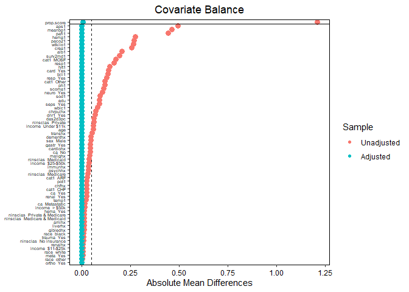<!-- -->

The estimator is as follows.

``` r
outcome_model_ipw_ATO <- lm_weightit(Y ~ Tr, data = rhc, weightit = prop_scores_model_ATO)

result <- rbind(
  coeftest(ate_naive_model, vcov = sandwich::vcovHC(ate_naive_model, type = "HC0"))[2,c(1,2)],
  c(outcome_model_ipw$coefficients[2],summary(outcome_model_ipw)$coefficients[2,2]),
  c(outcome_model_ipw_ATO$coefficients[2],summary(outcome_model_ipw_ATO)$coefficients[2,2])
)
  
colnames(result) <- c('Estimator', 'sd')
rownames(result) <- c('naive ATE', 'IPW ATE', 'IPW ATO')
result
```

    ##           Estimator        sd
    ## naive ATE  5.162104 0.7145751
    ## IPW ATE    2.858327 0.8554132
    ## IPW ATO    2.643477 0.8093111

However, we should stop here because ATO is not ATE unless the treatment
is homogeneous. In addition, exact balance of means does not guarantee
balance in higher moments.

``` r
bal.tab(prop_scores_model_ATO, stats = c("m", "v"))
```

    ## Balance Measures
    ##                                  Type Diff.Adj V.Ratio.Adj
    ## prop.score                   Distance  -0.0084      0.9812
    ## cat1_ARF                       Binary   0.0000           .
    ## cat1_CHF                       Binary   0.0000           .
    ## cat1_Other                     Binary  -0.0000           .
    ## cat1_MOSF                      Binary   0.0000           .
    ## ca_Metastatic                  Binary  -0.0000           .
    ## ca_No                          Binary  -0.0000           .
    ## ca_Yes                         Binary   0.0000           .
    ## cardiohx                       Binary   0.0000           .
    ## chfhx                          Binary   0.0000           .
    ## dementhx                       Binary  -0.0000           .
    ## psychhx                        Binary  -0.0000           .
    ## chrpulhx                       Binary  -0.0000           .
    ## renalhx                        Binary   0.0000           .
    ## liverhx                        Binary   0.0000           .
    ## gibledhx                       Binary   0.0000           .
    ## malighx                        Binary   0.0000           .
    ## immunhx                        Binary   0.0000           .
    ## transhx                        Binary   0.0000           .
    ## amihx                          Binary   0.0000           .
    ## age                           Contin.  -0.0000      0.8363
    ## sex_Male                       Binary   0.0000           .
    ## edu                           Contin.   0.0000      0.9415
    ## surv2md1                      Contin.  -0.0000      0.9615
    ## das2d3pc                      Contin.   0.0000      0.8454
    ## aps1                          Contin.   0.0000      1.0202
    ## scoma1                        Contin.  -0.0000      0.9477
    ## meanbp1                       Contin.  -0.0000      1.0165
    ## wblc1                         Contin.   0.0000      1.1591
    ## hrt1                          Contin.   0.0000      0.9023
    ## resp1                         Contin.  -0.0000      1.0315
    ## temp1                         Contin.  -0.0000      0.8719
    ## pafi1                         Contin.  -0.0000      1.0327
    ## alb1                          Contin.  -0.0000      2.2493
    ## hema1                         Contin.  -0.0000      0.8592
    ## bili1                         Contin.   0.0000      0.8752
    ## crea1                         Contin.   0.0000      0.7076
    ## sod1                          Contin.  -0.0000      0.8910
    ## pot1                          Contin.  -0.0000      0.9095
    ## paco21                        Contin.  -0.0000      1.1357
    ## ph1                           Contin.  -0.0000      1.0034
    ## wtkilo1                       Contin.   0.0000      1.0475
    ## dnr1_Yes                       Binary  -0.0000           .
    ## ninsclas_Medicaid              Binary  -0.0000           .
    ## ninsclas_Medicare              Binary  -0.0000           .
    ## ninsclas_Medicare & Medicaid   Binary  -0.0000           .
    ## ninsclas_No insurance          Binary   0.0000           .
    ## ninsclas_Private               Binary   0.0000           .
    ## ninsclas_Private & Medicare    Binary   0.0000           .
    ## resp_Yes                       Binary  -0.0000           .
    ## card_Yes                       Binary   0.0000           .
    ## neuro_Yes                      Binary  -0.0000           .
    ## gastr_Yes                      Binary   0.0000           .
    ## renal_Yes                      Binary   0.0000           .
    ## meta_Yes                       Binary   0.0000           .
    ## hema_Yes                       Binary   0.0000           .
    ## seps_Yes                       Binary   0.0000           .
    ## trauma_Yes                     Binary   0.0000           .
    ## ortho_Yes                      Binary  -0.0000           .
    ## race_white                     Binary   0.0000           .
    ## race_black                     Binary  -0.0000           .
    ## race_other                     Binary   0.0000           .
    ## income_Under $11k              Binary  -0.0000           .
    ## income_$11-$25k                Binary   0.0000           .
    ## income_$25-$50k                Binary   0.0000           .
    ## income_> $50k                  Binary   0.0000           .
    ## 
    ## Effective sample sizes
    ##            Control Treated
    ## Unadjusted 3551.   2183.  
    ## Adjusted   2355.92 1780.96

We see that the variance ratios for continuous variables are clearly not
1.

## Covariate Balancing Propensity Score

As we discussed in the introduction, propensity scores are probabilities
of treatment assignment, $`e(X_i) = P[T_1 = 1 \mid X_i]`$, and thus
estimating them does not explicitly require covariate balance. Covariate
balancing propensity scores (CBPS) proposed in (Imai and Ratkovic 2014)
are modified propensity scores such that covariate balance between the
treatment and control groups is and additional contsraint during
estimation.

This is achieved by augmenting maximization of the likelihood with
additional balancing constraints (Zubizarreta et al. 2023)
``` math
\sum_{i=1}^n\left(\frac{T_i}{\hat e(X_i, \beta)} - \frac{1-T_i}{1-\hat e(X_i, \beta)}\right)f(X_i) = 0,
```
where $`f(X_i)`$ is a function of the covariates we wish to balance
(e.g., low-order moments covariates or their interactions).
Interestingly, if we select
$`f(X_i) = \partial \hat e(X_i, \beta)/\partial \beta`$, we get the
scoring equations, i.e., the first-order conditions of optimality for
parameters $`\beta`$ ((Zubizarreta et al. 2023) and
<https://ngreifer.github.io/blog/logistic-regression-cbps-overlap-weights/>).
For ATT, the balancing conditions are
``` math
\sum_{i=1}^n\left(T_i - \frac{\hat e(X_i, \beta)(1-T_i)}{1-\hat e(X_i, \beta)}\right)f(X_i) = 0,
```
. The balancing constraints are then added to the scoring equations.
Now, there are more constraints than parameters $`\beta`$ (the system is
*over-identified*), so there will be no exact solution. However, this
system can be solved for $`\beta`$ approximately by the generalized
method of moments
(<https://en.wikipedia.org/wiki/Generalized_method_of_moments>), which
minimizes a weighted sum of the moment constraints
``` math
g(X, \beta)^TWg(X, \beta),
```
where $`g(X, \beta) = 0`$ are the moment constraints and where $`W`$ are
suitably chosen weights (the solution $`\hat\beta_\text{GMM}`$ is
asymptotically efficient if $`W`$ equals the covariance matrix of the
moment constraints; these weights are estimated from the data in
practice).

We can obtain CBPS weights by setting *method = “cbps”*. We have to set
*over = true* to enforce the over-identified fit (i.e., the fit-scoring
equations and the moment constraints). By default, we put the
restriction on the first moments, i.e., covariates’ means.

``` r
prop_scores_model_cbps <- weightit(Tr ~ . - Y, data = rhc, method = "cbps", estimand = "ATE", over = TRUE)
summary(prop_scores_model_cbps)
```

    ##                   Summary of weights
    ## 
    ## - Weight ranges:
    ## 
    ##           Min                                  Max
    ## treated 1.04  |---------------------------| 30.767
    ## control 1.006 |---------------|             18.323
    ## 
    ## - Units with the 5 most extreme weights by group:
    ##                                            
    ##             742   4131   3828   1905   4890
    ##  treated 16.342 16.431 17.321 20.298 30.767
    ##            1788   4007   1000   2174    505
    ##  control 12.364 12.905 13.879 17.384 18.323
    ## 
    ## - Weight statistics:
    ## 
    ##         Coef of Var   MAD Entropy # Zeros
    ## treated       0.776 0.47    0.198       0
    ## control       0.586 0.321   0.106       0
    ## 
    ## - Effective Sample Sizes:
    ## 
    ##            Control Treated
    ## Unweighted 3551.    2183. 
    ## Weighted   2643.83  1362.7

We can check the balance in means.

``` r
bal.tab(prop_scores_model_cbps, continuous = 'std', binary = 'raw', un = TRUE)
```

    ## Balance Measures
    ##                                  Type Diff.Un Diff.Adj
    ## prop.score                   Distance  1.1678   0.1202
    ## cat1_ARF                       Binary -0.0288   0.0124
    ## cat1_CHF                       Binary -0.0268  -0.0039
    ## cat1_Other                     Binary -0.1206  -0.0279
    ## cat1_MOSF                      Binary  0.1763   0.0195
    ## ca_Metastatic                  Binary -0.0172  -0.0013
    ## ca_No                          Binary  0.0438  -0.0018
    ## ca_Yes                         Binary -0.0267   0.0030
    ## cardiohx                       Binary  0.0446   0.0084
    ## chfhx                          Binary  0.0268   0.0040
    ## dementhx                       Binary -0.0471  -0.0169
    ## psychhx                        Binary -0.0347  -0.0036
    ## chrpulhx                       Binary -0.0741  -0.0177
    ## renalhx                        Binary  0.0066   0.0031
    ## liverhx                        Binary -0.0123  -0.0012
    ## gibledhx                       Binary -0.0122  -0.0012
    ## malighx                        Binary -0.0422   0.0018
    ## immunhx                        Binary  0.0355  -0.0002
    ## transhx                        Binary  0.0550   0.0093
    ## amihx                          Binary  0.0139   0.0014
    ## age                           Contin. -0.0610  -0.0179
    ## sex_Male                       Binary  0.0464   0.0165
    ## edu                           Contin.  0.0916   0.0239
    ## surv2md1                      Contin. -0.1990  -0.0340
    ## das2d3pc                      Contin.  0.0630   0.0374
    ## aps1                          Contin.  0.5014   0.0608
    ## scoma1                        Contin. -0.1101  -0.0166
    ## meanbp1                       Contin. -0.4550  -0.0481
    ## wblc1                         Contin.  0.0840   0.0194
    ## hrt1                          Contin.  0.1467   0.0323
    ## resp1                         Contin. -0.1656   0.0088
    ## temp1                         Contin. -0.0219   0.0049
    ## pafi1                         Contin. -0.4338  -0.0492
    ## alb1                          Contin. -0.2290  -0.0413
    ## hema1                         Contin. -0.2690  -0.0560
    ## bili1                         Contin.  0.1447   0.0104
    ## crea1                         Contin.  0.2698   0.0259
    ## sod1                          Contin. -0.0930  -0.0276
    ## pot1                          Contin. -0.0270  -0.0263
    ## paco21                        Contin. -0.2482  -0.0442
    ## ph1                           Contin. -0.1196   0.0101
    ## wtkilo1                       Contin.  0.2554   0.0402
    ## dnr1_Yes                       Binary -0.0695  -0.0140
    ## ninsclas_Medicaid              Binary -0.0394  -0.0035
    ## ninsclas_Medicare              Binary -0.0326  -0.0184
    ## ninsclas_Medicare & Medicaid   Binary -0.0143  -0.0001
    ## ninsclas_No insurance          Binary  0.0099   0.0039
    ## ninsclas_Private               Binary  0.0621   0.0118
    ## ninsclas_Private & Medicare    Binary  0.0144   0.0064
    ## resp_Yes                       Binary -0.1276  -0.0114
    ## card_Yes                       Binary  0.1397   0.0189
    ## neuro_Yes                      Binary -0.1079  -0.0164
    ## gastr_Yes                      Binary  0.0449   0.0053
    ## renal_Yes                      Binary  0.0264   0.0036
    ## meta_Yes                       Binary -0.0058   0.0015
    ## hema_Yes                       Binary -0.0146   0.0024
    ## seps_Yes                       Binary  0.0913   0.0133
    ## trauma_Yes                     Binary  0.0105   0.0008
    ## ortho_Yes                      Binary  0.0010   0.0003
    ## race_white                     Binary  0.0062   0.0036
    ## race_black                     Binary -0.0113  -0.0000
    ## race_other                     Binary  0.0051  -0.0036
    ## income_Under $11k              Binary -0.0615  -0.0060
    ## income_$11-$25k                Binary  0.0063  -0.0046
    ## income_$25-$50k                Binary  0.0388   0.0066
    ## income_> $50k                  Binary  0.0165   0.0040
    ## 
    ## Effective sample sizes
    ##            Control Treated
    ## Unadjusted 3551.    2183. 
    ## Adjusted   2643.83  1362.7

``` r
love.plot(prop_scores_model_cbps, thresholds = c(m = .05), abs = TRUE, var.order = "unadjusted") + theme(axis.text.y = element_text(size = 5))
```

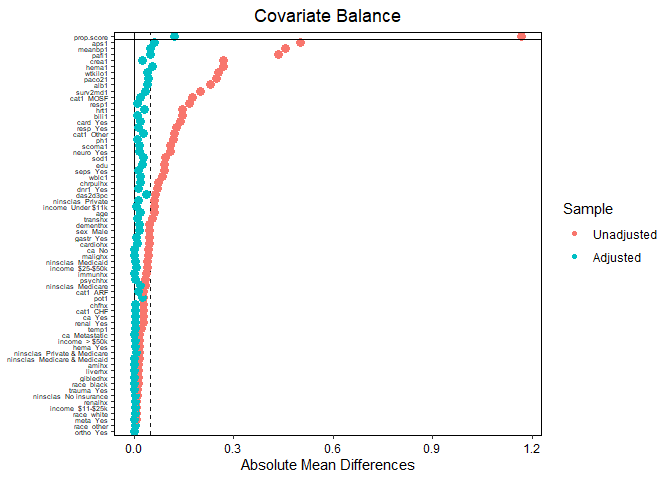<!-- -->

The CBPS scores did a better job at balancing means than the standard
propensity scores.

``` r
outcome_model_cbps <- lm_weightit(Y ~ Tr, data = rhc, weightit = prop_scores_model_cbps)
summary(outcome_model_cbps)
```

    ## 
    ## Call:
    ## lm_weightit(formula = Y ~ Tr, data = rhc, weightit = prop_scores_model_cbps)
    ## 
    ## Coefficients:
    ##             Estimate Std. Error z value Pr(>|z|)    
    ## (Intercept)  20.7505     0.5601  37.048  < 1e-06 ***
    ## Tr1           2.9832     0.8711   3.425 0.000616 ***
    ## Standard error: HC0 robust

Notice that for over-identified CBPS scores, the standard errors
adjusted for weighted estimates are not available. So, we should
recompute the errors with a bootstrap.

``` r
result <- rbind(
  coeftest(ate_naive_model, vcov = sandwich::vcovHC(ate_naive_model, type = "HC0"))[2,c(1,2)],
  c(outcome_model_ipw$coefficients[2],summary(outcome_model_ipw)$coefficients[2,2]),
  c(outcome_model_ipw_ATO$coefficients[2],summary(outcome_model_ipw_ATO)$coefficients[2,2]),
  c(outcome_model_cbps$coefficients[2],summary(outcome_model_cbps)$coefficients[2,2])
)
  
colnames(result) <- c('Estimator', 'sd')
rownames(result) <- c('naive ATE', 'IPW ATE', 'IPW ATO', 'IPW ATE CBPS (over-ident.)')
result
```

    ##                            Estimator        sd
    ## naive ATE                   5.162104 0.7145751
    ## IPW ATE                     2.858327 0.8554132
    ## IPW ATO                     2.643477 0.8093111
    ## IPW ATE CBPS (over-ident.)  2.983157 0.8710961

Since we are primarily aiming to achieve balance between the treatment
and control groups, we can drop the scoring equations and estimate the
weights directly from the balance constraints. We then obtain a
*just-identified* system of constraints.

``` r
prop_scores_model_cbps2 <- weightit(Tr ~ . - Y, data = rhc, method = "cbps", estimand = "ATE", over = FALSE)
summary(prop_scores_model_cbps2)
```

    ##                   Summary of weights
    ## 
    ## - Weight ranges:
    ## 
    ##           Min                                  Max
    ## treated 1.023 |---------------------------| 43.419
    ## control 1.003 |-----------------|           29.066
    ## 
    ## - Units with the 5 most extreme weights by group:
    ##                                            
    ##            1406    742   3828   1905   4890
    ##  treated 18.192 21.091 23.055 25.541 43.419
    ##            2986   1788   1000   2174    505
    ##  control 14.918 15.697 16.922 26.091 29.066
    ## 
    ## - Weight statistics:
    ## 
    ##         Coef of Var   MAD Entropy # Zeros
    ## treated       0.946 0.548   0.269       0
    ## control       0.742 0.364   0.144       0
    ## 
    ## - Effective Sample Sizes:
    ## 
    ##            Control Treated
    ## Unweighted  3551.  2183.  
    ## Weighted    2290.8 1152.51

Since the system of constraints is just-identified, the covariates’
means are exactly balanced.

``` r
bal.tab(prop_scores_model_cbps2, continuous = 'std', binary = 'raw', un = TRUE)
```

    ## Balance Measures
    ##                                  Type Diff.Un Diff.Adj
    ## prop.score                   Distance  1.1534  -0.0532
    ## cat1_ARF                       Binary -0.0288   0.0000
    ## cat1_CHF                       Binary -0.0268   0.0000
    ## cat1_Other                     Binary -0.1206  -0.0000
    ## cat1_MOSF                      Binary  0.1763  -0.0000
    ## ca_Metastatic                  Binary -0.0172   0.0000
    ## ca_No                          Binary  0.0438   0.0000
    ## ca_Yes                         Binary -0.0267  -0.0000
    ## cardiohx                       Binary  0.0446  -0.0000
    ## chfhx                          Binary  0.0268  -0.0000
    ## dementhx                       Binary -0.0471  -0.0000
    ## psychhx                        Binary -0.0347  -0.0000
    ## chrpulhx                       Binary -0.0741  -0.0000
    ## renalhx                        Binary  0.0066  -0.0000
    ## liverhx                        Binary -0.0123  -0.0000
    ## gibledhx                       Binary -0.0122  -0.0000
    ## malighx                        Binary -0.0422  -0.0000
    ## immunhx                        Binary  0.0355  -0.0000
    ## transhx                        Binary  0.0550  -0.0000
    ## amihx                          Binary  0.0139  -0.0000
    ## age                           Contin. -0.0610   0.0001
    ## sex_Male                       Binary  0.0464  -0.0000
    ## edu                           Contin.  0.0916   0.0001
    ## surv2md1                      Contin. -0.1990   0.0001
    ## das2d3pc                      Contin.  0.0630   0.0001
    ## aps1                          Contin.  0.5014   0.0001
    ## scoma1                        Contin. -0.1101   0.0000
    ## meanbp1                       Contin. -0.4550   0.0001
    ## wblc1                         Contin.  0.0840   0.0000
    ## hrt1                          Contin.  0.1467   0.0001
    ## resp1                         Contin. -0.1656   0.0001
    ## temp1                         Contin. -0.0219   0.0007
    ## pafi1                         Contin. -0.4338   0.0000
    ## alb1                          Contin. -0.2290   0.0001
    ## hema1                         Contin. -0.2690   0.0001
    ## bili1                         Contin.  0.1447   0.0000
    ## crea1                         Contin.  0.2698   0.0000
    ## sod1                          Contin. -0.0930   0.0006
    ## pot1                          Contin. -0.0270   0.0001
    ## paco21                        Contin. -0.2482   0.0001
    ## ph1                           Contin. -0.1196   0.0021
    ## wtkilo1                       Contin.  0.2554   0.0001
    ## dnr1_Yes                       Binary -0.0695  -0.0000
    ## ninsclas_Medicaid              Binary -0.0394   0.0000
    ## ninsclas_Medicare              Binary -0.0326   0.0000
    ## ninsclas_Medicare & Medicaid   Binary -0.0143   0.0000
    ## ninsclas_No insurance          Binary  0.0099   0.0000
    ## ninsclas_Private               Binary  0.0621   0.0000
    ## ninsclas_Private & Medicare    Binary  0.0144  -0.0000
    ## resp_Yes                       Binary -0.1276  -0.0000
    ## card_Yes                       Binary  0.1397  -0.0000
    ## neuro_Yes                      Binary -0.1079  -0.0000
    ## gastr_Yes                      Binary  0.0449  -0.0000
    ## renal_Yes                      Binary  0.0264  -0.0000
    ## meta_Yes                       Binary -0.0058  -0.0000
    ## hema_Yes                       Binary -0.0146  -0.0000
    ## seps_Yes                       Binary  0.0913  -0.0000
    ## trauma_Yes                     Binary  0.0105  -0.0000
    ## ortho_Yes                      Binary  0.0010  -0.0000
    ## race_white                     Binary  0.0062   0.0000
    ## race_black                     Binary -0.0113   0.0000
    ## race_other                     Binary  0.0051  -0.0000
    ## income_Under $11k              Binary -0.0615   0.0000
    ## income_$11-$25k                Binary  0.0063   0.0000
    ## income_$25-$50k                Binary  0.0388   0.0000
    ## income_> $50k                  Binary  0.0165  -0.0000
    ## 
    ## Effective sample sizes
    ##            Control Treated
    ## Unadjusted  3551.  2183.  
    ## Adjusted    2290.8 1152.51

``` r
love.plot(prop_scores_model_cbps2, thresholds = c(m = .05), abs = TRUE, var.order = "unadjusted") + theme(axis.text.y = element_text(size = 5))
```

<!-- -->

Let’s estimate the ATE.

``` r
outcome_model_cbps2 <- lm_weightit(Y ~ Tr, data = rhc, weightit = prop_scores_model_cbps2)
summary(outcome_model_cbps2)
```

    ## 
    ## Call:
    ## lm_weightit(formula = Y ~ Tr, data = rhc, weightit = prop_scores_model_cbps2)
    ## 
    ## Coefficients:
    ##             Estimate Std. Error z value Pr(>|z|)    
    ## (Intercept)  21.0529     0.5785  36.391  < 1e-06 ***
    ## Tr1           2.5166     0.8950   2.812  0.00493 ** 
    ## Standard error: HC0 robust (adjusted for estimation of weights)

We notice that for the just-identified system, there is an adjusted
standard-error M-estimator.

``` r
result <- rbind(
  coeftest(ate_naive_model, vcov = sandwich::vcovHC(ate_naive_model, type = "HC0"))[2,c(1,2)],
  c(outcome_model_ipw$coefficients[2],summary(outcome_model_ipw)$coefficients[2,2]),
  c(outcome_model_ipw_ATO$coefficients[2],summary(outcome_model_ipw_ATO)$coefficients[2,2]),
  c(outcome_model_cbps$coefficients[2],summary(outcome_model_cbps)$coefficients[2,2]),
  c(outcome_model_cbps2$coefficients[2],summary(outcome_model_cbps2)$coefficients[2,2])
)
  
colnames(result) <- c('Estimator', 'sd')
rownames(result) <- c('naive ATE', 'IPW ATE', 'IPW ATO', 'IPW ATE CBPS (over-ident.)', 'IPW ATE CBPS (just-ident.)')
result
```

    ##                            Estimator        sd
    ## naive ATE                   5.162104 0.7145751
    ## IPW ATE                     2.858327 0.8554132
    ## IPW ATO                     2.643477 0.8093111
    ## IPW ATE CBPS (over-ident.)  2.983157 0.8710961
    ## IPW ATE CBPS (just-ident.)  2.516594 0.8949897

We see that the just-identified CBPS estimate is quite close to ATO.
However, we always need to remember that ATO refers to the average
effect for the overlap population, whereas ATE is the estimate of the
average treatment effect for the whole population.

Up to this point, we balanced only means. But for continuous covariates,
we need to consider higher-order moments, since the confounding caused
by $`X`$ can be highly nonlinear (Huang et al. 2022). Let us check the
distributions of continuous covariates.

``` r
bal.plot(prop_scores_model_cbps2, var = c('age'))
```

<!-- -->

``` r
p1 <- bal.plot(prop_scores_model_cbps2, var = c('edu'))
p2 <- bal.plot(prop_scores_model_cbps2, var = c('surv2md1'))
p3 <- bal.plot(prop_scores_model_cbps2, var = c('das2d3pc'))
p4 <- bal.plot(prop_scores_model_cbps2, var = c('aps1'))
(p1 + p2 + p3 + p4) + plot_layout(ncol = 2)
```

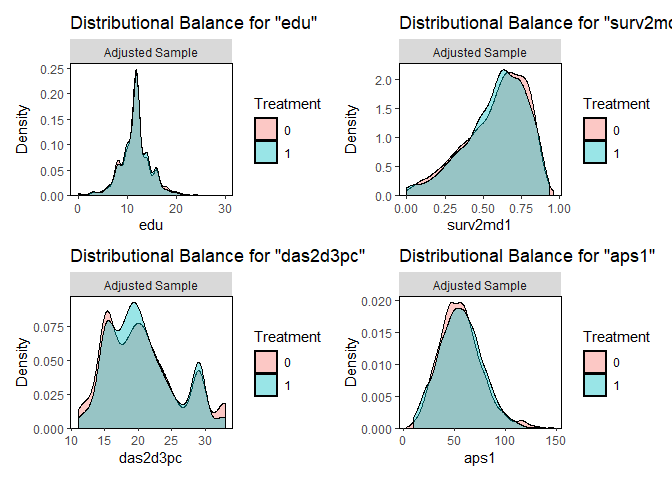<!-- -->

``` r
p1 <- bal.plot(prop_scores_model_cbps2, var = c('scoma1'))
p2 <- bal.plot(prop_scores_model_cbps2, var = c('meanbp1'))
p3 <- bal.plot(prop_scores_model_cbps2, var = c('wblc1'))
p4 <- bal.plot(prop_scores_model_cbps2, var = c('hrt1'))
(p1 + p2 + p3 + p4) + plot_layout(ncol = 2)
```

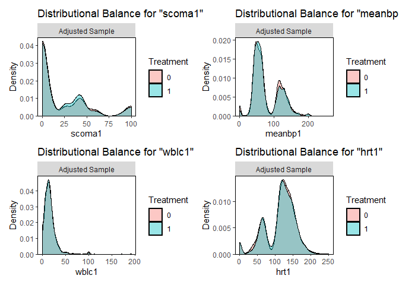<!-- -->

``` r
p1 <- bal.plot(prop_scores_model_cbps2, var = c('resp1'))
p2 <- bal.plot(prop_scores_model_cbps2, var = c('temp1'))
p3 <- bal.plot(prop_scores_model_cbps2, var = c('pafi1'))
p4 <- bal.plot(prop_scores_model_cbps2, var = c('alb1'))
(p1 + p2 + p3 + p4) + plot_layout(ncol = 2)
```

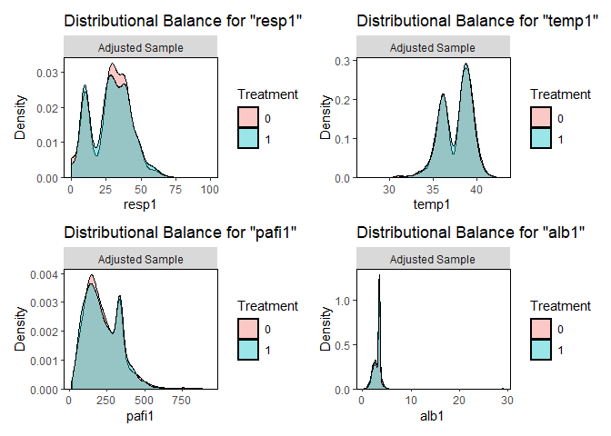<!-- -->

``` r
p1 <- bal.plot(prop_scores_model_cbps2, var = c('hema1'))
p2 <- bal.plot(prop_scores_model_cbps2, var = c('bili1'))
p3 <- bal.plot(prop_scores_model_cbps2, var = c('crea1'))
p4 <- bal.plot(prop_scores_model_cbps2, var = c('sod1'))
(p1 + p2 + p3 + p4) + plot_layout(ncol = 2)
```

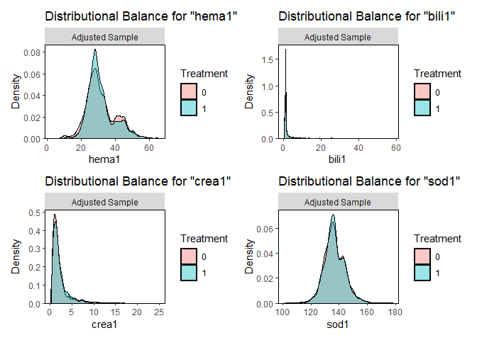<!-- -->

``` r
p1 <- bal.plot(prop_scores_model_cbps2, var = c('pot1'))
p2 <- bal.plot(prop_scores_model_cbps2, var = c('paco21'))
p3 <- bal.plot(prop_scores_model_cbps2, var = c('ph1'))
p4 <- bal.plot(prop_scores_model_cbps2, var = c('wtkilo1'))
(p1 + p2 + p3 + p4) + plot_layout(ncol = 2)
```

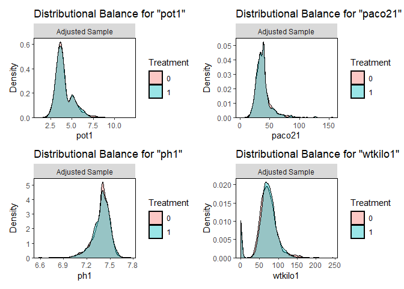<!-- -->

We can also compute other balance statistics. We already mentioned
variance ratios. We can also compute Kolmogorov-Smirnov statistics.

``` r
bal.tab(prop_scores_model_cbps2, stats = c("m", "ks", "v"))
```

    ## Balance Measures
    ##                                  Type Diff.Adj V.Ratio.Adj KS.Adj
    ## prop.score                   Distance  -0.0532      0.8698 0.0607
    ## cat1_ARF                       Binary   0.0000           . 0.0000
    ## cat1_CHF                       Binary   0.0000           . 0.0000
    ## cat1_Other                     Binary  -0.0000           . 0.0000
    ## cat1_MOSF                      Binary  -0.0000           . 0.0000
    ## ca_Metastatic                  Binary   0.0000           . 0.0000
    ## ca_No                          Binary   0.0000           . 0.0000
    ## ca_Yes                         Binary  -0.0000           . 0.0000
    ## cardiohx                       Binary  -0.0000           . 0.0000
    ## chfhx                          Binary  -0.0000           . 0.0000
    ## dementhx                       Binary  -0.0000           . 0.0000
    ## psychhx                        Binary  -0.0000           . 0.0000
    ## chrpulhx                       Binary  -0.0000           . 0.0000
    ## renalhx                        Binary  -0.0000           . 0.0000
    ## liverhx                        Binary  -0.0000           . 0.0000
    ## gibledhx                       Binary  -0.0000           . 0.0000
    ## malighx                        Binary  -0.0000           . 0.0000
    ## immunhx                        Binary  -0.0000           . 0.0000
    ## transhx                        Binary  -0.0000           . 0.0000
    ## amihx                          Binary  -0.0000           . 0.0000
    ## age                           Contin.   0.0001      0.8372 0.0454
    ## sex_Male                       Binary  -0.0000           . 0.0000
    ## edu                           Contin.   0.0001      0.9250 0.0157
    ## surv2md1                      Contin.   0.0001      0.9593 0.0312
    ## das2d3pc                      Contin.   0.0001      0.8242 0.0520
    ## aps1                          Contin.   0.0001      0.9838 0.0331
    ## scoma1                        Contin.   0.0000      0.9278 0.0285
    ## meanbp1                       Contin.   0.0001      1.0086 0.0257
    ## wblc1                         Contin.   0.0000      1.0948 0.0294
    ## hrt1                          Contin.   0.0001      0.9297 0.0227
    ## resp1                         Contin.   0.0001      1.0354 0.0445
    ## temp1                         Contin.   0.0007      0.8932 0.0258
    ## pafi1                         Contin.   0.0000      1.0054 0.0238
    ## alb1                          Contin.   0.0001      2.7435 0.0486
    ## hema1                         Contin.   0.0001      0.8367 0.0482
    ## bili1                         Contin.   0.0000      0.9124 0.0869
    ## crea1                         Contin.   0.0000      0.7249 0.0560
    ## sod1                          Contin.   0.0006      0.8459 0.0273
    ## pot1                          Contin.   0.0001      0.9008 0.0182
    ## paco21                        Contin.   0.0001      1.1526 0.0188
    ## ph1                           Contin.   0.0021      1.0745 0.0237
    ## wtkilo1                       Contin.   0.0001      0.9844 0.0537
    ## dnr1_Yes                       Binary  -0.0000           . 0.0000
    ## ninsclas_Medicaid              Binary   0.0000           . 0.0000
    ## ninsclas_Medicare              Binary   0.0000           . 0.0000
    ## ninsclas_Medicare & Medicaid   Binary   0.0000           . 0.0000
    ## ninsclas_No insurance          Binary   0.0000           . 0.0000
    ## ninsclas_Private               Binary   0.0000           . 0.0000
    ## ninsclas_Private & Medicare    Binary  -0.0000           . 0.0000
    ## resp_Yes                       Binary  -0.0000           . 0.0000
    ## card_Yes                       Binary  -0.0000           . 0.0000
    ## neuro_Yes                      Binary  -0.0000           . 0.0000
    ## gastr_Yes                      Binary  -0.0000           . 0.0000
    ## renal_Yes                      Binary  -0.0000           . 0.0000
    ## meta_Yes                       Binary  -0.0000           . 0.0000
    ## hema_Yes                       Binary  -0.0000           . 0.0000
    ## seps_Yes                       Binary  -0.0000           . 0.0000
    ## trauma_Yes                     Binary  -0.0000           . 0.0000
    ## ortho_Yes                      Binary  -0.0000           . 0.0000
    ## race_white                     Binary   0.0000           . 0.0000
    ## race_black                     Binary   0.0000           . 0.0000
    ## race_other                     Binary  -0.0000           . 0.0000
    ## income_Under $11k              Binary   0.0000           . 0.0000
    ## income_$11-$25k                Binary   0.0000           . 0.0000
    ## income_$25-$50k                Binary   0.0000           . 0.0000
    ## income_> $50k                  Binary  -0.0000           . 0.0000
    ## 
    ## Effective sample sizes
    ##            Control Treated
    ## Unadjusted  3551.  2183.  
    ## Adjusted    2290.8 1152.51

We see that variance ratios are far from being perfectly balanced. Thus,
let us consider balancing the second-order moments as well.

``` r
prop_scores_model_cbps3 <- weightit(Tr ~ . - Y, data = rhc, method = "cbps", estimand = "ATE", moments = 2, over = FALSE)
summary(prop_scores_model_cbps3)
```

    ##                   Summary of weights
    ## 
    ## - Weight ranges:
    ## 
    ##         Min                                  Max
    ## treated   1 |-----------------------|     35.31 
    ## control   1 |---------------------------| 40.228
    ## 
    ## - Units with the 5 most extreme weights by group:
    ##                                            
    ##             664   4119    347   1905   4890
    ##  treated 22.037  23.45 25.515 25.826  35.31
    ##            1804    497   2986   4133    505
    ##  control 16.522 17.291 19.839 27.626 40.228
    ## 
    ## - Weight statistics:
    ## 
    ##         Coef of Var   MAD Entropy # Zeros
    ## treated       0.973 0.575   0.288       0
    ## control       0.855 0.392   0.173       0
    ## 
    ## - Effective Sample Sizes:
    ## 
    ##            Control Treated
    ## Unweighted 3551.   2183.  
    ## Weighted   2052.31 1122.03

``` r
bal.tab(prop_scores_model_cbps3, stats = c("m", "ks", "v"))
```

    ## Balance Measures
    ##                                  Type Diff.Adj V.Ratio.Adj KS.Adj
    ## prop.score                   Distance  -0.0773      0.8359 0.0686
    ## cat1_ARF                       Binary   0.0000           . 0.0000
    ## cat1_CHF                       Binary  -0.0000           . 0.0000
    ## cat1_Other                     Binary  -0.0000           . 0.0000
    ## cat1_MOSF                      Binary   0.0000           . 0.0000
    ## ca_Metastatic                  Binary  -0.0000           . 0.0000
    ## ca_No                          Binary   0.0000           . 0.0000
    ## ca_Yes                         Binary  -0.0000           . 0.0000
    ## cardiohx                       Binary   0.0000           . 0.0000
    ## chfhx                          Binary   0.0000           . 0.0000
    ## dementhx                       Binary   0.0000           . 0.0000
    ## psychhx                        Binary   0.0000           . 0.0000
    ## chrpulhx                       Binary   0.0000           . 0.0000
    ## renalhx                        Binary   0.0000           . 0.0000
    ## liverhx                        Binary   0.0000           . 0.0000
    ## gibledhx                       Binary   0.0000           . 0.0000
    ## malighx                        Binary  -0.0000           . 0.0000
    ## immunhx                        Binary  -0.0000           . 0.0000
    ## transhx                        Binary   0.0000           . 0.0000
    ## amihx                          Binary   0.0000           . 0.0000
    ## age                           Contin.  -0.0000      1.0004 0.0232
    ## sex_Male                       Binary  -0.0000           . 0.0000
    ## edu                           Contin.  -0.0000      1.0004 0.0235
    ## surv2md1                      Contin.   0.0000      1.0004 0.0259
    ## das2d3pc                      Contin.   0.0000      1.0004 0.0367
    ## aps1                          Contin.  -0.0000      1.0004 0.0316
    ## scoma1                        Contin.   0.0000      1.0004 0.0129
    ## meanbp1                       Contin.   0.0000      1.0004 0.0249
    ## wblc1                         Contin.  -0.0000      1.0004 0.0290
    ## hrt1                          Contin.   0.0000      1.0004 0.0246
    ## resp1                         Contin.  -0.0000      1.0004 0.0372
    ## temp1                         Contin.   0.0000      1.0004 0.0139
    ## pafi1                         Contin.  -0.0000      1.0004 0.0272
    ## alb1                          Contin.  -0.0000      1.0004 0.0563
    ## hema1                         Contin.   0.0000      1.0004 0.0455
    ## bili1                         Contin.  -0.0000      1.0004 0.0843
    ## crea1                         Contin.  -0.0000      1.0004 0.0280
    ## sod1                          Contin.   0.0000      1.0004 0.0189
    ## pot1                          Contin.  -0.0000      1.0004 0.0158
    ## paco21                        Contin.   0.0000      1.0004 0.0149
    ## ph1                           Contin.   0.0000      1.0004 0.0227
    ## wtkilo1                       Contin.  -0.0000      1.0004 0.0493
    ## dnr1_Yes                       Binary   0.0000           . 0.0000
    ## ninsclas_Medicaid              Binary  -0.0000           . 0.0000
    ## ninsclas_Medicare              Binary  -0.0000           . 0.0000
    ## ninsclas_Medicare & Medicaid   Binary  -0.0000           . 0.0000
    ## ninsclas_No insurance          Binary   0.0000           . 0.0000
    ## ninsclas_Private               Binary  -0.0000           . 0.0000
    ## ninsclas_Private & Medicare    Binary   0.0000           . 0.0000
    ## resp_Yes                       Binary   0.0000           . 0.0000
    ## card_Yes                       Binary   0.0000           . 0.0000
    ## neuro_Yes                      Binary   0.0000           . 0.0000
    ## gastr_Yes                      Binary   0.0000           . 0.0000
    ## renal_Yes                      Binary   0.0000           . 0.0000
    ## meta_Yes                       Binary   0.0000           . 0.0000
    ## hema_Yes                       Binary   0.0000           . 0.0000
    ## seps_Yes                       Binary   0.0000           . 0.0000
    ## trauma_Yes                     Binary   0.0000           . 0.0000
    ## ortho_Yes                      Binary   0.0000           . 0.0000
    ## race_white                     Binary  -0.0000           . 0.0000
    ## race_black                     Binary  -0.0000           . 0.0000
    ## race_other                     Binary   0.0000           . 0.0000
    ## income_Under $11k              Binary  -0.0000           . 0.0000
    ## income_$11-$25k                Binary  -0.0000           . 0.0000
    ## income_$25-$50k                Binary  -0.0000           . 0.0000
    ## income_> $50k                  Binary   0.0000           . 0.0000
    ## 
    ## Effective sample sizes
    ##            Control Treated
    ## Unadjusted 3551.   2183.  
    ## Adjusted   2052.31 1122.03

Variance ratios are now all balanced.

``` r
outcome_model_cbps3 <- lm_weightit(Y ~ Tr, data = rhc, weightit = prop_scores_model_cbps3)
summary(outcome_model_cbps3)
```

    ## 
    ## Call:
    ## lm_weightit(formula = Y ~ Tr, data = rhc, weightit = prop_scores_model_cbps3)
    ## 
    ## Coefficients:
    ##             Estimate Std. Error z value Pr(>|z|)    
    ## (Intercept)  21.0897     0.5840  36.112  < 1e-06 ***
    ## Tr1           2.6521     0.9314   2.848  0.00441 ** 
    ## Standard error: HC0 robust (adjusted for estimation of weights)

``` r
result <- rbind(
  coeftest(ate_naive_model, vcov = sandwich::vcovHC(ate_naive_model, type = "HC0"))[2,c(1,2)],
  c(outcome_model_ipw$coefficients[2],summary(outcome_model_ipw)$coefficients[2,2]),
  c(outcome_model_ipw_ATO$coefficients[2],summary(outcome_model_ipw_ATO)$coefficients[2,2]),
  c(outcome_model_cbps$coefficients[2],summary(outcome_model_cbps)$coefficients[2,2]),
  c(outcome_model_cbps2$coefficients[2],summary(outcome_model_cbps2)$coefficients[2,2]),
  c(outcome_model_cbps3$coefficients[2],summary(outcome_model_cbps3)$coefficients[2,2])
)
  
colnames(result) <- c('Estimator', 'sd')
rownames(result) <- c('naive ATE', 'IPW ATE', 'IPW ATO', 'IPW ATE CBPS (over-ident.)', 'IPW ATE CBPS (just-ident.)', 'IPW ATE CBPS (just-ident., second-order moments)')
result
```

    ##                                                  Estimator        sd
    ## naive ATE                                         5.162104 0.7145751
    ## IPW ATE                                           2.858327 0.8554132
    ## IPW ATO                                           2.643477 0.8093111
    ## IPW ATE CBPS (over-ident.)                        2.983157 0.8710961
    ## IPW ATE CBPS (just-ident.)                        2.516594 0.8949897
    ## IPW ATE CBPS (just-ident., second-order moments)  2.652091 0.9313714

We could go on; however, we would reach a similar problem to fitting a
too-complex outcome model (without any regularization) to a dataset. The
resulting weights would be fragile, and the estimate would actually be
worse. In addition, CBPS weights are computationally expensive to
compute because they are fitted by GMM. Hence, we will move to *entropy
balancing*, which is very similar to just-identified CBPS weights, but
much cheaper to compute.

## Entropy Balancing

Entropy balancing was introduced for ATT in (Hainmueller 2012). The
weights were the solution of the optimization

``` math
\text{minimize } \text{D}(w)\\
\text{subject to}\\
\sum_{i \mid T =0} w_i f_r(X_i) = m_r \text{ and } \sum_{i\mid T =0}w_i = n_0 \text{ and } w_i \geq0\\
```

where $`D(w) = \sum_{i \mid T =0} w_i \log(w_i/q_i)`$ is
Kullback-Leibler divergence with respect to some base weights $`q`$
(typicaly chosen as uniform) (Hainmueller 2012) and where
$`f_r(X_i) = m_r`$ for $`r = 1, \ldots, R`$ describes a set of $`R`$
balance constraints. In other words, we are looking for weights that
meet the balance constraints and are not far from a uniform distribution
(i.e., we do not want extremely small or large weights). Interestingly,
the ATT estimate from entropy balancing is identical to the
just-identified CBPS estimate of ATT
(<https://ngreifer.github.io/WeightIt/reference/method_cbps.html>).

ATE estimate based on entropy balancing is a bit different. The
optimization problem is (Källberg and Waernbaum 2023)

``` math
\text{minimize } \text{D}(w)\\
\text{subject to}\\
\sum_{i \mid T = 0} w_i f_r(X_i) = \sum_{i \mid T = 1} w_i f_r(X_i)  = \sum_{i = 1}^n w_i f_r(X_i)  = m_r 
\text{ and } \\
\sum_{i\mid T = 0}w_i = \sum_{i\mid T = 1}w_i =  n \text{ and } w_i \geq0.\\
```

Notice that we require a three-way balance across both subpopulations
(treatment and control) and the whole population. The weights are
computed numerically using a standard constraint optimization algorithm
and are thus faster than CBPS.

Let us first balance the covariate means.

``` r
weights_model_ebs1 <- weightit(Tr ~ . - Y, data = rhc, method = "ebal", estimand = "ATE")
summary(weights_model_ebs1)
```

    ##                   Summary of weights
    ## 
    ## - Weight ranges:
    ## 
    ##           Min                                  Max
    ## treated 0.148 |---------------------------| 28.452
    ## control 0.285 |-----|                        6.687
    ## 
    ## - Units with the 5 most extreme weights by group:
    ##                                            
    ##             347   1825    742   1905   4890
    ##  treated 15.611 16.652 16.855 17.436 28.452
    ##            2174   2986   1000   4007    505
    ##  control  5.324  6.092    6.1  6.181  6.687
    ## 
    ## - Weight statistics:
    ## 
    ##         Coef of Var   MAD Entropy # Zeros
    ## treated       0.908 0.613   0.308       0
    ## control       0.45  0.345   0.093       0
    ## 
    ## - Effective Sample Sizes:
    ## 
    ##            Control Treated
    ## Unweighted 3551.   2183.  
    ## Weighted   2953.48 1196.29

``` r
bal.tab(weights_model_ebs1, stats = c("m", "ks", "v"))
```

    ## Balance Measures
    ##                                 Type Diff.Adj V.Ratio.Adj KS.Adj
    ## cat1_ARF                      Binary       -0           . 0.0000
    ## cat1_CHF                      Binary        0           . 0.0000
    ## cat1_Other                    Binary       -0           . 0.0000
    ## cat1_MOSF                     Binary       -0           . 0.0000
    ## ca_Metastatic                 Binary       -0           . 0.0000
    ## ca_No                         Binary        0           . 0.0000
    ## ca_Yes                        Binary       -0           . 0.0000
    ## cardiohx                      Binary       -0           . 0.0000
    ## chfhx                         Binary       -0           . 0.0000
    ## dementhx                      Binary       -0           . 0.0000
    ## psychhx                       Binary       -0           . 0.0000
    ## chrpulhx                      Binary       -0           . 0.0000
    ## renalhx                       Binary       -0           . 0.0000
    ## liverhx                       Binary       -0           . 0.0000
    ## gibledhx                      Binary       -0           . 0.0000
    ## malighx                       Binary       -0           . 0.0000
    ## immunhx                       Binary       -0           . 0.0000
    ## transhx                       Binary       -0           . 0.0000
    ## amihx                         Binary       -0           . 0.0000
    ## age                          Contin.        0      0.8175 0.0508
    ## sex_Male                      Binary       -0           . 0.0000
    ## edu                          Contin.       -0      0.9059 0.0141
    ## surv2md1                     Contin.        0      0.9548 0.0312
    ## das2d3pc                     Contin.       -0      0.8246 0.0491
    ## aps1                         Contin.       -0      1.0244 0.0293
    ## scoma1                       Contin.        0      0.9338 0.0269
    ## meanbp1                      Contin.        0      1.0333 0.0210
    ## wblc1                        Contin.       -0      1.1755 0.0281
    ## hrt1                         Contin.       -0      0.9253 0.0241
    ## resp1                        Contin.        0      1.0347 0.0445
    ## temp1                        Contin.        0      0.8853 0.0278
    ## pafi1                        Contin.       -0      1.0230 0.0257
    ## alb1                         Contin.       -0      3.1435 0.0505
    ## hema1                        Contin.       -0      0.8739 0.0451
    ## bili1                        Contin.       -0      0.8723 0.0938
    ## crea1                        Contin.       -0      0.7273 0.0556
    ## sod1                         Contin.        0      0.8358 0.0216
    ## pot1                         Contin.        0      0.9076 0.0154
    ## paco21                       Contin.        0      1.1532 0.0256
    ## ph1                          Contin.        0      1.0558 0.0280
    ## wtkilo1                      Contin.        0      1.0196 0.0524
    ## dnr1_Yes                      Binary       -0           . 0.0000
    ## ninsclas_Medicaid             Binary       -0           . 0.0000
    ## ninsclas_Medicare             Binary       -0           . 0.0000
    ## ninsclas_Medicare & Medicaid  Binary       -0           . 0.0000
    ## ninsclas_No insurance         Binary       -0           . 0.0000
    ## ninsclas_Private              Binary        0           . 0.0000
    ## ninsclas_Private & Medicare   Binary        0           . 0.0000
    ## resp_Yes                      Binary       -0           . 0.0000
    ## card_Yes                      Binary        0           . 0.0000
    ## neuro_Yes                     Binary       -0           . 0.0000
    ## gastr_Yes                     Binary       -0           . 0.0000
    ## renal_Yes                     Binary       -0           . 0.0000
    ## meta_Yes                      Binary       -0           . 0.0000
    ## hema_Yes                      Binary       -0           . 0.0000
    ## seps_Yes                      Binary       -0           . 0.0000
    ## trauma_Yes                    Binary        0           . 0.0000
    ## ortho_Yes                     Binary       -0           . 0.0000
    ## race_white                    Binary        0           . 0.0000
    ## race_black                    Binary        0           . 0.0000
    ## race_other                    Binary       -0           . 0.0000
    ## income_Under $11k             Binary       -0           . 0.0000
    ## income_$11-$25k               Binary        0           . 0.0000
    ## income_$25-$50k               Binary        0           . 0.0000
    ## income_> $50k                 Binary       -0           . 0.0000
    ## 
    ## Effective sample sizes
    ##            Control Treated
    ## Unadjusted 3551.   2183.  
    ## Adjusted   2953.48 1196.29

``` r
outcome_model_ebs1 <- lm_weightit(Y ~ Tr, data = rhc, weightit = weights_model_ebs1)
summary(outcome_model_ebs1)
```

    ## 
    ## Call:
    ## lm_weightit(formula = Y ~ Tr, data = rhc, weightit = weights_model_ebs1)
    ## 
    ## Coefficients:
    ##             Estimate Std. Error z value Pr(>|z|)    
    ## (Intercept)  20.5746     0.4677  43.990  < 1e-06 ***
    ## Tr1           2.8731     0.8277   3.471 0.000518 ***
    ## Standard error: HC0 robust (adjusted for estimation of weights)

As with just-identified CBPS, the standard errors for entropy balancing
are adjusted for weight estimation.

``` r
result <- rbind(
  coeftest(ate_naive_model, vcov = sandwich::vcovHC(ate_naive_model, type = "HC0"))[2,c(1,2)],
  c(outcome_model_ipw$coefficients[2],summary(outcome_model_ipw)$coefficients[2,2]),
  c(outcome_model_ipw_ATO$coefficients[2],summary(outcome_model_ipw_ATO)$coefficients[2,2]),
  c(outcome_model_cbps$coefficients[2],summary(outcome_model_cbps)$coefficients[2,2]),
  c(outcome_model_cbps2$coefficients[2],summary(outcome_model_cbps2)$coefficients[2,2]),
  c(outcome_model_cbps3$coefficients[2],summary(outcome_model_cbps3)$coefficients[2,2]),
  c(outcome_model_ebs1$coefficients[2],summary(outcome_model_ebs1)$coefficients[2,2])
)
  
colnames(result) <- c('Estimator', 'sd')
rownames(result) <- c('naive ATE', 'IPW ATE', 'IPW ATO', 'IPW ATE CBPS (over-ident.)', 'IPW ATE CBPS (just-ident.)', 'IPW ATE CBPS (just-ident., second-order moments)', 'Entropy Balancing')
result
```

    ##                                                  Estimator        sd
    ## naive ATE                                         5.162104 0.7145751
    ## IPW ATE                                           2.858327 0.8554132
    ## IPW ATO                                           2.643477 0.8093111
    ## IPW ATE CBPS (over-ident.)                        2.983157 0.8710961
    ## IPW ATE CBPS (just-ident.)                        2.516594 0.8949897
    ## IPW ATE CBPS (just-ident., second-order moments)  2.652091 0.9313714
    ## Entropy Balancing                                 2.873110 0.8276899

Let’s continue and balance the variances as well.

``` r
weights_model_ebs2 <- weightit(Tr ~ . - Y, data = rhc, method = "ebal", estimand = "ATE", moments = 2)
summary(weights_model_ebs2)
```

    ##                   Summary of weights
    ## 
    ## - Weight ranges:
    ## 
    ##           Min                                  Max
    ## treated 0.141 |---------------------------| 23.745
    ## control 0.063 |------------|                11.337
    ## 
    ## - Units with the 5 most extreme weights by group:
    ##                                           
    ##           3663   1905    347   4119   4890
    ##  treated 18.44 18.489 19.356 21.993 23.745
    ##           4133   1000   2986    505   2083
    ##  control  6.19  7.428  7.855  9.774 11.337
    ## 
    ## - Weight statistics:
    ## 
    ##         Coef of Var   MAD Entropy # Zeros
    ## treated       0.971 0.657   0.349       0
    ## control       0.501 0.367   0.108       0
    ## 
    ## - Effective Sample Sizes:
    ## 
    ##            Control Treated
    ## Unweighted 3551.      2183
    ## Weighted   2838.49    1124

``` r
bal.tab(weights_model_ebs2, stats = c("m", "ks", "v"))
```

    ## Balance Measures
    ##                                 Type Diff.Adj V.Ratio.Adj KS.Adj
    ## cat1_ARF                      Binary       -0           . 0.0000
    ## cat1_CHF                      Binary        0           . 0.0000
    ## cat1_Other                    Binary       -0           . 0.0000
    ## cat1_MOSF                     Binary        0           . 0.0000
    ## ca_Metastatic                 Binary       -0           . 0.0000
    ## ca_No                         Binary        0           . 0.0000
    ## ca_Yes                        Binary       -0           . 0.0000
    ## cardiohx                      Binary        0           . 0.0000
    ## chfhx                         Binary       -0           . 0.0000
    ## dementhx                      Binary        0           . 0.0000
    ## psychhx                       Binary        0           . 0.0000
    ## chrpulhx                      Binary       -0           . 0.0000
    ## renalhx                       Binary        0           . 0.0000
    ## liverhx                       Binary        0           . 0.0000
    ## gibledhx                      Binary        0           . 0.0000
    ## malighx                       Binary       -0           . 0.0000
    ## immunhx                       Binary        0           . 0.0000
    ## transhx                       Binary       -0           . 0.0000
    ## amihx                         Binary       -0           . 0.0000
    ## age                          Contin.        0      1.0005 0.0220
    ## sex_Male                      Binary       -0           . 0.0000
    ## edu                          Contin.       -0      1.0005 0.0212
    ## surv2md1                     Contin.       -0      1.0005 0.0269
    ## das2d3pc                     Contin.        0      1.0005 0.0375
    ## aps1                         Contin.       -0      1.0005 0.0282
    ## scoma1                       Contin.       -0      1.0005 0.0147
    ## meanbp1                      Contin.        0      1.0005 0.0236
    ## wblc1                        Contin.        0      1.0005 0.0270
    ## hrt1                         Contin.        0      1.0005 0.0272
    ## resp1                        Contin.       -0      1.0005 0.0399
    ## temp1                        Contin.        0      1.0005 0.0145
    ## pafi1                        Contin.        0      1.0005 0.0276
    ## alb1                         Contin.       -0      1.0005 0.0552
    ## hema1                        Contin.        0      1.0005 0.0436
    ## bili1                        Contin.        0      1.0005 0.0880
    ## crea1                        Contin.        0      1.0005 0.0309
    ## sod1                         Contin.       -0      1.0005 0.0138
    ## pot1                         Contin.        0      1.0005 0.0174
    ## paco21                       Contin.        0      1.0005 0.0166
    ## ph1                          Contin.        0      1.0005 0.0271
    ## wtkilo1                      Contin.       -0      1.0005 0.0468
    ## dnr1_Yes                      Binary        0           . 0.0000
    ## ninsclas_Medicaid             Binary       -0           . 0.0000
    ## ninsclas_Medicare             Binary       -0           . 0.0000
    ## ninsclas_Medicare & Medicaid  Binary        0           . 0.0000
    ## ninsclas_No insurance         Binary        0           . 0.0000
    ## ninsclas_Private              Binary        0           . 0.0000
    ## ninsclas_Private & Medicare   Binary       -0           . 0.0000
    ## resp_Yes                      Binary       -0           . 0.0000
    ## card_Yes                      Binary       -0           . 0.0000
    ## neuro_Yes                     Binary       -0           . 0.0000
    ## gastr_Yes                     Binary        0           . 0.0000
    ## renal_Yes                     Binary        0           . 0.0000
    ## meta_Yes                      Binary        0           . 0.0000
    ## hema_Yes                      Binary       -0           . 0.0000
    ## seps_Yes                      Binary        0           . 0.0000
    ## trauma_Yes                    Binary       -0           . 0.0000
    ## ortho_Yes                     Binary        0           . 0.0000
    ## race_white                    Binary        0           . 0.0000
    ## race_black                    Binary        0           . 0.0000
    ## race_other                    Binary       -0           . 0.0000
    ## income_Under $11k             Binary       -0           . 0.0000
    ## income_$11-$25k               Binary       -0           . 0.0000
    ## income_$25-$50k               Binary       -0           . 0.0000
    ## income_> $50k                 Binary        0           . 0.0000
    ## 
    ## Effective sample sizes
    ##            Control Treated
    ## Unadjusted 3551.      2183
    ## Adjusted   2838.49    1124

``` r
outcome_model_ebs2 <- lm_weightit(Y ~ Tr, data = rhc, weightit = weights_model_ebs2)

result <- rbind(
  coeftest(ate_naive_model, vcov = sandwich::vcovHC(ate_naive_model, type = "HC0"))[2,c(1,2)],
  c(outcome_model_ipw$coefficients[2],summary(outcome_model_ipw)$coefficients[2,2]),
  c(outcome_model_ipw_ATO$coefficients[2],summary(outcome_model_ipw_ATO)$coefficients[2,2]),
  c(outcome_model_cbps$coefficients[2],summary(outcome_model_cbps)$coefficients[2,2]),
  c(outcome_model_cbps2$coefficients[2],summary(outcome_model_cbps2)$coefficients[2,2]),
  c(outcome_model_cbps3$coefficients[2],summary(outcome_model_cbps3)$coefficients[2,2]),
  c(outcome_model_ebs1$coefficients[2],summary(outcome_model_ebs1)$coefficients[2,2]),
  c(outcome_model_ebs2$coefficients[2],summary(outcome_model_ebs2)$coefficients[2,2])
)
  
colnames(result) <- c('Estimator', 'sd')
rownames(result) <- c('naive ATE', 'IPW ATE', 'IPW ATO', 'IPW ATE CBPS (over-ident.)', 'IPW ATE CBPS (just-ident.)', 'IPW ATE CBPS (just-ident., second-order moments)', 'Entropy Balancing','Entropy Balancing (second-order moments)')
result
```

    ##                                                  Estimator        sd
    ## naive ATE                                         5.162104 0.7145751
    ## IPW ATE                                           2.858327 0.8554132
    ## IPW ATO                                           2.643477 0.8093111
    ## IPW ATE CBPS (over-ident.)                        2.983157 0.8710961
    ## IPW ATE CBPS (just-ident.)                        2.516594 0.8949897
    ## IPW ATE CBPS (just-ident., second-order moments)  2.652091 0.9313714
    ## Entropy Balancing                                 2.873110 0.8276899
    ## Entropy Balancing (second-order moments)          2.816207 0.8581414

Let’s do it again and try to balance the third moments (i.e., skewness).

``` r
weights_model_ebs3 <- weightit(Tr ~ . - Y, data = rhc, method = "ebal", estimand = "ATE", moments = 3)
summary(weights_model_ebs3)
```

    ##                   Summary of weights
    ## 
    ## - Weight ranges:
    ## 
    ##           Min                                  Max
    ## treated 0.127 |----------------------|      27.953
    ## control 0.    |---------------------------| 34.408
    ## 
    ## - Units with the 5 most extreme weights by group:
    ##                                            
    ##             664   1825   4885   4890   4119
    ##  treated 19.649 20.799 21.276 21.422 27.953
    ##            3830    984    505   4350   2083
    ##  control   9.05 10.609 12.014 12.578 34.408
    ## 
    ## - Weight statistics:
    ## 
    ##         Coef of Var   MAD Entropy # Zeros
    ## treated       1.021 0.688   0.379       0
    ## control       0.865 0.575   0.29        0
    ## 
    ## - Effective Sample Sizes:
    ## 
    ##            Control Treated
    ## Unweighted 3551.   2183.  
    ## Weighted   2030.61 1069.59

``` r
outcome_model_ebs3 <- lm_weightit(Y ~ Tr, data = rhc, weightit = weights_model_ebs3)

result <- rbind(
  coeftest(ate_naive_model, vcov = sandwich::vcovHC(ate_naive_model, type = "HC0"))[2,c(1,2)],
  c(outcome_model_ipw$coefficients[2],summary(outcome_model_ipw)$coefficients[2,2]),
  c(outcome_model_ipw_ATO$coefficients[2],summary(outcome_model_ipw_ATO)$coefficients[2,2]),
  c(outcome_model_cbps$coefficients[2],summary(outcome_model_cbps)$coefficients[2,2]),
  c(outcome_model_cbps2$coefficients[2],summary(outcome_model_cbps2)$coefficients[2,2]),
  c(outcome_model_cbps3$coefficients[2],summary(outcome_model_cbps3)$coefficients[2,2]),
  c(outcome_model_ebs1$coefficients[2],summary(outcome_model_ebs1)$coefficients[2,2]),
  c(outcome_model_ebs2$coefficients[2],summary(outcome_model_ebs2)$coefficients[2,2]),
  c(outcome_model_ebs3$coefficients[2],summary(outcome_model_ebs3)$coefficients[2,2])
)
  
colnames(result) <- c('Estimator', 'sd')
rownames(result) <- c('naive ATE', 'IPW ATE', 'IPW ATO', 'IPW ATE CBPS (over-ident.)', 'IPW ATE CBPS (just-ident.)', 'IPW ATE CBPS (just-ident., second-order moments)', 'Entropy Balancing','Entropy Balancing (second-order moments)','Entropy Balancing (third-order moments)')
result
```

    ##                                                  Estimator        sd
    ## naive ATE                                         5.162104 0.7145751
    ## IPW ATE                                           2.858327 0.8554132
    ## IPW ATO                                           2.643477 0.8093111
    ## IPW ATE CBPS (over-ident.)                        2.983157 0.8710961
    ## IPW ATE CBPS (just-ident.)                        2.516594 0.8949897
    ## IPW ATE CBPS (just-ident., second-order moments)  2.652091 0.9313714
    ## Entropy Balancing                                 2.873110 0.8276899
    ## Entropy Balancing (second-order moments)          2.816207 0.8581414
    ## Entropy Balancing (third-order moments)           3.224524 1.2524933

We see that this is too much; the estimate started to deteriorate. For
the same reason, we cannot just balance all interactions.

## Energy Balancing

All methods we mentioned up to this point were parametric; we had to
specify which moments we want to balance. This is, of course, limiting,
since adding too many balancing conditions will cause the estimate to
deteriorate. Hence, before we wrap up this presentation, we will briefly
look at *energy balancing*.

Energy balancing is a quite recent nonparametric balancing method
(Huling and Mak 2024). Instead of balancing particular moments, energy
balancing seeks to balance the whole joint distributions of covariates
using the energy distance between distributions

``` math
 \mathcal{E}(X,Y) = \frac{2}{n_xn_y}\sum_{i,j} \Vert x_i - y_j\Vert^2 + \frac{1}{n_x^2}\sum_{i,j} \Vert x_i - x_j\Vert^2 + \frac{1}{n_y^2}\sum_{i,j} \Vert y_i - y_j\Vert^2,
```
where $`x_i`$, $`y_j`$ are samples from $`X`$ and $`Y`$.

Being a nonparametric approach, we do not have to specify moments nor
interactions.

``` r
weights_model_engbs <- weightit(Tr ~ . - Y, data = rhc, method = "energy", estimand = "ATE")
summary(weights_model_engbs)
```

    ##                   Summary of weights
    ## 
    ## - Weight ranges:
    ## 
    ##         Min                                 Max
    ## treated   0 |---------------------------| 8.375
    ## control   0 |-----------|                 3.893
    ## 
    ## - Units with the 5 most extreme weights by group:
    ##                                       
    ##           5321  5131  4119  4890  1825
    ##  treated 5.777 5.905 6.655 7.672 8.375
    ##           2982  5057  1488  4369   370
    ##  control 3.252  3.29 3.498  3.81 3.893
    ## 
    ## - Weight statistics:
    ## 
    ##         Coef of Var   MAD Entropy # Zeros
    ## treated       0.917 0.685   0.398       0
    ## control       0.6   0.479   0.196       0
    ## 
    ## - Effective Sample Sizes:
    ## 
    ##            Control Treated
    ## Unweighted 3551.   2183.  
    ## Weighted   2610.72 1185.79

``` r
love.plot(weights_model_engbs, thresholds = c(m = .05), abs = TRUE, var.order = "unadjusted") + theme(axis.text.y = element_text(size = 5))
```

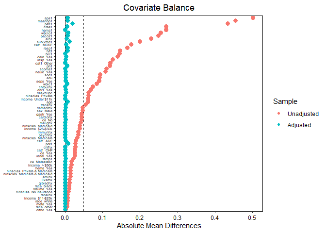<!-- -->

``` r
bal.tab(weights_model_engbs, stats = c("m", "ks", "v"))
```

    ## Balance Measures
    ##                                 Type Diff.Adj V.Ratio.Adj KS.Adj
    ## cat1_ARF                      Binary  -0.0019           . 0.0019
    ## cat1_CHF                      Binary  -0.0003           . 0.0003
    ## cat1_Other                    Binary  -0.0007           . 0.0007
    ## cat1_MOSF                     Binary   0.0030           . 0.0030
    ## ca_Metastatic                 Binary  -0.0009           . 0.0009
    ## ca_No                         Binary   0.0018           . 0.0018
    ## ca_Yes                        Binary  -0.0009           . 0.0009
    ## cardiohx                      Binary   0.0001           . 0.0001
    ## chfhx                         Binary   0.0001           . 0.0001
    ## dementhx                      Binary  -0.0011           . 0.0011
    ## psychhx                       Binary  -0.0007           . 0.0007
    ## chrpulhx                      Binary   0.0001           . 0.0001
    ## renalhx                       Binary   0.0004           . 0.0004
    ## liverhx                       Binary  -0.0000           . 0.0000
    ## gibledhx                      Binary   0.0001           . 0.0001
    ## malighx                       Binary   0.0001           . 0.0001
    ## immunhx                       Binary   0.0006           . 0.0006
    ## transhx                       Binary   0.0011           . 0.0011
    ## amihx                         Binary   0.0004           . 0.0004
    ## age                          Contin.  -0.0070      0.8788 0.0439
    ## sex_Male                      Binary   0.0005           . 0.0005
    ## edu                          Contin.   0.0012      0.9632 0.0200
    ## surv2md1                     Contin.  -0.0117      0.9697 0.0300
    ## das2d3pc                     Contin.   0.0023      0.8713 0.0396
    ## aps1                         Contin.   0.0069      1.0112 0.0315
    ## scoma1                       Contin.  -0.0001      0.9739 0.0157
    ## meanbp1                      Contin.  -0.0065      1.0372 0.0233
    ## wblc1                        Contin.   0.0059      1.1426 0.0216
    ## hrt1                         Contin.   0.0073      0.9720 0.0236
    ## resp1                        Contin.  -0.0064      1.0699 0.0410
    ## temp1                        Contin.  -0.0013      0.9509 0.0221
    ## pafi1                        Contin.  -0.0195      0.9964 0.0253
    ## alb1                         Contin.   0.0048      1.6495 0.0482
    ## hema1                        Contin.   0.0003      0.9399 0.0373
    ## bili1                        Contin.   0.0005      0.9578 0.0769
    ## crea1                        Contin.   0.0051      0.8831 0.0340
    ## sod1                         Contin.  -0.0012      0.8849 0.0271
    ## pot1                         Contin.  -0.0078      0.9548 0.0138
    ## paco21                       Contin.  -0.0066      1.0557 0.0273
    ## ph1                          Contin.  -0.0054      1.0591 0.0316
    ## wtkilo1                      Contin.   0.0083      1.0427 0.0455
    ## dnr1_Yes                      Binary  -0.0021           . 0.0021
    ## ninsclas_Medicaid             Binary  -0.0006           . 0.0006
    ## ninsclas_Medicare             Binary  -0.0008           . 0.0008
    ## ninsclas_Medicare & Medicaid  Binary  -0.0001           . 0.0001
    ## ninsclas_No insurance         Binary   0.0007           . 0.0007
    ## ninsclas_Private              Binary   0.0005           . 0.0005
    ## ninsclas_Private & Medicare   Binary   0.0002           . 0.0002
    ## resp_Yes                      Binary  -0.0013           . 0.0013
    ## card_Yes                      Binary   0.0030           . 0.0030
    ## neuro_Yes                     Binary  -0.0017           . 0.0017
    ## gastr_Yes                     Binary   0.0005           . 0.0005
    ## renal_Yes                     Binary   0.0003           . 0.0003
    ## meta_Yes                      Binary  -0.0001           . 0.0001
    ## hema_Yes                      Binary   0.0001           . 0.0001
    ## seps_Yes                      Binary   0.0012           . 0.0012
    ## trauma_Yes                    Binary   0.0004           . 0.0004
    ## ortho_Yes                     Binary   0.0001           . 0.0001
    ## race_white                    Binary  -0.0002           . 0.0002
    ## race_black                    Binary   0.0004           . 0.0004
    ## race_other                    Binary  -0.0002           . 0.0002
    ## income_Under $11k             Binary   0.0000           . 0.0000
    ## income_$11-$25k               Binary  -0.0000           . 0.0000
    ## income_$25-$50k               Binary   0.0002           . 0.0002
    ## income_> $50k                 Binary  -0.0002           . 0.0002
    ## 
    ## Effective sample sizes
    ##            Control Treated
    ## Unadjusted 3551.   2183.  
    ## Adjusted   2610.72 1185.79

Since we are not explicitly targeting the first and second moments, the
balance with respect to them is not perfect, but it is decent overall.

``` r
outcome_model_engbs <- lm_weightit(Y ~ Tr, data = rhc, weightit = weights_model_engbs)
summary(outcome_model_engbs)
```

    ## 
    ## Call:
    ## lm_weightit(formula = Y ~ Tr, data = rhc, weightit = weights_model_engbs)
    ## 
    ## Coefficients:
    ##             Estimate Std. Error z value Pr(>|z|)    
    ## (Intercept)  20.9522     0.5189  40.376   <1e-06 ***
    ## Tr1           2.1871     0.8959   2.441   0.0146 *  
    ## Standard error: HC0 robust

Notice that the standard errors are not adjusted for weighted
estimation. Thus, we would need to use bootstrapping to obtain an
accurate error estimate.

``` r
result <- rbind(
  coeftest(ate_naive_model, vcov = sandwich::vcovHC(ate_naive_model, type = "HC0"))[2,c(1,2)],
  c(outcome_model_ipw$coefficients[2],summary(outcome_model_ipw)$coefficients[2,2]),
  c(outcome_model_ipw_ATO$coefficients[2],summary(outcome_model_ipw_ATO)$coefficients[2,2]),
  c(outcome_model_cbps$coefficients[2],summary(outcome_model_cbps)$coefficients[2,2]),
  c(outcome_model_cbps2$coefficients[2],summary(outcome_model_cbps2)$coefficients[2,2]),
  c(outcome_model_cbps3$coefficients[2],summary(outcome_model_cbps3)$coefficients[2,2]),
  c(outcome_model_ebs1$coefficients[2],summary(outcome_model_ebs1)$coefficients[2,2]),
  c(outcome_model_ebs2$coefficients[2],summary(outcome_model_ebs2)$coefficients[2,2]),
  c(outcome_model_ebs3$coefficients[2],summary(outcome_model_ebs3)$coefficients[2,2]),
  c(outcome_model_engbs$coefficients[2],summary(outcome_model_engbs)$coefficients[2,2])
)
  
colnames(result) <- c('Estimator', 'sd')
rownames(result) <- c('naive ATE', 'IPW ATE', 'IPW ATO', 'IPW ATE CBPS (over-ident.)', 'IPW ATE CBPS (just-ident.)', 'IPW ATE CBPS (just-ident., second order moments)', 'Entropy Balancing','Entropy Balancing (second order moments)', 'Entropy Balancing (third order moments)', 'Energy Balancing')
result
```

    ##                                                  Estimator        sd
    ## naive ATE                                         5.162104 0.7145751
    ## IPW ATE                                           2.858327 0.8554132
    ## IPW ATO                                           2.643477 0.8093111
    ## IPW ATE CBPS (over-ident.)                        2.983157 0.8710961
    ## IPW ATE CBPS (just-ident.)                        2.516594 0.8949897
    ## IPW ATE CBPS (just-ident., second order moments)  2.652091 0.9313714
    ## Entropy Balancing                                 2.873110 0.8276899
    ## Entropy Balancing (second order moments)          2.816207 0.8581414
    ## Entropy Balancing (third order moments)           3.224524 1.2524933
    ## Energy Balancing                                  2.187065 0.8959481

We see that the estimate is quite different from other methods. Funnily
enough, this value is pretty close to the ATE estimate obtained using an
ensemble of machine learning models (XGBoost and the like;
<https://ehsanx.github.io/TMLEworkshop/rhc-data-description.html#ref-keele2021comparing>).
This shows that balancing just two moments while ignoring interactions
was clearly not enough.

Let’s check the distributions of continuous covariates.

``` r
bal.plot(weights_model_engbs, var = c('age'))
```

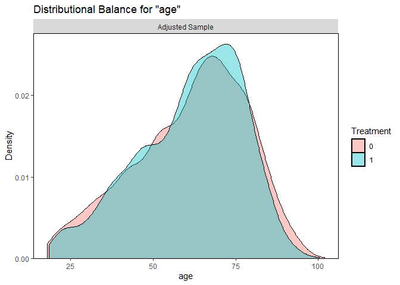<!-- -->

``` r
p1 <- bal.plot(weights_model_engbs, var = c('edu'))
p2 <- bal.plot(weights_model_engbs, var = c('surv2md1'))
p3 <- bal.plot(weights_model_engbs, var = c('das2d3pc'))
p4 <- bal.plot(weights_model_engbs, var = c('aps1'))
(p1 + p2 + p3 + p4) + plot_layout(ncol = 2)
```

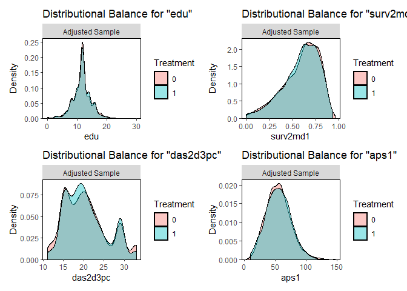<!-- -->

``` r
p1 <- bal.plot(weights_model_engbs, var = c('scoma1'))
p2 <- bal.plot(weights_model_engbs, var = c('meanbp1'))
p3 <- bal.plot(weights_model_engbs, var = c('wblc1'))
p4 <- bal.plot(weights_model_engbs, var = c('hrt1'))
(p1 + p2 + p3 + p4) + plot_layout(ncol = 2)
```

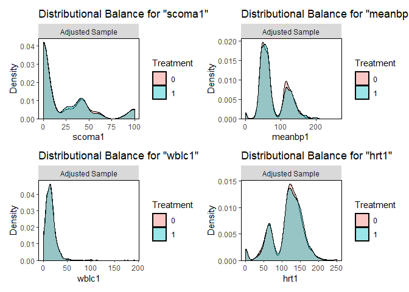<!-- -->

``` r
p1 <- bal.plot(weights_model_engbs, var = c('resp1'))
p2 <- bal.plot(weights_model_engbs, var = c('temp1'))
p3 <- bal.plot(weights_model_engbs, var = c('pafi1'))
p4 <- bal.plot(weights_model_engbs, var = c('alb1'))
(p1 + p2 + p3 + p4) + plot_layout(ncol = 2)
```

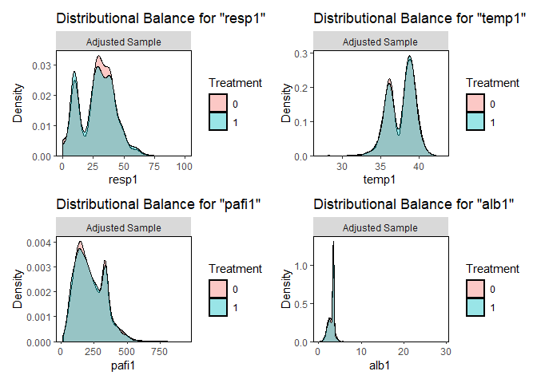<!-- -->

``` r
p1 <- bal.plot(weights_model_engbs, var = c('hema1'))
p2 <- bal.plot(weights_model_engbs, var = c('bili1'))
p3 <- bal.plot(weights_model_engbs, var = c('crea1'))
p4 <- bal.plot(weights_model_engbs, var = c('sod1'))
(p1 + p2 + p3 + p4) + plot_layout(ncol = 2)
```

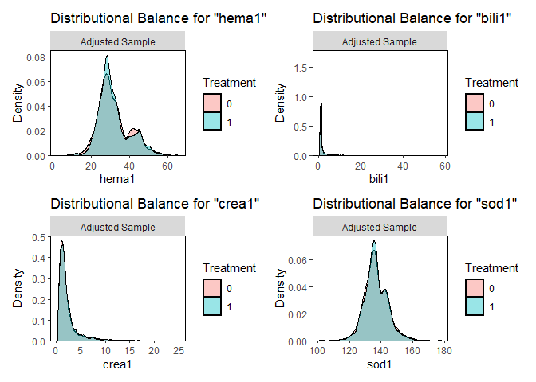<!-- -->

``` r
p1 <- bal.plot(weights_model_engbs, var = c('pot1'))
p2 <- bal.plot(weights_model_engbs, var = c('paco21'))
p3 <- bal.plot(weights_model_engbs, var = c('ph1'))
p4 <- bal.plot(weights_model_engbs, var = c('wtkilo1'))
(p1 + p2 + p3 + p4) + plot_layout(ncol = 2)
```

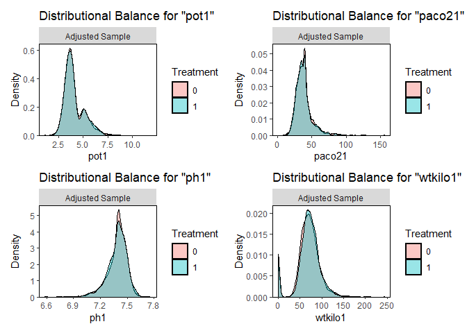<!-- -->

We observe that energy balancing did a decent job at balancing the
distributions. Lastly, let’s check those interactions. There are, of
course, too many of them. Hence, let’s print the 10 worst balanced
interactions for energy balancing, entropy balancing, and
just-identified CBPS in terms of means.

``` r
bal_engbs <- bal.tab(weights_model_engbs, stats = c("m", "ks", "v"), int = TRUE)
bal_cbps3 <- bal.tab(prop_scores_model_cbps3, stats = c("m", "ks", "v"), int = TRUE)
bal_ebs2 <- bal.tab(weights_model_ebs2, stats = c("m", "ks", "v"), int = TRUE)
```

``` r
bal_engbs$Balance[order(bal_engbs$Balance$Diff.Adj, decreasing = TRUE)[1:10],]
```

    ##                           Type Diff.Un V.Ratio.Un KS.Un   Diff.Adj V.Ratio.Adj
    ## bili1 * meta_Yes       Contin.      NA         NA    NA 0.05015246   2.7735484
    ## gibledhx_1 * scoma1    Contin.      NA         NA    NA 0.04750029   1.4492088
    ## dementhx_1 * bili1     Contin.      NA         NA    NA 0.03901437   4.2672290
    ## malighx_1 * scoma1     Contin.      NA         NA    NA 0.03755654   1.1165186
    ## scoma1 * gastr_Yes     Contin.      NA         NA    NA 0.03649800   1.1406757
    ## wblc1 * alb1           Contin.      NA         NA    NA 0.03489001   1.6492786
    ## scoma1 * wblc1         Contin.      NA         NA    NA 0.03434236   1.7875356
    ## cat1_CHF * scoma1      Contin.      NA         NA    NA 0.03322270   0.9771311
    ## cat1_Other * crea1     Contin.      NA         NA    NA 0.03304088   1.0366641
    ## ca_Metastatic * scoma1 Contin.      NA         NA    NA 0.03187743   1.1935142
    ##                             KS.Adj
    ## bili1 * meta_Yes       0.004988438
    ## gibledhx_1 * scoma1    0.007633919
    ## dementhx_1 * bili1     0.008237111
    ## malighx_1 * scoma1     0.013380412
    ## scoma1 * gastr_Yes     0.014614005
    ## wblc1 * alb1           0.021651255
    ## scoma1 * wblc1         0.016433442
    ## cat1_CHF * scoma1      0.009890079
    ## cat1_Other * crea1     0.023670693
    ## ca_Metastatic * scoma1 0.007403756

``` r
bal_cbps3$Balance[order(bal_cbps3$Balance$Diff.Adj, decreasing = TRUE)[1:10],]
```

    ##                           Type Diff.Un V.Ratio.Un KS.Un   Diff.Adj V.Ratio.Adj
    ## gibledhx_1 * scoma1    Contin.      NA         NA    NA 0.10052999    2.919418
    ## cat1_CHF * scoma1      Contin.      NA         NA    NA 0.09925092    2.198640
    ## pafi1 * card_Yes       Contin.      NA         NA    NA 0.07963641    1.222496
    ## scoma1 * gastr_Yes     Contin.      NA         NA    NA 0.07782292    1.480194
    ## renalhx_1 * scoma1     Contin.      NA         NA    NA 0.07606552    2.079563
    ## liverhx_1 * scoma1     Contin.      NA         NA    NA 0.07570747    1.554372
    ## cardiohx_1 * pafi1     Contin.      NA         NA    NA 0.07531981    1.332502
    ## malighx_1 * scoma1     Contin.      NA         NA    NA 0.07185234    1.334742
    ## chfhx_1 * pafi1        Contin.      NA         NA    NA 0.07156789    1.304895
    ## ca_Metastatic * scoma1 Contin.      NA         NA    NA 0.06446126    1.499845
    ##                            KS.Adj
    ## gibledhx_1 * scoma1    0.01070480
    ## cat1_CHF * scoma1      0.01549524
    ## pafi1 * card_Yes       0.04477398
    ## scoma1 * gastr_Yes     0.02006470
    ## renalhx_1 * scoma1     0.01061949
    ## liverhx_1 * scoma1     0.01837532
    ## cardiohx_1 * pafi1     0.03417054
    ## malighx_1 * scoma1     0.02021572
    ## chfhx_1 * pafi1        0.04018542
    ## ca_Metastatic * scoma1 0.01264259

``` r
bal_ebs2$Balance[order(bal_ebs2$Balance$Diff.Adj, decreasing = TRUE)[1:10],]
```

    ##                        Type Diff.Un V.Ratio.Un KS.Un   Diff.Adj V.Ratio.Adj
    ## cat1_CHF * scoma1   Contin.      NA         NA    NA 0.10625597    2.368301
    ## gibledhx_1 * scoma1 Contin.      NA         NA    NA 0.10341519    2.826757
    ## scoma1 * gastr_Yes  Contin.      NA         NA    NA 0.08335192    1.537178
    ## liverhx_1 * scoma1  Contin.      NA         NA    NA 0.07946769    1.601635
    ## malighx_1 * scoma1  Contin.      NA         NA    NA 0.07427803    1.354290
    ## renalhx_1 * scoma1  Contin.      NA         NA    NA 0.07195342    2.085860
    ## cat1_Other * pafi1  Contin.      NA         NA    NA 0.07145440    1.222737
    ## pafi1 * card_Yes    Contin.      NA         NA    NA 0.06686770    1.181146
    ## resp1 * neuro_Yes   Contin.      NA         NA    NA 0.06538347    1.338492
    ## chfhx_1 * pafi1     Contin.      NA         NA    NA 0.06384139    1.264721
    ##                          KS.Adj
    ## cat1_CHF * scoma1   0.015817223
    ## gibledhx_1 * scoma1 0.010557058
    ## scoma1 * gastr_Yes  0.021860706
    ## liverhx_1 * scoma1  0.018786202
    ## malighx_1 * scoma1  0.020592842
    ## renalhx_1 * scoma1  0.008815062
    ## cat1_Other * pafi1  0.051502526
    ## pafi1 * card_Yes    0.042000106
    ## resp1 * neuro_Yes   0.023654747
    ## chfhx_1 * pafi1     0.037421074

We see that energy balancing did a much better job at balancing
interactions than CBPS and entropy balancing. The nonparametric approach
proved to be clearly superior in this case.

## References

<div id="refs" class="references csl-bib-body hanging-indent">

<div id="ref-connors1996effectiveness" class="csl-entry">

<span class="nocase">Connors, Alfred F, Theodore Speroff, Neal V Dawson,
et al.</span> 1996. “The Effectiveness of Right Heart Catheterization in
the Initial Care of Critically III Patients.” *Jama* 276 (11): 889–97.

</div>

<div id="ref-hainmueller2012entropy" class="csl-entry">

Hainmueller, Jens. 2012. “Entropy Balancing for Causal Effects: A
Multivariate Reweighting Method to Produce Balanced Samples in
Observational Studies.” *Political Analysis* 20 (1): 25–46.

</div>

<div id="ref-huang2022higher" class="csl-entry">

Huang, Melody Y, Brian G Vegetabile, Lane F Burgette, Claude Setodji,
and Beth Ann Griffin. 2022. “Higher Moments Matter for Optimal Balance
Weighting in Causal Estimation.” *Epidemiology (Cambridge, Mass.)* 33
(4): 551.

</div>

<div id="ref-huling2024energy" class="csl-entry">

Huling, Jared D, and Simon Mak. 2024. “Energy Balancing of Covariate
Distributions.” *Journal of Causal Inference* 12 (1): 20220029.

</div>

<div id="ref-imai2014covariate" class="csl-entry">

Imai, Kosuke, and Marc Ratkovic. 2014. “Covariate Balancing Propensity
Score.” *Journal of the Royal Statistical Society Series B: Statistical
Methodology* 76 (1): 243–63.

</div>

<div id="ref-kallberg2023large" class="csl-entry">

Källberg, David, and Ingeborg Waernbaum. 2023. “Large Sample Properties
of Entropy Balancing Estimators of Average Causal Effects.”
*Econometrics and Statistics*.

</div>

<div id="ref-zubizarreta2023handbook" class="csl-entry">

Zubizarreta, José R, Elizabeth A Stuart, Dylan S Small, and Paul R
Rosenbaum. 2023. *Handbook of Matching and Weighting Adjustments for
Causal Inference*. CRC Press.

</div>

</div>
