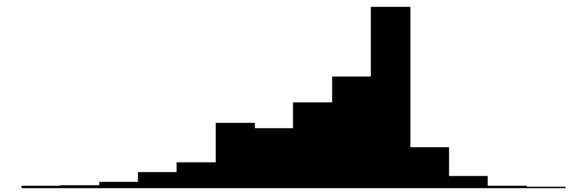
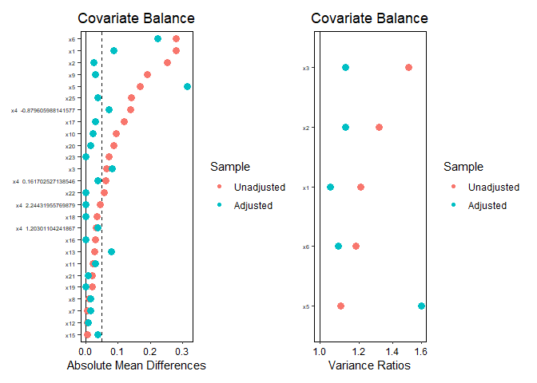
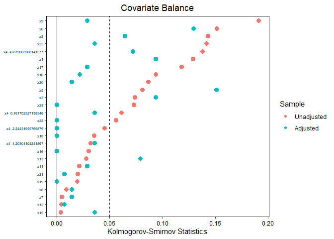
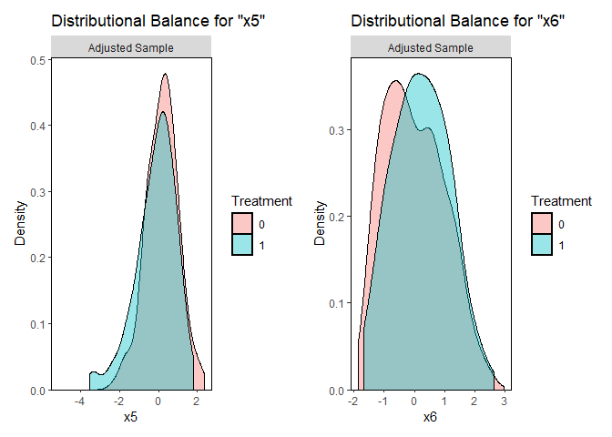
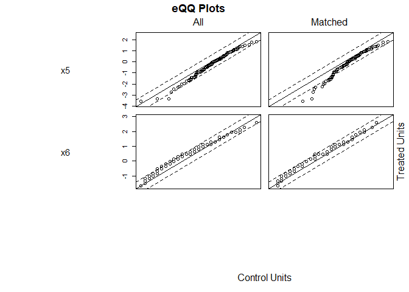
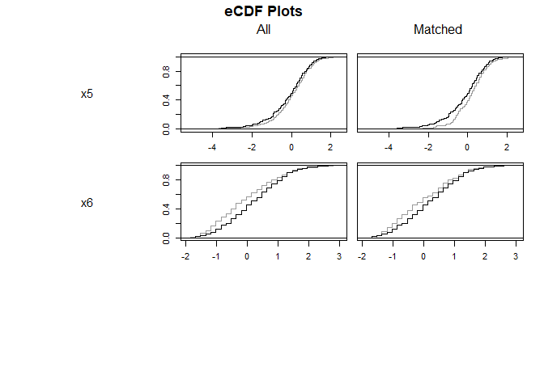
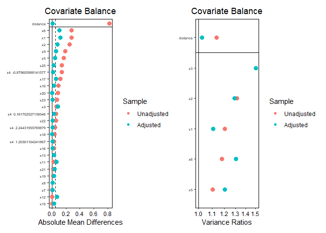
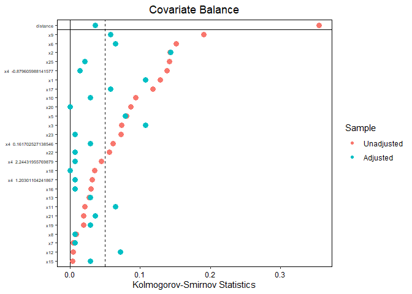
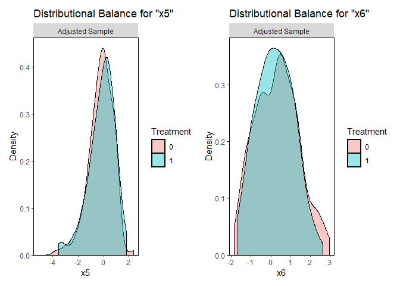
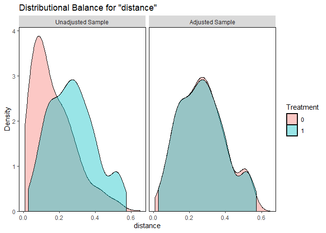

# The First Casualty of Statistics: Part Twelve
<big>**Matching**</big>

<br/>
Jiří Fejlek

2026-09-02
<br/>

<br/> Let us discuss the third main method of causal inference after
regression and weighting: matching. Similar to weighting, matching also
aims to balance the treatment and control populations. But unlike
weighting, which modifies the sample by reweighting it, matching does so
by reducing it to some subpopulation. Usually, the treatment group is
kept intact, but the control groups are reduced to observations that
“match” the treatment group. This implies that ATT is usually the
estimand of interest when using matching (Greifer and Stuart 2021).

Arguably, the most useful benefit of matching over weighting and
regression is that it directly addresses the main source of (observed)
confounding bias by excluding problematic observations from the
inference. Weighting targets the balance of the covariates as well, and
it can (effectively) remove some observations by reducing their weights
to close to zero. However, it can also assign very large weights to
certain observations, making the estimate less robust.

The main disadvantage of matching is that by throwing some data out, we
reduce the precision of our estimates (we increase the variance).
Regression adjustment handles this best, since it does not discard any
observations. However, the downside is that it relies on extrapolating
unobserved potential outcomes, which is highly sensitive to model
specification. Secondly, matching removes observations from the treated
group in some variants. Then, matching no longer estimates ATT but
something more akin to ATO. <br/>

## Table of Contents

- [IHDP dataset](#ihdp-dataset)
- [Matching (without Replacement)](#matching-without-replacement)
  - [Nearest Neighbor Matching (Greedy
    Matching)](#nearest-neighbor-matching-greedy-matching)
    - [Mahalanobis Distance Matching](#mahalanobis-distance-matching)
    - [Propensity Score Matching](#propensity-score-matching)
  - [Nearest Neighbor Matching (with
    Caliper)](#nearest-neighbor-matching-with-caliper)
  - [Optimal Pair Matching](#optimal-pair-matching)
  - [Genetic Matching](#genetic-matching)
  - [Ratio Matching](#ratio-matching)
  - [Subclassification Matching](#subclassification-matching)
  - [Full Matching](#full-matching)
  - [Cardinality Matching](#cardinality-matching)
  - [Profile Matching](#profile-matching)
  - [(Coarsened) Exact Matching](#coarsened-exact-matching)
- [Matching with Replacement](#matching-with-replacement)
- [References](#references)


``` r
library(tidyr)
library(dplyr)
library(tibble)
library(ggplot2)
library(patchwork)
library(dagitty)
library(ggdag)
library(modelsummary)
library(GGally)
library(estimatr)
library(WeightIt)
library(cobalt)
library(mgcv)
```

## IHDP dataset

The dataset we will use in this demonstration is the *IHDP* (Infant
Health and Development Program) dataset (Hill 2011). It is a
semi-synthetic dataset: it is based on real data with synthetic
counterfactuals
(<https://search.r-project.org/CRAN/refmans/bartcs/html/ihdp.html>).
There are several versions of the dataset; we will use version 9.

``` r
ihdp_npci_9 <- read.csv("C:/Users/elini/Desktop/first casualty/ihdp_npci_9.csv")
head(ihdp_npci_9)
```

    ##   treatment y_factual y_cfactual      mu0      mu1         x1         x2
    ## 1         1  49.64792   34.95076 37.17329 50.38380 -0.5286028 -0.3434545
    ## 2         0  16.07341   49.43531 16.08725 49.54623 -1.7369449 -1.8020022
    ## 3         0  19.64301   48.59821 18.04485 49.66107 -0.8074510 -0.2029459
    ## 4         0  26.36832   49.71520 24.60596 49.97120  0.3900830  0.5965822
    ## 5         0  20.25889   51.14742 20.61282 49.79412 -1.0452285 -0.6027100
    ## 6         0  69.38340   50.09587 70.09188 51.01801  0.4679011 -0.2029459
    ##            x3         x4          x5         x6 x7 x8 x9 x10 x11 x12 x13 x14
    ## 1  1.12855393  0.1617025 -0.31660318  1.2952159  1  0  1   0   0   0   0   1
    ## 2  0.38382797  2.2443196 -0.62918919  1.2952159  0  0  0   1   0   0   1   1
    ## 3 -0.36089799 -0.8796060  0.80870646 -0.5265556  0  0  0   1   0   0   0   2
    ## 4 -1.85034991 -0.8796060 -0.00401717 -0.8577868  0  0  0   0   0   1   1   2
    ## 5  0.01146499  0.1617025  0.68367206 -0.3609400  1  0  0   0   0   1   1   1
    ## 6 -0.73326097  0.1617025  0.05850003  1.9576783  1  0  0   1   0   0   1   1
    ##   x15 x16 x17 x18 x19 x20 x21 x22 x23 x24 x25
    ## 1   0   1   1   1   1   0   0   0   0   0   0
    ## 2   1   1   1   1   1   0   0   0   0   0   0
    ## 3   0   1   0   1   1   0   0   0   0   0   0
    ## 4   0   1   0   1   1   0   0   0   0   0   0
    ## 5   0   1   1   1   1   0   0   0   0   0   0
    ## 6   0   1   1   1   1   0   0   0   0   0   0

Let’s create the dataset for estimating the treatment effect. We remove
the unobserved potential outcomes and turn discrete covariates into
factors.

``` r
ihdp_model <- ihdp_npci_9[,c(1,2,6:30)]
colnames(ihdp_model)[2] <- 'y'
factors <- c(1,9:27)

ihdp_model[,factors] <- lapply(ihdp_model[,factors], as.factor)
ihdp_model$x4 <- ordered(ihdp_model$x4)

datasummary_skim(ihdp_model[,c(1,3:27)])
```

<table style="width:97%;">
<colgroup>
<col style="width: 5%" />
<col style="width: 10%" />
<col style="width: 7%" />
<col style="width: 3%" />
<col style="width: 3%" />
<col style="width: 3%" />
<col style="width: 4%" />
<col style="width: 3%" />
<col style="width: 54%" />
</colgroup>
<thead>
    <tr>
      <th></th>
      <th>Unique</th>
      <th>Missing Pct.</th>
      <th>Mean</th>
      <th>SD</th>
      <th>Min</th>
      <th>Median</th>
      <th>Max</th>
      <th>Histogram</th>
    </tr>
  </thead>
  <tbody>
    <tr>
      <td><strong>x1</strong></td>
      <td>214</td>
      <td>0</td>
      <td>0.0</td>
      <td>1.0</td>
      <td>-2.7</td>
      <td>0.2</td>
      <td>1.5</td>
      <td></td>
    </tr>
    <tr>
      <td><strong>x2</strong></td>
      <td>46</td>
      <td>0</td>
      <td>0.0</td>
      <td>1.0</td>
      <td>-3.8</td>
      <td>0.2</td>
      <td>2.6</td>
      <td></td>
    </tr>
    <tr>
      <td><strong>x3</strong></td>
      <td>14</td>
      <td>0</td>
      <td>0.0</td>
      <td>1.0</td>
      <td>-1.9</td>
      <td>-0.4</td>
      <td>3.0</td>
      <td></td>
    </tr>
    <tr>
      <td><strong>x5</strong></td>
      <td>87</td>
      <td>0</td>
      <td>0.0</td>
      <td>1.0</td>
      <td>-5.1</td>
      <td>0.1</td>
      <td>2.4</td>
      <td></td>
    </tr>
    <tr>
      <td><strong>x6</strong></td>
      <td>30</td>
      <td>0</td>
      <td>0.0</td>
      <td>1.0</td>
      <td>-1.9</td>
      <td>-0.0</td>
      <td>3.0</td>
      <td></td>
    </tr>
</tr>
<tr>
<td></td>
<td></td>
<td>N</td>
<td>%</td>
<td></td>
<td></td>
<td></td>
<td></td>
<td></td>
</tr>
 <tr>
      <td><strong>treatment</strong></td>
      <td>0</td>
      <td>608</td>
      <td>81.4</td>
      <td></td>
      <td></td>
      <td></td>
      <td></td>
      <td></td>
    </tr>
    <tr>
      <td></td>
      <td>1</td>
      <td>139</td>
      <td>18.6</td>
      <td></td>
      <td></td>
      <td></td>
      <td></td>
      <td></td>
    </tr>
    <tr>
      <td><strong>x4</strong></td>
      <td>-0.879605988141577</td>
      <td>346</td>
      <td>46.3</td>
      <td></td>
      <td></td>
      <td></td>
      <td></td>
      <td></td>
    </tr>
    <tr>
      <td></td>
      <td>0.161702527138546</td>
      <td>236</td>
      <td>31.6</td>
      <td></td>
      <td></td>
      <td></td>
      <td></td>
      <td></td>
    </tr>
    <tr>
      <td></td>
      <td>1.20301104241867</td>
      <td>100</td>
      <td>13.4</td>
      <td></td>
      <td></td>
      <td></td>
      <td></td>
      <td></td>
    </tr>
    <tr>
      <td></td>
      <td>2.24431955769879</td>
      <td>65</td>
      <td>8.7</td>
      <td></td>
      <td></td>
      <td></td>
      <td></td>
      <td></td>
    </tr>
    <tr>
      <td><strong>x7</strong></td>
      <td>0</td>
      <td>363</td>
      <td>48.6</td>
      <td></td>
      <td></td>
      <td></td>
      <td></td>
      <td></td>
    </tr>
    <tr>
      <td></td>
      <td>1</td>
      <td>384</td>
      <td>51.4</td>
      <td></td>
      <td></td>
      <td></td>
      <td></td>
      <td></td>
    </tr>
    <tr>
      <td><strong>x8</strong></td>
      <td>0</td>
      <td>677</td>
      <td>90.6</td>
      <td></td>
      <td></td>
      <td></td>
      <td></td>
      <td></td>
    </tr>
    <tr>
      <td></td>
      <td>1</td>
      <td>70</td>
      <td>9.4</td>
      <td></td>
      <td></td>
      <td></td>
      <td></td>
      <td></td>
    </tr>
    <tr>
      <td><strong>x9</strong></td>
      <td>0</td>
      <td>358</td>
      <td>47.9</td>
      <td></td>
      <td></td>
      <td></td>
      <td></td>
      <td></td>
    </tr>
    <tr>
      <td></td>
      <td>1</td>
      <td>389</td>
      <td>52.1</td>
      <td></td>
      <td></td>
      <td></td>
      <td></td>
      <td></td>
    </tr>
    <tr>
      <td><strong>x10</strong></td>
      <td>0</td>
      <td>475</td>
      <td>63.6</td>
      <td></td>
      <td></td>
      <td></td>
      <td></td>
      <td></td>
    </tr>
    <tr>
      <td></td>
      <td>1</td>
      <td>272</td>
      <td>36.4</td>
      <td></td>
      <td></td>
      <td></td>
      <td></td>
      <td></td>
    </tr>
    <tr>
      <td><strong>x11</strong></td>
      <td>0</td>
      <td>546</td>
      <td>73.1</td>
      <td></td>
      <td></td>
      <td></td>
      <td></td>
      <td></td>
    </tr>
    <tr>
      <td></td>
      <td>1</td>
      <td>201</td>
      <td>26.9</td>
      <td></td>
      <td></td>
      <td></td>
      <td></td>
      <td></td>
    </tr>
    <tr>
      <td><strong>x12</strong></td>
      <td>0</td>
      <td>583</td>
      <td>78.0</td>
      <td></td>
      <td></td>
      <td></td>
      <td></td>
      <td></td>
    </tr>
    <tr>
      <td></td>
      <td>1</td>
      <td>164</td>
      <td>22.0</td>
      <td></td>
      <td></td>
      <td></td>
      <td></td>
      <td></td>
    </tr>
    <tr>
      <td><strong>x13</strong></td>
      <td>0</td>
      <td>479</td>
      <td>64.1</td>
      <td></td>
      <td></td>
      <td></td>
      <td></td>
      <td></td>
    </tr>
    <tr>
      <td></td>
      <td>1</td>
      <td>268</td>
      <td>35.9</td>
      <td></td>
      <td></td>
      <td></td>
      <td></td>
      <td></td>
    </tr>
    <tr>
      <td><strong>x14</strong></td>
      <td>1</td>
      <td>401</td>
      <td>53.7</td>
      <td></td>
      <td></td>
      <td></td>
      <td></td>
      <td></td>
    </tr>
    <tr>
      <td></td>
      <td>2</td>
      <td>346</td>
      <td>46.3</td>
      <td></td>
      <td></td>
      <td></td>
      <td></td>
      <td></td>
    </tr>
    <tr>
      <td><strong>x15</strong></td>
      <td>0</td>
      <td>642</td>
      <td>85.9</td>
      <td></td>
      <td></td>
      <td></td>
      <td></td>
      <td></td>
    </tr>
    <tr>
      <td></td>
      <td>1</td>
      <td>105</td>
      <td>14.1</td>
      <td></td>
      <td></td>
      <td></td>
      <td></td>
      <td></td>
    </tr>
    <tr>
      <td><strong>x16</strong></td>
      <td>0</td>
      <td>30</td>
      <td>4.0</td>
      <td></td>
      <td></td>
      <td></td>
      <td></td>
      <td></td>
    </tr>
    <tr>
      <td></td>
      <td>1</td>
      <td>717</td>
      <td>96.0</td>
      <td></td>
      <td></td>
      <td></td>
      <td></td>
      <td></td>
    </tr>
    <tr>
      <td><strong>x17</strong></td>
      <td>0</td>
      <td>303</td>
      <td>40.6</td>
      <td></td>
      <td></td>
      <td></td>
      <td></td>
      <td></td>
    </tr>
    <tr>
      <td></td>
      <td>1</td>
      <td>444</td>
      <td>59.4</td>
      <td></td>
      <td></td>
      <td></td>
      <td></td>
      <td></td>
    </tr>
    <tr>
      <td><strong>x18</strong></td>
      <td>0</td>
      <td>27</td>
      <td>3.6</td>
      <td></td>
      <td></td>
      <td></td>
      <td></td>
      <td></td>
    </tr>
    <tr>
      <td></td>
      <td>1</td>
      <td>720</td>
      <td>96.4</td>
      <td></td>
      <td></td>
      <td></td>
      <td></td>
      <td></td>
    </tr>
    <tr>
      <td><strong>x19</strong></td>
      <td>0</td>
      <td>646</td>
      <td>86.5</td>
      <td></td>
      <td></td>
      <td></td>
      <td></td>
      <td></td>
    </tr>
    <tr>
      <td></td>
      <td>1</td>
      <td>101</td>
      <td>13.5</td>
      <td></td>
      <td></td>
      <td></td>
      <td></td>
      <td></td>
    </tr>
    <tr>
      <td><strong>x20</strong></td>
      <td>0</td>
      <td>646</td>
      <td>86.5</td>
      <td></td>
      <td></td>
      <td></td>
      <td></td>
      <td></td>
    </tr>
    <tr>
      <td></td>
      <td>1</td>
      <td>101</td>
      <td>13.5</td>
      <td></td>
      <td></td>
      <td></td>
      <td></td>
      <td></td>
    </tr>
    <tr>
      <td><strong>x21</strong></td>
      <td>0</td>
      <td>630</td>
      <td>84.3</td>
      <td></td>
      <td></td>
      <td></td>
      <td></td>
      <td></td>
    </tr>
    <tr>
      <td></td>
      <td>1</td>
      <td>117</td>
      <td>15.7</td>
      <td></td>
      <td></td>
      <td></td>
      <td></td>
      <td></td>
    </tr>
    <tr>
      <td><strong>x22</strong></td>
      <td>0</td>
      <td>686</td>
      <td>91.8</td>
      <td></td>
      <td></td>
      <td></td>
      <td></td>
      <td></td>
    </tr>
    <tr>
      <td></td>
      <td>1</td>
      <td>61</td>
      <td>8.2</td>
      <td></td>
      <td></td>
      <td></td>
      <td></td>
      <td></td>
    </tr>
    <tr>
      <td><strong>x23</strong></td>
      <td>0</td>
      <td>692</td>
      <td>92.6</td>
      <td></td>
      <td></td>
      <td></td>
      <td></td>
      <td></td>
    </tr>
    <tr>
      <td></td>
      <td>1</td>
      <td>55</td>
      <td>7.4</td>
      <td></td>
      <td></td>
      <td></td>
      <td></td>
      <td></td>
    </tr>
    <tr>
      <td><strong>x24</strong></td>
      <td>0</td>
      <td>651</td>
      <td>87.1</td>
      <td></td>
      <td></td>
      <td></td>
      <td></td>
      <td></td>
    </tr>
    <tr>
      <td></td>
      <td>1</td>
      <td>96</td>
      <td>12.9</td>
      <td></td>
      <td></td>
      <td></td>
      <td></td>
      <td></td>
    </tr>
    <tr>
      <td><strong>x25</strong></td>
      <td>0</td>
      <td>629</td>
      <td>84.2</td>
      <td></td>
      <td></td>
      <td></td>
      <td></td>
      <td></td>
    </tr>
    <tr>
      <td></td>
      <td>1</td>
      <td>118</td>
      <td>15.8</td>
      <td></td>
      <td></td>
      <td></td>
      <td></td>
      <td></td>
    </tr>
  </tbody>
</table>


  </tbody>
</table>


Let’s compute the true ATE effect based on potential outcomes

``` r
y_1 <- ihdp_npci_9$y_factual
y_1[ihdp_npci_9$treatment == 0] <- ihdp_npci_9$y_cfactual[ihdp_npci_9$treatment == 0]


y_0 <- ihdp_npci_9$y_factual
y_0[ihdp_npci_9$treatment == 1] <- ihdp_npci_9$y_cfactual[ihdp_npci_9$treatment == 1]

mean(y_1-y_0)
```

    ## [1] 10.46049

and the true ATT effect based on potential outcomes.

``` r
mean(y_1[ihdp_model$treatment == 1]-y_0[ihdp_model$treatment == 1] )
```

    ## [1] 3.897564

We also have true effect means available.

``` r
mean(ihdp_npci_9$mu1 - ihdp_npci_9$mu0)
```

    ## [1] 10.46604

``` r
mean(ihdp_npci_9$mu1[ihdp_model$treatment == 1] - ihdp_npci_9$mu0[ihdp_model$treatment == 1])
```

    ## [1] 4

We observe that ATE and ATT vary substantially, indicating significant
treatment-effect heterogeneity in the outcome.

Let’s compute the naive ATE estimate

``` r
mean(ihdp_model$y[ihdp_model$treatment == 1]) - mean(ihdp_model$y[ihdp_model$treatment == 0])
```

    ## [1] 12.09924

and the simple regression adjustment.

``` r
summary(lm(y ~ ., data = ihdp_model))
```

    ## 
    ## Call:
    ## lm(formula = y ~ ., data = ihdp_model)
    ## 
    ## Residuals:
    ##     Min      1Q  Median      3Q     Max 
    ## -39.854  -6.809  -2.922   3.805 147.035 
    ## 
    ## Coefficients: (1 not defined because of singularities)
    ##             Estimate Std. Error t value Pr(>|t|)    
    ## (Intercept)  12.8396     4.5895   2.798 0.005287 ** 
    ## treatment1    4.7571     1.3779   3.452 0.000588 ***
    ## x1            9.7891     1.1373   8.607  < 2e-16 ***
    ## x2            5.0246     1.0281   4.887 1.26e-06 ***
    ## x3           -1.1775     0.8672  -1.358 0.174937    
    ## x4.L          0.8805     1.4912   0.590 0.555044    
    ## x4.Q         -0.3988     1.2850  -0.310 0.756348    
    ## x4.C         -0.1776     1.1976  -0.148 0.882171    
    ## x5            4.5809     0.5580   8.210 1.02e-15 ***
    ## x6            7.1432     0.7060  10.118  < 2e-16 ***
    ## x71          12.6937     1.0492  12.098  < 2e-16 ***
    ## x81          -2.9810     1.8228  -1.635 0.102403    
    ## x91           9.0722     1.2265   7.397 3.90e-13 ***
    ## x101          6.4648     2.0928   3.089 0.002085 ** 
    ## x111         -0.4093     1.9289  -0.212 0.832021    
    ## x121         -0.5037     1.8249  -0.276 0.782592    
    ## x131          2.5156     1.1450   2.197 0.028328 *  
    ## x142              NA         NA      NA       NA    
    ## x151         13.7978     1.5568   8.863  < 2e-16 ***
    ## x161          7.8870     2.7345   2.884 0.004041 ** 
    ## x171          1.3697     1.1661   1.175 0.240540    
    ## x181         -2.1250     2.8199  -0.754 0.451349    
    ## x191          6.6044     2.0103   3.285 0.001068 ** 
    ## x201          5.8035     2.0678   2.807 0.005141 ** 
    ## x211          0.8808     1.9307   0.456 0.648404    
    ## x221          0.8971     2.4261   0.370 0.711650    
    ## x231          5.9281     2.4567   2.413 0.016070 *  
    ## x241         -0.6750     2.1665  -0.312 0.755456    
    ## x251         15.9926     1.9471   8.213 9.97e-16 ***
    ## ---
    ## Signif. codes:  0 '***' 0.001 '**' 0.01 '*' 0.05 '.' 0.1 ' ' 1
    ## 
    ## Residual standard error: 13.81 on 719 degrees of freedom
    ## Multiple R-squared:  0.7098, Adjusted R-squared:  0.6989 
    ## F-statistic: 65.13 on 27 and 719 DF,  p-value: < 2.2e-16

The regression adjustment is substantially biased. This is because we
ignore treatment heterogeneity by not including treatment interactions.
We also notice that $`X_{14}`$ is NA, which usually indicates perfect
collinearity. Let’s check that.

``` r
summary(lm(as.numeric(x14)-1 ~ .- y, data = ihdp_model))
```

    ## 
    ## Call:
    ## lm(formula = as.numeric(x14) - 1 ~ . - y, data = ihdp_model)
    ## 
    ## Residuals:
    ##        Min         1Q     Median         3Q        Max 
    ## -8.055e-14 -2.970e-16  3.500e-17  5.010e-16  9.060e-15 
    ## 
    ## Coefficients:
    ##               Estimate Std. Error    t value Pr(>|t|)    
    ## (Intercept)  2.500e-01  1.091e-15  2.291e+14  < 2e-16 ***
    ## treatment1   2.402e-15  3.276e-16  7.332e+00  6.1e-13 ***
    ## x1           7.115e-17  2.704e-16  2.630e-01   0.7925    
    ## x2          -4.872e-17  2.445e-16 -1.990e-01   0.8421    
    ## x3          -2.503e-17  2.062e-16 -1.210e-01   0.9034    
    ## x4.L        -6.708e-01  3.546e-16 -1.892e+15  < 2e-16 ***
    ## x4.Q         5.000e-01  3.055e-16  1.637e+15  < 2e-16 ***
    ## x4.C        -2.236e-01  2.847e-16 -7.853e+14  < 2e-16 ***
    ## x5           2.485e-17  1.327e-16  1.870e-01   0.8515    
    ## x6          -7.706e-18  1.679e-16 -4.600e-02   0.9634    
    ## x71         -1.123e-16  2.495e-16 -4.500e-01   0.6526    
    ## x81          3.838e-16  4.334e-16  8.860e-01   0.3762    
    ## x91          1.217e-16  2.916e-16  4.170e-01   0.6766    
    ## x101         7.646e-16  4.976e-16  1.537e+00   0.1249    
    ## x111         8.614e-16  4.586e-16  1.878e+00   0.0608 .  
    ## x121         7.736e-16  4.339e-16  1.783e+00   0.0750 .  
    ## x131         5.207e-17  2.722e-16  1.910e-01   0.8484    
    ## x151        -1.194e-16  3.702e-16 -3.230e-01   0.7471    
    ## x161        -9.402e-17  6.502e-16 -1.450e-01   0.8851    
    ## x171        -1.928e-16  2.773e-16 -6.950e-01   0.4871    
    ## x181        -1.495e-16  6.705e-16 -2.230e-01   0.8236    
    ## x191        -1.056e-15  4.780e-16 -2.210e+00   0.0274 *  
    ## x201        -2.224e-16  4.917e-16 -4.520e-01   0.6512    
    ## x211        -3.658e-17  4.591e-16 -8.000e-02   0.9365    
    ## x221        -1.602e-16  5.769e-16 -2.780e-01   0.7814    
    ## x231        -2.518e-16  5.841e-16 -4.310e-01   0.6665    
    ## x241        -2.195e-16  5.151e-16 -4.260e-01   0.6702    
    ## x251        -8.676e-18  4.630e-16 -1.900e-02   0.9851    
    ## ---
    ## Signif. codes:  0 '***' 0.001 '**' 0.01 '*' 0.05 '.' 0.1 ' ' 1
    ## 
    ## Residual standard error: 3.284e-15 on 719 degrees of freedom
    ## Multiple R-squared:      1,  Adjusted R-squared:      1 
    ## F-statistic: 6.379e+29 on 27 and 719 DF,  p-value: < 2.2e-16

Indeed $`R^2`$ equals one, $`X_{14}`$ seems to be linear function of
$`X_4`$. Let’s run a regression of $`X_{14}`$ on \$ X_4\$, with $`X_4`$
treated as a simple unordered factor (in the original model, we coded it
as an ordered factor).

``` r
summary(lm(as.numeric(x14)-1 ~ factor(x4, ordered = FALSE), data = ihdp_model))
```

    ## 
    ## Call:
    ## lm(formula = as.numeric(x14) - 1 ~ factor(x4, ordered = FALSE), 
    ##     data = ihdp_model)
    ## 
    ## Residuals:
    ##        Min         1Q     Median         3Q        Max 
    ## -9.007e-14 -3.400e-17  0.000e+00  1.680e-16  1.018e-13 
    ## 
    ## Coefficients:
    ##                                                Estimate Std. Error    t value
    ## (Intercept)                                   1.000e+00  2.952e-16  3.388e+15
    ## factor(x4, ordered = FALSE)0.161702527138546 -1.000e+00  4.636e-16 -2.157e+15
    ## factor(x4, ordered = FALSE)1.20301104241867  -1.000e+00  6.234e-16 -1.604e+15
    ## factor(x4, ordered = FALSE)2.24431955769879  -1.000e+00  7.423e-16 -1.347e+15
    ##                                              Pr(>|t|)    
    ## (Intercept)                                    <2e-16 ***
    ## factor(x4, ordered = FALSE)0.161702527138546   <2e-16 ***
    ## factor(x4, ordered = FALSE)1.20301104241867    <2e-16 ***
    ## factor(x4, ordered = FALSE)2.24431955769879    <2e-16 ***
    ## ---
    ## Signif. codes:  0 '***' 0.001 '**' 0.01 '*' 0.05 '.' 0.1 ' ' 1
    ## 
    ## Residual standard error: 5.491e-15 on 743 degrees of freedom
    ## Multiple R-squared:      1,  Adjusted R-squared:      1 
    ## F-statistic: 2.054e+30 on 3 and 743 DF,  p-value: < 2.2e-16

All coefficients equal -1, which means that $`x_{14}`$ equals one level
when $`X_4`$ attains the lowest (reference) value and is 1 otherwise.

``` r
ihdp_model$x14[ihdp_model$x4 == -0.879605988141577]
```

    ##   [1] 2 2 2 2 2 2 2 2 2 2 2 2 2 2 2 2 2 2 2 2 2 2 2 2 2 2 2 2 2 2 2 2 2 2 2 2 2
    ##  [38] 2 2 2 2 2 2 2 2 2 2 2 2 2 2 2 2 2 2 2 2 2 2 2 2 2 2 2 2 2 2 2 2 2 2 2 2 2
    ##  [75] 2 2 2 2 2 2 2 2 2 2 2 2 2 2 2 2 2 2 2 2 2 2 2 2 2 2 2 2 2 2 2 2 2 2 2 2 2
    ## [112] 2 2 2 2 2 2 2 2 2 2 2 2 2 2 2 2 2 2 2 2 2 2 2 2 2 2 2 2 2 2 2 2 2 2 2 2 2
    ## [149] 2 2 2 2 2 2 2 2 2 2 2 2 2 2 2 2 2 2 2 2 2 2 2 2 2 2 2 2 2 2 2 2 2 2 2 2 2
    ## [186] 2 2 2 2 2 2 2 2 2 2 2 2 2 2 2 2 2 2 2 2 2 2 2 2 2 2 2 2 2 2 2 2 2 2 2 2 2
    ## [223] 2 2 2 2 2 2 2 2 2 2 2 2 2 2 2 2 2 2 2 2 2 2 2 2 2 2 2 2 2 2 2 2 2 2 2 2 2
    ## [260] 2 2 2 2 2 2 2 2 2 2 2 2 2 2 2 2 2 2 2 2 2 2 2 2 2 2 2 2 2 2 2 2 2 2 2 2 2
    ## [297] 2 2 2 2 2 2 2 2 2 2 2 2 2 2 2 2 2 2 2 2 2 2 2 2 2 2 2 2 2 2 2 2 2 2 2 2 2
    ## [334] 2 2 2 2 2 2 2 2 2 2 2 2 2
    ## Levels: 1 2

``` r
ihdp_model$x14[ihdp_model$x4 > -0.879605988141577]
```

    ##   [1] 1 1 1 1 1 1 1 1 1 1 1 1 1 1 1 1 1 1 1 1 1 1 1 1 1 1 1 1 1 1 1 1 1 1 1 1 1
    ##  [38] 1 1 1 1 1 1 1 1 1 1 1 1 1 1 1 1 1 1 1 1 1 1 1 1 1 1 1 1 1 1 1 1 1 1 1 1 1
    ##  [75] 1 1 1 1 1 1 1 1 1 1 1 1 1 1 1 1 1 1 1 1 1 1 1 1 1 1 1 1 1 1 1 1 1 1 1 1 1
    ## [112] 1 1 1 1 1 1 1 1 1 1 1 1 1 1 1 1 1 1 1 1 1 1 1 1 1 1 1 1 1 1 1 1 1 1 1 1 1
    ## [149] 1 1 1 1 1 1 1 1 1 1 1 1 1 1 1 1 1 1 1 1 1 1 1 1 1 1 1 1 1 1 1 1 1 1 1 1 1
    ## [186] 1 1 1 1 1 1 1 1 1 1 1 1 1 1 1 1 1 1 1 1 1 1 1 1 1 1 1 1 1 1 1 1 1 1 1 1 1
    ## [223] 1 1 1 1 1 1 1 1 1 1 1 1 1 1 1 1 1 1 1 1 1 1 1 1 1 1 1 1 1 1 1 1 1 1 1 1 1
    ## [260] 1 1 1 1 1 1 1 1 1 1 1 1 1 1 1 1 1 1 1 1 1 1 1 1 1 1 1 1 1 1 1 1 1 1 1 1 1
    ## [297] 1 1 1 1 1 1 1 1 1 1 1 1 1 1 1 1 1 1 1 1 1 1 1 1 1 1 1 1 1 1 1 1 1 1 1 1 1
    ## [334] 1 1 1 1 1 1 1 1 1 1 1 1 1 1 1 1 1 1 1 1 1 1 1 1 1 1 1 1 1 1 1 1 1 1 1 1 1
    ## [371] 1 1 1 1 1 1 1 1 1 1 1 1 1 1 1 1 1 1 1 1 1 1 1 1 1 1 1 1 1 1 1
    ## Levels: 1 2

Since $`X_{14}`$ adds redundant information to the model, we will drop
it.

``` r
ihdp_model <- ihdp_model[,-16]
```

Anyway, going back to regression adjustment. It was very bad. Let’s use
Lin’s estimator since it includes interaction terms with the treatment.

``` r
summary(lm_lin(y ~ treatment, covariates = ~ x1+x2+x3+x4+x5+x6+x7+x8+x9+x10+x11+x12+x13+x15+x16+x17+x18+x19+x20+x21+x22+x23+x25, data = ihdp_model))
```

    ## 
    ## Call:
    ## lm_lin(formula = y ~ treatment, covariates = ~x1 + x2 + x3 + 
    ##     x4 + x5 + x6 + x7 + x8 + x9 + x10 + x11 + x12 + x13 + x15 + 
    ##     x16 + x17 + x18 + x19 + x20 + x21 + x22 + x23 + x25, data = ihdp_model)
    ## 
    ## Standard error type:  HC2 
    ## 
    ## Coefficients:
    ##                    Estimate Std. Error   t value  Pr(>|t|) CI Lower  CI Upper
    ## (Intercept)        39.80025     0.5483  72.58228 0.000e+00  38.7236  40.87687
    ## treatment1         10.17298     0.5579  18.23490 5.228e-61   9.0776  11.26832
    ## x1_c               12.67113     0.9596  13.20424 1.113e-35  10.7870  14.55524
    ## x2_c                5.80114     0.9965   5.82133 8.918e-09   3.8446   7.75772
    ## x3_c               -0.05488     0.7215  -0.07607 9.394e-01  -1.4714   1.36165
    ## x4.L_c              0.59656     1.3651   0.43702 6.622e-01  -2.0836   3.27670
    ## x4.Q_c             -1.05535     1.1269  -0.93647 3.494e-01  -3.2680   1.15727
    ## x4.C_c             -0.69186     1.1460  -0.60374 5.462e-01  -2.9418   1.55809
    ## x5_c                6.12375     0.5101  12.00494 2.639e-30   5.1222   7.12527
    ## x6_c                9.01479     0.8932  10.09306 1.909e-22   7.2612  10.76842
    ## x71_c              16.22503     1.0858  14.94343 5.463e-44  14.0933  18.35680
    ## x81_c              -2.98403     1.1975  -2.49198 1.294e-02  -5.3351  -0.63297
    ## x91_c              10.65618     0.9844  10.82500 2.415e-25   8.7234  12.58895
    ## x101_c              7.91465     2.3562   3.35903 8.249e-04   3.2885  12.54083
    ## x111_c             -1.11505     2.1738  -0.51294 6.082e-01  -5.3831   3.15301
    ## x121_c             -1.64820     2.0966  -0.78611 4.321e-01  -5.7647   2.46832
    ## x131_c              2.35072     1.0348   2.27167 2.341e-02   0.3190   4.38243
    ## x151_c             17.43526     2.2630   7.70460 4.537e-14  12.9922  21.87833
    ## x161_c             13.03064     3.8717   3.36561 8.057e-04   5.4290  20.63227
    ## x171_c             -0.47206     1.1974  -0.39423 6.935e-01  -2.8231   1.87894
    ## x181_c             -1.18917     1.8928  -0.62826 5.300e-01  -4.9054   2.52709
    ## x191_c              7.48419     1.2566   5.95613 4.101e-09   5.0171   9.95129
    ## x201_c              6.10422     1.3248   4.60756 4.847e-06   3.5031   8.70536
    ## x211_c             -1.30128     1.5991  -0.81375 4.161e-01  -4.4410   1.83840
    ## x221_c              0.75692     1.5879   0.47666 6.338e-01  -2.3608   3.87466
    ## x231_c              6.81587     1.5166   4.49416 8.180e-06   3.8382   9.79356
    ## x251_c             17.99911     2.2563   7.97727 6.171e-15  13.5691  22.42910
    ## treatment1:x1_c   -12.53353     0.9792 -12.80041 7.786e-34 -14.4560 -10.61108
    ## treatment1:x2_c    -5.27541     1.0102  -5.22224 2.338e-07  -7.2588  -3.29203
    ## treatment1:x3_c    -0.01632     0.7384  -0.02210 9.824e-01  -1.4661   1.43349
    ## treatment1:x4.L_c  -1.32165     1.3824  -0.95606 3.394e-01  -4.0358   1.39252
    ## treatment1:x4.Q_c   0.84421     1.1427   0.73881 4.603e-01  -1.3993   3.08769
    ## treatment1:x4.C_c   0.36064     1.1685   0.30863 7.577e-01  -1.9337   2.65495
    ## treatment1:x5_c    -5.84128     0.5187 -11.26214 3.847e-27  -6.8596  -4.82294
    ## treatment1:x6_c    -8.70930     0.9002  -9.67444 7.449e-21 -10.4768  -6.94179
    ## treatment1:x71_c  -15.62549     1.0976 -14.23590 1.531e-40 -17.7805 -13.47045
    ## treatment1:x81_c    3.31472     1.2479   2.65619 8.084e-03   0.8646   5.76487
    ## treatment1:x91_c  -10.24420     1.0031 -10.21292 6.551e-23 -12.2136  -8.27481
    ## treatment1:x101_c  -7.79159     2.3687  -3.28936 1.055e-03 -12.4423  -3.14087
    ## treatment1:x111_c   1.06476     2.1894   0.48632 6.269e-01  -3.2339   5.36345
    ## treatment1:x121_c   1.34725     2.1114   0.63809 5.236e-01  -2.7982   5.49275
    ## treatment1:x131_c  -2.03253     1.0564  -1.92398 5.476e-02  -4.1067   0.04162
    ## treatment1:x151_c -17.00766     2.2772  -7.46876 2.435e-13 -21.4786 -12.53670
    ## treatment1:x161_c -12.68879     3.8875  -3.26399 1.152e-03 -20.3215  -5.05613
    ## treatment1:x171_c   0.29807     1.2158   0.24516 8.064e-01  -2.0891   2.68523
    ## treatment1:x181_c   1.85573     1.9373   0.95788 3.385e-01  -1.9480   5.65948
    ## treatment1:x191_c  -7.43784     1.2871  -5.77886 1.135e-08  -9.9649  -4.91081
    ## treatment1:x201_c  -6.15851     1.3646  -4.51303 7.504e-06  -8.8378  -3.47927
    ## treatment1:x211_c   1.04270     1.6263   0.64113 5.216e-01  -2.1504   4.23582
    ## treatment1:x221_c  -0.28758     1.6310  -0.17632 8.601e-01  -3.4899   2.91475
    ## treatment1:x231_c  -6.93270     1.5546  -4.45952 9.577e-06  -9.9849  -3.88045
    ## treatment1:x251_c -17.18435     2.2719  -7.56376 1.244e-13 -21.6450 -12.72368
    ##                    DF
    ## (Intercept)       695
    ## treatment1        695
    ## x1_c              695
    ## x2_c              695
    ## x3_c              695
    ## x4.L_c            695
    ## x4.Q_c            695
    ## x4.C_c            695
    ## x5_c              695
    ## x6_c              695
    ## x71_c             695
    ## x81_c             695
    ## x91_c             695
    ## x101_c            695
    ## x111_c            695
    ## x121_c            695
    ## x131_c            695
    ## x151_c            695
    ## x161_c            695
    ## x171_c            695
    ## x181_c            695
    ## x191_c            695
    ## x201_c            695
    ## x211_c            695
    ## x221_c            695
    ## x231_c            695
    ## x251_c            695
    ## treatment1:x1_c   695
    ## treatment1:x2_c   695
    ## treatment1:x3_c   695
    ## treatment1:x4.L_c 695
    ## treatment1:x4.Q_c 695
    ## treatment1:x4.C_c 695
    ## treatment1:x5_c   695
    ## treatment1:x6_c   695
    ## treatment1:x71_c  695
    ## treatment1:x81_c  695
    ## treatment1:x91_c  695
    ## treatment1:x101_c 695
    ## treatment1:x111_c 695
    ## treatment1:x121_c 695
    ## treatment1:x131_c 695
    ## treatment1:x151_c 695
    ## treatment1:x161_c 695
    ## treatment1:x171_c 695
    ## treatment1:x181_c 695
    ## treatment1:x191_c 695
    ## treatment1:x201_c 695
    ## treatment1:x211_c 695
    ## treatment1:x221_c 695
    ## treatment1:x231_c 695
    ## treatment1:x251_c 695
    ## 
    ## Multiple R-squared:  0.8314 ,    Adjusted R-squared:  0.819 
    ## F-statistic: 76.25 on 51 and 695 DF,  p-value: < 2.2e-16

This is quite an accurate estimate of ATE.

Let’s now consider ATT. We will use regression adjustment via the
*marginaleffects* package to quickly obtain estimates of standard
errors. Notice that we set *subset(treatment == 1)* to specify that we
wish to estimate ATT.

``` r
library("marginaleffects")
lm_ra <- lm(y ~ treatment*(x1+x2+x3+x4+x5+x6+x7+x8+x9+x10+x11+x12+x13+x15+x16+x17+x18+x19+x20+x21+x22+x23+x25), data = ihdp_model)

avgc <- avg_comparisons(lm_ra, variables = "treatment", newdata = subset(treatment == 1))
avgc
```

    ## 
    ##  Estimate Std. Error    z Pr(>|z|)    S 2.5 % 97.5 %
    ##      3.69       1.07 3.45   <0.001 10.8  1.59   5.79
    ## 
    ## Term: treatment
    ## Type: response
    ## Comparison: 1 - 0

The estimate is decent, but we will try to do better using matching.

``` r
results <- rbind(
  c(mean(ihdp_npci_9$mu1[ihdp_model$treatment == 1] - ihdp_npci_9$mu0[ihdp_model$treatment == 1]), NA),
  c(mean(y_1[ihdp_model$treatment == 1]-y_0[ihdp_model$treatment == 1]), sd(y_1[ihdp_model$treatment == 1]-y_0[ihdp_model$treatment == 1])/sum(ihdp_model$treatment == 1)),
  c(avgc$estimate, avgc$std.error)
)

colnames(results) <- c('ATT estimate', 'sd')
rownames(results) <- c('True Effect (true mean)', 'True Effect (realized PO)', 'RA (linear)')
results
```

    ##                           ATT estimate       sd
    ## True Effect (true mean)       4.000000       NA
    ## True Effect (realized PO)     3.897564 0.207221
    ## RA (linear)                   3.687688 1.070429

## Matching (without Replacement)

The main motivation for using matching is similar to that for weighting.
We want to modify, using matching, the treatment and control groups so
that the distributions of covariates are comparable between the two
groups, reducing the effect of selection bias in treatment assignment.
There are several aspects of matching we have to consider. First, what
is the estimand of interest? When using matching, it often must be ATT
(or ATU), although some matching variants can estimate ATE. Here, we
will focus on estimation of ATT.

The second consideration with some matching methods is whether to match
with or without replacement. We will start discussing matching without
replacement. In matching without replacement, each individual is matched
only once. We should note that depending on the type of matching,
matching can create pairs or strata. Crucially, every pair or stratum
must include an individual from the treatment group and from the control
group.

The ideal form of matching is *exact matching*, in which we match
individuals who have the same covariate values. In practice, we may not
be able to match each individual in the treatment group exactly to an
individual in the control group, especially when continuous covariates
are involved. Hence, most matching algorithms match individuals that are
only approximately similar.

### Nearest Neighbor Matching (Greedy Matching)

The *nearest neighbor matching* (also known as the *greedy matching*) is
one of the simplest matching algorithms; we create pairs of treated and
untreated individuals based on their distance (in the space of
covariates) with respect to some distance metric. The algorithm for
nearest-neighbor matching is very straightforward. We *order* the
individuals in the treated group and match them with their nearest
neighbors (with respect to the chosen metric) in that order. Since we
are assuming no replacement, the result will depend on the chosen order.
Common strategies are: generating random orders until a good matching
result is found, order based on the distance (farthest pairs are matched
first or closest pairs are matched first), and an order on propensity
scores (usually, from the largest to the lowest)
<https://kosukeimai.github.io/MatchIt/articles/matching-methods.html#ref-thoemmes2011>.
There is no clear consensus on which ordering is best, because
ultimately what matters is the result, i.e., whether the result leads to
the best balance in covariates.

#### Mahalanobis Distance Matching

Let us start with greedy matching based on Mahalanobis distance
(Euclidean distance weighted by sample covariance). We will order the
treated group from the farthest to the closest.

``` r
library(MatchIt)

match_mah_dist <- matchit(treatment ~x1 + x2 + x3 + x4 + x5 + x6 + x7 + x8 + x9 + x10 + x11 + x12 + x13 + x15 + x16 + x17 + x18 + x19 + x20 + x21 + x22 + x23 + x25, data = ihdp_model, method = "nearest", m.order = "farthest", distance = 'mahalanobis', replace = FALSE)
```

As with weighting, the most important thing is to check the balance of
covariates. Let’s focus on the covariates themselves (no interactions or
higher orders).

``` r
bal <- bal.tab(match_mah_dist, stats = c("m", "ks", "v"))
bal
```

    ## Balance Measures
    ##                          Type Diff.Adj V.Ratio.Adj KS.Adj
    ## x1                    Contin.   0.0855      1.0496 0.0935
    ## x2                    Contin.  -0.0259      1.1256 0.0647
    ## x3                    Contin.   0.0827      0.8877 0.0935
    ## x4_-0.879605988141577  Binary  -0.0719           . 0.0719
    ## x4_0.161702527138546   Binary   0.0360           . 0.0360
    ## x4_1.20301104241867    Binary   0.0360           . 0.0360
    ## x4_2.24431955769879    Binary   0.0000           . 0.0000
    ## x5                    Contin.  -0.3156      1.5979 0.1511
    ## x6                    Contin.   0.2243      0.9193 0.1295
    ## x7                     Binary   0.0144           . 0.0144
    ## x8                     Binary   0.0144           . 0.0144
    ## x9                     Binary   0.0288           . 0.0288
    ## x10                    Binary  -0.0216           . 0.0216
    ## x11                    Binary   0.0288           . 0.0288
    ## x12                    Binary  -0.0072           . 0.0072
    ## x13                    Binary   0.0791           . 0.0791
    ## x15                    Binary   0.0360           . 0.0360
    ## x16                    Binary   0.0000           . 0.0000
    ## x17                    Binary   0.0288           . 0.0288
    ## x18                    Binary   0.0000           . 0.0000
    ## x19                    Binary   0.0000           . 0.0000
    ## x20                    Binary  -0.0144           . 0.0144
    ## x21                    Binary  -0.0072           . 0.0072
    ## x22                    Binary   0.0000           . 0.0000
    ## x23                    Binary   0.0000           . 0.0000
    ## x25                    Binary   0.0360           . 0.0360
    ## 
    ## Sample sizes
    ##           Control Treated
    ## All           608     139
    ## Matched       139     139
    ## Unmatched     469       0

We see some strong imbalances even after matching. Let’s visualize the
results.

``` r
p1 <- love.plot(match_mah_dist, abs = TRUE, var.order = "unadjusted", stats = c("m"), thresholds = c(m = 0.05)) + theme(axis.text.y = element_text(size = 5))

p2 <-  love.plot(match_mah_dist, abs = TRUE, var.order = "unadjusted", stats = c("v")) + theme(axis.text.y = element_text(size = 5))

(p1 + p2) + plot_layout(ncol = 2)
```

<!-- -->

``` r
love.plot(match_mah_dist, abs = TRUE, var.order = "unadjusted", stats = c("ks"), thresholds = c(ks = 0.05)) + theme(axis.text.y = element_text(size = 5))
```

<!-- -->

Matching improved the overall balance, but there are still some
noticeable imbalances for some covariates. The worst-balanced are in
$`x_5`$ and $`x_6`$.

``` r
p1 <- bal.plot(match_mah_dist, var = c('x5'))
p2 <- bal.plot(match_mah_dist, var = c('x6'))
(p1 + p2) + plot_layout(ncol = 2)
```

<!-- -->

We can also plot a QQ plot and an ECDF plot.

``` r
plot(match_mah_dist, type = "qq", which.xs = ~x5 + x6)
```

<!-- -->

``` r
plot(match_mah_dist, type = "ecdf", which.xs = ~x5 + x6)
```

<!-- -->

We would probably move to another matching method, but let’s finish the
fit. First, we will extract the matched dataset.

``` r
match_data <- match_data(match_mah_dist)
head(match_data)
```

    ##    treatment        y         x1         x2          x3                 x4
    ## 1          1 49.64792 -0.5286028 -0.3434545  1.12855393  0.161702527138546
    ## 3          0 19.64301 -0.8074510 -0.2029459 -0.36089799 -0.879605988141577
    ## 8          0 24.43937 -1.0452285 -1.3372761  1.12855393 -0.879605988141577
    ## 14         0 93.67722  1.0645065  1.2121639  0.01146499 -0.879605988141577
    ## 15         0 21.91040 -0.2886637  0.1968181  0.01146499 -0.879605988141577
    ## 19         1 51.55097  1.1380014  0.9963463  0.75619095  0.161702527138546
    ##             x5          x6 x7 x8 x9 x10 x11 x12 x13 x15 x16 x17 x18 x19 x20 x21
    ## 1  -0.31660318  1.29521594  1  0  1   0   0   0   0   0   1   1   1   1   0   0
    ## 3   0.80870646 -0.52655561  0  0  0   1   0   0   0   0   1   0   1   1   0   0
    ## 8   0.68367206  0.30152237  1  0  1   0   0   0   0   0   1   1   1   1   0   0
    ## 14 -0.00401717 -0.02970882  1  0  1   1   0   0   0   0   1   1   1   1   0   0
    ## 15  0.30856884 -1.18901798  0  0  0   1   0   0   1   0   1   0   1   1   0   0
    ## 19 -0.62918919  0.13590677  1  0  0   1   0   0   1   0   1   1   1   1   0   0
    ##    x22 x23 x24 x25 weights subclass
    ## 1    0   0   0   0       1        1
    ## 3    0   0   0   0       1       20
    ## 8    0   0   0   0       1       21
    ## 14   0   0   0   0       1        7
    ## 15   0   0   0   0       1       10
    ## 19   0   0   0   0       1        2

We see two new columns: **weights** (all weights are 1 for this type of
matching) and **subclass**, which denotes the pairs. Next, we will fit
the model and compute the treatment effect estimate using
*marginaleffects*. Notice that we set *vcov = ~ subclass*. This is done
to indicate that we want to compute cluster-robust (CR) errors, since it
can be shown that, for matching without replacement, cluster-robust
standard errors provide valid error estimates (an alternative would be
to use the pairs-cluster bootstrap that we used in Part Six) (Abadie and
Spiess 2022).

``` r
library("marginaleffects")
match_fit <- lm(y ~ treatment, data = match_data, weights = weights)
avg_comparisons(match_fit, variables = "treatment", vcov = ~ subclass, newdata = subset(treatment == 1))
```

    ## 
    ##  Estimate Std. Error    z Pr(>|z|)    S 2.5 % 97.5 %
    ##      8.21       2.03 4.04   <0.001 14.2  4.23   12.2
    ## 
    ## Term: treatment
    ## Type: response
    ## Comparison: 1 - 0

We can also combine matching with regression and adjust for covariates.

``` r
match_fit <- lm(y ~ treatment*(x1 + x2 + x3 + x4 + x5 + x6 + x7 + x8 + x9 + x10 + x11 + x12 + x13 + x15 + x16 + x17 + x18 + x19 + x20 + x21 + x22 + x23 + x25), data = match_data, weights = weights)
avgc <- avg_comparisons(match_fit, variables = "treatment", vcov = ~ subclass, newdata = subset(treatment == 1))
avgc
```

    ## 
    ##  Estimate Std. Error    z Pr(>|z|)    S 2.5 % 97.5 %
    ##      6.25       0.72 8.68   <0.001 57.9  4.84   7.66
    ## 
    ## Term: treatment
    ## Type: response
    ## Comparison: 1 - 0

This is a bit more accurate estimate. Also notice that including
covariates significantly reduced the standard error of the estimate.

We see that, with matching, we did much worse than we would with a
regression adjustment (remember that matching discards some data). This
clearly demonstrates that for matching to be helpful, we have to do it
well.

``` r
results_mtch <- matrix(NA, 3,6)
results_mtch[,1:2] <- results
colnames(results_mtch) <- c('ATT estimate', 'sd', 'max Diff', 'min VR', 'max VR', 'max KS')
rownames(results_mtch) <- rownames(results)
results_mtch <- data.frame(results_mtch) %>% rownames_to_column(var = "Estimator")


results_line <- data.frame(`Estimator` = "Mah. Matching",
                           `ATT estimate` = avgc$estimate,
                           `sd` = avgc$std.error, 
                           `max Diff` = max(abs(bal$Balance$Diff.Adj[-1])), 
                           `min VR` = min(bal$Balance$V.Ratio.Adj[-1], na.rm = TRUE), 
                           `max VR` = max(bal$Balance$V.Ratio.Adj[-1], na.rm = TRUE), 
                           `max KS` = max(abs(bal$Balance$KS.Adj[-1])))

results_mtch <- rbind(results_mtch, results_line)
results_mtch                   
```

    ##                                  Estimator ATT.estimate        sd     max.Diff    min.VR    max.VR     max.KS
    ## 1                  True Effect (true mean)     4.000000        NA           NA        NA        NA         NA
    ## 2                True Effect (realized PO)     3.897564 0.2072210           NA        NA        NA         NA
    ## 3                              RA (linear)     3.687688 1.0704291           NA        NA        NA         NA
    ## 4                            Mah. Matching     6.249791 0.7197149 3.156096e-01 0.8877126 1.5978547 0.15107914

#### Propensity Score Matching

Traditionally, *propensity score matching* is one of the most popular
matching methods. As the name suggests, this matching is based on the
propensity scores. Nowadays, propensity score matching has received some
criticism (famously in (King and Nielsen 2019)). The core issue is that
propensity scores collapse the covariates into a single digit, which,
while great since it makes matching much easier, also throws away a lot
of information about the covariates that could be used for matching. We
also know from the previous part on weighting that propensity scores
alone do not enforce covariate balance well enough in practice.

Still, there is nothing fundamentally wrong with propensity scores
matching. The previous discussion only suggests that propensity score
matching may not always be optimal. Let’s perform propensity score
matching for our data. We order the data from the largest propensity
scores.

``` r
match_pp <- matchit(treatment ~x1 + x2 + x3 + x4 + x5 + x6 + x7 + x8 + x9 + x10 + x11 + x12 + x13 + x15 + x16 + x17 + x18 + x19 + x20 + x21 + x22 + x23 + x25, data = ihdp_model, method = "nearest", m.order = "largest", distance = 'glm', replace = FALSE)
```

Let us assess the balance.

``` r
bal <- bal.tab(match_pp, stats = c("m", "ks", "v"))
bal
```

    ## Balance Measures
    ##                           Type Diff.Adj V.Ratio.Adj KS.Adj
    ## distance              Distance   0.0094      1.0238 0.0360
    ## x1                     Contin.   0.1206      0.9023 0.1079
    ## x2                     Contin.   0.0764      0.7735 0.1439
    ## x3                     Contin.  -0.0859      0.6635 0.1079
    ## x4_-0.879605988141577   Binary   0.0144           . 0.0144
    ## x4_0.161702527138546    Binary  -0.0288           . 0.0288
    ## x4_1.20301104241867     Binary   0.0072           . 0.0072
    ## x4_2.24431955769879     Binary   0.0072           . 0.0072
    ## x5                     Contin.   0.0455      1.2044 0.0791
    ## x6                     Contin.  -0.1038      0.7651 0.0647
    ## x7                      Binary   0.0072           . 0.0072
    ## x8                      Binary  -0.0072           . 0.0072
    ## x9                      Binary  -0.0576           . 0.0576
    ## x10                     Binary   0.0288           . 0.0288
    ## x11                     Binary   0.0647           . 0.0647
    ## x12                     Binary  -0.0719           . 0.0719
    ## x13                     Binary   0.0288           . 0.0288
    ## x15                     Binary  -0.0288           . 0.0288
    ## x16                     Binary   0.0072           . 0.0072
    ## x17                     Binary  -0.0576           . 0.0576
    ## x18                     Binary   0.0000           . 0.0000
    ## x19                     Binary   0.0288           . 0.0288
    ## x20                     Binary   0.0000           . 0.0000
    ## x21                     Binary  -0.0360           . 0.0360
    ## x22                     Binary   0.0072           . 0.0072
    ## x23                     Binary   0.0072           . 0.0072
    ## x25                     Binary   0.0216           . 0.0216
    ## 
    ## Sample sizes
    ##           Control Treated
    ## All           608     139
    ## Matched       139     139
    ## Unmatched     469       0

Matching by propensity scores performed better than matching by
Mahalanobis distance.

``` r
p1 <- love.plot(match_pp, abs = TRUE, var.order = "unadjusted", stats = c("m"), thresholds = c(m = 0.05)) + theme(axis.text.y = element_text(size = 5))

p2 <-  love.plot(match_pp, abs = TRUE, var.order = "unadjusted", stats = c("v")) + theme(axis.text.y = element_text(size = 5))

(p1 + p2) + plot_layout(ncol = 2)
```

<!-- -->

``` r
love.plot(match_pp, abs = TRUE, var.order = "unadjusted", stats = c("ks"), thresholds = c(ks = 0.05)) + theme(axis.text.y = element_text(size = 5))
```

<!-- -->

``` r
p1 <- bal.plot(match_pp, var = c('x5'))
p2 <- bal.plot(match_pp, var = c('x6'))
(p1 + p2) + plot_layout(ncol = 2)
```

<!-- -->

Let us assess the overlap in propensity scores.

``` r
bal.plot(match_pp, var.name = "distance", which = "both")
```

<!-- -->

Overlap is good. Let us see whether the ATT estimate is more accurate
than with Mahalanobis matching.

``` r
match_data <- match_data(match_pp)
match_fit <- lm(y ~ treatment*(x1 + x2 + x3 + x4 + x5 + x6 + x7 + x8 + x9 + x10 + x11 + x12 + x13 + x15 + x16 + x17 + x18 + x19 + x20 + x21 + x22 + x23 + x25), data = match_data, weights = weights)
avgc <- avg_comparisons(match_fit, variables = "treatment", vcov = ~ subclass, newdata = subset(treatment == 1))

results_line <- data.frame(`Estimator` = "PSM",
                           `ATT estimate` = avgc$estimate,
                           `sd` = avgc$std.error, 
                           `max Diff` = max(abs(bal$Balance$Diff.Adj[-1])), 
                           `min VR` = min(bal$Balance$V.Ratio.Adj[-1], na.rm = TRUE), 
                           `max VR` = max(bal$Balance$V.Ratio.Adj[-1], na.rm = TRUE), 
                           `max KS` = max(abs(bal$Balance$KS.Adj[-1])))

results_mtch <- rbind(results_mtch, results_line)
results_mtch  
```

    ##                                  Estimator ATT.estimate        sd     max.Diff    min.VR    max.VR     max.KS
    ## 1                  True Effect (true mean)     4.000000        NA           NA        NA        NA         NA
    ## 2                True Effect (realized PO)     3.897564 0.2072210           NA        NA        NA         NA
    ## 3                              RA (linear)     3.687688 1.0704291           NA        NA        NA         NA
    ## 4                            Mah. Matching     6.249791 0.7197149 3.156096e-01 0.8877126 1.5978547 0.15107914
    ## 5                                      PSM     1.565454 1.6123690 1.206430e-01 0.6635331 1.2044365 0.14388489

The balance improved a bit, but the estimator is still way off.

### Nearest Neighbor Matching (with Caliper)

We will now try a slight modification of greedy matching by introducing
a caliper. Caliper represents another condition (in terms of propensity
scores) that must be met for matching: the difference in propensity
scores must be below a given bound. Provided there is no observation in
the control group within a caliper, the individual in the treatment
group is dropped. If this happens, we will no longer strictly speaking
estimate ATT; however, we may obtain a much better covariate balance
(<https://kosukeimai.github.io/MatchIt/articles/matching-methods.html>).

Let’s combine matching based on Mahalanobis distance with propensity
score caliper (we need to use distance = ‘glm’, but specify matching
using Mahalanobis distance by *mahvars*).

``` r
match_mah_dist_caliper <- matchit(treatment ~x1 + x2 + x3 + x4 + x5 + x6 + x7 + x8 + x9 + x10 + x11 + x12 + x13 + x15 + x16 + x17 + x18 + x19 + x20 + x21 + x22 + x23 + x25, data = ihdp_model, method = "nearest", m.order = "farthest", distance = 'glm', caliper = 0.1, mahvars = ~ x1 + x2 + x3 + x4 + x5 + x6 + x7 + x8 + x9 + x10 + x11 + x12 + x13 + x15 + x16 + x17 + x18 + x19 + x20 + x21 + x22 + x23 + x25,  replace = FALSE)
```

``` r
bal <- bal.tab(match_mah_dist_caliper, stats = c("m", "ks", "v"))
bal
```

    ## Balance Measures
    ##                           Type Diff.Adj V.Ratio.Adj KS.Adj
    ## distance              Distance   0.0061      1.0058 0.0292
    ## x1                     Contin.   0.0510      0.9365 0.0730
    ## x2                     Contin.   0.0417      0.9249 0.1022
    ## x3                     Contin.  -0.0549      0.7195 0.0876
    ## x4_-0.879605988141577   Binary  -0.1095           . 0.1095
    ## x4_0.161702527138546    Binary   0.0584           . 0.0584
    ## x4_1.20301104241867     Binary   0.0438           . 0.0438
    ## x4_2.24431955769879     Binary   0.0073           . 0.0073
    ## x5                     Contin.  -0.0589      1.1530 0.0657
    ## x6                     Contin.   0.1651      0.8144 0.1095
    ## x7                      Binary  -0.0730           . 0.0730
    ## x8                      Binary   0.0292           . 0.0292
    ## x9                      Binary  -0.0438           . 0.0438
    ## x10                     Binary  -0.0073           . 0.0073
    ## x11                     Binary   0.0292           . 0.0292
    ## x12                     Binary  -0.0438           . 0.0438
    ## x13                     Binary   0.0657           . 0.0657
    ## x15                     Binary   0.0292           . 0.0292
    ## x16                     Binary  -0.0219           . 0.0219
    ## x17                     Binary   0.0073           . 0.0073
    ## x18                     Binary   0.0000           . 0.0000
    ## x19                     Binary   0.0219           . 0.0219
    ## x20                     Binary   0.0000           . 0.0000
    ## x21                     Binary  -0.0584           . 0.0584
    ## x22                     Binary   0.0073           . 0.0073
    ## x23                     Binary   0.0073           . 0.0073
    ## x25                     Binary   0.0219           . 0.0219
    ## 
    ## Sample sizes
    ##           Control Treated
    ## All           608     139
    ## Matched       137     137
    ## Unmatched     471       2

``` r
match_data <- match_data(match_mah_dist_caliper)
match_fit <- lm(y ~ treatment*(x1 + x2 + x3 + x4 + x5 + x6 + x7 + x8 + x9 + x10 + x11 + x12 + x13 + x15 + x16 + x17 + x18 + x19 + x20 + x21 + x22 + x23 + x25), data = match_data, weights = weights)
avgc <- avg_comparisons(match_fit, variables = "treatment", vcov = ~ subclass, newdata = subset(treatment == 1))


results_line <- data.frame(`Estimator` = "Mah. Matching (caliper 0.1)",
                           `ATT estimate` = avgc$estimate,
                           `sd` = avgc$std.error, 
                           `max Diff` = max(abs(bal$Balance$Diff.Adj[-1])), 
                           `min VR` = min(bal$Balance$V.Ratio.Adj[-1], na.rm = TRUE), 
                           `max VR` = max(bal$Balance$V.Ratio.Adj[-1], na.rm = TRUE), 
                           `max KS` = max(abs(bal$Balance$KS.Adj[-1])))

results_mtch <- rbind(results_mtch, results_line)
results_mtch
```

    ##                                  Estimator ATT.estimate        sd     max.Diff    min.VR    max.VR     max.KS
    ## 1                  True Effect (true mean)     4.000000        NA           NA        NA        NA         NA
    ## 2                True Effect (realized PO)     3.897564 0.2072210           NA        NA        NA         NA
    ## 3                              RA (linear)     3.687688 1.0704291           NA        NA        NA         NA
    ## 4                            Mah. Matching     6.249791 0.7197149 3.156096e-01 0.8877126 1.5978547 0.15107914
    ## 5                                      PSM     1.565454 1.6123690 1.206430e-01 0.6635331 1.2044365 0.14388489
    ## 6              Mah. Matching (caliper 0.1)     3.380633 1.4652977 1.651396e-01 0.7195241 1.1530285 0.10948905

We see that introducing a caliper helped balance the sample much more
than Mahalanobis distance matching alone, and we dropped only two
observations from the treatment. The estimate is also much better.

Let’s try caliper with propensity score matching.

``` r
match_pp_caliper <- matchit(treatment ~x1 + x2 + x3 + x4 + x5 + x6 + x7 + x8 + x9 + x10 + x11 + x12 + x13 + x15 + x16 + x17 + x18 + x19 + x20 + x21 + x22 + x23 + x25, data = ihdp_model, method = "nearest", m.order = "largest", distance = 'glm', caliper = 0.1,  replace = FALSE)

bal <- bal.tab(match_pp_caliper, stats = c("m", "ks", "v"))

match_data <- match_data(match_pp_caliper)
match_fit <- lm(y ~ treatment*(x1 + x2 + x3 + x4 + x5 + x6 + x7 + x8 + x9 + x10 + x11 + x12 + x13 + x15 + x16 + x17 + x18 + x19 + x20 + x21 + x22 + x23 + x25), data = match_data, weights = weights)
avgc <- avg_comparisons(match_fit, variables = "treatment", vcov = ~ subclass, newdata = subset(treatment == 1))

results_line <- data.frame(`Estimator` = "PSM (caliper 0.1)",
                           `ATT estimate` = avgc$estimate,
                           `sd` = avgc$std.error, 
                           `max Diff` = max(abs(bal$Balance$Diff.Adj[-1])), 
                           `min VR` = min(bal$Balance$V.Ratio.Adj[-1], na.rm = TRUE), 
                           `max VR` = max(bal$Balance$V.Ratio.Adj[-1], na.rm = TRUE), 
                           `max KS` = max(abs(bal$Balance$KS.Adj[-1])))

results_mtch <- rbind(results_mtch, results_line)
results_mtch
```

    ##                                  Estimator ATT.estimate        sd     max.Diff    min.VR    max.VR     max.KS
    ## 1                  True Effect (true mean)     4.000000        NA           NA        NA        NA         NA
    ## 2                True Effect (realized PO)     3.897564 0.2072210           NA        NA        NA         NA
    ## 3                              RA (linear)     3.687688 1.0704291           NA        NA        NA         NA
    ## 4                            Mah. Matching     6.249791 0.7197149 3.156096e-01 0.8877126 1.5978547 0.15107914
    ## 5                                      PSM     1.565454 1.6123690 1.206430e-01 0.6635331 1.2044365 0.14388489
    ## 6              Mah. Matching (caliper 0.1)     3.380633 1.4652977 1.651396e-01 0.7195241 1.1530285 0.10948905
    ## 7                        PSM (caliper 0.1)     2.074794 1.5745837 9.824050e-02 0.6774982 1.2832598 0.12500000

Caliper did not help PSM that much.

Even with caliper, both estimates are still quite a bit off, and balance
is still not great. The standard error is also much worse than for the
regression adjustment. Hence, we will move on from greedy matching.

### Optimal Pair Matching

Optimal pair matching determines pairs by optimizing the sum of the
absolute pair distances in the matched sample; it is not greedy in the
pairing. This also means that there is no longer a matching order
(<https://kosukeimai.github.io/MatchIt/articles/matching-methods.html>).
Lastly, we should note that *MatchIt* does not support caliper with
optimal matching.

Again, we will consider Mahalanobis distance first.

``` r
match_mah_dist_optimal <- matchit(treatment ~x1 + x2 + x3 + x4 + x5 + x6 + x7 + x8 + x9 + x10 + x11 + x12 + x13 + x15 + x16 + x17 + x18 + x19 + x20 + x21 + x22 + x23 + x25, data = ihdp_model, method = "optimal", distance = 'mahalanobis')

bal <- bal.tab(match_mah_dist_optimal, stats = c("m", "ks", "v"))

match_data <- match_data(match_mah_dist_optimal)
match_fit <- lm(y ~ treatment*(x1 + x2 + x3 + x4 + x5 + x6 + x7 + x8 + x9 + x10 + x11 + x12 + x13 + x15 + x16 + x17 + x18 + x19 + x20 + x21 + x22 + x23 + x25), data = match_data, weights = weights)
avgc <- avg_comparisons(match_fit, variables = "treatment", vcov = ~ subclass, newdata = subset(treatment == 1))

results_line <- data.frame(`Estimator` = "Mah. Matching (optimal)",
                           `ATT estimate` = avgc$estimate,
                           `sd` = avgc$std.error, 
                           `max Diff` = max(abs(bal$Balance$Diff.Adj[-1])), 
                           `min VR` = min(bal$Balance$V.Ratio.Adj[-1], na.rm = TRUE), 
                           `max VR` = max(bal$Balance$V.Ratio.Adj[-1], na.rm = TRUE), 
                           `max KS` = max(abs(bal$Balance$KS.Adj[-1])))

results_mtch <- rbind(results_mtch, results_line)
results_mtch
```

    ##                                  Estimator ATT.estimate        sd     max.Diff    min.VR    max.VR     max.KS
    ## 1                  True Effect (true mean)     4.000000        NA           NA        NA        NA         NA
    ## 2                True Effect (realized PO)     3.897564 0.2072210           NA        NA        NA         NA
    ## 3                              RA (linear)     3.687688 1.0704291           NA        NA        NA         NA
    ## 4                            Mah. Matching     6.249791 0.7197149 3.156096e-01 0.8877126 1.5978547 0.15107914
    ## 5                                      PSM     1.565454 1.6123690 1.206430e-01 0.6635331 1.2044365 0.14388489
    ## 6              Mah. Matching (caliper 0.1)     3.380633 1.4652977 1.651396e-01 0.7195241 1.1530285 0.10948905
    ## 7                        PSM (caliper 0.1)     2.074794 1.5745837 9.824050e-02 0.6774982 1.2832598 0.12500000
    ## 8                  Mah. Matching (optimal)     5.604988 0.7419965 2.857371e-01 0.8515163 1.6570737 0.15107914

The result seems quite similar to the greedy matching without caliper.
We can also consider propensity score matching.

``` r
match_pp_optimal <- matchit(treatment ~x1 + x2 + x3 + x4 + x5 + x6 + x7 + x8 + x9 + x10 + x11 + x12 + x13 + x15 + x16 + x17 + x18 + x19 + x20 + x21 + x22 + x23 + x25, data = ihdp_model, method = "optimal", distance = 'glm')

bal <- bal.tab(match_pp_optimal, stats = c("m", "ks", "v"))

match_data <- match_data(match_pp_optimal)
match_fit <- lm(y ~ treatment*(x1 + x2 + x3 + x4 + x5 + x6 + x7 + x8 + x9 + x10 + x11 + x12 + x13 + x15 + x16 + x17 + x18 + x19 + x20 + x21 + x22 + x23 + x25), data = match_data, weights = weights)
avgc <- avg_comparisons(match_fit, variables = "treatment", vcov = ~ subclass, newdata = subset(treatment == 1))

results_line <- data.frame(`Estimator` = "PSM (optimal)",
                           `ATT estimate` = avgc$estimate,
                           `sd` = avgc$std.error, 
                           `max Diff` = max(abs(bal$Balance$Diff.Adj[-1])), 
                           `min VR` = min(bal$Balance$V.Ratio.Adj[-1], na.rm = TRUE), 
                           `max VR` = max(bal$Balance$V.Ratio.Adj[-1], na.rm = TRUE), 
                           `max KS` = max(abs(bal$Balance$KS.Adj[-1])))

results_mtch <- rbind(results_mtch, results_line)
results_mtch
```

    ##                                  Estimator ATT.estimate        sd     max.Diff    min.VR    max.VR     max.KS
    ## 1                  True Effect (true mean)     4.000000        NA           NA        NA        NA         NA
    ## 2                True Effect (realized PO)     3.897564 0.2072210           NA        NA        NA         NA
    ## 3                              RA (linear)     3.687688 1.0704291           NA        NA        NA         NA
    ## 4                            Mah. Matching     6.249791 0.7197149 3.156096e-01 0.8877126 1.5978547 0.15107914
    ## 5                                      PSM     1.565454 1.6123690 1.206430e-01 0.6635331 1.2044365 0.14388489
    ## 6              Mah. Matching (caliper 0.1)     3.380633 1.4652977 1.651396e-01 0.7195241 1.1530285 0.10948905
    ## 7                        PSM (caliper 0.1)     2.074794 1.5745837 9.824050e-02 0.6774982 1.2832598 0.12500000
    ## 8                  Mah. Matching (optimal)     5.604988 0.7419965 2.857371e-01 0.8515163 1.6570737 0.15107914
    ## 9                            PSM (optimal)     2.845342 1.3526753 9.868340e-02 0.6771437 1.2067183 0.10071942

The PSM estimate is slightly better but still far from the ground truth
compared with the regression adjustment.

Despite optimizing the sum of all distances, we did not gain much. This
is actually a common result
(<https://kosukeimai.github.io/MatchIt/articles/matching-methods.html>).
Let us move on.

### Genetic Matching

Genetic matching ((Diamond and Sekhon 2013) and
<https://ngreifer.github.io/blog/genetic-matching/>) performs
nearest-neighbor pair matching using a generalized Mahalanobis distance
formula, with additional scaling factors determined by the genetic
optimization algorithm to maximize the covariate balance (by default, it
is the smallest p-value in covariate balance tests among the
covariates). Matching in *MatchIt* is performed on the covariates and
propensity scores, following the recommendations in (Diamond and Sekhon
2013).

``` r
set.seed(123) # genetic optimization algorithm is non-deterministic

match_genetic <- matchit(treatment ~x1 + x2 + x3 + x4 + x5 + x6 + x7 + x8 + x9 + x10 + x11 + x12 + x13 + x15 + x16 + x17 + x18 + x19 + x20 + x21 + x22 + x23 + x25, data = ihdp_model, method = "genetic", estimand = "ATT", replace = FALSE)

bal <- bal.tab(match_genetic, stats = c("m", "ks", "v"))

match_data <- match_data(match_genetic)
match_fit <- lm(y ~ treatment*(x1 + x2 + x3 + x4 + x5 + x6 + x7 + x8 + x9 + x10 + x11 + x12 + x13 + x15 + x16 + x17 + x18 + x19 + x20 + x21 + x22 + x23 + x25), data = match_data, weights = weights)
avgc <- avg_comparisons(match_fit, variables = "treatment", vcov = ~ subclass, newdata = subset(treatment == 1))

results_line <- data.frame(`Estimator` = "Genetic Matching",
                           `ATT estimate` = avgc$estimate,
                           `sd` = avgc$std.error, 
                           `max Diff` = max(abs(bal$Balance$Diff.Adj[-1])), 
                           `min VR` = min(bal$Balance$V.Ratio.Adj[-1], na.rm = TRUE), 
                           `max VR` = max(bal$Balance$V.Ratio.Adj[-1], na.rm = TRUE), 
                           `max KS` = max(abs(bal$Balance$KS.Adj[-1])))

results_mtch <- rbind(results_mtch, results_line)
results_mtch
```

    ##                                  Estimator ATT.estimate        sd     max.Diff    min.VR    max.VR     max.KS
    ## 1                  True Effect (true mean)     4.000000        NA           NA        NA        NA         NA
    ## 2                True Effect (realized PO)     3.897564 0.2072210           NA        NA        NA         NA
    ## 3                              RA (linear)     3.687688 1.0704291           NA        NA        NA         NA
    ## 4                            Mah. Matching     6.249791 0.7197149 3.156096e-01 0.8877126 1.5978547 0.15107914
    ## 5                                      PSM     1.565454 1.6123690 1.206430e-01 0.6635331 1.2044365 0.14388489
    ## 6              Mah. Matching (caliper 0.1)     3.380633 1.4652977 1.651396e-01 0.7195241 1.1530285 0.10948905
    ## 7                        PSM (caliper 0.1)     2.074794 1.5745837 9.824050e-02 0.6774982 1.2832598 0.12500000
    ## 8                  Mah. Matching (optimal)     5.604988 0.7419965 2.857371e-01 0.8515163 1.6570737 0.15107914
    ## 9                            PSM (optimal)     2.845342 1.3526753 9.868340e-02 0.6771437 1.2067183 0.10071942
    ## 10                        Genetic Matching     4.441695 0.9630303 1.000080e-01 0.7331161 1.0545498 0.10791367

This is one of the better estimates we got. Let’s introduce caliper.

``` r
set.seed(123) # genetic optimization algorithm is non-deterministic

match_genetic <- matchit(treatment ~x1 + x2 + x3 + x4 + x5 + x6 + x7 + x8 + x9 + x10 + x11 + x12 + x13 + x15 + x16 + x17 + x18 + x19 + x20 + x21 + x22 + x23 + x25, data = ihdp_model, method = "genetic", estimand = "ATT", caliper = 0.1, replace = FALSE)

bal <- bal.tab(match_genetic, stats = c("m", "ks", "v"))

match_data <- match_data(match_genetic)
match_fit <- lm(y ~ treatment*(x1 + x2 + x3 + x4 + x5 + x6 + x7 + x8 + x9 + x10 + x11 + x12 + x13 + x15 + x16 + x17 + x18 + x19 + x20 + x21 + x22 + x23 + x25), data = match_data, weights = weights)
avgc <- avg_comparisons(match_fit, variables = "treatment", vcov = ~ subclass, newdata = subset(treatment == 1))

results_line <- data.frame(`Estimator` = "Genetic Matching (caliper 0.1)",
                           `ATT estimate` = avgc$estimate,
                           `sd` = avgc$std.error, 
                           `max Diff` = max(abs(bal$Balance$Diff.Adj[-1])), 
                           `min VR` = min(bal$Balance$V.Ratio.Adj[-1], na.rm = TRUE), 
                           `max VR` = max(bal$Balance$V.Ratio.Adj[-1], na.rm = TRUE), 
                           `max KS` = max(abs(bal$Balance$KS.Adj[-1])))

results_mtch <- rbind(results_mtch, results_line)
results_mtch
```

    ##                                  Estimator ATT.estimate        sd     max.Diff    min.VR    max.VR     max.KS
    ## 1                  True Effect (true mean)     4.000000        NA           NA        NA        NA         NA
    ## 2                True Effect (realized PO)     3.897564 0.2072210           NA        NA        NA         NA
    ## 3                              RA (linear)     3.687688 1.0704291           NA        NA        NA         NA
    ## 4                            Mah. Matching     6.249791 0.7197149 3.156096e-01 0.8877126 1.5978547 0.15107914
    ## 5                                      PSM     1.565454 1.6123690 1.206430e-01 0.6635331 1.2044365 0.14388489
    ## 6              Mah. Matching (caliper 0.1)     3.380633 1.4652977 1.651396e-01 0.7195241 1.1530285 0.10948905
    ## 7                        PSM (caliper 0.1)     2.074794 1.5745837 9.824050e-02 0.6774982 1.2832598 0.12500000
    ## 8                  Mah. Matching (optimal)     5.604988 0.7419965 2.857371e-01 0.8515163 1.6570737 0.15107914
    ## 9                            PSM (optimal)     2.845342 1.3526753 9.868340e-02 0.6771437 1.2067183 0.10071942
    ## 10                        Genetic Matching     4.441695 0.9630303 1.000080e-01 0.7331161 1.0545498 0.10791367
    ## 11          Genetic Matching (caliper 0.1)     4.611937 1.1963461 6.993753e-02 0.7401744 1.1835801 0.10370370

Introducing caliper improved the balance a bit but not the estimate.

### Ratio Matching

Ratio matching is a simple extension of matching algorithms we
considered up to this point. The idea is to match the individual not
with just one counterpart but with multiple counterparts ($`k`$:1
matching). This change will degrade the balance but improve the
precision of the estimate, since we drop fewer observations.

Let’s demonstrate this on genetic matching.

``` r
set.seed(123) # genetic optimization algorithm is non-deterministic

match_genetic <- matchit(treatment ~x1 + x2 + x3 + x4 + x5 + x6 + x7 + x8 + x9 + x10 + x11 + x12 + x13 + x15 + x16 + x17 + x18 + x19 + x20 + x21 + x22 + x23 + x25, data = ihdp_model, method = "genetic", estimand = "ATT", ratio = 2, replace = FALSE)

bal <- bal.tab(match_genetic, stats = c("m", "ks", "v"))
bal
```

    ## Balance Measures
    ##                           Type Diff.Adj V.Ratio.Adj KS.Adj
    ## distance              Distance   0.2701      1.1500 0.1619
    ## x1                     Contin.   0.1355      1.0420 0.0791
    ## x2                     Contin.   0.0762      0.9077 0.0863
    ## x3                     Contin.   0.0254      0.7379 0.0612
    ## x4_-0.879605988141577   Binary   0.0144           . 0.0144
    ## x4_0.161702527138546    Binary  -0.0252           . 0.0252
    ## x4_1.20301104241867     Binary   0.0072           . 0.0072
    ## x4_2.24431955769879     Binary   0.0036           . 0.0036
    ## x5                     Contin.  -0.1593      1.1254 0.0863
    ## x6                     Contin.   0.1166      0.8824 0.0683
    ## x7                      Binary  -0.0072           . 0.0072
    ## x8                      Binary   0.0036           . 0.0036
    ## x9                      Binary   0.0468           . 0.0468
    ## x10                     Binary   0.0072           . 0.0072
    ## x11                     Binary  -0.0396           . 0.0396
    ## x12                     Binary  -0.0180           . 0.0180
    ## x13                     Binary   0.0432           . 0.0432
    ## x15                     Binary  -0.0036           . 0.0036
    ## x16                     Binary  -0.0036           . 0.0036
    ## x17                     Binary  -0.0108           . 0.0108
    ## x18                     Binary   0.0000           . 0.0000
    ## x19                     Binary   0.0000           . 0.0000
    ## x20                     Binary  -0.0216           . 0.0216
    ## x21                     Binary  -0.0072           . 0.0072
    ## x22                     Binary  -0.0036           . 0.0036
    ## x23                     Binary   0.0000           . 0.0000
    ## x25                     Binary   0.0288           . 0.0288
    ## 
    ## Sample sizes
    ##           Control Treated
    ## All           608     139
    ## Matched       278     139
    ## Unmatched     330       0

``` r
match_data <- match_data(match_genetic)
match_fit <- lm(y ~ treatment*(x1 + x2 + x3 + x4 + x5 + x6 + x7 + x8 + x9 + x10 + x11 + x12 + x13 + x15 + x16 + x17 + x18 + x19 + x20 + x21 + x22 + x23 + x25), data = match_data, weights = weights)
avgc <- avg_comparisons(match_fit, variables = "treatment", vcov = ~ subclass, newdata = subset(treatment == 1))

results_line <- data.frame(`Estimator` = "Genetic Matching (2:1)",
                           `ATT estimate` = avgc$estimate,
                           `sd` = avgc$std.error, 
                           `max Diff` = max(abs(bal$Balance$Diff.Adj[-1])), 
                           `min VR` = min(bal$Balance$V.Ratio.Adj[-1], na.rm = TRUE), 
                           `max VR` = max(bal$Balance$V.Ratio.Adj[-1], na.rm = TRUE), 
                           `max KS` = max(abs(bal$Balance$KS.Adj[-1])))

results_mtch <- rbind(results_mtch, results_line)
results_mtch
```

    ##                                  Estimator ATT.estimate        sd     max.Diff    min.VR    max.VR     max.KS
    ## 1                  True Effect (true mean)     4.000000        NA           NA        NA        NA         NA
    ## 2                True Effect (realized PO)     3.897564 0.2072210           NA        NA        NA         NA
    ## 3                              RA (linear)     3.687688 1.0704291           NA        NA        NA         NA
    ## 4                            Mah. Matching     6.249791 0.7197149 3.156096e-01 0.8877126 1.5978547 0.15107914
    ## 5                                      PSM     1.565454 1.6123690 1.206430e-01 0.6635331 1.2044365 0.14388489
    ## 6              Mah. Matching (caliper 0.1)     3.380633 1.4652977 1.651396e-01 0.7195241 1.1530285 0.10948905
    ## 7                        PSM (caliper 0.1)     2.074794 1.5745837 9.824050e-02 0.6774982 1.2832598 0.12500000
    ## 8                  Mah. Matching (optimal)     5.604988 0.7419965 2.857371e-01 0.8515163 1.6570737 0.15107914
    ## 9                            PSM (optimal)     2.845342 1.3526753 9.868340e-02 0.6771437 1.2067183 0.10071942
    ## 10                        Genetic Matching     4.441695 0.9630303 1.000080e-01 0.7331161 1.0545498 0.10791367
    ## 11          Genetic Matching (caliper 0.1)     4.611937 1.1963461 6.993753e-02 0.7401744 1.1835801 0.10370370
    ## 12                  Genetic Matching (2:1)     3.305680 1.0368750 1.593201e-01 0.7379394 1.1254086 0.08633094

We observe that the standard error has dropped slightly, but the
covariate balance is noticeably worse.

### Subclassification Matching

Subclassification matching does not discard any individuals. Instead, it
splits them into subgroups given by stratification of observations based
on the quantiles of propensity scores. We already know this approach
from Part Eight, although back then we called it simply stratification
by propensity scores.

The estimator itself is computed using weights. Each individual in each
subgroup is assigned a new propensity score based on the proportion of
the treated in that subgroup. Weights are computed as usual (i.e.,
$`1/p`$ and $`1/(1-p)`$ for ATE, and $`1`$ and $`p/1-p`$ for ATT).

``` r
match_sub <- matchit(treatment ~x1 + x2 + x3 + x4 + x5 + x6 + x7 + x8 + x9 + x10 + x11 + x12 + x13 + x15 + x16 + x17 + x18 + x19 + x20 + x21 + x22 + x23 + x25, data = ihdp_model, method = "subclass", subclass = 5, estimand = "ATT")

bal <- bal.tab(match_sub, stats = c("m", "ks", "v"))
bal
```

    ## Balance measures across subclasses
    ##                           Type Diff.Adj V.Ratio.Adj KS.Adj
    ## distance              Distance   0.0610      0.9065 0.0701
    ## x1                     Contin.   0.0347      0.9333 0.0586
    ## x2                     Contin.   0.0145      0.8207 0.0636
    ## x3                     Contin.   0.0230      0.6913 0.0718
    ## x4_-0.879605988141577   Binary   0.0136           . 0.0136
    ## x4_0.161702527138546    Binary   0.0019           . 0.0019
    ## x4_1.20301104241867     Binary  -0.0082           . 0.0082
    ## x4_2.24431955769879     Binary  -0.0072           . 0.0072
    ## x5                     Contin.   0.0021      1.0295 0.0640
    ## x6                     Contin.  -0.0081      0.8001 0.0408
    ## x7                      Binary  -0.0036           . 0.0036
    ## x8                      Binary  -0.0071           . 0.0071
    ## x9                      Binary  -0.0032           . 0.0032
    ## x10                     Binary  -0.0013           . 0.0013
    ## x11                     Binary   0.0002           . 0.0002
    ## x12                     Binary  -0.0097           . 0.0097
    ## x13                     Binary   0.0084           . 0.0084
    ## x15                     Binary  -0.0032           . 0.0032
    ## x16                     Binary  -0.0080           . 0.0080
    ## x17                     Binary   0.0074           . 0.0074
    ## x18                     Binary   0.0087           . 0.0087
    ## x19                     Binary   0.0058           . 0.0058
    ## x20                     Binary  -0.0016           . 0.0016
    ## x21                     Binary  -0.0067           . 0.0067
    ## x22                     Binary  -0.0048           . 0.0048
    ## x23                     Binary  -0.0181           . 0.0181
    ## x25                     Binary  -0.0016           . 0.0016
    ## 
    ## Sample sizes by subclass
    ##           1   2   3  4  5 All
    ## Control 329 114  77 48 40 608
    ## Treated  28  28  27 28 28 139
    ## Total   357 142 104 76 68 747

``` r
match_data <- match_data(match_sub)
match_fit <- lm(y ~ treatment*(x1 + x2 + x3 + x4 + x5 + x6 + x7 + x8 + x9 + x10 + x11 + x12 + x13 + x15 + x16 + x17 + x18 + x19 + x20 + x21 + x22 + x23 + x25), data = match_data, weights = weights)
avgc <- avg_comparisons(match_fit, variables = "treatment", vcov = ~ subclass, newdata = subset(treatment == 1))

results_line <- data.frame(`Estimator` = "Subclassification Matching",
                           `ATT estimate` = avgc$estimate,
                           `sd` = avgc$std.error, 
                           `max Diff` = max(abs(bal$Balance$Diff.Adj[-1])), 
                           `min VR` = min(bal$Balance$V.Ratio.Adj[-1], na.rm = TRUE), 
                           `max VR` = max(bal$Balance$V.Ratio.Adj[-1], na.rm = TRUE), 
                           `max KS` = max(abs(bal$Balance$KS.Adj[-1])))

results_mtch <- rbind(results_mtch, results_line)
results_mtch
```

    ##                                  Estimator ATT.estimate        sd     max.Diff    min.VR    max.VR     max.KS
    ## 1                  True Effect (true mean)     4.000000        NA           NA        NA        NA         NA
    ## 2                True Effect (realized PO)     3.897564 0.2072210           NA        NA        NA         NA
    ## 3                              RA (linear)     3.687688 1.0704291           NA        NA        NA         NA
    ## 4                            Mah. Matching     6.249791 0.7197149 3.156096e-01 0.8877126 1.5978547 0.15107914
    ## 5                                      PSM     1.565454 1.6123690 1.206430e-01 0.6635331 1.2044365 0.14388489
    ## 6              Mah. Matching (caliper 0.1)     3.380633 1.4652977 1.651396e-01 0.7195241 1.1530285 0.10948905
    ## 7                        PSM (caliper 0.1)     2.074794 1.5745837 9.824050e-02 0.6774982 1.2832598 0.12500000
    ## 8                  Mah. Matching (optimal)     5.604988 0.7419965 2.857371e-01 0.8515163 1.6570737 0.15107914
    ## 9                            PSM (optimal)     2.845342 1.3526753 9.868340e-02 0.6771437 1.2067183 0.10071942
    ## 10                        Genetic Matching     4.441695 0.9630303 1.000080e-01 0.7331161 1.0545498 0.10791367
    ## 11          Genetic Matching (caliper 0.1)     4.611937 1.1963461 6.993753e-02 0.7401744 1.1835801 0.10370370
    ## 12                  Genetic Matching (2:1)     3.305680 1.0368750 1.593201e-01 0.7379394 1.1254086 0.08633094
    ## 13              Subclassification Matching     3.231498 0.9859782 3.468696e-02 0.6912572 1.0294704 0.07176734

### Full Matching

Full matching (Stuart and Green 2008) can be seen as a more
sophisticated version of subclassification matching. Each subgroup
contains either one observation from the treatment group or one from the
control group. Then it contains multiple observations from the other
respective group. The subgroups are created by optimizing the sum of the
absolute within-subclass distances in the sample (distances are measured
in terms of propensity scores by default in *MatchIt*).

``` r
match_full <- matchit(treatment ~x1 + x2 + x3 + x4 + x5 + x6 + x7 + x8 + x9 + x10 + x11 + x12 + x13 + x15 + x16 + x17 + x18 + x19 + x20 + x21 + x22 + x23 + x25, data = ihdp_model, method = "full", estimand = "ATT")

bal <- bal.tab(match_full, stats = c("m", "ks", "v"))
match_data <- match_data(match_full)
match_fit <- lm(y ~ treatment*(x1 + x2 + x3 + x4 + x5 + x6 + x7 + x8 + x9 + x10 + x11 + x12 + x13 + x15 + x16 + x17 + x18 + x19 + x20 + x21 + x22 + x23 + x25), data = match_data, weights = weights)
avgc <- avg_comparisons(match_fit, variables = "treatment", vcov = ~ subclass, newdata = subset(treatment == 1))

results_line <- data.frame(`Estimator` = "Full Matching",
                           `ATT estimate` = avgc$estimate,
                           `sd` = avgc$std.error, 
                           `max Diff` = max(abs(bal$Balance$Diff.Adj[-1])), 
                           `min VR` = min(bal$Balance$V.Ratio.Adj[-1], na.rm = TRUE), 
                           `max VR` = max(bal$Balance$V.Ratio.Adj[-1], na.rm = TRUE), 
                           `max KS` = max(abs(bal$Balance$KS.Adj[-1])))

results_mtch <- rbind(results_mtch, results_line)
results_mtch
```

    ##                                  Estimator ATT.estimate        sd     max.Diff    min.VR    max.VR     max.KS
    ## 1                  True Effect (true mean)     4.000000        NA           NA        NA        NA         NA
    ## 2                True Effect (realized PO)     3.897564 0.2072210           NA        NA        NA         NA
    ## 3                              RA (linear)     3.687688 1.0704291           NA        NA        NA         NA
    ## 4                            Mah. Matching     6.249791 0.7197149 3.156096e-01 0.8877126 1.5978547 0.15107914
    ## 5                                      PSM     1.565454 1.6123690 1.206430e-01 0.6635331 1.2044365 0.14388489
    ## 6              Mah. Matching (caliper 0.1)     3.380633 1.4652977 1.651396e-01 0.7195241 1.1530285 0.10948905
    ## 7                        PSM (caliper 0.1)     2.074794 1.5745837 9.824050e-02 0.6774982 1.2832598 0.12500000
    ## 8                  Mah. Matching (optimal)     5.604988 0.7419965 2.857371e-01 0.8515163 1.6570737 0.15107914
    ## 9                            PSM (optimal)     2.845342 1.3526753 9.868340e-02 0.6771437 1.2067183 0.10071942
    ## 10                        Genetic Matching     4.441695 0.9630303 1.000080e-01 0.7331161 1.0545498 0.10791367
    ## 11          Genetic Matching (caliper 0.1)     4.611937 1.1963461 6.993753e-02 0.7401744 1.1835801 0.10370370
    ## 12                  Genetic Matching (2:1)     3.305680 1.0368750 1.593201e-01 0.7379394 1.1254086 0.08633094
    ## 13              Subclassification Matching     3.231498 0.9859782 3.468696e-02 0.6912572 1.0294704 0.07176734
    ## 14                           Full Matching     4.334149 0.6953073 5.437049e-02 0.6808348 0.9839983 0.09309770

This is the best estimate based on the matching we have so far, in terms
of both the estimate itself and the covariate balance.

We can combine full matching with a caliper.

``` r
match_full <- matchit(treatment ~x1 + x2 + x3 + x4 + x5 + x6 + x7 + x8 + x9 + x10 + x11 + x12 + x13 + x15 + x16 + x17 + x18 + x19 + x20 + x21 + x22 + x23 + x25, data = ihdp_model, method = "full", estimand = "ATT", caliper = 0.1)

bal <- bal.tab(match_full, stats = c("m", "ks", "v"))

match_data <- match_data(match_full)
match_fit <- lm(y ~ treatment*(x1 + x2 + x3 + x4 + x5 + x6 + x7 + x8 + x9 + x10 + x11 + x12 + x13 + x15 + x16 + x17 + x18 + x19 + x20 + x21 + x22 + x23 + x25), data = match_data, weights = weights)
avgc <- avg_comparisons(match_fit, variables = "treatment", vcov = ~ subclass, newdata = subset(treatment == 1))


results_line <- data.frame(`Estimator` = "Full Matching (caliper 0.1)",
                           `ATT estimate` = avgc$estimate,
                           `sd` = avgc$std.error, 
                           `max Diff` = max(abs(bal$Balance$Diff.Adj[-1])), 
                           `min VR` = min(bal$Balance$V.Ratio.Adj[-1], na.rm = TRUE), 
                           `max VR` = max(bal$Balance$V.Ratio.Adj[-1], na.rm = TRUE), 
                           `max KS` = max(abs(bal$Balance$KS.Adj[-1])))

results_mtch <- rbind(results_mtch, results_line)
results_mtch
```

    ##                                  Estimator ATT.estimate        sd     max.Diff    min.VR    max.VR     max.KS
    ## 1                  True Effect (true mean)     4.000000        NA           NA        NA        NA         NA
    ## 2                True Effect (realized PO)     3.897564 0.2072210           NA        NA        NA         NA
    ## 3                              RA (linear)     3.687688 1.0704291           NA        NA        NA         NA
    ## 4                            Mah. Matching     6.249791 0.7197149 3.156096e-01 0.8877126 1.5978547 0.15107914
    ## 5                                      PSM     1.565454 1.6123690 1.206430e-01 0.6635331 1.2044365 0.14388489
    ## 6              Mah. Matching (caliper 0.1)     3.380633 1.4652977 1.651396e-01 0.7195241 1.1530285 0.10948905
    ## 7                        PSM (caliper 0.1)     2.074794 1.5745837 9.824050e-02 0.6774982 1.2832598 0.12500000
    ## 8                  Mah. Matching (optimal)     5.604988 0.7419965 2.857371e-01 0.8515163 1.6570737 0.15107914
    ## 9                            PSM (optimal)     2.845342 1.3526753 9.868340e-02 0.6771437 1.2067183 0.10071942
    ## 10                        Genetic Matching     4.441695 0.9630303 1.000080e-01 0.7331161 1.0545498 0.10791367
    ## 11          Genetic Matching (caliper 0.1)     4.611937 1.1963461 6.993753e-02 0.7401744 1.1835801 0.10370370
    ## 12                  Genetic Matching (2:1)     3.305680 1.0368750 1.593201e-01 0.7379394 1.1254086 0.08633094
    ## 13              Subclassification Matching     3.231498 0.9859782 3.468696e-02 0.6912572 1.0294704 0.07176734
    ## 14                           Full Matching     4.334149 0.6953073 5.437049e-02 0.6808348 0.9839983 0.09309770
    ## 15             Full Matching (caliper 0.1)     4.203453 0.7390746 6.977131e-02 0.6907525 0.9557917 0.10544206

### Cardinality Matching

Cardinality matching (Visconti and Zubizarreta 2018) finds the largest
$`k:1`$ matched set that meets the balance condition in terms of
(standardized) mean differences in covariates given by *tols*. The
solution is found using mixed integer programming.

``` r
match_card <- matchit(treatment ~x1 + x2 + x3 + x4 + x5 + x6 + x7 + x8 + x9 + x10 + x11 + x12 + x13 + x15 + x16 + x17 + x18 + x19 + x20 + x21 + x22 + x23 + x25, data = ihdp_model, method = "cardinality",  ratio = 1, tols = .05, estimand = "ATT")

bal <- bal.tab(match_card, stats = c("m", "ks", "v"))
bal
```

    ## Balance Measures
    ##                          Type Diff.Adj V.Ratio.Adj KS.Adj
    ## x1                    Contin.   0.0481      1.0057 0.0576
    ## x2                    Contin.   0.0116      0.7601 0.0576
    ## x3                    Contin.   0.0445      0.7507 0.0791
    ## x4_-0.879605988141577  Binary   0.0216           . 0.0216
    ## x4_0.161702527138546   Binary  -0.0216           . 0.0216
    ## x4_1.20301104241867    Binary   0.0072           . 0.0072
    ## x4_2.24431955769879    Binary  -0.0072           . 0.0072
    ## x5                    Contin.   0.0385      0.6980 0.0863
    ## x6                    Contin.  -0.0064      0.7412 0.0791
    ## x7                     Binary  -0.0144           . 0.0144
    ## x8                     Binary   0.0000           . 0.0000
    ## x9                     Binary   0.0144           . 0.0144
    ## x10                    Binary  -0.0144           . 0.0144
    ## x11                    Binary  -0.0216           . 0.0216
    ## x12                    Binary  -0.0072           . 0.0072
    ## x13                    Binary   0.0216           . 0.0216
    ## x15                    Binary   0.0072           . 0.0072
    ## x16                    Binary  -0.0072           . 0.0072
    ## x17                    Binary   0.0000           . 0.0000
    ## x18                    Binary   0.0000           . 0.0000
    ## x19                    Binary   0.0000           . 0.0000
    ## x20                    Binary   0.0072           . 0.0072
    ## x21                    Binary  -0.0144           . 0.0144
    ## x22                    Binary   0.0000           . 0.0000
    ## x23                    Binary   0.0000           . 0.0000
    ## x25                    Binary   0.0216           . 0.0216
    ## 
    ## Sample sizes
    ##           Control Treated
    ## All           608     139
    ## Matched       139     139
    ## Unmatched     469       0

No observations from the treated group had to be dropped.

``` r
match_data <- match_data(match_card)
match_fit <- lm(y ~ treatment*(x1 + x2 + x3 + x4 + x5 + x6 + x7 + x8 + x9 + x10 + x11 + x12 + x13 + x15 + x16 + x17 + x18 + x19 + x20 + x21 + x22 + x23 + x25), data = match_data, weights = weights)
avgc <- avg_comparisons(match_fit, variables = "treatment", vcov = ~ subclass, newdata = subset(treatment == 1))


results_line <- data.frame(`Estimator` = "Cardinality Matching",
                           `ATT estimate` = avgc$estimate,
                           `sd` = avgc$std.error, 
                           `max Diff` = max(abs(bal$Balance$Diff.Adj[-1])), 
                           `min VR` = min(bal$Balance$V.Ratio.Adj[-1], na.rm = TRUE), 
                           `max VR` = max(bal$Balance$V.Ratio.Adj[-1], na.rm = TRUE), 
                           `max KS` = max(abs(bal$Balance$KS.Adj[-1])))

results_mtch <- rbind(results_mtch, results_line)
results_mtch
```

    ##                                  Estimator ATT.estimate        sd     max.Diff    min.VR    max.VR     max.KS
    ## 1                  True Effect (true mean)     4.000000        NA           NA        NA        NA         NA
    ## 2                True Effect (realized PO)     3.897564 0.2072210           NA        NA        NA         NA
    ## 3                              RA (linear)     3.687688 1.0704291           NA        NA        NA         NA
    ## 4                            Mah. Matching     6.249791 0.7197149 3.156096e-01 0.8877126 1.5978547 0.15107914
    ## 5                                      PSM     1.565454 1.6123690 1.206430e-01 0.6635331 1.2044365 0.14388489
    ## 6              Mah. Matching (caliper 0.1)     3.380633 1.4652977 1.651396e-01 0.7195241 1.1530285 0.10948905
    ## 7                        PSM (caliper 0.1)     2.074794 1.5745837 9.824050e-02 0.6774982 1.2832598 0.12500000
    ## 8                  Mah. Matching (optimal)     5.604988 0.7419965 2.857371e-01 0.8515163 1.6570737 0.15107914
    ## 9                            PSM (optimal)     2.845342 1.3526753 9.868340e-02 0.6771437 1.2067183 0.10071942
    ## 10                        Genetic Matching     4.441695 0.9630303 1.000080e-01 0.7331161 1.0545498 0.10791367
    ## 11          Genetic Matching (caliper 0.1)     4.611937 1.1963461 6.993753e-02 0.7401744 1.1835801 0.10370370
    ## 12                  Genetic Matching (2:1)     3.305680 1.0368750 1.593201e-01 0.7379394 1.1254086 0.08633094
    ## 13              Subclassification Matching     3.231498 0.9859782 3.468696e-02 0.6912572 1.0294704 0.07176734
    ## 14                           Full Matching     4.334149 0.6953073 5.437049e-02 0.6808348 0.9839983 0.09309770
    ## 15             Full Matching (caliper 0.1)     4.203453 0.7390746 6.977131e-02 0.6907525 0.9557917 0.10544206
    ## 16                    Cardinality Matching     3.833956 1.0295895 4.453521e-02 0.6979828 0.7600778 0.08633094

We observe that cardinality matching performs very well on this dataset,
even better than full matching.

### Profile Matching

Profile matching (Cohn and Zubizarreta 2022) is a slight alteration of
cardinality matching in which we do not restrict the number of
observations to uphold $`k:1`$ matching. Instead, we are looking for the
largest subset of the treated and the control groups, such that the
(standardized) mean differences are below the given threshold.

``` r
match_profile <- matchit(treatment ~x1 + x2 + x3 + x4 + x5 + x6 + x7 + x8 + x9 + x10 + x11 + x12 + x13 + x15 + x16 + x17 + x18 + x19 + x20 + x21 + x22 + x23 + x25, data = ihdp_model, method = "cardinality",  ratio = NA, tols = .05, estimand = "ATT")

bal <- bal.tab(match_profile, stats = c("m", "ks", "v"))
bal
```

    ## Balance Measures
    ##                          Type Diff.Adj V.Ratio.Adj KS.Adj
    ## x1                    Contin.   0.0498      0.8683 0.0619
    ## x2                    Contin.   0.0386      0.7349 0.0617
    ## x3                    Contin.   0.0500      0.6624 0.0876
    ## x4_-0.879605988141577  Binary   0.0189           . 0.0189
    ## x4_0.161702527138546   Binary  -0.0074           . 0.0074
    ## x4_1.20301104241867    Binary  -0.0021           . 0.0021
    ## x4_2.24431955769879    Binary  -0.0094           . 0.0094
    ## x5                    Contin.  -0.0436      1.0000 0.0523
    ## x6                    Contin.   0.0490      0.7901 0.0693
    ## x7                     Binary   0.0054           . 0.0054
    ## x8                     Binary   0.0014           . 0.0014
    ## x9                     Binary   0.0222           . 0.0222
    ## x10                    Binary  -0.0141           . 0.0141
    ## x11                    Binary  -0.0155           . 0.0155
    ## x12                    Binary  -0.0200           . 0.0200
    ## x13                    Binary   0.0228           . 0.0228
    ## x15                    Binary  -0.0008           . 0.0008
    ## x16                    Binary  -0.0113           . 0.0113
    ## x17                    Binary   0.0177           . 0.0177
    ## x18                    Binary   0.0022           . 0.0022
    ## x19                    Binary   0.0064           . 0.0064
    ## x20                    Binary  -0.0107           . 0.0107
    ## x21                    Binary  -0.0160           . 0.0160
    ## x22                    Binary  -0.0081           . 0.0081
    ## x23                    Binary  -0.0045           . 0.0045
    ## x25                    Binary   0.0218           . 0.0218
    ## 
    ## Sample sizes
    ##           Control Treated
    ## All           608     139
    ## Matched       318     139
    ## Unmatched     290       0

``` r
match_data <- match_data(match_profile)
match_fit <- lm(y ~ treatment*(x1 + x2 + x3 + x4 + x5 + x6 + x7 + x8 + x9 + x10 + x11 + x12 + x13 + x15 + x16 + x17 + x18 + x19 + x20 + x21 + x22 + x23 + x25), data = match_data, weights = weights)
avgc <- avg_comparisons(match_fit, variables = "treatment", vcov = ~ subclass, newdata = subset(treatment == 1))


results_line <- data.frame(`Estimator` = "Profile Matching",
                           `ATT estimate` = avgc$estimate,
                           `sd` = avgc$std.error, 
                           `max Diff` = max(abs(bal$Balance$Diff.Adj[-1])), 
                           `min VR` = min(bal$Balance$V.Ratio.Adj[-1], na.rm = TRUE), 
                           `max VR` = max(bal$Balance$V.Ratio.Adj[-1], na.rm = TRUE), 
                           `max KS` = max(abs(bal$Balance$KS.Adj[-1])))

results_mtch <- rbind(results_mtch, results_line)
results_mtch
```

    ##                                  Estimator ATT.estimate        sd     max.Diff    min.VR    max.VR     max.KS
    ## 1                  True Effect (true mean)     4.000000        NA           NA        NA        NA         NA
    ## 2                True Effect (realized PO)     3.897564 0.2072210           NA        NA        NA         NA
    ## 3                              RA (linear)     3.687688 1.0704291           NA        NA        NA         NA
    ## 4                            Mah. Matching     6.249791 0.7197149 3.156096e-01 0.8877126 1.5978547 0.15107914
    ## 5                                      PSM     1.565454 1.6123690 1.206430e-01 0.6635331 1.2044365 0.14388489
    ## 6              Mah. Matching (caliper 0.1)     3.380633 1.4652977 1.651396e-01 0.7195241 1.1530285 0.10948905
    ## 7                        PSM (caliper 0.1)     2.074794 1.5745837 9.824050e-02 0.6774982 1.2832598 0.12500000
    ## 8                  Mah. Matching (optimal)     5.604988 0.7419965 2.857371e-01 0.8515163 1.6570737 0.15107914
    ## 9                            PSM (optimal)     2.845342 1.3526753 9.868340e-02 0.6771437 1.2067183 0.10071942
    ## 10                        Genetic Matching     4.441695 0.9630303 1.000080e-01 0.7331161 1.0545498 0.10791367
    ## 11          Genetic Matching (caliper 0.1)     4.611937 1.1963461 6.993753e-02 0.7401744 1.1835801 0.10370370
    ## 12                  Genetic Matching (2:1)     3.305680 1.0368750 1.593201e-01 0.7379394 1.1254086 0.08633094
    ## 13              Subclassification Matching     3.231498 0.9859782 3.468696e-02 0.6912572 1.0294704 0.07176734
    ## 14                           Full Matching     4.334149 0.6953073 5.437049e-02 0.6808348 0.9839983 0.09309770
    ## 15             Full Matching (caliper 0.1)     4.203453 0.7390746 6.977131e-02 0.6907525 0.9557917 0.10544206
    ## 16                    Cardinality Matching     3.833956 1.0295895 4.453521e-02 0.6979828 0.7600778 0.08633094
    ## 17                        Profile Matching     3.535849 1.1510714 4.999708e-02 0.6623701 0.9999555 0.08759785

We observe that adding more observations from the control group did not
help the estimator in this case; the estimator and the balance just got
a bit worse.

### (Coarsened) Exact Matching

Coarsened exact matching is based on exact matching in which we split
the continuous covariates into bins to make exact matching feasible
(<https://kosukeimai.github.io/MatchIt/reference/method_cem.html>). Now,
this dataset is too small, and the number of covariates is too large, to
perform pure coarsened exact matching on all variables.

``` r
match_cem <- matchit(treatment ~x1 + x2 + x3 + x4 + x5 + x6 + x7 + x8 + x9 + x10 + x11 + x12 + x13 + x15 + x16 + x17 + x18 + x19 + x20 + x21 + x22 + x23 + x25, data = ihdp_model, method = "cem", estimand = "ATT", replace = FALSE, cutpoints = list(x1 = 2, x2 = 2, x3 = 2,  x5 = 2, x6 = 2))

bal <- bal.tab(match_cem, stats = c("m", "ks", "v"))
bal
```

    ## Balance Measures
    ##                          Type Diff.Adj V.Ratio.Adj KS.Adj
    ## x1                    Contin.  -0.0615      0.8116 0.1778
    ## x2                    Contin.  -0.4563      0.5996 0.4222
    ## x3                    Contin.   0.0639      0.7796 0.1000
    ## x4_-0.879605988141577  Binary   0.0000           . 0.0000
    ## x4_0.161702527138546   Binary   0.0000           . 0.0000
    ## x4_1.20301104241867    Binary   0.0000           . 0.0000
    ## x4_2.24431955769879    Binary   0.0000           . 0.0000
    ## x5                    Contin.   0.0187      1.0065 0.1333
    ## x6                    Contin.   0.1663      1.2476 0.1667
    ## x7                     Binary   0.0000           . 0.0000
    ## x8                     Binary   0.0000           . 0.0000
    ## x9                     Binary   0.0000           . 0.0000
    ## x10                    Binary   0.0000           . 0.0000
    ## x11                    Binary   0.0000           . 0.0000
    ## x12                    Binary  -0.0000           . 0.0000
    ## x13                    Binary   0.0000           . 0.0000
    ## x15                    Binary   0.0000           . 0.0000
    ## x16                    Binary   0.0000           . 0.0000
    ## x17                    Binary   0.0000           . 0.0000
    ## x18                    Binary   0.0000           . 0.0000
    ## x19                    Binary   0.0000           . 0.0000
    ## x20                    Binary   0.0000           . 0.0000
    ## x21                    Binary  -0.0000           . 0.0000
    ## x22                    Binary   0.0000           . 0.0000
    ## x23                    Binary   0.0000           . 0.0000
    ## x25                    Binary   0.0000           . 0.0000
    ## 
    ## Sample sizes
    ##                      Control Treated
    ## All                   608.       139
    ## Matched (ESS)          20.15      15
    ## Matched (Unweighted)   24.        15
    ## Unmatched             584.       124

However, we can combine (coarsened) exact matching with other forms of
matching only on some important variables. Now, unfortunately, our
dataset does not have named variables, so it is tough to say which
variables are the most important. Say they are $`X_1, X_7, X_9,`$ and
$`X_{10}`$.

The variable $`X_1`$ is continuous, so we split it into bins.

``` r
ihdp_model_new <- ihdp_model
ihdp_model_new$x1_bin <- cut(ihdp_model_new$x1, breaks = quantile(ihdp_model_new$x1, probs = seq(0, 1, by = 0.05)), include.lowest = TRUE)
```

Then, we perform, for example full matching in strata given by exact
matching.

``` r
match_full_exact <- matchit(treatment ~ x1 + x2 + x3 + x4 + x5 + x6 + x7 + x8 + x9 + x10 + x11 + x12 + x13 + x15 + x16 + x17 + x18 + x19 + x20 + x21 + x22 + x23 + x25, data = ihdp_model_new, method = "full", estimand = "ATT", exact = ~ x1_bin+x7+x9+x10)

bal <- bal.tab(match_full_exact, stats = c("m", "ks", "v"))
bal
```

    ## Balance Measures
    ##                              Type Diff.Adj V.Ratio.Adj KS.Adj
    ## distance                 Distance   0.5122      1.0135 0.2395
    ## x1                        Contin.  -0.0079      1.0298 0.0325
    ## x2                        Contin.  -0.0652      0.9941 0.0556
    ## x3                        Contin.   0.2047      0.8632 0.1200
    ## x4_-0.879605988141577      Binary   0.1094           . 0.1094
    ## x4_0.161702527138546       Binary  -0.0488           . 0.0488
    ## x4_1.20301104241867        Binary  -0.0195           . 0.0195
    ## x4_2.24431955769879        Binary  -0.0411           . 0.0411
    ## x5                        Contin.  -0.1203      1.0902 0.0768
    ## x6                        Contin.   0.0935      0.8314 0.0788
    ## x7                         Binary   0.0000           . 0.0000
    ## x8                         Binary  -0.0429           . 0.0429
    ## x9                         Binary   0.0000           . 0.0000
    ## x10                        Binary   0.0000           . 0.0000
    ## x11                        Binary  -0.0135           . 0.0135
    ## x12                        Binary  -0.0524           . 0.0524
    ## x13                        Binary   0.0692           . 0.0692
    ## x15                        Binary   0.0137           . 0.0137
    ## x16                        Binary  -0.0391           . 0.0391
    ## x17                        Binary   0.0661           . 0.0661
    ## x18                        Binary   0.0088           . 0.0088
    ## x19                        Binary   0.0016           . 0.0016
    ## x20                        Binary  -0.0575           . 0.0575
    ## x21                        Binary  -0.0238           . 0.0238
    ## x22                        Binary  -0.0156           . 0.0156
    ## x23                        Binary  -0.0660           . 0.0660
    ## x25                        Binary   0.1049           . 0.1049
    ## x1_bin_[-2.73,-1.91]       Binary   0.0000           . 0.0000
    ## x1_bin_(-1.91,-1.54]       Binary   0.0000           . 0.0000
    ## x1_bin_(-1.54,-1.22]       Binary   0.0000           . 0.0000
    ## x1_bin_(-1.22,-0.916]      Binary   0.0000           . 0.0000
    ## x1_bin_(-0.916,-0.667]     Binary   0.0000           . 0.0000
    ## x1_bin_(-0.667,-0.462]     Binary   0.0000           . 0.0000
    ## x1_bin_(-0.462,-0.289]     Binary   0.0000           . 0.0000
    ## x1_bin_(-0.289,-0.155]     Binary   0.0000           . 0.0000
    ## x1_bin_(-0.155,-0.00765]   Binary   0.0000           . 0.0000
    ## x1_bin_(-0.00765,0.165]    Binary   0.0000           . 0.0000
    ## x1_bin_(0.165,0.27]        Binary   0.0000           . 0.0000
    ## x1_bin_(0.27,0.387]        Binary   0.0000           . 0.0000
    ## x1_bin_(0.387,0.513]       Binary   0.0000           . 0.0000
    ## x1_bin_(0.513,0.706]       Binary   0.0000           . 0.0000
    ## x1_bin_(0.706,0.814]       Binary   0.0000           . 0.0000
    ## x1_bin_(0.814,0.943]       Binary   0.0000           . 0.0000
    ## x1_bin_(0.943,1.12]        Binary   0.0000           . 0.0000
    ## x1_bin_(1.12,1.2]          Binary   0.0000           . 0.0000
    ## x1_bin_(1.2,1.37]          Binary   0.0000           . 0.0000
    ## x1_bin_(1.37,1.51]         Binary   0.0000           . 0.0000
    ## 
    ## Sample sizes
    ##                      Control Treated
    ## All                   608.       139
    ## Matched (ESS)         210.64     136
    ## Matched (Unweighted)  358.       136
    ## Unmatched             250.         3

We dropped only three outcomes from the treatment group due to exact
matching.

``` r
match_data <- match_data(match_full_exact)
match_fit <- lm(y ~ treatment*(x1 + x2 + x3 + x4 + x5 + x6 + x7 + x8 + x9 + x10 + x11 + x12 + x13 + x15 + x16 + x17 + x18 + x19 + x20 + x21 + x22 + x23 + x25), data = match_data, weights = weights)
avgc <- avg_comparisons(match_fit, variables = "treatment", vcov = ~ subclass, newdata = subset(treatment == 1))

results_line <- data.frame(`Estimator` = "FM (exact x1, x7, x9, x10)",
                           `ATT estimate` = avgc$estimate,
                           `sd` = avgc$std.error, 
                           `max Diff` = max(abs(bal$Balance$Diff.Adj[-1])), 
                           `min VR` = min(bal$Balance$V.Ratio.Adj[-1], na.rm = TRUE), 
                           `max VR` = max(bal$Balance$V.Ratio.Adj[-1], na.rm = TRUE), 
                           `max KS` = max(abs(bal$Balance$KS.Adj[-1])))

results_mtch <- rbind(results_mtch, results_line)
results_mtch
```

    ##                                  Estimator ATT.estimate        sd     max.Diff    min.VR    max.VR     max.KS
    ## 1                  True Effect (true mean)     4.000000        NA           NA        NA        NA         NA
    ## 2                True Effect (realized PO)     3.897564 0.2072210           NA        NA        NA         NA
    ## 3                              RA (linear)     3.687688 1.0704291           NA        NA        NA         NA
    ## 4                            Mah. Matching     6.249791 0.7197149 3.156096e-01 0.8877126 1.5978547 0.15107914
    ## 5                                      PSM     1.565454 1.6123690 1.206430e-01 0.6635331 1.2044365 0.14388489
    ## 6              Mah. Matching (caliper 0.1)     3.380633 1.4652977 1.651396e-01 0.7195241 1.1530285 0.10948905
    ## 7                        PSM (caliper 0.1)     2.074794 1.5745837 9.824050e-02 0.6774982 1.2832598 0.12500000
    ## 8                  Mah. Matching (optimal)     5.604988 0.7419965 2.857371e-01 0.8515163 1.6570737 0.15107914
    ## 9                            PSM (optimal)     2.845342 1.3526753 9.868340e-02 0.6771437 1.2067183 0.10071942
    ## 10                        Genetic Matching     4.441695 0.9630303 1.000080e-01 0.7331161 1.0545498 0.10791367
    ## 11          Genetic Matching (caliper 0.1)     4.611937 1.1963461 6.993753e-02 0.7401744 1.1835801 0.10370370
    ## 12                  Genetic Matching (2:1)     3.305680 1.0368750 1.593201e-01 0.7379394 1.1254086 0.08633094
    ## 13              Subclassification Matching     3.231498 0.9859782 3.468696e-02 0.6912572 1.0294704 0.07176734
    ## 14                           Full Matching     4.334149 0.6953073 5.437049e-02 0.6808348 0.9839983 0.09309770
    ## 15             Full Matching (caliper 0.1)     4.203453 0.7390746 6.977131e-02 0.6907525 0.9557917 0.10544206
    ## 16                    Cardinality Matching     3.833956 1.0295895 4.453521e-02 0.6979828 0.7600778 0.08633094
    ## 17                        Profile Matching     3.535849 1.1510714 4.999708e-02 0.6623701 0.9999555 0.08759785
    ## 18              FM (exact x1, x7, x9, x10)     4.107804 0.9463092 2.046938e-01 0.8313800 1.0901883 0.12004552

## Matching with Replacement

Matching with replacement should be self-explanatory; it allows for
observations to be matched more than once. It can be used with
nearest-neighbor and genetic matching, and with it we can, hopefully,
find better matches than using these algorithms without replacement.

The main problem with matching with replacement is estimating errors,
i.e., inference, which is complicated by reusing some observations in
the sample. The result from (Abadie and Spiess 2022) no longer holds;
i.e., cluster-robust standard errors do not yield valid estimates. It
was also believed that the paired bootstrap is inconsistent (yes, even
the bootstrap has assumptions) (Abadie and Imbens 2008). However, it was
shown quite recently (Lin and Han 2026) that the pairs bootstrap is
actually consistent, provided that the number of matches increases with
the number of observations. This is in line with empirical observations
that the pairs bootstrap works quite well (Bodory et al. 2020).

The documentation for *MatchIt*
(<https://kosukeimai.github.io/MatchIt/articles/estimating-effects.html#adjustments-to-the-standard-case>)
also mentions another approach from (Austin and Cafri 2020) using
two-way cluster-robust standard errors, which we will use here.

Aside from the complications with inference, we can use the same
methods. Let us start with nearest neighbor matching.

``` r
match_mah_dist_repl <- matchit(treatment ~x1 + x2 + x3 + x4 + x5 + x6 + x7 + x8 + x9 + x10 + x11 + x12 + x13 + x15 + x16 + x17 + x18 + x19 + x20 + x21 + x22 + x23 + x25, data = ihdp_model, method = "nearest", distance = 'glm', , mahvars = ~ x1 + x2 + x3 + x4 + x5 + x6 + x7 + x8 + x9 + x10 + x11 + x12 + x13 + x15 + x16 + x17 + x18 + x19 + x20 + x21 + x22 + x23 + x25, caliper = 0.1, replace = TRUE)

bal <- bal.tab(match_mah_dist_repl, stats = c("m", "ks", "v"))

match_data <- get_matches(match_mah_dist_repl)
match_fit <- lm(y ~ treatment*(x1 + x2 + x3 + x4 + x5 + x6 + x7 + x8 + x9 + x10 + x11 + x12 + x13 + x15 + x16 + x17 + x18 + x19 + x20 + x21 + x22 + x23 + x25), data = match_data, weights = weights)

avgc <- avg_comparisons(match_fit, variables = "treatment", vcov = ~ subclass + id, newdata = subset(treatment == 1))

results_line <- data.frame(`Estimator` = "Mah. Matching (caliper 0.1 with rep)",
                           `ATT estimate` = avgc$estimate,
                           `sd` = avgc$std.error, 
                           `max Diff` = max(abs(bal$Balance$Diff.Adj[-1])), 
                           `min VR` = min(bal$Balance$V.Ratio.Adj[-1], na.rm = TRUE), 
                           `max VR` = max(bal$Balance$V.Ratio.Adj[-1], na.rm = TRUE), 
                           `max KS` = max(abs(bal$Balance$KS.Adj[-1])))

results_mtch <- rbind(results_mtch, results_line)
```

``` r
match_pp_repl <- matchit(treatment ~x1 + x2 + x3 + x4 + x5 + x6 + x7 + x8 + x9 + x10 + x11 + x12 + x13 + x15 + x16 + x17 + x18 + x19 + x20 + x21 + x22 + x23 + x25, data = ihdp_model, method = "nearest", distance = 'glm', caliper = 0.1, replace = TRUE)

bal <- bal.tab(match_pp_repl, stats = c("m", "ks", "v"))

match_data <- get_matches(match_pp_repl)
match_fit <- lm(y ~ treatment*(x1 + x2 + x3 + x4 + x5 + x6 + x7 + x8 + x9 + x10 + x11 + x12 + x13 + x15 + x16 + x17 + x18 + x19 + x20 + x21 + x22 + x23 + x25), data = match_data, weights = weights)
avgc <-  avg_comparisons(match_fit, variables = "treatment", vcov = ~ subclass + id, newdata = subset(treatment == 1))

results_line <- data.frame(`Estimator` = "PSM (caliper 0.1 with rep)",
                           `ATT estimate` = avgc$estimate,
                           `sd` = avgc$std.error, 
                           `max Diff` = max(abs(bal$Balance$Diff.Adj[-1])), 
                           `min VR` = min(bal$Balance$V.Ratio.Adj[-1], na.rm = TRUE), 
                           `max VR` = max(bal$Balance$V.Ratio.Adj[-1], na.rm = TRUE), 
                           `max KS` = max(abs(bal$Balance$KS.Adj[-1])))

results_mtch <- rbind(results_mtch, results_line)
results_mtch
```

    ##                                  Estimator ATT.estimate        sd     max.Diff    min.VR    max.VR     max.KS
    ## 1                  True Effect (true mean)     4.000000        NA           NA        NA        NA         NA
    ## 2                True Effect (realized PO)     3.897564 0.2072210           NA        NA        NA         NA
    ## 3                              RA (linear)     3.687688 1.0704291           NA        NA        NA         NA
    ## 4                            Mah. Matching     6.249791 0.7197149 3.156096e-01 0.8877126 1.5978547 0.15107914
    ## 5                                      PSM     1.565454 1.6123690 1.206430e-01 0.6635331 1.2044365 0.14388489
    ## 6              Mah. Matching (caliper 0.1)     3.380633 1.4652977 1.651396e-01 0.7195241 1.1530285 0.10948905
    ## 7                        PSM (caliper 0.1)     2.074794 1.5745837 9.824050e-02 0.6774982 1.2832598 0.12500000
    ## 8                  Mah. Matching (optimal)     5.604988 0.7419965 2.857371e-01 0.8515163 1.6570737 0.15107914
    ## 9                            PSM (optimal)     2.845342 1.3526753 9.868340e-02 0.6771437 1.2067183 0.10071942
    ## 10                        Genetic Matching     4.441695 0.9630303 1.000080e-01 0.7331161 1.0545498 0.10791367
    ## 11          Genetic Matching (caliper 0.1)     4.611937 1.1963461 6.993753e-02 0.7401744 1.1835801 0.10370370
    ## 12                  Genetic Matching (2:1)     3.305680 1.0368750 1.593201e-01 0.7379394 1.1254086 0.08633094
    ## 13              Subclassification Matching     3.231498 0.9859782 3.468696e-02 0.6912572 1.0294704 0.07176734
    ## 14                           Full Matching     4.334149 0.6953073 5.437049e-02 0.6808348 0.9839983 0.09309770
    ## 15             Full Matching (caliper 0.1)     4.203453 0.7390746 6.977131e-02 0.6907525 0.9557917 0.10544206
    ## 16                    Cardinality Matching     3.833956 1.0295895 4.453521e-02 0.6979828 0.7600778 0.08633094
    ## 17                        Profile Matching     3.535849 1.1510714 4.999708e-02 0.6623701 0.9999555 0.08759785
    ## 18              FM (exact x1, x7, x9, x10)     4.107804 0.9463092 2.046938e-01 0.8313800 1.0901883 0.12004552
    ## 19    Mah. Matching (caliper 0.1 with rep)     4.664895 0.8220965 1.768519e-01 0.8338680 1.3642933 0.12318841
    ## 20              PSM (caliper 0.1 with rep)     2.098938 2.4627196 1.626549e-01 0.7720224 1.1058027 0.13768116

Next, we will consider genetic matching

``` r
set.seed(123) # genetic optimization algorithm is non-deterministic

match_genetic_repl <- matchit(treatment ~x1 + x2 + x3 + x4 + x5 + x6 + x7 + x8 + x9 + x10 + x11 + x12 + x13 + x15 + x16 + x17 + x18 + x19 + x20 + x21 + x22 + x23 + x25, data = ihdp_model, method = "genetic", replace = TRUE, caliper = 0.1)

bal <- bal.tab(match_genetic_repl, stats = c("m", "ks", "v"))
match_data <- get_matches(match_genetic_repl)
match_fit <- lm(y ~ treatment*(x1 + x2 + x3 + x4 + x5 + x6 + x7 + x8 + x9 + x10 + x11 + x12 + x13 + x15 + x16 + x17 + x18 + x19 + x20 + x21 + x22 + x23 + x25), data = match_data, weights = weights)
avgc <- avg_comparisons(match_fit, variables = "treatment", vcov = ~ subclass + id, newdata = subset(treatment == 1))

results_line <- data.frame(`Estimator` = "Genetic Matching (caliper 0.1 with rep)",
                           `ATT estimate` = avgc$estimate,
                           `sd` = avgc$std.error, 
                           `max Diff` = max(abs(bal$Balance$Diff.Adj[-1])), 
                           `min VR` = min(bal$Balance$V.Ratio.Adj[-1], na.rm = TRUE), 
                           `max VR` = max(bal$Balance$V.Ratio.Adj[-1], na.rm = TRUE), 
                           `max KS` = max(abs(bal$Balance$KS.Adj[-1])))

results_mtch <- rbind(results_mtch, results_line)
results_mtch
```

    ##                                  Estimator ATT.estimate        sd     max.Diff    min.VR    max.VR     max.KS
    ## 1                  True Effect (true mean)     4.000000        NA           NA        NA        NA         NA
    ## 2                True Effect (realized PO)     3.897564 0.2072210           NA        NA        NA         NA
    ## 3                              RA (linear)     3.687688 1.0704291           NA        NA        NA         NA
    ## 4                            Mah. Matching     6.249791 0.7197149 3.156096e-01 0.8877126 1.5978547 0.15107914
    ## 5                                      PSM     1.565454 1.6123690 1.206430e-01 0.6635331 1.2044365 0.14388489
    ## 6              Mah. Matching (caliper 0.1)     3.380633 1.4652977 1.651396e-01 0.7195241 1.1530285 0.10948905
    ## 7                        PSM (caliper 0.1)     2.074794 1.5745837 9.824050e-02 0.6774982 1.2832598 0.12500000
    ## 8                  Mah. Matching (optimal)     5.604988 0.7419965 2.857371e-01 0.8515163 1.6570737 0.15107914
    ## 9                            PSM (optimal)     2.845342 1.3526753 9.868340e-02 0.6771437 1.2067183 0.10071942
    ## 10                        Genetic Matching     4.441695 0.9630303 1.000080e-01 0.7331161 1.0545498 0.10791367
    ## 11          Genetic Matching (caliper 0.1)     4.611937 1.1963461 6.993753e-02 0.7401744 1.1835801 0.10370370
    ## 12                  Genetic Matching (2:1)     3.305680 1.0368750 1.593201e-01 0.7379394 1.1254086 0.08633094
    ## 13              Subclassification Matching     3.231498 0.9859782 3.468696e-02 0.6912572 1.0294704 0.07176734
    ## 14                           Full Matching     4.334149 0.6953073 5.437049e-02 0.6808348 0.9839983 0.09309770
    ## 15             Full Matching (caliper 0.1)     4.203453 0.7390746 6.977131e-02 0.6907525 0.9557917 0.10544206
    ## 16                    Cardinality Matching     3.833956 1.0295895 4.453521e-02 0.6979828 0.7600778 0.08633094
    ## 17                        Profile Matching     3.535849 1.1510714 4.999708e-02 0.6623701 0.9999555 0.08759785
    ## 18              FM (exact x1, x7, x9, x10)     4.107804 0.9463092 2.046938e-01 0.8313800 1.0901883 0.12004552
    ## 19    Mah. Matching (caliper 0.1 with rep)     4.664895 0.8220965 1.768519e-01 0.8338680 1.3642933 0.12318841
    ## 20              PSM (caliper 0.1 with rep)     2.098938 2.4627196 1.626549e-01 0.7720224 1.1058027 0.13768116
    ## 21 Genetic Matching (caliper 0.1 with rep)     5.003606 0.8182525 1.281655e-01 0.7746503 1.0137631 0.11594203

We observe that, for this dataset, matching with replacement did not
significantly affect the considered methods. The best methods for this
dataset, full matching and cardinality matching, are without
replacements by default. Genetic matching performed well, but it suffers
a bit from the variance introduced by the non-deterministic genetic
algorithm, so that the estimates can be all over the place. We need to
acknowledge this when employing this method and run the algorithm
multiple times. Matching on Mahalanobis distance did fine, but it must
be augmented with other methods. Propensity score matching performed
pretty poorly compared to the rest of the methods, but we need to
remember that propensity scores themselves are an important building
block for other, more advanced methods such as full matching and genetic
matching, or matching with a caliper.

Let’s wrap this part up by obtaining two weighting-based estimators
(CBPS and energy balancing).

``` r
prop_scores_model_cbps <- weightit(treatment ~x1 + x2 + x3 + x4 + x5 + x6 + x7 + x8 + x9 + x10 + x11 + x12 + x13 + x15 + x16 + x17 + x18 + x19 + x20 + x21 + x22 + x23 + x25, data = ihdp_model, method = "cbps", estimand = "ATT", moments = 2, over = FALSE)

bal <- bal.tab(prop_scores_model_cbps, stats = c("m", "ks", "v"))

outcome_model_cbps <- lm_weightit(y ~ treatment*(x1 + x2 + x3 + x4 + x5 + x6 + x7 + x8 + x9 + x10 + x11 + x12 + x13 + x15 + x16 + x17 + x18 + x19 + x20 + x21 + x22 + x23 + x25), data = ihdp_model, weightit = prop_scores_model_cbps)

avgc <- avg_comparisons(outcome_model_cbps, variables = "treatment", vcov = "HC3", newdata = subset(treatment == 1))

results_line <- data.frame(`Estimator` = "CBPS (just-ident, 2nd order)",
                           `ATT estimate` = avgc$estimate,
                           `sd` = avgc$std.error, 
                           `max Diff` = max(abs(bal$Balance$Diff.Adj[-1])), 
                           `min VR` = min(bal$Balance$V.Ratio.Adj[-1], na.rm = TRUE), 
                           `max VR` = max(bal$Balance$V.Ratio.Adj[-1], na.rm = TRUE), 
                           `max KS` = max(abs(bal$Balance$KS.Adj[-1])))
results_mtch <- rbind(results_mtch, results_line)
```

``` r
weights_model_engbs <- weightit(treatment ~x1 + x2 + x3 + x4 + x5 + x6 + x7 + x8 + x9 + x10 + x11 + x12 + x13 + x15 + x16 + x17 + x18 + x19 + x20 + x21 + x22 + x23 + x25, data = ihdp_model, method = "energy", estimand = "ATT")

bal <- bal.tab(weights_model_engbs, stats = c("m", "ks", "v"))

outcome_model_engbs <- lm_weightit(y ~ treatment*(x1 + x2 + x3 + x4 + x5 + x6 + x7 + x8 + x9 + x10 + x11 + x12 + x13 + x15 + x16 + x17 + x18 + x19 + x20 + x21 + x22 + x23 + x25), data = ihdp_model, weightit = weights_model_engbs)

avgc <-  avg_comparisons(outcome_model_engbs, variables = "treatment", vcov = "HC3", newdata = subset(treatment == 1))

results_line <- data.frame(`Estimator` = "Energy Balancing",
                           `ATT estimate` = avgc$estimate,
                           `sd` = avgc$std.error, 
                           `max Diff` = max(abs(bal$Balance$Diff.Adj[-1])), 
                           `min VR` = min(bal$Balance$V.Ratio.Adj[-1], na.rm = TRUE), 
                           `max VR` = max(bal$Balance$V.Ratio.Adj[-1], na.rm = TRUE), 
                           `max KS` = max(abs(bal$Balance$KS.Adj[-1])))
results_mtch <- rbind(results_mtch, results_line)
results_mtch
```

    ##                                  Estimator ATT.estimate        sd     max.Diff    min.VR    max.VR     max.KS
    ## 1                  True Effect (true mean)     4.000000        NA           NA        NA        NA         NA
    ## 2                True Effect (realized PO)     3.897564 0.2072210           NA        NA        NA         NA
    ## 3                              RA (linear)     3.687688 1.0704291           NA        NA        NA         NA
    ## 4                            Mah. Matching     6.249791 0.7197149 3.156096e-01 0.8877126 1.5978547 0.15107914
    ## 5                                      PSM     1.565454 1.6123690 1.206430e-01 0.6635331 1.2044365 0.14388489
    ## 6              Mah. Matching (caliper 0.1)     3.380633 1.4652977 1.651396e-01 0.7195241 1.1530285 0.10948905
    ## 7                        PSM (caliper 0.1)     2.074794 1.5745837 9.824050e-02 0.6774982 1.2832598 0.12500000
    ## 8                  Mah. Matching (optimal)     5.604988 0.7419965 2.857371e-01 0.8515163 1.6570737 0.15107914
    ## 9                            PSM (optimal)     2.845342 1.3526753 9.868340e-02 0.6771437 1.2067183 0.10071942
    ## 10                        Genetic Matching     4.441695 0.9630303 1.000080e-01 0.7331161 1.0545498 0.10791367
    ## 11          Genetic Matching (caliper 0.1)     4.611937 1.1963461 6.993753e-02 0.7401744 1.1835801 0.10370370
    ## 12                  Genetic Matching (2:1)     3.305680 1.0368750 1.593201e-01 0.7379394 1.1254086 0.08633094
    ## 13              Subclassification Matching     3.231498 0.9859782 3.468696e-02 0.6912572 1.0294704 0.07176734
    ## 14                           Full Matching     4.334149 0.6953073 5.437049e-02 0.6808348 0.9839983 0.09309770
    ## 15             Full Matching (caliper 0.1)     4.203453 0.7390746 6.977131e-02 0.6907525 0.9557917 0.10544206
    ## 16                    Cardinality Matching     3.833956 1.0295895 4.453521e-02 0.6979828 0.7600778 0.08633094
    ## 17                        Profile Matching     3.535849 1.1510714 4.999708e-02 0.6623701 0.9999555 0.08759785
    ## 18              FM (exact x1, x7, x9, x10)     4.107804 0.9463092 2.046938e-01 0.8313800 1.0901883 0.12004552
    ## 19    Mah. Matching (caliper 0.1 with rep)     4.664895 0.8220965 1.768519e-01 0.8338680 1.3642933 0.12318841
    ## 20              PSM (caliper 0.1 with rep)     2.098938 2.4627196 1.626549e-01 0.7720224 1.1058027 0.13768116
    ## 21 Genetic Matching (caliper 0.1 with rep)     5.003606 0.8182525 1.281655e-01 0.7746503 1.0137631 0.11594203
    ## 22            CBPS (just-ident, 2nd order)     4.634464 0.7542134 4.549654e-06 1.0036433 1.0036520 0.06141179
    ## 23                        Energy Balancing     4.231002 0.7079301 2.742179e-02 0.7623452 1.0708242 0.06296853

The best matching estimates are in line with the estimates based on
weighting, and actually the most precise estimate for this dataset was
based on (cardinality) matching.

## References

<div id="refs" class="references csl-bib-body hanging-indent">

<div id="ref-abadie2008failure" class="csl-entry">

Abadie, Alberto, and Guido W Imbens. 2008. “On the Failure of the
Bootstrap for Matching Estimators.” *Econometrica* 76 (6): 1537–57.

</div>

<div id="ref-abadie2022robust" class="csl-entry">

Abadie, Alberto, and Jann Spiess. 2022. “Robust Post-Matching
Inference.” *Journal of the American Statistical Association* 117 (538):
983–95.

</div>

<div id="ref-austin2020variance" class="csl-entry">

Austin, Peter C, and Guy Cafri. 2020. “Variance Estimation When Using
Propensity-Score Matching with Replacement with Survival or
Time-to-Event Outcomes.” *Statistics in Medicine* 39 (11): 1623–40.

</div>

<div id="ref-bodory2020finite" class="csl-entry">

Bodory, Hugo, Lorenzo Camponovo, Martin Huber, and Michael Lechner.
2020. “The Finite Sample Performance of Inference Methods for Propensity
Score Matching and Weighting Estimators.” *Journal of Business &
Economic Statistics* 38 (1): 183–200.

</div>

<div id="ref-cohn2022profile" class="csl-entry">

Cohn, Eric R, and José R Zubizarreta. 2022. “Profile Matching for the
Generalization and Personalization of Causal Inferences.” *Epidemiology*
33 (5): 678–88.

</div>

<div id="ref-diamond2013genetic" class="csl-entry">

Diamond, Alexis, and Jasjeet S Sekhon. 2013. “Genetic Matching for
Estimating Causal Effects: A General Multivariate Matching Method for
Achieving Balance in Observational Studies.” *Review of Economics and
Statistics* 95 (3): 932–45.

</div>

<div id="ref-greifer2021choosing" class="csl-entry">

Greifer, Noah, and Elizabeth A Stuart. 2021. “Choosing the Causal
Estimand for Propensity Score Analysis of Observational Studies.” *arXiv
Preprint arXiv:2106.10577*.

</div>

<div id="ref-hill2011bayesian" class="csl-entry">

Hill, Jennifer L. 2011. “Bayesian Nonparametric Modeling for Causal
Inference.” *Journal of Computational and Graphical Statistics* 20 (1):
217–40.

</div>

<div id="ref-king2019propensity" class="csl-entry">

King, Gary, and Richard Nielsen. 2019. “Why Propensity Scores Should Not
Be Used for Matching.” *Political Analysis* 27 (4): 435–54.

</div>

<div id="ref-lin2026consistency" class="csl-entry">

Lin, Ziming, and Fang Han. 2026. “On the Consistency of Bootstrap for
Matching Estimators.” *Biometrika* 113 (1): asag005.

</div>

<div id="ref-stuart2008using" class="csl-entry">

Stuart, Elizabeth A, and Kerry M Green. 2008. “Using Full Matching to
Estimate Causal Effects in Nonexperimental Studies: Examining the
Relationship Between Adolescent Marijuana Use and Adult Outcomes.”
*Developmental Psychology* 44 (2): 395.

</div>

<div id="ref-visconti2018handling" class="csl-entry">

Visconti, Giancarlo, and José R Zubizarreta. 2018. “Handling Limited
Overlap in Observational Studies with Cardinality Matching.”
*Observational Studies* 4 (1): 217–49.

</div>

</div>
