# The First Casualty of Statistics: Part Thirteen
<big>**Binary Outcomes I**</big>

<br/>
Jiří Fejlek

2026-09-06
<br/>

<br/> In the past twelve parts, we mostly assumed that the outcome $`Y`$ is
continuous. We learned quite a lot about estimating the treatment effect
under observed confounding using regression adjustment, weighting, and
matching. These principles of causal inference still apply to binary
$`Y`$; however, a significant additional difficulties arises in measuring and interpreting the treatment effect.

With continuous outcomes, things are quite easy. The individual has
potential outcomes $`Y_i(0)`$ and $`Y_i(1)`$, and the intuitive measure
of the treatment effect is simply a difference $`Y_i(1) - Y_i(0)`$. On
the population level, we consider the average treatment effect
$`\text{ATE} = \mathbb{E}Y(1) - \mathbb{E}Y(0)`$, where we can
understand $`\mathbb{E}Y(t)`$ as the average outcome provided that every
individual received the treatment $`T = t`$.

We estimate this value using (for observational studies, somehow
adjusted) mean difference
$`\bar{Y_1}^\text{adj} - \bar{Y_0}^\text{adj}`$. Provided that the
treatment effect is homogeneous, we can take the population estimate and
use it to predict individual outcomes, i.e., if individual’s predicted
outcome without treatment is $`\hat Y_i(0)`$, it’s predicted outcome
with the treatment is
$`\hat Y_i(0) + \bar{Y_1}^\text{adj} - \bar{Y_0}^\text{adj}`$.

If the treatment is heterogeneous, estimating the treatment effect for
the individual becomes more complex, since
$`\bar{Y_1}^\text{adj} - \bar{Y_0}^\text{adj}`$ only captures the
average effect across the whole population. Hence, we need to estimate
conditional average treatment effects either by computing the treatment
effect within suitable strata of similar individuals or by regression
adjustment that includes interaction terms between covariates and the
treatment. The practical difficulty with either approach is that we need
sufficient data to obtain a reliable estimate.

We will see that heterogeneity of the treatment effect is quite typical
for the binary data in even the simplest examples. This, combined with
so-called *noncollapsibility*, makes estimating the treatment effect at
the individual level quite challenging in practice. This leaves us able
to reliably estimate only the marginal (population-level) effects,
which, however, might not generalize well due to the aforementioned
heterogeneity of the treatment effect. <br/>

## Table of Contents

- [Measures of Treatment Effect for Binary
  Outcome](#measures-of-treatment-effect-for-binary-outcome)
- [Simple Completely Randomized
  Experiment](#simple-completely-randomized-experiment)
- [Completely Randomized Experiment with
  Covariates](#completely-randomized-experiment-with-covariates)
- [On Interpretation of Marginal
    Effects](#on-interpretation-of-marginal-effects)
- [Conditional Effects](#conditional-effects)
- [Influence of Prevalence on Marginal
  Effects](#influence-of-prevalence-on-marginal-effects)
- [References](#references)

``` r
library(tidyr)
library(dplyr)
library(tibble)
library(ggplot2)
library(patchwork)
library(dagitty)
library(ggdag)
library(modelsummary)
library(GGally)
library(estimatr)
library(WeightIt)
library(cobalt)
library(mgcv)
library(marginaleffects)
```

## Measures of Treatment Effect for Binary Outcome

Let’s assume a binary outcome $`Y_i(0), Y_i(1) \in {0,1}`$ for all
$`i = 1, \ldots, n`$. Then,
``` math
\mathbb{E}Y(t) = P[Y=1 \mid T = t]
```
and hence,
``` math
\text{ATE} = \mathbb{E}Y(1) - \mathbb{E}Y(0) =  P[Y(1) = 1] - P[Y(0) = 1] = \text{RD}.
```
We call ATE, in this context, the *risk difference*. We also define the
*risk ratio*
``` math
\text{RR} = \frac{P[Y(1) = 1]}{P[Y(0) = 1]}
```
and *odds ratio*
``` math
\text{OR} = \frac{P[Y(1) = 1]}{P[Y(1) = 0]}/\frac{P[Y(0) = 1]}{P[Y(0) = 0]}.
```

## Simple Completely Randomized Experiment

Let’s illustrate these metrics on a simple simulated randomized
experiment. Let’s assume the potential outcomes for each individual are
generated using probabilities $`P[Y_i(0) = 1] = 0.3`$ and
$`P[Y_i(1) = 1] = 0.5`$. Then, we simulate the potential outcomes for
1000 individuals and randomly assign the treatment.

``` r
set.seed(123)
n_pop <- 1000
  
p_0 <- rep(0.3, n_pop)
p_1 <- rep(0.5, n_pop)

y_0 <- (runif(n_pop,0,1) > (1-p_0)) + 0
y_1 <- (runif(n_pop,0,1) > (1-p_1)) + 0

treatment <- sample(c(rep(0,n_pop-round(n_pop/3)),rep(1,round(n_pop/3))))

y <- y_0
y[treatment == 1] <- y_1[treatment == 1]

data <- data.frame(y = y, treatment = treatment)

counts <- matrix(c(sum((1-y)[treatment == 0]),sum(y[treatment == 0]),sum((1-y)[treatment == 1]),sum(y[treatment == 1])), nrow = 2, byrow = TRUE)

rownames(counts) <- c('Control', 'Treatment')
colnames(counts) <- c('Y = 0', 'Y = 1')
counts
```

    ##           Y = 0 Y = 1
    ## Control     469   198
    ## Treatment   158   175

The risk difference is ATE, and hence we can estimate it as

``` r
mean(y[treatment == 1]) - mean(y[treatment == 0])
```

    ## [1] 0.228674

We know that this estimate is mathematically equivalent to the treatment
coefficient in a linear regression

``` r
ols_model <-lm(y ~ treatment, data = data)
summary(ols_model)
```

    ## 
    ## Call:
    ## lm(formula = y ~ treatment, data = data)
    ## 
    ## Residuals:
    ##     Min      1Q  Median      3Q     Max 
    ## -0.5255 -0.2969 -0.2969  0.4745  0.7032 
    ## 
    ## Coefficients:
    ##             Estimate Std. Error t value Pr(>|t|)    
    ## (Intercept)  0.29685    0.01827  16.246  < 2e-16 ***
    ## treatment    0.22867    0.03166   7.222 1.02e-12 ***
    ## ---
    ## Signif. codes:  0 '***' 0.001 '**' 0.01 '*' 0.05 '.' 0.1 ' ' 1
    ## 
    ## Residual standard error: 0.4719 on 998 degrees of freedom
    ## Multiple R-squared:  0.04966,    Adjusted R-squared:  0.04871 
    ## F-statistic: 52.15 on 1 and 998 DF,  p-value: 1.017e-12

which is known as the *linear probability model*. The risk ratio is

``` r
mean(y[treatment == 1])/mean(y[treatment == 0])
```

    ## [1] 1.770331

We can get this value directly using the Poisson regression (Zou’s
method)

``` r
poisson_model <- glm(y ~ treatment, family = poisson(link = 'log'), data = data)
summary(poisson_model)
```

    ## 
    ## Call:
    ## glm(formula = y ~ treatment, family = poisson(link = "log"), 
    ##     data = data)
    ## 
    ## Coefficients:
    ##             Estimate Std. Error z value Pr(>|z|)    
    ## (Intercept) -1.21452    0.07106 -17.091  < 2e-16 ***
    ## treatment    0.57117    0.10375   5.505 3.69e-08 ***
    ## ---
    ## Signif. codes:  0 '***' 0.001 '**' 0.01 '*' 0.05 '.' 0.1 ' ' 1
    ## 
    ## (Dispersion parameter for poisson family taken to be 1)
    ## 
    ##     Null deviance: 735.69  on 999  degrees of freedom
    ## Residual deviance: 706.13  on 998  degrees of freedom
    ## AIC: 1456.1
    ## 
    ## Number of Fisher Scoring iterations: 5

and taking the exponential of the coefficient

``` r
exp(coefficients(poisson_model)[2])
```

    ## treatment 
    ##  1.770331

This is because the Poisson model is
``` math
 \log \mathbb{E}Y = \log P[Y = 1] =  \beta_0 + \beta_1\text{Treatment}
```
and hence
``` math
\frac{P[Y = 1 \mid \text{Treatment} = 1]}{P[Y = 1 \mid \text{Treatment} = 0]} = \exp{\beta_1}
```
The odds ratio

``` r
(mean(y[treatment == 1])/mean((1-y)[treatment == 1]))/(mean(y[treatment == 0])/mean((1-y)[treatment == 0]))
```

    ## [1] 2.623546

is obtainable as a coefficient from the logistic regression

``` r
logist_model <- glm(y ~ treatment, family = binomial(link = 'logit'), data = data)
summary(logist_model)
```

    ## 
    ## Call:
    ## glm(formula = y ~ treatment, family = binomial(link = "logit"), 
    ##     data = data)
    ## 
    ## Coefficients:
    ##             Estimate Std. Error z value Pr(>|z|)    
    ## (Intercept) -0.86234    0.08475 -10.175  < 2e-16 ***
    ## treatment    0.96453    0.13866   6.956  3.5e-12 ***
    ## ---
    ## Signif. codes:  0 '***' 0.001 '**' 0.01 '*' 0.05 '.' 0.1 ' ' 1
    ## 
    ## (Dispersion parameter for binomial family taken to be 1)
    ## 
    ##     Null deviance: 1321.1  on 999  degrees of freedom
    ## Residual deviance: 1272.1  on 998  degrees of freedom
    ## AIC: 1276.1
    ## 
    ## Number of Fisher Scoring iterations: 4

``` r
exp(coefficients(logist_model))[2]
```

    ## treatment 
    ##  2.623546

This holds because the logistic model is
``` math
 \log \frac{P[Y = 1]}{1 - P[Y = 1]} =  \beta_0 + \beta_1\text{Treatment}
```
and hence,
``` math
 \frac{P[Y = 1 \mid \text{Treatment} = 1]}{1 - P[Y = 1 \mid \text{Treatment} = 1]} / \frac{P[Y = 1 \mid \text{Treatment} = 0]}{1 - P[Y = 1\mid \text{Treatment} = 0]} = \exp \beta_1
```
We should note that we can compute the risk difference and the risk
ratio from the logistic model by computing the predicted potential
outcomes and derivingthe so-called *marginal* effects directly.

``` r
data0 <- data
data1 <- data
data0$treatment <- 0
data1$treatment <- 1

mean(predict(logist_model, data1, type = 'response') - predict(logist_model, data0, type = 'response'))
```

    ## [1] 0.228674

``` r
mean(predict(logist_model, data1, type = 'response'))/mean(predict(logist_model, data0, type = 'response'))
```

    ## [1] 1.770331

We could do the same for the Poisson model.

``` r
y1_pred_poiss <- predict(poisson_model, data1, type = 'response')
y0_pred_poiss <- predict(poisson_model, data0, type = 'response')

mean(y1_pred_poiss - y0_pred_poiss)
```

    ## [1] 0.228674

``` r
(mean(y1_pred_poiss)/mean(1-y1_pred_poiss))/(mean(y0_pred_poiss)/mean(1-y0_pred_poiss))
```

    ## [1] 2.623546

This will work even with linear regression.

``` r
y1_pred_ols <- predict(ols_model, data1, type = 'response')
y0_pred_ols <- predict(ols_model, data0, type = 'response')

mean(y1_pred_ols)/mean(y0_pred_ols)
```

    ## [1] 1.770331

``` r
(mean(y1_pred_ols)/mean(1-y1_pred_ols))/(mean(y0_pred_ols)/mean(1-y0_pred_ols))
```

    ## [1] 2.623546

We see that we got the same treatment effect estimates across all three
models.

## Completely Randomized Experiment with Covariates

Let’s complicate things a bit more and assume that not all individuals
are the same. We assume that individual probabilities are
``` math
 P[Y_i = 1] = \text{ilogit}(0.5X_1 + 0.75X_2 + 2X_3 + \text{Treatement} - 2)
```
and we generate the covariates as $`X_1 \sim \text{Uniform}(-5,5)`$,
$`X_2 \sim N(1, 6.25)`$, and $`X_3 \sim \text{Bernoulli}(0.25)`$. We
will assume the potential outcome framework, i.e., we keep the
population fixed and we generate multiple treatment assignments.

Let’s compute unadjusted marginal risk difference, risk ratio, and odds
ratio. We will also compute adjusted marginal estimates based on all
three regression models. We will increase the population to 10000 so
that the estimates are more clearly seen to be unbiased.

``` r
set.seed(123)
n_pop <- 10000
n_sim <- 1000

X1 <- runif(n_pop, -5, 5)
X2 <- rnorm(n_pop, 2.5, 1)
X3 <- (runif(n_pop, 0, 1)>0.75) + 0

p0 <- plogis(-2 + 0.5*X1 + 0.75*X2 + 2*X3)
p1 <- plogis(-2 + 0.5*X1 + 0.75*X2 + 2*X3 + rep(1,n_pop))

y0 <- (runif(n_pop,0,1) > (1-p0)) + 0
y1 <- (runif(n_pop,0,1) > (1-p1)) + 0

estimates <- matrix(0,n_sim,13)

for (i in 1:n_sim){
  
  treatment <- sample(c(rep(0,n_pop-round(n_pop/3)),rep(1,round(n_pop/3))))
  
  y <- y0
  y[treatment == 1] <- y1[treatment == 1]
  data2 <- data.frame(y = y, treatment = treatment, X1 = X1, X2 = X2, X3 = X3, p0 = p0, p1 = p1, y0 = y0, y1 = y1)
  
  data2_0 <- data2
  data2_1 <- data2
  data2_0$treatment <- 0
  data2_1$treatment <- 1
  
  estimates[i,1] <- mean(y[treatment == 1]) - mean(y[treatment == 0])
  estimates[i,2] <- mean(y[treatment == 1])/mean(y[treatment == 0])
  estimates[i,3] <- (mean(y[treatment == 1])/mean((1-y)[treatment == 1]))/(mean(y[treatment == 0])/mean((1-y)[treatment == 0]))
  
  
  ols_model <- lm(y ~ treatment + X1 + X2 + X3, data = data2)
  y1_pred_ols <- predict(ols_model, data2_1, type = 'response')
  y0_pred_ols <- predict(ols_model, data2_0, type = 'response')

  estimates[i,4] <- coefficients(ols_model)[2]
  estimates[i,5] <- mean(y1_pred_ols)/mean(y0_pred_ols)
  estimates[i,6] <- (mean(y1_pred_ols)/mean(1-y1_pred_ols))/(mean(y0_pred_ols)/mean(1-y0_pred_ols))
  
  poisson_model <- glm(y ~ treatment + X1 + X2 + X3, family = poisson(link = 'log'), data = data2)
  y1_pred_poiss <- predict(poisson_model, data2_1, type = 'response')
  y0_pred_poiss <- predict(poisson_model, data2_0, type = 'response')
  
  
  estimates[i,7] <- mean(y1_pred_poiss - y0_pred_poiss)
  estimates[i,8] <- exp(coefficients(poisson_model))[2]
  estimates[i,9] <- (mean(y1_pred_poiss)/mean(1-y1_pred_poiss))/(mean(y0_pred_poiss)/mean(1-y0_pred_poiss))
  
  
  logist_model <- glm(y ~ treatment + X1 + X2 + X3, family = binomial(link = 'logit'), data = data2)
  y1_pred_logist <- predict(logist_model, data2_1, type = 'response')
  y0_pred_logist <- predict(logist_model, data2_0, type = 'response')
  
  estimates[i,10] <- mean(y1_pred_logist - y0_pred_logist)
  estimates[i,11] <- mean(y1_pred_logist)/mean(y0_pred_logist)
  estimates[i,12] <- (mean(y1_pred_logist)/mean(1-y1_pred_logist))/(mean(y0_pred_logist)/mean(1-y0_pred_logist))
  estimates[i,13] <- exp(coefficients(logist_model))[2]
}
```

Let’s first look at the risk difference.

``` r
results <- rbind(
  apply(estimates,2,mean),
  apply(estimates,2,sd))


results_RD <- rbind(
  c(mean(p1) - mean(p0), NA),
  t(results[,c(1,4,7,10)])
)

colnames(results_RD) <-  c('RD Estimate', 'sd')
rownames(results_RD) <-  c('True Marginal RD', 'Unadj. RD', 'Linear Regression', 'Poisson Regression', 'Logistic Regression')
results_RD
```

    ##                     RD Estimate          sd
    ## True Marginal RD      0.1475964          NA
    ## Unadj. RD             0.1455340 0.008451271
    ## Linear Regression     0.1454069 0.006092160
    ## Poisson Regression    0.1454343 0.006770548
    ## Logistic Regression   0.1454212 0.005873179

We observe that all four estimates are approaching the true value
(computed from $`p_0`$ and $`p_1`$) and are very similar to each other.
The unadjusted estimate has the greatest variance, as we would expect.
Let’s compute marginal risk ratios next.

``` r
results_RR <- rbind(
  c(mean(p1)/mean(p0), NA),
  t(results[,c(2,5,8,11)])
)

colnames(results_RR) <-  c('Estimate RR', 'sd')
rownames(results_RR) <-  c('True Marginal RR', 'Unadj. RR', 'Linear Regression', 'Poisson Regression', 'Logistic Regression')
results_RR
```

    ##                     Estimate RR         sd
    ## True Marginal RR       1.268864         NA
    ## Unadj. RR              1.266179 0.01668087
    ## Linear Regression      1.265880 0.01181666
    ## Poisson Regression     1.265942 0.01312772
    ## Logistic Regression    1.265900 0.01139242

The same story.

``` r
results_OR <- rbind(
  c((mean(p1)/mean(1-p1))/(mean(p0)/mean(1-p0)), NA),
  t(results[,c(3,6,9,12)])
)

colnames(results_OR) <-  c('Estimate OR', 'sd')
rownames(results_OR) <-  c('True Marginal OR', 'Unadj. OR', 'Linear Regression', 'Poisson Regression', 'Logistic Regression')
results_OR
```

    ##                     Estimate OR         sd
    ## True Marginal OR       1.886052         NA
    ## Unadj. OR              1.866900 0.07122010
    ## Linear Regression      1.865102 0.05185587
    ## Poisson Regression     1.865541 0.05765738
    ## Logistic Regression    1.865173 0.05000088

And the same story for the marginal odds ratio. To conclude, even in the
absence of confounding, we want to adjust to increase the precision of
the estimate. We also notice that logistic regression has a slightly
lower variance than linear regression and Poisson regression. This leads
us to a general recommendation that we should prefer logistic regression
when dealing with effect estimation for binary outcomes (Gehrmann et al.
2010) and (Cheng et al. 2025).

This is because linear and Poisson regression are fundamentally
misspecified when modeling binary outcomes. To demonstrate that, we can
plot the individual predicted probabilities by the linear regression
model.

``` r
p_predict <- data.frame(p_predict = predict(lm(y ~ treatment + X1 + X2 + X3, data = data2)))
pl1 <- ggplot(p_predict, aes(x = p_predict)) +  geom_histogram(bins = 100) + labs(y = "", x = "Predicted Probabilities (Linear Regression)") + theme_minimal()

p_predict <- data.frame(p_predict = predict(glm(y ~ treatment + X1 + X2 + X3, family = poisson(link = 'log'), data = data2), type = 'response'))
pl2 <-ggplot(p_predict, aes(x = p_predict)) +  geom_histogram(bins = 100) + labs(y = "", x = "Predicted Probabilities (Poisson Regression)") + theme_minimal()

(pl1 + pl2) + plot_layout(ncol = 2)
```

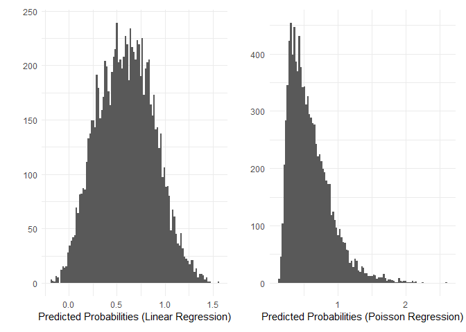<!-- -->

We observe that the predicted probabilities are not even in the correct
range $`[0, 1]`$. For comparison, we also plot the predicted
probabilities from the logistic regression alongside the actual
probabilities.

``` r
p_predict <- data.frame(p_predict = predict(glm(y ~ treatment + X1 + X2 + X3, family = binomial(link = 'logit'), data = data2), type = 'response'))
pl1 <- ggplot(p_predict, aes(x = p_predict)) +  geom_histogram(bins = 100) + labs(y = "", x = "Predicted Probabilities (Logistic Regression)") + theme_minimal()

p_actual <- p0
p_actual[treatment == 1] <- p1[treatment == 1]
pl2 <- ggplot(data.frame(p_actual), aes(x = p_actual)) +  geom_histogram(bins = 100) + labs(y = "", x = "Actual Probabilities") + theme_minimal()

(pl1 + pl2) + plot_layout(ncol = 2)
```

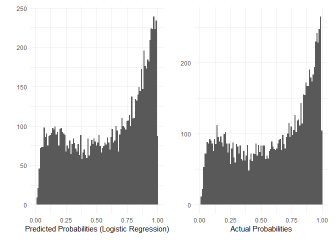<!-- -->

We see that logistic regression is quite accurate, whereas linear and
Poisson regression are way off. And no, just clipping the predicted
probabilities won’t work.

``` r
p_predict <- data.frame(p_predict = pmax(pmin(predict(lm(y ~ treatment + X1 + X2 + X3, data = data2), type = 'response'),1),0))
pl1 <- ggplot(p_predict, aes(x = p_predict)) +  geom_histogram(bins = 100) + labs(y = "", x = "Clipped Predicted Probabilities (Linear Regression)") + theme_minimal()

p_predict <- data.frame(p_predict = pmax(pmin(predict(glm(y ~ treatment + X1 + X2 + X3, family = poisson(link = 'log'), data = data2), type = 'response'),1),0))
pl2 <- ggplot(p_predict, aes(x = p_predict)) +  geom_histogram(bins = 100) + labs(y = "", x = "Clipped Predicted Probabilities (Poisson Regression)") + theme_minimal()

(pl1 + pl2) + plot_layout(ncol = 2)
```

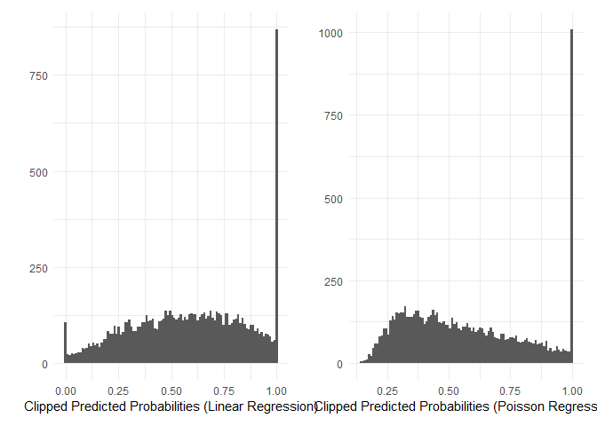<!-- -->

We should note that the variance functions are also misspecified for
linear regression and Poisson regression, so we should always recompute
standard errors using heteroskedasticity-consistent standard errors or a
paired bootstrap.

## On Interpretation of Marginal Effects

Let’s focus on risk differences for now. The expectation is linear, and
hence.
``` math
\text{RD} = \mathbb{E}Y(1) - \mathbb{E}Y(0) = \mathbb{E} (Y(1) - Y(0)
```
This might seem trivial but an important consequence of this is that
marginal risk difference

``` r
results_RD[1,1]
```

    ## [1] 0.1475964

is equal to the average of *individual* risk differences in the
population.

``` r
mean(p1-p0)
```

    ## [1] 0.1475964

However, we have to be careful here. The probabilities are bounded
between 0 and 1; hence, someone with baseline risk, say, 0.9, cannot
increase their probability to 1.05. In other words, the treatment effect
on the risk difference scale must be heterogeneous (unless the baseline
risks are far from the bounds in the direction of the effect).

We can check that by plotting the actual individual risk differences.

``` r
rd_indiv <- p1 - p0
ggplot(data.frame(rd_indiv), aes(x = rd_indiv)) +  geom_histogram(bins = 100) + labs(y = "", x = "Individual Risk Differences") + geom_vline(xintercept = mean(p1-p0), color = "red", linetype = "dashed", linewidth = 1) + theme_minimal()
```

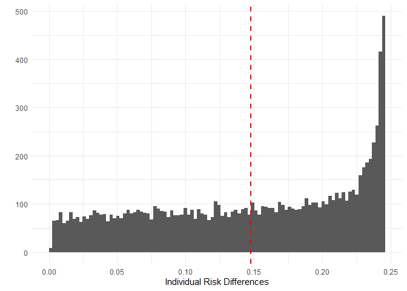<!-- -->

We see that the distribution is extremely skewed (as is often the case
for heterogeneous populations), and the spread of actual individual risk
differences is quite wide. In addition, since the treatment effect on
the risk difference is heterogeneous, the marginal risk difference value will depend on the population.

Since there is clearly heterogeneity of the effect on the risk
difference scale, there should be significant interactions in the linear
probability model, right?

``` r
summary(lm(y ~ (treatment + X1 + X2 + X3)^2, data = data2))
```

    ## 
    ## Call:
    ## lm(formula = y ~ (treatment + X1 + X2 + X3)^2, data = data2)
    ## 
    ## Residuals:
    ##      Min       1Q   Median       3Q      Max 
    ## -1.09529 -0.28884  0.05435  0.27675  1.24258 
    ## 
    ## Coefficients:
    ##               Estimate Std. Error t value Pr(>|t|)    
    ## (Intercept)   0.169709   0.014338  11.836  < 2e-16 ***
    ## treatment     0.190753   0.022968   8.305  < 2e-16 ***
    ## X1            0.106619   0.003888  27.423  < 2e-16 ***
    ## X2            0.125092   0.005300  23.602  < 2e-16 ***
    ## X3            0.369049   0.025434  14.510  < 2e-16 ***
    ## treatment:X1 -0.007339   0.002915  -2.518  0.01181 *  
    ## treatment:X2 -0.012840   0.008356  -1.537  0.12442    
    ## treatment:X3 -0.081373   0.019627  -4.146 3.41e-05 ***
    ## X1:X2        -0.005650   0.001370  -4.125 3.73e-05 ***
    ## X1:X3        -0.036614   0.003220 -11.372  < 2e-16 ***
    ## X2:X3        -0.029945   0.009149  -3.273  0.00107 ** 
    ## ---
    ## Signif. codes:  0 '***' 0.001 '**' 0.01 '*' 0.05 '.' 0.1 ' ' 1
    ## 
    ## Residual standard error: 0.3921 on 9989 degrees of freedom
    ## Multiple R-squared:  0.3618, Adjusted R-squared:  0.3612 
    ## F-statistic: 566.3 on 10 and 9989 DF,  p-value: < 2.2e-16

Indeed, they are, and they are all negative. We can look at what these
interactions mean by plotting the predicted probabilities from the
logistic regression model.

``` r
library(sjPlot)
logist_model <- glm(y ~ factor(treatment) + X1 + X2 + factor(X3), family = binomial(link = 'logit'), data = data2)

pl1 <- plot_model(logist_model, type = "pred", terms = c('X1','treatment')) + labs(title = "Predicted Probabilites", y = "Outcome")
pl2 <- plot_model(logist_model, type = "pred", terms = c('X2','treatment')) + labs(title = "Predicted Probabilites", y = "Outcome")
(pl1 + pl2) + plot_layout(ncol = 2) 
```

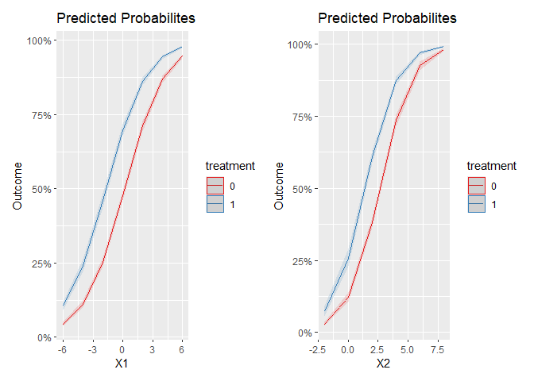<!-- -->

``` r
pl1 <- plot_model(logist_model, type = "pred", terms = c('X2', 'X3','treatment')) + labs(title = "Predicted Probabilites", y = "Outcome")
pl2 <- plot_model(logist_model, type = "pred", terms = c('X1', 'X3','treatment')) + labs(title = "Predicted Probabilites", y = "Outcome")
(pl1 + pl2) + plot_layout(ncol = 2) 
```

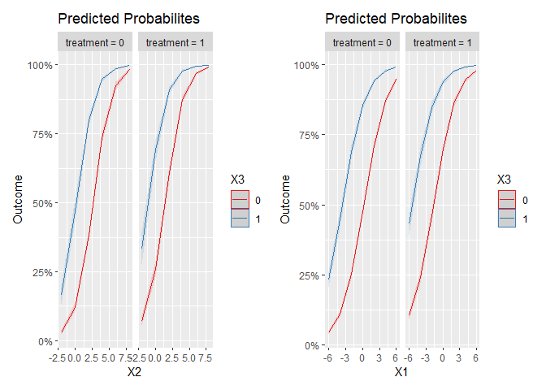<!-- -->

``` r
plot_model(logist_model, type = "pred", terms = c('X1', 'X2','treatment')) + labs(title = "Predicted Probabilites", y = "Outcome")
```

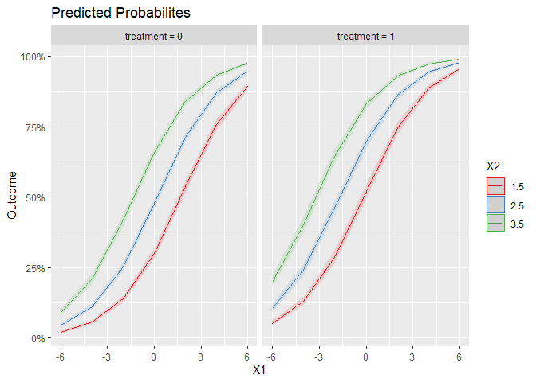<!-- -->

We notice that the trends in predicted probabilities are parallel
outside of probabilities near the boundaries. However, these boundaries
can be quite important! Let’s assume a dataset inspired by a study
(<span class="nocase">Hammond et al.</span> 1979) and (Thompson and Zhao
2023) that investigated the influence of asbestos exposure and cigarette
smoking on lung cancer.

``` r
asb_dataset <-read.csv("C:/Users/elini/Desktop/first casualty/asb_dataset.csv") 

abs_summary <- rbind(
  c(sum(asb_dataset$Lung.Cancer.Death[asb_dataset$Smoking == 1 & asb_dataset$Asbestos == 1]),
    sum(asb_dataset$Lung.Cancer.Death[asb_dataset$Smoking == 0 & asb_dataset$Asbestos == 1])),
  
  c(sum(asb_dataset$Lung.Cancer.Death[asb_dataset$Smoking == 1 & asb_dataset$Asbestos == 0]),
  sum(asb_dataset$Lung.Cancer.Death[asb_dataset$Smoking == 0 & asb_dataset$Asbestos == 0]))
)

colnames(abs_summary) <- c("Asbestos Workers (n = 17800)", "Comparison Group (n = 73763)")
rownames(abs_summary) <- c("Smokers", "Non-smokers")
abs_summary
```

    ##             Asbestos Workers (n = 17800) Comparison Group (n = 73763)
    ## Smokers                              107                           10
    ## Non-smokers                           89                            8

Let’s quickly analyze data across all three scales (risk difference,
risk ratio, odds ratio) by fitting linear, Poisson, and logistic models,
respectively.

``` r
summary(lm(Lung.Cancer.Death ~ Smoking*Asbestos,data = asb_dataset))
```

    ## 
    ## Call:
    ## lm(formula = Lung.Cancer.Death ~ Smoking * Asbestos, data = asb_dataset)
    ## 
    ## Residuals:
    ##      Min       1Q   Median       3Q      Max 
    ## -0.02147 -0.00431 -0.00015 -0.00015  0.99985 
    ## 
    ## Coefficients:
    ##                   Estimate Std. Error t value Pr(>|t|)    
    ## (Intercept)      0.0001506  0.0002085   0.723    0.470    
    ## Smoking          0.0041587  0.0003940  10.556   <2e-16 ***
    ## Asbestos         0.0006296  0.0004728   1.332    0.183    
    ## Smoking:Asbestos 0.0165298  0.0008935  18.500   <2e-16 ***
    ## ---
    ## Signif. codes:  0 '***' 0.001 '**' 0.01 '*' 0.05 '.' 0.1 ' ' 1
    ## 
    ## Residual standard error: 0.04804 on 91559 degrees of freedom
    ## Multiple R-squared:  0.01026,    Adjusted R-squared:  0.01022 
    ## F-statistic: 316.2 on 3 and 91559 DF,  p-value: < 2.2e-16

``` r
summary(glm(Lung.Cancer.Death ~ Smoking*Asbestos, family = poisson,data = asb_dataset))
```

    ## 
    ## Call:
    ## glm(formula = Lung.Cancer.Death ~ Smoking * Asbestos, family = poisson, 
    ##     data = asb_dataset)
    ## 
    ## Coefficients:
    ##                  Estimate Std. Error z value Pr(>|z|)    
    ## (Intercept)      -8.80068    0.35347 -24.898  < 2e-16 ***
    ## Smoking           3.35370    0.36902   9.088  < 2e-16 ***
    ## Asbestos          1.64481    0.47428   3.468 0.000524 ***
    ## Smoking:Asbestos -0.03899    0.49550  -0.079 0.937274    
    ## ---
    ## Signif. codes:  0 '***' 0.001 '**' 0.01 '*' 0.05 '.' 0.1 ' ' 1
    ## 
    ## (Dispersion parameter for poisson family taken to be 1)
    ## 
    ##     Null deviance: 2593.2  on 91562  degrees of freedom
    ## Residual deviance: 2075.5  on 91559  degrees of freedom
    ## AIC: 2511.5
    ## 
    ## Number of Fisher Scoring iterations: 10

``` r
summary(glm(Lung.Cancer.Death ~ Smoking*Asbestos, family = binomial,data = asb_dataset))
```

    ## 
    ## Call:
    ## glm(formula = Lung.Cancer.Death ~ Smoking * Asbestos, family = binomial, 
    ##     data = asb_dataset)
    ## 
    ## Coefficients:
    ##                  Estimate Std. Error z value Pr(>|z|)    
    ## (Intercept)      -8.80053    0.35356 -24.891  < 2e-16 ***
    ## Smoking           3.35787    0.36918   9.096  < 2e-16 ***
    ## Asbestos          1.64544    0.47443   3.468 0.000524 ***
    ## Smoking:Asbestos -0.02224    0.49590  -0.045 0.964229    
    ## ---
    ## Signif. codes:  0 '***' 0.001 '**' 0.01 '*' 0.05 '.' 0.1 ' ' 1
    ## 
    ## (Dispersion parameter for binomial family taken to be 1)
    ## 
    ##     Null deviance: 3020.7  on 91562  degrees of freedom
    ## Residual deviance: 2500.8  on 91559  degrees of freedom
    ## AIC: 2508.8
    ## 
    ## Number of Fisher Scoring iterations: 11

There is quite a strong interaction on the risk difference scale and no
interactions on the risk ratio and odds ratio scales. Notice also that
the odds ratios are almost identical to the risk ratios. This is because
the predicted probabilities are almost zero, and thus
``` math
\text{OR} = \frac{P[Y(1) = 1]}{P[Y(1) = 0]}/\frac{P[Y(0) = 1]}{P[Y(0) = 0]} \approx \frac{P[Y(1) = 1]}{1}/\frac{P[Y(0) = 1]}{1} = \text{RR}
```
Let us plot the predicted probabilities of lung cancer deaths based on
the data. First, the smoking.

``` r
logistic_asb <- glm(Lung.Cancer.Death ~ factor(Smoking)*factor(Asbestos), family = binomial,data = asb_dataset)

plot_model(logistic_asb, type = "pred", terms = c('Smoking')) + labs(title = "Predicted Probabilites", y = "Lung Cancer Death")
```

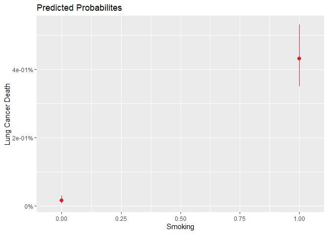<!-- -->

We see that the probability increased from near zero (for an individual
with **Asbestos** = 0) to about 0.4%. Let’s plot the effect of asbestos
next.

``` r
plot_model(logistic_asb, type = "pred", terms = c('Asbestos')) + labs(title = "Predicted Probabilites", y = "Lung Cancer Death")
```

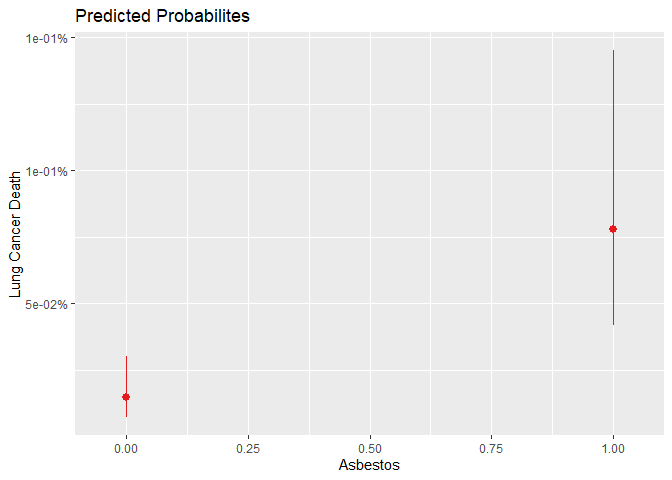<!-- -->

We see the increase to about 0.75%. What if these risk factors affect
someone together?

``` r
plot_model(logistic_asb, type = "pred", terms = c('Smoking','Asbestos')) + labs(title = "Predicted Probabilites", y = "Outcome")
```

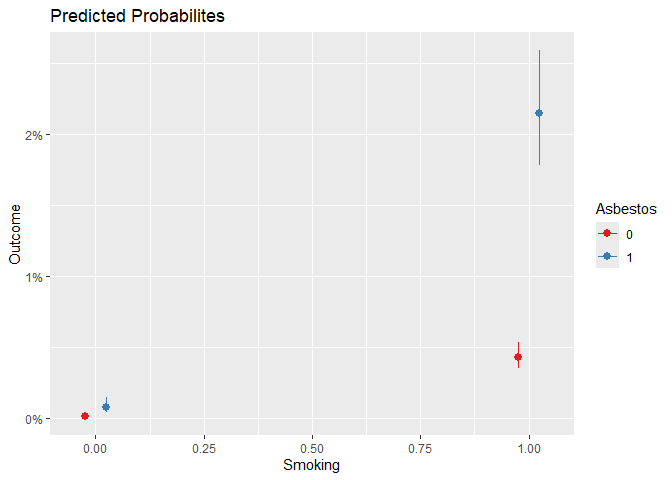<!-- -->

The risk increased by over 2%; this is more than double the sum of the
increases from adding these two risks. On the additive scale, these two
risk factors are clearly multiplicative, i.e., there is clearly a
meaningful interaction.

Let’s move to the marginal risk ratio. Our observations about it will be
similar to those about marginal risk difference. One major change is
that
``` math
\text{RR} = \frac{\mathbb{E}Y(1)}{\mathbb{E}Y(0)} \neq \mathbb{E} \frac{Y(1)}{Y(0)},
```
i.e., the marginal risk ratio does not equal the average of individual
risk ratios, which further worsens the interpretability in terms of
individual predictions.

``` r
# marginal risk ratio
results_RR[1,1]
```

    ## [1] 1.268864

``` r
# average of individual risk ratios
mean(p1/p0)
```

    ## [1] 1.521396

We can again plot the distribution of individual risk ratios obtained by
the logistic regression model.

``` r
rr_indiv <- p1/p0
ggplot(data.frame(rd_indiv), aes(x = rr_indiv)) +  geom_histogram(bins = 100) + 
  labs(y = "", x = "Individual Risk Ratios") + 
  geom_vline(xintercept = results_RR[1,1], color = "red", linetype = "dashed", linewidth = 1) +
  geom_vline(xintercept = mean(p1/p0), color = "blue", linetype = "dashed", linewidth = 1) + 
  annotate(geom = "text", x = mean(p1/p0), y = +Inf, 
           label = "Average Ind. RR", color = "blue", 
           vjust = 1.5, hjust = -0.1) + 
  annotate(geom = "text", x = results_RR[1,1], y = +Inf, 
           label = "Marg. RR", color = "red", 
           vjust = 1.5, hjust = -0.1) +
  theme_minimal()
```

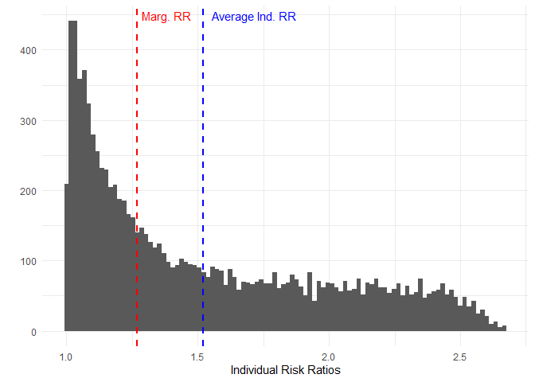<!-- -->

Again, because the probability of $`Y = 1`$ cannot exceed 1, the
treatment effect, in terms of risk ratios, is often heterogeneous.
Notice that there are individuals for whom the treatment more than
doubles the risk, and for some, the treatment does nothing.

The Poisson model will include significant interactions due to this
heterogeneity.

``` r
summary(glm(y ~ (treatment + X1 + X2 + X3)^2, family = poisson(link = 'log'), data = data2))
```

    ## 
    ## Call:
    ## glm(formula = y ~ (treatment + X1 + X2 + X3)^2, family = poisson(link = "log"), 
    ##     data = data2)
    ## 
    ## Coefficients:
    ##               Estimate Std. Error z value Pr(>|z|)    
    ## (Intercept)  -1.733436   0.062333 -27.810  < 2e-16 ***
    ## treatment     0.581599   0.081876   7.103 1.22e-12 ***
    ## X1            0.313539   0.015073  20.802  < 2e-16 ***
    ## X2            0.316802   0.020470  15.476  < 2e-16 ***
    ## X3            1.019543   0.084345  12.088  < 2e-16 ***
    ## treatment:X1 -0.052883   0.009799  -5.397 6.78e-08 ***
    ## treatment:X2 -0.082235   0.026898  -3.057  0.00223 ** 
    ## treatment:X3 -0.236133   0.058360  -4.046 5.21e-05 ***
    ## X1:X2        -0.041596   0.004713  -8.826  < 2e-16 ***
    ## X1:X3        -0.116807   0.010068 -11.601  < 2e-16 ***
    ## X2:X3        -0.153745   0.028029  -5.485 4.13e-08 ***
    ## ---
    ## Signif. codes:  0 '***' 0.001 '**' 0.01 '*' 0.05 '.' 0.1 ' ' 1
    ## 
    ## (Dispersion parameter for poisson family taken to be 1)
    ## 
    ##     Null deviance: 6163.0  on 9999  degrees of freedom
    ## Residual deviance: 4493.1  on 9989  degrees of freedom
    ## AIC: 16447
    ## 
    ## Number of Fisher Scoring iterations: 5

As far as the marginal odds ratio is concerned, again due to the
non-linearity of its computation, it does not equal the average of the
individual odds ratios.

``` r
# marginal odds ratio
results_OR[1,1]
```

    ## [1] 1.886052

``` r
# average of individual odds ratios
mean((p1/(1-p1))/(p0/(1-p0)))
```

    ## [1] 2.718282

One major difference between the odds ratio and risk ratio and risk
difference is that the effect on the odds ratio scale can be homogeneous
for any baseline risk $`P[Y=1 \mid \text{Treatment} = 0]`$. By
increasing the odds, we will never cause the predicted probability
$`P[Y=1 \mid \text{Treatment} = 1]`$ to be greater than one. For
example, let’s plot the distribution of individual odds ratios for our
data.

``` r
rr_indiv <- (p1/(1-p1))/(p0/(1-p0))
ggplot(data.frame(rd_indiv), aes(x = rr_indiv)) +  geom_histogram(bins = 100) + 
  labs(y = "", x = "Individual Odds Ratios") + 
  geom_vline(xintercept = results_OR[1,1], color = "red", linetype = "dashed", linewidth = 1) + 
  annotate(geom = "text", x = results_OR[1,1], y = +Inf, 
           label = "Marg. OR", color = "red", 
           vjust = 1.5, hjust = -0.1) +
  theme_minimal()
```

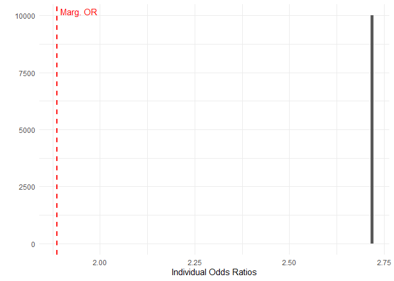<!-- -->

Indeed, the individual odds ratios are all the same. This is because we
generated the outcome probabilities using a logistic model with no
interaction terms. What is also interesting is that the marginal odds
ratio is some completely different (and quite lower) value than the
individual odds ratios. So, what even are marginal odds ratios and
marginal risk ratio?

Well, if we consider the whole population and compare the effects of
treating everyone vs. treating no one. The ratio of the number of
outcomes $`Y=1`$ in the population is the marginal risk ratio

``` r
sum(y1)/sum(y0)
```

    ## [1] 1.266459

not the average of individual risk ratios.

``` r
mean(p1/p0)
```

    ## [1] 1.521396

And similarly, if we evaluate the relative change of the outcome for the
whole population in terms of odds

``` r
(mean(y1)/mean(1-y1))/(mean(y0)/mean(1-y0))
```

    ## [1] 1.866535

we get the marginal odds ratio, not the individual-level odds ratio. So,
if we are interested in the effect of treatment on the population as a
whole, we should speak in terms of marginal effect. But we should not
use marginal risk or odds ratios when talking about individuals.

## Conditional Effects

If we go back and look at how we computed the marginal odds ratio, we
notice that we estimated it from the predicted probabilities for all
three models. Unlike in linear and Poisson regression, the adjusted
treatment effect in logistic regression (the coefficient) does not
correspond to an estimate of the marginal effect.

Let’s have a look at what the coefficient actually estimates.

``` r
c_odds <- t(results[,13])
colnames(c_odds) <- c('mean', 'sd')
rownames(c_odds) <- c('Treatment coef.')
c_odds
```

    ##                     mean        sd
    ## Treatment coef. 2.704408 0.1144561


``` r
set.seed(123)

n_pop <- 10000
n_sim <- 1000

estimates <- matrix(0,n_sim,20)

for (i in 1:n_sim){
  
  treatment2 <- sample(c(rep(0,n_pop-round(n_pop/3)),rep(1,round(n_pop/3))))
  
  y <- y0
  y[treatment2 == 1] <- y1[treatment2 == 1]
  
  data3 <- data.frame(y = y, treatment = treatment2, X1 = X1, X2 = X2, X3 = X3, p0 = p0, p1 = p1, y0 = y0, y1 = y1)
  
  data3_0 <- data3
  data3_1 <- data3
  data3_0$treatment <- 0
  data3_1$treatment <- 1
  
  logist_model1 <- glm(y ~ treatment, family = binomial(link = 'logit'), data = data3)
  logist_model2 <- glm(y ~ treatment + X1, family = binomial(link = 'logit'), data = data3)
  logist_model3 <- glm(y ~ treatment + X1 + X2, family = binomial(link = 'logit'), data = data3)
  logist_model4 <- glm(y ~ treatment + X1 + X2 + X3, family = binomial(link = 'logit'), data = data3)
  
  estimates[i,1] <- exp(coefficients(logist_model1))[2]
  estimates[i,2] <- exp(coefficients(logist_model2))[2]
  estimates[i,3] <- exp(coefficients(logist_model3))[2]
  estimates[i,4] <- exp(coefficients(logist_model4))[2]

  y1_pred_logist1 <- predict(logist_model1, data3_1, type = 'response')
  y0_pred_logist1 <- predict(logist_model1, data3_0, type = 'response')
  y1_pred_logist2 <- predict(logist_model2, data3_1, type = 'response')
  y0_pred_logist2 <- predict(logist_model2, data3_0, type = 'response')
  y1_pred_logist3 <- predict(logist_model3, data3_1, type = 'response')
  y0_pred_logist3 <- predict(logist_model3, data3_0, type = 'response')
  y1_pred_logist4 <- predict(logist_model4, data3_1, type = 'response')
  y0_pred_logist4 <- predict(logist_model4, data3_0, type = 'response')
  
  estimates[i,5] <- mean(y1_pred_logist1 - y0_pred_logist1)
  estimates[i,6] <- mean(y1_pred_logist2 - y0_pred_logist2)
  estimates[i,7] <- mean(y1_pred_logist3 - y0_pred_logist3)
  estimates[i,8] <- mean(y1_pred_logist4 - y0_pred_logist4)
  
  estimates[i,9] <-  mean(y1_pred_logist1)/mean(y0_pred_logist1)
  estimates[i,10] <- mean(y1_pred_logist2)/mean(y0_pred_logist2)
  estimates[i,11] <- mean(y1_pred_logist3)/mean(y0_pred_logist3)
  estimates[i,12] <- mean(y1_pred_logist4)/mean(y0_pred_logist4)
  
  estimates[i,13] <- (mean(y1_pred_logist1)/mean(1-y1_pred_logist1))/(mean(y0_pred_logist1)/mean(1-y0_pred_logist1))
  estimates[i,14] <- (mean(y1_pred_logist2)/mean(1-y1_pred_logist2))/(mean(y0_pred_logist2)/mean(1-y0_pred_logist2))
  estimates[i,15] <- (mean(y1_pred_logist3)/mean(1-y1_pred_logist3))/(mean(y0_pred_logist3)/mean(1-y0_pred_logist3))
  estimates[i,16] <- (mean(y1_pred_logist4)/mean(1-y1_pred_logist4))/(mean(y0_pred_logist4)/mean(1-y0_pred_logist4))
  
  estimates[i,17] <- mean(y1_pred_logist1/y0_pred_logist1)
  estimates[i,18] <- mean(y1_pred_logist2/y0_pred_logist2)
  estimates[i,19] <- mean(y1_pred_logist3/y0_pred_logist3)
  estimates[i,20] <- mean(y1_pred_logist4/y0_pred_logist4)

}
```

Let’s consider marginal effect first.

``` r
results2 <- rbind(
  apply(estimates,2,mean),
  apply(estimates,2,sd))


results_RD2 <- rbind(
  c(mean(p1) - mean(p0), NA),
  t(results2[,c(5,6,7,8)])
)

colnames(results_RD2) <-  c('RD Estimate', 'sd')
rownames(results_RD2) <-  c('True Marginal RD', 'LogReg Tr', 'LogReg Tr+X1', 'LogReg Tr+X1-2', 'LogReg Tr+X1-3')
results_RD2
```

    ##                  RD Estimate          sd
    ## True Marginal RD   0.1475964          NA
    ## LogReg Tr          0.1458381 0.008169442
    ## LogReg Tr+X1       0.1458171 0.006768441
    ## LogReg Tr+X1-2     0.1457509 0.006315613
    ## LogReg Tr+X1-3     0.1457294 0.005873547

We observe that all four give the same estimate of marginal risk
difference. The only difference is that the more accurate models have
lower standard errors. The same is true for marginal risk ratio

``` r
results_RR2 <- rbind(
  c(mean(p1)/mean(p0), NA),
  t(results2[,c(9,10,11,12)])
)

colnames(results_RR2) <-  c('RR Estimate', 'sd')
rownames(results_RR2) <-  c('True Marginal RR', 'LogReg Tr', 'LogReg Tr+X1', 'LogReg Tr+X1-2', 'LogReg Tr+X1-3')
results_RR2
```

    ##                  RR Estimate         sd
    ## True Marginal RR    1.268864         NA
    ## LogReg Tr           1.266769 0.01611819
    ## LogReg Tr+X1        1.266699 0.01325022
    ## LogReg Tr+X1-2      1.266562 0.01232456
    ## LogReg Tr+X1-3      1.266516 0.01139507

and the marginal odds ratio.

``` r
results_OR2 <- rbind(
  c((mean(p1)/mean(1-p1))/(mean(p0)/mean(1-p0)), NA),
  t(results2[,c(13,14,15,16)])
)

colnames(results_OR2) <-  c('OR Estimate', 'sd')
rownames(results_OR2) <-  c('True Marginal OR', 'LogReg Tr', 'LogReg Tr+X1', 'LogReg Tr+X1-2', 'LogReg Tr+X1-3')
results_OR2
```

    ##                  OR Estimate         sd
    ## True Marginal OR    1.886052         NA
    ## LogReg Tr           1.869365 0.06900552
    ## LogReg Tr+X1        1.868736 0.05743446
    ## LogReg Tr+X1-2      1.868045 0.05360871
    ## LogReg Tr+X1-3      1.867741 0.05006562

However, let’s consider the conditional odds ratios.

``` r
results_COR2 <- rbind(
  c(mean((p1/(1-p1))/(p0/(1-p0))), NA),
  t(results2[,c(1,2,3,4)])
)

colnames(results_COR2) <-  c('OR Estimate', 'sd')
rownames(results_COR2) <-  c('True Conditional COR', 'LogReg Tr', 'LogReg Tr+X1', 'LogReg Tr+X1-2', 'LogReg Tr+X1-3')
results_COR2
```

    ##                      OR Estimate         sd
    ## True Conditional COR    2.718282         NA
    ## LogReg Tr               1.869365 0.06900552
    ## LogReg Tr+X1            2.263974 0.09057963
    ## LogReg Tr+X1-2          2.445794 0.10066035
    ## LogReg Tr+X1-3          2.710672 0.11672715

The estimates are different! The only model that converges to the
correct value is the last one that includes all relevant variables. We
discussed this briefly in Part Three and referred to it as the
*noncollapsibility* of the conditional odds ratio (Schuster et al.
2021). The conditional estimates of the treatment effect are biased
downward (towards zero) by all omitted variables, even those that are
unconfounded.

The way to understand why is to realize that models for binary responses
directly model the probabilities of the outcome for each individual.
This means that if the system is very random, the predicted
probabilities for each individual will be very close to the overall
prevalence of the outcome. And in this case, the effect of the risk
factor will appear small, i.e., the conditional odds ratios will be
close to zero. But when the system is almost deterministic and
covariates perfectly predict the outcome, knowing all the covariates and
whether the individual was treated or not will determine the outcome.
The probability of the outcome will collapse to exactly 0 or 1, and the
effect of the treatment on an individual’s odds is essentially infinite.

Looking at the table this way, the results make perfect sense. By
omitting important variables in the model, the model becomes inherently
more non-deterministic; hence, the effect of the treatment on the
outcome, in terms of conditional odds ratios, will appear weaker.

We should note that this does not affect only the conditional odds
ratio. Let’s say we want to estimate the average individual risk ratio,
i.e., a conditional effect.

``` r
results_COR2 <- rbind(
  c(mean(p1/p0), NA),
  t(results2[,c(17,18,19,20)])
)

colnames(results_COR2) <-  c('RR Estimate', 'sd')
rownames(results_COR2) <-  c('True Average Ind. RR', 'LogReg Tr', 'LogReg Tr+X1', 'LogReg Tr+X1-2', 'LogReg Tr+X1-3')
results_COR2
```

    ##                      RR Estimate         sd
    ## True Average Ind. RR    1.521396         NA
    ## LogReg Tr               1.266769 0.01611819
    ## LogReg Tr+X1            1.388004 0.02151327
    ## LogReg Tr+X1-2          1.443931 0.02414475
    ## LogReg Tr+X1-3          1.525341 0.02821297

We see the same effect: the simpler models underestimate the effect for
a given individual. We can also look at this through the lens of the
distribution of the predicted probabilities of $`Y = 0`$.

``` r
p_predict <- data.frame(p_predict = predict(glm(y ~ treatment, family = binomial(link = 'logit'), data = data2), type = 'response'))
pl1 <- ggplot(p_predict, aes(x = p_predict)) +  geom_histogram(bins = 100) + labs(y = "", x = "Predicted Probabilities (Logistic Regression)") + theme_minimal()


p_predict <- data.frame(p_predict = predict(glm(y ~ treatment + X1, family = binomial(link = 'logit'), data = data2), type = 'response'))
pl2 <- ggplot(p_predict, aes(x = p_predict)) +  geom_histogram(bins = 100) + labs(y = "", x = "Predicted Probabilities (Logistic Regression)") + theme_minimal()


(pl1 + pl2) + plot_layout(ncol = 2)
```

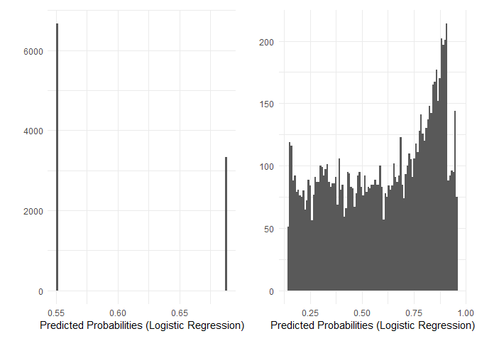<!-- -->

``` r
p_predict <- data.frame(p_predict = predict(glm(y ~ treatment + X1 + X2, family = binomial(link = 'logit'), data = data2), type = 'response'))
pl1 <- ggplot(p_predict, aes(x = p_predict)) +  geom_histogram(bins = 100) + labs(y = "", x = "Predicted Probabilities (Logistic Regression)") + theme_minimal()


p_predict <- data.frame(p_predict = predict(glm(y ~ treatment + X1 + X2 + X3, family = binomial(link = 'logit'), data = data2), type = 'response'))
pl2 <- ggplot(p_predict, aes(x = p_predict)) +  geom_histogram(bins = 100) + labs(y = "", x = "Predicted Probabilities (Logistic Regression)") + theme_minimal()


(pl1 + pl2) + plot_layout(ncol = 2)
```

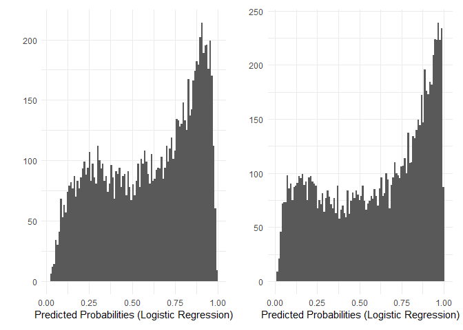<!-- -->

We notice that a more complex model becomes more certain, and that more
probabilities approach 0 or 1.

To sum up, conditional effects represent the effects on individuals, and
hence, to estimate them accurately, we need the most accurate model
possible of individual outcome probabilities. If we leave some important
covariates out of the model, we will underestimate the variables’
effects on individual risks. The marginal treatment effects do not
suffer from this because they are population-level effects, and we can
always estimate them unbiasedly using an unadjusted model, provided
there is no confounding.

## Influence of Prevalence on Marginal Effects

We discussed that, for a heterogeneous population, the treatment effect
on the risk ratio and risk difference scales is almost always inherently
heterogeneous despite being constant on the odds ratio scale. This implies that the marginal risk ratio and risk difference will depend heavily on the population they were computed on and might not be easily generalizable to another population. Let’s investigate the influence of one important characteristic of any population with respect to a binary outcome, the *prevalence* of $`Y`$.

First, we will assume a homogeneous population. i.e., everyone has the
same baseline risk $`P[Y(0)=1 \mid \text{Treatment}]`$. Further, we will
assume that the treatment effect, in terms of conditional odds ratios,
is constant. We will now change the baseline risk (prevalence in the
non-treated group) and plot marginal effects.

``` r
prevalence <- seq(-5,5,0.5)
treatment_COR <- log(c(0.1,0.2,0.5,0.8, 1.25,2,5,10))


stat_table <- matrix(0,length(prevalence)*length(treatment_COR),5)
  
k <- 1 

for (i in 1:length(prevalence)){
  
  for (j in 1:length(treatment_COR)){
    
    
    p0k <- 1/(1 + exp(-prevalence[i]))
    p1k <- 1/(1 + exp(-prevalence[i] - treatment_COR[j]))

    stat_table[k,1] <- p0k
    stat_table[k,2] <- exp(treatment_COR[j])
    stat_table[k,3] <- mean(p1k-p0k)
    stat_table[k,4] <- mean(p1k)/mean(p0k)
    stat_table[k,5] <- ((mean(p1k)/mean(1-p1k)))/((mean(p0k)/mean(1-p0k)))

    k <- k+1
}
  
}

colnames(stat_table) <- c('Prevalence','COR','MRD','MRR','MOR')

stat_table <- data.frame(stat_table)
stat_table$COR <- factor(stat_table$COR)
```

Let’s start with risk ratios.

``` r
ggplot(data = stat_table, aes(x = Prevalence, y = MRR, color = COR, group = COR)) +
  geom_line(linewidth = 1.1) +
  labs(x = "Prevalence in Untreated Group",
       y = "Marginal Risk Ratio",
       color = "Conditional Odds Ratio") + theme_minimal()
```

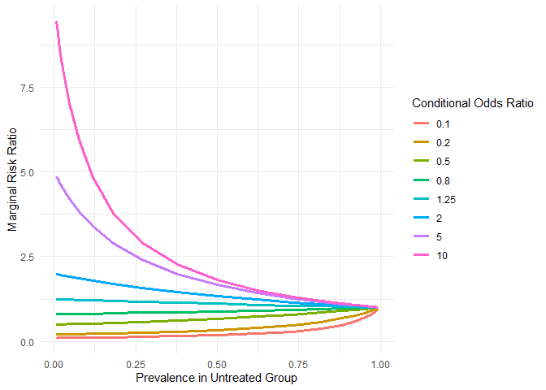<!-- -->

We observe that the conditional odds ratio equals the marginal risk
ratio for low prevalence. However, the risk ratio approaches 1 as the
prevalence increases. This is an important, well-known observation that
the conditional odds ratio overestimates the risk ratio at high
prevalence.

Let’s plot the risk difference next.

``` r
ggplot(data = stat_table, aes(x = Prevalence, y = MRD, color = COR, group = COR)) +
  geom_line(linewidth = 1.1) +
  labs(x = "Prevalence in Untreated Group",
       y = "Marginal Risk Difference",
       color = "Conditional Odds Ratio") + theme_minimal()
```

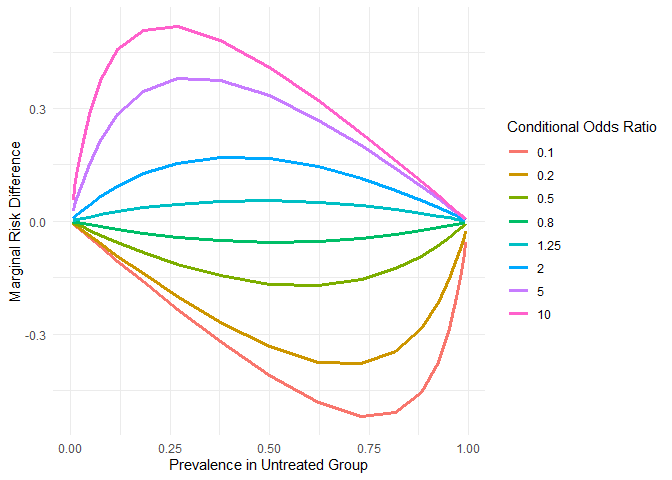<!-- -->

We see that the relation is not even monotonic; for conditional odds
near 1, the marginal risk difference is maximized at prevalence 0.5.
More extreme conditional odds skew the maximum toward 0 or 1.

``` r
ggplot(data = stat_table, aes(x = Prevalence, y = MOR, color = COR, group = COR)) +
  geom_line(linewidth = 1.1) +
  labs(x = "Prevalence in Untreated Group",
       y = "Marginal Risk Difference",
       color = "Conditional Odds Ratio") + theme_minimal()
```

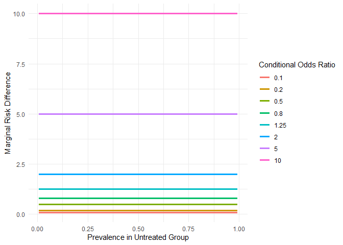<!-- -->

Provided that the baseline risk is homogeneous, the marginal odds ratio
equals the conditional one.

Now, let’s assume that the group is not homogeneous with respect to the baseline risk. We add a variable $X \sim N(0,6.25)$ with coefficient 1 in the logistic model and simulate a population of 10000.

``` r
prevalence <- seq(-8,5,0.8)
treatment_COR <- log(c(0.1,0.2,0.5,0.8, 1.25,2,5,10))

X <- rnorm(10000,0,2.5)
stat_table <- matrix(0,length(prevalence)*length(treatment_COR),5)
 
k <- 1 

for (i in 1:length(prevalence)){
  
  for (j in 1:length(treatment_COR)){
    
    
    p0k <- 1/(1 + exp(-prevalence[i] - X))
    p1k <- 1/(1 + exp(-prevalence[i] - X - treatment_COR[j]))
    
    stat_table[k,1] <- mean(p0k)
    stat_table[k,2] <- exp(treatment_COR[j])
    stat_table[k,3] <- mean(p1k-p0k)
    stat_table[k,4] <- mean(p1k)/mean(p0k)
    stat_table[k,5] <- ((mean(p1k)/mean(1-p1k)))/((mean(p0k)/mean(1-p0k)))

    k <- k+1
}
  
}

colnames(stat_table) <- c('Prevalence','COR','MRD','MRR','MOR')

stat_table <- data.frame(stat_table)
```

``` r
ggplot(data = stat_table, aes(x = Prevalence, y = MRR, color = factor(COR), group = factor(COR))) +
  geom_line(linewidth = 1.1) +
  labs(x = "Prevalence in Untreated Group",
       y = "Marginal Risk Ratio",
       color = "Conditional Odds Ratio") + theme_minimal()
```

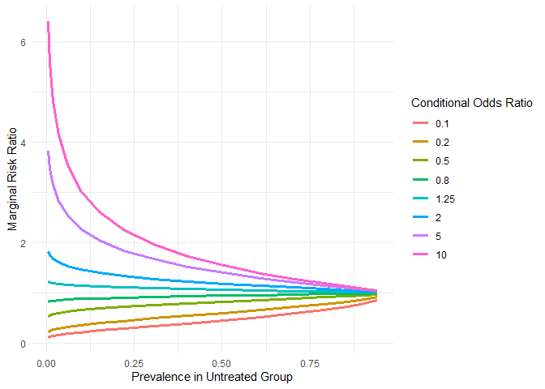<!-- -->

Marginal risk ratios follow a similar trend to that observed when the
group was homogeneous. However, conditional odds ratios no longer equal
marginal risk ratios at low prevalence; they are slightly overestimated
(away from 1). As we will see, marginal risk ratios are now closer to
marginal odds ratios.

``` r
ggplot(data = stat_table, aes(x = Prevalence, y = MRD, color = factor(COR), group = factor(COR))) +
  geom_line(linewidth = 1.1) +
  labs(x = "Prevalence in Untreated Group",
       y = "Marginal Risk Difference",
       color = "Conditional Odds Ratio") + theme_minimal()
```

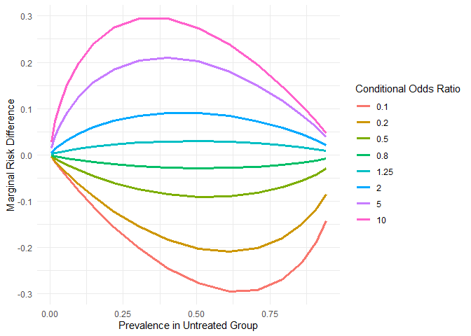<!-- -->

The marginal risk differences follows a trend similar to that of a
homogeneous group. The main difference is behavior near 1, where we
observe that the marginal differences are a bit more spread (for a
homogeneous group, the values were closer to 0).

``` r
ggplot(data = stat_table, aes(x = Prevalence, y = MOR, color = factor(COR), group = factor(COR))) +
  geom_line(linewidth = 1.1) +
  labs(x = "Prevalence",
       y = "Marginal Odds Ratio",
       color = "Conditional Odds Ratio") + theme_minimal()
```

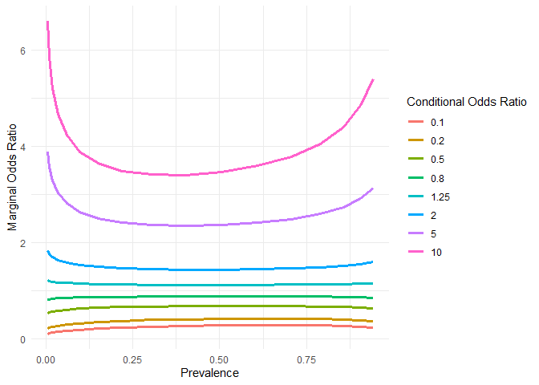<!-- -->

We observe that marginal odds ratios are closer to 1 than conditional
odds ratios. If we compare the values near zero prevalence, they are
closer to marginal risk ratios than the conditional risk ratios.

``` r
max(abs((stat_table$MOR - stat_table$MRR)[stat_table$Prevalence < 0.05]))
```

    ## [1] 0.5193698

``` r
max(abs((stat_table$COR - stat_table$MRR)[stat_table$Prevalence < 0.05]))
```

    ## [1] 5.858702

We observe that prevalence substantially influences marginal effects,
which we must take into account when interpreting experimental or study
results and translating them to the general population.

Overall, we learned that evaluating the treatment effect for a binary
outcome is much more involved than for a continuous outcome. Conditional
odds ratios provide the fullest picture but are very hard to estimate,
requiring that all major risk factors be included in the model, not just
confounders. Marginal effects can be estimated much more simply, but
they do not relate to individual risks as well, and they most likely
differ quite a lot from one population to another.

There have been a ton of papers such as (Gnardellis et al. 2022), (Doi
et al. 2022), (Xiao et al. 2022), (Norton et al. 2024), and blogs
<https://cameronpatrick.com/post/2023/07/logit-rd-rr/#fn3> and
<https://www.fharrell.com/post/robcov/>, and many more about which
effect estimates are better based on their interpretability,
portability, comparability, etc. We demonstrated here that looking for a
single perfect summary metric is kind of pointless. As Frank Harrell
puts it in <https://www.fharrell.com/post/rdist/>

*The never-ending discussion about the choice of effect measures when Y
is binary is best resolved by avoiding the oversimplifications that are
required to make such choices.*

## References

<div id="refs" class="references csl-bib-body hanging-indent">

<div id="ref-cheng2025perspective" class="csl-entry">

Cheng, Yiming, Ping Chen, and Yan Li. 2025. “A Perspective on the Use of
Poisson Versus Logistic Regression in Exposure–Response Analysis:
Insights and Considerations.” *CPT: Pharmacometrics & Systems
Pharmacology* 14 (12): 1900–1903.

</div>

<div id="ref-doi2022controversy" class="csl-entry">

Doi, Suhail A, Luis Furuya-Kanamori, Chang Xu, Lifeng Lin, Tawanda
Chivese, and Lukman Thalib. 2022. “Controversy and Debate: Questionable
Utility of the Relative Risk in Clinical Research: Paper 1: A Call for
Change to Practice.” *Journal of Clinical Epidemiology* 142: 271–79.

</div>

<div id="ref-gehrmann2010logistic" class="csl-entry">

Gehrmann, Ulrich, Oliver Kuss, Jürgen Wellmann, and Ralf Bender. 2010.
“Logistic Regression Was Preferred to Estimate Risk Differences and
Numbers Needed to Be Exposed Adjusted for Covariates.” *Journal of
Clinical Epidemiology* 63 (11): 1223–31.

</div>

<div id="ref-gnardellis2022overestimation" class="csl-entry">

Gnardellis, Charalambos, Venetia Notara, Maria Papadakaki, Vasilis
Gialamas, and Joannes Chliaoutakis. 2022. “Overestimation of Relative
Risk and Prevalence Ratio: Misuse of Logistic Modeling.” *Diagnostics*
12 (11): 2851.

</div>

<div id="ref-hammond1979asbestos" class="csl-entry">

<span class="nocase">Hammond, Edward Cuyler, Irving J Selikoff, Herbert
Seidman, et al.</span> 1979. “Asbestos Exposure, Cigarette Smoking and
Death Rates.” *ANNALS N. Y. ACAD. SCI.* 330: 473–90.

</div>

<div id="ref-norton2024requiem" class="csl-entry">

Norton, Edward C, Bryan E Dowd, Melissa M Garrido, and Matthew L
Maciejewski. 2024. “Requiem for Odds Ratios.” *Health Services Research*
59 (4): e14337.

</div>

<div id="ref-schuster2021noncollapsibility" class="csl-entry">

Schuster, Noah A, Jos WR Twisk, Gerben Ter Riet, Martijn W Heymans, and
Judith JM Rijnhart. 2021. “Noncollapsibility and Its Role in Quantifying
Confounding Bias in Logistic Regression.” *BMC Medical Research
Methodology* 21 (1): 136.

</div>

<div id="ref-thompson2023choosing" class="csl-entry">

Thompson, David M, and Yan Daniel Zhao. 2023. “Choosing Statistical
Models to Assess Biological Interaction as a Departure from Additivity
of Effects.” *arXiv Preprint arXiv:2301.03349*.

</div>

<div id="ref-xiao2022controversy" class="csl-entry">

Xiao, Mengli, Yong Chen, Stephen R Cole, Richard F MacLehose, David B
Richardson, and Haitao Chu. 2022. “Controversy and Debate: Questionable
Utility of the Relative Risk in Clinical Research: Paper 2: Is the Odds
Ratio ‘Portable’ in Meta-Analysis? Time to Consider Bivariate
Generalized Linear Mixed Model.” *Journal of Clinical Epidemiology* 142:
280–87.

</div>

</div>
