# The First Casualty of Statistics: Part Fifteen
<big>**Multi-Category Treatment**</big>

<br/>
Jiří Fejlek

2026-09-12
<br/>

<br/> In this project, we will investigate situations in which the treatment
has more than two levels (i.e., not just treated and untreated). We will
see that assuming non-binary categorical treatment does not
substantially change the causal inference. <br/>

## Table of Contents

- [The MineThatData E-Mail Analytics And Data Mining
  Challenge](#the-minethatdata-e-mail-analytics-and-data-mining-challenge)
- [Estimating ATE for Multi-Category
  Treatment](#estimating-ate-for-multi-category-treatment)
- [Modeling the Outcome (Money
  Spent)](#modeling-the-outcome-money-spent)
- [Estimating CATE with respect to Past
  Purchases](#estimating-cate-with-respect-to-past-purchases)
- [References](#references)

``` r
library(tidyr)
library(dplyr)
library(tibble)
library(ggplot2)
library(patchwork)
library(dagitty)
library(ggdag)
library(modelsummary)
library(GGally)
library(estimatr)
library(WeightIt)
library(MatchIt)
library(cobalt)
library(mgcv)
library(marginaleffects)
```

## The MineThatData E-Mail Analytics And Data Mining Challenge

We will consider the dataset from The MineThatData E-Mail Analytics And
Data Mining Challenge
(<https://blog.minethatdata.com/2008/03/minethatdata-e-mail-analytics-and-data.html>),
which describes a randomized experiment to determine the effect of email
promotions.

``` r
MailAnalytics_orig <- read.csv("E-MailAnalytics_Data.csv")
head(MailAnalytics_orig)
```

    ##   recency history_segment history mens womens  zip_code newbie channel
    ## 1      10  2) $100 - $200  142.44    1      0 Surburban      0   Phone
    ## 2       6  3) $200 - $350  329.08    1      1     Rural      1     Web
    ## 3       7  2) $100 - $200  180.65    0      1 Surburban      1     Web
    ## 4       9  5) $500 - $750  675.83    1      0     Rural      1     Web
    ## 5       2    1) $0 - $100   45.34    1      0     Urban      0     Web
    ## 6       6  2) $100 - $200  134.83    0      1 Surburban      0   Phone
    ##         segment visit conversion spend
    ## 1 Womens E-Mail     0          0     0
    ## 2     No E-Mail     0          0     0
    ## 3 Womens E-Mail     0          0     0
    ## 4   Mens E-Mail     0          0     0
    ## 5 Womens E-Mail     0          0     0
    ## 6 Womens E-Mail     1          0     0

We will focus primarily on the effect of email promotions on conversion
(i.e., whether the individual became a buyer) and on spend.

``` r
MailAnalytics <- MailAnalytics_orig[c(-2,-10)]
MailAnalytics$mens <- factor(MailAnalytics$mens)
MailAnalytics$womens <- factor(MailAnalytics$womens)
MailAnalytics$newbie <- factor(MailAnalytics$newbie)
MailAnalytics$zip_code <- factor(MailAnalytics$zip_code)
MailAnalytics$channel <- factor(MailAnalytics$channel)
MailAnalytics$segment <- factor(MailAnalytics$segment)

MailAnalytics$segment <- relevel(MailAnalytics$segment, ref = "No E-Mail")
```

Let us check the variables.

``` r
datasummary_skim(MailAnalytics[,c(-8,-9)])
```

<table>
  <thead>
    <tr>
      <th>Variable</th>
      <th>Unique</th>
      <th>Missing Pct.</th>
      <th>Mean</th>
      <th>SD</th>
      <th>Min</th>
      <th>Median</th>
      <th>Max</th>
      <th>Histogram</th>
    </tr>
  </thead>
  <tbody>
    <tr>
      <td><strong>recency</strong></td>
      <td>12</td>
      <td>0</td>
      <td>5.8</td>
      <td>3.5</td>
      <td>1.0</td>
      <td>6.0</td>
      <td>12.0</td>
      <td>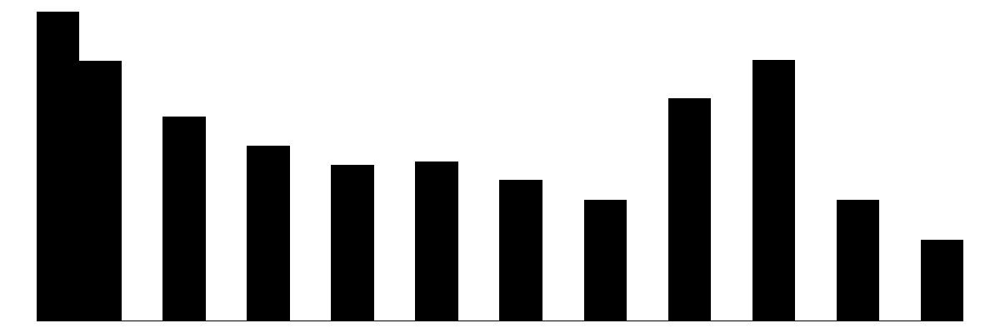</td>
    </tr>
    <tr>
      <td><strong>history</strong></td>
      <td>34833</td>
      <td>0</td>
      <td>242.1</td>
      <td>256.2</td>
      <td>30.0</td>
      <td>158.1</td>
      <td>3345.9</td>
      <td></td>
    </tr>
    <tr>
      <td><strong>spend</strong></td>
      <td>429</td>
      <td>0</td>
      <td>1.1</td>
      <td>15.0</td>
      <td>0.0</td>
      <td>0.0</td>
      <td>499.0</td>
      <td></td>
    </tr>
  </tbody>
  <thead>
    <tr>
      <th></th>
      <th></th>
      <th>N</th>
      <th>%</th>
    </tr>
  </thead>
  <tbody>
    <tr>
      <td rowspan="2"><strong>mens</strong></td>
      <td>0</td>
      <td>28734</td>
      <td>44.9</td>
    </tr>
    <tr>
      <td>1</td>
      <td>35266</td>
      <td>55.1</td>
    </tr>
    <tr>
      <td rowspan="2"><strong>womens</strong></td>
      <td>0</td>
      <td>28818</td>
      <td>45.0</td>
    </tr>
    <tr>
      <td>1</td>
      <td>35182</td>
      <td>55.0</td>
    </tr>
    <tr>
      <td rowspan="3"><strong>zip_code</strong></td>
      <td>Rural</td>
      <td>9563</td>
      <td>14.9</td>
    </tr>
    <tr>
      <td>Surburban</td>
      <td>28776</td>
      <td>45.0</td>
    </tr>
    <tr>
      <td>Urban</td>
      <td>25661</td>
      <td>40.1</td>
    </tr>
    <tr>
      <td rowspan="2"><strong>newbie</strong></td>
      <td>0</td>
      <td>31856</td>
      <td>49.8</td>
    </tr>
    <tr>
      <td>1</td>
      <td>32144</td>
      <td>50.2</td>
    </tr>
    <tr>
      <td rowspan="3"><strong>channel</strong></td>
      <td>Multichannel</td>
      <td>7762</td>
      <td>12.1</td>
    </tr>
    <tr>
      <td>Phone</td>
      <td>28021</td>
      <td>43.8</td>
    </tr>
    <tr>
      <td>Web</td>
      <td>28217</td>
      <td>44.1</td>
    </tr>
  </tbody>
</table>

The treatment has three levels: *No E-Mail*, *Men’s E-Mail*, and
*Women’s E-Mail* (the advertised merchandise was either for men or
women). We should remember this, as it implies that the treatment effect
is likely to be heterogeneous by customer gender. Other than that, we
have additional covariates on customers’ backgrounds.

- *recency*: months since last purchase before the campaign started
  (between 1 and 12)
- *history_segment*: customer’s past purchase value
- *mens*: customer has purchased men’s merchandise in the past year
- *womens*: customer has purchased women’s merchandise in the past year
- *zip_code*: geographic area where the customer lives (Rural, Suburban,
  Urban)
- *newbie*: if the customer is a new customer within the last 12 months
- *channel*: primary purchasing channel used by the customer in the past
  year (Web, Phone, Multichannel)

The data are the result of a randomized experiment, so we expect
covariates to be balanced across the treatment groups.

``` r
cov <- MailAnalytics[,c(-1, -2, -7, -8, -9, -10)]
ggpairs(cov, aes(color = MailAnalytics$segment, alpha = 0.5)) + theme(axis.text = element_text(size = 5), strip.text = element_text(size = 6))
```

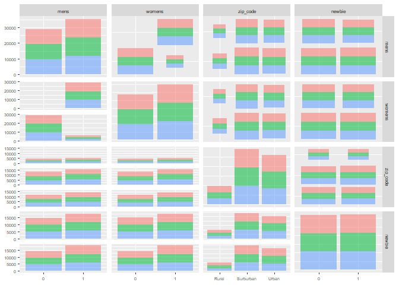<!-- -->

``` r
cov <- MailAnalytics[,c(-3,-4,-5, -6, -8, -9, -10)]
ggpairs(cov, aes(color = MailAnalytics$segment, alpha = 0.5)) + theme(axis.text = element_text(size = 5), strip.text = element_text(size = 6))
```

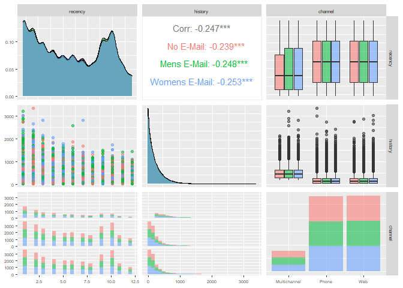<!-- -->

Indeed, the randomization of the treatment assignment balanced the
observed covariates fairly well.

## Estimating ATE for Multi-Category Treatment

Let’s estimate the ATE treatment effect. The computation is quite
straightforward; we can pick two treatment levels and compare them.

``` r
mean(MailAnalytics$spend[MailAnalytics$segment == 'Mens E-Mail']) - mean(MailAnalytics$spend[MailAnalytics$segment == 'No E-Mail'])
```

    ## [1] 0.7698272

``` r
mean(MailAnalytics$spend[MailAnalytics$segment == 'Womens E-Mail']) - mean(MailAnalytics$spend[MailAnalytics$segment == 'No E-Mail'])
```

    ## [1] 0.4244122

``` r
mean(MailAnalytics$spend[MailAnalytics$segment == 'Mens E-Mail']) - mean(MailAnalytics$spend[MailAnalytics$segment == 'Womens E-Mail'])
```

    ## [1] 0.3454149

We can also use *avg_comparisons* from the package *marginaleffects* to
do this automatically.

``` r
lm_model_unadj <- lm(spend ~ segment, data = MailAnalytics)
avg_comparisons(lm_model_unadj, variables = "segment")
```

    ## 
    ##                   Contrast Estimate Std. Error    z Pr(>|z|)    S 2.5 % 97.5 %
    ##  Mens E-Mail - No E-Mail      0.770      0.146 5.29  < 0.001 22.9 0.484   1.06
    ##  Womens E-Mail - No E-Mail    0.424      0.146 2.92  0.00354  8.1 0.139   0.71
    ## 
    ## Term: segment
    ## Type: response

If we wish to estimate all contrasts, we add *segment = “pairwise”*.

``` r
avg_comparisons(lm_model_unadj, variables = list(segment = "pairwise"))
```

    ## 
    ##                     Contrast Estimate Std. Error     z Pr(>|z|)    S  2.5 %
    ##  Mens E-Mail - No E-Mail        0.770      0.146  5.29  < 0.001 22.9  0.484
    ##  Womens E-Mail - Mens E-Mail   -0.345      0.146 -2.37  0.01761  5.8 -0.631
    ##  Womens E-Mail - No E-Mail      0.424      0.146  2.92  0.00354  8.1  0.139
    ##   97.5 %
    ##   1.0553
    ##  -0.0602
    ##   0.7096
    ## 
    ## Term: segment
    ## Type: response

We observe that the treatment (E-mails) seems to have positive effects
overall, and that sending *Men’s E-Mail* is more beneficial than sending
*Women’s E-Mail*.

We used simple unadjusted estimates, so let us assess the balance of
observed covariates more closely.

``` r
p1 <- bal.plot(segment~recency, data = MailAnalytics) 
p2 <- bal.plot(segment~history, data = MailAnalytics)
(p1 + p2) + plot_layout(ncol = 1)
```

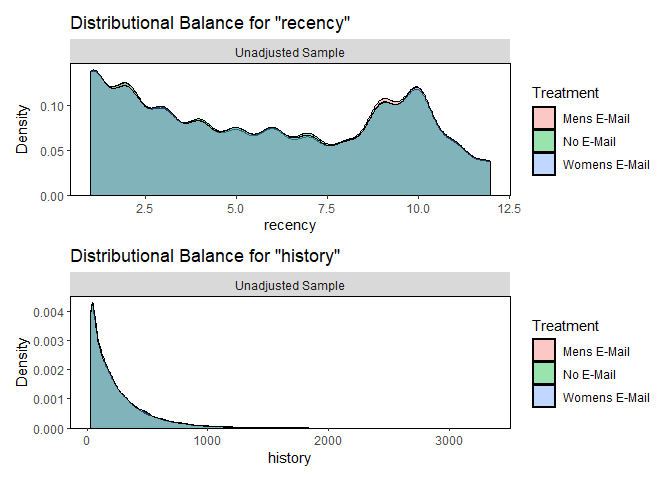<!-- -->

``` r
p1 <- bal.plot(segment~mens, data = MailAnalytics)
p2 <- bal.plot(segment~womens, data = MailAnalytics)
(p1 + p2) + plot_layout(ncol = 2)
```

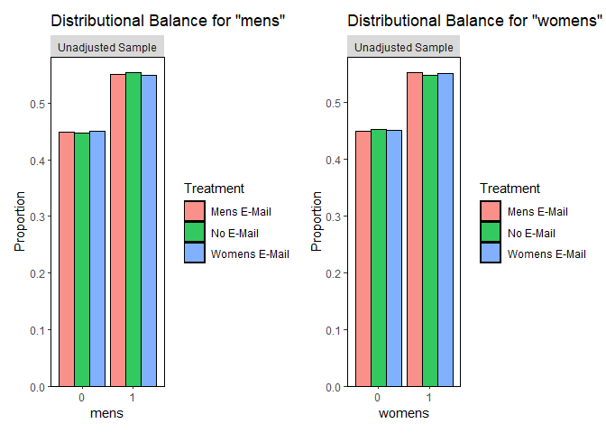<!-- -->

``` r
bal.plot(segment~channel, data = MailAnalytics)
```

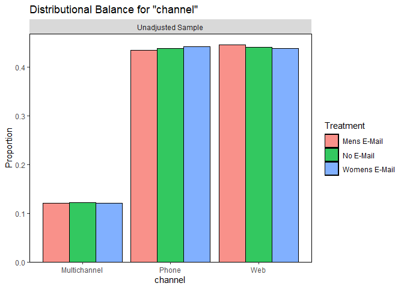<!-- -->

``` r
p1 <- bal.plot(segment~newbie, data = MailAnalytics)
p2 <- bal.plot(segment~zip_code, data = MailAnalytics) 
(p1 + p2) + plot_layout(ncol = 2)
```

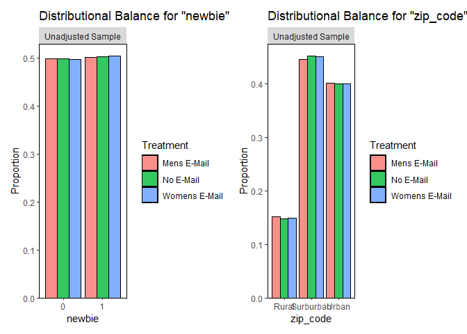<!-- -->

We see that imbalances are only very minor. We can remove this using
weighting based on *generalized propensity scores*, which can be
computed with multinomial logistic regression
(<https://ngreifer.github.io/WeightIt/reference/method_glm.html>).

``` r
prop_scores_model <- weightit(segment ~ recency + history + mens + womens + zip_code + newbie +channel, data = MailAnalytics, method = "glm", estimand = "ATE", multi.method = 'mclogit')
```

The inverse propensity score weights for estimating ATE are (Imbens
2000)
``` math
w_i = \frac{1}{P[T_i = k \mid X_i]},
```
where $`k`$ is the observed treatment level for the *i*-th individual.

We can check that these are indeed the weights computed by *weightit*.

``` r
library(VGAM)

pred_prob <- predict(vglm(segment ~ recency + history + mens + womens + zip_code + newbie + channel, data = MailAnalytics, family=multinomial), type = 'response')

max(abs(prop_scores_model$weights - 1/pred_prob[cbind(seq_len(nrow(pred_prob)), as.numeric(MailAnalytics$segment))]))
```

    ## [1] 4.535083e-11

Let us asses the balance after reweighing the data.

``` r
bal.tab(prop_scores_model, which.treat = .all, un = TRUE, stats = c("m", "v", "ks"), int = TRUE)
```

    ## Balance by treatment pair
    ## 
    ##  - - - No E-Mail (0) vs. Mens E-Mail (1) - - - 
    ## Balance Measures
    ##                                              Type Diff.Un V.Ratio.Un  KS.Un Diff.Adj V.Ratio.Adj KS.Adj
    ## recency                                   Contin.  0.0068     1.0091 0.0075  -0.0001      1.0075 0.0045
    ## history                                   Contin.  0.0076     1.0612 0.0075   0.0001      1.0390 0.0090
    ## mens                                       Binary -0.0023          . 0.0023   0.0000           . 0.0000
    ## womens                                     Binary  0.0038          . 0.0038  -0.0000           . 0.0000
    ## zip_code_Rural                             Binary  0.0049          . 0.0049  -0.0000           . 0.0000
    ## zip_code_Surburban                         Binary -0.0058          . 0.0058  -0.0000           . 0.0000
    ## zip_code_Urban                             Binary  0.0010          . 0.0010   0.0001           . 0.0001
    ## newbie                                     Binary -0.0004          . 0.0004   0.0001           . 0.0001
    ## channel_Multichannel                       Binary -0.0014          . 0.0014   0.0000           . 0.0000
    ## channel_Phone                              Binary -0.0041          . 0.0041   0.0000           . 0.0000
    ## channel_Web                                Binary  0.0055          . 0.0055  -0.0000           . 0.0000
    ## recency * history                         Contin.  0.0008     1.0240 0.0076  -0.0085      1.0058 0.0087
    ## recency * mens_0                          Contin.  0.0071     1.0090 0.0043   0.0003      1.0003 0.0020
    ## recency * mens_1                          Contin. -0.0007     1.0094 0.0044  -0.0004      1.0059 0.0037
    ## recency * womens_0                        Contin. -0.0084     0.9986 0.0065  -0.0056      0.9969 0.0053
    ## recency * womens_1                        Contin.  0.0144     1.0155 0.0085   0.0053      1.0076 0.0055
    ## recency * zip_code_Rural                  Contin.  0.0267     1.0982 0.0074   0.0136      1.0599 0.0049
    ## recency * zip_code_Surburban              Contin. -0.0106     0.9954 0.0072  -0.0045      0.9963 0.0039
    ## recency * zip_code_Urban                  Contin. -0.0006     0.9995 0.0017  -0.0048      0.9921 0.0034
    ## recency * newbie_0                        Contin. -0.0024     0.9953 0.0025  -0.0070      0.9886 0.0046
    ## recency * newbie_1                        Contin.  0.0088     1.0236 0.0072   0.0071      1.0194 0.0062
    ## recency * channel_Multichannel            Contin.  0.0030     1.0188 0.0022   0.0052      1.0228 0.0025
    ## recency * channel_Phone                   Contin. -0.0085     0.9905 0.0052  -0.0048      0.9902 0.0040
    ## recency * channel_Web                     Contin.  0.0134     1.0246 0.0082   0.0019      1.0128 0.0052
    ## history * mens_0                          Contin.  0.0041     1.0549 0.0031  -0.0016      1.0346 0.0050
    ## history * mens_1                          Contin.  0.0049     1.0435 0.0085   0.0013      1.0227 0.0079
    ## history * womens_0                        Contin.  0.0073     1.0827 0.0100   0.0087      1.0731 0.0079
    ## history * womens_1                        Contin.  0.0025     1.0298 0.0046  -0.0064      1.0056 0.0052
    ## history * zip_code_Rural                  Contin. -0.0049     0.9456 0.0049  -0.0161      0.9020 0.0051
    ## history * zip_code_Surburban              Contin. -0.0017     1.0232 0.0098   0.0009      1.0136 0.0060
    ## history * zip_code_Urban                  Contin.  0.0145     1.1132 0.0065   0.0095      1.0889 0.0053
    ## history * newbie_0                        Contin.  0.0003     1.0050 0.0047  -0.0019      1.0019 0.0055
    ## history * newbie_1                        Contin.  0.0070     1.0566 0.0038   0.0010      1.0329 0.0045
    ## history * channel_Multichannel            Contin.  0.0039     1.0724 0.0029   0.0055      1.0664 0.0020
    ## history * channel_Phone                   Contin.  0.0050     1.0631 0.0064   0.0042      1.0427 0.0042
    ## history * channel_Web                     Contin.  0.0016     0.9937 0.0065  -0.0100      0.9600 0.0056
    ## mens_0 * womens_1                          Binary  0.0023          . 0.0023  -0.0000           . 0.0000
    ## mens_0 * zip_code_Rural                    Binary  0.0048          . 0.0048   0.0022           . 0.0022
    ## mens_0 * zip_code_Surburban                Binary -0.0066          . 0.0066  -0.0050           . 0.0050
    ## mens_0 * zip_code_Urban                    Binary  0.0041          . 0.0041   0.0027           . 0.0027
    ## mens_0 * newbie_0                          Binary  0.0005          . 0.0005  -0.0011           . 0.0011
    ## mens_0 * newbie_1                          Binary  0.0018          . 0.0018   0.0010           . 0.0010
    ## mens_0 * channel_Multichannel              Binary  0.0005          . 0.0005   0.0008           . 0.0008
    ## mens_0 * channel_Phone                     Binary -0.0014          . 0.0014  -0.0005           . 0.0005
    ## mens_0 * channel_Web                       Binary  0.0032          . 0.0032  -0.0003           . 0.0003
    ## mens_1 * womens_0                          Binary -0.0038          . 0.0038   0.0000           . 0.0000
    ## mens_1 * womens_1                          Binary  0.0015          . 0.0015  -0.0000           . 0.0000
    ## mens_1 * zip_code_Rural                    Binary  0.0001          . 0.0001  -0.0023           . 0.0023
    ## mens_1 * zip_code_Surburban                Binary  0.0007          . 0.0007   0.0050           . 0.0050
    ## mens_1 * zip_code_Urban                    Binary -0.0031          . 0.0031  -0.0027           . 0.0027
    ## mens_1 * newbie_0                          Binary -0.0001          . 0.0001   0.0010           . 0.0010
    ## mens_1 * newbie_1                          Binary -0.0022          . 0.0022  -0.0010           . 0.0010
    ## mens_1 * channel_Multichannel              Binary -0.0018          . 0.0018  -0.0008           . 0.0008
    ## mens_1 * channel_Phone                     Binary -0.0027          . 0.0027   0.0006           . 0.0006
    ## mens_1 * channel_Web                       Binary  0.0022          . 0.0022   0.0003           . 0.0003
    ## womens_0 * zip_code_Rural                  Binary  0.0003          . 0.0003  -0.0014           . 0.0014
    ## womens_0 * zip_code_Surburban              Binary -0.0007          . 0.0007   0.0037           . 0.0037
    ## womens_0 * zip_code_Urban                  Binary -0.0034          . 0.0034  -0.0023           . 0.0023
    ## womens_0 * newbie_0                        Binary -0.0025          . 0.0025  -0.0010           . 0.0010
    ## womens_0 * newbie_1                        Binary -0.0013          . 0.0013   0.0010           . 0.0010
    ## womens_0 * channel_Multichannel            Binary -0.0000          . 0.0000   0.0010           . 0.0010
    ## womens_0 * channel_Phone                   Binary -0.0033          . 0.0033   0.0003           . 0.0003
    ## womens_0 * channel_Web                     Binary -0.0005          . 0.0005  -0.0013           . 0.0013
    ## womens_1 * zip_code_Rural                  Binary  0.0046          . 0.0046   0.0013           . 0.0013
    ## womens_1 * zip_code_Surburban              Binary -0.0052          . 0.0052  -0.0037           . 0.0037
    ## womens_1 * zip_code_Urban                  Binary  0.0044          . 0.0044   0.0023           . 0.0023
    ## womens_1 * newbie_0                        Binary  0.0029          . 0.0029   0.0009           . 0.0009
    ## womens_1 * newbie_1                        Binary  0.0008          . 0.0008  -0.0010           . 0.0010
    ## womens_1 * channel_Multichannel            Binary -0.0014          . 0.0014  -0.0010           . 0.0010
    ## womens_1 * channel_Phone                   Binary -0.0008          . 0.0008  -0.0003           . 0.0003
    ## womens_1 * channel_Web                     Binary  0.0059          . 0.0059   0.0012           . 0.0012
    ## zip_code_Rural * newbie_0                  Binary  0.0057          . 0.0057   0.0031           . 0.0031
    ## zip_code_Rural * newbie_1                  Binary -0.0008          . 0.0008  -0.0031           . 0.0031
    ## zip_code_Rural * channel_Multichannel      Binary -0.0011          . 0.0011  -0.0015           . 0.0015
    ## zip_code_Rural * channel_Phone             Binary -0.0004          . 0.0004  -0.0019           . 0.0019
    ## zip_code_Rural * channel_Web               Binary  0.0064          . 0.0064   0.0034           . 0.0034
    ## zip_code_Surburban * newbie_0              Binary -0.0018          . 0.0018   0.0009           . 0.0009
    ## zip_code_Surburban * newbie_1              Binary -0.0040          . 0.0040  -0.0009           . 0.0009
    ## zip_code_Surburban * channel_Multichannel  Binary -0.0014          . 0.0014  -0.0001           . 0.0001
    ## zip_code_Surburban * channel_Phone         Binary -0.0020          . 0.0020   0.0023           . 0.0023
    ## zip_code_Surburban * channel_Web           Binary -0.0024          . 0.0024  -0.0022           . 0.0022
    ## zip_code_Urban * newbie_0                  Binary -0.0034          . 0.0034  -0.0040           . 0.0040
    ## zip_code_Urban * newbie_1                  Binary  0.0044          . 0.0044   0.0041           . 0.0041
    ## zip_code_Urban * channel_Multichannel      Binary  0.0012          . 0.0012   0.0016           . 0.0016
    ## zip_code_Urban * channel_Phone             Binary -0.0017          . 0.0017  -0.0004           . 0.0004
    ## zip_code_Urban * channel_Web               Binary  0.0015          . 0.0015  -0.0012           . 0.0012
    ## newbie_0 * channel_Multichannel            Binary -0.0002          . 0.0002   0.0006           . 0.0006
    ## newbie_0 * channel_Phone                   Binary -0.0010          . 0.0010   0.0008           . 0.0008
    ## newbie_0 * channel_Web                     Binary  0.0016          . 0.0016  -0.0015           . 0.0015
    ## newbie_1 * channel_Multichannel            Binary -0.0012          . 0.0012  -0.0006           . 0.0006
    ## newbie_1 * channel_Phone                   Binary -0.0031          . 0.0031  -0.0008           . 0.0008
    ## newbie_1 * channel_Web                     Binary  0.0038          . 0.0038   0.0015           . 0.0015
    ## 
    ## Effective sample sizes
    ##            No E-Mail Mens E-Mail
    ## Unadjusted  21306.      21307.  
    ## Adjusted    21302.88    21302.12
    ## 
    ##  - - - No E-Mail (0) vs. Womens E-Mail (1) - - - 
    ## Balance Measures
    ##                                              Type Diff.Un V.Ratio.Un  KS.Un Diff.Adj V.Ratio.Adj KS.Adj
    ## recency                                   Contin.  0.0052     1.0083 0.0047  -0.0000      1.0069 0.0031
    ## history                                   Contin.  0.0065     1.0206 0.0087   0.0000      0.9979 0.0075
    ## mens                                       Binary -0.0043          . 0.0043   0.0000           . 0.0000
    ## womens                                     Binary  0.0025          . 0.0025  -0.0000           . 0.0000
    ## zip_code_Rural                             Binary  0.0014          . 0.0014   0.0000           . 0.0000
    ## zip_code_Surburban                         Binary -0.0005          . 0.0005  -0.0000           . 0.0000
    ## zip_code_Urban                             Binary -0.0009          . 0.0009   0.0000           . 0.0000
    ## newbie                                     Binary  0.0013          . 0.0013   0.0001           . 0.0001
    ## channel_Multichannel                       Binary -0.0017          . 0.0017   0.0000           . 0.0000
    ## channel_Phone                              Binary  0.0043          . 0.0043  -0.0000           . 0.0000
    ## channel_Web                                Binary -0.0026          . 0.0026   0.0000           . 0.0000
    ## recency * history                         Contin. -0.0011     0.9898 0.0093  -0.0080      0.9748 0.0070
    ## recency * mens_0                          Contin.  0.0092     1.0107 0.0056   0.0004      1.0018 0.0021
    ## recency * mens_1                          Contin. -0.0043     1.0055 0.0070  -0.0004      1.0041 0.0038
    ## recency * womens_0                        Contin. -0.0044     1.0016 0.0050  -0.0026      1.0004 0.0035
    ## recency * womens_1                        Contin.  0.0090     1.0109 0.0054   0.0026      1.0047 0.0028
    ## recency * zip_code_Rural                  Contin.  0.0131     1.0505 0.0047   0.0089      1.0364 0.0038
    ## recency * zip_code_Surburban              Contin. -0.0076     0.9902 0.0059  -0.0090      0.9864 0.0067
    ## recency * zip_code_Urban                  Contin.  0.0039     1.0146 0.0032   0.0033      1.0114 0.0028
    ## recency * newbie_0                        Contin. -0.0029     0.9970 0.0027  -0.0041      0.9931 0.0026
    ## recency * newbie_1                        Contin.  0.0079     1.0187 0.0042   0.0042      1.0140 0.0033
    ## recency * channel_Multichannel            Contin. -0.0033     0.9976 0.0019   0.0003      1.0072 0.0013
    ## recency * channel_Phone                   Contin.  0.0127     1.0208 0.0061   0.0039      1.0116 0.0037
    ## recency * channel_Web                     Contin. -0.0061     0.9934 0.0038  -0.0040      0.9926 0.0031
    ## history * mens_0                          Contin.  0.0093     1.0423 0.0066  -0.0003      1.0102 0.0035
    ## history * mens_1                          Contin. -0.0003     1.0071 0.0060   0.0003      0.9918 0.0047
    ## history * womens_0                        Contin.  0.0078     1.0559 0.0053   0.0060      1.0354 0.0051
    ## history * womens_1                        Contin.  0.0009     0.9998 0.0048  -0.0044      0.9807 0.0038
    ## history * zip_code_Rural                  Contin. -0.0091     0.9246 0.0027  -0.0137      0.9001 0.0035
    ## history * zip_code_Surburban              Contin.  0.0045     1.0102 0.0078   0.0016      0.9916 0.0076
    ## history * zip_code_Urban                  Contin.  0.0094     1.0657 0.0054   0.0073      1.0469 0.0049
    ## history * newbie_0                        Contin.  0.0035     1.0161 0.0053   0.0047      1.0165 0.0053
    ## history * newbie_1                        Contin.  0.0043     1.0189 0.0047  -0.0022      0.9953 0.0042
    ## history * channel_Multichannel            Contin. -0.0039     0.9899 0.0031  -0.0017      0.9857 0.0035
    ## history * channel_Phone                   Contin.  0.0124     1.0314 0.0076   0.0028      0.9980 0.0046
    ## history * channel_Web                     Contin.  0.0012     1.0368 0.0035  -0.0008      1.0141 0.0035
    ## mens_0 * womens_1                          Binary  0.0043          . 0.0043  -0.0000           . 0.0000
    ## mens_0 * zip_code_Rural                    Binary  0.0027          . 0.0027   0.0015           . 0.0015
    ## mens_0 * zip_code_Surburban                Binary  0.0003          . 0.0003  -0.0015           . 0.0015
    ## mens_0 * zip_code_Urban                    Binary  0.0013          . 0.0013  -0.0000           . 0.0000
    ## mens_0 * newbie_0                          Binary  0.0009          . 0.0009  -0.0007           . 0.0007
    ## mens_0 * newbie_1                          Binary  0.0034          . 0.0034   0.0007           . 0.0007
    ## mens_0 * channel_Multichannel              Binary  0.0008          . 0.0008   0.0008           . 0.0008
    ## mens_0 * channel_Phone                     Binary  0.0053          . 0.0053   0.0015           . 0.0015
    ## mens_0 * channel_Web                       Binary -0.0018          . 0.0018  -0.0024           . 0.0024
    ## mens_1 * womens_0                          Binary -0.0025          . 0.0025   0.0000           . 0.0000
    ## mens_1 * womens_1                          Binary -0.0018          . 0.0018   0.0000           . 0.0000
    ## mens_1 * zip_code_Rural                    Binary -0.0013          . 0.0013  -0.0015           . 0.0015
    ## mens_1 * zip_code_Surburban                Binary -0.0008          . 0.0008   0.0014           . 0.0014
    ## mens_1 * zip_code_Urban                    Binary -0.0022          . 0.0022   0.0001           . 0.0001
    ## mens_1 * newbie_0                          Binary -0.0022          . 0.0022   0.0006           . 0.0006
    ## mens_1 * newbie_1                          Binary -0.0021          . 0.0021  -0.0006           . 0.0006
    ## mens_1 * channel_Multichannel              Binary -0.0025          . 0.0025  -0.0008           . 0.0008
    ## mens_1 * channel_Phone                     Binary -0.0010          . 0.0010  -0.0015           . 0.0015
    ## mens_1 * channel_Web                       Binary -0.0008          . 0.0008   0.0024           . 0.0024
    ## womens_0 * zip_code_Rural                  Binary -0.0001          . 0.0001  -0.0003           . 0.0003
    ## womens_0 * zip_code_Surburban              Binary -0.0001          . 0.0001   0.0013           . 0.0013
    ## womens_0 * zip_code_Urban                  Binary -0.0023          . 0.0023  -0.0010           . 0.0010
    ## womens_0 * newbie_0                        Binary -0.0015          . 0.0015   0.0002           . 0.0002
    ## womens_0 * newbie_1                        Binary -0.0009          . 0.0009  -0.0002           . 0.0002
    ## womens_0 * channel_Multichannel            Binary  0.0000          . 0.0000   0.0007           . 0.0007
    ## womens_0 * channel_Phone                   Binary -0.0004          . 0.0004  -0.0011           . 0.0011
    ## womens_0 * channel_Web                     Binary -0.0021          . 0.0021   0.0004           . 0.0004
    ## womens_1 * zip_code_Rural                  Binary  0.0015          . 0.0015   0.0004           . 0.0004
    ## womens_1 * zip_code_Surburban              Binary -0.0005          . 0.0005  -0.0013           . 0.0013
    ## womens_1 * zip_code_Urban                  Binary  0.0015          . 0.0015   0.0010           . 0.0010
    ## womens_1 * newbie_0                        Binary  0.0003          . 0.0003  -0.0003           . 0.0003
    ## womens_1 * newbie_1                        Binary  0.0022          . 0.0022   0.0003           . 0.0003
    ## womens_1 * channel_Multichannel            Binary -0.0017          . 0.0017  -0.0007           . 0.0007
    ## womens_1 * channel_Phone                   Binary  0.0047          . 0.0047   0.0010           . 0.0010
    ## womens_1 * channel_Web                     Binary -0.0005          . 0.0005  -0.0003           . 0.0003
    ## zip_code_Rural * newbie_0                  Binary -0.0001          . 0.0001  -0.0006           . 0.0006
    ## zip_code_Rural * newbie_1                  Binary  0.0015          . 0.0015   0.0006           . 0.0006
    ## zip_code_Rural * channel_Multichannel      Binary -0.0007          . 0.0007  -0.0006           . 0.0006
    ## zip_code_Rural * channel_Phone             Binary -0.0007          . 0.0007  -0.0019           . 0.0019
    ## zip_code_Rural * channel_Web               Binary  0.0028          . 0.0028   0.0025           . 0.0025
    ## zip_code_Surburban * newbie_0              Binary  0.0032          . 0.0032   0.0040           . 0.0040
    ## zip_code_Surburban * newbie_1              Binary -0.0037          . 0.0037  -0.0040           . 0.0040
    ## zip_code_Surburban * channel_Multichannel  Binary -0.0010          . 0.0010  -0.0002           . 0.0002
    ## zip_code_Surburban * channel_Phone         Binary  0.0036          . 0.0036   0.0019           . 0.0019
    ## zip_code_Surburban * channel_Web           Binary -0.0031          . 0.0031  -0.0017           . 0.0017
    ## zip_code_Urban * newbie_0                  Binary -0.0044          . 0.0044  -0.0034           . 0.0034
    ## zip_code_Urban * newbie_1                  Binary  0.0035          . 0.0035   0.0035           . 0.0035
    ## zip_code_Urban * channel_Multichannel      Binary  0.0000          . 0.0000   0.0008           . 0.0008
    ## zip_code_Urban * channel_Phone             Binary  0.0013          . 0.0013   0.0000           . 0.0000
    ## zip_code_Urban * channel_Web               Binary -0.0022          . 0.0022  -0.0008           . 0.0008
    ## newbie_0 * channel_Multichannel            Binary -0.0022          . 0.0022  -0.0012           . 0.0012
    ## newbie_0 * channel_Phone                   Binary  0.0050          . 0.0050   0.0033           . 0.0033
    ## newbie_0 * channel_Web                     Binary -0.0040          . 0.0040  -0.0023           . 0.0023
    ## newbie_1 * channel_Multichannel            Binary  0.0005          . 0.0005   0.0012           . 0.0012
    ## newbie_1 * channel_Phone                   Binary -0.0007          . 0.0007  -0.0034           . 0.0034
    ## newbie_1 * channel_Web                     Binary  0.0015          . 0.0015   0.0023           . 0.0023
    ## 
    ## Effective sample sizes
    ##            No E-Mail Womens E-Mail
    ## Unadjusted  21306.        21387.  
    ## Adjusted    21302.88      21383.81
    ## 
    ##  - - - Mens E-Mail (0) vs. Womens E-Mail (1) - - - 
    ## Balance Measures
    ##                                              Type Diff.Un V.Ratio.Un  KS.Un Diff.Adj V.Ratio.Adj KS.Adj
    ## recency                                   Contin. -0.0017     0.9992 0.0044   0.0001      0.9994 0.0036
    ## history                                   Contin. -0.0012     0.9618 0.0079  -0.0000      0.9604 0.0090
    ## mens                                       Binary -0.0020          . 0.0020  -0.0000           . 0.0000
    ## womens                                     Binary -0.0013          . 0.0013   0.0000           . 0.0000
    ## zip_code_Rural                             Binary -0.0035          . 0.0035   0.0000           . 0.0000
    ## zip_code_Surburban                         Binary  0.0053          . 0.0053  -0.0000           . 0.0000
    ## zip_code_Urban                             Binary -0.0018          . 0.0018  -0.0000           . 0.0000
    ## newbie                                     Binary  0.0017          . 0.0017   0.0000           . 0.0000
    ## channel_Multichannel                       Binary -0.0004          . 0.0004  -0.0000           . 0.0000
    ## channel_Phone                              Binary  0.0084          . 0.0084  -0.0001           . 0.0001
    ## channel_Web                                Binary -0.0080          . 0.0080   0.0001           . 0.0001
    ## recency * history                         Contin. -0.0019     0.9666 0.0078   0.0005      0.9691 0.0089
    ## recency * mens_0                          Contin.  0.0021     1.0017 0.0043   0.0001      1.0015 0.0033
    ## recency * mens_1                          Contin. -0.0035     0.9961 0.0038   0.0000      0.9982 0.0035
    ## recency * womens_0                        Contin.  0.0040     1.0030 0.0038   0.0030      1.0035 0.0036
    ## recency * womens_1                        Contin. -0.0054     0.9955 0.0046  -0.0028      0.9971 0.0038
    ## recency * zip_code_Rural                  Contin. -0.0135     0.9566 0.0045  -0.0048      0.9779 0.0020
    ## recency * zip_code_Surburban              Contin.  0.0030     0.9948 0.0060  -0.0046      0.9900 0.0049
    ## recency * zip_code_Urban                  Contin.  0.0045     1.0152 0.0038   0.0081      1.0194 0.0050
    ## recency * newbie_0                        Contin. -0.0006     1.0017 0.0035   0.0029      1.0045 0.0040
    ## recency * newbie_1                        Contin. -0.0010     0.9952 0.0032  -0.0029      0.9947 0.0035
    ## recency * channel_Multichannel            Contin. -0.0063     0.9792 0.0031  -0.0049      0.9847 0.0027
    ## recency * channel_Phone                   Contin.  0.0213     1.0306 0.0084   0.0086      1.0216 0.0057
    ## recency * channel_Web                     Contin. -0.0195     0.9695 0.0112  -0.0060      0.9801 0.0082
    ## history * mens_0                          Contin.  0.0052     0.9880 0.0067   0.0012      0.9765 0.0054
    ## history * mens_1                          Contin. -0.0052     0.9651 0.0039  -0.0010      0.9698 0.0060
    ## history * womens_0                        Contin.  0.0005     0.9753 0.0071  -0.0027      0.9649 0.0060
    ## history * womens_1                        Contin. -0.0016     0.9709 0.0034   0.0020      0.9752 0.0054
    ## history * zip_code_Rural                  Contin. -0.0042     0.9778 0.0035   0.0024      0.9979 0.0035
    ## history * zip_code_Surburban              Contin.  0.0062     0.9873 0.0094   0.0006      0.9783 0.0054
    ## history * zip_code_Urban                  Contin. -0.0051     0.9573 0.0058  -0.0023      0.9614 0.0043
    ## history * newbie_0                        Contin.  0.0032     1.0111 0.0040   0.0065      1.0146 0.0055
    ## history * newbie_1                        Contin. -0.0026     0.9643 0.0061  -0.0032      0.9636 0.0059
    ## history * channel_Multichannel            Contin. -0.0079     0.9231 0.0027  -0.0072      0.9243 0.0026
    ## history * channel_Phone                   Contin.  0.0075     0.9702 0.0106  -0.0014      0.9571 0.0051
    ## history * channel_Web                     Contin. -0.0004     1.0434 0.0081   0.0092      1.0563 0.0048
    ## mens_0 * womens_1                          Binary  0.0020          . 0.0020   0.0000           . 0.0000
    ## mens_0 * zip_code_Rural                    Binary -0.0021          . 0.0021  -0.0008           . 0.0008
    ## mens_0 * zip_code_Surburban                Binary  0.0068          . 0.0068   0.0035           . 0.0035
    ## mens_0 * zip_code_Urban                    Binary -0.0027          . 0.0027  -0.0028           . 0.0028
    ## mens_0 * newbie_0                          Binary  0.0004          . 0.0004   0.0003           . 0.0003
    ## mens_0 * newbie_1                          Binary  0.0016          . 0.0016  -0.0003           . 0.0003
    ## mens_0 * channel_Multichannel              Binary  0.0003          . 0.0003   0.0000           . 0.0000
    ## mens_0 * channel_Phone                     Binary  0.0067          . 0.0067   0.0021           . 0.0021
    ## mens_0 * channel_Web                       Binary -0.0050          . 0.0050  -0.0021           . 0.0021
    ## mens_1 * womens_0                          Binary  0.0013          . 0.0013  -0.0000           . 0.0000
    ## mens_1 * womens_1                          Binary -0.0033          . 0.0033   0.0000           . 0.0000
    ## mens_1 * zip_code_Rural                    Binary -0.0014          . 0.0014   0.0008           . 0.0008
    ## mens_1 * zip_code_Surburban                Binary -0.0015          . 0.0015  -0.0036           . 0.0036
    ## mens_1 * zip_code_Urban                    Binary  0.0009          . 0.0009   0.0027           . 0.0027
    ## mens_1 * newbie_0                          Binary -0.0021          . 0.0021  -0.0004           . 0.0004
    ## mens_1 * newbie_1                          Binary  0.0001          . 0.0001   0.0003           . 0.0003
    ## mens_1 * channel_Multichannel              Binary -0.0007          . 0.0007  -0.0000           . 0.0000
    ## mens_1 * channel_Phone                     Binary  0.0017          . 0.0017  -0.0021           . 0.0021
    ## mens_1 * channel_Web                       Binary -0.0030          . 0.0030   0.0021           . 0.0021
    ## womens_0 * zip_code_Rural                  Binary -0.0003          . 0.0003   0.0010           . 0.0010
    ## womens_0 * zip_code_Surburban              Binary  0.0006          . 0.0006  -0.0024           . 0.0024
    ## womens_0 * zip_code_Urban                  Binary  0.0011          . 0.0011   0.0013           . 0.0013
    ## womens_0 * newbie_0                        Binary  0.0010          . 0.0010   0.0012           . 0.0012
    ## womens_0 * newbie_1                        Binary  0.0003          . 0.0003  -0.0012           . 0.0012
    ## womens_0 * channel_Multichannel            Binary  0.0000          . 0.0000  -0.0003           . 0.0003
    ## womens_0 * channel_Phone                   Binary  0.0029          . 0.0029  -0.0014           . 0.0014
    ## womens_0 * channel_Web                     Binary -0.0016          . 0.0016   0.0016           . 0.0016
    ## womens_1 * zip_code_Rural                  Binary -0.0031          . 0.0031  -0.0010           . 0.0010
    ## womens_1 * zip_code_Surburban              Binary  0.0047          . 0.0047   0.0024           . 0.0024
    ## womens_1 * zip_code_Urban                  Binary -0.0029          . 0.0029  -0.0013           . 0.0013
    ## womens_1 * newbie_0                        Binary -0.0027          . 0.0027  -0.0012           . 0.0012
    ## womens_1 * newbie_1                        Binary  0.0014          . 0.0014   0.0013           . 0.0013
    ## womens_1 * channel_Multichannel            Binary -0.0004          . 0.0004   0.0003           . 0.0003
    ## womens_1 * channel_Phone                   Binary  0.0055          . 0.0055   0.0014           . 0.0014
    ## womens_1 * channel_Web                     Binary -0.0064          . 0.0064  -0.0016           . 0.0016
    ## zip_code_Rural * newbie_0                  Binary -0.0058          . 0.0058  -0.0037           . 0.0037
    ## zip_code_Rural * newbie_1                  Binary  0.0023          . 0.0023   0.0038           . 0.0038
    ## zip_code_Rural * channel_Multichannel      Binary  0.0005          . 0.0005   0.0009           . 0.0009
    ## zip_code_Rural * channel_Phone             Binary -0.0003          . 0.0003  -0.0000           . 0.0000
    ## zip_code_Rural * channel_Web               Binary -0.0036          . 0.0036  -0.0008           . 0.0008
    ## zip_code_Surburban * newbie_0              Binary  0.0050          . 0.0050   0.0031           . 0.0031
    ## zip_code_Surburban * newbie_1              Binary  0.0003          . 0.0003  -0.0031           . 0.0031
    ## zip_code_Surburban * channel_Multichannel  Binary  0.0004          . 0.0004  -0.0001           . 0.0001
    ## zip_code_Surburban * channel_Phone         Binary  0.0056          . 0.0056  -0.0005           . 0.0005
    ## zip_code_Surburban * channel_Web           Binary -0.0007          . 0.0007   0.0006           . 0.0006
    ## zip_code_Urban * newbie_0                  Binary -0.0010          . 0.0010   0.0006           . 0.0006
    ## zip_code_Urban * newbie_1                  Binary -0.0009          . 0.0009  -0.0006           . 0.0006
    ## zip_code_Urban * channel_Multichannel      Binary -0.0012          . 0.0012  -0.0008           . 0.0008
    ## zip_code_Urban * channel_Phone             Binary  0.0030          . 0.0030   0.0004           . 0.0004
    ## zip_code_Urban * channel_Web               Binary -0.0037          . 0.0037   0.0003           . 0.0003
    ## newbie_0 * channel_Multichannel            Binary -0.0021          . 0.0021  -0.0018           . 0.0018
    ## newbie_0 * channel_Phone                   Binary  0.0060          . 0.0060   0.0025           . 0.0025
    ## newbie_0 * channel_Web                     Binary -0.0057          . 0.0057  -0.0008           . 0.0008
    ## newbie_1 * channel_Multichannel            Binary  0.0017          . 0.0017   0.0018           . 0.0018
    ## newbie_1 * channel_Phone                   Binary  0.0024          . 0.0024  -0.0026           . 0.0026
    ## newbie_1 * channel_Web                     Binary -0.0024          . 0.0024   0.0008           . 0.0008
    ## 
    ## Effective sample sizes
    ##            Mens E-Mail Womens E-Mail
    ## Unadjusted    21307.        21387.  
    ## Adjusted      21302.12      21383.81
    ##  - - - - - - - - - - - - - - - - - - - - - - - - - -


We see that the reweighted covariates and their interactions are fairly
balanced, as indicated by variance ratios and Kolmogorov-Smirnov
statistics. We can do a bit better by using other weighting methods.
Let’s use entropy balancing, since it is pretty fast to compute even for
larger datasets
(<https://ngreifer.github.io/WeightIt/reference/method_glm.html>).

``` r
prop_scores_model_ebal <- weightit(segment ~ recency + history + mens + zip_code + newbie +channel, data = MailAnalytics, method = "ebal", estimand = "ATE", over = FALSE, moment = 2, int = TRUE)
```

``` r
bal.tab(prop_scores_model_ebal, which.treat = .all, un = TRUE, stats = c("m", "v", "ks"), int = TRUE)
```

    ## Balance by treatment pair
    ## 
    ##  - - - No E-Mail (0) vs. Mens E-Mail (1) - - - 
    ## Balance Measures
    ##                                              Type Diff.Un V.Ratio.Un  KS.Un Diff.Adj V.Ratio.Adj KS.Adj
    ## recency                                   Contin.  0.0068     1.0091 0.0075       -0      1.0000 0.0034
    ## history                                   Contin.  0.0076     1.0612 0.0075        0      1.0000 0.0061
    ## mens                                       Binary -0.0023          . 0.0023       -0           . 0.0000
    ## zip_code_Rural                             Binary  0.0049          . 0.0049        0           . 0.0000
    ## zip_code_Surburban                         Binary -0.0058          . 0.0058       -0           . 0.0000
    ## zip_code_Urban                             Binary  0.0010          . 0.0010        0           . 0.0000
    ## newbie                                     Binary -0.0004          . 0.0004        0           . 0.0000
    ## channel_Multichannel                       Binary -0.0014          . 0.0014        0           . 0.0000
    ## channel_Phone                              Binary -0.0041          . 0.0041       -0           . 0.0000
    ## channel_Web                                Binary  0.0055          . 0.0055        0           . 0.0000
    ## recency * history                         Contin.  0.0008     1.0240 0.0076       -0      1.0207 0.0067
    ## recency * mens_0                          Contin.  0.0071     1.0090 0.0043        0      0.9967 0.0022
    ## recency * mens_1                          Contin. -0.0007     1.0094 0.0044       -0      1.0031 0.0030
    ## recency * zip_code_Rural                  Contin.  0.0267     1.0982 0.0074       -0      0.9986 0.0008
    ## recency * zip_code_Surburban              Contin. -0.0106     0.9954 0.0072       -0      1.0015 0.0027
    ## recency * zip_code_Urban                  Contin. -0.0006     0.9995 0.0017        0      0.9990 0.0011
    ## recency * newbie_0                        Contin. -0.0024     0.9953 0.0025       -0      0.9970 0.0025
    ## recency * newbie_1                        Contin.  0.0088     1.0236 0.0072       -0      1.0032 0.0029
    ## recency * channel_Multichannel            Contin.  0.0030     1.0188 0.0022        0      0.9917 0.0022
    ## recency * channel_Phone                   Contin. -0.0085     0.9905 0.0052       -0      0.9959 0.0029
    ## recency * channel_Web                     Contin.  0.0134     1.0246 0.0082        0      1.0063 0.0037
    ## history * mens_0                          Contin.  0.0041     1.0549 0.0031        0      1.0210 0.0032
    ## history * mens_1                          Contin.  0.0049     1.0435 0.0085        0      0.9882 0.0065
    ## history * zip_code_Rural                  Contin. -0.0049     0.9456 0.0049        0      0.9991 0.0023
    ## history * zip_code_Surburban              Contin. -0.0017     1.0232 0.0098        0      0.9892 0.0065
    ## history * zip_code_Urban                  Contin.  0.0145     1.1132 0.0065        0      1.0122 0.0052
    ## history * newbie_0                        Contin.  0.0003     1.0050 0.0047        0      1.0038 0.0045
    ## history * newbie_1                        Contin.  0.0070     1.0566 0.0038        0      0.9991 0.0029
    ## history * channel_Multichannel            Contin.  0.0039     1.0724 0.0029        0      1.0110 0.0020
    ## history * channel_Phone                   Contin.  0.0050     1.0631 0.0064       -0      0.9993 0.0042
    ## history * channel_Web                     Contin.  0.0016     0.9937 0.0065        0      0.9876 0.0048
    ## mens_0 * zip_code_Rural                    Binary  0.0048          . 0.0048        0           . 0.0000
    ## mens_0 * zip_code_Surburban                Binary -0.0066          . 0.0066       -0           . 0.0000
    ## mens_0 * zip_code_Urban                    Binary  0.0041          . 0.0041        0           . 0.0000
    ## mens_0 * newbie_0                          Binary  0.0005          . 0.0005       -0           . 0.0000
    ## mens_0 * newbie_1                          Binary  0.0018          . 0.0018        0           . 0.0000
    ## mens_0 * channel_Multichannel              Binary  0.0005          . 0.0005        0           . 0.0000
    ## mens_0 * channel_Phone                     Binary -0.0014          . 0.0014       -0           . 0.0000
    ## mens_0 * channel_Web                       Binary  0.0032          . 0.0032        0           . 0.0000
    ## mens_1 * zip_code_Rural                    Binary  0.0001          . 0.0001       -0           . 0.0000
    ## mens_1 * zip_code_Surburban                Binary  0.0007          . 0.0007       -0           . 0.0000
    ## mens_1 * zip_code_Urban                    Binary -0.0031          . 0.0031       -0           . 0.0000
    ## mens_1 * newbie_0                          Binary -0.0001          . 0.0001       -0           . 0.0000
    ## mens_1 * newbie_1                          Binary -0.0022          . 0.0022       -0           . 0.0000
    ## mens_1 * channel_Multichannel              Binary -0.0018          . 0.0018        0           . 0.0000
    ## mens_1 * channel_Phone                     Binary -0.0027          . 0.0027       -0           . 0.0000
    ## mens_1 * channel_Web                       Binary  0.0022          . 0.0022       -0           . 0.0000
    ## zip_code_Rural * newbie_0                  Binary  0.0057          . 0.0057        0           . 0.0000
    ## zip_code_Rural * newbie_1                  Binary -0.0008          . 0.0008       -0           . 0.0000
    ## zip_code_Rural * channel_Multichannel      Binary -0.0011          . 0.0011        0           . 0.0000
    ## zip_code_Rural * channel_Phone             Binary -0.0004          . 0.0004       -0           . 0.0000
    ## zip_code_Rural * channel_Web               Binary  0.0064          . 0.0064       -0           . 0.0000
    ## zip_code_Surburban * newbie_0              Binary -0.0018          . 0.0018       -0           . 0.0000
    ## zip_code_Surburban * newbie_1              Binary -0.0040          . 0.0040       -0           . 0.0000
    ## zip_code_Surburban * channel_Multichannel  Binary -0.0014          . 0.0014        0           . 0.0000
    ## zip_code_Surburban * channel_Phone         Binary -0.0020          . 0.0020       -0           . 0.0000
    ## zip_code_Surburban * channel_Web           Binary -0.0024          . 0.0024        0           . 0.0000
    ## zip_code_Urban * newbie_0                  Binary -0.0034          . 0.0034       -0           . 0.0000
    ## zip_code_Urban * newbie_1                  Binary  0.0044          . 0.0044        0           . 0.0000
    ## zip_code_Urban * channel_Multichannel      Binary  0.0012          . 0.0012        0           . 0.0000
    ## zip_code_Urban * channel_Phone             Binary -0.0017          . 0.0017       -0           . 0.0000
    ## zip_code_Urban * channel_Web               Binary  0.0015          . 0.0015        0           . 0.0000
    ## newbie_0 * channel_Multichannel            Binary -0.0002          . 0.0002        0           . 0.0000
    ## newbie_0 * channel_Phone                   Binary -0.0010          . 0.0010       -0           . 0.0000
    ## newbie_0 * channel_Web                     Binary  0.0016          . 0.0016       -0           . 0.0000
    ## newbie_1 * channel_Multichannel            Binary -0.0012          . 0.0012        0           . 0.0000
    ## newbie_1 * channel_Phone                   Binary -0.0031          . 0.0031       -0           . 0.0000
    ## newbie_1 * channel_Web                     Binary  0.0038          . 0.0038        0           . 0.0000
    ## 
    ## Effective sample sizes
    ##            No E-Mail Mens E-Mail
    ## Unadjusted  21306.      21307.  
    ## Adjusted    21280.03    21281.41
    ## 
    ##  - - - No E-Mail (0) vs. Womens E-Mail (1) - - - 
    ## Balance Measures
    ##                                              Type Diff.Un V.Ratio.Un  KS.Un Diff.Adj V.Ratio.Adj KS.Adj
    ## recency                                   Contin.  0.0052     1.0083 0.0047       -0      1.0000 0.0026
    ## history                                   Contin.  0.0065     1.0206 0.0087        0      1.0000 0.0063
    ## mens                                       Binary -0.0043          . 0.0043       -0           . 0.0000
    ## zip_code_Rural                             Binary  0.0014          . 0.0014        0           . 0.0000
    ## zip_code_Surburban                         Binary -0.0005          . 0.0005       -0           . 0.0000
    ## zip_code_Urban                             Binary -0.0009          . 0.0009        0           . 0.0000
    ## newbie                                     Binary  0.0013          . 0.0013        0           . 0.0000
    ## channel_Multichannel                       Binary -0.0017          . 0.0017        0           . 0.0000
    ## channel_Phone                              Binary  0.0043          . 0.0043       -0           . 0.0000
    ## channel_Web                                Binary -0.0026          . 0.0026        0           . 0.0000
    ## recency * history                         Contin. -0.0011     0.9898 0.0093       -0      1.0156 0.0053
    ## recency * mens_0                          Contin.  0.0092     1.0107 0.0056        0      0.9985 0.0025
    ## recency * mens_1                          Contin. -0.0043     1.0055 0.0070       -0      1.0014 0.0028
    ## recency * zip_code_Rural                  Contin.  0.0131     1.0505 0.0047       -0      0.9966 0.0011
    ## recency * zip_code_Surburban              Contin. -0.0076     0.9902 0.0059       -0      1.0001 0.0023
    ## recency * zip_code_Urban                  Contin.  0.0039     1.0146 0.0032        0      1.0014 0.0016
    ## recency * newbie_0                        Contin. -0.0029     0.9970 0.0027       -0      0.9972 0.0037
    ## recency * newbie_1                        Contin.  0.0079     1.0187 0.0042       -0      1.0030 0.0015
    ## recency * channel_Multichannel            Contin. -0.0033     0.9976 0.0019        0      1.0032 0.0013
    ## recency * channel_Phone                   Contin.  0.0127     1.0208 0.0061       -0      1.0016 0.0018
    ## recency * channel_Web                     Contin. -0.0061     0.9934 0.0038        0      0.9976 0.0021
    ## history * mens_0                          Contin.  0.0093     1.0423 0.0066        0      1.0154 0.0033
    ## history * mens_1                          Contin. -0.0003     1.0071 0.0060        0      0.9913 0.0036
    ## history * zip_code_Rural                  Contin. -0.0091     0.9246 0.0027        0      1.0008 0.0019
    ## history * zip_code_Surburban              Contin.  0.0045     1.0102 0.0078        0      0.9893 0.0060
    ## history * zip_code_Urban                  Contin.  0.0094     1.0657 0.0054        0      1.0114 0.0048
    ## history * newbie_0                        Contin.  0.0035     1.0161 0.0053        0      1.0072 0.0048
    ## history * newbie_1                        Contin.  0.0043     1.0189 0.0047        0      0.9984 0.0039
    ## history * channel_Multichannel            Contin. -0.0039     0.9899 0.0031        0      1.0018 0.0036
    ## history * channel_Phone                   Contin.  0.0124     1.0314 0.0076       -0      0.9803 0.0033
    ## history * channel_Web                     Contin.  0.0012     1.0368 0.0035        0      1.0173 0.0033
    ## mens_0 * zip_code_Rural                    Binary  0.0027          . 0.0027        0           . 0.0000
    ## mens_0 * zip_code_Surburban                Binary  0.0003          . 0.0003       -0           . 0.0000
    ## mens_0 * zip_code_Urban                    Binary  0.0013          . 0.0013        0           . 0.0000
    ## mens_0 * newbie_0                          Binary  0.0009          . 0.0009       -0           . 0.0000
    ## mens_0 * newbie_1                          Binary  0.0034          . 0.0034        0           . 0.0000
    ## mens_0 * channel_Multichannel              Binary  0.0008          . 0.0008       -0           . 0.0000
    ## mens_0 * channel_Phone                     Binary  0.0053          . 0.0053       -0           . 0.0000
    ## mens_0 * channel_Web                       Binary -0.0018          . 0.0018        0           . 0.0000
    ## mens_1 * zip_code_Rural                    Binary -0.0013          . 0.0013       -0           . 0.0000
    ## mens_1 * zip_code_Surburban                Binary -0.0008          . 0.0008        0           . 0.0000
    ## mens_1 * zip_code_Urban                    Binary -0.0022          . 0.0022       -0           . 0.0000
    ## mens_1 * newbie_0                          Binary -0.0022          . 0.0022       -0           . 0.0000
    ## mens_1 * newbie_1                          Binary -0.0021          . 0.0021       -0           . 0.0000
    ## mens_1 * channel_Multichannel              Binary -0.0025          . 0.0025        0           . 0.0000
    ## mens_1 * channel_Phone                     Binary -0.0010          . 0.0010       -0           . 0.0000
    ## mens_1 * channel_Web                       Binary -0.0008          . 0.0008       -0           . 0.0000
    ## zip_code_Rural * newbie_0                  Binary -0.0001          . 0.0001        0           . 0.0000
    ## zip_code_Rural * newbie_1                  Binary  0.0015          . 0.0015       -0           . 0.0000
    ## zip_code_Rural * channel_Multichannel      Binary -0.0007          . 0.0007        0           . 0.0000
    ## zip_code_Rural * channel_Phone             Binary -0.0007          . 0.0007       -0           . 0.0000
    ## zip_code_Rural * channel_Web               Binary  0.0028          . 0.0028       -0           . 0.0000
    ## zip_code_Surburban * newbie_0              Binary  0.0032          . 0.0032       -0           . 0.0000
    ## zip_code_Surburban * newbie_1              Binary -0.0037          . 0.0037        0           . 0.0000
    ## zip_code_Surburban * channel_Multichannel  Binary -0.0010          . 0.0010        0           . 0.0000
    ## zip_code_Surburban * channel_Phone         Binary  0.0036          . 0.0036       -0           . 0.0000
    ## zip_code_Surburban * channel_Web           Binary -0.0031          . 0.0031        0           . 0.0000
    ## zip_code_Urban * newbie_0                  Binary -0.0044          . 0.0044       -0           . 0.0000
    ## zip_code_Urban * newbie_1                  Binary  0.0035          . 0.0035        0           . 0.0000
    ## zip_code_Urban * channel_Multichannel      Binary  0.0000          . 0.0000        0           . 0.0000
    ## zip_code_Urban * channel_Phone             Binary  0.0013          . 0.0013       -0           . 0.0000
    ## zip_code_Urban * channel_Web               Binary -0.0022          . 0.0022        0           . 0.0000
    ## newbie_0 * channel_Multichannel            Binary -0.0022          . 0.0022        0           . 0.0000
    ## newbie_0 * channel_Phone                   Binary  0.0050          . 0.0050       -0           . 0.0000
    ## newbie_0 * channel_Web                     Binary -0.0040          . 0.0040       -0           . 0.0000
    ## newbie_1 * channel_Multichannel            Binary  0.0005          . 0.0005        0           . 0.0000
    ## newbie_1 * channel_Phone                   Binary -0.0007          . 0.0007       -0           . 0.0000
    ## newbie_1 * channel_Web                     Binary  0.0015          . 0.0015        0           . 0.0000
    ## 
    ## Effective sample sizes
    ##            No E-Mail Womens E-Mail
    ## Unadjusted  21306.        21387.  
    ## Adjusted    21280.03      21369.24
    ## 
    ##  - - - Mens E-Mail (0) vs. Womens E-Mail (1) - - - 
    ## Balance Measures
    ##                                              Type Diff.Un V.Ratio.Un  KS.Un Diff.Adj V.Ratio.Adj KS.Adj
    ## recency                                   Contin. -0.0017     0.9992 0.0044       -0      1.0000 0.0036
    ## history                                   Contin. -0.0012     0.9618 0.0079        0      1.0000 0.0044
    ## mens                                       Binary -0.0020          . 0.0020        0           . 0.0000
    ## zip_code_Rural                             Binary -0.0035          . 0.0035        0           . 0.0000
    ## zip_code_Surburban                         Binary  0.0053          . 0.0053        0           . 0.0000
    ## zip_code_Urban                             Binary -0.0018          . 0.0018       -0           . 0.0000
    ## newbie                                     Binary  0.0017          . 0.0017       -0           . 0.0000
    ## channel_Multichannel                       Binary -0.0004          . 0.0004        0           . 0.0000
    ## channel_Phone                              Binary  0.0084          . 0.0084       -0           . 0.0000
    ## channel_Web                                Binary -0.0080          . 0.0080        0           . 0.0000
    ## recency * history                         Contin. -0.0019     0.9666 0.0078        0      0.9950 0.0064
    ## recency * mens_0                          Contin.  0.0021     1.0017 0.0043       -0      1.0018 0.0030
    ## recency * mens_1                          Contin. -0.0035     0.9961 0.0038        0      0.9983 0.0035
    ## recency * zip_code_Rural                  Contin. -0.0135     0.9566 0.0045        0      0.9979 0.0013
    ## recency * zip_code_Surburban              Contin.  0.0030     0.9948 0.0060        0      0.9987 0.0036
    ## recency * zip_code_Urban                  Contin.  0.0045     1.0152 0.0038       -0      1.0024 0.0016
    ## recency * newbie_0                        Contin. -0.0006     1.0017 0.0035        0      1.0001 0.0029
    ## recency * newbie_1                        Contin. -0.0010     0.9952 0.0032       -0      0.9999 0.0022
    ## recency * channel_Multichannel            Contin. -0.0063     0.9792 0.0031        0      1.0115 0.0023
    ## recency * channel_Phone                   Contin.  0.0213     1.0306 0.0084       -0      1.0057 0.0022
    ## recency * channel_Web                     Contin. -0.0195     0.9695 0.0112        0      0.9913 0.0057
    ## history * mens_0                          Contin.  0.0052     0.9880 0.0067       -0      0.9946 0.0033
    ## history * mens_1                          Contin. -0.0052     0.9651 0.0039        0      1.0032 0.0040
    ## history * zip_code_Rural                  Contin. -0.0042     0.9778 0.0035        0      1.0018 0.0028
    ## history * zip_code_Surburban              Contin.  0.0062     0.9873 0.0094        0      1.0001 0.0038
    ## history * zip_code_Urban                  Contin. -0.0051     0.9573 0.0058       -0      0.9992 0.0046
    ## history * newbie_0                        Contin.  0.0032     1.0111 0.0040        0      1.0034 0.0046
    ## history * newbie_1                        Contin. -0.0026     0.9643 0.0061       -0      0.9992 0.0039
    ## history * channel_Multichannel            Contin. -0.0079     0.9231 0.0027        0      0.9909 0.0024
    ## history * channel_Phone                   Contin.  0.0075     0.9702 0.0106       -0      0.9809 0.0039
    ## history * channel_Web                     Contin. -0.0004     1.0434 0.0081        0      1.0301 0.0025
    ## mens_0 * zip_code_Rural                    Binary -0.0021          . 0.0021       -0           . 0.0000
    ## mens_0 * zip_code_Surburban                Binary  0.0068          . 0.0068        0           . 0.0000
    ## mens_0 * zip_code_Urban                    Binary -0.0027          . 0.0027        0           . 0.0000
    ## mens_0 * newbie_0                          Binary  0.0004          . 0.0004       -0           . 0.0000
    ## mens_0 * newbie_1                          Binary  0.0016          . 0.0016       -0           . 0.0000
    ## mens_0 * channel_Multichannel              Binary  0.0003          . 0.0003       -0           . 0.0000
    ## mens_0 * channel_Phone                     Binary  0.0067          . 0.0067        0           . 0.0000
    ## mens_0 * channel_Web                       Binary -0.0050          . 0.0050       -0           . 0.0000
    ## mens_1 * zip_code_Rural                    Binary -0.0014          . 0.0014        0           . 0.0000
    ## mens_1 * zip_code_Surburban                Binary -0.0015          . 0.0015        0           . 0.0000
    ## mens_1 * zip_code_Urban                    Binary  0.0009          . 0.0009       -0           . 0.0000
    ## mens_1 * newbie_0                          Binary -0.0021          . 0.0021        0           . 0.0000
    ## mens_1 * newbie_1                          Binary  0.0001          . 0.0001       -0           . 0.0000
    ## mens_1 * channel_Multichannel              Binary -0.0007          . 0.0007        0           . 0.0000
    ## mens_1 * channel_Phone                     Binary  0.0017          . 0.0017       -0           . 0.0000
    ## mens_1 * channel_Web                       Binary -0.0030          . 0.0030        0           . 0.0000
    ## zip_code_Rural * newbie_0                  Binary -0.0058          . 0.0058        0           . 0.0000
    ## zip_code_Rural * newbie_1                  Binary  0.0023          . 0.0023       -0           . 0.0000
    ## zip_code_Rural * channel_Multichannel      Binary  0.0005          . 0.0005       -0           . 0.0000
    ## zip_code_Rural * channel_Phone             Binary -0.0003          . 0.0003        0           . 0.0000
    ## zip_code_Rural * channel_Web               Binary -0.0036          . 0.0036        0           . 0.0000
    ## zip_code_Surburban * newbie_0              Binary  0.0050          . 0.0050       -0           . 0.0000
    ## zip_code_Surburban * newbie_1              Binary  0.0003          . 0.0003        0           . 0.0000
    ## zip_code_Surburban * channel_Multichannel  Binary  0.0004          . 0.0004        0           . 0.0000
    ## zip_code_Surburban * channel_Phone         Binary  0.0056          . 0.0056       -0           . 0.0000
    ## zip_code_Surburban * channel_Web           Binary -0.0007          . 0.0007        0           . 0.0000
    ## zip_code_Urban * newbie_0                  Binary -0.0010          . 0.0010        0           . 0.0000
    ## zip_code_Urban * newbie_1                  Binary -0.0009          . 0.0009       -0           . 0.0000
    ## zip_code_Urban * channel_Multichannel      Binary -0.0012          . 0.0012       -0           . 0.0000
    ## zip_code_Urban * channel_Phone             Binary  0.0030          . 0.0030        0           . 0.0000
    ## zip_code_Urban * channel_Web               Binary -0.0037          . 0.0037       -0           . 0.0000
    ## newbie_0 * channel_Multichannel            Binary -0.0021          . 0.0021        0           . 0.0000
    ## newbie_0 * channel_Phone                   Binary  0.0060          . 0.0060       -0           . 0.0000
    ## newbie_0 * channel_Web                     Binary -0.0057          . 0.0057        0           . 0.0000
    ## newbie_1 * channel_Multichannel            Binary  0.0017          . 0.0017       -0           . 0.0000
    ## newbie_1 * channel_Phone                   Binary  0.0024          . 0.0024       -0           . 0.0000
    ## newbie_1 * channel_Web                     Binary -0.0024          . 0.0024       -0           . 0.0000
    ## 
    ## Effective sample sizes
    ##            Mens E-Mail Womens E-Mail
    ## Unadjusted    21307.        21387.  
    ## Adjusted      21281.41      21369.24
    ##  - - - - - - - - - - - - - - - - - - - - - - - - - -
    
Let’s recompute the ATE.

``` r
lm_model_unadj <- lm_weightit(spend ~ segment, data = MailAnalytics, weightit  = prop_scores_model_ebal)
avg_comparisons(lm_model_unadj, variables = list(segment = "pairwise"))
```

    ## 
    ##                     Contrast Estimate Std. Error     z Pr(>|z|)    S  2.5 %
    ##  Mens E-Mail - No E-Mail        0.767      0.146  5.27  < 0.001 22.8  0.482
    ##  Womens E-Mail - Mens E-Mail   -0.336      0.161 -2.09  0.03635  4.8 -0.652
    ##  Womens E-Mail - No E-Mail      0.431      0.132  3.27  0.00108  9.9  0.172
    ##   97.5 %
    ##   1.0523
    ##  -0.0214
    ##   0.6889
    ## 
    ## Term: segment
    ## Type: probs

The results are very similar. We can also add the covariate adjustment.

``` r
lm_model_adj <- lm_weightit(spend ~ segment + recency + history + mens + womens + zip_code + newbie + channel, data = MailAnalytics, weightit  = prop_scores_model_ebal)
avg_comparisons(lm_model_adj, variables = list(segment = "pairwise"))
```

    ## 
    ##                     Contrast Estimate Std. Error     z Pr(>|z|)    S  2.5 %
    ##  Mens E-Mail - No E-Mail        0.766      0.145  5.27  < 0.001 22.8  0.481
    ##  Womens E-Mail - Mens E-Mail   -0.335      0.161 -2.09  0.03699  4.8 -0.650
    ##  Womens E-Mail - No E-Mail      0.431      0.132  3.28  0.00105  9.9  0.173
    ##   97.5 %
    ##   1.0515
    ##  -0.0202
    ##   0.6896
    ## 
    ## Term: segment
    ## Type: probs

We get almost the same result. Let’s check that the standard errors
provided by *WeightIt* and *marginaleffects* are reasonable via a
bootstrap.

``` r
set.seed(123)
nb <- 100

ate_est <- matrix(0,nb,3)

for(i in 1:nb){
  
  MailAnalytics_new <-  MailAnalytics[sample(nrow(MailAnalytics) , rep=TRUE),]
  prop_scores_ebal_new <- weightit(segment ~ recency + history + mens + womens + zip_code + newbie +channel, data = MailAnalytics_new, method = "ebal", estimand = "ATE", over = FALSE, moment = 2, int = TRUE)
  
  
  lm_model_new <- lm(spend ~ segment + recency + history + mens + womens + zip_code + newbie + channel, data = MailAnalytics_new, weights = prop_scores_ebal_new$weights)
  

  ate_est[i,1] <-  coefficients(lm_model_new)[2]
  ate_est[i,2] <-  coefficients(lm_model_new)[3]
  ate_est[i,3] <-  coefficients(lm_model_new)[2] - coefficients(lm_model_new)[3]
}

results <- apply(ate_est,2,function(x) quantile(x, c(0.025,0.975)))
colnames(results) <- c("Men's - No", "Women's - No", "Men's - Women's")
results
```

    ##       Men's - No Women's - No Men's - Women's
    ## 2.5%   0.5187246    0.1433831      0.03436567
    ## 97.5%  1.1761629    0.7179392      0.68623880

The results are fairly close to the declared standard errors.

## Modeling the Outcome (Money Spent)

Now, we could go over the myriad variations in estimating ATE, but we
did so several times in the past, so let us turn our attention
elsewhere. One interesting quirk of this type of dataset is the
distribution of the outcomes (money spent).

``` r
hist(MailAnalytics$spend, breaks = 100, main = '', xlab = 'Money Spent')
```

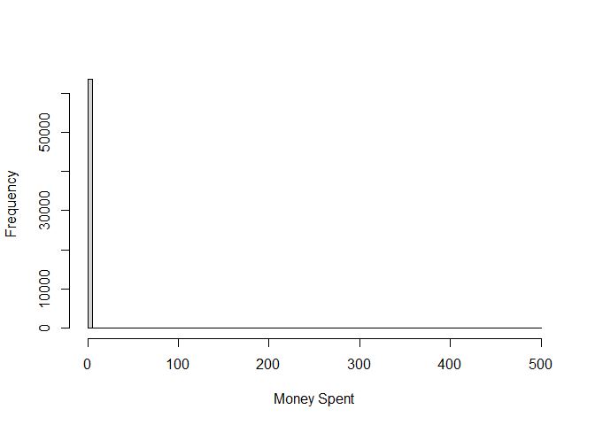<!-- -->

``` r
summary(MailAnalytics$spend)
```

    ##    Min. 1st Qu.  Median    Mean 3rd Qu.    Max. 
    ##   0.000   0.000   0.000   1.051   0.000 499.000

We see that in the vast majority of cases, individuals spent no money,
i.e., there is an excessive number of zeros in the dataset. This means
our linear regression model of the outcome is seriously misspecified.

``` r
lm_model_adj <- lm(spend ~ segment + recency + history + mens + womens + zip_code + newbie + channel, data = MailAnalytics, weights = prop_scores_model_ebal$weights)

library(DHARMa)
simulationOutput <- simulateResiduals(fittedModel = lm_model_adj)
plot(simulationOutput)
```

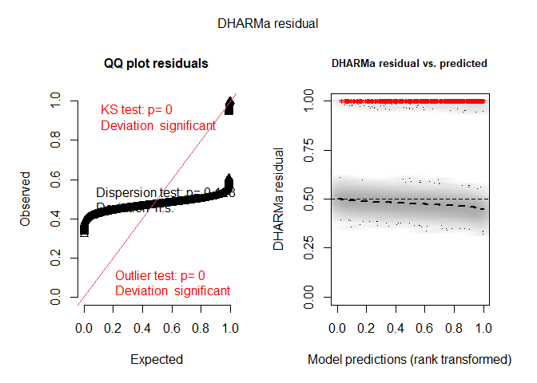<!-- -->

To be clear, for estimating ATE this does not matter as much. Our
estimates are consistent either way, thanks to a randomized experimental
design. Still, using a more appropriate model could improve the
precision of our estimate.

Before we start modeling, there is one more thing to consider. If we
look at the amounts spent, we notice that all are greater than 29.99
(which is likely the price of the cheapest product).

``` r
summary(MailAnalytics$spend[MailAnalytics$spend>0])
```

    ##    Min. 1st Qu.  Median    Mean 3rd Qu.    Max. 
    ##   29.99   32.27   80.80  116.36  153.35  499.00

This is a bit problematic for the models we will consider, since they
assume that the outcome is from $`1,2,3,\ \ldots`$ (or $`(0,+\infty)`$)
and hence, they will predict unrealistic results. To correct that, we
will shift non-zero outcomes to 1.

``` r
MailAnalytics_mod <- MailAnalytics
MailAnalytics_mod$spend[MailAnalytics_mod$spend >0] <- MailAnalytics_mod$spend[MailAnalytics_mod$spend >0]-28.99
```

An obvious choice for this data is a hurdle model. We have a basic
choice between the Poisson one and the negative binomial one. Let us fit
both and compare their AIC.

``` r
library(glmmTMB)
hurdle_model_poisson <- glmmTMB(formula = spend ~ segment + recency + history + mens + womens + zip_code + newbie + channel, ziformula = ~ segment + recency + history + mens + zip_code + newbie + channel,data = MailAnalytics_mod, family = truncated_poisson(), weights = prop_scores_model_ebal$weights)
```

``` r
hurdle_model_negbin <- glmmTMB(formula = spend ~ segment + recency + history + mens + womens + zip_code + newbie + channel, ziformula = ~ segment + recency + history + mens + zip_code + newbie + channel,data = MailAnalytics_mod, family = truncated_nbinom2(), weights = prop_scores_model_ebal$weights)
```

``` r
AIC(hurdle_model_poisson)
```

    ## [1] 224817.6

``` r
AIC(hurdle_model_negbin)
```

    ## [1] 37220.31

We see that the negative binomial model is far better. This is not that
surprising, since the Poisson model often struggles on real data due to
its “inflexible” variance function $`\mathbb{E}Y = \text{Var} Y`$. Let’s
check the negative binomial model using simulated residuals.

``` r
simulationOutput <- simulateResiduals(fittedModel = hurdle_model_negbin)
plotQQunif(simulationOutput)
```

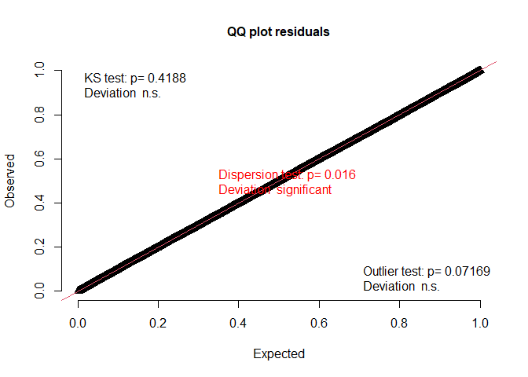<!-- -->

``` r
testQuantiles(simulationOutput)
```

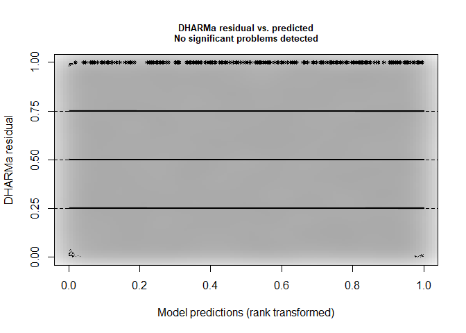<!-- -->

    ## 
    ##  Test for location of quantiles via qgam
    ## 
    ## data:  res
    ## p-value = 0.9068
    ## alternative hypothesis: both

We will also use a rootogram to assess the fit. Unfortunately, no
rootogram is implemented directly for *glmmTMB*. However, AI-generated
code (Gemini) comes to the rescue.

``` r
# range of predictions
max_y <- max(MailAnalytics_mod$spend)
val_range <- 0:max_y

# observed counts
obs_counts <- as.vector(table(factor(round(MailAnalytics_mod$spend), levels = val_range)))

# expected counts 
mu_all <- predict(hurdle_model_negbin, type = "conditional")  # expected non-zeros
p_zero_all <- predict(hurdle_model_negbin, type = "zprob")    # probability of zeros
size_param <- sigma(hurdle_model_negbin)                      # dispersion


prob_matrix <- matrix(0, nrow = dim(MailAnalytics_mod)[1], ncol = length(val_range))

for (i in seq_along(val_range)) {
  val <- val_range[i]
  if (val == 0) {
    prob_matrix[, i] <- p_zero_all
  } else {
    # y > 0: (1 - p_zero) * P(Y = val | Y > 0)
    # P(Y = val | Y > 0) = P(Y = val) / (1 - P(Y = 0))
    p_untruncated <- dnbinom(val, mu = mu_all, size = size_param)
    p_at_zero <- dnbinom(0, mu = mu_all, size = size_param)
    
    prob_matrix[, i] <- (1 - p_zero_all) * (p_untruncated / (1 - p_at_zero))
  }
}

exp_counts <- colSums(prob_matrix)
```

We will ignore counts of 0 to make the plot more readable.

``` r
df_root <- data.frame(
  y = val_range,
  observed = obs_counts,
  expected = exp_counts,
  sqrt_obs = sqrt(obs_counts),
  sqrt_exp = sqrt(exp_counts)
)
df_root$ymin <- df_root$sqrt_exp - df_root$sqrt_obs
df_root$ymax <- df_root$sqrt_exp


ggplot(df_root, aes(x = y)) +
  geom_rect(aes(xmin = y - 0.4, xmax = y + 0.4, ymin = ymin, ymax = ymax),
            fill = "lightgray", color = "darkgray") +
  geom_line(aes(y = sqrt_exp), color = "red", size = 1) +
  geom_point(aes(y = sqrt_exp), color = "red", size = 2) +
  geom_hline(yintercept = 0, linetype = "dashed", color = "black") +
  labs(
    x = "Money Spent - 28.99",
    y = "sqrt(Frequency)"
  ) +   xlim(0, 500) + ylim(-5, 7.5) +
  theme_minimal()
```

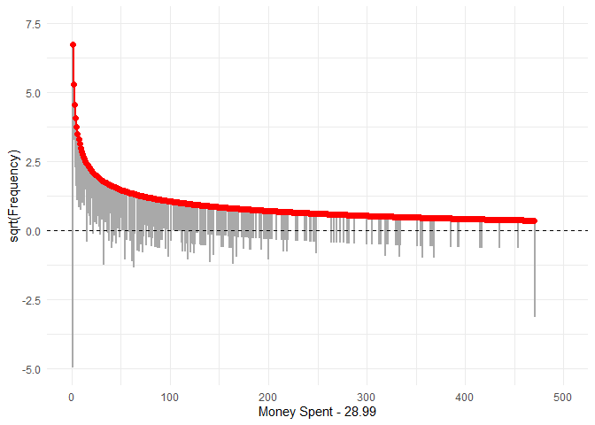<!-- -->

We notice that observed frequencies on both boundaries are off. The high
observed frequency in the right tail (499) is probably due to
truncation. As for purchase frequencies at 29.99, many people bought the
product at the minimum price, but there were significantly fewer
purchases of products with slightly higher prices.

``` r
obs_counts[1:25]
```

    ##  [1] 63422   137     4     5     6     7     3     6     5     5     1     3
    ## [13]     3     0     1     8     3     2     3     4     1     5     1     3
    ## [25]     2

``` r
exp_counts[1:25]
```

    ##  [1] 63421.775326    45.591841    27.955179    20.720368    16.684426
    ##  [6]    14.075485    12.234946    10.858873     9.786537     8.924520
    ## [11]     8.214612     7.618546     7.110073     6.670552     6.286360
    ## [16]     5.947294     5.645555     5.375072     5.131043     4.909621
    ## [21]     4.707681     4.522660     4.352432     4.195221     4.049528

Indeed, there is a significant discrete jump from price 1 to 2 (on the
modified scale). The model spreads this discrete jump across several
prices. We can smooth out the plot of these predictions by binning the
predictions and observed outcomes into groups, say by 25 dollars.

``` r
sum_obs <- tapply(obs_counts[-1], (seq_along(obs_counts[-1]) - 1) %/% 25, sum)
sum_exp <- tapply(exp_counts[-1], (seq_along(exp_counts[-1]) - 1) %/% 25, sum)

groups <- as.numeric(names(sum_obs)) 

df_plot <- data.frame(
  Group = groups,
  Observed = as.numeric(sum_obs),
  Expected = as.numeric(sum_exp)
) %>%
  pivot_longer(
    cols = c(Observed, Expected), 
    names_to = "Type", 
    values_to = "Count"
  )

ggplot(df_plot, aes(x = factor(Group), y = Count, fill = Type)) +
  geom_col(position = position_dodge(width = 0.8), width = 0.7) +
  scale_fill_manual(values = c("Observed" = "#2c3e50", "Expected" = "#e74c3c")) +
  labs(
    title = "",
    subtitle = "",
    x = "Blocks by 25",
    y = "Number of Observations in Blocks"
  ) +
  theme_minimal(base_size = 14) +
  theme(
    plot.title = element_text(face = "bold", hjust = 0.5),
    plot.subtitle = element_text(hjust = 0.5, color = "gray40"),
    legend.position = "top"
  )
```

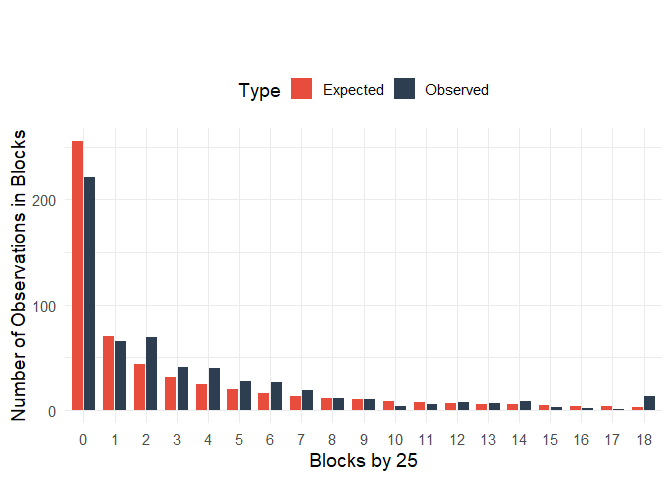<!-- -->

Still, we notice that the model tends to underestimate the earlier
counts and then consistently overestimate the counts. We can check that
by comparing the cumulative counts.

``` r
df <- data.frame(
  cum_exp = cumsum(exp_counts[-1]),
  cum_obs = cumsum(obs_counts[-1])
)

# Generate ggplot
ggplot(df, aes(x = cum_exp, y = cum_obs)) +
  geom_line(color = "#e74c3c", linewidth = 1.5) +
  geom_abline(intercept = 0, slope = 1, linetype = "dashed", color = "#2c3e50") +
  labs(
    x = "Cumulative Expected Counts",
    y = "Cumulative Observed Counts",
    title = "Cumulative Observed vs. Expected Counts"
  ) +
  theme_minimal()
```

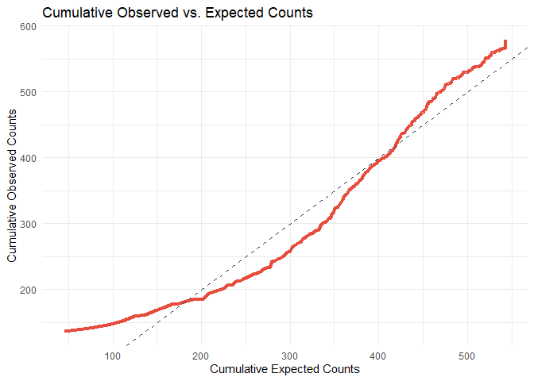<!-- -->

Indeed, the negative binomial model is slightly off. Hence, let us
consider an alternative: a tweedie model.

``` r
tweedie_model <- gam(spend ~ segment + recency + history + mens + womens + zip_code + newbie + channel, data = MailAnalytics_mod,  family = tw(), weights = prop_scores_model_ebal$weights)
```

Let’s check the fit.

``` r
simulationOutput <- simulateResiduals(fittedModel = tweedie_model)
plotQQunif(simulationOutput)
```

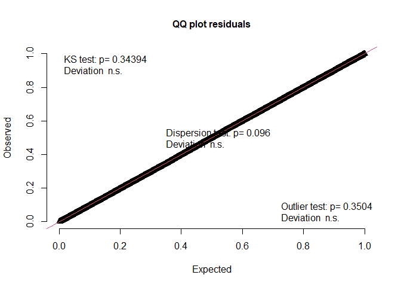<!-- -->

``` r
testQuantiles(simulationOutput)
```

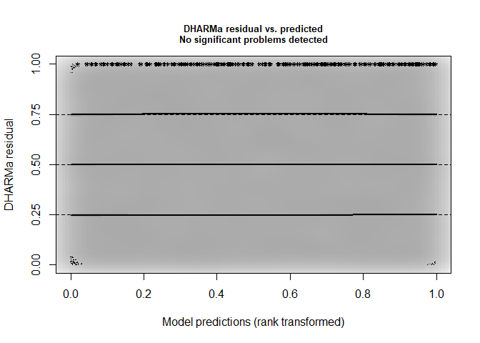<!-- -->

    ## 
    ##  Test for location of quantiles via qgam
    ## 
    ## data:  res
    ## p-value = 0.8361
    ## alternative hypothesis: both

``` r
library(tweedie)
p_estimated <- tweedie_model$family$getTheta(TRUE)  # power parameter 
phi_estimated <- summary(tweedie_model)$disp        # dispersion parameter
mu_fitted <- tweedie_model$fitted.values            # observed means

max_y <- max(MailAnalytics_mod$spend)
val_range <- 0:max_y

obs_counts <- as.vector(table(factor(round(MailAnalytics_mod$spend), levels = val_range)))
exp_counts <- numeric(length(obs_counts))

for (i in seq_along(val_range)) {
  val <- val_range[i]
  exp_counts[i] <- sum(dtweedie(y = rep(val, dim(MailAnalytics_mod)[1]), mu = mu_fitted, phi = phi_estimated, power = p_estimated))
}
```

``` r
df_root <- data.frame(
  Value = val_range,
  Observed = obs_counts,
  Expected = exp_counts,
  Top = sqrt(exp_counts),
  Bottom = sqrt(exp_counts) - sqrt(obs_counts)
)

ggplot(df_root) +
  geom_rect(aes(xmin = Value - 0.4, xmax = Value + 0.4, ymin = Bottom, ymax = Top),
            fill = "lightgray", color = "darkgray") +
  geom_line(aes(x = Value, y = Top), color = "red", size = 1) +
  geom_point(aes(x = Value, y = Top), color = "red", size = 2) +
  geom_hline(yintercept = 0, linetype = "dashed", color = "black") +
  labs(x = "Money Spent - 28.99",
       y = "sqrt(Frequency)") + xlim(0, 500) + ylim(-7.5, 7.5) +
  theme_minimal()
```

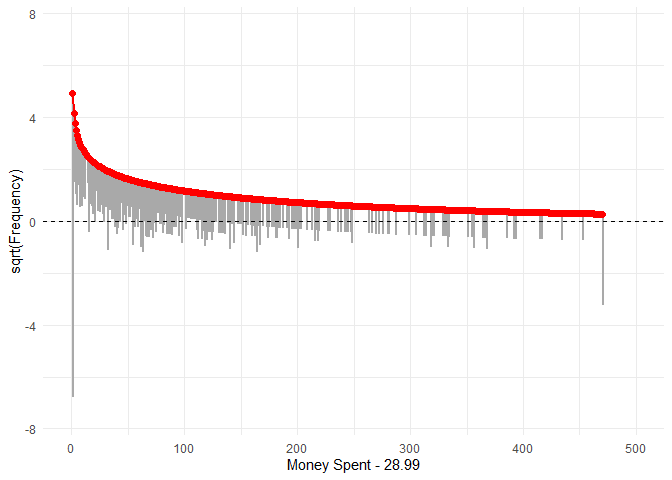<!-- -->

``` r
sum_obs <- tapply(obs_counts[-1], (seq_along(obs_counts[-1]) - 1) %/% 25, sum)
sum_exp <- tapply(exp_counts[-1], (seq_along(exp_counts[-1]) - 1) %/% 25, sum)

groups <- as.numeric(names(sum_obs)) 

df_plot <- data.frame(
  Group = groups,
  Observed = as.numeric(sum_obs),
  Expected = as.numeric(sum_exp)
) %>%
  pivot_longer(
    cols = c(Observed, Expected), 
    names_to = "Type", 
    values_to = "Count"
  )

ggplot(df_plot, aes(x = factor(Group), y = Count, fill = Type)) +
  geom_col(position = position_dodge(width = 0.8), width = 0.7) +
  scale_fill_manual(values = c("Observed" = "#2c3e50", "Expected" = "#e74c3c")) +
  labs(
    title = "",
    subtitle = "",
    x = "Blocks by 25",
    y = "Number of Observations in Blocks"
  ) +
  theme_minimal(base_size = 14) +
  theme(
    plot.title = element_text(face = "bold", hjust = 0.5),
    plot.subtitle = element_text(hjust = 0.5, color = "gray40"),
    legend.position = "top"
  )
```

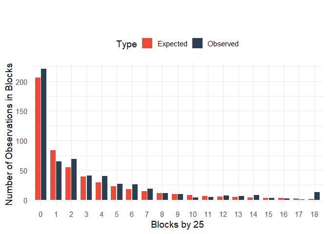<!-- -->

``` r
df <- data.frame(
  cum_exp = cumsum(exp_counts[-1]),
  cum_obs = cumsum(obs_counts[-1])
)

# Generate ggplot
ggplot(df, aes(x = cum_exp, y = cum_obs)) +
  geom_line(color = "#e74c3c", linewidth = 1.5) +
  geom_abline(intercept = 0, slope = 1, linetype = "dashed", color = "#2c3e50") +
  labs(
    x = "Cumulative Expected Counts",
    y = "Cumulative Observed Counts",
    title = "Cumulative Observed vs. Expected Counts"
  ) +
  theme_minimal()
```

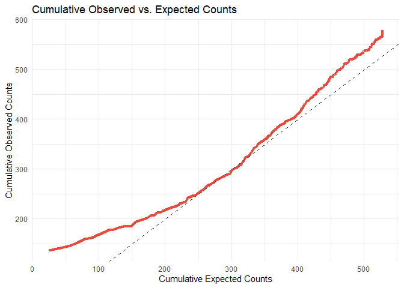<!-- -->

The tweedie model fits the data better. There are still discrepancies on
both tails due to discrete jumps in the data, but the middle part is
much better calibrated than the negative binomial model.

Let’s estimate the ATE using our tweedie model. We need to undo the
shift in the outcomes. We will use the fact that
``` math
\mathbb{E}Y = \mathbb{E}(Y_\text{mod} + 28.99I(Y>28.99))  = \mathbb{E}Y_\text{mod} + 28.99P[Y>28.99] = \mathbb{E}Y_\text{mod} + 28.99(1-P[Y_\text{mod}>0])
```

``` r
MailAnalytics_mod0 <- MailAnalytics_mod
MailAnalytics_mod1 <- MailAnalytics_mod
MailAnalytics_mod2 <- MailAnalytics_mod

MailAnalytics_mod0$segment <- 'No E-Mail'
MailAnalytics_mod1$segment <- 'Mens E-Mail'
MailAnalytics_mod2$segment <- 'Womens E-Mail'

exp_0 <- predict(tweedie_model, MailAnalytics_mod0, type = 'response')
exp_1 <- predict(tweedie_model, MailAnalytics_mod1, type = 'response')
exp_2 <- predict(tweedie_model, MailAnalytics_mod2, type = 'response')

exp_orig_0 <- exp_0 + 28.99*(1-dtweedie(y = numeric(length(exp_0)), mu = exp_0, phi = phi_estimated, power = p_estimated))
exp_orig_1 <- exp_1 + 28.99*(1-dtweedie(y = numeric(length(exp_1)), mu = exp_1, phi = phi_estimated, power = p_estimated))
exp_orig_2 <- exp_2 + 28.99*(1-dtweedie(y = numeric(length(exp_2)), mu = exp_2, phi = phi_estimated, power = p_estimated))
```

We get the following ATE estimates.

``` r
mean(exp_orig_1-exp_orig_0)
```

    ## [1] 0.6801216

``` r
mean(exp_orig_2-exp_orig_0)
```

    ## [1] 0.4699376

``` r
mean(exp_orig_1-exp_orig_2)
```

    ## [1] 0.210184

The results are slightly different. Let’s bootstrap our method.

``` r
set.seed(123)
nb <- 100

ate_est <- matrix(0,nb,3)

for(i in 1:nb){
  
  MailAnalytics_new <-  MailAnalytics[sample(nrow(MailAnalytics) , rep=TRUE),]
  
  prop_scores_ebal_new <- weightit(segment ~ recency + history + mens + zip_code + newbie +channel, data = MailAnalytics_new, method = "ebal", estimand = "ATE", over = FALSE, moment = 2, int = TRUE)
  
  
  MailAnalytics_new_mod <- MailAnalytics_new
  MailAnalytics_new_mod$spend[MailAnalytics_new_mod$spend >0] <- MailAnalytics_new_mod$spend[MailAnalytics_new_mod$spend >0]-28.99
  
  tweedie_model_new <- gam(spend ~ segment + recency + history + mens + zip_code + newbie + channel, data = MailAnalytics_new_mod,  family = tw(), weights = prop_scores_ebal_new$weights)

  MailAnalytics_mod0 <- MailAnalytics_new_mod
  MailAnalytics_mod1 <- MailAnalytics_new_mod
  MailAnalytics_mod2 <- MailAnalytics_new_mod
  
  MailAnalytics_mod0$segment <- 'No E-Mail'
  MailAnalytics_mod1$segment <- 'Mens E-Mail'
  MailAnalytics_mod2$segment <- 'Womens E-Mail'
  
  exp_0 <- predict(tweedie_model_new, MailAnalytics_mod0, type = 'response')
  exp_1 <- predict(tweedie_model_new, MailAnalytics_mod1, type = 'response')
  exp_2 <- predict(tweedie_model_new, MailAnalytics_mod2, type = 'response')
  
  exp_orig_0 <- exp_0 + 28.99*(1-dtweedie(y = numeric(length(exp_0)), mu = exp_0, phi = phi_estimated, power = p_estimated))
  exp_orig_1 <- exp_1 + 28.99*(1-dtweedie(y = numeric(length(exp_1)), mu = exp_1, phi = phi_estimated, power = p_estimated))
  exp_orig_2 <- exp_2 + 28.99*(1-dtweedie(y = numeric(length(exp_2)), mu = exp_2, phi = phi_estimated, power = p_estimated))


  ate_est[i,1] <-  mean(exp_orig_1 - exp_orig_0)
  ate_est[i,2] <-  mean(exp_orig_2 - exp_orig_0)
  ate_est[i,3] <-  mean(exp_orig_1-exp_orig_2)
}

results2 <- apply(ate_est,2,function(x) quantile(x, c(0.025,0.975)))
colnames(results2) <- c("Men's - No", "Women's - No", "Men's - Women's")

results_all <- rbind(results, results2)
rownames(results_all) <- c('2.5% (linear)','97.5%  (linear)','2.5%  (tweedie)','97.5%  (tweedie)')
results_all
```

    ##                  Men's - No Women's - No Men's - Women's
    ## 2.5% (linear)     0.5187246    0.1433831      0.03436567
    ## 97.5%  (linear)   1.1761629    0.7179392      0.68623880
    ## 2.5%  (tweedie)   0.4463901    0.1535413     -0.09914633
    ## 97.5%  (tweedie)  1.0450894    0.7406368      0.56163261

The confidence intervals are very similar to our original estimates.
Overall, we obtained (very) slightly tighter confidence intervals for
our trouble.

## Estimating CATE with respect to Past Purchases

We mentioned that the treatment effect is probably heterogeneous in the
data, since customers’ interest will depend on their gender. Now, we do
not know their gender from the data. However, we know whether they
bought men’s or women’s merchandise. Hence, let us estimate conditional
ATE (CATE) in subgroups based on past purchases for men and women.

We will use linear regression first.

``` r
lm_model_adj <- lm_weightit(spend ~ segment*(recency + history + mens + womens + zip_code + newbie + channel), data = MailAnalytics, weightit  = prop_scores_model_ebal)
avg_comparisons(lm_model_adj, variables = "segment", by = "mens")
```

    ## 
    ##                   Contrast mens Estimate Std. Error    z Pr(>|z|)    S  2.5 %
    ##  Mens E-Mail - No E-Mail      0    0.615      0.176 3.50   <0.001 11.1  0.270
    ##  Womens E-Mail - No E-Mail    0    0.636      0.171 3.72   <0.001 12.3  0.301
    ##  Mens E-Mail - No E-Mail      1    0.887      0.221 4.01   <0.001 14.0  0.454
    ##  Womens E-Mail - No E-Mail    1    0.263      0.194 1.36    0.175  2.5 -0.117
    ##  97.5 %
    ##   0.960
    ##   0.971
    ##   1.321
    ##   0.643
    ## 
    ## Term: segment
    ## Type: probs

``` r
avg_comparisons(lm_model_adj, variables = "segment", by = "womens")
```

    ## 
    ##                   Contrast womens Estimate Std. Error    z Pr(>|z|)    S  2.5 %
    ##  Mens E-Mail - No E-Mail        0    0.671      0.224 3.00  0.00273  8.5  0.232
    ##  Womens E-Mail - No E-Mail      0    0.284      0.210 1.35  0.17598  2.5 -0.127
    ##  Mens E-Mail - No E-Mail        1    0.842      0.191 4.42  < 0.001 16.6  0.469
    ##  Womens E-Mail - No E-Mail      1    0.550      0.167 3.29  < 0.001 10.0  0.223
    ##  97.5 %
    ##   1.110
    ##   0.696
    ##   1.216
    ##   0.878
    ## 
    ## Term: segment
    ## Type: probs

We notice that the treatment effect is clearly heterogeneous. Most
interestingly, women’s e-mails appear to be not very effective for
individuals who bought merchandise for men/ did not buy merchandise for
women. On the other hand, this effect does not appear to be as strong in
reverse, i.e., the benefit of men’s e-mails for those who bought
merchandise for women/did not buy merchandise for men. This is probably
one of the reasons why men’s e-mails appear to be more effective
overall.

Let’s fit our tweedie model, check the fit, and reestimate these CATEs.

``` r
tweedie_model <- gam(spend ~ segment*(recency + history + mens + womens + zip_code + newbie + channel), data = MailAnalytics_mod,  family = tw(), weights = prop_scores_model_ebal$weights)
```

``` r
simulationOutput <- simulateResiduals(fittedModel = tweedie_model)
plotQQunif(simulationOutput)
```

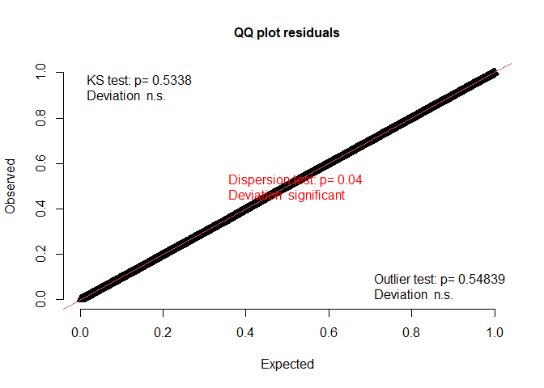<!-- -->

``` r
testQuantiles(simulationOutput)
```

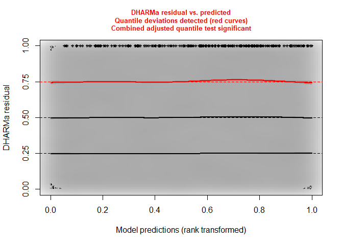<!-- -->

    ## 
    ##  Test for location of quantiles via qgam
    ## 
    ## data:  res
    ## p-value = 0.04978
    ## alternative hypothesis: both

``` r
p_estimated <- tweedie_model$family$getTheta(TRUE)  # power parameter 
phi_estimated <- summary(tweedie_model)$disp        # dispersion parameter
mu_fitted <- tweedie_model$fitted.values            # observed means

max_y <- max(MailAnalytics_mod$spend)
val_range <- 0:max_y

obs_counts <- as.vector(table(factor(round(MailAnalytics_mod$spend), levels = val_range)))
exp_counts <- numeric(length(obs_counts))

for (i in seq_along(val_range)) {
  val <- val_range[i]
  exp_counts[i] <- sum(dtweedie(y = rep(val, dim(MailAnalytics_mod)[1]), mu = mu_fitted, phi = phi_estimated, power = p_estimated))
}
```

``` r
df_root <- data.frame(
  Value = val_range,
  Observed = obs_counts,
  Expected = exp_counts,
  Top = sqrt(exp_counts),
  Bottom = sqrt(exp_counts) - sqrt(obs_counts)
)

ggplot(df_root) +
  geom_rect(aes(xmin = Value - 0.4, xmax = Value + 0.4, ymin = Bottom, ymax = Top),
            fill = "lightgray", color = "darkgray") +
  geom_line(aes(x = Value, y = Top), color = "red", size = 1) +
  geom_point(aes(x = Value, y = Top), color = "red", size = 2) +
  geom_hline(yintercept = 0, linetype = "dashed", color = "black") +
  labs(x = "Money Spent - 28.99",
       y = "sqrt(Frequency)") + xlim(0, 500) + ylim(-7.5, 7.5) +
  theme_minimal()
```

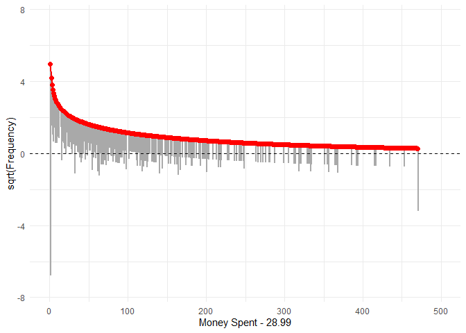<!-- -->

``` r
sum_obs <- tapply(obs_counts[-1], (seq_along(obs_counts[-1]) - 1) %/% 25, sum)
sum_exp <- tapply(exp_counts[-1], (seq_along(exp_counts[-1]) - 1) %/% 25, sum)

groups <- as.numeric(names(sum_obs)) 

df_plot <- data.frame(
  Group = groups,
  Observed = as.numeric(sum_obs),
  Expected = as.numeric(sum_exp)
) %>%
  pivot_longer(
    cols = c(Observed, Expected), 
    names_to = "Type", 
    values_to = "Count"
  )

ggplot(df_plot, aes(x = factor(Group), y = Count, fill = Type)) +
  geom_col(position = position_dodge(width = 0.8), width = 0.7) +
  scale_fill_manual(values = c("Observed" = "#2c3e50", "Expected" = "#e74c3c")) +
  labs(
    title = "",
    subtitle = "",
    x = "Blocks by 25",
    y = "Number of Observations in Blocks"
  ) +
  theme_minimal(base_size = 14) +
  theme(
    plot.title = element_text(face = "bold", hjust = 0.5),
    plot.subtitle = element_text(hjust = 0.5, color = "gray40"),
    legend.position = "top"
  )
```

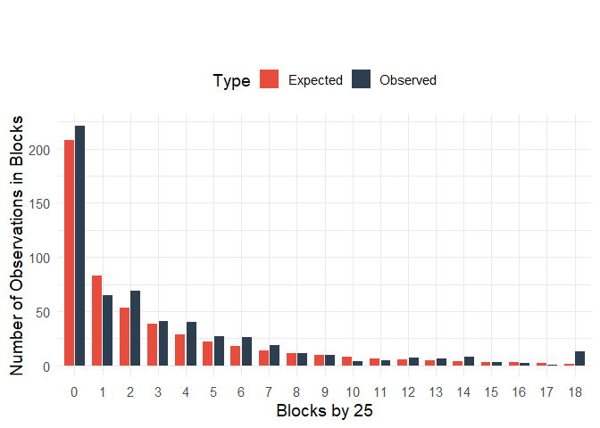<!-- -->

``` r
df <- data.frame(
  cum_exp = cumsum(exp_counts[-1]),
  cum_obs = cumsum(obs_counts[-1])
)

# Generate ggplot
ggplot(df, aes(x = cum_exp, y = cum_obs)) +
  geom_line(color = "#e74c3c", linewidth = 1.5) +
  geom_abline(intercept = 0, slope = 1, linetype = "dashed", color = "#2c3e50") +
  labs(
    x = "Cumulative Expected Counts",
    y = "Cumulative Observed Counts",
    title = "Cumulative Observed vs. Expected Counts"
  ) +
  theme_minimal()
```

<!-- -->

``` r
set.seed(123)
nb <- 100

ate_est <- matrix(0,nb,8)

for(i in 1:nb){
  
  MailAnalytics_new <-  MailAnalytics[sample(nrow(MailAnalytics) , rep=TRUE),]
  
  prop_scores_ebal_new <- weightit(segment ~ recency + history + mens + zip_code + newbie +channel, data = MailAnalytics_new, method = "ebal", estimand = "ATE", over = FALSE, moment = 2, int = TRUE)
  
  
  MailAnalytics_new_mod <- MailAnalytics_new
  MailAnalytics_new_mod$spend[MailAnalytics_new_mod$spend >0] <- MailAnalytics_new_mod$spend[MailAnalytics_new_mod$spend >0]-28.99
  
  tweedie_model_new <- gam(spend ~ segment*(recency + history + mens + zip_code + newbie + channel), data = MailAnalytics_new_mod,  family = tw(), weights = prop_scores_ebal_new$weights)

  MailAnalytics_mod0 <- MailAnalytics_new_mod
  MailAnalytics_mod1 <- MailAnalytics_new_mod
  MailAnalytics_mod2 <- MailAnalytics_new_mod
  
  MailAnalytics_mod0$segment <- 'No E-Mail'
  MailAnalytics_mod1$segment <- 'Mens E-Mail'
  MailAnalytics_mod2$segment <- 'Womens E-Mail'
  
  exp_0 <- predict(tweedie_model_new, MailAnalytics_mod0[MailAnalytics_mod0$mens == 1,], type = 'response')
  exp_1 <- predict(tweedie_model_new, MailAnalytics_mod1[MailAnalytics_mod0$mens == 1,], type = 'response')
  exp_2 <- predict(tweedie_model_new, MailAnalytics_mod2[MailAnalytics_mod0$mens == 1,], type = 'response')
  
  exp_orig_0 <- exp_0 + 28.99*(1-dtweedie(y = numeric(length(exp_0)), mu = exp_0, phi = phi_estimated, power = p_estimated))
  exp_orig_1 <- exp_1 + 28.99*(1-dtweedie(y = numeric(length(exp_1)), mu = exp_1, phi = phi_estimated, power = p_estimated))
  exp_orig_2 <- exp_2 + 28.99*(1-dtweedie(y = numeric(length(exp_2)), mu = exp_2, phi = phi_estimated, power = p_estimated))


  ate_est[i,1] <-  mean(exp_orig_1 - exp_orig_0)
  ate_est[i,2] <-  mean(exp_orig_2 - exp_orig_0)
  
  
  exp_0 <- predict(tweedie_model_new, MailAnalytics_mod0[MailAnalytics_mod0$mens == 0,], type = 'response')
  exp_1 <- predict(tweedie_model_new, MailAnalytics_mod1[MailAnalytics_mod0$mens == 0,], type = 'response')
  exp_2 <- predict(tweedie_model_new, MailAnalytics_mod2[MailAnalytics_mod0$mens == 0,], type = 'response')
  
  exp_orig_0 <- exp_0 + 28.99*(1-dtweedie(y = numeric(length(exp_0)), mu = exp_0, phi = phi_estimated, power = p_estimated))
  exp_orig_1 <- exp_1 + 28.99*(1-dtweedie(y = numeric(length(exp_1)), mu = exp_1, phi = phi_estimated, power = p_estimated))
  exp_orig_2 <- exp_2 + 28.99*(1-dtweedie(y = numeric(length(exp_2)), mu = exp_2, phi = phi_estimated, power = p_estimated))


  ate_est[i,3] <-  mean(exp_orig_1 - exp_orig_0)
  ate_est[i,4] <-  mean(exp_orig_2 - exp_orig_0)

  exp_0 <- predict(tweedie_model_new, MailAnalytics_mod0[MailAnalytics_mod0$womens == 1,], type = 'response')
  exp_1 <- predict(tweedie_model_new, MailAnalytics_mod1[MailAnalytics_mod0$womens == 1,], type = 'response')
  exp_2 <- predict(tweedie_model_new, MailAnalytics_mod2[MailAnalytics_mod0$womens == 1,], type = 'response')
  
  exp_orig_0 <- exp_0 + 28.99*(1-dtweedie(y = numeric(length(exp_0)), mu = exp_0, phi = phi_estimated, power = p_estimated))
  exp_orig_1 <- exp_1 + 28.99*(1-dtweedie(y = numeric(length(exp_1)), mu = exp_1, phi = phi_estimated, power = p_estimated))
  exp_orig_2 <- exp_2 + 28.99*(1-dtweedie(y = numeric(length(exp_2)), mu = exp_2, phi = phi_estimated, power = p_estimated))

  ate_est[i,5] <-  mean(exp_orig_1 - exp_orig_0)
  ate_est[i,6] <-  mean(exp_orig_2 - exp_orig_0)
  
  exp_0 <- predict(tweedie_model_new, MailAnalytics_mod0[MailAnalytics_mod0$womens == 0,], type = 'response')
  exp_1 <- predict(tweedie_model_new, MailAnalytics_mod1[MailAnalytics_mod0$womens == 0,], type = 'response')
  exp_2 <- predict(tweedie_model_new, MailAnalytics_mod2[MailAnalytics_mod0$womens == 0,], type = 'response')
  
  exp_orig_0 <- exp_0 + 28.99*(1-dtweedie(y = numeric(length(exp_0)), mu = exp_0, phi = phi_estimated, power = p_estimated))
  exp_orig_1 <- exp_1 + 28.99*(1-dtweedie(y = numeric(length(exp_1)), mu = exp_1, phi = phi_estimated, power = p_estimated))
  exp_orig_2 <- exp_2 + 28.99*(1-dtweedie(y = numeric(length(exp_2)), mu = exp_2, phi = phi_estimated, power = p_estimated))

  ate_est[i,7] <-  mean(exp_orig_1 - exp_orig_0)
  ate_est[i,8] <-  mean(exp_orig_2 - exp_orig_0)
  
}

results3 <- apply(ate_est,2,function(x) quantile(x, c(0.025, 0.5, 0.975)))
colnames(results3) <- c("Men's E-Mail (Mens == 1)", "Women's Email (Mens == 1)", "Men's E-Mail (Mens == 0)", "Women's Email (Mens == 0)", "Men's E-Mail (Womens == 1)", "Women's Email (Womens == 1)", "Men's E-Mail (Womens == 0)", "Women's Email (Womens == 0)")
t(results3)
```

    ##                                   2.5%       50%     97.5%
    ## Men's E-Mail (Mens == 1)     0.4376612 0.8276922 1.4324783
    ## Women's Email (Mens == 1)   -0.2246517 0.1466412 0.5854441
    ## Men's E-Mail (Mens == 0)     0.1093410 0.4537952 0.8115086
    ## Women's Email (Mens == 0)    0.3147905 0.6798567 1.0468050
    ## Men's E-Mail (Womens == 1)   0.3152639 0.5762632 0.9638991
    ## Women's Email (Womens == 1)  0.3334090 0.6138944 0.9450460
    ## Men's E-Mail (Womens == 0)   0.3732089 0.7379160 1.3278956
    ## Women's Email (Womens == 0) -0.2429560 0.1038494 0.5571978

We have obtained similar results.

## References

<div id="refs" class="references csl-bib-body hanging-indent">

<div id="ref-imbens2000role" class="csl-entry">

Imbens, Guido W. 2000. “The Role of the Propensity Score in Estimating
Dose-Response Functions.” *Biometrika* 87 (3): 706–10.

</div>

</div>
