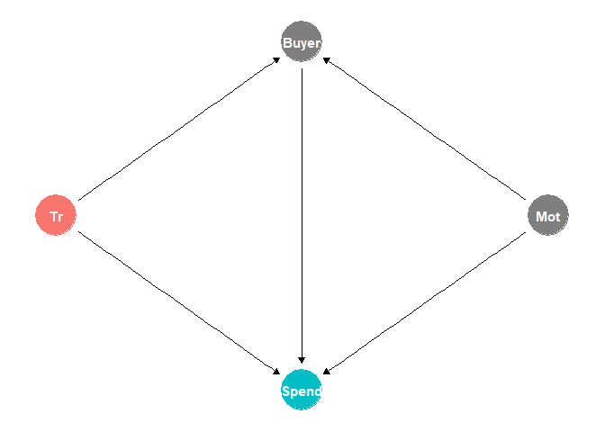
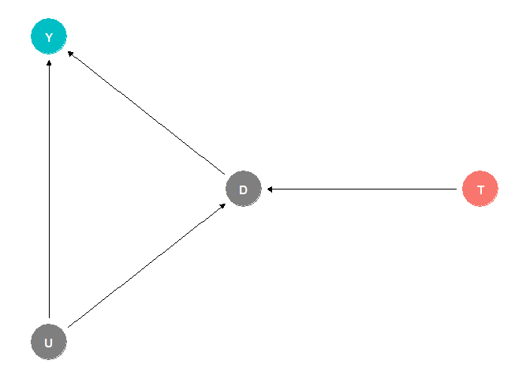
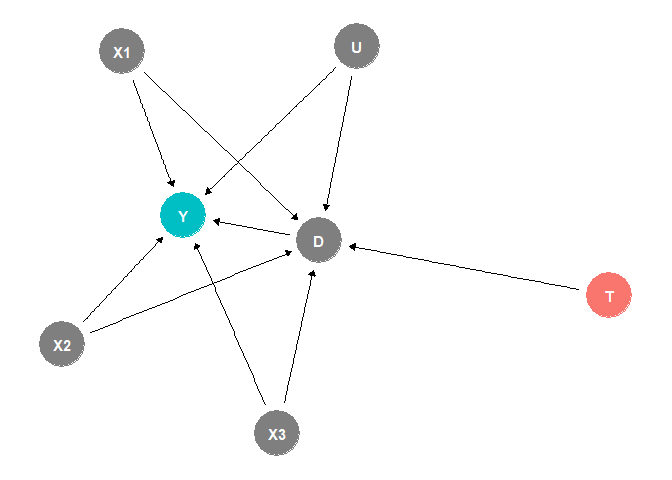
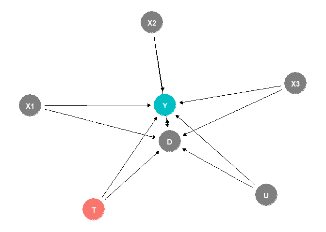
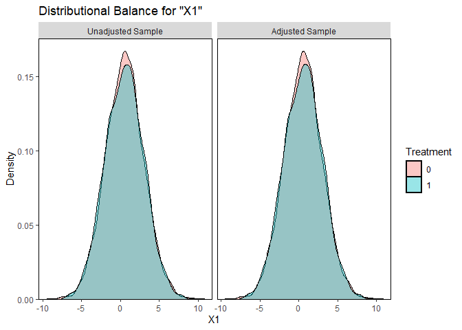
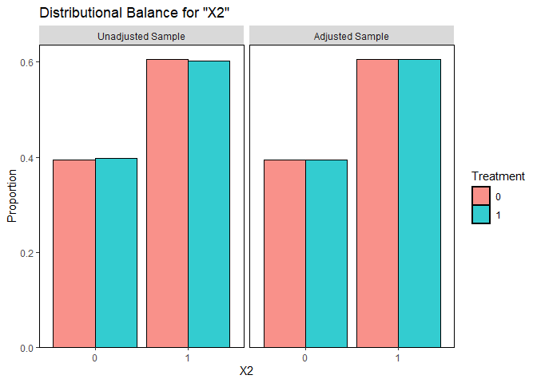
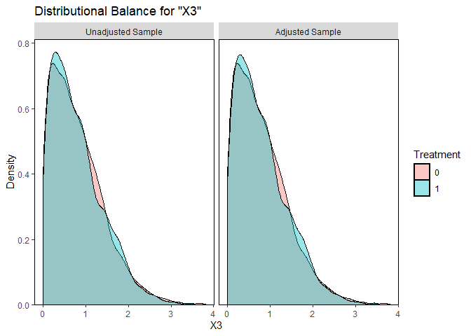

# The First Casualty of Statistics: Part Fifteen
<big>**Compliance**</big>

<br/>
Jiří Fejlek

2026-09-15
<br/>

<br/> In Part Fifteen, we encountered the treatment that incentivizes
individuals to perform some action that influences the outcome of
interest. In particular, we examined a dataset to assess the effect of
email advertising on merchandise purchases. What is interesting about
this problem is that individuals are not actually compelled to buy
something. Some individuals will not buy anything, and some will spend
money regardless of whether they received the email. Another example of
this framework is a randomized experiment in which we assign treatments
at random, but some individuals choose not to comply with the
assignment.

In these examples, the simple average treatment effect ATE is not that
useful. In our first example, the treatment’s effect is mainly on those
who bought something *because* of the email. When we compute ATE, we
average the treatment effect over the whole population, mixing up
various subgroups that interact with the treatment in fundamentally
different ways. For the second example, this difference is clearest,
since we are usually interested in the actual treatment effect, not just
the *treatment assignment effect*.

In this part, we will introduce the *complier average causal effect*
(CACE), also referred to as the *local average treatment effect* (LATE).
This causal treatment effect refers to the causal effect on a
subpopulation for which the treatment (assignment) actually changed
their actions, and hence is often the main metric of interest. <br/>

## Table of Contents

- [E-Mail Analytics And Data Mining Challenge
  Revisited](#e-mail-analytics-and-data-mining-challenge-revisited)
- [Compliance](#compliance)
- [Complier Average Causal Effect (assuming No Direct Effect of
  T)](#complier-average-causal-effect-assuming-no-direct-effect-of-t)
- [Complier Average Causal Effect (with Direct Effect of
  T)](#complier-average-causal-effect-with-direct-effect-of-t)
  - [Heterogeneous Direct Effect of
    T](#heterogeneous-direct-effect-of-t)
- [Estimating LATE in E-Mail Analytics And Data Mining Challenge](#estimating-late-in-e-mail-analytics-and-data-mining-challenge)
- [References](#references)

``` r
library(tidyr)
library(dplyr)
library(tibble)
library(ggplot2)
library(patchwork)
library(dagitty)
library(ggdag)
library(modelsummary)
library(GGally)
library(estimatr)
library(WeightIt)
library(MatchIt)
library(cobalt)
library(mgcv)
library(marginaleffects)
```

## E-Mail Analytics And Data Mining Challenge Revisited

Let us return to The MineThatData E-Mail Analytics And Data Mining
Challenge
(<https://blog.minethatdata.com/2008/03/minethatdata-e-mail-analytics-and-data.html>),
which we explored a bit in Part Fifteen.

``` r
MailAnalytics_orig <- read.csv("E-MailAnalytics_Data.csv")
MailAnalytics <- MailAnalytics_orig[c(-2)]
MailAnalytics$mens <- factor(MailAnalytics$mens)
MailAnalytics$womens <- factor(MailAnalytics$womens)
MailAnalytics$newbie <- factor(MailAnalytics$newbie)
MailAnalytics$zip_code <- factor(MailAnalytics$zip_code)
MailAnalytics$channel <- factor(MailAnalytics$channel)
MailAnalytics$segment <- factor(MailAnalytics$segment)
MailAnalytics$segment <- relevel(MailAnalytics$segment, ref = "No E-Mail")
```

In the winning solution to the challenge at
<https://www.stochasticsolutions.com/pdf/HillstromChallenge.pdf>, the
authors write.

*The results are fascinating. … Notice the radically different patterns.
Among purchasers, the average spend is actually slightly lower for those
who received the Men’s mailing than for those who received nothing,
while for those who received the Women’s it is nearly \$8.00 higher. …*

The authors refer to the following results. When we compute the ATE of
the treatment (men’s email versus women’s email versus no email), we get
the following.

``` r
mean(MailAnalytics$spend[MailAnalytics$segment == 'Mens E-Mail']) - mean(MailAnalytics$spend[MailAnalytics$segment == 'No E-Mail'])
```

    ## [1] 0.7698272

``` r
mean(MailAnalytics$spend[MailAnalytics$segment == 'Womens E-Mail']) - mean(MailAnalytics$spend[MailAnalytics$segment == 'No E-Mail'])
```

    ## [1] 0.4244122

However, if we look at the actual buyers, we get a very different
picture.

``` r
mean(MailAnalytics$spend[MailAnalytics$segment == 'Mens E-Mail' & MailAnalytics$conversion  == 1]) - mean(MailAnalytics$spend[MailAnalytics$segment == 'No E-Mail' & MailAnalytics$conversion  == 1])
```

    ## [1] -0.4757761

``` r
mean(MailAnalytics$spend[MailAnalytics$segment == 'Womens E-Mail' & MailAnalytics$conversion  == 1]) - mean(MailAnalytics$spend[MailAnalytics$segment == 'No E-Mail' & MailAnalytics$conversion  == 1])
```

    ## [1] 7.892057

It would seem that the effect of men’s emails is actually negative on
money spent, even though men’s emails have larger ATE! On the other
hand, the effect of women’s emails is very positive. What is going on?
Well, we are in part sixteen of “course” of causal inference, so we
should have some basic instincts by now.

First, adjusting and conditioning with respect to some covariate are
essentially the same thing. Hence, we have to be very careful when
interpreting the estimated effect when examining selected subgroups.
Secondly, we know that the treatment clearly affects whether an
individual buys something, and that whether someone becomes a buyer
influences how much (if any) money they will spend. This implies we are
at least conditioning on a mediator.

When we draw a DAG, we see that we most likely introduced a collider
bias into our estimation. This is because whether someone becomes a
buyer and how much they spend depend on an unobserved (latent)
confounder, which we can interpret as *motivation* to buy merchandise.

``` r
dag <- dagify(Spend ~ Tr + Buyer + Mot, Buyer ~ Tr + Mot,  exposure = 'Tr', outcome = 'Spend')
ggdag_status(dag) + theme_dag() + theme(legend.position = "none")
```

<!-- -->

By conditioning on **buyer**, we opened a non-causal path to **spend**.
This means that these conditional treatment effects actually have no
causal meaning and are just uninterpretable numbers.

The way to understand it from a more practical, less formal standpoint
is to compare two *incomparable* groups. The group that bought something
even though they did not receive an email is people who would buy it
anyway, regardless of whether they receive the email. The second group
of buyers who received an email includes the types of people from the
first group, as well as those who bought something because of the
advertisement. These people bought less and hence made the average
spending appear lower, which resulted in a seemingly negative effect of
sending advertising emails.

What is fascinating about this is that we are talking about a solution
from 2008, which demonstrates how young causal inference really is and
how little even the most fundamental ideas had spread to the larger
community of statisticians and data scientists, even less than 20 years
ago.

Still, focusing attention on the subpopulation that actually bought
something makes sense, and it is definitely an estimand of interest. But
we must do so in a less straightforward way to avoid selection bias.

## Compliance

Let us assume that the treatment $`T`$ encourages an individual to
perform $`D`$, which in turn causes outcome $`Y`$ (Ding 2024). In our
example, the treatment is the emails, $`D`$ denotes becoming a buyer,
and the outcome is money spent. The second example we provide is a
randomized clinical trial, in which $`T`$ denotes the randomized
treatment assignment, $`D`$ denotes whether individuals actually
received the treatment, and $`Y`$ is the outcome of interest. This
second framework is the one originally conceived as we developed the
methods we explore. Hence, the terminology treatment assignment,
treatment, and outcomes is the most common in the literature (Ding
2024).

Now, the *core assumption* of the rest of this text is that $`T`$ is
*assigned randomly*, i.e., for each individual we have two potential
outcomes $`D(0)`$ and $`D(1)`$ for $`D`$, and $`Y(0)`$, $`Y(1)`$ for
$`Y`$, and we assume
``` math
 \{D(0), D(1), Y(0), Y(1)\} \perp T.
```
Since we are dealing with a randomized experiment, we can easily
estimate two ATEs
``` math
 \tau_D = \mathbb{E}(D(1) - D(0)) =  \mathbb{E}(D \mid T = 1) - \mathbb{E}(D \mid T = 0)
```
and
``` math
 \tau_Y = \mathbb{E}(Y(1) - Y(0)) =  \mathbb{E}(Y \mid T = 1) - \mathbb{E}(Y \mid T = 0).
```
This second estimate is known as the intention-to-treat (ITT) analysis.
However, as we discussed in the introduction, these estimates might not
be the one of interest. This can best be illustrated by returning to the
interpretation from clinical trials, in which $`T`$ denotes the
treatment assignment and $`D`$ denotes the treatment itself. If
noncompliance is high, e.g., many people will not take the treatment in
the treated group, the treatment effect of actual interest, $`D`$ on
$`Y`$, estimated by a simple comparison of the “treated” and “control”
groups, will appear very low despite $`D`$ being effective.

To untangle these additional causal relations and estimate the effect of
$`D`$, we split the population into four distinct groups based on
compliance with $`T`$, which we denote $`G`$ (Ding 2024).

- $`G_i = \text{always-taker}`$ (*always-buyer*):
  $`D_i(0) = D_i(1) = 1`$
- $`G_i = \text{never-taker}`$ (*never-buyer*): $`D_i(0) = D_i(1) = 1`$
- $`G_i = \text{complier}`$: $`D_i(0) = 0`$ and $`D_i(1) = 1`$
- $`G_i = \text{defier}`$: $`D_i(0) = 1`$ and $`D_i(1) = 0`$

Treatment $`T`$ does not influence always-takers and never-takers with
respect to their potential outcomes for $`D`$. Compliers do as “they
were told to”. Defiers do the exact opposite.

The standard assumption for inference is that there are no defiers in
the data. We will see later that this assumption is the *monotonicity
assumption* for the methods of instrumental variables (Ding 2024). This
assumption makes causal inference much simpler, since we can conclude
that everyone in the control group for whom $`D_i = 1`$ is an
always-taker, which we can then use to isolate the causal effects on
compliers.

Not having defilers (or having them in marginal amounts) is often a
reasonable assumption. However, we should be aware that when the
defilers are significantly present, individuals that have $`D_i = 1`$ in
the control group are now a mixture of always-takers and defiers, making
the standard inference biased.

## Complier Average Causal Effect (assuming No Direct Effect of T)

First, we will make one further assumption: the effect of $`T`$ has no
direct effect on $`Y`$ for always-takers and never-takers (the
*exclusion restriction*). This is also often a natural assumption; the
treatment assignment $`T`$ by itself does not affect the outcome $`Y`$
only through taking the treatment $`D`$ itself.

``` r
dag <- dagify(Y ~ D + U, D ~ T + U,  exposure = 'T', outcome = 'Y')
ggdag_status(dag) + theme_dag() + theme(legend.position = "none")
```

<!-- -->

However, in our first motivating example about advertising emails, this
assumption could be violated, since an ad could also influence what a
person buys, i.e., the amount of their spending, not just whether they
spend money on something or not. We will return to this point later.

Under monotonicity, the average effect of $`T`$ on $`D`$ is (Ding 2024)
``` math
\tau_D =  P(G = \text{complier}),
```
because we assume no defiers, and $`T`$ does not influence always-takers
and never-takers. If we further assume the exclusion restriction, we get
that the average effect of $`T`$ on $`Y`$ (Ding 2024) meets
``` math
\tau_Y = \mathbb{E}(Y(1)-Y(0) \mid G = \text{complier})P(G = \text{complier}).
```
This is because $`T`$ does not affect the outcome $`Y`$ of always-takers
(there is no direct effect on $`Y`$ for them), and thus the only
difference in $`Y`$ between the treated and control is caused by
compliers. Hence, we get
``` math
\mathbb{E}(Y(1)-Y(0) \mid G = \text{complier}) = \frac{\tau_Y}{\tau_D},
```
which we denote as the *complier average causal effect* (or *local
average treatment effect*) LATE. This estimate represents a causal
effect of $`D`$ on $`Y`$ for the compliers. For example, this measures
how much compliers buy on average after receiving the ad, or the effect
of the treatment on compliers in a randomized clinical trial with
non-compliance.

We can estimate LATE using the Wald estimator, also known as the
instrumental variable (IV) estimator (Ding 2024),
``` math
\widehat{\text{LATE}} = \frac{\hat \tau_Y}{\hat \tau_D}.
```

Let’s simulate some data. We will assume a binary treatment (e.g., an
email advertisement) that affects the probability of purchasing
merchandise, along with observed covariates $`X_1`$, $`X_2`$, and
$`X_3`$, and an unobserved latent confounder $`U`$. We will assume no
direct effect of $`T`$ on $`Y`$;
``` math
\mathbb{E}[Y \mid D = 1] = 25 + 0.5X_1 + X_2 + 0.25X_3 + U
```
and $`Y = 0`$ if $`D = 0`$.

``` r
dag <- dagify(Y ~ X1 + X2 + X3 + U + D, D ~ T + X1 + X2 + X3 + U,  exposure = 'T', outcome = 'Y')
ggdag_status(dag) + theme_dag() + theme(legend.position = "none")
```

<!-- -->

An individual becomes a buyer under $`T = 0`$ if
$`\text{rand} \sim U(0,1)`$ is greater than
$`\text{ilogit} (-3 + 0.1X_1 + 0.2X_2 + 0.05X_3 + 0.25U)`$ and becomes
buyer under $`T=1`$ provided that
$`\text{ilogit} (-2.8 + 0.1X_1 + 0.2X_2 + 0.05X_3 + 0.25U)`$. The latent
variable $`\text{rand}`$ is generated only once, and hence, no
individual can become a defier. If the latent variable $`\text{rand}`$
is sufficiently large, the individual is an always-buyer; if it is too
small, the individual is a never-buyer. Otherwise, they are a complier.

``` r
set.seed(123)
n_pop <- 100000

# observed confounders
X1 <- rnorm(n_pop, mean = 0, sd = 2.5)
X2 <- round(runif(n_pop, 0.1, 1)) + 0
X3 <- abs(rnorm(n_pop, mean = 0, sd = 1))

# unobserved confounder (motivation to buy)
U <- rt(n_pop,2)                     

# probabilities of becoming a buyer (monotonous)
p_buy_0 <- plogis(-3 + 0.1*X1 + 0.2*X2 + 0.05*X3 + 0.25*U)
p_buy_1 <- plogis(-3 + 0.1*X1 + 0.2*X2 + 0.05*X3 + 0.25*U + 0.2)

rand <- runif(n_pop,0,1)
buyer_0 <- (rand < p_buy_0) + 0
buyer_1 <- (rand < p_buy_1) + 0

# potential outcomes Y
y_0 <- ifelse(buyer_0 == 0, 0, 25 + 0.5*X1 + X2 + 0.25*X3 + U + rnorm(n_pop))
y_1 <- ifelse(buyer_1 == 0, 0, 25 + 0.5*X1 + X2 + 0.25*X3 + U + rnorm(n_pop))

# treatment
treatment <- sample(c(rep(0,n_pop/2),rep(1,n_pop/2)))

y <- y_0
y[treatment == 1] <- y_1[treatment == 1]

buyer <- buyer_0
buyer[treatment == 1] <- buyer_1[treatment == 1]

data_sim <- data.frame(y = y, X1 = X1, X2 = X2, X3 = X3, treatment = treatment, buyer = buyer, U = U)
```

Let’s check which groups the individuals belong to.

``` r
groups <- c(
sum(buyer_1 == buyer_0 & buyer_1 ==1),
sum(buyer_1 == buyer_0 & buyer_1 ==0),
sum(buyer_1 > buyer_0),
sum(buyer_1 < buyer_0))

names(groups) <- c('Always-buyers', 'Never-buyers', 'Compliers', 'Defiers')
groups
```

    ## Always-buyers  Never-buyers     Compliers       Defiers 
    ##          6313         92455          1232             0

We see that in our setup, the vast majority of individuals (over 90%)
are never-buyers. From the remaining almost 8%, about four-fifths are
always-buyers and the rest are compliers.

First, let’s compute the standard ATE. Since we are assuming a random
treatment assignment, we can estimate it as

``` r
avg_comparisons(lm(y ~ treatment, data = data_sim), variables = "treatment")
```

    ## 
    ##  Estimate Std. Error    z Pr(>|z|)    S 2.5 % 97.5 %
    ##     0.269     0.0465 5.78   <0.001 27.0 0.178   0.36
    ## 
    ## Term: treatment
    ## Type: response
    ## Comparison: 1 - 0

We can also use regression adjustment.

``` r
avg_comparisons(lm(y ~ treatment + X1 + X2 + X3, data = data_sim), variables = "treatment")
```

    ## 
    ##  Estimate Std. Error    z Pr(>|z|)    S 2.5 % 97.5 %
    ##     0.273     0.0464 5.89   <0.001 27.9 0.182  0.364
    ## 
    ## Term: treatment
    ## Type: response
    ## Comparison: 1 - 0

For comparison, the true ATE for this sample is

``` r
mean(y_1 - y_0)
```

    ## [1] 0.3317333

We see that the estimates are slightly off, but this is purely due to
finite-sample bias. If we generated a larger population, our estimates
would converge toward the true value.

``` r
set.seed(123)

n_pop <- 1000000

# observed confounders
X1_2 <- rnorm(n_pop, mean = 0, sd = 2.5)
X2_2 <- round(runif(n_pop, 0.1, 1)) + 0
X3_2 <- abs(rnorm(n_pop, mean = 0, sd = 1))

# unobserved confounder (motivation to buy)
U_2 <- rt(n_pop,2)                     

# probabilities of becoming a buyer (monotonous)
p_buy_0_2 <- plogis(-3 + 0.1*X1_2 + 0.2*X2_2 + 0.05*X3_2 + 0.25*U_2)
p_buy_1_2 <- plogis(-3 + 0.1*X1_2 + 0.2*X2_2 + 0.05*X3_2 + 0.25*U_2 + 0.2)

rand_2 <- runif(n_pop,0,1)
buyer_0_2 <- (rand_2 < p_buy_0_2) + 0
buyer_1_2 <- (rand_2 < p_buy_1_2) + 0

# potential outcomes Y
y_0_2 <- ifelse(buyer_0_2 == 0, 0, 25 + 0.5*X1_2 + X2_2 + 0.25*X3_2 + U_2 + rnorm(n_pop))
y_1_2 <- ifelse(buyer_1_2 == 0, 0, 25 + 0.5*X1_2 + X2_2 + 0.25*X3_2 + U_2 + rnorm(n_pop))

# treatment
treatment_2 <- sample(c(rep(0,n_pop/2),rep(1,n_pop/2)))

y_2 <- y_0_2
y_2[treatment_2 == 1] <- y_1_2[treatment_2 == 1]

buyer_2 <- buyer_0_2
buyer_2[treatment_2 == 1] <- buyer_1_2[treatment_2 == 1]

data_sim_2 <- data.frame(y = y_2, X1 = X1_2, X2 = X2_2, X3 = X3_2, treatment = treatment_2, buyer = buyer_2, U = U_2)
```

``` r
avg_comparisons(lm(y ~ treatment + X1 + X2 + X3, data = data_sim_2), variables = "treatment")
```

    ## 
    ##  Estimate Std. Error    z Pr(>|z|)     S 2.5 % 97.5 %
    ##     0.336     0.0151 22.3   <0.001 364.2 0.306  0.365
    ## 
    ## Term: treatment
    ## Type: response
    ## Comparison: 1 - 0

``` r
mean(y_1_2 - y_0_2)
```

    ## [1] 0.3305977

The interpretation of the ATE is quite straightforward: if we send the
email to 100000 people, we estimate spending of 0.27 more per person
than when we send no email, i.e., 27000 more in total. The key
observation about this estimate is that these additional sales are
driven by fewer than 2% compliers in the population; remember that the
rest are always-buyers and never-buyers who are not influenced by the
emails at all.

To estimate the number of compliers, we need to estimate the (risk
difference) ATE for buyers.

``` r
avg_comparisons(lm(buyer ~ treatment, data = data_sim), variables = "treatment")
```

    ## 
    ##  Estimate Std. Error    z Pr(>|z|)    S   2.5 % 97.5 %
    ##      0.01     0.0016 6.25   <0.001 31.2 0.00688 0.0132
    ## 
    ## Term: treatment
    ## Type: response
    ## Comparison: 1 - 0

``` r
avg_comparisons(lm(buyer ~ treatment + X1 + X2 + X3, data = data_sim), variables = "treatment")
```

    ## 
    ##  Estimate Std. Error    z Pr(>|z|)    S   2.5 % 97.5 %
    ##    0.0102     0.0016 6.35   <0.001 32.1 0.00702 0.0133
    ## 
    ## Term: treatment
    ## Type: response
    ## Comparison: 1 - 0

We estimate that the proportion of compliers is only about 1%, which
closely corresponds to the true value.

``` r
mean(buyer_1 > buyer_0)
```

    ## [1] 0.01232

We can now use the formula from earlier to estimate LATE, which is the
average spending of the complier.

``` r
coefficients(lm(y ~ treatment + X1 + X2 + X3, data = data_sim))[2]/coefficients(lm(buyer ~ treatment + X1 + X2 + X3, data = data_sim))[2]
```

    ## treatment 
    ##  26.90444

We can compare it to the true value.

``` r
mean((y_1-y_0)[buyer_1 > buyer_0])
```

    ## [1] 26.96254

Let’s estimate the estimator’s variance using a bootstrap.

``` r
set.seed(123)
nb <- 100

late_est <- numeric(nb)

for(i in 1:nb){
  
  data_sim_new <-  data_sim[sample(nrow(data_sim) , rep=TRUE),]
  
  
  late_est[i] <- coefficients(lm(y ~ treatment + X1 + X2 + X3, data = data_sim_new), variables = "treatment")[2]/coefficients(lm(buyer ~ treatment + X1 + X2 + X3, data = data_sim_new), variables = "treatment")[2]
}

quantile(late_est, c(0.025,0.5, 0.975))
```

    ##     2.5%      50%    97.5% 
    ## 23.91286 26.98209 29.50294

As far as always-buyers are concerned. If there is no direct effect of
$`T`$ on $`Y`$, the estimate is pretty simple. Since we assume no
defiers, only always-buyers bought something in the control group. Since
we assume the assignment is random, the subpopulation of always-buyers
in the control group should be representative of the subpopulation of
always-buyers in the population as a whole. Hence, we can directly
estimate the average that always-buyers spend as

``` r
mean(data_sim$y[data_sim$treatment == 0 & data_sim$buyer == 1])
```

    ## [1] 28.16005

We can compare this with the ground truth, i.e., the potential outcomes
$`Y(0)`$ and $`Y(1)`$ for always buyers.

``` r
mean(y_1[buyer_1 == buyer_0 & buyer_1 == 1])
```

    ## [1] 28.16201

``` r
mean(y_0[buyer_1 == buyer_0 & buyer_1 == 1])
```

    ## [1] 28.16906

We observe that the averages of potential outcomes are indeed equal and
very close to our estimate.

We can do these calculations because we know the spending when some
decided not to buy anything. The spending is, of course, 0. If we
assumed the problem of estimating the treatment effect under
non-compliance, we would not be able to estimate the treatment effect on
always-takers that easily, because we have no counterfactuals in the
dataset. All always-takers took the treatment after all. However, we can
extrapolate the treatment-effect model for the compliers, for whom we
have counterfactuals, to the population of always-takers.

## Complier Average Causal Effect (with Direct Effect of T)

We will now assume that the exclusion restriction does not hold. Namely,
we will assume that there is a direct effect on always-buyers
(always-takers) and compliers, i.e., the email ad influences the amount
of money spent in our example.

``` r
dag <- dagify(Y ~ X1 + X2 + X3 + U + D + T, D ~ T + X1 + X2 + X3 + U,  exposure = 'T', outcome = 'Y')
ggdag_status(dag) + theme_dag() + theme(legend.position = "none")
```

<!-- -->

We simulate a new dataset with only one change: the amount spent now
depends on the treatment assignment. Let’s first assume that the effect
is constant, say 5.

``` r
set.seed(123)

n_pop <- 100000

# observed confounders
X1 <- rnorm(n_pop, mean = 0, sd = 2.5)
X2 <- round(runif(n_pop, 0.1, 1)) + 0
X3 <- abs(rnorm(n_pop, mean = 0, sd = 1))

# unobserved confounder (motivation to buy)
U <- rt(n_pop,2)                     

# probabilities of becoming a buyer (monotonous)
p_buy_0 <- plogis(-3 + 0.1*X1 + 0.2*X2 + 0.05*X3 + 0.25*U)
p_buy_1 <- plogis(-3 + 0.1*X1 + 0.2*X2 + 0.05*X3 + 0.25*U + 0.2)

rand <- runif(n_pop,0,1)
buyer_0 <- (rand < p_buy_0) + 0
buyer_1 <- (rand < p_buy_1) + 0

# potential outcomes Y
y_0 <- ifelse(buyer_0 == 0, 0, 25 + 0.5*X1 + X2 + 0.25*X3 + U + rnorm(n_pop))
y_1 <- ifelse(buyer_1 == 0, 0, 25 + 0.5*X1 + X2 + 0.25*X3 + U + rnorm(n_pop) + 5)

# treatment
treatment <- sample(c(rep(0,n_pop/2),rep(1,n_pop/2)))

y <- y_0
y[treatment == 1] <- y_1[treatment == 1]

buyer <- buyer_0
buyer[treatment == 1] <- buyer_1[treatment == 1]

data_sim <- data.frame(y = y, X1 = X1, X2 = X2, X3 = X3, treatment = treatment, buyer = buyer, U = U)
```

Since the exclusion restriction no longer holds, we cannot use the Wald
estimator directly. We first need to estimate the direct effect of $`T`$
on the always-takers. This approach is known as the *Principal
stratification* ((Frangakis and Rubin 2002)).

To perform principal stratification, we extract the always-takers from
the control group (by taking the subgroup of buyers).

``` r
always_takers_data <- data_sim[treatment == 0 & buyer == 1,]
```

Then we take the buyers from the treatment group, which consists of
always-takers *and* compliers.

``` r
treat_data <- data_sim[treatment == 1 & buyer == 1,]
```

We want to estimate the causal effect between these two groups, focusing
only on always-buyers. To do that, we estimate ATU (denoted as ATC in
*weightit*) using, e.g., weighting. The idea is to use the remaining
observed covariates ($`X_1, X_2`$, and $`X_3`$) to separate the
always-takers from the compliers in the treated group.

``` r
data_tr_and_at <- rbind(always_takers_data,treat_data)
w_always <- weightit(treatment ~ X1 + X2 + X3,  data = data_tr_and_at,  method = "glm", estimand = "ATC")
```

We can check the balance before adjusting and after adjusting.

``` r
bal.plot(w_always, data = data_tr_and_at, which = "both", var.name = "X1") 
```

<!-- -->

``` r
bal.plot(w_always, data = data_tr_and_at, which = "both", var.name = "X1") 
```

<!-- -->

``` r
bal.plot(w_always, data = data_tr_and_at, which = "both", var.name = "X2") 
```

<!-- -->

``` r
bal.plot(w_always, data = data_tr_and_at, which = "both", var.name = "X3") 
```

<!-- -->

``` r
bal.tab(w_always, which.treat = .all, un = TRUE, stats = c("m", "v", "ks"))
```

    ## Balance Measures
    ##                Type Diff.Un V.Ratio.Un  KS.Un Diff.Adj V.Ratio.Adj KS.Adj
    ## prop.score Distance  0.0178     0.9822 0.0155   0.0001      0.9871 0.0168
    ## X1          Contin. -0.0101     1.0194 0.0181   0.0000      1.0192 0.0169
    ## X2           Binary -0.0037          . 0.0037   0.0000           . 0.0000
    ## X3          Contin. -0.0127     0.9668 0.0155  -0.0002      0.9785 0.0160
    ## 
    ## Effective sample sizes
    ##            Control Treated
    ## Unadjusted    3203 3704.  
    ## Adjusted      3203 3702.82

We see only minor discrepancies that weighting helped to balance. The
distribution of covariates in the treated group now matches that of the
control group, which we know consists only always-takers. The difference
in treatment $`T`$ in the adjusted population is as follows.

``` r
at_model <- lm_weightit(y ~ X1 + X2 + X3 + treatment, data = data_tr_and_at, weightit  = w_always)
avg_comparisons(at_model, variable = 'treatment',  newdata = subset(treatment == 0))
```

    ## 
    ##  Estimate Std. Error    z Pr(>|z|)     S 2.5 % 97.5 %
    ##      4.83      0.165 29.3   <0.001 624.2  4.51   5.16
    ## 
    ## Term: treatment
    ## Type: probs
    ## Comparison: 1 - 0

Our estimate is close to the direct effect we assumed. We should note
that the procedure we used here is slightly biased, since we did not
include an unobserved confounder $`U`$ in the model, a common cause of
$`D`$ and $`Y`$, that influences both becoming a buyer and money spent,
and hence is an unobserved reason for compliance.

If we artificially correct for that, we recover the unbiased estimate of
the true direct effect.

``` r
w_always_2 <- weightit(treatment ~ X1 + X2 + X3 + U,  data = data_tr_and_at,  method = "glm", estimand = "ATT")
at_model_2 <- lm_weightit(y ~ X1 + X2 + X3 + U + treatment, data = data_tr_and_at, weightit  = w_always_2)
avg_comparisons(at_model_2, variable = 'treatment',  newdata = subset(treatment == 0))
```

    ## 
    ##  Estimate Std. Error   z Pr(>|z|)   S 2.5 % 97.5 %
    ##      4.98     0.0237 210   <0.001 Inf  4.93   5.02
    ## 
    ## Term: treatment
    ## Type: probs
    ## Comparison: 1 - 0

Of course, in practice we cannot do that. Hence, it will be crucial to
have strong covariates to distinguish always-takers from compliers, with
as little remaining bias as possible. Notice that if $`T`$ did not
affect the outcome $`Y`$ directly, we could estimate LATE without bias
even under unobserved confounding between $`D`$ and $`Y`$. If the direct
effect is present, this is no longer the case.

Having estimated the direct effect of $`T`$, we can subtract it from
$`\hat \tau_Y`$. We have to be careful here, since LATE is defined as a
direct effect of $`D`$ on $`Y`$, i.e., we have to subtract the direct
effect on both always-takers and compliers. Since we assume that the
direct effect is homogeneous, we can estimate LATE simply as (Flores and
Flores-Lagunes 2013)
``` math
\widehat{\text{LATE}} = \frac{\hat \tau_Y - (\hat \tau_D + \pi_\text{AT})\hat \delta_Y}{\hat \tau_D},
```
where $`\hat \delta_Y`$ is the direct effect of $`T`$ on $`Y`$, and
$`\pi_\text{AT}`$ is the proportion of always-takers in the population,
estimated from the proportion of always-takers in the control group.

``` r
ATE_y <- coefficients(lm(y ~ treatment + X1 + X2 + X3, data = data_sim), variables = "treatment")[2]
pi_always_takers <- dim(data_sim[treatment == 0 & data_sim$buyer == 1,])[1]/dim(data_sim[treatment == 0,])[1]
pi_compliers <- coefficients(lm(buyer ~ treatment + X1 + X2 + X3, data = data_sim), variables = "treatment")[2]

direct_always_takers <- avg_comparisons(lm_weightit(y ~ X1 + X2 + X3 + U + treatment, data = data_tr_and_at, weightit  = w_always_2), variable = 'treatment',  newdata = subset(treatment == 0))$estimate
  
(ATE_y - (pi_always_takers + pi_compliers)*direct_always_takers)/pi_compliers
```

    ## treatment 
    ##  27.03714

For comparison, the true LATE effect for the population is

``` r
mean((y_1-y_0)[buyer_1 > buyer_0]) - 5
```

    ## [1] 26.96254

Now, we could also consider the total effect: the direct effect of $`D`$
together with the direct effect of $`T`$ on compliers

``` r
mean((y_1-y_0)[buyer_1 > buyer_0])
```

    ## [1] 31.96254

which we compute as
``` math
\widehat{\text{Avg. Total Effect on Compliers}} = \frac{\hat \tau_Y - \pi_\text{AT}\hat \delta_Y}{\hat \tau_D},
```

``` r
(ATE_y - pi_always_takers*direct_always_takers)/pi_compliers
```

    ## treatment 
    ##  32.01471

When we are dealing with treatment assignment and the treatment itself,
the LATE is often the main estimand of interest. For our example of the
effect of mails, the total effect is more applicable.

Let’s bootstrap both estimates. Both the unbiased ones

``` r
set.seed(123)
nb <- 100

estimates <- matrix(NA,nb,2)

for(i in 1:nb){
  
  data_sim_new <-  data_sim[sample(nrow(data_sim) , rep=TRUE),]
  
  always_takers_data_new <- data_sim_new[data_sim_new$treatment == 0 & data_sim_new$buyer == 1,]
  treat_data_new <- data_sim_new[data_sim_new$treatment == 1 & data_sim_new$buyer == 1,]
  data_tr_and_at_new <- rbind(always_takers_data_new,treat_data_new)
  
  ATE_y <- coefficients(lm(y ~ treatment + X1 + X2 + X3, data = data_sim_new), variables = "treatment")[2]
  
  pi_always_takers <- dim(data_sim_new[data_sim_new$treatment == 0 & data_sim_new$buyer == 1,])[1]/dim(data_sim_new[data_sim_new$treatment == 0,])[1]
  
  pi_compliers <- coefficients(lm(buyer ~ treatment + X1 + X2 + X3, data = data_sim_new), variables = "treatment")[2]
  
  w_always_new <- weightit(treatment ~ X1 + X2 + X3 + U,  data = data_tr_and_at_new,  method = "glm", estimand = "ATC")
  direct_always_takers <- avg_comparisons(lm_weightit(y ~ X1 + X2 + X3 + U + treatment, data = data_tr_and_at_new, weightit  = w_always_new), variable = 'treatment',  newdata = subset(treatment == 0))$estimate
  
  estimates[i,1] <- (ATE_y - (pi_always_takers + pi_compliers)*direct_always_takers)/pi_compliers
  estimates[i,2] <- (ATE_y - (pi_always_takers)*direct_always_takers)/pi_compliers
}


results <- apply(estimates,2, function(x) quantile(x, c(0.025,0.5, 0.975)))
colnames(results) <- c('LATE', 'Total Effect on Compliers')
results
```

    ##           LATE Total Effect on Compliers
    ## 2.5%  24.04750                  29.03041
    ## 50%   27.13195                  32.11480
    ## 97.5% 29.64215                  34.63199

and the biased ones (i.e., with $`U`$ omitted)

``` r
set.seed(123)
nb <- 100

estimates <- matrix(NA,nb,2)

for(i in 1:nb){
  
  data_sim_new <-  data_sim[sample(nrow(data_sim) , rep=TRUE),]
  
  always_takers_data_new <- data_sim_new[data_sim_new$treatment == 0 & data_sim_new$buyer == 1,]
  treat_data_new <- data_sim_new[data_sim_new$treatment == 1 & data_sim_new$buyer == 1,]
  data_tr_and_at_new <- rbind(always_takers_data_new,treat_data_new)
  
  ATE_y <- coefficients(lm(y ~ treatment + X1 + X2 + X3, data = data_sim_new), variables = "treatment")[2]
  pi_always_takers <- dim(data_sim_new[data_sim_new$treatment == 0 & data_sim_new$buyer == 1,])[1]/dim(data_sim_new[data_sim_new$treatment == 0,])[1]
  
  pi_compliers <- coefficients(lm(buyer ~ treatment + X1 + X2 + X3, data = data_sim_new), variables = "treatment")[2]
  
  w_always_new <- weightit(treatment ~ X1 + X2 + X3 ,  data = data_tr_and_at_new,  method = "glm", estimand = "ATT")
  direct_always_takers <- avg_comparisons(lm_weightit(y ~ X1 + X2 + X3 + treatment, data = data_tr_and_at_new, weightit  = w_always_new), variable = 'treatment',  newdata = subset(treatment == 0))$estimate
  
  estimates[i,1] <- (ATE_y - (pi_always_takers + pi_compliers)*direct_always_takers)/pi_compliers
  estimates[i,2] <- (ATE_y - (pi_always_takers)*direct_always_takers)/pi_compliers
}


results <- apply(estimates,2, function(x) quantile(x, c(0.025,0.5, 0.975)))
colnames(results) <- c('LATE', 'Total Effect on Compliers')
results
```

    ##           LATE Total Effect on Compliers
    ## 2.5%  27.72549                  32.50559
    ## 50%   28.07935                  32.90328
    ## 97.5% 28.46345                  33.32150

In this case, the omitted variable bias was not that serious.

As far as always-buyers are concerned. We can estimate the average
amount spent for $`T = 0`$ without bias using the always-taker in the
control group.

``` r
mean(data_sim$y[data_sim$treatment == 0 & data_sim$buyer == 1])
```

    ## [1] 28.16005

``` r
mean(y_0[buyer_1 == buyer_0 & buyer_1 == 1])
```

    ## [1] 28.16906

Estimating the average amount spent for $`T = 0`$ requires our direct
effect model and thus can be biased provided there is unobserved
confounding.

``` r
# biased
mean(data_sim$y[data_sim$treatment == 0 & data_sim$buyer == 1]) + avg_comparisons(lm_weightit(y ~ X1 + X2 + X3 + U + treatment, data = data_tr_and_at, weightit  = w_always_2), variable = 'treatment',  newdata = subset(treatment == 0))$estimate
```

    ## [1] 33.13761

``` r
# unbiased
mean(data_sim$y[data_sim$treatment == 0 & data_sim$buyer == 1]) + avg_comparisons(lm_weightit(y ~ X1 + X2 + X3 + treatment, data = data_tr_and_at, weightit  = w_always), variable = 'treatment',  newdata = subset(treatment == 0))$estimate
```

    ## [1] 32.99443

``` r
# true value
mean(y_1[buyer_1 == buyer_0 & buyer_1 == 1])
```

    ## [1] 33.16201

### Heterogeneous Direct Effect of T

Let us assume that the direct effect of $`T`$ is not homogeneous.
Namely, we will assume a model with outcomes
``` math
\mathbb{E}(Y\mid \text{Treatemnt} = 1, \text{Buyer} = 1) = 25 + 0.5X_1 + X_2 + 0.25X_3 + U
```
and
``` math
\mathbb{E}(Y\mid \text{Treatemnt} = 1, \text{Buyer} = 1) = 27.5 + 0.75X_1 + 0.5X_2 + 0.35X_3 + 1.5U.
```

``` r
set.seed(123)

n_pop <- 100000

# observed confounders
X1 <- rnorm(n_pop, mean = 0, sd = 2.5)
X2 <- round(runif(n_pop, 0.1, 1)) + 0
X3 <- abs(rnorm(n_pop, mean = 0, sd = 1))
U <- rt(n_pop,2)                     

# probabilities of becoming a buyer (monotonous)
p_buy_0 <- plogis(-3 + 0.1*X1 + 0.2*X2 + 0.05*X3 + 0.25*U)
p_buy_1 <- plogis(-3 + 0.1*X1 + 0.2*X2 + 0.05*X3 + 0.25*U + 0.2)

rand <- runif(n_pop,0,1)
buyer_0 <- (rand < p_buy_0) + 0
buyer_1 <- (rand < p_buy_1) + 0

# potential outcomes Y
y_0 <- ifelse(buyer_0 == 0, 0, 25 + 0.5*X1 + X2 + 0.25*X3 + U + rnorm(n_pop))
y_1 <- ifelse(buyer_1 == 0, 0, 25 + 0.5*X1 + X2 + 0.25*X3 + U + (2.5 + 0.25*X1 - 0.5*X2 + 0.1*X3 + 0.5*U) + rnorm(n_pop))

# treatment
treatment <- sample(c(rep(0,n_pop/2),rep(1,n_pop/2)))

y <- y_0
y[treatment == 1] <- y_1[treatment == 1]

buyer <- buyer_0
buyer[treatment == 1] <- buyer_1[treatment == 1]

data_sim <- data.frame(y = y, X1 = X1, X2 = X2, X3 = X3, treatment = treatment, buyer = buyer, U = U)
```

We will proceed the same way and isolate the direct effect on
always-takers. Let’s, for simplicity, assume that $`U`$ is observed,
i.e., there is no confounding. Let’s estimate the direct effect on
always-takers.

``` r
always_takers_data <- data_sim[treatment == 0 & buyer == 1,]
treat_data <- data_sim[treatment == 1 & buyer == 1,]
data_tr_and_at <- rbind(always_takers_data,treat_data)

w_always <- weightit(treatment ~ X1 + X2 + X3 + U,  data = data_tr_and_at,  method = "glm", estimand = "ATT")
at_model <- lm_weightit(y ~ (X1 + X2 + X3 + U)*treatment, data = data_tr_and_at, weightit  = w_always)
avg_comparisons(at_model, variable = 'treatment',  newdata = subset(treatment == 0))
```

    ## 
    ##  Estimate Std. Error   z Pr(>|z|)   S 2.5 % 97.5 %
    ##      3.42     0.0237 144   <0.001 Inf  3.37   3.46
    ## 
    ## Term: treatment
    ## Type: probs
    ## Comparison: 1 - 0

We can compare the estimate with the true value.

``` r
data_sim_at <- data_sim[buyer_1 == buyer_0 & buyer_1 == 1,]
mean(2.5 + 0.25*data_sim_at$X1 - 0.5*data_sim_at$X2 + 0.1*data_sim_at$X3 + 0.5*data_sim_at$U)
```

    ## [1] 3.45028

We see that the estimate is decent. To detect that the effect is not
homogeneous, we can fit the model with interactions.

``` r
summary(lm_weightit(y ~ (X1 + X2 + X3 + U)*treatment, data = data_tr_and_at, weightit  = w_always))
```

    ## 
    ## Call:
    ## lm_weightit(formula = y ~ (X1 + X2 + X3 + U) * treatment, data = data_tr_and_at, 
    ##     weightit = w_always)
    ## 
    ## Coefficients:
    ##               Estimate Std. Error z value Pr(>|z|)    
    ## (Intercept)  25.080942   0.035432 707.853  < 1e-06 ***
    ## X1            0.492122   0.006963  70.680  < 1e-06 ***
    ## X2            0.992637   0.035278  28.138  < 1e-06 ***
    ## X3            0.197895   0.028330   6.985  < 1e-06 ***
    ## U             1.001310   0.002967 337.483  < 1e-06 ***
    ## treatment     2.428477   0.049137  49.423  < 1e-06 ***
    ## X1:treatment  0.265634   0.009651  27.523  < 1e-06 ***
    ## X2:treatment -0.455382   0.048465  -9.396  < 1e-06 ***
    ## X3:treatment  0.116322   0.039114   2.974  0.00294 ** 
    ## U:treatment   0.500465   0.003543 141.274  < 1e-06 ***
    ## Standard error: HC0 robust (adjusted for estimation of weights)

The treatment effect is clearly heterogeneous. If we want to estimate
the average total effect for the compliers merely, we can use the
estimate again
``` math
\widehat{\text{Avg. Total Effect on Compliers}} = \frac{\hat \tau_Y - \pi_\text{AT}\hat \delta_Y}{\hat \tau_D}.
```

``` r
ATE_y <- coefficients(lm(y ~ treatment + X1 + X2 + X3 + U, data = data_sim))[2]

pi_always_takers <- dim(data_sim[data_sim$treatment == 0 & data_sim$buyer == 1,])[1]/dim(data_sim[data_sim$treatment == 0,])[1]
pi_compliers <- coefficients(lm(buyer ~ treatment + X1 + X2 + X3 + U, data = data_sim), variables = "treatment")[2]

direct_always_takers <- avg_comparisons(lm_weightit(y ~ (X1 + X2 + X3 + U)*treatment, data = data_tr_and_at, weightit  = w_always), variable = 'treatment',  newdata = subset(treatment == 0))$estimate

(ATE_y - pi_always_takers*direct_always_takers)/pi_compliers
```

    ## treatment 
    ##  29.81738

``` r
mean((y_1-y_0)[buyer_1 > buyer_0])
```

    ## [1] 29.80807

The estimate is quite accurate.

If we want to estimate LATE, we cannot simply subtract a multiple of the
direct treatment effect for the always-takers to represent the direct
effect for compliers, since the treatment effect is heterogeneous. We
have reweighted the whole population to make it more comparable to the
compliers. Then we impute their potential outcomes and estimate the
average direct effect.

To do that, we will use the fact that (Ding 2024)
``` math
 P(D= 1 \mid T = 1, X) = P(G = \text{complier} \mid X) + P(G = \text{always-taker}\mid X)
```
and
``` math
 P(D = 1 \mid T = 0, X) =P(G = \text{always-taker}\mid X),
```
i.e.,
``` math
 P(G = \text{complier} \mid X) = P(D= 1 \mid T = 1, X) - P(D = 1 \mid T = 0, X).
```

Thus, we can model the compiler probabilities for each individual using
logistic regression.

``` r
buyer_model <- glm(buyer ~ treatment + X1 + X2 + X3 + U, data = data_sim, family = binomial(link = "logit"))

data_sim_0 <- data_sim; 
data_sim_0$treatment <- 0
data_sim_1 <- data_sim; 
data_sim_1$treatment <- 1

buyer_prob1 <- predict(buyer_model, newdata = data_sim_1, type = "response")
buyer_prob0 <- predict(buyer_model, newdata = data_sim_0, type = "response")

prob_weights <- buyer_prob1 - buyer_prob0
```

Then, we will model the outcomes using the probabilities as weights,
known as *principal scores* (Feller et al. 2017) . Since
``` math
\mathbb{E}(Y(X) \mid G = \text{complier}) = \int_\mathcal{X} Y(x) f(x\mid G = \text{complier})\text{ d}x = \int_\mathcal{X} Y(x) \frac{P(G = \text{complier} \mid x)f(x)}{P(G = \text{complier})}\text{ d}x = \frac{\mathbb{E}Y(X) P(G = \text{complier}\mid X)}{\mathbb{E}P(G = \text{complier}\mid X)},
```
then
``` math
 \mathbb{E}(Y(X) \mid G = \text{complier}) \approx \sum_{i=1}^n\frac{\hat y(X_i)\hat p(G = \text{complier}\mid X_i)}{\hat p(G = \text{complier}\mid X_i)}.
```

Consequently, we can estimate the average direct effect on compliers as

``` r
outcome_model <- lm_weightit(y ~ (X1 + X2 + X3 + U)*treatment, data = data_tr_and_at, weightit  = w_always)
sum((predict(outcome_model, data_sim_1) - predict(outcome_model, data_sim_0))*prob_weights)/sum(prob_weights)
```

    ## [1] 2.81585

We can compare our estimate with the true value.

``` r
data_sim_c <- data_sim[buyer_1 >buyer_0,]
mean(2.5 + 0.25*data_sim_c$X1 - 0.5*data_sim_c$X2 + 0.1*data_sim_c$X3 + 0.5*data_sim_c$U)
```

    ## [1] 2.845531

We estimated the direct effect pretty accurately. Consequently, we get
the following LATE estimate.

``` r
direct_compliers <- sum((predict(outcome_model, data_sim_1) - predict(outcome_model, data_sim_0))*prob_weights)/sum(prob_weights)

(ATE_y - pi_always_takers*direct_always_takers - pi_compliers*direct_compliers)/pi_compliers
```

    ## treatment 
    ##  27.00153

which is quite close to the true value

``` r
(ATE_y - pi_always_takers*direct_always_takers)/pi_compliers - 
mean(2.5 + 0.25*data_sim_c$X1 - 0.5*data_sim_c$X2 + 0.1*data_sim_c$X3 + 0.5*data_sim_c$U)
```

    ## treatment 
    ##  26.97185

Of course, to make this procedure work in practice, we need a set of
strong covariates to distinguish between always-buyers and compliers
accurately and to reliably model the outcomes $`Y`$.

## Estimating LATE in E-Mail Analytics And Data Mining Challenge

Before we conclude this project, let’s return to the E-Mail Analytics
And Data Mining Challenge dataset and estimate the money spent by
always-buyers and compliers. First, we will consider men’s email group
as the treated group.

``` r
MailAnalytics_men <- MailAnalytics[MailAnalytics$segment != "Womens E-Mail",]
MailAnalytics_men$segment <- as.numeric(MailAnalytics_men$segment) - 1
head(MailAnalytics_men)
```

    ##    recency history mens womens zip_code newbie      channel segment visit conversion spend
    ## 2        6  329.08    1      1    Rural      1          Web       0     0          0     0
    ## 4        9  675.83    1      0    Rural      1          Web       1     0          0     0
    ## 9        9  675.07    1      1    Rural      1        Phone       1     0          0     0
    ## 14       2  101.64    0      1    Urban      0          Web       1     1          0     0
    ## 15       4  241.42    0      1    Rural      1 Multichannel       0     0          0     0
    ## 16       3   58.13    1      0    Urban      1          Web       0     1          0     0

We will first estimate the proportion of compliers in the population.

``` r
coefficients(lm(conversion ~ segment + recency + history + mens + womens + zip_code + newbie + channel, data = MailAnalytics_men))[2]
```

    ##     segment 
    ## 0.006773492

We observe that it is less than 1%. Let’s estimate the amount compliers
spend per person using LATE.

``` r
coefficients(lm(spend ~ segment + recency + history + mens + womens + zip_code + newbie + channel, data = MailAnalytics_men))[2]/coefficients(lm(conversion ~ segment + recency + history + mens + womens + zip_code + newbie + channel, data = MailAnalytics_men))[2]
```

    ##  segment 
    ## 113.2168

Let’s bootstrap the result.

``` r
set.seed(123)
nb <- 100

late_estimate <- numeric(nb)

for(i in 1:nb){
  
  MailAnalytics_men_new <-  MailAnalytics_men[sample(nrow(MailAnalytics_men) , rep=TRUE),]
  
  late_estimate[i] <- coefficients(lm(spend ~ segment + recency + history + mens + womens + zip_code + newbie + channel, data = MailAnalytics_men_new))[2]/coefficients(lm(conversion ~ segment + recency + history + mens + womens + zip_code + newbie + channel, data = MailAnalytics_men_new))[2]
}

quantile(late_estimate, c(0.025,0.5, 0.975))
```

    ##      2.5%       50%     97.5% 
    ##  82.57206 113.48714 142.51309

For comparison, let us estimate the average spending of always-buyers
using the control group.

``` r
mean(MailAnalytics_men$spend[MailAnalytics_men$segment == 0 & MailAnalytics_men$conversion == 1])
```

    ## [1] 114.0027

We see that this number is almost the same as LATE, indicating that
emails themselves have little direct effect. Still, let us use entropy
weighting to balance the compliers and always-buyers with the
always-buyers from the control population, and estimate the direct
effect on always-takers.

``` r
always_takers_data <- MailAnalytics_men[MailAnalytics_men$segment == 0 & MailAnalytics_men$conversion == 1,]
treat_data <- MailAnalytics_men[MailAnalytics_men$segment == 1 & MailAnalytics_men$conversion == 1,]

data_tr_and_at <- rbind(always_takers_data,treat_data)
w_always <- weightit(segment ~ recency + history + mens + womens + zip_code + newbie + channel,  data = data_tr_and_at,  method = "ebal", moments = 2, estimand = "ATC")
```

``` r
bal.tab(w_always, which.treat = .all, un = TRUE, stats = c("m", "v", "ks"))
```

    ## Balance Measures
    ##                         Type Diff.Un V.Ratio.Un  KS.Un Diff.Adj V.Ratio.Adj  KS.Adj
    ## recency              Contin.  0.2178     1.1807 0.1218        0       0.996  0.0353
    ## history              Contin.  0.0181     0.9393 0.0538       -0       0.996  0.0429
    ## mens                  Binary  0.0121          . 0.0121        0           .  0.0000
    ## womens                Binary  0.0224          . 0.0224        0           .  0.0000
    ## zip_code_Rural        Binary -0.0483          . 0.0483        0           .  0.0000
    ## zip_code_Surburban    Binary  0.0485          . 0.0485        0           .  0.0000
    ## zip_code_Urban        Binary -0.0002          . 0.0002       -0           .  0.0000
    ## newbie                Binary  0.1178          . 0.1178       -0           .  0.0000
    ## channel_Multichannel  Binary  0.0173          . 0.0173        0           .  0.0000
    ## channel_Phone         Binary -0.0353          . 0.0353        0           .  0.0000
    ## channel_Web           Binary  0.0181          . 0.0181       -0           .  0.0000
    ## 
    ## Effective sample sizes
    ##            Control Treated
    ## Unadjusted     122  267.  
    ## Adjusted       122  236.25

``` r
at_model <- lm_weightit(spend ~ segment + recency + history + mens + womens + zip_code + newbie + channel, data = data_tr_and_at, weightit  = w_always,  newdata = subset(segment == 0))

avg_comparisons(at_model, variable = 'segment')
```

    ## 
    ##  Estimate Std. Error      z Pr(>|z|)   S 2.5 % 97.5 %
    ##     -1.53       11.7 -0.132    0.895 0.2 -24.4   21.3
    ## 
    ## Term: segment
    ## Type: probs
    ## Comparison: 1 - 0

The estimated effect is slightly negative, but the result is clearly not
significant.

We move to women’s emails next.

``` r
MailAnalytics_women <- MailAnalytics[MailAnalytics$segment != "Mens E-Mail",]
MailAnalytics_women$segment <- pmin(as.numeric(MailAnalytics_women$segment)-1,1)
head(MailAnalytics_women)
```

    ##   recency history mens womens  zip_code newbie channel segment visit conversion spend
    ## 1      10  142.44    1      0 Surburban      0   Phone       1     0          0     0
    ## 2       6  329.08    1      1     Rural      1     Web       0     0          0     0
    ## 3       7  180.65    0      1 Surburban      1     Web       1     0          0     0
    ## 5       2   45.34    1      0     Urban      0     Web       1     0          0     0
    ## 6       6  134.83    0      1 Surburban      0   Phone       1     1          0     0
    ## 7       9  280.20    1      0 Surburban      1   Phone       1     0          0     0

The estimated proportion of compliers is about half compared to men’s
emails.

``` r
coefficients(lm(conversion ~ segment + recency + history + mens + womens + zip_code + newbie + channel, data = MailAnalytics_women))[2]
```

    ##     segment 
    ## 0.003112403

However, LATE is a bit higher.

``` r
coefficients(lm(spend ~ segment + recency + history + mens + womens + zip_code + newbie + channel, data = MailAnalytics_women))[2]/coefficients(lm(conversion ~ segment + recency + history + mens + womens + zip_code + newbie + channel, data = MailAnalytics_women))[2]
```

    ##  segment 
    ## 136.4343

``` r
set.seed(123)
nb <- 100

late_estimate <- numeric(nb)

for(i in 1:nb){
  
  MailAnalytics_women_new <-  MailAnalytics_women[sample(nrow(MailAnalytics_women) , rep=TRUE),]
  
  late_estimate[i] <- coefficients(lm(spend ~ segment + recency + history + mens + womens + zip_code + newbie + channel, data = MailAnalytics_women_new))[2]/coefficients(lm(conversion ~ segment + recency + history + mens + womens + zip_code + newbie + channel, data = MailAnalytics_women_new))[2]
}

quantile(late_estimate, c(0.025,0.5, 0.975))
```

    ##      2.5%       50%     97.5% 
    ##  84.92835 135.02713 190.62839

The spending of always-buyers in the control group is as follows.

``` r
mean(MailAnalytics_women$spend[MailAnalytics_women$segment == 0 & MailAnalytics_women$conversion == 1])
```

    ## [1] 114.0027

This difference is a bit higher. There could be a significant direct
effect.

``` r
always_takers_data <- MailAnalytics_women[MailAnalytics_women$segment == 0 & MailAnalytics_women$conversion == 1,]
treat_data <- MailAnalytics_women[MailAnalytics_women$segment == 1 & MailAnalytics_women$conversion == 1,]

data_tr_and_at <- rbind(always_takers_data,treat_data)
w_always <- weightit(segment ~ recency + history + mens + womens + zip_code + newbie + channel,  data = data_tr_and_at,  method = "ebal", moments = 2, estimand = "ATC")
```

``` r
bal.tab(w_always, which.treat = .all, un = TRUE, stats = c("m", "v", "ks"))
```

    ## Balance Measures
    ##                         Type Diff.Un V.Ratio.Un  KS.Un Diff.Adj V.Ratio.Adj  KS.Adj
    ## recency              Contin.  0.1910     1.2286 0.1117        0      0.9989  0.0395
    ## history              Contin.  0.0076     1.0073 0.1240       -0      0.9989  0.1093
    ## mens                  Binary -0.1222          . 0.1222        0           .  0.0000
    ## womens                Binary  0.1223          . 0.1223        0           .  0.0000
    ## zip_code_Rural        Binary -0.0173          . 0.0173        0           .  0.0000
    ## zip_code_Surburban    Binary -0.0072          . 0.0072       -0           .  0.0000
    ## zip_code_Urban        Binary  0.0245          . 0.0245        0           .  0.0000
    ## newbie                Binary  0.1854          . 0.1854        0           .  0.0000
    ## channel_Multichannel  Binary  0.0429          . 0.0429       -0           .  0.0000
    ## channel_Phone         Binary -0.0553          . 0.0553       -0           .  0.0000
    ## channel_Web           Binary  0.0124          . 0.0124        0           .  0.0000
    ##
    ## Effective sample sizes
    ##            Control Treated
    ## Unadjusted     122  189.  
    ## Adjusted       122  141.41

``` r
at_model <- lm_weightit(spend ~ segment + recency + history + mens + womens + zip_code + newbie + channel, data = data_tr_and_at, weightit  = w_always,  newdata = subset(segment == 0))

avg_comparisons(at_model, variable = 'segment')
```

    ## 
    ##  Estimate Std. Error    z Pr(>|z|)   S 2.5 % 97.5 %
    ##      13.6       13.5 1.01    0.313 1.7 -12.8   39.9
    ## 
    ## Term: segment
    ## Type: probs
    ## Comparison: 1 - 0

The estimate of the direct effect is again not significant. Overall, we
conclude there is no evidence of a direct effect of emails on spending.

## References

<div id="refs" class="references csl-bib-body hanging-indent">

<div id="ref-ding2024first" class="csl-entry">

Ding, Peng. 2024. *A First Course in Causal Inference*. CRC press.

</div>

<div id="ref-feller2017principal" class="csl-entry">

Feller, Avi, Fabrizia Mealli, and Luke Miratrix. 2017. “Principal Score
Methods: Assumptions, Extensions, and Practical Considerations.”
*Journal of Educational and Behavioral Statistics* 42 (6): 726–58.

</div>

<div id="ref-flores2013partial" class="csl-entry">

Flores, Carlos A, and Alfonso Flores-Lagunes. 2013. “Partial
Identification of Local Average Treatment Effects with an Invalid
Instrument.” *Journal of Business & Economic Statistics* 31 (4): 534–45.

</div>

<div id="ref-frangakis2002principal" class="csl-entry">

Frangakis, Constantine E, and Donald B Rubin. 2002. “Principal
Stratification in Causal Inference.” *Biometrics* 58 (1): 21–29.

</div>

</div>
