# The First Casualty of Statistics: Part Seventeen
<big>**Continuous Treatment**</big>

<br/>
Jiří Fejlek

2026-09-18
<br/>

<br/> The main difference in dealing with continuous treatment compared to the
standard binary treatment is that the average treatment effect for a
population cannot be aggregated into a single number: ATE. The treatment
effect now depends on the treatment value; the average treatment
function is an *average dose-response function*. <br/>

## Table of Contents

- [Warfarin Dataset](#warfarin-dataset)
- [Regression Adjustment](#regression-adjustment)
- [Generalized Propensity Scores](#generalized-propensity-scores)
- [Other Weighting Methods](#other-weighting-methods)
  - [Covariate Balancing Propensity
    Score](#covariate-balancing-propensity-score)
  - [Entropy Balancing](#entropy-balancing)
  - [Energy Balancing](#energy-balancing)
- [References](#references)

``` r
library(tidyr)
library(dplyr)
library(tibble)
library(ggplot2)
library(patchwork)
library(dagitty)
library(ggdag)
library(modelsummary)
library(GGally)
library(estimatr)
library(WeightIt)
library(MatchIt)
library(cobalt)
library(mgcv)
library(marginaleffects)
```

## Warfarin Dataset

In this project, we will consider the *Warfarin dataset*
<https://search.r-project.org/CRAN/refmans/simsl/html/warfarin.html>
based on <https://www.pharmgkb.org/downloads/>

``` r
options(width = 1000)
warfarin <- read.csv("C:/Users/elini/Desktop/first casualty/warfarin.csv")
head(warfarin)
```

    ##    A  INR     Weight       Height      Age Enzyme Amiodarone Gender Black Asian VKORC1.AG VKORC1.AA CYP2C9.12 CYP2C9.13 CYP2C9.other
    ## 1 21 2.30 -0.1226634 -0.366600873 2.132892      0          1      0     0     0         1         0         0         0            0
    ## 2 23 2.90  0.2741693 -0.730283938 0.804499      0          1      0     0     0         1         0         0         0            0
    ## 3 21 3.00  0.2916125 -0.245373185 1.468696      0          1      1     0     0         1         0         0         0            0
    ## 4 17 3.20 -0.2229618 -0.002917809 0.804499      0          1      1     0     0         0         1         0         0            0
    ## 5 10 2.32 -0.8552777 -0.487828562 0.804499      0          1      1     0     0         0         1         0         0            0
    ## 6 25 2.40 -0.9555761  0.239537568 1.468696      0          1      1     0     0         1         0         1         0            0

The variables are as follows.

- **INR**: treatment outcomes of the study (INR; International
  Normalized Ratio)
- **A**: therapeutic warfarin dosages
- **Weight**
- **Height**
- **Age**
- **Enzyme**: use of the cytochrome P450 enzyme inducers (henytoin,
  carbamazepine, and rifampin)
- **Amiodarone** : use of the amiodarone
- **Gender**
- **Black**
- **Asian**
- **VKORC1.AG**: VKORC1 A/G genotype
- **VKORC1.AA**: VKORC1 A/A genotype
- **CYP2C9.12**: CYP2C9 1/2 genotype
- **CYP2C9.13**: CYP2C9 1/3 genotype
- **CYP2C9.other**: other CYP2C9 genotypes

The study was done to create an algorithm for determining warfarin
doses. Here, we will estimate the effect of warfarin on blood
coagulation.

Before we move on, we notice that the **Age** variable attains discrete
values.

``` r
hist(warfarin$Age, main = '', xlab = 'Age')
```

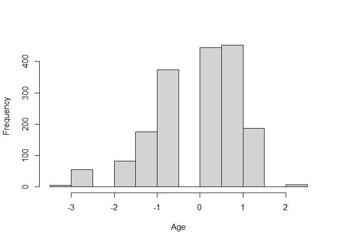<!-- -->

``` r
summary(factor(warfarin$Age))
```

    ##  -3.18068141276621  -2.51648468415008  -1.85228795553396  -1.18809122691783 -0.523894498301707  0.140302230314418  0.804498958930542   1.46869568754667   2.13289241616279 
    ##                  6                 55                 83                175                373                443                451                187                  7

We can quickly check that the values correspond to the standardized
categories 1-9.

``` r
mean(warfarin$Age)
```

    ## [1] 6.318054e-16

``` r
sd(warfarin$Age)
```

    ## [1] 1

``` r
f_age <- as.numeric(factor(warfarin$Age, ordered = TRUE, labels = 1:nlevels(factor(warfarin$Age))))
max(abs(warfarin$Age - (f_age - mean(f_age))/sd(f_age)))
```

    ## [1] 4.884981e-15

In the dataset, age was stratified into 10-year ranges (0-9, 10-19,
etc.). Since 10 levels of an ordinal factor are quite large, we will
interpret **Age** as a continuous variable.

``` r
warfarin$Enzyme <- factor(warfarin$Enzyme)
warfarin$Amiodarone <- factor(warfarin$Amiodarone)
warfarin$Gender  <- factor(warfarin$Gender )
warfarin$Black  <- factor(warfarin$Black)
warfarin$Asian <- factor(warfarin$Asian)
warfarin$VKORC1.AG <- factor(warfarin$VKORC1.AG)
warfarin$VKORC1.AA <- factor(warfarin$VKORC1.AA)
warfarin$CYP2C9.12 <- factor(warfarin$CYP2C9.12)
warfarin$CYP2C9.13 <- factor(warfarin$CYP2C9.13)
warfarin$CYP2C9.other <- factor(warfarin$CYP2C9.other)
```

``` r
datasummary_skim(warfarin[,c(-2)])
```


<table style="width:97%;">
<colgroup>
<col style="width: 5%" />
<col style="width: 10%" />
<col style="width: 7%" />
<col style="width: 3%" />
<col style="width: 3%" />
<col style="width: 3%" />
<col style="width: 4%" />
<col style="width: 3%" />
<col style="width: 54%" />
</colgroup>
  <thead>
    <tr>
      <th>Variable</th>
      <th>Unique</th>
      <th>Missing Pct.</th>
      <th>Mean / N</th>
      <th>SD / %</th>
      <th>Min</th>
      <th>Median</th>
      <th>Max</th>
      <th>Histogram</th>
    </tr>
  </thead>
  <tbody>
    <tr>
      <td><strong>A</strong></td>
      <td>275</td>
      <td>0</td>
      <td>34.3</td>
      <td>15.7</td>
      <td>7.0</td>
      <td>31.5</td>
      <td>95.0</td>
      <td></td>
    </tr>
    <tr>
      <td><strong>Weight</strong></td>
      <td>395</td>
      <td>0</td>
      <td>0.0</td>
      <td>1.0</td>
      <td>-1.9</td>
      <td>-0.1</td>
      <td>6.8</td>
      <td></td>
    </tr>
    <tr>
      <td><strong>Height</strong></td>
      <td>167</td>
      <td>0</td>
      <td>-0.0</td>
      <td>1.0</td>
      <td>-2.7</td>
      <td>-0.0</td>
      <td>3.0</td>
      <td>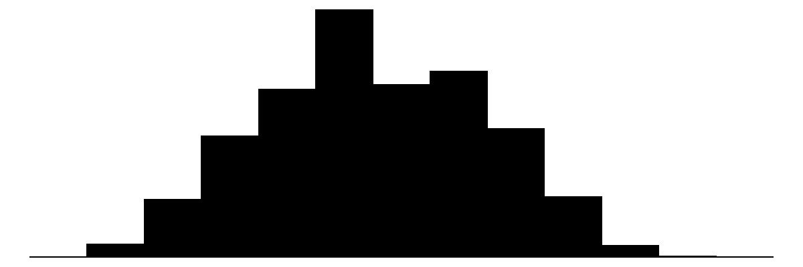</td>
    </tr>
    <tr>
      <td><strong>Age</strong></td>
      <td>9</td>
      <td>0</td>
      <td>0.0</td>
      <td>1.0</td>
      <td>-3.2</td>
      <td>0.1</td>
      <td>2.1</td>
      <td></td>
    </tr>
    </tr>
<tr>
<td></td>
<td></td>
<td></td>
<td>N</td>
<td>%</td>
<td></td>
<td></td>
<td></td>
<td></td>
<td></td>
</tr>
      <td rowspan="2"><strong>Enzyme</strong></td>
      <td>0</td>
      <td></td>
      <td>1744</td>
      <td>98.0%</td>
      <td colspan="4"></td>
    </tr>
    <tr>
      <td>1</td>
      <td></td>
      <td>36</td>
      <td>2.0%</td>
      <td colspan="4"></td>
    </tr>
    <tr>
      <td rowspan="2"><strong>Amiodarone</strong></td>
      <td>0</td>
      <td></td>
      <td>1621</td>
      <td>91.1%</td>
      <td colspan="4"></td>
    </tr>
    <tr>
      <td>1</td>
      <td></td>
      <td>159</td>
      <td>8.9%</td>
      <td colspan="4"></td>
    </tr>
    <tr>
      <td rowspan="2"><strong>Gender</strong></td>
      <td>0</td>
      <td></td>
      <td>719</td>
      <td>40.4%</td>
      <td colspan="4"></td>
    </tr>
    <tr>
      <td>1</td>
      <td></td>
      <td>1061</td>
      <td>59.6%</td>
      <td colspan="4"></td>
    </tr>
    <tr>
      <td rowspan="2"><strong>Black</strong></td>
      <td>0</td>
      <td></td>
      <td>1440</td>
      <td>80.9%</td>
      <td colspan="4"></td>
    </tr>
    <tr>
      <td>1</td>
      <td></td>
      <td>340</td>
      <td>19.1%</td>
      <td colspan="4"></td>
    </tr>
    <tr>
      <td rowspan="2"><strong>Asian</strong></td>
      <td>0</td>
      <td></td>
      <td>1388</td>
      <td>78.0%</td>
      <td colspan="4"></td>
    </tr>
    <tr>
      <td>1</td>
      <td></td>
      <td>392</td>
      <td>22.0%</td>
      <td colspan="4"></td>
    </tr>
    <tr>
      <td rowspan="2"><strong>VKORC1.AG</strong></td>
      <td>0</td>
      <td></td>
      <td>1153</td>
      <td>64.8%</td>
      <td colspan="4"></td>
    </tr>
    <tr>
      <td>1</td>
      <td></td>
      <td>627</td>
      <td>35.2%</td>
      <td colspan="4"></td>
    </tr>
    <tr>
      <td rowspan="2"><strong>VKORC1.AA</strong></td>
      <td>0</td>
      <td></td>
      <td>1296</td>
      <td>72.8%</td>
      <td colspan="4"></td>
    </tr>
    <tr>
      <td>1</td>
      <td></td>
      <td>484</td>
      <td>27.2%</td>
      <td colspan="4"></td>
    </tr>
    <tr>
      <td rowspan="2"><strong>CYP2C9.12</strong></td>
      <td>0</td>
      <td></td>
      <td>1537</td>
      <td>86.3%</td>
      <td colspan="4"></td>
    </tr>
    <tr>
      <td>1</td>
      <td></td>
      <td>243</td>
      <td>13.7%</td>
      <td colspan="4"></td>
    </tr>
    <tr>
      <td rowspan="2"><strong>CYP2C9.13</strong></td>
      <td>0</td>
      <td></td>
      <td>1623</td>
      <td>91.2%</td>
      <td colspan="4"></td>
    </tr>
    <tr>
      <td>1</td>
      <td></td>
      <td>157</td>
      <td>8.8%</td>
      <td colspan="4"></td>
    </tr>
    <tr>
      <td rowspan="2"><strong>CYP2C9.other</strong></td>
      <td>0</td>
      <td></td>
      <td>1734</td>
      <td>97.4%</td>
      <td colspan="4"></td>
    </tr>
    <tr>
      <td>1</td>
      <td></td>
      <td>46</td>
      <td>2.6%</td>
      <td colspan="4"></td>
    </tr>
  </tbody>
</table>

For continuous treatment, the covariate balance is assessed by computing
the correlation between the covariates and the treatment
(<https://ngreifer.github.io/cobalt/articles/cobalt.html>).

``` r
bal.tab(A ~ Weight + Height + Age + Enzyme + Amiodarone + Gender + Black + Asian + VKORC1.AG + VKORC1.AA + CYP2C9.12 + CYP2C9.13 + CYP2C9.other, data = warfarin)
```

    ## Balance Measures
    ##                 Type Corr.Un
    ## Weight       Contin.  0.3864
    ## Height       Contin.  0.2912
    ## Age          Contin. -0.2553
    ## Enzyme        Binary  0.0925
    ## Amiodarone    Binary -0.1346
    ## Gender        Binary  0.0868
    ## Black         Binary  0.2095
    ## Asian         Binary -0.3164
    ## VKORC1.AG     Binary -0.0565
    ## VKORC1.AA     Binary -0.4278
    ## CYP2C9.12     Binary -0.0154
    ## CYP2C9.13     Binary -0.1426
    ## CYP2C9.other  Binary -0.0870
    ## 
    ## Sample sizes
    ##     Total
    ## All  1780

Some correlations are pretty far from zero, indicating unobserved
confounding.

## Regression Adjustment

Let us start with a regression adjustment, which does not really work
when dealing with continuous treatment. The overall distribution of the
response is fairly symmetric,

``` r
hist(warfarin$INR, breaks = 25, main = '', xlab = 'INR')
```

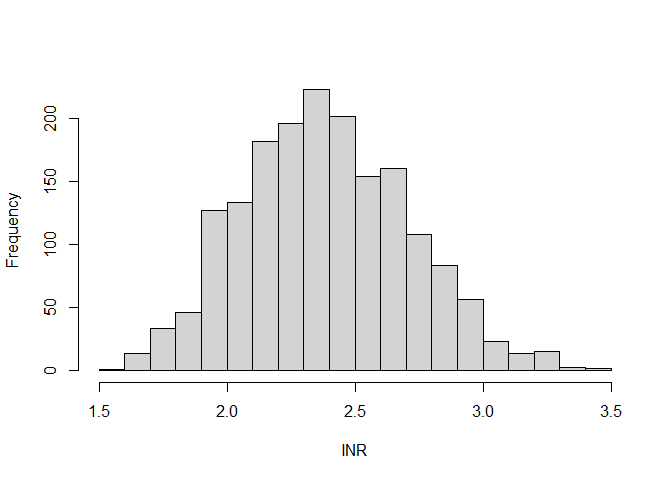<!-- -->

with no extreme values, and thus we will start with a linear regression
model.

``` r
warfarin_lm <- lm(INR~ A + Weight + Height  + Age + Enzyme + Amiodarone + Gender + Black + Asian + VKORC1.AG + VKORC1.AA + CYP2C9.12 + CYP2C9.13 + CYP2C9.other, data = warfarin)
summary(warfarin_lm)
```

    ## 
    ## Call:
    ## lm(formula = INR ~ A + Weight + Height + Age + Enzyme + Amiodarone + 
    ##     Gender + Black + Asian + VKORC1.AG + VKORC1.AA + CYP2C9.12 + 
    ##     CYP2C9.13 + CYP2C9.other, data = warfarin)
    ## 
    ## Residuals:
    ##      Min       1Q   Median       3Q      Max 
    ## -0.75293 -0.23175 -0.03888  0.19660  1.19153 
    ## 
    ## Coefficients:
    ##                 Estimate Std. Error t value Pr(>|t|)    
    ## (Intercept)    2.368e+00  3.723e-02  63.599  < 2e-16 ***
    ## A              1.901e-03  6.447e-04   2.949  0.00323 ** 
    ## Weight        -1.828e-02  9.730e-03  -1.879  0.06044 .  
    ## Height         3.441e-03  1.231e-02   0.280  0.77983    
    ## Age            4.148e-03  8.305e-03   0.499  0.61754    
    ## Enzyme1       -4.094e-02  5.268e-02  -0.777  0.43719    
    ## Amiodarone1   -4.255e-02  2.659e-02  -1.600  0.10974    
    ## Gender1        9.714e-03  2.168e-02   0.448  0.65419    
    ## Black1        -1.442e-03  2.255e-02  -0.064  0.94901    
    ## Asian1        -2.653e-01  2.831e-02  -9.374  < 2e-16 ***
    ## VKORC1.AG1     3.449e-02  1.976e-02   1.745  0.08114 .  
    ## VKORC1.AA1     5.593e-02  2.916e-02   1.918  0.05529 .  
    ## CYP2C9.121     4.009e-05  2.297e-02   0.002  0.99861    
    ## CYP2C9.131     2.744e-02  2.715e-02   1.011  0.31229    
    ## CYP2C9.other1  7.316e-02  4.794e-02   1.526  0.12717    
    ## ---
    ## Signif. codes:  0 '***' 0.001 '**' 0.01 '*' 0.05 '.' 0.1 ' ' 1
    ## 
    ## Residual standard error: 0.3106 on 1765 degrees of freedom
    ## Multiple R-squared:  0.1025, Adjusted R-squared:  0.09536 
    ## F-statistic:  14.4 on 14 and 1765 DF,  p-value: < 2.2e-16

Let’s assess the fit.

``` r
library(gratia)
appraise(warfarin_lm)
```

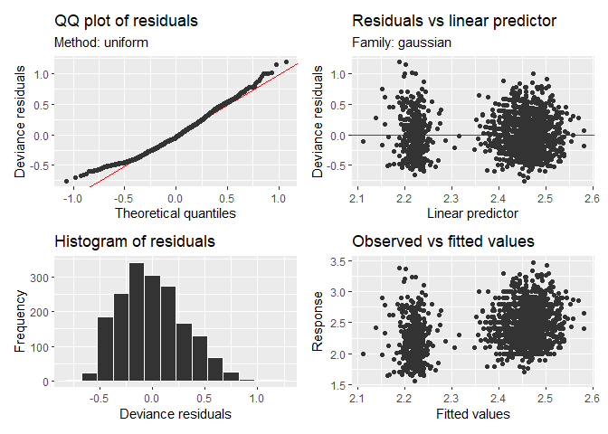<!-- -->

``` r
library(DHARMa)
simulationOutput <- simulateResiduals(fittedModel = warfarin_lm)
plot(simulationOutput)
```

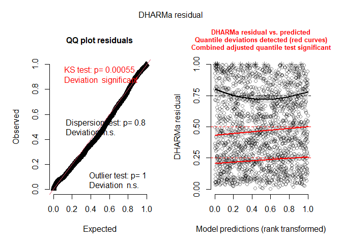<!-- -->

``` r
par(mfrow = c(1, 2))
plot(warfarin$A,residuals(warfarin_lm), xlab="A", ylab="Residuals")
plot(warfarin$Weight,residuals(warfarin_lm), xlab="Weight", ylab="Residuals")
```

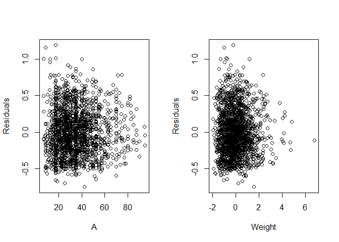<!-- -->

``` r
plot(warfarin$Height,residuals(warfarin_lm), xlab="Height", ylab="Residuals")
plot(warfarin$Age,residuals(warfarin_lm), xlab="Age", ylab="Residuals")
```

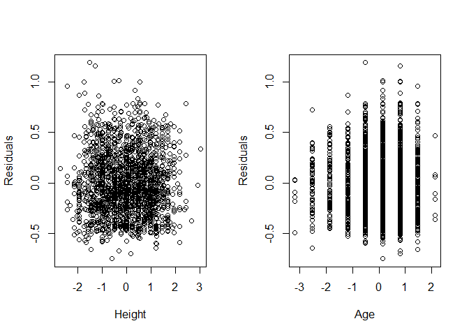<!-- -->

``` r
par(mfrow = c(1, 2))
plot(warfarin$Enzyme,residuals(warfarin_lm), xlab="Enzyme", ylab="Residuals")
plot(warfarin$Amiodarone,residuals(warfarin_lm), xlab="Amiodarone", ylab="Residuals")
```

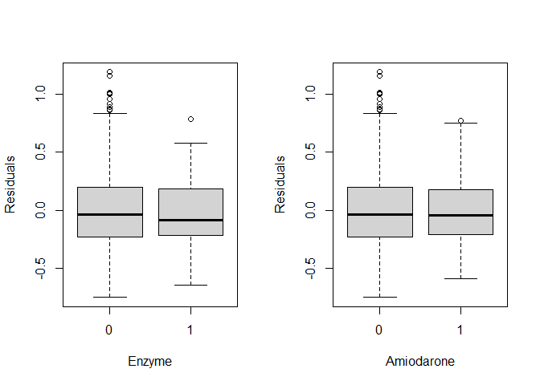<!-- -->

``` r
plot(warfarin$Gender,residuals(warfarin_lm), xlab="Gender", ylab="Residuals")
plot(warfarin$Black,residuals(warfarin_lm), xlab="Black", ylab="Residuals")
```

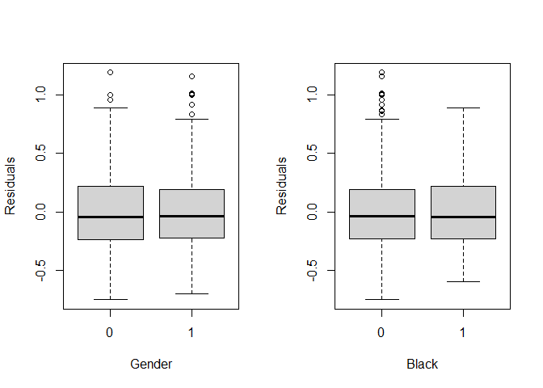<!-- -->

``` r
plot(warfarin$Asian,residuals(warfarin_lm), xlab="Asian", ylab="Residuals")
plot(warfarin$VKORC1.AG,residuals(warfarin_lm), xlab="VKORC1.AG", ylab="Residuals")
```

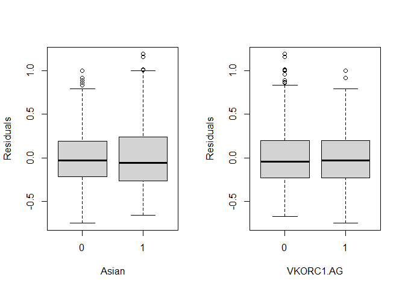<!-- -->

``` r
plot(warfarin$VKORC1.AA,residuals(warfarin_lm), xlab="VKORC1.AA", ylab="Residuals")
plot(warfarin$CYP2C9.12,residuals(warfarin_lm), xlab="CYP2C9.12", ylab="Residuals")
```

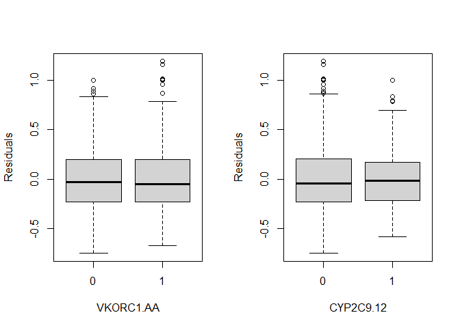<!-- -->

``` r
plot(warfarin$CYP2C9.13,residuals(warfarin_lm), xlab="CYP2C9.13", ylab="Residuals")
plot(warfarin$CYP2C9.other,residuals(warfarin_lm), xlab="CYP2C9.other", ylab="Residuals")
```

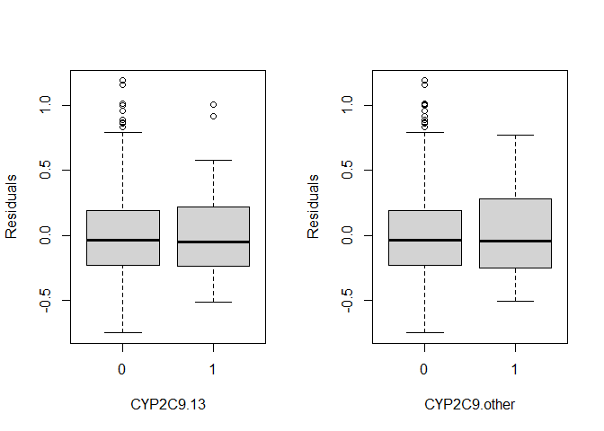<!-- -->

The fit is slightly off in the QQ plot of residuals. There is no notable
pattern in residuals vs covariates fits.

Since we are dealing with the continuous treatment, the natural question
is whether the effect is linear or non-linear. Hence, let us fit a model
with smooths.

``` r
warfarin_gam <- gam(INR ~ s(A, k = 25, bs = 'tp') + s(Weight, k = 25, bs = 'tp') + s(Height, k = 25, bs = 'tp')  + s(Age, k = 5, bs = 'tp') + Enzyme + Amiodarone + Gender + Black + Asian + VKORC1.AG + VKORC1.AA + CYP2C9.12 + CYP2C9.13 + CYP2C9.other, data = warfarin, method = 'REML')
summary(warfarin_gam)
```

    ## 
    ## Family: gaussian 
    ## Link function: identity 
    ## 
    ## Formula:
    ## INR ~ s(A, k = 25, bs = "tp") + s(Weight, k = 25, bs = "tp") + 
    ##     s(Height, k = 25, bs = "tp") + s(Age, k = 5, bs = "tp") + 
    ##     Enzyme + Amiodarone + Gender + Black + Asian + VKORC1.AG + 
    ##     VKORC1.AA + CYP2C9.12 + CYP2C9.13 + CYP2C9.other
    ## 
    ## Parametric coefficients:
    ##                 Estimate Std. Error t value Pr(>|t|)    
    ## (Intercept)    2.4330212  0.0226374 107.478   <2e-16 ***
    ## Enzyme1       -0.0404874  0.0526725  -0.769   0.4422    
    ## Amiodarone1   -0.0425962  0.0265823  -1.602   0.1092    
    ## Gender1        0.0074115  0.0217962   0.340   0.7339    
    ## Black1        -0.0011327  0.0225528  -0.050   0.9599    
    ## Asian1        -0.2596704  0.0288594  -8.998   <2e-16 ***
    ## VKORC1.AG1     0.0349578  0.0197639   1.769   0.0771 .  
    ## VKORC1.AA1     0.0561341  0.0291589   1.925   0.0544 .  
    ## CYP2C9.121     0.0006559  0.0229687   0.029   0.9772    
    ## CYP2C9.131     0.0270993  0.0271443   0.998   0.3183    
    ## CYP2C9.other1  0.0733375  0.0479398   1.530   0.1262    
    ## ---
    ## Signif. codes:  0 '***' 0.001 '**' 0.01 '*' 0.05 '.' 0.1 ' ' 1
    ## 
    ## Approximate significance of smooth terms:
    ##             edf Ref.df     F p-value   
    ## s(A)      1.001  1.003 8.718 0.00319 **
    ## s(Weight) 1.725  2.217 2.144 0.13807   
    ## s(Height) 1.000  1.000 0.050 0.82357   
    ## s(Age)    1.000  1.000 0.233 0.62957   
    ## ---
    ## Signif. codes:  0 '***' 0.001 '**' 0.01 '*' 0.05 '.' 0.1 ' ' 1
    ## 
    ## R-sq.(adj) =  0.0959   Deviance explained = 10.3%
    ## -REML = 483.55  Scale est. = 0.096412  n = 1780

We notice that the effective degrees of freedom for **A** is one, i.e.,
the trend is close to linear.

``` r
draw(warfarin_gam, residuals = TRUE)
```

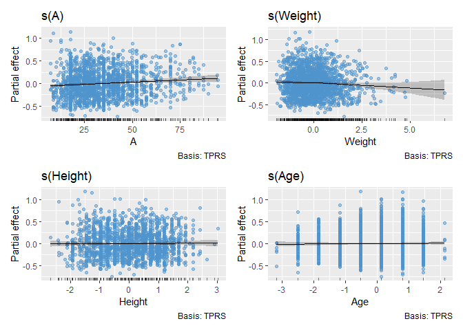<!-- -->

Overall, we found no evidence for significant nonlinearities. Let’s try
to improve the model specification by considering a gamma distribution
for the errors (the outcome is always positive) instead of a normal
distribution.

``` r
warfarin_gm <- glm(INR~ A + Weight + Height  + Age + Enzyme + Amiodarone + Gender + Black + Asian + VKORC1.AG + VKORC1.AA + CYP2C9.12 + CYP2C9.13 + CYP2C9.other, data = warfarin, family = Gamma(link = 'log'))
```

``` r
appraise(warfarin_gm)
```

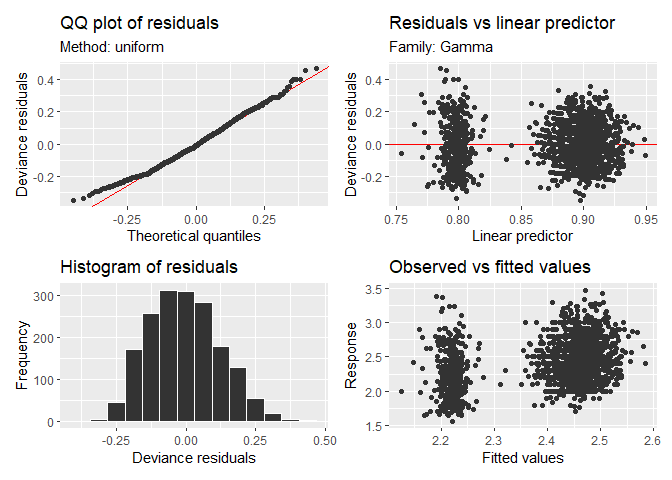<!-- -->

``` r
simulationOutput <- simulateResiduals(fittedModel = warfarin_gm)
plot(simulationOutput)
```

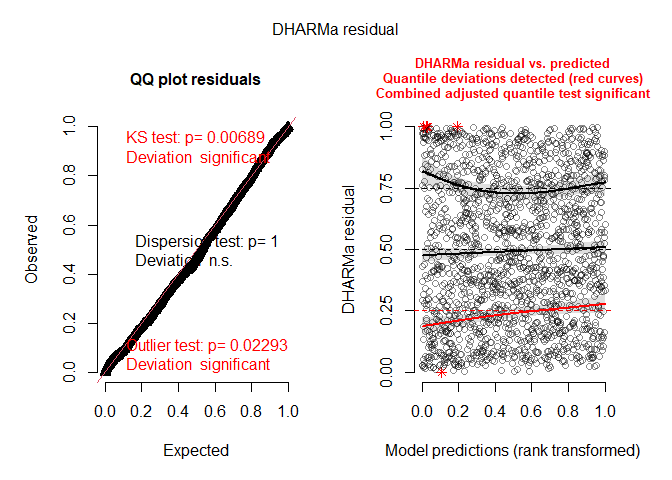<!-- -->

``` r
AIC(warfarin_lm)
```

    ## [1] 905.8294

``` r
AIC(warfarin_gm)
```

    ## [1] 881.5015

The gamma model fits the data better. Let’s estimate the average
treatment effect known for the continuous treatment as the *average
dose-response function*
``` math
\text{ADRF}(t) = \mathbb{E} Y(t)
```

We can construct it for our model using *predictions* from
*marginaleffects*.

``` r
cont_ate <- predictions(
  warfarin_gm,
  variables = list(A = seq(min(warfarin$A), max(warfarin$A), length.out = 100)),
  by = "A"
)
```

``` r
ggplot(cont_ate, aes(x = A, y = estimate)) +
  geom_line(color = "#2c3e50", linewidth = 1) +
  geom_ribbon(aes(ymin = conf.low, ymax = conf.high), fill = "#3498db", alpha = 0.3) +
  labs(
    title = "Dose-Response Function",
    subtitle = "",
    x = "Treatment (A)",
    y = "Average Predicted Outcome (INR)"
  ) +
  theme_minimal()
```

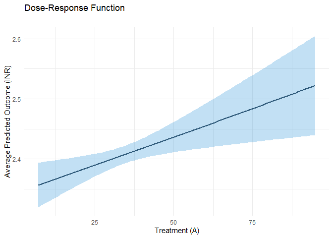<!-- -->

As expected, increasing warfarin doses increases INR.

## Generalized Propensity Scores

Since correcting observed confounding bias through regression adjustment
heavily depends on the model specification, let us turn to weighting
methods. We start with propensity scores. Estimating these becomes
trickier since the treatment is no longer binary.

So-called generalized propensity scores for continuous treatment are
defined as (Naimi et al. 2014)
``` math
e_i(X_i)  = \frac{f_{T \mid X}(t_i \mid X_i)}{f_T(t_i)},
```
where $`f_{T \mid X}(t_i \mid X_i)`$ is the probability density of the
treatment given covariates $`X_i`$, and $`f_T(t_i)`$ is a marginal
density used to stabilize the weights (*stabilization factor*).

The simplest model for generalized propensity scores is linear
regression, i.e., we assume that the treatment probability density is
normal.

``` r
lm_TX <- lm(A ~ Weight + Height  + Age + Enzyme + Amiodarone + Gender + Black + Asian + VKORC1.AG + VKORC1.AA + CYP2C9.12 + CYP2C9.13 + CYP2C9.other, data = warfarin)
lm_T <- lm(A ~ 1, data = warfarin)

f_T <- dnorm(warfarin$A, predict(lm_T),  sd(residuals(lm_T)))
f_TX <- dnorm(warfarin$A, predict(lm_TX), sd(residuals(lm_TX)))

ipw_weights <- f_T/f_TX
```

We can compute these inverse propensity score weights using the package
*ipw*.

``` r
library(ipw)
weights_continuous_ipwpoint <- ipwpoint(
    exposure = A,
    family = "gaussian",
    numerator = ~ 1,
    denominator = ~ Weight + Height  + Age + Enzyme + Amiodarone + Gender + Black + Asian + VKORC1.AG + VKORC1.AA + CYP2C9.12 + CYP2C9.13 + CYP2C9.other,
    data = warfarin
)

max(abs(weights_continuous_ipwpoint$ipw.weights - ipw_weights))
```

    ## [1] 4.547474e-13

The package *weightit* computes these weights slightly differently.

``` r
gps_weights <- weightit(A ~ Weight + Height  + Age + Enzyme + Amiodarone + Gender + Black + Asian + VKORC1.AG + VKORC1.AA + CYP2C9.12 + CYP2C9.13 + CYP2C9.other, data = warfarin, method = "glm")

quantile(abs(gps_weights$weights - f_T/f_TX),  c(0.001,0.01, 0.1, 0.9, 0.99, 0.999))
```

    ##         0.1%           1%          10%          90%          99%        99.9% 
    ## 0.0002167873 0.0003017675 0.0023833187 0.0212137480 0.1974082259 6.2365359598

But the discrepancies are small given the vast number of observations.

The crucial thing to check, especially when dealing with weights for
continuous treatment, is their size.

``` r
summary(ipw_weights)
```

    ##      Min.   1st Qu.    Median      Mean   3rd Qu.      Max. 
    ## 3.791e-02 5.494e-01 7.157e-01 1.966e+00 8.744e-01 1.402e+03

We see that weights for some observations are extremely high. These
observations will have a strong influence on the fit.

``` r
summary(gps_weights)
```

    ##                   Summary of weights
    ## 
    ## - Weight ranges:
    ## 
    ##       Min                                    Max
    ## all 0.034 |---------------------------| 1453.776
    ## 
    ## - Units with the 5 most extreme weights:
    ##                                            
    ##        1088     51     355    1201     1724
    ##  all 30.633 56.991 175.826 212.395 1453.776
    ## 
    ## - Weight statistics:
    ## 
    ##     Coef of Var   MAD Entropy # Zeros
    ## all      17.647 1.205    3.09       0
    ## 
    ## - Effective Sample Sizes:
    ## 
    ##             Total
    ## Unweighted 1780. 
    ## Weighted      5.7

The effective sample size (ESS) is only 6! We must truncate these
weights at least a bit

``` r
ipw_weights <- trim(ipw_weights, at = .99, lower = FALSE)
```

Let’s check the balance and ESS.

``` r
bal.tab(A ~ Weight + Height + Age + Enzyme + Amiodarone + Gender + Black + Asian + VKORC1.AG + VKORC1.AA + CYP2C9.12 + CYP2C9.13 + CYP2C9.other, data = warfarin, weights = ipw_weights, un = TRUE)
```

    ## Balance Measures
    ##                 Type Corr.Un Corr.Adj
    ## Weight       Contin.  0.3864   0.1531
    ## Height       Contin.  0.2912   0.1481
    ## Age          Contin. -0.2553  -0.0536
    ## Enzyme        Binary  0.0925  -0.0237
    ## Amiodarone    Binary -0.1346  -0.0473
    ## Gender        Binary  0.0868   0.0641
    ## Black         Binary  0.2095   0.0497
    ## Asian         Binary -0.3164  -0.1599
    ## VKORC1.AG     Binary -0.0565   0.0451
    ## VKORC1.AA     Binary -0.4278  -0.2283
    ## CYP2C9.12     Binary -0.0154   0.0400
    ## CYP2C9.13     Binary -0.1426  -0.0573
    ## CYP2C9.other  Binary -0.0870  -0.0589
    ## 
    ## Effective sample sizes
    ##              Total
    ## Unadjusted 1780.  
    ## Adjusted    988.89

We noticeably improved the balance, but the ESS is about half of the
original sample size. This is a fundamental trade-off in using
weighting. We improve the balance but decrease ESS, which thus worsens
the precision of the estimate. We could truncate further and improve the
ESS, but we would worsen the balance and, with it, the observed
confounding bias.

Some correlations are pretty high (say greater than 0.1). Let us check
our treatment model.

``` r
appraise(lm_TX)
```

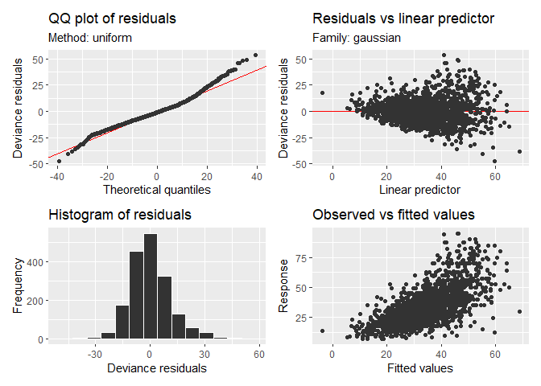<!-- -->

``` r
simulationOutput <- simulateResiduals(fittedModel = lm_TX)
plot(simulationOutput)
```

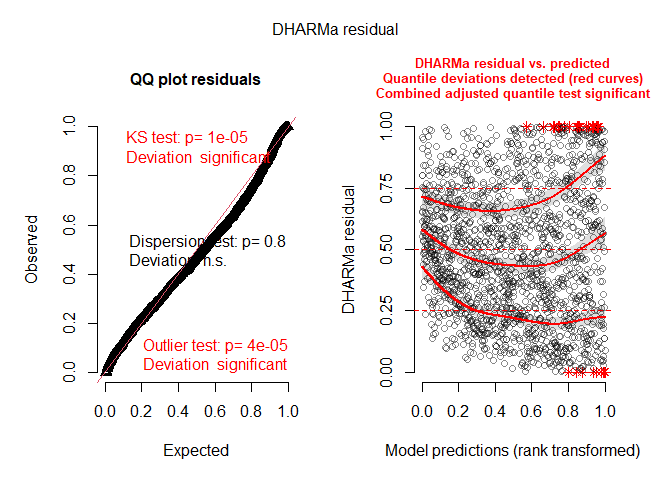<!-- -->

The treatment model is clearly heteroskedastic. Now, we do not need to
assume a normal model. Let’s try a gamma model again.

``` r
gamma_TX <- glm(A ~ Weight + Height  + Age + Enzyme + Amiodarone + Gender + Black + Asian + VKORC1.AG + VKORC1.AA + CYP2C9.12 + CYP2C9.13 + CYP2C9.other, data = warfarin, family = Gamma(link = 'log'))
```

``` r
appraise(gamma_TX)
```

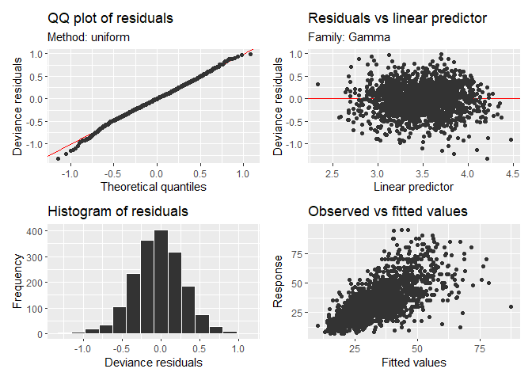<!-- -->

``` r
simulationOutput <- simulateResiduals(fittedModel = gamma_TX)
plot(simulationOutput)
```

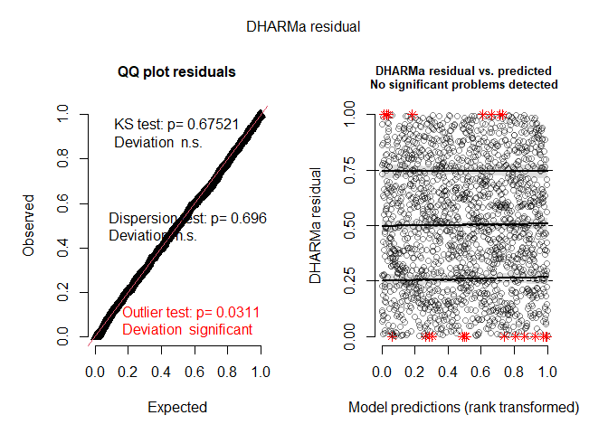<!-- -->

``` r
par(mfrow = c(1, 3))
plot(warfarin$Weight,residuals(gamma_TX), xlab="Weight", ylab="Residuals")
plot(warfarin$Height,residuals(gamma_TX), xlab="Height", ylab="Residuals")
plot(warfarin$Age,residuals(gamma_TX), xlab="Age", ylab="Residuals")
```

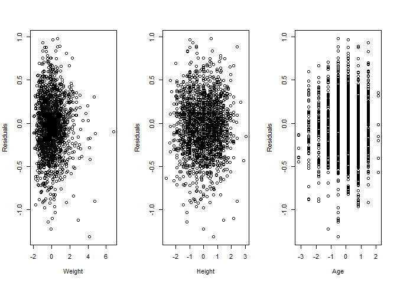<!-- -->

``` r
par(mfrow = c(1, 2))
plot(warfarin$Enzyme,residuals(gamma_TX), xlab="Enzyme", ylab="Residuals")
plot(warfarin$Amiodarone,residuals(gamma_TX), xlab="Amiodarone", ylab="Residuals")
```

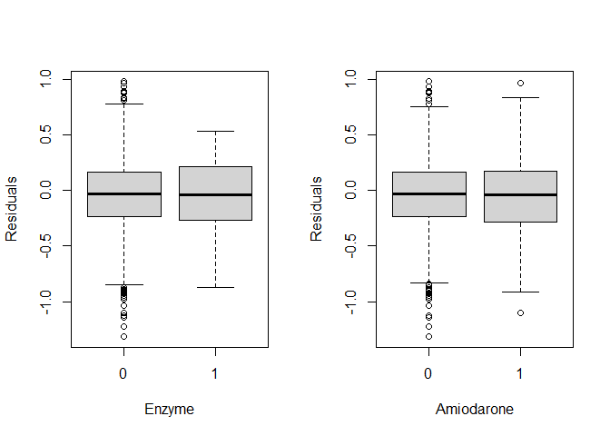<!-- -->

``` r
plot(warfarin$Gender,residuals(gamma_TX), xlab="Gender", ylab="Residuals")
plot(warfarin$Black,residuals(gamma_TX), xlab="Black", ylab="Residuals")
```

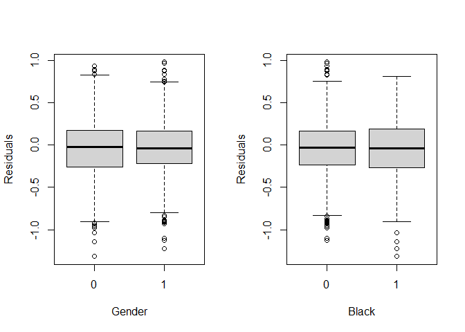<!-- -->

``` r
plot(warfarin$Asian,residuals(gamma_TX), xlab="Asian", ylab="Residuals")
plot(warfarin$VKORC1.AG,residuals(gamma_TX), xlab="VKORC1.AG", ylab="Residuals")
```

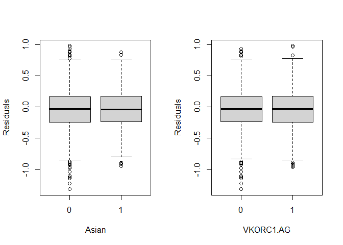<!-- -->

``` r
plot(warfarin$VKORC1.AA,residuals(warfarin_lm), xlab="VKORC1.AA", ylab="Residuals")
plot(warfarin$CYP2C9.12,residuals(gamma_TX), xlab="CYP2C9.12", ylab="Residuals")
```

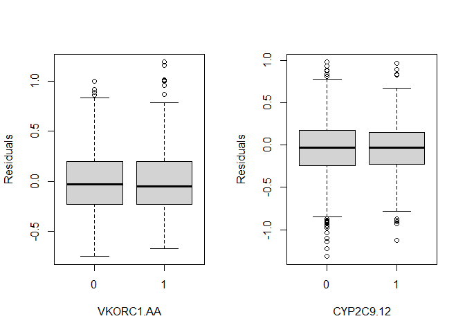<!-- -->

``` r
plot(warfarin$CYP2C9.13,residuals(gamma_TX), xlab="CYP2C9.13", ylab="Residuals")
plot(warfarin$CYP2C9.other,residuals(gamma_TX), xlab="CYP2C9.other", ylab="Residuals")
```

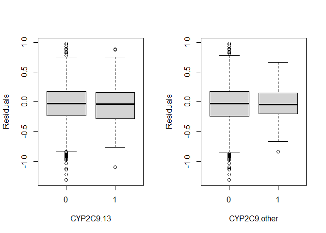<!-- -->

The gamma model is much better specified. Let’s compute the new weights.

``` r
gamma_T <- glm(A ~ 1, data = warfarin, family = Gamma(link = 'log'))

mu_gamma_T   <- predict(gamma_T, type = "response")
mu_gamma_TX  <- predict(gamma_TX, type = "response")

shape_gamma_T <- 1/summary(gamma_T)$dispersion
shape_gamma_TX <- 1/summary(gamma_TX)$dispersion
rate_gamma_T <- shape_gamma_T/mu_gamma_T
rate_gamma_TX   <- shape_gamma_TX/mu_gamma_TX


f_gT <-  dgamma(warfarin$A, shape = shape_gamma_T, rate = rate_gamma_T)
f_gTX <- dgamma(warfarin$A, shape = shape_gamma_TX, rate = rate_gamma_TX)

ipw_g_weights <- f_gT/f_gTX
```

``` r
ipw_g_weights <- trim(ipw_g_weights, at = .99, lower = FALSE)
bal.tab(A ~ Weight + Height + Age + Enzyme + Amiodarone + Gender + Black + Asian + VKORC1.AG + VKORC1.AA + CYP2C9.12 + CYP2C9.13 + CYP2C9.other, data = warfarin, weights = ipw_g_weights, un = TRUE, int = TRUE)
```

    ## Balance Measures
    ##                                  Type Corr.Un Corr.Adj
    ## Weight                        Contin.  0.3864   0.0797
    ## Height                        Contin.  0.2912   0.0901
    ## Age                           Contin. -0.2553  -0.0124
    ## Enzyme                         Binary  0.0925  -0.0312
    ## Amiodarone                     Binary -0.1346  -0.0117
    ## Gender                         Binary  0.0868   0.0791
    ## Black                          Binary  0.2095   0.0094
    ## Asian                          Binary -0.3164  -0.0896
    ## VKORC1.AG                      Binary -0.0565   0.0344
    ## VKORC1.AA                      Binary -0.4278  -0.1293
    ## CYP2C9.12                      Binary -0.0154   0.0175
    ## CYP2C9.13                      Binary -0.1426  -0.0403
    ## CYP2C9.other                   Binary -0.0870  -0.0422
    ## Weight * Height               Contin.  0.0238  -0.0285
    ## Weight * Age                  Contin. -0.0589  -0.0057
    ## Weight * Enzyme_0             Contin.  0.3832   0.0806
    ## Weight * Enzyme_1             Contin.  0.0512   0.0016
    ## Weight * Amiodarone_0         Contin.  0.3758   0.0706
    ## Weight * Amiodarone_1         Contin.  0.0912   0.0436
    ## Weight * Gender_0             Contin.  0.2378   0.0126
    ## Weight * Gender_1             Contin.  0.3180   0.0985
    ## Weight * Black_0              Contin.  0.3153   0.0772
    ## Weight * Black_1              Contin.  0.2294   0.0286
    ## Weight * Asian_0              Contin.  0.3010   0.0450
    ## Weight * Asian_1              Contin.  0.2953   0.0938
    ## Weight * VKORC1.AG_0          Contin.  0.3626   0.0457
    ## Weight * VKORC1.AG_1          Contin.  0.1591   0.0733
    ## Weight * VKORC1.AA_0          Contin.  0.3089   0.0509
    ## Weight * VKORC1.AA_1          Contin.  0.2560   0.0745
    ## Weight * CYP2C9.12_0          Contin.  0.3867   0.0865
    ## Weight * CYP2C9.12_1          Contin.  0.0740  -0.0017
    ## Weight * CYP2C9.13_0          Contin.  0.3725   0.0776
    ## Weight * CYP2C9.13_1          Contin.  0.1034   0.0185
    ## Weight * CYP2C9.other_0       Contin.  0.3945   0.0871
    ## Weight * CYP2C9.other_1       Contin. -0.0148  -0.0369
    ## Height * Age                  Contin. -0.0170  -0.0202
    ## Height * Enzyme_0             Contin.  0.2839   0.0925
    ## Height * Enzyme_1             Contin.  0.0733  -0.0115
    ## Height * Amiodarone_0         Contin.  0.2923   0.1077
    ## Height * Amiodarone_1         Contin.  0.0412  -0.0421
    ## Height * Gender_0             Contin.  0.1970   0.0705
    ## Height * Gender_1             Contin.  0.2673   0.0740
    ## Height * Black_0              Contin.  0.2768   0.0589
    ## Height * Black_1              Contin.  0.0962   0.0858
    ## Height * Asian_0              Contin.  0.2037   0.0649
    ## Height * Asian_1              Contin.  0.2466   0.0732
    ## Height * VKORC1.AG_0          Contin.  0.2869   0.0626
    ## Height * VKORC1.AG_1          Contin.  0.0985   0.0685
    ## Height * VKORC1.AA_0          Contin.  0.2215   0.0743
    ## Height * VKORC1.AA_1          Contin.  0.2028   0.0542
    ## Height * CYP2C9.12_0          Contin.  0.2852   0.1005
    ## Height * CYP2C9.12_1          Contin.  0.0705  -0.0104
    ## Height * CYP2C9.13_0          Contin.  0.2814   0.1075
    ## Height * CYP2C9.13_1          Contin.  0.0751  -0.0453
    ## Height * CYP2C9.other_0       Contin.  0.2957   0.0922
    ## Height * CYP2C9.other_1       Contin. -0.0066  -0.0063
    ## Age * Enzyme_0                Contin. -0.2531  -0.0194
    ## Age * Enzyme_1                Contin. -0.0341   0.0467
    ## Age * Amiodarone_0            Contin. -0.2359  -0.0027
    ## Age * Amiodarone_1            Contin. -0.1080  -0.0391
    ## Age * Gender_0                Contin. -0.1661   0.0148
    ## Age * Gender_1                Contin. -0.1959  -0.0315
    ## Age * Black_0                 Contin. -0.1933  -0.0270
    ## Age * Black_1                 Contin. -0.1846   0.0258
    ## Age * Asian_0                 Contin. -0.2746   0.0033
    ## Age * Asian_1                 Contin. -0.0199  -0.0359
    ## Age * VKORC1.AG_0             Contin. -0.1758   0.0188
    ## Age * VKORC1.AG_1             Contin. -0.1905  -0.0445
    ## Age * VKORC1.AA_0             Contin. -0.2670  -0.0060
    ## Age * VKORC1.AA_1             Contin. -0.0493  -0.0145
    ## Age * CYP2C9.12_0             Contin. -0.2433  -0.0359
    ## Age * CYP2C9.12_1             Contin. -0.0797   0.0545
    ## Age * CYP2C9.13_0             Contin. -0.2345  -0.0027
    ## Age * CYP2C9.13_1             Contin. -0.1046  -0.0320
    ## Age * CYP2C9.other_0          Contin. -0.2572  -0.0143
    ## Age * CYP2C9.other_1          Contin. -0.0143   0.0091
    ## Enzyme_0 * Amiodarone_0        Binary  0.0845   0.0252
    ## Enzyme_0 * Amiodarone_1        Binary -0.1390  -0.0121
    ## Enzyme_0 * Gender_0            Binary -0.0915  -0.0712
    ## Enzyme_0 * Gender_1            Binary  0.0643   0.0796
    ## Enzyme_0 * Black_0             Binary -0.2316  -0.0096
    ## Enzyme_0 * Black_1             Binary  0.2074   0.0213
    ## Enzyme_0 * Asian_0             Binary  0.2744   0.0961
    ## Enzyme_0 * Asian_1             Binary -0.3145  -0.0885
    ## Enzyme_0 * VKORC1.AG_0         Binary  0.0436  -0.0244
    ## Enzyme_0 * VKORC1.AG_1         Binary -0.0716   0.0340
    ## Enzyme_0 * VKORC1.AA_0         Binary  0.3883   0.1367
    ## Enzyme_0 * VKORC1.AA_1         Binary -0.4265  -0.1298
    ## Enzyme_0 * CYP2C9.12_0         Binary -0.0177  -0.0094
    ## Enzyme_0 * CYP2C9.12_1         Binary -0.0196   0.0229
    ## Enzyme_0 * CYP2C9.13_0         Binary  0.0907   0.0527
    ## Enzyme_0 * CYP2C9.13_1         Binary -0.1457  -0.0423
    ## Enzyme_0 * CYP2C9.other_0      Binary  0.0037   0.0529
    ## Enzyme_0 * CYP2C9.other_1      Binary -0.0870  -0.0422
    ## Enzyme_1 * Amiodarone_0        Binary  0.0919  -0.0337
    ## Enzyme_1 * Amiodarone_1        Binary  0.0171   0.0017
    ## Enzyme_1 * Gender_0            Binary  0.0242  -0.0449
    ## Enzyme_1 * Gender_1            Binary  0.0985  -0.0039
    ## Enzyme_1 * Black_0             Binary  0.0911   0.0015
    ## Enzyme_1 * Black_1             Binary  0.0238  -0.0734
    ## Enzyme_1 * Asian_0             Binary  0.1048  -0.0287
    ## Enzyme_1 * Asian_1             Binary -0.0271  -0.0129
    ## Enzyme_1 * VKORC1.AG_0         Binary  0.0556  -0.0433
    ## Enzyme_1 * VKORC1.AG_1         Binary  0.0768   0.0030
    ## Enzyme_1 * VKORC1.AA_0         Binary  0.1144  -0.0344
    ## Enzyme_1 * VKORC1.AA_1         Binary -0.0233  -0.0006
    ## Enzyme_1 * CYP2C9.12_0         Binary  0.0906  -0.0204
    ## Enzyme_1 * CYP2C9.12_1         Binary  0.0235  -0.0305
    ## Enzyme_1 * CYP2C9.13_0         Binary  0.0904  -0.0357
    ## Enzyme_1 * CYP2C9.13_1         Binary  0.0192   0.0147
    ## Enzyme_1 * CYP2C9.other_0      Binary  0.0925  -0.0312
    ## Amiodarone_0 * Gender_0        Binary -0.0499  -0.0677
    ## Amiodarone_0 * Gender_1        Binary  0.1254   0.0724
    ## Amiodarone_0 * Black_0         Binary -0.1001   0.0105
    ## Amiodarone_0 * Black_1         Binary  0.2152  -0.0034
    ## Amiodarone_0 * Asian_0         Binary  0.3530   0.0874
    ## Amiodarone_0 * Asian_1         Binary -0.3022  -0.0899
    ## Amiodarone_0 * VKORC1.AG_0     Binary  0.0905  -0.0225
    ## Amiodarone_0 * VKORC1.AG_1     Binary -0.0129   0.0310
    ## Amiodarone_0 * VKORC1.AA_0     Binary  0.4457   0.1277
    ## Amiodarone_0 * VKORC1.AA_1     Binary -0.3979  -0.1316
    ## Amiodarone_0 * CYP2C9.12_0     Binary  0.0877   0.0102
    ## Amiodarone_0 * CYP2C9.12_1     Binary  0.0080  -0.0025
    ## Amiodarone_0 * CYP2C9.13_0     Binary  0.1946   0.0110
    ## Amiodarone_0 * CYP2C9.13_1     Binary -0.1274  -0.0030
    ## Amiodarone_0 * CYP2C9.other_0  Binary  0.1568   0.0272
    ## Amiodarone_0 * CYP2C9.other_1  Binary -0.0744  -0.0354
    ## Amiodarone_1 * Gender_0        Binary -0.1150  -0.0374
    ## Amiodarone_1 * Gender_1        Binary -0.0821   0.0110
    ## Amiodarone_1 * Black_0         Binary -0.1403  -0.0309
    ## Amiodarone_1 * Black_1         Binary -0.0048   0.0501
    ## Amiodarone_1 * Asian_0         Binary -0.1130  -0.0110
    ## Amiodarone_1 * Asian_1         Binary -0.0867  -0.0037
    ## Amiodarone_1 * VKORC1.AG_0     Binary -0.0810  -0.0253
    ## Amiodarone_1 * VKORC1.AG_1     Binary -0.1059   0.0105
    ## Amiodarone_1 * VKORC1.AA_0     Binary -0.0826  -0.0120
    ## Amiodarone_1 * VKORC1.AA_1     Binary -0.1302  -0.0019
    ## Amiodarone_1 * CYP2C9.12_0     Binary -0.1164  -0.0387
    ## Amiodarone_1 * CYP2C9.12_1     Binary -0.0645   0.0558
    ## Amiodarone_1 * CYP2C9.13_0     Binary -0.1191   0.0264
    ## Amiodarone_1 * CYP2C9.13_1     Binary -0.0683  -0.1296
    ## Amiodarone_1 * CYP2C9.other_0  Binary -0.1270  -0.0067
    ## Amiodarone_1 * CYP2C9.other_1  Binary -0.0478  -0.0249
    ## Gender_0 * Black_0             Binary -0.1705  -0.0621
    ## Gender_0 * Black_1             Binary  0.1199  -0.0342
    ## Gender_0 * Asian_0             Binary  0.0636  -0.0422
    ## Gender_0 * Asian_1             Binary -0.2162  -0.0603
    ## Gender_0 * VKORC1.AG_0         Binary -0.0486  -0.0538
    ## Gender_0 * VKORC1.AG_1         Binary -0.0640  -0.0449
    ## Gender_0 * VKORC1.AA_0         Binary  0.1155  -0.0299
    ## Gender_0 * VKORC1.AA_1         Binary -0.2724  -0.0744
    ## Gender_0 * CYP2C9.12_0         Binary -0.0677  -0.0682
    ## Gender_0 * CYP2C9.12_1         Binary -0.0474  -0.0287
    ## Gender_0 * CYP2C9.13_0         Binary -0.0531  -0.0778
    ## Gender_0 * CYP2C9.13_1         Binary -0.0969  -0.0068
    ## Gender_0 * CYP2C9.other_0      Binary -0.0757  -0.0734
    ## Gender_0 * CYP2C9.other_1      Binary -0.0535  -0.0281
    ## Gender_1 * Black_0             Binary -0.0078   0.0498
    ## Gender_1 * Black_1             Binary  0.1612   0.0483
    ## Gender_1 * Asian_0             Binary  0.2051   0.1122
    ## Gender_1 * Asian_1             Binary -0.2029  -0.0584
    ## Gender_1 * VKORC1.AG_0         Binary  0.1018   0.0164
    ## Gender_1 * VKORC1.AG_1         Binary -0.0150   0.0730
    ## Gender_1 * VKORC1.AA_0         Binary  0.2794   0.1420
    ## Gender_1 * VKORC1.AA_1         Binary -0.2831  -0.0936
    ## Gender_1 * CYP2C9.12_0         Binary  0.0754   0.0533
    ## Gender_1 * CYP2C9.12_1         Binary  0.0173   0.0429
    ## Gender_1 * CYP2C9.13_0         Binary  0.1327   0.0984
    ## Gender_1 * CYP2C9.13_1         Binary -0.1017  -0.0442
    ## Gender_1 * CYP2C9.other_0      Binary  0.1029   0.0862
    ## Gender_1 * CYP2C9.other_1      Binary -0.0681  -0.0310
    ## Black_0 * Asian_0              Binary  0.0990   0.0679
    ## Black_0 * Asian_1              Binary -0.3164  -0.0896
    ## Black_0 * VKORC1.AG_0          Binary -0.1080  -0.0176
    ## Black_0 * VKORC1.AG_1          Binary -0.0610   0.0109
    ## Black_0 * VKORC1.AA_0          Binary  0.2139   0.1073
    ## Black_0 * VKORC1.AA_1          Binary -0.4256  -0.1287
    ## Black_0 * CYP2C9.12_0          Binary -0.1583  -0.0093
    ## Black_0 * CYP2C9.12_1          Binary -0.0262   0.0018
    ## Black_0 * CYP2C9.13_0          Binary -0.0935   0.0238
    ## Black_0 * CYP2C9.13_1          Binary -0.1462  -0.0516
    ## Black_0 * CYP2C9.other_0       Binary -0.1682   0.0101
    ## Black_0 * CYP2C9.other_1       Binary -0.0957  -0.0549
    ## Black_1 * Asian_0              Binary  0.2095   0.0094
    ## Black_1 * VKORC1.AG_0          Binary  0.2227  -0.0210
    ## Black_1 * VKORC1.AG_1          Binary  0.0077   0.0624
    ## Black_1 * VKORC1.AA_0          Binary  0.2137   0.0104
    ## Black_1 * VKORC1.AA_1          Binary -0.0334  -0.0093
    ## Black_1 * CYP2C9.12_0          Binary  0.2053  -0.0044
    ## Black_1 * CYP2C9.12_1          Binary  0.0332   0.0525
    ## Black_1 * CYP2C9.13_0          Binary  0.2108   0.0020
    ## Black_1 * CYP2C9.13_1          Binary  0.0027   0.0465
    ## Black_1 * CYP2C9.other_0       Binary  0.2121   0.0066
    ## Black_1 * CYP2C9.other_1       Binary -0.0022   0.0161
    ## Asian_0 * VKORC1.AG_0          Binary  0.3090   0.0394
    ## Asian_0 * VKORC1.AG_1          Binary -0.0489   0.0374
    ## Asian_0 * VKORC1.AA_0          Binary  0.4156   0.1251
    ## Asian_0 * VKORC1.AA_1          Binary -0.2156  -0.0733
    ## Asian_0 * CYP2C9.12_0          Binary  0.2847   0.0650
    ## Asian_0 * CYP2C9.12_1          Binary -0.0154   0.0175
    ## Asian_0 * CYP2C9.13_0          Binary  0.3370   0.0994
    ## Asian_0 * CYP2C9.13_1          Binary -0.0857  -0.0314
    ## Asian_0 * CYP2C9.other_0       Binary  0.3337   0.1012
    ## Asian_0 * CYP2C9.other_1       Binary -0.0800  -0.0413
    ## Asian_1 * VKORC1.AG_0          Binary -0.3233  -0.0918
    ## Asian_1 * VKORC1.AG_1          Binary -0.0243  -0.0062
    ## Asian_1 * VKORC1.AA_0          Binary -0.0065  -0.0006
    ## Asian_1 * VKORC1.AA_1          Binary -0.3339  -0.0951
    ## Asian_1 * CYP2C9.12_0          Binary -0.3164  -0.0896
    ## Asian_1 * CYP2C9.13_0          Binary -0.2804  -0.0840
    ## Asian_1 * CYP2C9.13_1          Binary -0.1354  -0.0251
    ## Asian_1 * CYP2C9.other_0       Binary -0.3136  -0.0891
    ## Asian_1 * CYP2C9.other_1       Binary -0.0414  -0.0084
    ## VKORC1.AG_0 * VKORC1.AA_0      Binary  0.4488   0.0849
    ## VKORC1.AG_0 * VKORC1.AA_1      Binary -0.4278  -0.1293
    ## VKORC1.AG_0 * CYP2C9.12_0      Binary  0.0369  -0.0413
    ## VKORC1.AG_0 * CYP2C9.12_1      Binary  0.0333   0.0152
    ## VKORC1.AG_0 * CYP2C9.13_0      Binary  0.1020  -0.0128
    ## VKORC1.AG_0 * CYP2C9.13_1      Binary -0.1027  -0.0452
    ## VKORC1.AG_0 * CYP2C9.other_0   Binary  0.0669  -0.0360
    ## VKORC1.AG_0 * CYP2C9.other_1   Binary -0.0425   0.0076
    ## VKORC1.AG_1 * VKORC1.AA_0      Binary -0.0565   0.0344
    ## VKORC1.AG_1 * CYP2C9.12_0      Binary -0.0286   0.0318
    ## VKORC1.AG_1 * CYP2C9.12_1      Binary -0.0579   0.0083
    ## VKORC1.AG_1 * CYP2C9.13_0      Binary -0.0206   0.0380
    ## VKORC1.AG_1 * CYP2C9.13_1      Binary -0.0948  -0.0069
    ## VKORC1.AG_1 * CYP2C9.other_0   Binary -0.0389   0.0507
    ## VKORC1.AG_1 * CYP2C9.other_1   Binary -0.0851  -0.0763
    ## VKORC1.AA_0 * CYP2C9.12_0      Binary  0.3757   0.0956
    ## VKORC1.AA_0 * CYP2C9.12_1      Binary  0.0219   0.0338
    ## VKORC1.AA_0 * CYP2C9.13_0      Binary  0.4341   0.1322
    ## VKORC1.AA_0 * CYP2C9.13_1      Binary -0.0601  -0.0200
    ## VKORC1.AA_0 * CYP2C9.other_0   Binary  0.4382   0.1393
    ## VKORC1.AA_0 * CYP2C9.other_1   Binary -0.0630  -0.0400
    ## VKORC1.AA_1 * CYP2C9.12_0      Binary -0.4089  -0.1209
    ## VKORC1.AA_1 * CYP2C9.12_1      Binary -0.0931  -0.0370
    ## VKORC1.AA_1 * CYP2C9.13_0      Binary -0.3812  -0.1181
    ## VKORC1.AA_1 * CYP2C9.13_1      Binary -0.1692  -0.0429
    ## VKORC1.AA_1 * CYP2C9.other_0   Binary -0.4195  -0.1281
    ## VKORC1.AA_1 * CYP2C9.other_1   Binary -0.0770  -0.0132
    ## CYP2C9.12_0 * CYP2C9.13_0      Binary  0.1096   0.0130
    ## CYP2C9.12_0 * CYP2C9.13_1      Binary -0.1426  -0.0403
    ## CYP2C9.12_0 * CYP2C9.other_0   Binary  0.0518   0.0018
    ## CYP2C9.12_0 * CYP2C9.other_1   Binary -0.0870  -0.0422
    ## CYP2C9.12_1 * CYP2C9.13_0      Binary -0.0154   0.0175
    ## CYP2C9.12_1 * CYP2C9.other_0   Binary -0.0154   0.0175
    ## CYP2C9.13_0 * CYP2C9.other_0   Binary  0.1707   0.0570
    ## CYP2C9.13_0 * CYP2C9.other_1   Binary -0.0870  -0.0422
    ## CYP2C9.13_1 * CYP2C9.other_0   Binary -0.1426  -0.0403
    ## 
    ## Effective sample sizes
    ##              Total
    ## Unadjusted 1780.  
    ## Adjusted    669.26

The balance is much better; all correlations with main effects, except
one, are below 0.1, and even correlations with covariate interactions
are decent. The ESS is still sufficient for estimating the main effect
of treatment.

We can assess the balance visually using *cobalt*. For continuous
covariates, *cobalt* uses scatter plots with red lines (linear
regression) and blue lines (smooth). For categorical covariates, it
compares the distribution of treatments.

``` r
bal.plot(A ~ Weight + Height + Age + Enzyme + Amiodarone + Gender + Black + Asian + VKORC1.AG + VKORC1.AA + CYP2C9.12 + CYP2C9.13 + CYP2C9.other, data = warfarin, weights = ipw_g_weights, "Weight", which = "both")
```

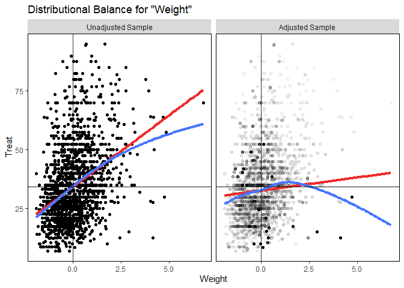<!-- -->

``` r
bal.plot(A ~ Weight + Height + Age + Enzyme + Amiodarone + Gender + Black + Asian + VKORC1.AG + VKORC1.AA + CYP2C9.12 + CYP2C9.13 + CYP2C9.other, data = warfarin, weights = ipw_g_weights, "Height", which = "both")
```

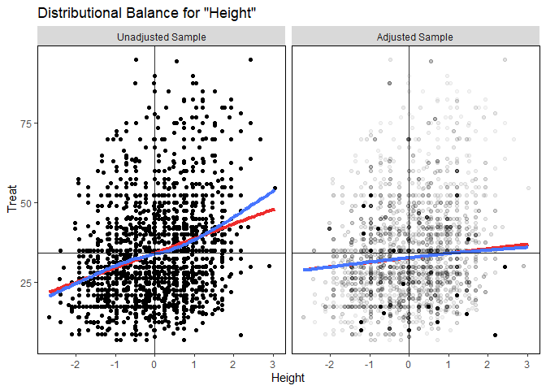<!-- -->

``` r
bal.plot(A ~ Weight + Height + Age + Enzyme + Amiodarone + Gender + Black + Asian + VKORC1.AG + VKORC1.AA + CYP2C9.12 + CYP2C9.13 + CYP2C9.other, data = warfarin, weights = ipw_g_weights, "Age", which = "both")
```

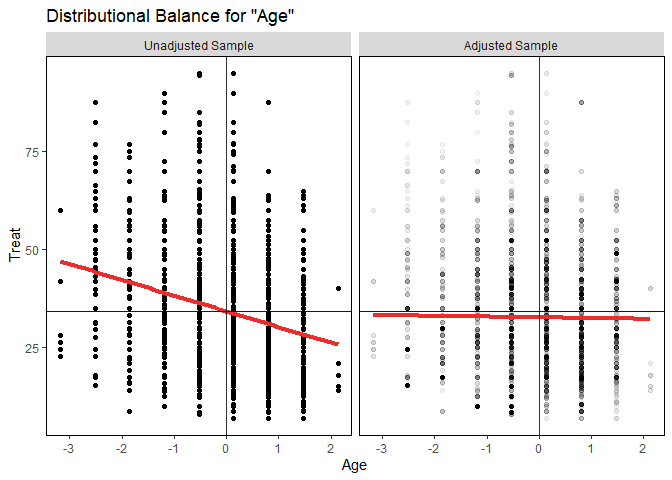<!-- -->

``` r
p1 <- bal.plot(A ~ Weight + Height + Age + Enzyme + Amiodarone + Gender + Black + Asian + VKORC1.AG + VKORC1.AA + CYP2C9.12 + CYP2C9.13 + CYP2C9.other, data = warfarin, weights = ipw_g_weights, "Enzyme", which = "both")
p2 <- bal.plot(A ~ Weight + Height + Age + Enzyme + Amiodarone + Gender + Black + Asian + VKORC1.AG + VKORC1.AA + CYP2C9.12 + CYP2C9.13 + CYP2C9.other, data = warfarin, weights = ipw_g_weights, "Amiodarone", which = "both")

(p1 + p2 ) + plot_layout(ncol = 1)
```

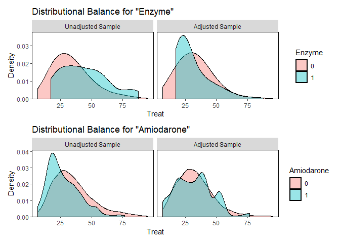<!-- -->

``` r
p1 <- bal.plot(A ~ Weight + Height + Age + Enzyme + Amiodarone + Gender + Black + Asian + VKORC1.AG + VKORC1.AA + CYP2C9.12 + CYP2C9.13 + CYP2C9.other, data = warfarin, weights = ipw_g_weights, "Gender", which = "both")
p2 <- bal.plot(A ~ Weight + Height + Age + Enzyme + Amiodarone + Gender + Black + Asian + VKORC1.AG + VKORC1.AA + CYP2C9.12 + CYP2C9.13 + CYP2C9.other, data = warfarin, weights = ipw_g_weights, "Black", which = "both")

(p1 + p2 ) + plot_layout(ncol = 1)
```

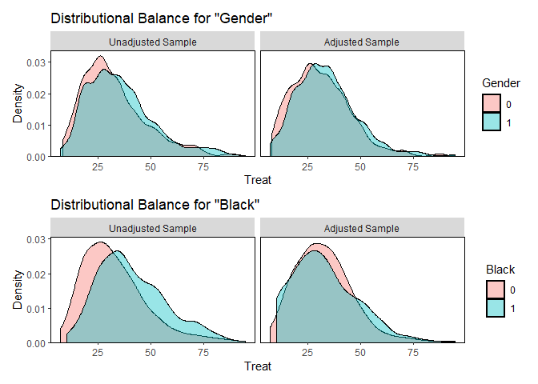<!-- -->

``` r
p1 <- bal.plot(A ~ Weight + Height + Age + Enzyme + Amiodarone + Gender + Black + Asian + VKORC1.AG + VKORC1.AA + CYP2C9.12 + CYP2C9.13 + CYP2C9.other, data = warfarin, weights = ipw_g_weights, "Asian", which = "both")
p2 <- bal.plot(A ~ Weight + Height + Age + Enzyme + Amiodarone + Gender + Black + Asian + VKORC1.AG + VKORC1.AA + CYP2C9.12 + CYP2C9.13 + CYP2C9.other, data = warfarin, weights = ipw_g_weights, "VKORC1.AG", which = "both")

(p1 + p2 ) + plot_layout(ncol = 1)
```

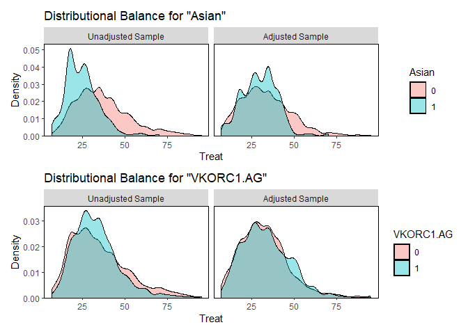<!-- -->

``` r
p1 <- bal.plot(A ~ Weight + Height + Age + Enzyme + Amiodarone + Gender + Black + Asian + VKORC1.AG + VKORC1.AA + CYP2C9.12 + CYP2C9.13 + CYP2C9.other, data = warfarin, weights = ipw_g_weights, "VKORC1.AA", which = "both")
p2 <- bal.plot(A ~ Weight + Height + Age + Enzyme + Amiodarone + Gender + Black + Asian + VKORC1.AG + VKORC1.AA + CYP2C9.12 + CYP2C9.13 + CYP2C9.other, data = warfarin, weights = ipw_g_weights, "CYP2C9.12", which = "both")

(p1 + p2 ) + plot_layout(ncol = 1)
```

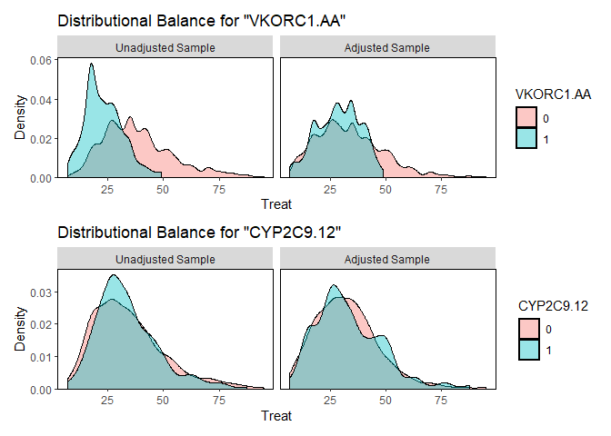<!-- -->

``` r
p1 <- bal.plot(A ~ Weight + Height + Age + Enzyme + Amiodarone + Gender + Black + Asian + VKORC1.AG + VKORC1.AA + CYP2C9.12 + CYP2C9.13 + CYP2C9.other, data = warfarin, weights = ipw_g_weights, "CYP2C9.13", which = "both")
p2 <- bal.plot(A ~ Weight + Height + Age + Enzyme + Amiodarone + Gender + Black + Asian + VKORC1.AG + VKORC1.AA + CYP2C9.12 + CYP2C9.13 + CYP2C9.other, data = warfarin, weights = ipw_g_weights, "CYP2C9.other", which = "both")

(p1 + p2 ) + plot_layout(ncol = 1)
```

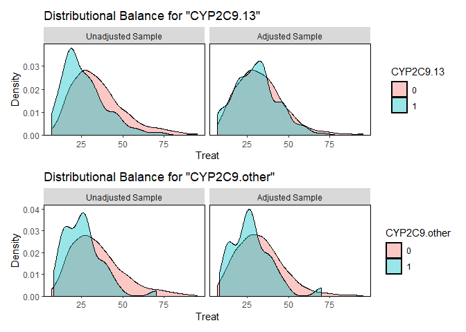<!-- -->

Let’s estimate the treatment effect. The unadjusted estimate is as
follows.

``` r
warfarin_ipw_unadj <- gam(INR~ s(A, k = 25, bs = 'tp'), data = warfarin, weights = ipw_weights)
summary(warfarin_ipw_unadj)
```

    ## 
    ## Family: gaussian 
    ## Link function: identity 
    ## 
    ## Formula:
    ## INR ~ s(A, k = 25, bs = "tp")
    ## 
    ## Parametric coefficients:
    ##             Estimate Std. Error t value Pr(>|t|)    
    ## (Intercept) 2.409662   0.007381   326.4   <2e-16 ***
    ## ---
    ## Signif. codes:  0 '***' 0.001 '**' 0.01 '*' 0.05 '.' 0.1 ' ' 1
    ## 
    ## Approximate significance of smooth terms:
    ##      edf Ref.df  F  p-value    
    ## s(A)   1      1 23 1.87e-06 ***
    ## ---
    ## Signif. codes:  0 '***' 0.001 '**' 0.01 '*' 0.05 '.' 0.1 ' ' 1
    ## 
    ## R-sq.(adj) =  0.0122   Deviance explained = 1.28%
    ## GCV = 0.085178  Scale est. = 0.085082  n = 1780

``` r
draw(warfarin_ipw_unadj)
```

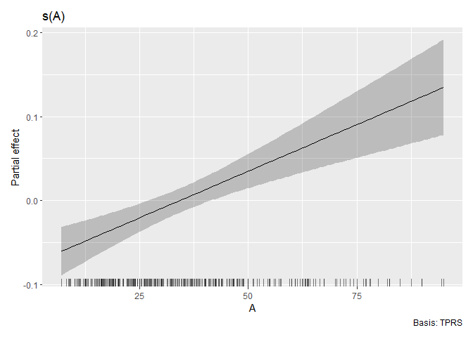<!-- -->

We see that the effect is again linear. Let’s fit our regression
adjustment model on the reweighed data.

``` r
warfarin_ipw_gm <- glm(INR~ A + Weight + Height  + Age + Enzyme + Amiodarone + Gender + Black + Asian + VKORC1.AG + VKORC1.AA + CYP2C9.12 + CYP2C9.13 + CYP2C9.other, data = warfarin, family = Gamma(link = 'log'), weights = ipw_weights)
```

``` r
appraise(warfarin_ipw_gm)
```

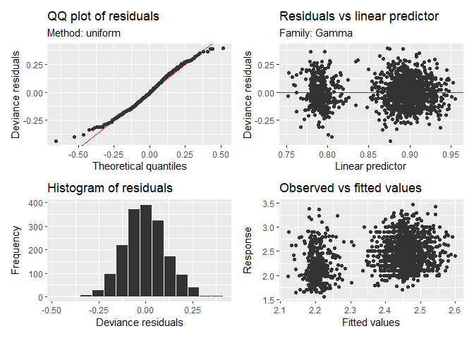<!-- -->

``` r
simulationOutput <- simulateResiduals(fittedModel = warfarin_ipw_gm)
plot(simulationOutput)
```

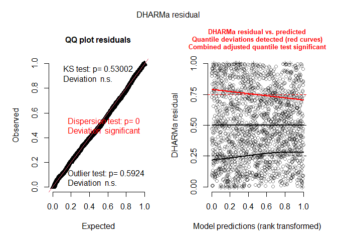<!-- -->

The average dose-response function is as follows.

``` r
cont_ate <- predictions(
  warfarin_ipw_gm,
  variables = list(A = seq(min(warfarin$A), max(warfarin$A), length.out = 100)),
  by = "A"
)
```

``` r
ggplot(cont_ate, aes(x = A, y = estimate)) +
  geom_line(color = "#2c3e50", linewidth = 1) +
  geom_ribbon(aes(ymin = conf.low, ymax = conf.high), fill = "#3498db", alpha = 0.3) +
  labs(
    title = "Dose-Response Function",
    subtitle = "",
    x = "Treatment (A)",
    y = "Average Predicted Outcome (INR)"
  ) +
  theme_minimal()
```

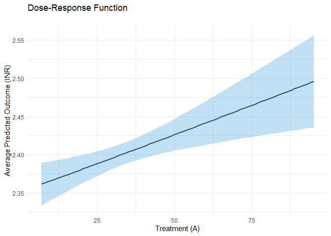<!-- -->

## Other Weighting Methods

We can also employ other weighting methods for continuous outcomes.

### Covariate Balancing Propensity Score

We start with covariate balancing propensity scores, which we know from
Part Twelve. They were adapted for continuous outcomes in (Fong et al.
2018) and are implemented in *weightit*. We will balance the first three
moments.

``` r
cbps_weights <- weightit(A ~ Weight + Height  + Age + Enzyme + Amiodarone + Gender + Black + Asian + VKORC1.AG + VKORC1.AA + CYP2C9.12 + CYP2C9.13 + CYP2C9.other, data = warfarin, method = "cbps", estimand = "ATE", moment = 3)
summary(cbps_weights)
```

    ##                   Summary of weights
    ## 
    ## - Weight ranges:
    ## 
    ##       Min                                  Max
    ## all 0.053 |---------------------------| 33.452
    ## 
    ## - Units with the 5 most extreme weights:
    ##                                        
    ##          51   1724   1245   1088    355
    ##  all 17.999 19.177 23.055 30.436 33.452
    ## 
    ## - Weight statistics:
    ## 
    ##     Coef of Var   MAD Entropy # Zeros
    ## all       1.657 0.587   0.448       0
    ## 
    ## - Effective Sample Sizes:
    ## 
    ##              Total
    ## Unweighted 1780.  
    ## Weighted    475.38

``` r
cbps_weights <- trim(cbps_weights, at = .99, lower = FALSE)
bal.tab(cbps_weights, un = TRUE)
```

    ## Balance Measures
    ##                 Type Corr.Un Corr.Adj
    ## Weight       Contin.  0.3864   0.1983
    ## Height       Contin.  0.2912   0.1156
    ## Age          Contin. -0.2553  -0.0754
    ## Enzyme        Binary  0.0925   0.0418
    ## Amiodarone    Binary -0.1346  -0.0399
    ## Gender        Binary  0.0868   0.0417
    ## Black         Binary  0.2095   0.1041
    ## Asian         Binary -0.3164  -0.1337
    ## VKORC1.AG     Binary -0.0565  -0.0097
    ## VKORC1.AA     Binary -0.4278  -0.1838
    ## CYP2C9.12     Binary -0.0154   0.0498
    ## CYP2C9.13     Binary -0.1426  -0.0591
    ## CYP2C9.other  Binary -0.0870  -0.0281
    ## 
    ## Effective sample sizes
    ##              Total
    ## Unadjusted 1780.  
    ## Adjusted    898.63

We see that the results are very similar to those from Gaussian inverse
propensity score weights. This is probably because these CBPS are also
based on normal densities. We can also consider a non-parametric version
that does not rely on a Gaussian model, proposed in the same paper.

``` r
ncbps_weights <- weightit(A ~ Weight + Height  + Age + Enzyme + Amiodarone + Gender + Black + Asian + VKORC1.AG + VKORC1.AA + CYP2C9.12 + CYP2C9.13 + CYP2C9.other, data = warfarin, method = "npcbps", estimand = "ATE", moment = 3)
summary(ncbps_weights)
```

    ##                   Summary of weights
    ## 
    ## - Weight ranges:
    ## 
    ##       Min                                   Max
    ## all 0.139 |---------------------------| 105.636
    ## 
    ## - Units with the 5 most extreme weights:
    ##                                         
    ##        1245    697   1404   1316     612
    ##  all 40.849 41.867 64.356 64.685 105.636
    ## 
    ## - Weight statistics:
    ## 
    ##     Coef of Var   MAD Entropy # Zeros
    ## all       3.704 0.608   0.817       0
    ## 
    ## - Effective Sample Sizes:
    ## 
    ##              Total
    ## Unweighted 1780.  
    ## Weighted    121.02

``` r
ncbps_weights <- trim(ncbps_weights, at = .99, lower = FALSE)
bal.tab(ncbps_weights,  un = TRUE)
```

    ## Balance Measures
    ##                 Type Corr.Un Corr.Adj
    ## Weight       Contin.  0.3864   0.1431
    ## Height       Contin.  0.2912   0.1074
    ## Age          Contin. -0.2553  -0.0598
    ## Enzyme        Binary  0.0925   0.0032
    ## Amiodarone    Binary -0.1346  -0.0545
    ## Gender        Binary  0.0868   0.0453
    ## Black         Binary  0.2095   0.1041
    ## Asian         Binary -0.3164  -0.1279
    ## VKORC1.AG     Binary -0.0565  -0.0176
    ## VKORC1.AA     Binary -0.4278  -0.1729
    ## CYP2C9.12     Binary -0.0154   0.0069
    ## CYP2C9.13     Binary -0.1426  -0.0405
    ## CYP2C9.other  Binary -0.0870  -0.0238
    ## 
    ## Effective sample sizes
    ##              Total
    ## Unadjusted 1780.  
    ## Adjusted   1238.01

The balance improved a bit, but we still did better with our treatment
gamma model.

### Entropy Balancing

Entropy balancing also translates to continuous treatment, (Tübbicke
2022) and (Vegetabile et al. 2021).

``` r
ebal_weights <- weightit(A ~ Weight + Height  + Age + Enzyme + Amiodarone + Gender + Black + Asian + VKORC1.AG + VKORC1.AA + CYP2C9.12 + CYP2C9.13 + CYP2C9.other, data = warfarin, method = "ebal", estimand = "ATE", moment = 2)
summary(ebal_weights)
```

    ##                   Summary of weights
    ## 
    ## - Weight ranges:
    ## 
    ##     Min                                  Max
    ## all   0 |---------------------------| 16.938
    ## 
    ## - Units with the 5 most extreme weights:
    ##                                       
    ##        355    683    697    612   1404
    ##  all 10.32 10.525 14.911 15.237 16.938
    ## 
    ## - Weight statistics:
    ## 
    ##     Coef of Var   MAD Entropy # Zeros
    ## all        1.19 0.672   0.455       0
    ## 
    ## - Effective Sample Sizes:
    ## 
    ##              Total
    ## Unweighted 1780.  
    ## Weighted    737.16

``` r
ebal_weights <- trim(ebal_weights, at = .99, lower = FALSE)
bal.tab(ebal_weights,  un = TRUE, int = TRUE)
```

    ## Balance Measures
    ##                                  Type Corr.Un Corr.Adj
    ## Weight                        Contin.  0.3864   0.0307
    ## Height                        Contin.  0.2912   0.0199
    ## Age                           Contin. -0.2553  -0.0062
    ## Enzyme                         Binary  0.0925   0.0017
    ## Amiodarone                     Binary -0.1346  -0.0102
    ## Gender                         Binary  0.0868   0.0081
    ## Black                          Binary  0.2095   0.0135
    ## Asian                          Binary -0.3164  -0.0228
    ## VKORC1.AG                      Binary -0.0565   0.0018
    ## VKORC1.AA                      Binary -0.4278  -0.0281
    ## CYP2C9.12                      Binary -0.0154   0.0049
    ## CYP2C9.13                      Binary -0.1426   0.0037
    ## CYP2C9.other                   Binary -0.0870   0.0019
    ## Weight * Height               Contin.  0.0238   0.0124
    ## Weight * Age                  Contin. -0.0589  -0.0037
    ## Weight * Enzyme_0             Contin.  0.3832   0.0245
    ## Weight * Enzyme_1             Contin.  0.0512   0.0398
    ## Weight * Amiodarone_0         Contin.  0.3758   0.0178
    ## Weight * Amiodarone_1         Contin.  0.0912   0.0504
    ## Weight * Gender_0             Contin.  0.2378  -0.0308
    ## Weight * Gender_1             Contin.  0.3180   0.0701
    ## Weight * Black_0              Contin.  0.3153   0.0258
    ## Weight * Black_1              Contin.  0.2294   0.0171
    ## Weight * Asian_0              Contin.  0.3010   0.0257
    ## Weight * Asian_1              Contin.  0.2953   0.0200
    ## Weight * VKORC1.AG_0          Contin.  0.3626  -0.0152
    ## Weight * VKORC1.AG_1          Contin.  0.1591   0.0740
    ## Weight * VKORC1.AA_0          Contin.  0.3089   0.0300
    ## Weight * VKORC1.AA_1          Contin.  0.2560   0.0112
    ## Weight * CYP2C9.12_0          Contin.  0.3867   0.0429
    ## Weight * CYP2C9.12_1          Contin.  0.0740  -0.0248
    ## Weight * CYP2C9.13_0          Contin.  0.3725   0.0297
    ## Weight * CYP2C9.13_1          Contin.  0.1034   0.0077
    ## Weight * CYP2C9.other_0       Contin.  0.3945   0.0261
    ## Weight * CYP2C9.other_1       Contin. -0.0148   0.0297
    ## Height * Age                  Contin. -0.0170   0.0003
    ## Height * Enzyme_0             Contin.  0.2839   0.0220
    ## Height * Enzyme_1             Contin.  0.0733  -0.0142
    ## Height * Amiodarone_0         Contin.  0.2923   0.0213
    ## Height * Amiodarone_1         Contin.  0.0412  -0.0013
    ## Height * Gender_0             Contin.  0.1970   0.0121
    ## Height * Gender_1             Contin.  0.2673   0.0195
    ## Height * Black_0              Contin.  0.2768   0.0027
    ## Height * Black_1              Contin.  0.0962   0.0405
    ## Height * Asian_0              Contin.  0.2037   0.0147
    ## Height * Asian_1              Contin.  0.2466   0.0156
    ## Height * VKORC1.AG_0          Contin.  0.2869   0.0097
    ## Height * VKORC1.AG_1          Contin.  0.0985   0.0212
    ## Height * VKORC1.AA_0          Contin.  0.2215   0.0185
    ## Height * VKORC1.AA_1          Contin.  0.2028   0.0089
    ## Height * CYP2C9.12_0          Contin.  0.2852   0.0305
    ## Height * CYP2C9.12_1          Contin.  0.0705  -0.0242
    ## Height * CYP2C9.13_0          Contin.  0.2814   0.0219
    ## Height * CYP2C9.13_1          Contin.  0.0751  -0.0037
    ## Height * CYP2C9.other_0       Contin.  0.2957   0.0184
    ## Height * CYP2C9.other_1       Contin. -0.0066   0.0113
    ## Age * Enzyme_0                Contin. -0.2531  -0.0092
    ## Age * Enzyme_1                Contin. -0.0341   0.0201
    ## Age * Amiodarone_0            Contin. -0.2359  -0.0024
    ## Age * Amiodarone_1            Contin. -0.1080  -0.0152
    ## Age * Gender_0                Contin. -0.1661  -0.0064
    ## Age * Gender_1                Contin. -0.1959  -0.0024
    ## Age * Black_0                 Contin. -0.1933  -0.0227
    ## Age * Black_1                 Contin. -0.1846   0.0313
    ## Age * Asian_0                 Contin. -0.2746   0.0002
    ## Age * Asian_1                 Contin. -0.0199  -0.0147
    ## Age * VKORC1.AG_0             Contin. -0.1758   0.0101
    ## Age * VKORC1.AG_1             Contin. -0.1905  -0.0231
    ## Age * VKORC1.AA_0             Contin. -0.2670   0.0200
    ## Age * VKORC1.AA_1             Contin. -0.0493  -0.0470
    ## Age * CYP2C9.12_0             Contin. -0.2433  -0.0065
    ## Age * CYP2C9.12_1             Contin. -0.0797  -0.0003
    ## Age * CYP2C9.13_0             Contin. -0.2345   0.0018
    ## Age * CYP2C9.13_1             Contin. -0.1046  -0.0256
    ## Age * CYP2C9.other_0          Contin. -0.2572  -0.0074
    ## Age * CYP2C9.other_1          Contin. -0.0143   0.0060
    ## Enzyme_0 * Amiodarone_0        Binary  0.0845   0.0143
    ## Enzyme_0 * Amiodarone_1        Binary -0.1390  -0.0166
    ## Enzyme_0 * Gender_0            Binary -0.0915  -0.0080
    ## Enzyme_0 * Gender_1            Binary  0.0643   0.0075
    ## Enzyme_0 * Black_0             Binary -0.2316  -0.0192
    ## Enzyme_0 * Black_1             Binary  0.2074   0.0193
    ## Enzyme_0 * Asian_0             Binary  0.2744   0.0205
    ## Enzyme_0 * Asian_1             Binary -0.3145  -0.0217
    ## Enzyme_0 * VKORC1.AG_0         Binary  0.0436   0.0019
    ## Enzyme_0 * VKORC1.AG_1         Binary -0.0716  -0.0025
    ## Enzyme_0 * VKORC1.AA_0         Binary  0.3883   0.0295
    ## Enzyme_0 * VKORC1.AA_1         Binary -0.4265  -0.0308
    ## Enzyme_0 * CYP2C9.12_0         Binary -0.0177  -0.0032
    ## Enzyme_0 * CYP2C9.12_1         Binary -0.0196   0.0027
    ## Enzyme_0 * CYP2C9.13_0         Binary  0.0907  -0.0027
    ## Enzyme_0 * CYP2C9.13_1         Binary -0.1457   0.0021
    ## Enzyme_0 * CYP2C9.other_0      Binary  0.0037  -0.0026
    ## Enzyme_0 * CYP2C9.other_1      Binary -0.0870   0.0019
    ## Enzyme_1 * Amiodarone_0        Binary  0.0919  -0.0115
    ## Enzyme_1 * Amiodarone_1        Binary  0.0171   0.0372
    ## Enzyme_1 * Gender_0            Binary  0.0242  -0.0005
    ## Enzyme_1 * Gender_1            Binary  0.0985   0.0026
    ## Enzyme_1 * Black_0             Binary  0.0911   0.0194
    ## Enzyme_1 * Black_1             Binary  0.0238  -0.0353
    ## Enzyme_1 * Asian_0             Binary  0.1048   0.0053
    ## Enzyme_1 * Asian_1             Binary -0.0271  -0.0114
    ## Enzyme_1 * VKORC1.AG_0         Binary  0.0556  -0.0166
    ## Enzyme_1 * VKORC1.AG_1         Binary  0.0768   0.0223
    ## Enzyme_1 * VKORC1.AA_0         Binary  0.1144  -0.0069
    ## Enzyme_1 * VKORC1.AA_1         Binary -0.0233   0.0178
    ## Enzyme_1 * CYP2C9.12_0         Binary  0.0906  -0.0041
    ## Enzyme_1 * CYP2C9.12_1         Binary  0.0235   0.0133
    ## Enzyme_1 * CYP2C9.13_0         Binary  0.0904  -0.0015
    ## Enzyme_1 * CYP2C9.13_1         Binary  0.0192   0.0134
    ## Enzyme_1 * CYP2C9.other_0      Binary  0.0925   0.0017
    ## Amiodarone_0 * Gender_0        Binary -0.0499   0.0003
    ## Amiodarone_0 * Gender_1        Binary  0.1254   0.0056
    ## Amiodarone_0 * Black_0         Binary -0.1001   0.0000
    ## Amiodarone_0 * Black_1         Binary  0.2152   0.0075
    ## Amiodarone_0 * Asian_0         Binary  0.3530   0.0281
    ## Amiodarone_0 * Asian_1         Binary -0.3022  -0.0244
    ## Amiodarone_0 * VKORC1.AG_0     Binary  0.0905   0.0049
    ## Amiodarone_0 * VKORC1.AG_1     Binary -0.0129   0.0011
    ## Amiodarone_0 * VKORC1.AA_0     Binary  0.4457   0.0330
    ## Amiodarone_0 * VKORC1.AA_1     Binary -0.3979  -0.0293
    ## Amiodarone_0 * CYP2C9.12_0     Binary  0.0877   0.0054
    ## Amiodarone_0 * CYP2C9.12_1     Binary  0.0080   0.0022
    ## Amiodarone_0 * CYP2C9.13_0     Binary  0.1946   0.0009
    ## Amiodarone_0 * CYP2C9.13_1     Binary -0.1274   0.0094
    ## Amiodarone_0 * CYP2C9.other_0  Binary  0.1568   0.0061
    ## Amiodarone_0 * CYP2C9.other_1  Binary -0.0744   0.0066
    ## Amiodarone_1 * Gender_0        Binary -0.1150  -0.0256
    ## Amiodarone_1 * Gender_1        Binary -0.0821   0.0049
    ## Amiodarone_1 * Black_0         Binary -0.1403  -0.0198
    ## Amiodarone_1 * Black_1         Binary -0.0048   0.0243
    ## Amiodarone_1 * Asian_0         Binary -0.1130  -0.0127
    ## Amiodarone_1 * Asian_1         Binary -0.0867   0.0068
    ## Amiodarone_1 * VKORC1.AG_0     Binary -0.0810  -0.0153
    ## Amiodarone_1 * VKORC1.AG_1     Binary -0.1059   0.0019
    ## Amiodarone_1 * VKORC1.AA_0     Binary -0.0826  -0.0122
    ## Amiodarone_1 * VKORC1.AA_1     Binary -0.1302   0.0019
    ## Amiodarone_1 * CYP2C9.12_0     Binary -0.1164  -0.0148
    ## Amiodarone_1 * CYP2C9.12_1     Binary -0.0645   0.0079
    ## Amiodarone_1 * CYP2C9.13_0     Binary -0.1191  -0.0050
    ## Amiodarone_1 * CYP2C9.13_1     Binary -0.0683  -0.0186
    ## Amiodarone_1 * CYP2C9.other_0  Binary -0.1270  -0.0080
    ## Amiodarone_1 * CYP2C9.other_1  Binary -0.0478  -0.0117
    ## Gender_0 * Black_0             Binary -0.1705  -0.0004
    ## Gender_0 * Black_1             Binary  0.1199  -0.0126
    ## Gender_0 * Asian_0             Binary  0.0636  -0.0055
    ## Gender_0 * Asian_1             Binary -0.2162  -0.0046
    ## Gender_0 * VKORC1.AG_0         Binary -0.0486  -0.0011
    ## Gender_0 * VKORC1.AG_1         Binary -0.0640  -0.0108
    ## Gender_0 * VKORC1.AA_0         Binary  0.1155  -0.0119
    ## Gender_0 * VKORC1.AA_1         Binary -0.2724   0.0038
    ## Gender_0 * CYP2C9.12_0         Binary -0.0677  -0.0091
    ## Gender_0 * CYP2C9.12_1         Binary -0.0474   0.0017
    ## Gender_0 * CYP2C9.13_0         Binary -0.0531  -0.0144
    ## Gender_0 * CYP2C9.13_1         Binary -0.0969   0.0172
    ## Gender_0 * CYP2C9.other_0      Binary -0.0757  -0.0084
    ## Gender_0 * CYP2C9.other_1      Binary -0.0535   0.0012
    ## Gender_1 * Black_0             Binary -0.0078  -0.0102
    ## Gender_1 * Black_1             Binary  0.1612   0.0315
    ## Gender_1 * Asian_0             Binary  0.2051   0.0238
    ## Gender_1 * Asian_1             Binary -0.2029  -0.0268
    ## Gender_1 * VKORC1.AG_0         Binary  0.1018  -0.0008
    ## Gender_1 * VKORC1.AG_1         Binary -0.0150   0.0103
    ## Gender_1 * VKORC1.AA_0         Binary  0.2794   0.0357
    ## Gender_1 * VKORC1.AA_1         Binary -0.2831  -0.0404
    ## Gender_1 * CYP2C9.12_0         Binary  0.0754   0.0053
    ## Gender_1 * CYP2C9.12_1         Binary  0.0173   0.0046
    ## Gender_1 * CYP2C9.13_0         Binary  0.1327   0.0119
    ## Gender_1 * CYP2C9.13_1         Binary -0.1017  -0.0084
    ## Gender_1 * CYP2C9.other_0      Binary  0.1029   0.0077
    ## Gender_1 * CYP2C9.other_1      Binary -0.0681   0.0015
    ## Black_0 * Asian_0              Binary  0.0990   0.0084
    ## Black_0 * Asian_1              Binary -0.3164  -0.0228
    ## Black_0 * VKORC1.AG_0          Binary -0.1080   0.0050
    ## Black_0 * VKORC1.AG_1          Binary -0.0610  -0.0167
    ## Black_0 * VKORC1.AA_0          Binary  0.2139   0.0142
    ## Black_0 * VKORC1.AA_1          Binary -0.4256  -0.0279
    ## Black_0 * CYP2C9.12_0          Binary -0.1583  -0.0058
    ## Black_0 * CYP2C9.12_1          Binary -0.0262  -0.0079
    ## Black_0 * CYP2C9.13_0          Binary -0.0935  -0.0054
    ## Black_0 * CYP2C9.13_1          Binary -0.1462  -0.0105
    ## Black_0 * CYP2C9.other_0       Binary -0.1682  -0.0059
    ## Black_0 * CYP2C9.other_1       Binary -0.0957  -0.0205
    ## Black_1 * Asian_0              Binary  0.2095   0.0135
    ## Black_1 * VKORC1.AG_0          Binary  0.2227  -0.0092
    ## Black_1 * VKORC1.AG_1          Binary  0.0077   0.0477
    ## Black_1 * VKORC1.AA_0          Binary  0.2137   0.0139
    ## Black_1 * VKORC1.AA_1          Binary -0.0334  -0.0032
    ## Black_1 * CYP2C9.12_0          Binary  0.2053   0.0027
    ## Black_1 * CYP2C9.12_1          Binary  0.0332   0.0418
    ## Black_1 * CYP2C9.13_0          Binary  0.2108   0.0034
    ## Black_1 * CYP2C9.13_1          Binary  0.0027   0.0635
    ## Black_1 * CYP2C9.other_0       Binary  0.2121   0.0054
    ## Black_1 * CYP2C9.other_1       Binary -0.0022   0.0456
    ## Asian_0 * VKORC1.AG_0          Binary  0.3090   0.0185
    ## Asian_0 * VKORC1.AG_1          Binary -0.0489   0.0005
    ## Asian_0 * VKORC1.AA_0          Binary  0.4156   0.0235
    ## Asian_0 * VKORC1.AA_1          Binary -0.2156  -0.0049
    ## Asian_0 * CYP2C9.12_0          Binary  0.2847   0.0162
    ## Asian_0 * CYP2C9.12_1          Binary -0.0154   0.0049
    ## Asian_0 * CYP2C9.13_0          Binary  0.3370   0.0168
    ## Asian_0 * CYP2C9.13_1          Binary -0.0857   0.0071
    ## Asian_0 * CYP2C9.other_0       Binary  0.3337   0.0212
    ## Asian_0 * CYP2C9.other_1       Binary -0.0800   0.0021
    ## Asian_1 * VKORC1.AG_0          Binary -0.3233  -0.0257
    ## Asian_1 * VKORC1.AG_1          Binary -0.0243   0.0039
    ## Asian_1 * VKORC1.AA_0          Binary -0.0065   0.0093
    ## Asian_1 * VKORC1.AA_1          Binary -0.3339  -0.0286
    ## Asian_1 * CYP2C9.12_0          Binary -0.3164  -0.0228
    ## Asian_1 * CYP2C9.13_0          Binary -0.2804  -0.0217
    ## Asian_1 * CYP2C9.13_1          Binary -0.1354  -0.0054
    ## Asian_1 * CYP2C9.other_0       Binary -0.3136  -0.0228
    ## Asian_1 * CYP2C9.other_1       Binary -0.0414  -0.0005
    ## VKORC1.AG_0 * VKORC1.AA_0      Binary  0.4488   0.0240
    ## VKORC1.AG_0 * VKORC1.AA_1      Binary -0.4278  -0.0281
    ## VKORC1.AG_0 * CYP2C9.12_0      Binary  0.0369  -0.0060
    ## VKORC1.AG_0 * CYP2C9.12_1      Binary  0.0333   0.0080
    ## VKORC1.AG_0 * CYP2C9.13_0      Binary  0.1020  -0.0024
    ## VKORC1.AG_0 * CYP2C9.13_1      Binary -0.1027   0.0014
    ## VKORC1.AG_0 * CYP2C9.other_0   Binary  0.0669  -0.0068
    ## VKORC1.AG_0 * CYP2C9.other_1   Binary -0.0425   0.0195
    ## VKORC1.AG_1 * VKORC1.AA_0      Binary -0.0565   0.0018
    ## VKORC1.AG_1 * CYP2C9.12_0      Binary -0.0286   0.0028
    ## VKORC1.AG_1 * CYP2C9.12_1      Binary -0.0579  -0.0017
    ## VKORC1.AG_1 * CYP2C9.13_0      Binary -0.0206   0.0003
    ## VKORC1.AG_1 * CYP2C9.13_1      Binary -0.0948   0.0040
    ## VKORC1.AG_1 * CYP2C9.other_0   Binary -0.0389   0.0063
    ## VKORC1.AG_1 * CYP2C9.other_1   Binary -0.0851  -0.0211
    ## VKORC1.AA_0 * CYP2C9.12_0      Binary  0.3757   0.0236
    ## VKORC1.AA_0 * CYP2C9.12_1      Binary  0.0219   0.0031
    ## VKORC1.AA_0 * CYP2C9.13_0      Binary  0.4341   0.0212
    ## VKORC1.AA_0 * CYP2C9.13_1      Binary -0.0601   0.0102
    ## VKORC1.AA_0 * CYP2C9.other_0   Binary  0.4382   0.0267
    ## VKORC1.AA_0 * CYP2C9.other_1   Binary -0.0630   0.0024
    ## VKORC1.AA_1 * CYP2C9.12_0      Binary -0.4089  -0.0303
    ## VKORC1.AA_1 * CYP2C9.12_1      Binary -0.0931   0.0051
    ## VKORC1.AA_1 * CYP2C9.13_0      Binary -0.3812  -0.0256
    ## VKORC1.AA_1 * CYP2C9.13_1      Binary -0.1692  -0.0095
    ## VKORC1.AA_1 * CYP2C9.other_0   Binary -0.4195  -0.0281
    ## VKORC1.AA_1 * CYP2C9.other_1   Binary -0.0770  -0.0008
    ## CYP2C9.12_0 * CYP2C9.13_0      Binary  0.1096  -0.0065
    ## CYP2C9.12_0 * CYP2C9.13_1      Binary -0.1426   0.0037
    ## CYP2C9.12_0 * CYP2C9.other_0   Binary  0.0518  -0.0054
    ## CYP2C9.12_0 * CYP2C9.other_1   Binary -0.0870   0.0019
    ## CYP2C9.12_1 * CYP2C9.13_0      Binary -0.0154   0.0049
    ## CYP2C9.12_1 * CYP2C9.other_0   Binary -0.0154   0.0049
    ## CYP2C9.13_0 * CYP2C9.other_0   Binary  0.1707  -0.0043
    ## CYP2C9.13_0 * CYP2C9.other_1   Binary -0.0870   0.0019
    ## CYP2C9.13_1 * CYP2C9.other_0   Binary -0.1426   0.0037
    ## 
    ## Effective sample sizes
    ##              Total
    ## Unadjusted 1780.  
    ## Adjusted    930.77

The balance is a quite bit better than for our gamma model.

``` r
bal.plot(ebal_weights, "Weight")
```

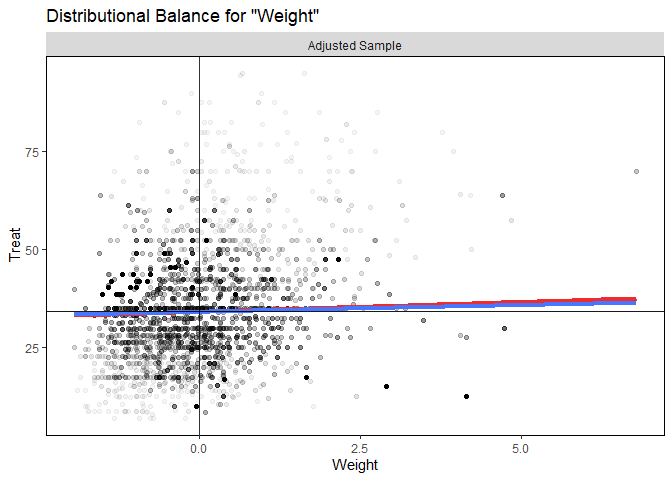<!-- -->

``` r
bal.plot(ebal_weights, "Height")
```

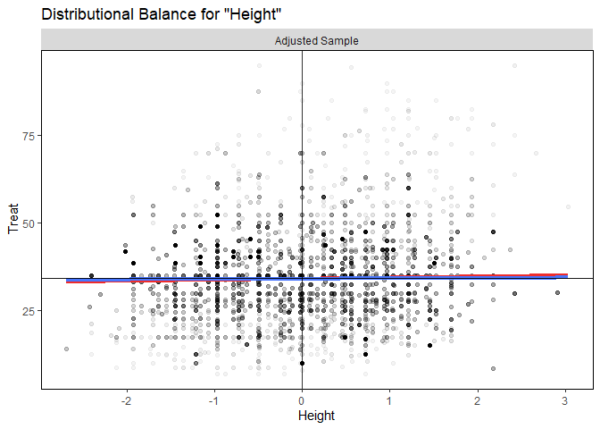<!-- -->

``` r
bal.plot(ebal_weights, "Age")
```

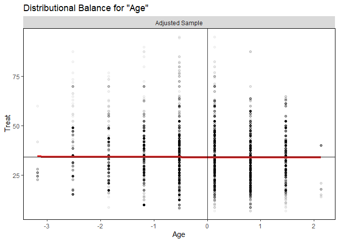<!-- -->

``` r
p1 <- bal.plot(ebal_weights, "Enzyme")
p2 <- bal.plot(ebal_weights, "Amiodarone")
p3 <- bal.plot(ebal_weights, "Gender")
p4 <- bal.plot(ebal_weights, "Black")

(p1 + p2 + p3 + p4 ) + plot_layout(ncol = 2)
```

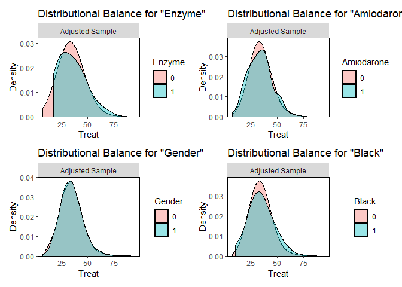<!-- -->

``` r
p1 <- bal.plot(ebal_weights, "Asian")
p2 <- bal.plot(ebal_weights, "VKORC1.AG")
p3 <- bal.plot(ebal_weights, "VKORC1.AA")
p4 <- bal.plot(ebal_weights, "CYP2C9.12")

(p1 + p2 + p3 + p4 ) + plot_layout(ncol = 2)
```

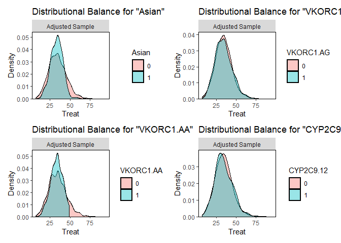<!-- -->

``` r
p1 <- bal.plot(ebal_weights, "CYP2C9.13")
p2 <- bal.plot(ebal_weights, "CYP2C9.other")

(p1 + p2 ) + plot_layout(ncol = 2)
```

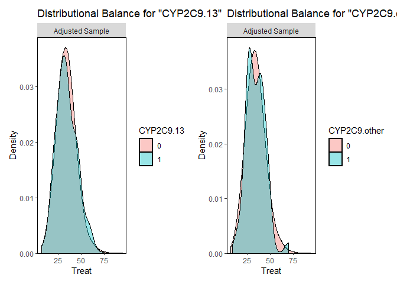<!-- -->

We fit the unadjusted model first.

``` r
warfarin_ebal_unadj <- gam(INR~ s(A, k = 25, bs = 'tp'), data = warfarin, weights = ebal_weights$weights)
summary(warfarin_ebal_unadj)
```

    ## 
    ## Family: gaussian 
    ## Link function: identity 
    ## 
    ## Formula:
    ## INR ~ s(A, k = 25, bs = "tp")
    ## 
    ## Parametric coefficients:
    ##             Estimate Std. Error t value Pr(>|t|)    
    ## (Intercept) 2.401030   0.007465   321.6   <2e-16 ***
    ## ---
    ## Signif. codes:  0 '***' 0.001 '**' 0.01 '*' 0.05 '.' 0.1 ' ' 1
    ## 
    ## Approximate significance of smooth terms:
    ##      edf Ref.df     F p-value
    ## s(A)   1      1 2.264   0.133
    ## 
    ## R-sq.(adj) =  0.000745   Deviance explained = 0.127%
    ## GCV = 0.095714  Scale est. = 0.095607  n = 1780

``` r
draw(warfarin_ebal_unadj)
```

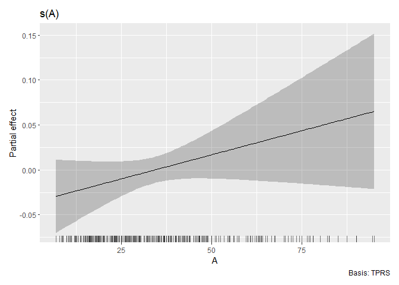<!-- -->

We see that the smooth is still linear. Let’s fit our adjusted model for
the weighted data.

``` r
warfarin_ebal_gm <- glm(INR~ A + Weight + Height  + Age + Enzyme + Amiodarone + Gender + Black + Asian + VKORC1.AG + VKORC1.AA + CYP2C9.12 + CYP2C9.13 + CYP2C9.other, data = warfarin, family = Gamma(link = 'log'),  weights = ebal_weights$weights)
```

Let us check the fit.

``` r
appraise(warfarin_ebal_gm)
```

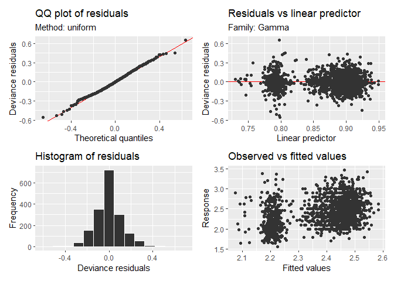<!-- -->

``` r
simulationOutput <- simulateResiduals(fittedModel = warfarin_ebal_gm)
plot(simulationOutput)
```

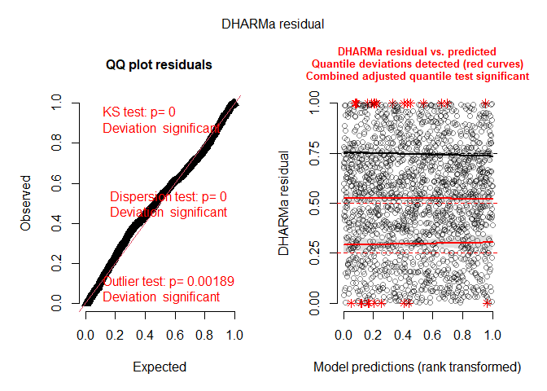<!-- -->
The fit is decent comparable to our other models.

``` r
cont_ate <- predictions(
  warfarin_ebal_gm,
  variables = list(A = seq(min(warfarin$A), max(warfarin$A), length.out = 100)),
  by = "A"
)
```

``` r
ggplot(cont_ate, aes(x = A, y = estimate)) +
  geom_line(color = "#2c3e50", linewidth = 1) +
  geom_ribbon(aes(ymin = conf.low, ymax = conf.high), fill = "#3498db", alpha = 0.3) +
  labs(
    title = "Dose-Response Function",
    subtitle = "",
    x = "Treatment (A)",
    y = "Average Predicted Outcome (INR)"
  ) +
  theme_minimal()
```

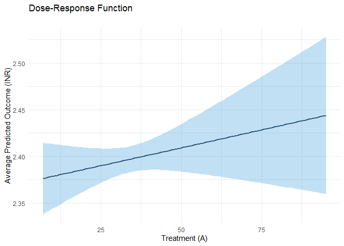<!-- -->

### Energy Balancing

The last method we will consider here for balancing continuous treatment
in observational data is energy balancing (Huling et al. 2024). Energy
balancing does not target the specific moments; it optimizes the energy
distance between distributions. By adding *moments*, we enforce
additional balancing constraints (*tols* defines the tolerance for the
constraint; see
<https://ngreifer.github.io/WeightIt/reference/method_energy.html>).

``` r
energy_weights <- weightit(A ~ Weight + Height  + Age + Enzyme + Amiodarone + Gender + Black + Asian + VKORC1.AG + VKORC1.AA + CYP2C9.12 + CYP2C9.13 + CYP2C9.other, data = warfarin, method = "energy", estimand = "ATE", moments = 1, tols = 0.05)
summary(energy_weights)
```

    ##                   Summary of weights
    ## 
    ## - Weight ranges:
    ## 
    ##     Min                                 Max
    ## all   0 |---------------------------| 6.217
    ## 
    ## - Units with the 5 most extreme weights:
    ##                                 
    ##       772   697  1404  742   612
    ##  all 5.13 5.184 5.213 5.85 6.217
    ## 
    ## - Weight statistics:
    ## 
    ##     Coef of Var   MAD Entropy # Zeros
    ## all       0.773 0.546   0.315       0
    ## 
    ## - Effective Sample Sizes:
    ## 
    ##              Total
    ## Unweighted 1780.  
    ## Weighted   1114.94

We do not even have to truncate the weights.

``` r
bal.tab(energy_weights,  un = TRUE, int = TRUE)
```

    ## Balance Measures
    ##                                  Type Corr.Un Corr.Adj
    ## Weight                        Contin.  0.3864   0.0500
    ## Height                        Contin.  0.2912   0.0488
    ## Age                           Contin. -0.2553  -0.0500
    ## Enzyme                         Binary  0.0925   0.0402
    ## Amiodarone                     Binary -0.1346  -0.0392
    ## Gender                         Binary  0.0868   0.0045
    ## Black                          Binary  0.2095  -0.0065
    ## Asian                          Binary -0.3164  -0.0360
    ## VKORC1.AG                      Binary -0.0565  -0.0500
    ## VKORC1.AA                      Binary -0.4278  -0.0500
    ## CYP2C9.12                      Binary -0.0154  -0.0104
    ## CYP2C9.13                      Binary -0.1426  -0.0445
    ## CYP2C9.other                   Binary -0.0870  -0.0444
    ## Weight * Height               Contin.  0.0238   0.0033
    ## Weight * Age                  Contin. -0.0589   0.0292
    ## Weight * Enzyme_0             Contin.  0.3832   0.0490
    ## Weight * Enzyme_1             Contin.  0.0512   0.0100
    ## Weight * Amiodarone_0         Contin.  0.3758   0.0423
    ## Weight * Amiodarone_1         Contin.  0.0912   0.0343
    ## Weight * Gender_0             Contin.  0.2378   0.0079
    ## Weight * Gender_1             Contin.  0.3180   0.0618
    ## Weight * Black_0              Contin.  0.3153   0.0512
    ## Weight * Black_1              Contin.  0.2294   0.0137
    ## Weight * Asian_0              Contin.  0.3010   0.0403
    ## Weight * Asian_1              Contin.  0.2953   0.0356
    ## Weight * VKORC1.AG_0          Contin.  0.3626   0.0273
    ## Weight * VKORC1.AG_1          Contin.  0.1591   0.0478
    ## Weight * VKORC1.AA_0          Contin.  0.3089   0.0417
    ## Weight * VKORC1.AA_1          Contin.  0.2560   0.0302
    ## Weight * CYP2C9.12_0          Contin.  0.3867   0.0547
    ## Weight * CYP2C9.12_1          Contin.  0.0740  -0.0021
    ## Weight * CYP2C9.13_0          Contin.  0.3725   0.0466
    ## Weight * CYP2C9.13_1          Contin.  0.1034   0.0198
    ## Weight * CYP2C9.other_0       Contin.  0.3945   0.0539
    ## Weight * CYP2C9.other_1       Contin. -0.0148  -0.0185
    ## Height * Age                  Contin. -0.0170   0.0099
    ## Height * Enzyme_0             Contin.  0.2839   0.0471
    ## Height * Enzyme_1             Contin.  0.0733   0.0157
    ## Height * Amiodarone_0         Contin.  0.2923   0.0502
    ## Height * Amiodarone_1         Contin.  0.0412   0.0032
    ## Height * Gender_0             Contin.  0.1970   0.0328
    ## Height * Gender_1             Contin.  0.2673   0.0450
    ## Height * Black_0              Contin.  0.2768   0.0398
    ## Height * Black_1              Contin.  0.0962   0.0300
    ## Height * Asian_0              Contin.  0.2037   0.0420
    ## Height * Asian_1              Contin.  0.2466   0.0284
    ## Height * VKORC1.AG_0          Contin.  0.2869   0.0420
    ## Height * VKORC1.AG_1          Contin.  0.0985   0.0253
    ## Height * VKORC1.AA_0          Contin.  0.2215   0.0402
    ## Height * VKORC1.AA_1          Contin.  0.2028   0.0295
    ## Height * CYP2C9.12_0          Contin.  0.2852   0.0510
    ## Height * CYP2C9.12_1          Contin.  0.0705   0.0034
    ## Height * CYP2C9.13_0          Contin.  0.2814   0.0494
    ## Height * CYP2C9.13_1          Contin.  0.0751   0.0050
    ## Height * CYP2C9.other_0       Contin.  0.2957   0.0498
    ## Height * CYP2C9.other_1       Contin. -0.0066  -0.0024
    ## Age * Enzyme_0                Contin. -0.2531  -0.0517
    ## Age * Enzyme_1                Contin. -0.0341   0.0076
    ## Age * Amiodarone_0            Contin. -0.2359  -0.0417
    ## Age * Amiodarone_1            Contin. -0.1080  -0.0386
    ## Age * Gender_0                Contin. -0.1661  -0.0295
    ## Age * Gender_1                Contin. -0.1959  -0.0413
    ## Age * Black_0                 Contin. -0.1933  -0.0623
    ## Age * Black_1                 Contin. -0.1846   0.0122
    ## Age * Asian_0                 Contin. -0.2746  -0.0428
    ## Age * Asian_1                 Contin. -0.0199  -0.0271
    ## Age * VKORC1.AG_0             Contin. -0.1758  -0.0174
    ## Age * VKORC1.AG_1             Contin. -0.1905  -0.0592
    ## Age * VKORC1.AA_0             Contin. -0.2670  -0.0216
    ## Age * VKORC1.AA_1             Contin. -0.0493  -0.0629
    ## Age * CYP2C9.12_0             Contin. -0.2433  -0.0430
    ## Age * CYP2C9.12_1             Contin. -0.0797  -0.0269
    ## Age * CYP2C9.13_0             Contin. -0.2345  -0.0363
    ## Age * CYP2C9.13_1             Contin. -0.1046  -0.0502
    ## Age * CYP2C9.other_0          Contin. -0.2572  -0.0521
    ## Age * CYP2C9.other_1          Contin. -0.0143   0.0063
    ## Enzyme_0 * Amiodarone_0        Binary  0.0845   0.0203
    ## Enzyme_0 * Amiodarone_1        Binary -0.1390  -0.0424
    ## Enzyme_0 * Gender_0            Binary -0.0915  -0.0073
    ## Enzyme_0 * Gender_1            Binary  0.0643  -0.0042
    ## Enzyme_0 * Black_0             Binary -0.2316  -0.0095
    ## Enzyme_0 * Black_1             Binary  0.2074  -0.0046
    ## Enzyme_0 * Asian_0             Binary  0.2744   0.0202
    ## Enzyme_0 * Asian_1             Binary -0.3145  -0.0345
    ## Enzyme_0 * VKORC1.AG_0         Binary  0.0436   0.0442
    ## Enzyme_0 * VKORC1.AG_1         Binary -0.0716  -0.0567
    ## Enzyme_0 * VKORC1.AA_0         Binary  0.3883   0.0374
    ## Enzyme_0 * VKORC1.AA_1         Binary -0.4265  -0.0511
    ## Enzyme_0 * CYP2C9.12_0         Binary -0.0177  -0.0001
    ## Enzyme_0 * CYP2C9.12_1         Binary -0.0196  -0.0165
    ## Enzyme_0 * CYP2C9.13_0         Binary  0.0907   0.0243
    ## Enzyme_0 * CYP2C9.13_1         Binary -0.1457  -0.0467
    ## Enzyme_0 * CYP2C9.other_0      Binary  0.0037   0.0066
    ## Enzyme_0 * CYP2C9.other_1      Binary -0.0870  -0.0444
    ## Enzyme_1 * Amiodarone_0        Binary  0.0919   0.0367
    ## Enzyme_1 * Amiodarone_1        Binary  0.0171   0.0164
    ## Enzyme_1 * Gender_0            Binary  0.0242   0.0158
    ## Enzyme_1 * Gender_1            Binary  0.0985   0.0386
    ## Enzyme_1 * Black_0             Binary  0.0911   0.0506
    ## Enzyme_1 * Black_1             Binary  0.0238  -0.0120
    ## Enzyme_1 * Asian_0             Binary  0.1048   0.0468
    ## Enzyme_1 * Asian_1             Binary -0.0271  -0.0162
    ## Enzyme_1 * VKORC1.AG_0         Binary  0.0556   0.0244
    ## Enzyme_1 * VKORC1.AG_1         Binary  0.0768   0.0331
    ## Enzyme_1 * VKORC1.AA_0         Binary  0.1144   0.0418
    ## Enzyme_1 * VKORC1.AA_1         Binary -0.0233   0.0057
    ## Enzyme_1 * CYP2C9.12_0         Binary  0.0906   0.0279
    ## Enzyme_1 * CYP2C9.12_1         Binary  0.0235   0.0356
    ## Enzyme_1 * CYP2C9.13_0         Binary  0.0904   0.0373
    ## Enzyme_1 * CYP2C9.13_1         Binary  0.0192   0.0166
    ## Enzyme_1 * CYP2C9.other_0      Binary  0.0925   0.0402
    ## Amiodarone_0 * Gender_0        Binary -0.0499   0.0073
    ## Amiodarone_0 * Gender_1        Binary  0.1254   0.0153
    ## Amiodarone_0 * Black_0         Binary -0.1001   0.0305
    ## Amiodarone_0 * Black_1         Binary  0.2152  -0.0062
    ## Amiodarone_0 * Asian_0         Binary  0.3530   0.0573
    ## Amiodarone_0 * Asian_1         Binary -0.3022  -0.0369
    ## Amiodarone_0 * VKORC1.AG_0     Binary  0.0905   0.0538
    ## Amiodarone_0 * VKORC1.AG_1     Binary -0.0129  -0.0329
    ## Amiodarone_0 * VKORC1.AA_0     Binary  0.4457   0.0691
    ## Amiodarone_0 * VKORC1.AA_1     Binary -0.3979  -0.0497
    ## Amiodarone_0 * CYP2C9.12_0     Binary  0.0877   0.0272
    ## Amiodarone_0 * CYP2C9.12_1     Binary  0.0080   0.0002
    ## Amiodarone_0 * CYP2C9.13_0     Binary  0.1946   0.0552
    ## Amiodarone_0 * CYP2C9.13_1     Binary -0.1274  -0.0351
    ## Amiodarone_0 * CYP2C9.other_0  Binary  0.1568   0.0533
    ## Amiodarone_0 * CYP2C9.other_1  Binary -0.0744  -0.0378
    ## Amiodarone_1 * Gender_0        Binary -0.1150  -0.0357
    ## Amiodarone_1 * Gender_1        Binary -0.0821  -0.0224
    ## Amiodarone_1 * Black_0         Binary -0.1403  -0.0407
    ## Amiodarone_1 * Black_1         Binary -0.0048  -0.0017
    ## Amiodarone_1 * Asian_0         Binary -0.1130  -0.0415
    ## Amiodarone_1 * Asian_1         Binary -0.0867   0.0024
    ## Amiodarone_1 * VKORC1.AG_0     Binary -0.0810  -0.0116
    ## Amiodarone_1 * VKORC1.AG_1     Binary -0.1059  -0.0438
    ## Amiodarone_1 * VKORC1.AA_0     Binary -0.0826  -0.0409
    ## Amiodarone_1 * VKORC1.AA_1     Binary -0.1302  -0.0046
    ## Amiodarone_1 * CYP2C9.12_0     Binary -0.1164  -0.0288
    ## Amiodarone_1 * CYP2C9.12_1     Binary -0.0645  -0.0296
    ## Amiodarone_1 * CYP2C9.13_0     Binary -0.1191  -0.0296
    ## Amiodarone_1 * CYP2C9.13_1     Binary -0.0683  -0.0371
    ## Amiodarone_1 * CYP2C9.other_0  Binary -0.1270  -0.0348
    ## Amiodarone_1 * CYP2C9.other_1  Binary -0.0478  -0.0247
    ## Gender_0 * Black_0             Binary -0.1705   0.0019
    ## Gender_0 * Black_1             Binary  0.1199  -0.0102
    ## Gender_0 * Asian_0             Binary  0.0636   0.0076
    ## Gender_0 * Asian_1             Binary -0.2162  -0.0171
    ## Gender_0 * VKORC1.AG_0         Binary -0.0486   0.0186
    ## Gender_0 * VKORC1.AG_1         Binary -0.0640  -0.0328
    ## Gender_0 * VKORC1.AA_0         Binary  0.1155   0.0095
    ## Gender_0 * VKORC1.AA_1         Binary -0.2724  -0.0185
    ## Gender_0 * CYP2C9.12_0         Binary -0.0677   0.0003
    ## Gender_0 * CYP2C9.12_1         Binary -0.0474  -0.0110
    ## Gender_0 * CYP2C9.13_0         Binary -0.0531   0.0013
    ## Gender_0 * CYP2C9.13_1         Binary -0.0969  -0.0162
    ## Gender_0 * CYP2C9.other_0      Binary -0.0757   0.0005
    ## Gender_0 * CYP2C9.other_1      Binary -0.0535  -0.0230
    ## Gender_1 * Black_0             Binary -0.0078   0.0034
    ## Gender_1 * Black_1             Binary  0.1612   0.0017
    ## Gender_1 * Asian_0             Binary  0.2051   0.0230
    ## Gender_1 * Asian_1             Binary -0.2029  -0.0315
    ## Gender_1 * VKORC1.AG_0         Binary  0.1018   0.0323
    ## Gender_1 * VKORC1.AG_1         Binary -0.0150  -0.0314
    ## Gender_1 * VKORC1.AA_0         Binary  0.2794   0.0362
    ## Gender_1 * VKORC1.AA_1         Binary -0.2831  -0.0465
    ## Gender_1 * CYP2C9.12_0         Binary  0.0754   0.0068
    ## Gender_1 * CYP2C9.12_1         Binary  0.0173  -0.0043
    ## Gender_1 * CYP2C9.13_0         Binary  0.1327   0.0240
    ## Gender_1 * CYP2C9.13_1         Binary -0.1017  -0.0424
    ## Gender_1 * CYP2C9.other_0      Binary  0.1029   0.0138
    ## Gender_1 * CYP2C9.other_1      Binary -0.0681  -0.0385
    ## Black_0 * Asian_0              Binary  0.0990   0.0355
    ## Black_0 * Asian_1              Binary -0.3164  -0.0360
    ## Black_0 * VKORC1.AG_0          Binary -0.1080   0.0473
    ## Black_0 * VKORC1.AG_1          Binary -0.0610  -0.0452
    ## Black_0 * VKORC1.AA_0          Binary  0.2139   0.0494
    ## Black_0 * VKORC1.AA_1          Binary -0.4256  -0.0497
    ## Black_0 * CYP2C9.12_0          Binary -0.1583   0.0172
    ## Black_0 * CYP2C9.12_1          Binary -0.0262  -0.0164
    ## Black_0 * CYP2C9.13_0          Binary -0.0935   0.0376
    ## Black_0 * CYP2C9.13_1          Binary -0.1462  -0.0513
    ## Black_0 * CYP2C9.other_0       Binary -0.1682   0.0240
    ## Black_0 * CYP2C9.other_1       Binary -0.0957  -0.0510
    ## Black_1 * Asian_0              Binary  0.2095  -0.0065
    ## Black_1 * VKORC1.AG_0          Binary  0.2227   0.0007
    ## Black_1 * VKORC1.AG_1          Binary  0.0077  -0.0155
    ## Black_1 * VKORC1.AA_0          Binary  0.2137  -0.0061
    ## Black_1 * VKORC1.AA_1          Binary -0.0334  -0.0040
    ## Black_1 * CYP2C9.12_0          Binary  0.2053  -0.0115
    ## Black_1 * CYP2C9.12_1          Binary  0.0332   0.0182
    ## Black_1 * CYP2C9.13_0          Binary  0.2108  -0.0107
    ## Black_1 * CYP2C9.13_1          Binary  0.0027   0.0260
    ## Black_1 * CYP2C9.other_0       Binary  0.2121  -0.0071
    ## Black_1 * CYP2C9.other_1       Binary -0.0022   0.0032
    ## Asian_0 * VKORC1.AG_0          Binary  0.3090   0.0808
    ## Asian_0 * VKORC1.AG_1          Binary -0.0489  -0.0542
    ## Asian_0 * VKORC1.AA_0          Binary  0.4156   0.0351
    ## Asian_0 * VKORC1.AA_1          Binary -0.2156  -0.0044
    ## Asian_0 * CYP2C9.12_0          Binary  0.2847   0.0386
    ## Asian_0 * CYP2C9.12_1          Binary -0.0154  -0.0104
    ## Asian_0 * CYP2C9.13_0          Binary  0.3370   0.0525
    ## Asian_0 * CYP2C9.13_1          Binary -0.0857  -0.0351
    ## Asian_0 * CYP2C9.other_0       Binary  0.3337   0.0511
    ## Asian_0 * CYP2C9.other_1       Binary -0.0800  -0.0453
    ## Asian_1 * VKORC1.AG_0          Binary -0.3233  -0.0417
    ## Asian_1 * VKORC1.AG_1          Binary -0.0243   0.0084
    ## Asian_1 * VKORC1.AA_0          Binary -0.0065   0.0335
    ## Asian_1 * VKORC1.AA_1          Binary -0.3339  -0.0540
    ## Asian_1 * CYP2C9.12_0          Binary -0.3164  -0.0360
    ## Asian_1 * CYP2C9.13_0          Binary -0.2804  -0.0279
    ## Asian_1 * CYP2C9.13_1          Binary -0.1354  -0.0270
    ## Asian_1 * CYP2C9.other_0       Binary -0.3136  -0.0361
    ## Asian_1 * CYP2C9.other_1       Binary -0.0414  -0.0000
    ## VKORC1.AG_0 * VKORC1.AA_0      Binary  0.4488   0.0953
    ## VKORC1.AG_0 * VKORC1.AA_1      Binary -0.4278  -0.0500
    ## VKORC1.AG_0 * CYP2C9.12_0      Binary  0.0369   0.0378
    ## VKORC1.AG_0 * CYP2C9.12_1      Binary  0.0333   0.0199
    ## VKORC1.AG_0 * CYP2C9.13_0      Binary  0.1020   0.0576
    ## VKORC1.AG_0 * CYP2C9.13_1      Binary -0.1027  -0.0195
    ## VKORC1.AG_0 * CYP2C9.other_0   Binary  0.0669   0.0518
    ## VKORC1.AG_0 * CYP2C9.other_1   Binary -0.0425  -0.0087
    ## VKORC1.AG_1 * VKORC1.AA_0      Binary -0.0565  -0.0500
    ## VKORC1.AG_1 * CYP2C9.12_0      Binary -0.0286  -0.0333
    ## VKORC1.AG_1 * CYP2C9.12_1      Binary -0.0579  -0.0363
    ## VKORC1.AG_1 * CYP2C9.13_0      Binary -0.0206  -0.0336
    ## VKORC1.AG_1 * CYP2C9.13_1      Binary -0.0948  -0.0450
    ## VKORC1.AG_1 * CYP2C9.other_0   Binary -0.0389  -0.0378
    ## VKORC1.AG_1 * CYP2C9.other_1   Binary -0.0851  -0.0595
    ## VKORC1.AA_0 * CYP2C9.12_0      Binary  0.3757   0.0501
    ## VKORC1.AA_0 * CYP2C9.12_1      Binary  0.0219  -0.0068
    ## VKORC1.AA_0 * CYP2C9.13_0      Binary  0.4341   0.0664
    ## VKORC1.AA_0 * CYP2C9.13_1      Binary -0.0601  -0.0371
    ## VKORC1.AA_0 * CYP2C9.other_0   Binary  0.4382   0.0643
    ## VKORC1.AA_0 * CYP2C9.other_1   Binary -0.0630  -0.0475
    ## VKORC1.AA_1 * CYP2C9.12_0      Binary -0.4089  -0.0480
    ## VKORC1.AA_1 * CYP2C9.12_1      Binary -0.0931  -0.0102
    ## VKORC1.AA_1 * CYP2C9.13_0      Binary -0.3812  -0.0434
    ## VKORC1.AA_1 * CYP2C9.13_1      Binary -0.1692  -0.0231
    ## VKORC1.AA_1 * CYP2C9.other_0   Binary -0.4195  -0.0502
    ## VKORC1.AA_1 * CYP2C9.other_1   Binary -0.0770  -0.0000
    ## CYP2C9.12_0 * CYP2C9.13_0      Binary  0.1096   0.0388
    ## CYP2C9.12_0 * CYP2C9.13_1      Binary -0.1426  -0.0445
    ## CYP2C9.12_0 * CYP2C9.other_0   Binary  0.0518   0.0287
    ## CYP2C9.12_0 * CYP2C9.other_1   Binary -0.0870  -0.0444
    ## CYP2C9.12_1 * CYP2C9.13_0      Binary -0.0154  -0.0104
    ## CYP2C9.12_1 * CYP2C9.other_0   Binary -0.0154  -0.0104
    ## CYP2C9.13_0 * CYP2C9.other_0   Binary  0.1707   0.0619
    ## CYP2C9.13_0 * CYP2C9.other_1   Binary -0.0870  -0.0444
    ## CYP2C9.13_1 * CYP2C9.other_0   Binary -0.1426  -0.0445
    ## 
    ## Effective sample sizes
    ##              Total
    ## Unadjusted 1780.  
    ## Adjusted   1114.94

``` r
bal.plot(energy_weights, "Weight")
```

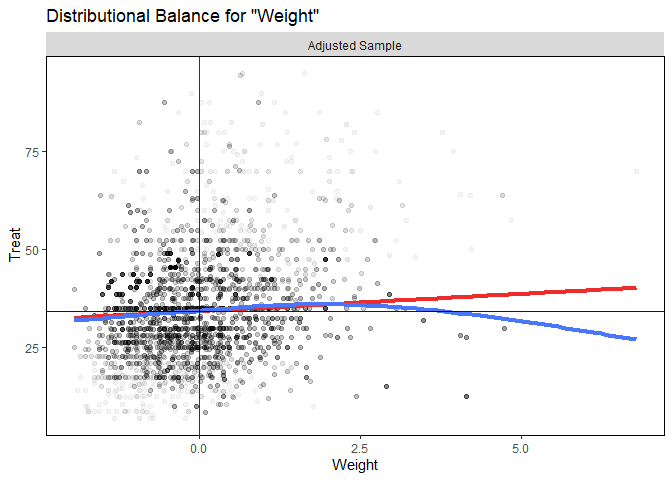<!-- -->

``` r
bal.plot(energy_weights, "Height")
```

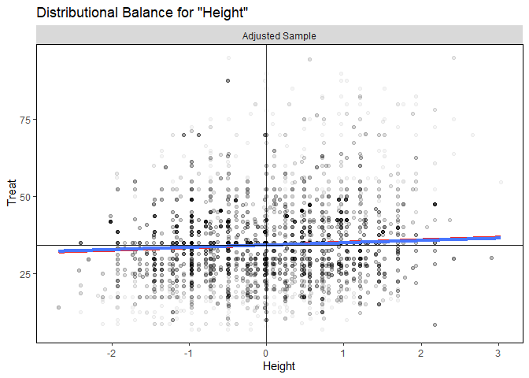<!-- -->

``` r
bal.plot(energy_weights, "Age")
```

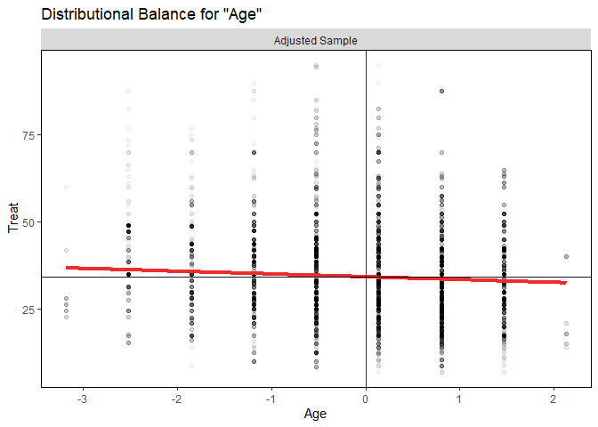<!-- -->

``` r
p1 <- bal.plot(energy_weights, "Enzyme")
p2 <- bal.plot(energy_weights, "Amiodarone")
p3 <- bal.plot(energy_weights, "Gender")
p4 <- bal.plot(energy_weights, "Black")

(p1 + p2 + p3 + p4 ) + plot_layout(ncol = 2)
```

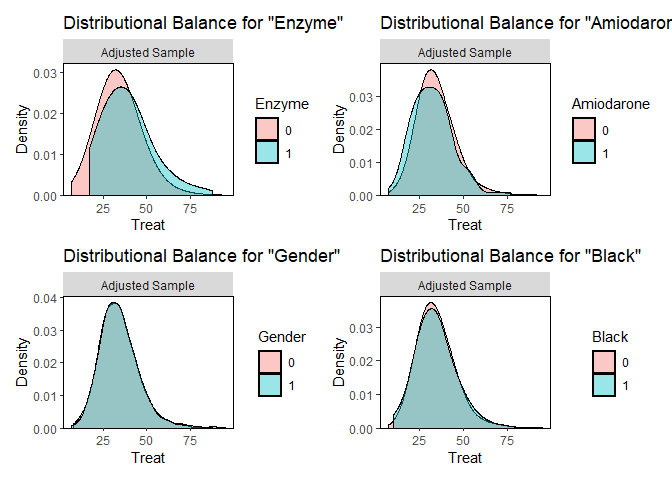<!-- -->

``` r
p1 <- bal.plot(energy_weights, "Asian")
p2 <- bal.plot(energy_weights, "VKORC1.AG")
p3 <- bal.plot(energy_weights, "VKORC1.AA")
p4 <- bal.plot(energy_weights, "CYP2C9.12")

(p1 + p2 + p3 + p4 ) + plot_layout(ncol = 2)
```

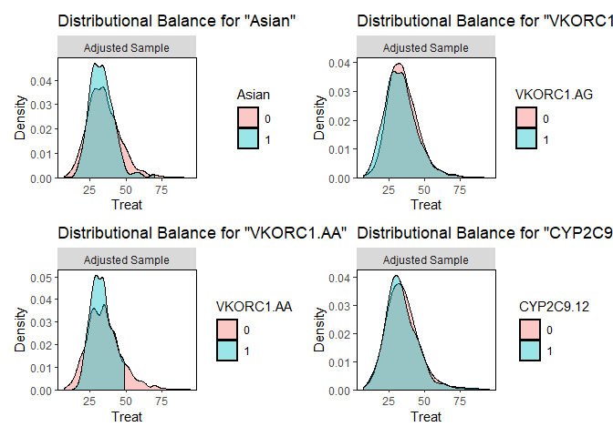<!-- -->

``` r
p1 <- bal.plot(energy_weights, "CYP2C9.13")
p2 <- bal.plot(energy_weights, "CYP2C9.other")

(p1 + p2 ) + plot_layout(ncol = 2)
```

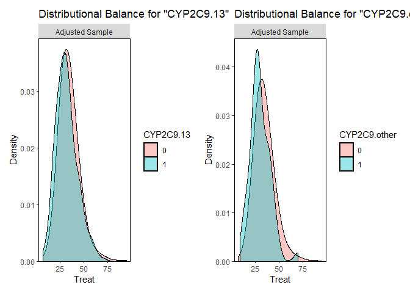<!-- -->

The unadjusted model would be as follows.

``` r
warfarin_energy_unadj <- gam(INR~ s(A, k = 25, bs = 'tp'), family = Gamma(link = 'log'), data = warfarin, weights = energy_weights$weights, method = 'REML')
draw(warfarin_energy_unadj)
```

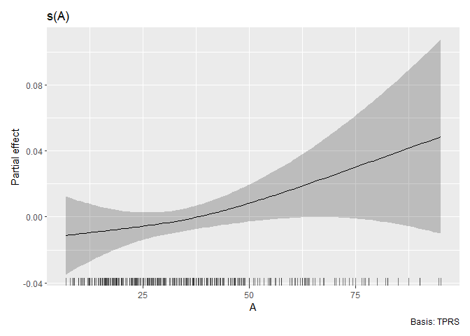<!-- -->

The trend is almost linear. Let’s fit the adjusted model with a smooth.

``` r
warfarin_energy_gam <- gam(INR~ s(A, k = 25, bs = 'tp') + Weight + Height  + Age + Enzyme + Amiodarone + Gender + Black + Asian + VKORC1.AG + VKORC1.AA + CYP2C9.12 + CYP2C9.13 + CYP2C9.other, data = warfarin, family = Gamma(link = 'log'),  weights = energy_weights$weights)
```

Let us check the fit.

``` r
appraise(warfarin_energy_gam)
```

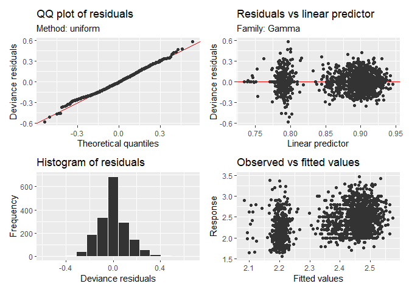<!-- -->

``` r
simulationOutput <- simulateResiduals(fittedModel = warfarin_energy_gam)
plot(simulationOutput)
```

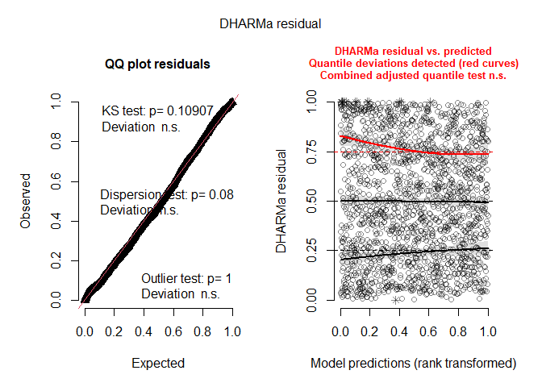<!-- -->

We see that the model fits the data quite well; this is the best of all
our models in terms of diagnostics.

``` r
cont_ate <- predictions(
  warfarin_energy_gam,
  variables = list(A = seq(min(warfarin$A), max(warfarin$A), length.out = 100)),
  by = "A"
)
```

``` r
ggplot(cont_ate, aes(x = A, y = estimate)) +
  geom_line(color = "#2c3e50", linewidth = 1) +
  geom_ribbon(aes(ymin = conf.low, ymax = conf.high), fill = "#3498db", alpha = 0.3) +
  labs(
    title = "Dose-Response Function",
    subtitle = "",
    x = "Treatment (A)",
    y = "Average Predicted Outcome (INR)"
  ) +
  theme_minimal()
```

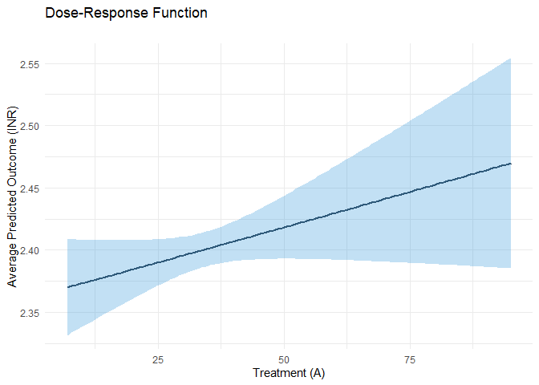<!-- -->

Overall, energy balancing performed best; we did not have to truncate
the weights, and the resulting adjusted model is well specified.
However, the results themselves were consistent across all methods.

## References

<div id="refs" class="references csl-bib-body hanging-indent">

<div id="ref-fong2018covariate" class="csl-entry">

Fong, Christian, Chad Hazlett, and Kosuke Imai. 2018. “Covariate
Balancing Propensity Score for a Continuous Treatment: Application to
the Efficacy of Political Advertisements.” *The Annals of Applied
Statistics* 12 (1): 156–77.

</div>

<div id="ref-huling2024independence" class="csl-entry">

Huling, Jared D, Noah Greifer, and Guanhua Chen. 2024. “Independence
Weights for Causal Inference with Continuous Treatments.” *Journal of
the American Statistical Association* 119 (546): 1657–70.

</div>

<div id="ref-naimi2014constructing" class="csl-entry">

Naimi, Ashley I, Erica EM Moodie, Nathalie Auger, and Jay S Kaufman.
2014. “Constructing Inverse Probability Weights for Continuous
Exposures: A Comparison of Methods.” *Epidemiology* 25 (2): 292–99.

</div>

<div id="ref-tubbicke2022entropy" class="csl-entry">

Tübbicke, Stefan. 2022. “Entropy Balancing for Continuous Treatments.”
*Journal of Econometric Methods* 11 (1): 71–89.

</div>

<div id="ref-vegetabile2021nonparametric" class="csl-entry">

Vegetabile, Brian G, Beth Ann Griffin, Donna L Coffman, Matthew Cefalu,
Michael W Robbins, and Daniel F McCaffrey. 2021. “Nonparametric
Estimation of Population Average Dose-Response Curves Using Entropy
Balancing Weights for Continuous Exposures: BG Vegetabile Et Al.”
*Health Services and Outcomes Research Methodology* 21 (1): 69–110.

</div>

</div>
