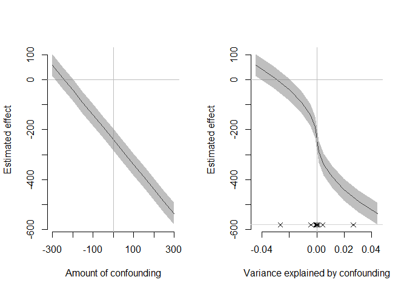
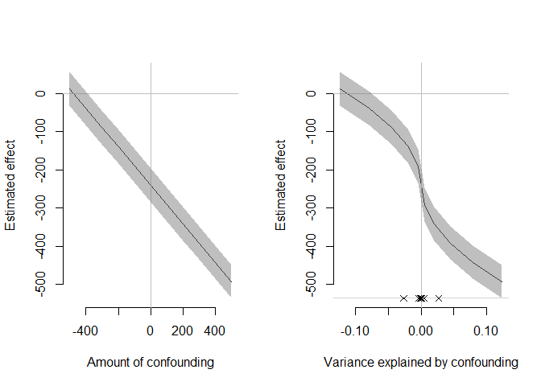
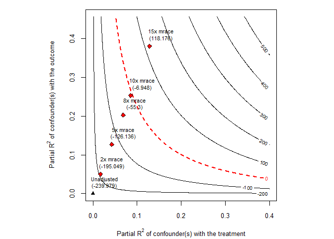
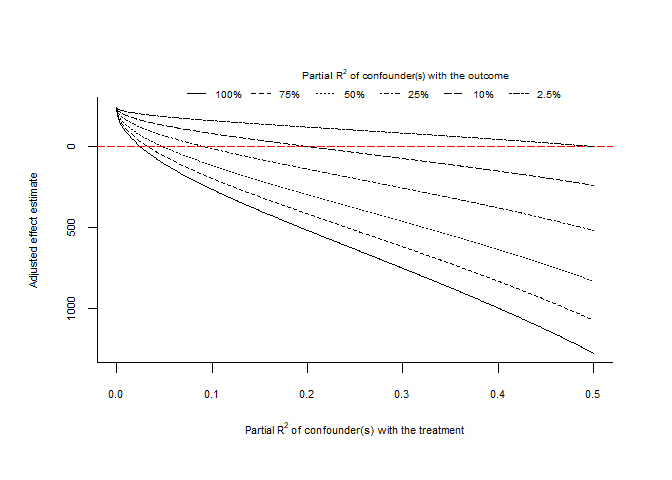
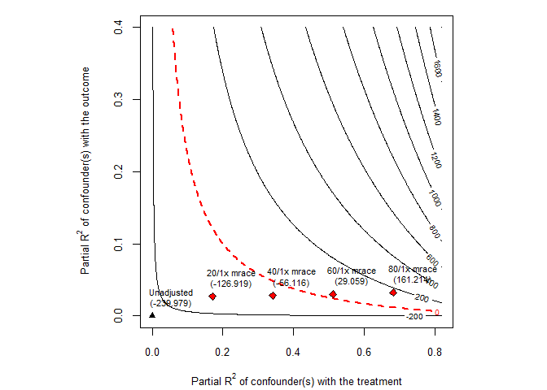
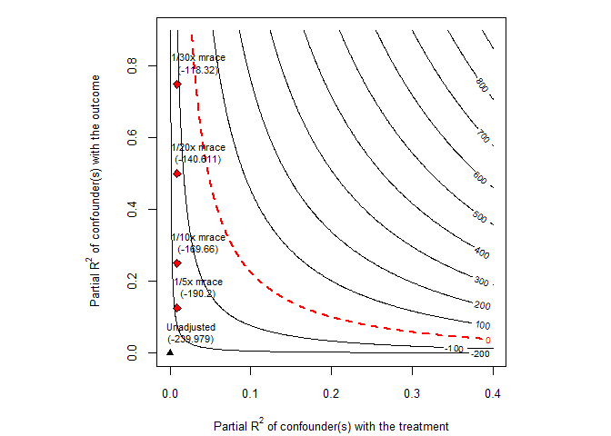
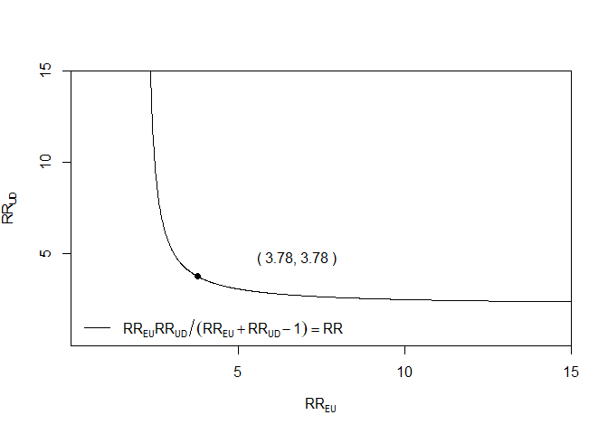
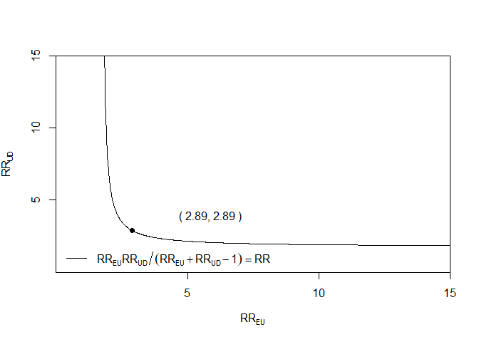

# The First Casualty of Statistics: Part Eighteen
<big>**Sensitivity Analysis I**</big>

<br/>
Jiří Fejlek

2026-09-25
<br/>

<br/> We learned quite a lot about methods for estimating the treatment effect
under observed confounding: regression, weighting, matching, and various
combinations of these approaches. However, we cannot assume that we
measured every confounder; we must acknowledge that some unmeasured
confounding could be present in the data. The methods we have discussed
so far do not help much with this problem; these confounders were not
observed after all. What we can do is investigate, via the so-called
*sensitivity analysis*, how much confounding would be required to
completely invalidate our inference, and then assess whether such a
scenario is realistic given our particular subject knowledge. <br/>


## Table of Contents

- [Package Causalsens](#package-causalsens)
- [Sensemakr Package](#sensemakr-package)
- [Evalue Package](#evalue-package)
- [Package Tipr](#package-tipr)
- [References](#references)


``` r
library(tidyr)
library(dplyr)
library(tibble)
library(ggplot2)
library(patchwork)
library(dagitty)
library(ggdag)
library(modelsummary)
library(GGally)
library(estimatr)
library(WeightIt)
library(MatchIt)
library(cobalt)
library(mgcv)
library(marginaleffects)
```

## Package Causalsens

We will start with the package *causalsens* that is based on (Blackwell
2014). The package handles only a linear regression outcome model with a
binary treatment. It also assumes a generalized linear (e.g., logistic)
propensity score model.

This sensitivity analysis is based on the potential outcome framework.
Let us assume a binary treatment $`T`$, observed covariates $`X`$, and
an outcome variable $`Y`$. The average treatment effect for the whole
population is
``` math
\text{ATE} = \mathbb{E}(Y(1) - Y(0)),
```
which we can naively estimate using the observed potential outcomes as
``` math
\widehat{\text{ATE}} =  \mathbb{E}(Y_i\mid T_i =1) - \mathbb{E}(Y_i\mid T_i = 0).
```

(Blackwell 2014) characterizes the *selection bias* caused by
non-randomized treatment assignment via the *confounding function* as
``` math
q(t,x) = \mathbb{E}(Y(t) \mid T = t, X = x) - \mathbb{E}(Y(t) \mid T = 1 - t, X = x)
```
For example, if $`q(1,x)>0`$, individuals in the treated group have a
higher mean potential outcome $`\mathbb{E} Y(1)`$ than those in the
control group, causing the treatment effect estimate to be biased (even
after adjusting for observed confounding caused by $`X`$).

If we knew $`q(t,x)`$, we could adjust our biased ATE estimate, but
since $`q(t,x)`$ is driven by an unobserved confounder, we cannot.
However, we can investigate the bias caused by various “confounding
scenarios”. Namely, (Blackwell 2014) assumes two simple parametrized
confounding functions.

The first scenario is *one-sided bias*
``` math
q(t,x; \alpha) = \alpha(2t-1).
```
Let’s get some intuition about the nature of this bias. For simplicity,
we will ignore the covariates. Then, we get
``` math
\mathbb{E}(Y(1) \mid T = 1) - \mathbb{E}(Y(1) \mid T = 0) = \alpha
```
and
``` math
\mathbb{E}(Y(0) \mid T = 1) - \mathbb{E}(Y(0) \mid T = 0) = \alpha
```
The potential outcomes for the treated group are, on average, higher
than those for the control group for $`\alpha > 0`$ and lower for
$`\alpha < 0`$. In other words, treatment was assigned to those who
would do better (or worse) regardless of the treatment.

We should note that by subtracting these two conditions, we get
``` math
\mathbb{E}(Y(1) \mid T = 1) - \mathbb{E}(Y(1) \mid T = 0) - \mathbb{E}(Y(0) \mid T = 1) + \mathbb{E}(Y(0) \mid T = 0) = \text{ATT} - \text{ATU} = 0,
```
i.e., $`\text{ATT} = \text{ATU} = \text{ATE}`$ in this scenario. Hence,
``` math
\begin{align*}
\widehat{\text{ATE}} = \mathbb{E}(Y(1) \mid T = 1) & - \mathbb{E}(Y(0) \mid T = 0)  = 
\\ &= \mathbb{E}(Y(1) \mid T = 1) - \mathbb{E}(Y(1) \mid T = 0) + \mathbb{E}(Y(1) \mid T = 0) - \mathbb{E}(Y(0) \mid T = 0) = \\ &= \alpha + \mathbb{E}(Y(1) \mid T = 0) - \mathbb{E}(Y(0) \mid T = 0) = \alpha + \text{ATU} = \alpha + \text{ATE}
\end{align*}
```
Consequently, our naive ATE estimate is biased by $`\alpha`$ in this
scenario.

If we assume covariates, we get a conditional relation
``` math
\text{CATE}(X) = \widehat{\text{CATE}(X)}  + \alpha.
```

The second is *alignment bias*
``` math
q(t,x; \alpha) = \alpha,
```
Without covariates, we get
``` math
\mathbb{E}(Y(1) \mid T = 1) - \mathbb{E}(Y(1) \mid T = 0) = \alpha
```
and
``` math
\mathbb{E}(Y(0) \mid T = 0) - \mathbb{E}(Y(0) \mid T = 1) = \alpha.
```
If $`\alpha> 0`$, the observed values of the potential outcomes are
higher than they would be if the treatment allocation was reversed. This
represents a scenario in which the treatment was assigned to those
people who would do worse without it but for whom it is most effective.
If we add both conditions, we derive
``` math
\mathbb{E}(Y(1) \mid T = 1) - \mathbb{E}(Y(1) \mid T = 0) + \mathbb{E}(Y(0) \mid T = 0) - \mathbb{E}(Y(0) \mid T = 1) = \text{ATT} - \text{ATU} = 2\alpha.
```
This means that if $`\alpha \neq 0`$, $`\text{ATT} \neq \text{ATU}`$,
i.e., the treatment effect must be heterogeneous in this scenario. This
is in line with our interpretation of the bias. Let’s assume that the
treatment assignment was balanced in the number of treated. Then
$`\text{ATE} = \frac{\text{ATT}+\text{ATU}}{2}`$. From the previous
derivation, the naive ATE estimate meets
``` math
\begin{align*}
\widehat{\text{ATE}} = \alpha + \text{ATU} = \text{ATT} - \alpha = \text{ATE},
\end{align*}
```
i.e., the ATE estimate is actually unbiased! However, in general,
``` math
\text{ATE} = (\widehat{\text{ATE}} + \alpha) \pi + (\widehat{\text{ATE}} - \alpha) (1-\pi) = \widehat{\text{ATE}} + (2\pi-1)\alpha.
```
The bias worsens with group imbalance.

If we assume covariates, we get
``` math
\text{CATE}(X) = \widehat{\text{CATE}(X)}  + (2e(X) -1)\alpha,
```
where $`e(X) = P(T = 1 \mid X)`$ is the propensity score. Thus, we need
both groups to be balanced within each stratum defined by $`X`$ to
obtain an unbiased estimate.

(Blackwell 2014) also defines *confounding-adjusted outcomes*
``` math
Y_i^q =  Y_i - q(T_i,X_i)P(1-T_i \mid X_i)
```
These are motivated by the fact that
``` math
 
\begin{align*}
\mathbb{E}Y(0) & = \mathbb{E}(Y(0) \mid T = 0)P(T=0) + \mathbb{E}(Y(0) \mid T = 1)P(T=1) =\\
               & =\mathbb{E}(Y(0) \mid  T = 0) - \mathbb{E}(Y(0) \mid T = 0)P(T=1) + \mathbb{E}(Y(0) \mid T = 1)P(T=1) = \\
               & = \mathbb{E}(Y(0) \mid  T = 0) - q(0)P(T=1) = \mathbb{E} (Y^q \mid T = 0)
\end{align*}
```

Hence, we can assume a specific confounding function and compute
confounder-adjusted outcomes to estimate the unbiased treatment effect.
Notice that we need the propensity score model to estimate
$`P(T \mid X)`$.

The presented approach measures the impact of bias in terms of potential
outcomes, which might be hard to interpret. Hence, (Blackwell 2014)
reparametrizes the bias in terms of *partial* $`R^2`$ values. First, we
define the proportion of potential outcome variance due to $`X`$ and
$`T`$ under $`q`$
``` math
R^2_q (X,T) = 1 - \frac{\text{Var}(Y(0) \mid  X, T,q)}{\text{Var }Y(0)}
```
and the proportion of potential outcome variance due to $`X`$ under
$`q`$
``` math
R^2_q (X,T) = 1 - \frac{\text{Var}(Y(0) \mid  X,q)}{\text{Var }Y(0)}
```
The amount of the unexplained variance in the potential outcomes that is
due to the selection then is (Blackwell 2014)
``` math
R^2_q (T) = \frac{R^2_q(X,T)- R^2_q(X)}{1-R^2_q(X)} = 1 - \frac{\text{Var}(Y(0) \mid  X, T,q)}{\text{Var}(Y(0) \mid  X,q)} 
```
Let’s assume the one-sided bias scenario. Thus, assuming the outcome is
linear, we get that
``` math
Y(0) = X\beta + \alpha T + \varepsilon.
```
If there is no confounding, $`\alpha`$ must be zero. If there is
confounding, then $`Y(0) = X\beta + \varepsilon',`$ where
$`\varepsilon'_i = \varepsilon_i + T_i\alpha`$. We can substitute these
two linear models into the formula for $`R^2_q (T)`$ (Blackwell 2014).
``` math
R^2_q (T) = 1 - \frac{\text{Var } \varepsilon}{\text{Var }\varepsilon'} = \frac{\text{Var }\varepsilon' - \text{Var } \varepsilon}{\text{Var }\varepsilon'} = \frac{\alpha^2 \text{Var } T}{\text{Var }\varepsilon'}
```

Let’s demonstrate how these results can be used in practice. We will
assume the Cattaneo2 dataset
(<https://www.stata-press.com/data/r14/te.html>), which we used in *The
First Casualty of Statistics: Part Nine*.

``` r
cattaneo2 <- read.csv("C:/Users/elini/Desktop/first casualty/cattaneo2.csv")
cattaneo2 <- cattaneo2[,-c(4,10,11,12,14,15,18,19,20,21)]
cattaneo2 <- data.frame(cattaneo2)
cattaneo2[1:10,]
```

    ##    bweight mmarried mhisp foreign alcohol deadkids mage medu monthslb mbsmoke mrace fbaby prenatal1
    ## 1     3459        1     0       0       0        0   24   14       30       0     1     0         1
    ## 2     3260        0     0       1       0        0   20   10       42       0     0     0         1
    ## 3     3572        1     0       1       0        0   22    9       17       0     1     0         1
    ## 4     2948        1     0       0       0        0   26   12       34       0     1     0         1
    ## 5     2410        1     0       0       0        0   20   12        0       0     1     1         1
    ## 6     3147        0     0       0       0        0   27   12        0       0     1     1         1
    ## 7     3799        1     0       0       0        0   27   12       29       0     1     0         1
    ## 8     3629        1     0       0       0        0   24   12        0       0     1     1         1
    ## 9     2835        1     0       0       0        0   21   12        0       0     1     1         1
    ## 10    3880        1     0       0       0        0   30   15       27       0     1     0         1 

The goal of the study was to assess the causal effects of maternal
smoking **mbsmoke** on infant birth weight **bweight**. In Part Nine, we
demonstrated that a simple linear regression adjustment yielded ATE
estimates similar to those of several doubly robust IPW-based
estimators.

``` r
lm_cattaneo2 <- lm(bweight ~ mbsmoke + mmarried + mhisp + foreign + alcohol + deadkids + mage + medu + monthslb + mrace + fbaby + prenatal1, data = cattaneo2)
summary(lm_cattaneo2)
```

    ## 
    ## Call:
    ## lm(formula = bweight ~ mbsmoke + mmarried + mhisp + foreign + 
    ##     alcohol + deadkids + mage + medu + monthslb + mrace + fbaby + 
    ##     prenatal1, data = cattaneo2)
    ## 
    ## Residuals:
    ##      Min       1Q   Median       3Q      Max 
    ## -3094.34  -305.01    23.57   343.72  1959.09 
    ## 
    ## Coefficients:
    ##               Estimate Std. Error t value Pr(>|t|)    
    ## (Intercept) 3068.96715   55.59070  55.206  < 2e-16 ***
    ## mbsmoke     -239.97947   22.27584 -10.773  < 2e-16 ***
    ## mmarried      62.08376   22.91101   2.710 0.006758 ** 
    ## mhisp        -40.79297   50.18910  -0.813 0.416383    
    ## foreign        0.18802   40.05846   0.005 0.996255    
    ## alcohol      -22.50304   47.10621  -0.478 0.632880    
    ## deadkids     -17.96668   19.11364  -0.940 0.347270    
    ## mage           0.67471    1.92447   0.351 0.725909    
    ## medu           5.62061    3.77256   1.490 0.136327    
    ## monthslb      -0.01902    0.33427  -0.057 0.954628    
    ## mrace        273.10199   25.45262  10.730  < 2e-16 ***
    ## fbaby        -75.32239   21.50142  -3.503 0.000464 ***
    ## prenatal1     19.16738   22.40452   0.856 0.392311    
    ## ---
    ## Signif. codes:  0 '***' 0.001 '**' 0.01 '*' 0.05 '.' 0.1 ' ' 1
    ## 
    ## Residual standard error: 555 on 4629 degrees of freedom
    ## Multiple R-squared:  0.0829, Adjusted R-squared:  0.08052 
    ## F-statistic: 34.87 on 12 and 4629 DF,  p-value: < 2.2e-16

``` r
avg_comparisons(lm_cattaneo2, variables = "mbsmoke")
```

    ## 
    ##  Estimate Std. Error     z Pr(>|z|)    S 2.5 % 97.5 %
    ##      -240       22.3 -10.8   <0.001 87.5  -284   -196
    ## 
    ## Term: mbsmoke
    ## Type: response
    ## Comparison: 1 - 0

Maternal smoking causes lower infant birth weight. Let’s see how this
result is robust to unobserved confounding, using the methodology from
(Blackwell 2014). We need to fit the propensity score model first.

``` r
prop_scores_cattaneo2 <- glm(mbsmoke ~ mmarried + mhisp + foreign + alcohol + deadkids + mage + medu + monthslb + mrace + fbaby + prenatal1, family = binomial, data = cattaneo2)
```

Then, we use *causalsens* to plot the effect of confounding. First, we
will assume a one-sided bias (the potential outcomes of the treatment
group are, on average, larger/smaller than those of the control group
due to an unobserved confounder).

``` r
library(causalsens)
alpha <- seq(-300, 300, by = 50)
ll.sens <- causalsens(lm_cattaneo2, prop_scores_cattaneo2, ~ mmarried + mhisp + foreign + alcohol + deadkids + mage + medu + monthslb + mrace + fbaby + prenatal1, data = cattaneo2, alpha = alpha,  confound = one.sided)
```

``` r
par(mfrow=c(1,2))
plot(ll.sens, type = "raw", bty = "n")
plot(ll.sens, type = "r.squared", bty = "n")
```

<!-- -->

The first plot shows the effect of confounding on potential outcomes. If
the effect of confounding is lower than about -250, the estimate of the
treatment effect (the effect of smoking) changes sign. This makes
perfect sense. We estimated the average treatment effect of -240 by
comparing the (covariate-adjusted) means of the treated and untreated
groups. If there is a difference of -250 between the treated and
untreated groups attributable to an unobserved confounder, then that
confounder fully explains the difference we identified as the treatment
effect.

The second shows the effect of the confounder on the partial $`R^2`$
(the amount of variance in the outcome explained by the confounder). We
see that under the one-sided bias scenario, the confounder must explain
the same amount of variance as **mrace**, which is the strongest
predictor of the outcome in the model (the partial $`R^2`$ of observed
covariates is denoted by crosses).

To sum up, one scenario that nullifies the treatment effect is, for
example, a binary confounder that is 1 for the treated group and 0 for
the control group, with an effect of about -250, which corresponds to
the partial $`R^2`$ for the outcome variable similar to **mrace**.

We can get the precise numbers as follows.

``` r
ll.sens
```

    ## $sens
    ##           rsqs alpha    estimate      lower       upper       se
    ## 1  0.044399364  -300   58.315808   14.63982  101.991799 22.27825
    ## 2  0.030833537  -250    8.599929  -35.07421   52.274063 22.27730
    ## 3  0.019733532  -200  -41.115950  -84.78866    2.556755 22.27658
    ## 4  0.011099957  -150  -90.831830 -134.50353  -47.160126 22.27606
    ## 5  0.004933160  -100 -140.547709 -184.21884  -96.876580 22.27577
    ## 6  0.001233230   -50 -190.263588 -233.93457 -146.592606 22.27570
    ## 7  0.000000000     0 -239.979468 -283.65073 -196.308204 22.27584
    ## 8  0.001233045    50 -289.695347 -333.36732 -246.023375 22.27620
    ## 9  0.004931682   100 -339.411226 -383.08433 -295.738118 22.27678
    ## 10 0.011094970   150 -389.127106 -432.80178 -345.452434 22.27758
    ## 11 0.019721712   200 -438.842985 -482.51965 -395.166322 22.27859
    ## 12 0.030810454   250 -488.558864 -532.23795 -444.879783 22.27983
    ## 13 0.044359485   300 -538.274744 -581.95667 -494.592817 22.28128
    ## 
    ## $partial.r2
    ##      mbsmoke     mmarried        mhisp      foreign      alcohol     deadkids 
    ## 0.000000e+00 1.147918e-03 2.072250e-04 1.296676e-05 1.019979e-05 1.754986e-04 
    ##         mage         medu     monthslb        mrace        fbaby    prenatal1 
    ## 2.747083e-04 2.952520e-04 2.125039e-05 2.658265e-02 4.269796e-03 3.677188e-04 
    ## 
    ## attr(,"class")
    ## [1] "causalsens"

We need a relatively weak confounder to estimate the causal treatment
effect to zero. However, we must remember that in the one-sided bias
scenario, the confounder’s effect on treatment assignment is extremely
strong, making its existence much less plausible. We will explore this
in more detail when we discuss the package *sensemakr*.

We can also consider the alignment bias scenario.

``` r
alpha <- seq(-500, 500, by = 100)
ll.sens <- causalsens(lm_cattaneo2, prop_scores_cattaneo2, ~ mmarried + mhisp + foreign + alcohol + deadkids + mage + medu + monthslb + mrace + fbaby + prenatal1, data = cattaneo2, alpha = alpha,  confound = alignment)
ll.sens
```

    ## $sens
    ##           rsqs alpha   estimate      lower       upper       se
    ## 1  0.123115345  -500   11.74589  -32.19606   55.687849 22.41392
    ## 2  0.078830293  -400  -38.59918  -82.45049    5.252128 22.36768
    ## 3  0.044359485  -300  -88.94425 -132.72309  -45.165417 22.33071
    ## 4  0.019721712  -200 -139.28932 -183.01395  -95.564695 22.30306
    ## 5  0.004931682  -100 -189.63440 -233.32315 -145.945639 22.28476
    ## 6  0.000000000     0 -239.97947 -283.65073 -196.308204 22.27584
    ## 7  0.004933160   100 -290.32454 -333.99671 -246.652367 22.27630
    ## 8  0.019733532   200 -340.66961 -384.36109 -296.978130 22.28615
    ## 9  0.044399364   300 -391.01468 -434.74385 -347.285516 22.30538
    ## 10 0.078924774   400 -441.35976 -485.14494 -397.574574 22.33395
    ## 11 0.123299763   500 -491.70483 -535.56428 -447.845374 22.37183
    ## 
    ## $partial.r2
    ##      mbsmoke     mmarried        mhisp      foreign      alcohol     deadkids 
    ## 0.000000e+00 1.147918e-03 2.072250e-04 1.296676e-05 1.019979e-05 1.754986e-04 
    ##         mage         medu     monthslb        mrace        fbaby    prenatal1 
    ## 2.747083e-04 2.952520e-04 2.125039e-05 2.658265e-02 4.269796e-03 3.677188e-04 
    ## 
    ## attr(,"class")
    ## [1] "causalsens"

``` r
par(mfrow=c(1,2))
plot(ll.sens, type = "raw", bty = "n")
plot(ll.sens, type = "r.squared", bty = "n")
```

<!-- -->

We see that we need a much stronger confounder in the alignment-bias
scenario. It would need to explain about five times more of the variance
in outcome than our strongest observed covariate. Intuitively, the
confounder indeed must be stronger since we derived (if we ignore
covariates) that $`\text{ATE} = \widehat{\text{ATE}} + (2\pi-1)\alpha`$
and

``` r
(2*mean(cattaneo2$mbsmoke)-1)
```

    ## [1] -0.6277467

i.e., the bias $`\alpha`$ should be, very roughly speaking, about 1.5x
the observed treatment effect to make it appear zero.

## Sensemakr Package

The main disadvantage of the sensitivity analysis using *causalsens* is
that it relies on very specific confounding bias scenarios characterized
in terms of potential outcomes. The package *sensemakr* alleviates this
by accounting for confounding via *omitted variable bias* (Cinelli and
Hazlett 2020).

We will still assume a linear outcome model with a binary treatment
$`T`$. The true model with an unobserved confounder $`Z`$ is assumed to
be
``` math
Y = \tau T + X\beta + Z\gamma + \varepsilon.
```

However, we actually fit the model based on observed variables
``` math
Y = \tau’T + X\beta’ + \varepsilon’.
```
The coefficient $`\tau’`$ meets (Cinelli and Hazlett 2020)
``` math
\tau’ = \frac{\text{cov}(T^{\perp X}, Y^{\perp X})}{\text{Var } T^{\perp X}} = \frac{\text{cov}(T^{\perp X}, \tau T^{\perp X} + \gamma Z^{\perp X})}{\text{Var } T^{\perp X}} = \tau + \gamma \frac{\text{cov} (T^{\perp X}, Z^{\perp X})}{\text{Var } T^{\perp X}} = \tau + \gamma\delta,
```
where $`T^{\perp X}`$, $`Y^{\perp X}`$, $`Z^{\perp X}`$ are variables
$`T, Y`$ and $`Z`$ without linear part of $`X`$. Omitted variable bias
thus equals $`\gamma\delta`$.

The $`\delta`$ term corresponds to the covariate *imbalance* between the
treated and control groups, and $`\gamma`$ is the “unit” marginal (not
necessarily causal!) effect of the confounder on the outcome, referred
to as the *impact* (Cinelli and Hazlett 2020). Similar to (Blackwell
2014), (Cinelli and Hazlett 2020) consider reparametrizing in terms of
partial $`R^2`$ to make the unobserved confounder comparable to observed
covariates.

It can be shown that (Cinelli and Hazlett 2020)
``` math
\text{bias} = \gamma\delta = \text{sd}(\tau’)\sqrt{\frac{R^2_Y (Z \mid  X, T) R^2_T (Z \mid  X)}{1-R^2_T (Z \mid  X)}\text{df}}
```
where
$`R^2_Y (Z \mid  X, T) =  \text{corr} (Y^{\perp X, T}, Z^{\perp X, T})^2`$,
and $`R^2_T (Z \mid  X) =  \text{corr} (T^{\perp X}, Z^{\perp X})^2`$,
and df is the degrees of freedom of the restricted regression \$ Y =
’T + X’ + ’.\$

Let’s analyze the *cattaneo2* dataset using the *sensemakr* package,
following (Cinelli and Hazlett 2020).

``` r
library('sensemakr')
sensitivity <- sensemakr(
  model = lm_cattaneo2,
  treatment = "mbsmoke",
  benchmark_covariates = c("mrace"),
  kd = c(2, 5, 8, 10, 15),
  ky = c(2, 5, 8, 10, 15)
)
```

``` r
plot(sensitivity, type = "contour")
```

<!-- -->

The contour plot shows the omitted variable’s partial $`R^2`$ with
respect to the treatment and the outcome variable. The red points denote
a confounder, whose partial $`R^2`$ is a multiple of **mrace**, which we
used as the reference *benchmark_covariates*. The multiples are given in
terms of *kd* (treatment) and *ky* (outcome).

We can get the exact values as follows.

``` r
sensitivity <- sensemakr(
  model = lm_cattaneo2,
  treatment = "mbsmoke",
  benchmark_covariates = c("mrace"),
  kd = c(1, 2, 5, 8, 10, 15),
  ky = c(1, 2, 5, 8, 10, 15)
)
sensitivity$bounds
```

    ##   bound_label      r2dz.x    r2yz.dx treatment adjusted_estimate adjusted_se adjusted_t adjusted_lower_CI adjusted_upper_CI
    ## 1    1x mrace 0.008535079 0.02529946   mbsmoke       -217.612948    22.08910 -9.8516005        -260.91810        -174.30779
    ## 2    2x mrace 0.017070157 0.05060635   mbsmoke       -195.049334    21.89490 -8.9084379        -237.97377        -152.12490
    ## 3    5x mrace 0.042675393 0.12657334   mbsmoke       -126.136040    21.27966 -5.9275410        -167.85431         -84.41777
    ## 4    8x mrace 0.068280629 0.20261370   mbsmoke        -55.300137    20.60976 -2.6832020         -95.70508         -14.89519
    ## 5   10x mrace 0.085350787 0.25335072   mbsmoke         -6.947641    20.12853 -0.3451639         -46.40915          32.51387
    ## 6   15x mrace 0.128026180 0.38035837   mbsmoke        118.176218    18.78017  6.2926055          81.35813         154.99431

We notice that we need a strong covariate in terms of multiples (around
10) of **mrace**, which is in stark contrast to the one-sided bis from
*causalsens*, where we needed just a multiple of 1. The reason these
values are so different is that we only considered partial $`R^2`$ with
respect to the outcome in *causalsens*. The partial $`R^2`$ with respect
to the treatment was implicitly given by the confounding function, and
the effect was quite strong (an $`\alpha`$-difference in the average
between the treatment and control groups). Hence, we need a
comparatively small effect on the outcome to reverse the estimate.

The confounder’s effect on treatment that we consider here is quite
weak; hence, the effect on the outcome must be much stronger. To
illustrate this better, we will use the following plot.

``` r
sensitivity <- sensemakr(
  model = lm_cattaneo2,
  treatment = "mbsmoke",
  benchmark_covariates = c("mrace"),
  kd = c(100)
)
plot(sensitivity, type = "extreme", r2yz.dx = c(1, 0.75, 0.5, 0.25, 0.1, 0.025))
```

<!-- -->

The plot shows the strength of the confounder required to make the true
average treatment effect zero for various partial $`R^2`$ values with
the outcome. If partial $`R^2`$ with the outcome is 1 (the confounder
fully explains the remaining variance of the outcome), its confounding
with the treatment must be quite small. Now, there is minimal
confounding (about 2.5% of the treatment’s explained variance);
otherwise, the treatment is almost uncorrelated with the confounder, and
there is no confounding bias.

If we look at the other extreme, say the unobserved confounder explains
about 2.5% of the remaining variance in the outcome (which roughly
corresponds to the effect of **mrace**), its association with the
treatment must be much stronger, about 50% of the remaining variance of
the treatment assignment. This situation corresponds to our previously
computed one-sided bias. We can illustrate these extremes using the
original contour plot. If we crank up the correlation with the
treatment, the result looks like this.

``` r
sensitivity <- sensemakr(
  model = lm_cattaneo2,
  treatment = "mbsmoke",
  benchmark_covariates = c("mrace"),
  kd = c(20, 40, 60, 80),
  ky = 1
)

plot(sensitivity, type = "contour")
```

<!-- -->

``` r
sensitivity <- sensemakr(
  model = lm_cattaneo2,
  treatment = "mbsmoke",
  benchmark_covariates = c("mrace"),
  kd = seq(10,80,10),
  ky = 1
)
sensitivity$bounds
```

    ##   bound_label     r2dz.x    r2yz.dx treatment adjusted_estimate adjusted_se adjusted_t adjusted_lower_CI adjusted_upper_CI
    ## 1 10/1x mrace 0.08535079 0.02630894   mbsmoke        -164.88536    22.98605 -7.1732799        -209.94897        -119.82175
    ## 2 20/1x mrace 0.17070157 0.02703581   mbsmoke        -126.91901    24.13093 -5.2595991        -174.22713         -79.61089
    ## 3 30/1x mrace 0.25605236 0.02770464   mbsmoke         -91.98442    25.46883 -3.6116475        -141.91546         -42.05339
    ## 4 40/1x mrace 0.34140315 0.02839134   mbsmoke         -56.11636    27.05932 -2.0738275        -109.16553          -3.06720
    ## 5 50/1x mrace 0.42675393 0.02914530   mbsmoke         -16.73527    28.99263 -0.5772249         -73.57464          40.10410
    ## 6 60/1x mrace 0.51210472 0.03002203   mbsmoke          29.05865    31.41222  0.9250748         -32.52427          90.64158
    ## 7 70/1x mrace 0.59745551 0.03110578   mbsmoke          85.66526    34.56307  2.4785204          17.90518         153.42534
    ## 8 80/1x mrace 0.68280629 0.03255218   mbsmoke         161.21430    38.90743  4.1435355          84.93721         237.49140

On the other hand, increasing the correlation with the outcome causes
the following.

``` r
sensitivity <- sensemakr(
  model = lm_cattaneo2,
  treatment = "mbsmoke",
  benchmark_covariates = c("mrace"),
  kd = 1,
  ky = c(5, 10, 20, 30)
)
plot(sensitivity, type = "contour")
```

<!-- -->

``` r
sensitivity <- sensemakr(
  model = lm_cattaneo2,
  treatment = "mbsmoke",
  benchmark_covariates = c("mrace"),
  kd = 1,
  ky = c(5, 10, 20, 30, 50)
)
sensitivity$bounds
```

    ##   bound_label      r2dz.x   r2yz.dx treatment adjusted_estimate adjusted_se adjusted_t adjusted_lower_CI adjusted_upper_CI
    ## 1  1/5x mrace 0.008535079 0.1253165   mbsmoke        -190.20038    20.92511  -9.089575        -231.22357        -149.17718
    ## 2 1/10x mrace 0.008535079 0.2500751   mbsmoke        -169.65961    19.37542  -8.756433        -207.64467        -131.67454
    ## 3 1/20x mrace 0.008535079 0.4993619   mbsmoke        -140.61057    15.83085  -8.882059        -171.64659        -109.57456
    ## 4 1/30x mrace 0.008535079 0.7485193   mbsmoke        -118.32046    11.22005 -10.545451        -140.31710         -96.32382
    ## 5 1/50x mrace 0.008535079 1.0000000   mbsmoke         -99.36087     0.00000       -Inf         -99.36087         -99.36087

We see that the **mrace** association with the treatment is too weak to
tip the estimate, even if it explains the rest of the variance in the
outcome. We need to increase it about 3 times to tip the outcome.

``` r
sensitivity <- sensemakr(
  model = lm_cattaneo2,
  treatment = "mbsmoke",
  benchmark_covariates = c("mrace"),
  kd = 3,
  ky = c(5, 10, 20, 30, 50)
)
sensitivity$bounds
```

    ##   bound_label     r2dz.x   r2yz.dx treatment adjusted_estimate adjusted_se adjusted_t adjusted_lower_CI adjusted_upper_CI
    ## 1  3/5x mrace 0.02560524 0.1260483   mbsmoke       -152.754031    21.09878  -7.239948       -194.117687       -111.390376
    ## 2 3/10x mrace 0.02560524 0.2511194   mbsmoke       -116.863406    19.53079  -5.983547       -155.153065        -78.573746
    ## 3 3/20x mrace 0.02560524 0.5008589   mbsmoke        -66.106396    15.94502  -4.145895        -97.366243        -34.846549
    ## 4 3/30x mrace 0.02560524 0.7503724   mbsmoke        -27.159173    11.27612  -2.408556        -49.265749         -5.052597
    ## 5 3/50x mrace 0.02560524 1.0000000   mbsmoke          5.703251     0.00000        Inf          5.703251          5.703251

The package also provides a nice summary of the results.

``` r
sensitivity <- sensemakr(
  model = lm_cattaneo2,
  treatment = "mbsmoke",
  benchmark_covariates = c("mrace"),
  kd = c(1, 2, 5, 8, 10, 15),
  ky = c(1, 2, 5, 8, 10, 15)
)
summary(sensitivity)
```

    ## Sensitivity Analysis to Unobserved Confounding
    ## 
    ## Model Formula: bweight ~ mbsmoke + mmarried + mhisp + foreign + alcohol + deadkids + 
    ##     mage + medu + monthslb + mrace + fbaby + prenatal1
    ## 
    ## Null hypothesis: q = 1 and reduce = TRUE 
    ## -- This means we are considering biases that reduce the absolute value of the current estimate.
    ## -- The null hypothesis deemed problematic is H0:tau = 0 
    ## 
    ## Unadjusted Estimates of 'mbsmoke': 
    ##   Coef. estimate: -239.9795 
    ##   Standard Error: 22.2758 
    ##   t-value (H0:tau = 0): -10.7731 
    ## 
    ## Sensitivity Statistics:
    ##   Partial R2 of treatment with outcome: 0.0245 
    ##   Robustness Value, q = 1: 0.1463 
    ##   Robustness Value, q = 1, alpha = 0.05: 0.1214 
    ## 
    ## Verbal interpretation of sensitivity statistics:
    ## 
    ## -- Partial R2 of the treatment with the outcome: an extreme confounder (orthogonal to the covariates) that explains 100% of the residual variance of the outcome, would need to explain at least 2.45% of the residual variance of the treatment to fully account for the observed estimated effect.
    ## 
    ## -- Robustness Value, q = 1: unobserved confounders (orthogonal to the covariates) that explain more than 14.63% of the residual variance of both the treatment and the outcome are strong enough to bring the point estimate to 0 (a bias of 100% of the original estimate). Conversely, unobserved confounders that do not explain more than 14.63% of the residual variance of both the treatment and the outcome are not strong enough to bring the point estimate to 0.
    ## 
    ## -- Robustness Value, q = 1, alpha = 0.05: unobserved confounders (orthogonal to the covariates) that explain more than 12.14% of the residual variance of both the treatment and the outcome are strong enough to bring the estimate to a range where it is no longer 'statistically different' from 0 (a bias of 100% of the original estimate), at the significance level of alpha = 0.05. Conversely, unobserved confounders that do not explain more than 12.14% of the residual variance of both the treatment and the outcome are not strong enough to bring the estimate to a range where it is no longer 'statistically different' from 0, at the significance level of alpha = 0.05.
    ## 
    ## Bounds on omitted variable bias:
    ## 
    ## --The table below shows the maximum strength of unobserved confounders with association with the treatment and the outcome bounded by a multiple of the observed explanatory power of the chosen benchmark covariate(s).
    ## 
    ##  Bound Label R2dz.x R2yz.dx Treatment Adjusted Estimate Adjusted Se Adjusted T Adjusted Lower CI Adjusted Upper CI
    ##     1x mrace 0.0085  0.0253   mbsmoke         -217.6129     22.0891    -9.8516         -260.9181         -174.3078
    ##     2x mrace 0.0171  0.0506   mbsmoke         -195.0493     21.8949    -8.9084         -237.9738         -152.1249
    ##     5x mrace 0.0427  0.1266   mbsmoke         -126.1360     21.2797    -5.9275         -167.8543          -84.4178
    ##     8x mrace 0.0683  0.2026   mbsmoke          -55.3001     20.6098    -2.6832          -95.7051          -14.8952
    ##    10x mrace 0.0854  0.2534   mbsmoke           -6.9476     20.1285    -0.3452          -46.4092           32.5139
    ##    15x mrace 0.1280  0.3804   mbsmoke          118.1762     18.7802     6.2926           81.3581          154.9943

*Robustness value* refers to the tip point at which the partial $`R^2`$
with respect to the outcome equals the partial $`R^2`$ with respect to
the treatment.

## Evalue Package

The package *Evalue* is quite analogous to *sensemakr*, but it assesses
the strength of confounding using risk ratios rather than partial
$`R^2`$. This makes it much more suitable for dealing with binary
outcomes.

Let’s assume the *MineThatData E-Mail Analytics And Data Mining
Challenge* dataset, which we used in *The First Casualty of Statistics:
Part Fifteen* and *Part Sixteen*. The data described a randomized
experiment to determine the effect of email promotions.

``` r
MailAnalytics_orig <- read.csv("E-MailAnalytics_Data.csv")
MailAnalytics <- MailAnalytics_orig[c(-2)]
MailAnalytics$mens <- factor(MailAnalytics$mens)
MailAnalytics$womens <- factor(MailAnalytics$womens)
MailAnalytics$newbie <- factor(MailAnalytics$newbie)
MailAnalytics$zip_code <- factor(MailAnalytics$zip_code)
MailAnalytics$channel <- factor(MailAnalytics$channel)
MailAnalytics <- MailAnalytics[MailAnalytics$segment != 'Womens E-Mail',]
MailAnalytics$segment <- factor(MailAnalytics$segment)
MailAnalytics$segment <- relevel(MailAnalytics$segment, ref = "No E-Mail")

MailAnalytics[1:10,]
```

    ##    recency history mens womens  zip_code newbie      channel     segment visit conversion spend
    ## 2        6  329.08    1      1     Rural      1          Web   No E-Mail     0          0     0
    ## 4        9  675.83    1      0     Rural      1          Web Mens E-Mail     0          0     0
    ## 9        9  675.07    1      1     Rural      1        Phone Mens E-Mail     0          0     0
    ## 14       2  101.64    0      1     Urban      0          Web Mens E-Mail     1          0     0
    ## 15       4  241.42    0      1     Rural      1 Multichannel   No E-Mail     0          0     0
    ## 16       3   58.13    1      0     Urban      1          Web   No E-Mail     1          0     0
    ## 17       5   29.99    1      0 Surburban      0        Phone Mens E-Mail     0          0     0
    ## 18       9  112.35    1      0     Rural      0          Web Mens E-Mail     0          0     0
    ## 19      11  219.04    1      1 Surburban      0        Phone Mens E-Mail     0          0     0
    ## 20       5  828.42    1      0 Surburban      1 Multichannel Mens E-Mail     0          0     0

Here, we will focus on the effect of the **segment** (namely, *Men’s
E-Mail* vs *No E-Mail*) on **conversion** (whether the individual
actually bought some product). First, we notice that the prevalence of
buyers is very low.

``` r
mean(MailAnalytics$conversion)
```

    ## [1] 0.00912867

This means we can approximate risk ratios using odds ratios. Hence, to
estimate the treatment effect, we can fit a logistic regression model
and extract the coefficient.

``` r
logist_MailAnalytics <- glm(conversion ~ recency + history + mens + womens + zip_code + newbie + channel + segment, family = binomial, data = MailAnalytics)
summary(logist_MailAnalytics)
```

    ## 
    ## Call:
    ## glm(formula = conversion ~ recency + history + mens + womens + 
    ##     zip_code + newbie + channel + segment, family = binomial, 
    ##     data = MailAnalytics)
    ## 
    ## Coefficients:
    ##                      Estimate Std. Error z value Pr(>|z|)    
    ## (Intercept)        -5.1705988  0.2776865 -18.620  < 2e-16 ***
    ## recency            -0.0637746  0.0156909  -4.064 4.81e-05 ***
    ## history             0.0008195  0.0001860   4.406 1.05e-05 ***
    ## mens1               0.5084996  0.1543614   3.294 0.000987 ***
    ## womens1             0.4478210  0.1531593   2.924 0.003457 ** 
    ## zip_codeSurburban  -0.2189365  0.1435676  -1.525 0.127266    
    ## zip_codeUrban      -0.2026381  0.1453914  -1.394 0.163395    
    ## newbie1            -0.5925565  0.1125386  -5.265 1.40e-07 ***
    ## channelPhone       -0.0489475  0.1613101  -0.303 0.761557    
    ## channelWeb          0.0963760  0.1583510   0.609 0.542775    
    ## segmentMens E-Mail  0.7873432  0.1098383   7.168 7.60e-13 ***
    ## ---
    ## Signif. codes:  0 '***' 0.001 '**' 0.01 '*' 0.05 '.' 0.1 ' ' 1
    ## 
    ## (Dispersion parameter for binomial family taken to be 1)
    ## 
    ##     Null deviance: 4428.2  on 42612  degrees of freedom
    ## Residual deviance: 4281.1  on 42602  degrees of freedom
    ## AIC: 4303.1
    ## 
    ## Number of Fisher Scoring iterations: 8

Odds ratios are as follows.

``` r
coefs <- exp(coefficients(logist_MailAnalytics))
coefs
```

    ##        (Intercept)            recency            history              mens1 
    ##        0.005681166        0.938216437        1.000819842        1.662794473 
    ##            womens1  zip_codeSurburban      zip_codeUrban            newbie1 
    ##        1.564898530        0.803372703        0.816573669        0.552911959 
    ##       channelPhone         channelWeb segmentMens E-Mail 
    ##        0.952231117        1.101172973        2.197550238

We will also need confidence intervals.

``` r
cis <- exp(confint(logist_MailAnalytics))
cis
```

    ##                          2.5 %      97.5 %
    ## (Intercept)        0.003282263 0.009753428
    ## recency            0.909576031 0.967312909
    ## history            1.000441545 1.001172185
    ## mens1              1.223378747 2.242323023
    ## womens1            1.153805841 2.104826797
    ## zip_codeSurburban  0.609225382 1.070530453
    ## zip_codeUrban      0.616815980 1.091674584
    ## newbie1            0.442468187 0.688059762
    ## channelPhone       0.697379902 1.313815850
    ## channelWeb         0.811622044 1.511342194
    ## segmentMens E-Mail 1.776561544 2.733720347

Let’s compare the results with *avg_comparisons*.

``` r
est <- avg_comparisons(logist_MailAnalytics, variables = "segment", comparison = "ratio")
est$estimate
```

    ## [1] 2.17848

``` r
est
```

    ## 
    ##  Estimate Std. Error   z Pr(>|z|)    S 2.5 % 97.5 %
    ##      2.18      0.237 9.2   <0.001 64.5  1.71   2.64
    ## 
    ## Term: segment
    ## Type: response
    ## Comparison: mean(Mens E-Mail) / mean(No E-Mail)

We see that the odds ratio is indeed close to risk ratios. We see that
the confidence intervals differ slightly because *avg_comparisons* uses
the delta method, whereas *confint* uses profile likelihood. Let us
compare the results with a bootstrap.

``` r
set.seed(123)
n_sim <- 1000

estimates_RR <- numeric(n_sim)
estimate_RR <- est$estimate

for (i in 1:n_sim){
  
  MailAnalytics_new <-  MailAnalytics[sample(nrow(MailAnalytics) , rep=TRUE),]
  
  data2_0 <- MailAnalytics_new
  data2_1 <- MailAnalytics_new
  data2_0$segment <- 'No E-Mail'
  data2_1$segment <- 'Mens E-Mail'
  
  logist_MailAnalytics_new <- glm(conversion ~ recency + history + mens + womens + zip_code + newbie + channel + segment, family = binomial, data = MailAnalytics_new)

  y1_pred_logist <- predict(logist_MailAnalytics_new, data2_1, type = 'response')
  y0_pred_logist <- predict(logist_MailAnalytics_new, data2_0, type = 'response')
  estimates_RR[i] <-  mean(y1_pred_logist)/mean(y0_pred_logist)
}

quantile(estimates_RR, c(0.025, 0.975))
```

    ##     2.5%    97.5% 
    ## 1.786765 2.757332

Now, we avoided it in the past, but let’s, for once, compute the
bias-corrected and accelerated (BCa) bootstrap (DiCiccio and Efron 1996)
to obtain a more accurate estimate and finally show how it is done.
First, we will need jackknife estimates of the risk ratio, i.e.,
estimates obtained by dropping individual observations.

Since we do not want to refit the model over forty thousand times, we
will use the fact that for generalized linear models (Williams 1987)
``` math
\hat \beta_{[-i]} \approx \hat \beta - w_i^{1/2}(1-h_i)^{-1/2}r_{\text{std. Pearson}, i} (X^TWX)^{-1}X_i,
```
where
``` math
r_\text{std. Pearson} = \frac{r_\text{Pearson}}{\sqrt{1-h_i}},
```
and where $`X`$ is the model matrix, $`X_i`$ is the vector of predictors
for the $`i`$th observation, $`w`$ are iterated reweighted least squares
weights, and $`h`$ are the diagonal elements of the hat matrix.

For logistic regression, the Pearson residuals are
``` math
r_{\text{Pearson},i} = (y_i-\hat p_i)/\sqrt{ p_i (1-\hat p_i)}
```
and iterated reweighed least squares weights are
``` math
w_i = \hat p_i (1-\hat p_i)
```
Hence, the formula simplifies to
``` math
\hat \beta_{[-i]} \approx \hat \beta - \frac{y_i-\hat p_i}{1-h_i} (X^TWX)^{-1}X_i 
```

``` r
predict_prob <- predict(logist_MailAnalytics, type = "response")
w <- logist_MailAnalytics$weights                                    # IRLS weights
h <- hatvalues(logist_MailAnalytics)                                 # diagonal hat matrix values
design_matrix <- model.matrix(logist_MailAnalytics)                  # design matrix
raw_resid <- MailAnalytics$conversion - predict_prob                 # raw residuals
XWX_matrix <-  solve(t(design_matrix) %*% (w * design_matrix))       # (X^TWX)^(-1)

design_matrix_0 <- design_matrix
design_matrix_1 <- design_matrix
design_matrix_0[,11] <- 0
design_matrix_1[,11] <- 1

RR_jack <- numeric(dim(MailAnalytics)[1])

for (i in 1:dim(MailAnalytics)[1]){
  betas_jack <- coefficients(logist_MailAnalytics) - (raw_resid[i]/(1-h[i]))* XWX_matrix %*%  design_matrix[i,]
  RR_jack[i] <- mean(plogis(design_matrix_1 %*% betas_jack))/mean(plogis(design_matrix_0 %*% betas_jack))
}

results <- rbind(c(mean(estimates_RR), sd(estimates_RR)),
  c(mean(RR_jack), sd(RR_jack)*sqrt(dim(MailAnalytics)[1]-1)))

colnames(results) <- c('mean','sd')
rownames(results) <- c('Bootstrap','Jackknife') 
results
```

    ##               mean        sd
    ## Bootstrap 2.211013 0.2453075
    ## Jackknife 2.178480 0.2376290

We see that the jackknife estimate is identical to our estimate of
average risk ratio. Notice that the jackknife estimate of the standard
error is $`\sqrt{n-1}\cdot \text{sd}(\theta_\text{Jackknife})`$ (and in
our case, very close to the result based on the delta method). Without
this correction, the standard error would be way too small.

``` r
sd(RR_jack)
```

    ## [1] 0.001151154

Let’s compute the BCa (DiCiccio and Efron 1996) confidence interval,
which is given by bootstrap samples at percentiles $`p_1`$ and $`p_2`$,
where
``` math
p_1 = \Phi\left(z_0 +  \frac{z_0 + z_1}{1- a(z_0 + z_1)}\right)
```
``` math
p_2 = \Phi\left(z_0 +  \frac{z_0 + z_2}{1- a(z_0 + z_2)}\right),
```
and where
``` math
 z_0 = \Phi^{-1}\left( \frac{1}{B}  \sum_{i=B} I(\hat \theta_\text{Bootstrap} < \hat \theta) \right),
```
``` math
a = \frac{1}{6}\frac{\sum_{i=1}^n (\hat \theta  - \hat\theta_{[-i]]})^3}{\left(\sum_{i=1}^n (\hat \theta  - \hat\theta_{[-i]]})^2\right)^{3/2}},
```
and where $`z_1, z_2`$ are quantiles of the normal distribution
corresponding to the bounds of the confidence interval, e.g.,
$`z_1 = \Phi^{-1}(0.025)`$ and $`z_2 = \Phi^{-1}(0.975)`$ to obtain the
95% confidence interval.

``` r
prop_less <- mean(estimates_RR < estimate_RR)
z0 <- qnorm(prop_less)
mean_jack <- mean(RR_jack)

a <- sum((mean_jack - RR_jack)^3)/6*(sum((mean_jack - RR_jack)^2))^1.5

z_1 <- qnorm(0.05/2)
z_2 <- qnorm(1 - 0.05/2)

p1 <- pnorm(z0 + (z0 + z_1) / (1 - a * (z0 + z_1)))
p2 <- pnorm(z0 + (z0 + z_2) / (1 - a * (z0 + z_2)))

bca <- c(quantile(estimates_RR, probs = p1, names = FALSE), quantile(estimates_RR, probs = p2, names = FALSE))
bca
```

    ## [1] 1.748480 2.696526

Let’s perform a sensitivity analysis of our risk ratio estimate using
the *EValue* package, following (VanderWeele and Ding 2017). Instead of
partial $`R^2`$, (VanderWeele and Ding 2017) considers risk ratios

- $`\text{RR}_\text{UD}`$: the maximum risk ratio for the outcome
  comparing any two levels of the unmeasured confounder, within either
  treatment group, conditional on the observed covariates

- $`\text{RR}_\text{EU}`$: the maximum risk ratio for any level of the
  unmeasured confounder comparing those with and without treatment,
  having already adjusted for the measured covariates

In other words, $`\text{RR}_\text{UD}`$ captures the association between
the unobserved confounder and the outcome and $`\text{RR}_\text{EU}`$
captures the association between the unobserved confounder and the
treatment.

Let’s assume that the observed average risk ratio of the treatment
$`\text{RR}`$ is greater than one; then the true average risk ratio of
the treatment $`\text{RR}`$ under confounding is
$`\text{RR} /\text{bias},`$ where (VanderWeele and Ding 2017)
``` math
\text{bias} = \frac{\text{RR}_\text{UD} \text{RR}_\text{EU}}{\text{RR}_\text{UD} + \text{RR}_\text{EU} - 1}.
```

Provided that $`\text{RR}`$ is less than 1, the true risk ratio is
$`\text{RR} \cdot \text{bias}`$.

The namesake *E-value* is defined as the value at which the bias shifts
the true treatment effect to 1 and
$`\text{RR}_\text{Y} = \text{RR}_\text{T}`$. It computed as (VanderWeele
and Ding 2017)
``` math
\text{E -value} = \text{RR} + \sqrt{\text{RR}(\text{RR}-1)}
```
for $`\text{RR}>1`$ and
``` math
\text{E -value} = 1/\text{RR} + \sqrt{1/\left(\text{RR}(\text{RR}-1)\right)}
```
for $`\text{RR}<1`$.

We can compute the E-value simply as follows.

``` r
library("EValue")
evalues.RR(est = est$estimate, lo = bca[1], hi = bca[2])
```

    ##             point    lower    upper
    ## RR       2.178480 1.748480 2.696526
    ## E-values 3.780757 2.892465       NA

We interpret this result as indicating that an unobserved confounder (or
a set of confounders) would have to be associated with a 3.82-fold
increase in the risk of the outcome *and* must be 3.82 times more
prevalent in the treated group than in the control group to explain the
treatment effect. The value 2.89 corresponds to the lower bound of the
confidence interval.

We can also plot the contours for both values.

``` r
bias_plot(est$estimate, xmax = 15)
```

<!-- -->

``` r
bias_plot(bca[1], xmax = 15)
```

<!-- -->

## Package Tipr

We conclude this part with the package *tipr*, which can be used for
quick adjusting/tiping of treatment effects. For example, if we return
to the *cattaneo2* dataset,

``` r
lm_cattaneo2 <- lm(bweight ~ mbsmoke + mmarried + mhisp + foreign + alcohol + deadkids + mage + medu + monthslb + mrace + fbaby + prenatal1, data = cattaneo2)
summary(lm_cattaneo2)
```

    ## 
    ## Call:
    ## lm(formula = bweight ~ mbsmoke + mmarried + mhisp + foreign + 
    ##     alcohol + deadkids + mage + medu + monthslb + mrace + fbaby + 
    ##     prenatal1, data = cattaneo2)
    ## 
    ## Residuals:
    ##      Min       1Q   Median       3Q      Max 
    ## -3094.34  -305.01    23.57   343.72  1959.09 
    ## 
    ## Coefficients:
    ##               Estimate Std. Error t value Pr(>|t|)    
    ## (Intercept) 3068.96715   55.59070  55.206  < 2e-16 ***
    ## mbsmoke     -239.97947   22.27584 -10.773  < 2e-16 ***
    ## mmarried      62.08376   22.91101   2.710 0.006758 ** 
    ## mhisp        -40.79297   50.18910  -0.813 0.416383    
    ## foreign        0.18802   40.05846   0.005 0.996255    
    ## alcohol      -22.50304   47.10621  -0.478 0.632880    
    ## deadkids     -17.96668   19.11364  -0.940 0.347270    
    ## mage           0.67471    1.92447   0.351 0.725909    
    ## medu           5.62061    3.77256   1.490 0.136327    
    ## monthslb      -0.01902    0.33427  -0.057 0.954628    
    ## mrace        273.10199   25.45262  10.730  < 2e-16 ***
    ## fbaby        -75.32239   21.50142  -3.503 0.000464 ***
    ## prenatal1     19.16738   22.40452   0.856 0.392311    
    ## ---
    ## Signif. codes:  0 '***' 0.001 '**' 0.01 '*' 0.05 '.' 0.1 ' ' 1
    ## 
    ## Residual standard error: 555 on 4629 degrees of freedom
    ## Multiple R-squared:  0.0829, Adjusted R-squared:  0.08052 
    ## F-statistic: 34.87 on 12 and 4629 DF,  p-value: < 2.2e-16

we see that the treatment effect is -240. This means we can tip this
effect to zero by assuming an unobserved (normally distributed)
confounder that differs on average between the treated group and the
control group by 20 units, with an effect of 12 per unit
($`-20 \times 12 = -240`$).

``` r
library(tipr)
adjust_coef(
  effect_observed = -240,
  exposure_confounder_effect = -20,
  confounder_outcome_effect = 12
)
```

    ## # A tibble: 1 × 4
    ##   effect_adjusted effect_observed exposure_confounder_e…¹ confounder_outcome_e…²
    ##             <dbl>           <dbl>                   <dbl>                  <dbl>
    ## 1               0            -240                     -20                     12
    ## # ℹ abbreviated names: ¹​exposure_confounder_effect, ²​confounder_outcome_effect

We could let *tipr* compute the second value as follows.

``` r
tip_coef(
  effect_observed = -240,
  exposure_confounder_effect = -20
)
```

    ## # A tibble: 1 × 4
    ##   effect_observed exposure_confounder_effect confounder_outcome_effect
    ##             <dbl>                      <dbl>                     <dbl>
    ## 1            -240                        -20                        12
    ## # ℹ 1 more variable: n_unmeasured_confounders <dbl>

``` r
tip_coef(
  effect_observed = -240,
  confounder_outcome_effect = 12
)
```

    ## # A tibble: 1 × 4
    ##   effect_observed exposure_confounder_effect confounder_outcome_effect
    ##             <dbl>                      <dbl>                     <dbl>
    ## 1            -240                        -20                        12
    ## # ℹ 1 more variable: n_unmeasured_confounders <dbl>

We can also compute the adjusted effects for multiple values.

``` r
adjust_coef(
  effect_observed = -240,
  exposure_confounder_effect = rep(seq(-20, 20, by = 10), each = 5),
  confounder_outcome_effect = rep(seq(-20, 20, by = 10), times = 5),
)
```

    ## # A tibble: 25 × 4
    ##    effect_adjusted effect_observed exposure_confounder_…¹ confounder_outcome_e…²
    ##              <dbl>           <dbl>                  <dbl>                  <dbl>
    ##  1            -640            -240                    -20                    -20
    ##  2            -440            -240                    -20                    -10
    ##  3            -240            -240                    -20                      0
    ##  4             -40            -240                    -20                     10
    ##  5             160            -240                    -20                     20
    ##  6            -440            -240                    -10                    -20
    ##  7            -340            -240                    -10                    -10
    ##  8            -240            -240                    -10                      0
    ##  9            -140            -240                    -10                     10
    ## 10             -40            -240                    -10                     20
    ## # ℹ 15 more rows
    ## # ℹ abbreviated names: ¹​exposure_confounder_effect, ²​confounder_outcome_effect

Alternatively, we can consider a binary outcome to tip the effect. We
must select the prevalence in the treated and control groups and the
effect on the outcome.

``` r
adjust_coef_with_binary(
  effect_observed = -240,
  exposed_confounder_prev = 0.5,
  unexposed_confounder_prev = 0.1,
  confounder_outcome_effect = seq(-100,-800,-100)
)
```

    ## # A tibble: 8 × 4
    ##   effect_adjusted effect_observed exposure_confounder_e…¹ confounder_outcome_e…²
    ##             <dbl>           <dbl>                   <dbl>                  <dbl>
    ## 1            -200            -240                     0.4                   -100
    ## 2            -160            -240                     0.4                   -200
    ## 3            -120            -240                     0.4                   -300
    ## 4             -80            -240                     0.4                   -400
    ## 5             -40            -240                     0.4                   -500
    ## 6               0            -240                     0.4                   -600
    ## 7              40            -240                     0.4                   -700
    ## 8              80            -240                     0.4                   -800
    ## # ℹ abbreviated names: ¹​exposure_confounder_effect, ²​confounder_outcome_effect

In addition, there is the characterization using partial \$ R^2\$ values
we know from earlier. If we fill in the values that we learned from the
*sensemakr* plot for partial $`R^2 = 0.025`$ with the outcome,

``` r
tip_coef_with_r2(
  effect_observed = -240,
  se = 22.3,
  df = 4629,
  confounder_outcome_r2 = 0.025
)
```

    ## # A tibble: 1 × 10
    ##   effect_adjusted lb_adjusted ub_adjusted effect_observed lb_observed
    ##             <dbl>       <dbl>       <dbl>           <dbl>       <dbl>
    ## 1        2.84e-14       -61.1        61.1            -240       -284.
    ## # ℹ 5 more variables: ub_observed <dbl>, se_observed <dbl>, df_observed <dbl>,
    ## #   confounder_exposure_r2 <dbl>, confounder_outcome_r2 <dbl>

we again get that the association with the treatment is about 0.5 in
terms of partial $`R^2`$.

The package *tipr* also allows us to adjust risk ratios in logistic
regression models.

``` r
logist_MailAnalytics <- glm(conversion ~ recency + history + mens + womens + zip_code + newbie + channel + segment, family = binomial, data = MailAnalytics)
summary(logist_MailAnalytics)
```

    ## 
    ## Call:
    ## glm(formula = conversion ~ recency + history + mens + womens + 
    ##     zip_code + newbie + channel + segment, family = binomial, 
    ##     data = MailAnalytics)
    ## 
    ## Coefficients:
    ##                      Estimate Std. Error z value Pr(>|z|)    
    ## (Intercept)        -5.1705988  0.2776865 -18.620  < 2e-16 ***
    ## recency            -0.0637746  0.0156909  -4.064 4.81e-05 ***
    ## history             0.0008195  0.0001860   4.406 1.05e-05 ***
    ## mens1               0.5084996  0.1543614   3.294 0.000987 ***
    ## womens1             0.4478210  0.1531593   2.924 0.003457 ** 
    ## zip_codeSurburban  -0.2189365  0.1435676  -1.525 0.127266    
    ## zip_codeUrban      -0.2026381  0.1453914  -1.394 0.163395    
    ## newbie1            -0.5925565  0.1125386  -5.265 1.40e-07 ***
    ## channelPhone       -0.0489475  0.1613101  -0.303 0.761557    
    ## channelWeb          0.0963760  0.1583510   0.609 0.542775    
    ## segmentMens E-Mail  0.7873432  0.1098383   7.168 7.60e-13 ***
    ## ---
    ## Signif. codes:  0 '***' 0.001 '**' 0.01 '*' 0.05 '.' 0.1 ' ' 1
    ## 
    ## (Dispersion parameter for binomial family taken to be 1)
    ## 
    ##     Null deviance: 4428.2  on 42612  degrees of freedom
    ## Residual deviance: 4281.1  on 42602  degrees of freedom
    ## AIC: 4303.1
    ## 
    ## Number of Fisher Scoring iterations: 8

``` r
coefs <- exp(coefficients(logist_MailAnalytics))
coefs
```

    ##        (Intercept)            recency            history              mens1 
    ##        0.005681166        0.938216437        1.000819842        1.662794473 
    ##            womens1  zip_codeSurburban      zip_codeUrban            newbie1 
    ##        1.564898530        0.803372703        0.816573669        0.552911959 
    ##       channelPhone         channelWeb segmentMens E-Mail 
    ##        0.952231117        1.101172973        2.197550238

We will assume a binary unobserved confounder with prevalence 0.5 in the
treated group and 0.1 in the control group.

``` r
tip_or_with_binary(
  effect_observed = 2.2, 
  exposed_confounder_prev = 0.5, 
  unexposed_confounder_prev = 0.1
)
```

    ## # A tibble: 1 × 6
    ##   effect_adjusted effect_observed exposed_confounder_prev unexposed_confounder…¹
    ##             <dbl>           <dbl>                   <dbl>                  <dbl>
    ## 1               1             2.2                     0.5                    0.1
    ## # ℹ abbreviated name: ¹​unexposed_confounder_prev
    ## # ℹ 2 more variables: confounder_outcome_effect <dbl>,
    ## #   n_unmeasured_confounders <dbl>

We see that the effect of an unobserved confounder in this scenario must
be 5.3. We can again plot adjusted coefficients for various values.

``` r
adjust_or_with_binary(
  effect_observed = 2.2,
  exposed_confounder_prev = 0.5,
  unexposed_confounder_prev = 0.1,
  confounder_outcome_effect = seq(-10,10,2)
)
```

    ## # A tibble: 11 × 5
    ##    or_adjusted or_observed exposed_confounder_prev unexposed_confounder_prev
    ##          <dbl>       <dbl>                   <dbl>                     <dbl>
    ##  1      0.0489         2.2                     0.5                       0.1
    ##  2     -0.0629         2.2                     0.5                       0.1
    ##  3     -0.264          2.2                     0.5                       0.1
    ##  4     -0.733          2.2                     0.5                       0.1
    ##  5     -3.08           2.2                     0.5                       0.1
    ##  6      3.96           2.2                     0.5                       0.1
    ##  7      1.61           2.2                     0.5                       0.1
    ##  8      1.14           2.2                     0.5                       0.1
    ##  9      0.943          2.2                     0.5                       0.1
    ## 10      0.831          2.2                     0.5                       0.1
    ## 11      0.76           2.2                     0.5                       0.1
    ## # ℹ 1 more variable: confounder_outcome_effect <dbl>

The package also includes the computation of E-values.

``` r
e_value(est$estimate)
```

    ## [1] 3.780757

We see that this is the same value we got from the *Evalue* package.
There are many more adjust/tip options; see
<https://r-causal.github.io/tipr/reference/index.html> for more details.

## References

<div id="refs" class="references csl-bib-body hanging-indent">

<div id="ref-blackwell2014selection" class="csl-entry">

Blackwell, Matthew. 2014. “A Selection Bias Approach to Sensitivity
Analysis for Causal Effects.” *Political Analysis* 22 (2): 169–82.

</div>

<div id="ref-cinelli2020making" class="csl-entry">

Cinelli, Carlos, and Chad Hazlett. 2020. “Making Sense of Sensitivity:
Extending Omitted Variable Bias.” *Journal of the Royal Statistical
Society: Series B (Statistical Methodology)* 82 (1): 39–67.

</div>

<div id="ref-diciccio1996bootstrap" class="csl-entry">

DiCiccio, Thomas J, and Bradley Efron. 1996. “Bootstrap Confidence
Intervals.” *Statistical Science* 11 (3): 189–228.

</div>

<div id="ref-vanderweele2017sensitivity" class="csl-entry">

VanderWeele, Tyler J, and Peng Ding. 2017. “Sensitivity Analysis in
Observational Research: Introducing the e-Value.” *Annals of Internal
Medicine* 167 (4): 268–74.

</div>

<div id="ref-williams1987generalized" class="csl-entry">

Williams, DA897457. 1987. “Generalized Linear Model Diagnostics Using
the Deviance and Single Case Deletions.” *Journal of the Royal
Statistical Society: Series C (Applied Statistics)* 36 (2): 181–91.

</div>

</div>
