# The First Casualty of Statistics: Part Nineteen
<big>**Sensitivity Analysis II**</big>

<br/>
Jiří Fejlek

2026-09-20
<br/>

<br/> We will continue our discussion of sensitivity analysis by showing how
to use a Bayesian model with a latent variable to model a causal effect
in the presence of an unobserved confounder. Since the Bayesian
framework assigns prior distributions to the unobserved quantities, it
is well suited to fit these types of models. <br/>

## Table of Contents

- [UC Berkeley Graduate Admissions
  Dataset](#uc-berkeley-graduate-admissions-dataset)
- [Modeling Unobserved Confounder using Bayesian Latent
  Model](#modeling-unobserved-confounder-using-bayesian-latent-model)
  - [Bayesian Model for Total Effect of
    Gender](#bayesian-model-for-total-effect-of-gender)
  - [Bayesian Model for Direct Effect of
    Gender](#bayesian-model-for-direct-effect-of-gender)
  - [Bayesian Model for Direct Effect of Gender (with
    Confounding)](#bayesian-model-for-direct-effect-of-gender-with-confounding)
- [References](#references)

``` r
library(tidyr)
library(dplyr)
library(tibble)
library(ggplot2)
library(patchwork)
library(dagitty)
library(ggdag)
library(estimatr)
library(marginaleffects)
```

## UC Berkeley Graduate Admissions Dataset

In this demonstration, we will assume the famous *UC Berkeley Graduate
Admissions Dataset*, which consists of information about 4,526 graduate
admissions/rejections from 1973 across six major departments of UC
Berkeley (Bickel et al. 1975).

``` r
UCBAdmissions <- read.csv("C:/Users/elini/Desktop/first casualty/UCBAdmissions.csv")
UCBAdmissions
```

    ##       Admit Gender Dept Freq
    ## 1  Admitted   Male    A  512
    ## 2  Rejected   Male    A  313
    ## 3  Admitted Female    A   89
    ## 4  Rejected Female    A   19
    ## 5  Admitted   Male    B  353
    ## 6  Rejected   Male    B  207
    ## 7  Admitted Female    B   17
    ## 8  Rejected Female    B    8
    ## 9  Admitted   Male    C  120
    ## 10 Rejected   Male    C  205
    ## 11 Admitted Female    C  202
    ## 12 Rejected Female    C  391
    ## 13 Admitted   Male    D  138
    ## 14 Rejected   Male    D  279
    ## 15 Admitted Female    D  131
    ## 16 Rejected Female    D  244
    ## 17 Admitted   Male    E   53
    ## 18 Rejected   Male    E  138
    ## 19 Admitted Female    E   94
    ## 20 Rejected Female    E  299
    ## 21 Admitted   Male    F   22
    ## 22 Rejected   Male    F  351
    ## 23 Admitted Female    F   24
    ## 24 Rejected Female    F  317

Let’s aggregate the data and compare admission rates across all
departments by applicant gender.

``` r
ucb_total <- UCBAdmissions %>%
  group_by(Gender, Admit) %>%
  summarise(Total_Freq = sum(Freq), .groups = 'drop') %>%
  group_by(Gender) %>%
  mutate(Prop = Total_Freq / sum(Total_Freq)) 

ggplot(ucb_total %>% filter(Admit == "Admitted"), aes(x = Gender, y = Prop, fill = Gender)) +
  geom_col(width = 0.5) +
  scale_y_continuous(labels = scales::percent) +
  labs(x = "Gender", y = "Percentage Admitted") +
  theme_minimal() + theme(legend.position = "none")
```

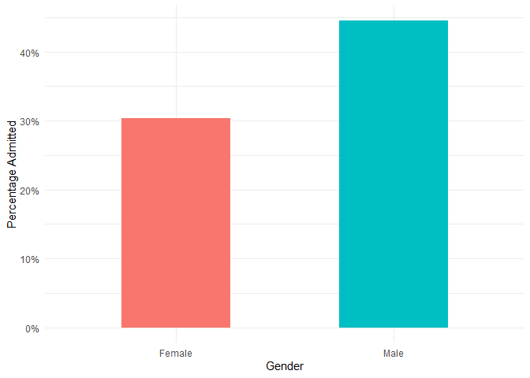<!-- -->

We observe a large gap between the percentages of admitted men and
women. We can quickly jump to the conclusion that there was significant
discrimination against women. However, we have to be careful in our
interpretations.

Here, we investigate the *total effect* of gender on admission, as shown
in the following DAG.

``` r
dag <- dagify(A ~ G,  exposure = 'G', outcome = 'A')
ggdag_status(dag) + theme_dag() + theme(legend.position = "none")
```

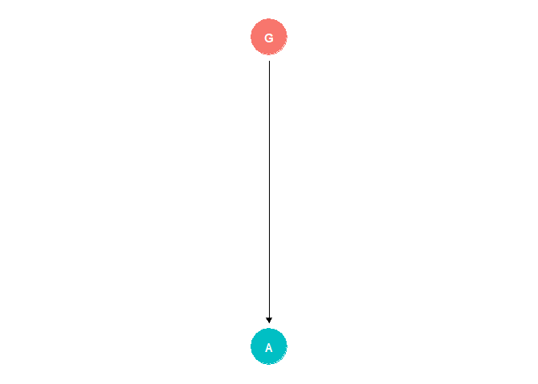<!-- -->

Now, there is no hidden confounder here. There is no common cause of
gender and admittance, i.e., the estimate of the average total effect of
gender for this population is unbiased.

``` r
ucb_total <- ucb_total %>% pivot_wider(names_from = Admit, values_from = c(Total_Freq, Prop))
colnames(ucb_total) <- c('Gender', 'Admitted', 'Rejected', 'Prop_admitted', 'Prop_rejected')

logit_model_total <- glm(cbind(Admitted, Rejected) ~ Gender, data = ucb_total, family = binomial(link = "logit"))
avg_comparisons(logit_model_total, variables = "Gender")
```

    ## 
    ##  Estimate Std. Error    z Pr(>|z|)    S 2.5 % 97.5 %
    ##     0.142     0.0144 9.85   <0.001 73.6 0.113   0.17
    ## 
    ## Term: Gender
    ## Type: response
    ## Comparison: Male - Female

However, candidates are admitted to various departments, and each has
different admission rates. The choice of department will depend on the
candidate’s gender, and it might be that departments preferred by female
candidates are those with low admission rates (e.g., due to
competition). This is an indirect (so-called *structural*)
discrimination.

There is of course the possibility of a *direct effect* of the
applicant’s gender. This is so-called *status-based* or *taste-based*
discrimination. To investigate whether the observed total effect
corresponds to direct discrimination, let us look at admission rates for
each department; i.e., we need to stratify the data by department.

``` r
ucb_dep <- UCBAdmissions %>% group_by(Dept, Gender) %>% mutate(Prop = Freq / sum(Freq)) 

ggplot(ucb_dep %>% filter(Admit == "Admitted"), aes(x = Gender, y = Prop, fill = Gender)) +
  geom_col(position = "dodge", width = 0.7) +
  facet_wrap(~ Dept, labeller = labeller(Dept = function(x) paste("Department", x))) +
  scale_y_continuous(labels = scales::percent) +
  labs(x = "Gender", y = "Percentage Admitted") +
  theme_minimal() + theme(legend.position = "none")
```

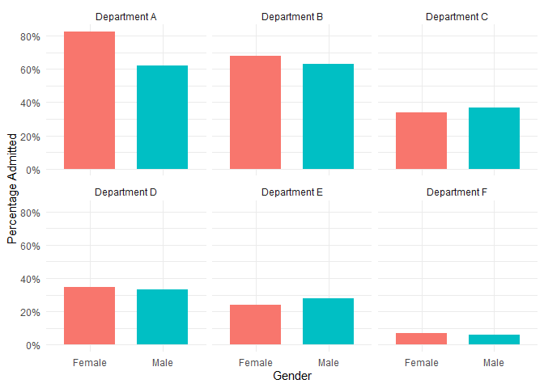<!-- -->

Let us fit the corresponding model and compute the average direct effect
of the gender.

``` r
ucb_dep <- ucb_dep %>% pivot_wider(names_from = Admit, values_from = c(Freq, Prop))
colnames(ucb_dep) <- c('Gender', 'Department', 'Admitted', 'Rejected', 'Prop_admitted', 'Prop_rejected')

logit_model_dep <- glm(cbind(Admitted, Rejected) ~ Gender*Department, data = ucb_dep, family = binomial(link = "logit"))
avg_comparisons(logit_model_dep, variables = "Gender")
```

    ## 
    ##  Estimate Std. Error     z Pr(>|z|)   S   2.5 %  97.5 %
    ##    -0.036     0.0203 -1.77   0.0761 3.7 -0.0758 0.00378
    ## 
    ## Term: Gender
    ## Type: response
    ## Comparison: Male - Female

We see that after stratifying by department, the average *direct* effect
is not significant. Looking at the graphs, we can argue that there is
discrimination in department A, in which women are advantaged.

``` r
summary(logit_model_dep)
```

    ## 
    ## Call:
    ## glm(formula = cbind(Admitted, Rejected) ~ Gender * Department, 
    ##     family = binomial(link = "logit"), data = ucb_dep)
    ## 
    ## Coefficients:
    ##                        Estimate Std. Error z value Pr(>|z|)    
    ## (Intercept)              1.5442     0.2527   6.110 9.94e-10 ***
    ## GenderMale              -1.0521     0.2627  -4.005 6.21e-05 ***
    ## DepartmentB             -0.7904     0.4977  -1.588  0.11224    
    ## DepartmentC             -2.2046     0.2672  -8.252  < 2e-16 ***
    ## DepartmentD             -2.1662     0.2750  -7.878 3.32e-15 ***
    ## DepartmentE             -2.7013     0.2790  -9.682  < 2e-16 ***
    ## DepartmentF             -4.1250     0.3297 -12.512  < 2e-16 ***
    ## GenderMale:DepartmentB   0.8321     0.5104   1.630  0.10306    
    ## GenderMale:DepartmentC   1.1770     0.2996   3.929 8.53e-05 ***
    ## GenderMale:DepartmentD   0.9701     0.3026   3.206  0.00135 ** 
    ## GenderMale:DepartmentE   1.2523     0.3303   3.791  0.00015 ***
    ## GenderMale:DepartmentF   0.8632     0.4027   2.144  0.03206 *  
    ## ---
    ## Signif. codes:  0 '***' 0.001 '**' 0.01 '*' 0.05 '.' 0.1 ' ' 1
    ## 
    ## (Dispersion parameter for binomial family taken to be 1)
    ## 
    ##     Null deviance: 8.7706e+02  on 11  degrees of freedom
    ## Residual deviance: 1.1413e-13  on  0  degrees of freedom
    ## AIC: 92.94
    ## 
    ## Number of Fisher Scoring iterations: 3

We observe that the coefficient *GenderMale*, which corresponds to the
odds ratios for department A, is negative and statistically significant.
The risk difference for department A can be computed as follows.

``` r
plogis(coefficients(logit_model_dep)[1] + coefficients(logit_model_dep)[2]) - plogis(coefficients(logit_model_dep)[1])
```

    ## (Intercept) 
    ##   -0.203468

So, is there discrimination in department A? Well, our model including
departments corresponds to the following DAG.

``` r
dag <- dagify(A ~ G + D, D ~ G,  exposure = 'G', outcome = 'A')
ggdag_status(dag) + theme_dag() + theme(legend.position = "none")
```

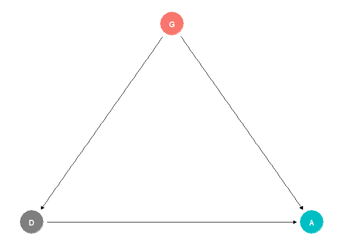<!-- -->

To estimate the direct effect of gender, we stratify by the departments.
However, whereas there were no common causes of gender and admittance,
there are definitely unobserved common causes of an applicant’s *choice*
of department and their admittance. We will call this unobserved
confounder *ability* $`u`$ of the applicant.

``` r
dag <- dagify(A ~ G + D + U, D ~ G + U,  exposure = 'G', outcome = 'A')
ggdag_status(dag) + theme_dag() + theme(legend.position = "none")
```

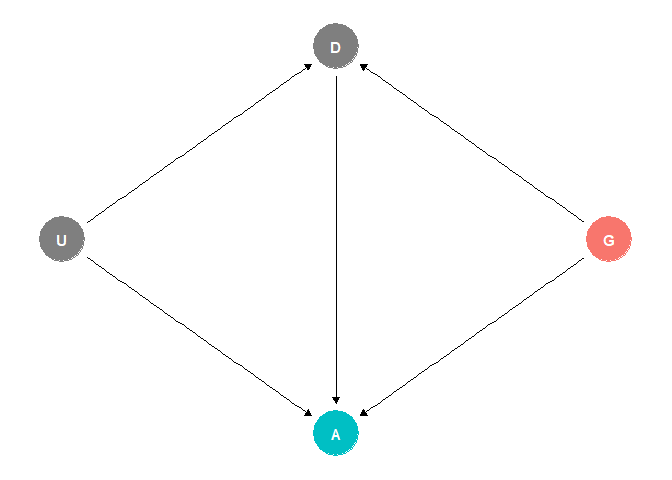<!-- -->

In other words, department is a collider, which means that our
estimators of the direct effect of gender could be biased.

## Modeling Unobserved Confounder using Bayesian Latent Model

As we discussed in the previous part, we cannot adjust for an unobserved
confounder, since it was not measured. However, we can simulate possible
scenarios and demonstrate how severe the confounding must be to change
the results of our inference.

Here, we will consider a sensitivity analysis using a Bayesian
framework. What we will demonstrate here follows (and extends a bit) the
analysis from
<https://github.com/rmcelreath/stat_rethinking_2026/blob/main/scripts/10_confounds_poisson.r>
by Richard McElreath (I also recommend the accompanying lectures
Statistical Rethinking Lecture A9
<https://www.youtube.com/watch?v=RuBUVQELw-c&list=PLDcUM9US4XdNOlqSyhe38US8mFgmqzI14&index=9>
and Statistical Rethinking Lecture A10
<https://www.youtube.com/watch?v=pwN0kdN3reY&list=PLDcUM9US4XdNOlqSyhe38US8mFgmqzI14&index=10>).

Let us first transform the datatset into the “long” format.

``` r
ucb_dep_long <- ucb_dep %>%
  pivot_longer(
    cols = c(Admitted, Rejected), 
    names_to = "Status", 
    values_to = "Count"
  ) %>%
  uncount(Count) %>%
  mutate(Admitted = ifelse(Status == "Admitted", 1, 0)) %>% select(Gender, Department, Admitted)

head(ucb_dep_long)
```

    ## # A tibble: 6 × 3
    ## # Groups:   Department, Gender [1]
    ##   Gender Department Admitted
    ##   <chr>  <chr>         <dbl>
    ## 1 Male   A                 1
    ## 2 Male   A                 1
    ## 3 Male   A                 1
    ## 4 Male   A                 1
    ## 5 Male   A                 1
    ## 6 Male   A                 1

### Bayesian Model for Total Effect of Gender

Now, before we consider a model with an unobserved confounder, we will
start with a simpler Bayesian model and build it up. Namely, we will
first estimate the total effect model for gender.

We will not go here through the principles of Bayesian inference; see,
e.g., *Nine Circles of Bayesian Modeling* for that purpose. Just as a
quick reminder, the Bayesian model we will consider here is

``` math
\begin{aligned}
\text{logit } p_i &= \text{Gender}_i\\
\text{Gender}_\text{Male} & \sim N(0,1)\\
\text{Gender}_\text{Female} & \sim N(0,1).
\end{aligned}
```

Here $`\text{Gender}_\text{Male}`$ and $`\text{Gender}_\text{Female}`$
are parameters of the logistic regression, for both of which we assume
normal *prior distributions*. The Bayesian framework uses the *Bayesian
update* to compute the *posterior distributions* of the model parameters
based on the observed data.

We have usually fit these models using the *brms* package. However,
*brms* does not allow us to fit models with latent variables, which we
will need. Hence, we will use *ulam* from the *rethinking* package
(<https://www.rdocumentation.org/packages/rethinking/versions/2.13>). To
be precise, we will not use *ulam* to fit the model itself. We only use
it to generate the model’s Stan code, which we will fit using rstan. We
do it this way so that we have all standard diagnostic tools available.

``` r
library(rethinking)

ucb_dep_long_data <- list( 
    A = ucb_dep_long$Admitted,                           # admitted
    G = ifelse(ucb_dep_long$Gender=="Female",2,1),       # gender
    D = as.numeric(factor(ucb_dep_long$Department))      # department
)

ulam_model <- ulam(
    alist(
        A ~ bernoulli(p),
        logit(p) <- a[G],
        a[G] ~ normal(0,1)
    ), data = ucb_dep_long_data , log_lik = TRUE, chains=1, cores=1, iter = 0)
```

    ## Running MCMC with 1 chain, with 1 thread(s) per chain...

``` r
stancode(ulam_model)
```

    ## data{
    ##     array[4526] int D;
    ##     array[4526] int A;
    ##     array[4526] int G;
    ## }
    ## parameters{
    ##      vector[2] a;
    ## }
    ## model{
    ##      vector[4526] p;
    ##     a ~ normal( 0 , 1 );
    ##     for ( i in 1:4526 ) {
    ##         p[i] = a[G[i]];
    ##         p[i] = inv_logit(p[i]);
    ##     }
    ##     A ~ bernoulli( p );
    ## }
    ## generated quantities{
    ##     vector[4526] log_lik;
    ##      vector[4526] p;
    ##     for ( i in 1:4526 ) {
    ##         p[i] = a[G[i]];
    ##         p[i] = inv_logit(p[i]);
    ##     }
    ##     for ( i in 1:4526 ) log_lik[i] = bernoulli_lpmf( A[i] | p[i] );
    ## }

We will modify this code slightly to generate posterior predictions of
the model, and we also sample the prior distribution for the (prior)
sensitivity analysis.

``` default
data{
    array[4526] int D;
    array[4526] int A;
    array[4526] int G;
}
parameters{
     vector[2] a;
}
model{
     vector[4526] p;
    a ~ normal( 0 , 1 );
    for ( i in 1:4526 ) {
        p[i] = a[G[i]];
        p[i] = inv_logit(p[i]);
    }
    A ~ bernoulli( p );
}
generated quantities{
    vector[4526] log_lik;
    vector[4526] p;
    array[4526] int A_sim;
    real lprior;

    lprior = normal_lpdf(a | 0, 1);

    for ( i in 1:4526 ) {
        p[i] = a[G[i]];
        p[i] = inv_logit(p[i]);
        A_sim[i] = bernoulli_rng(p[i]);
    }
    for ( i in 1:4526 ) log_lik[i] = bernoulli_lpmf( A[i] | p[i] );
}
```

Let us fit the model using *rstan*.

``` r
library(rstan)
stan_fit <- rstan::stan(
  file  = "C:/Users/elini/Desktop/first casualty/ubc_adm_1.stan",
  data = ucb_dep_long_data,
  chains = 4,
  iter = 2000,
  warmup = 1000,
  seed = 123,
  refresh = 0
)
```

Let’s check the posterior samples of the parameters.

``` r
summary(stan_fit, pars = "a")$summary
```

    ##            mean      se_mean         sd       2.5%        25%        50%
    ## a[1] -0.2190764 0.0006129360 0.03882466 -0.2959645 -0.2451885 -0.2190327
    ## a[2] -0.8296281 0.0008178403 0.04991074 -0.9284435 -0.8638958 -0.8286148
    ##             75%      97.5%    n_eff      Rhat
    ## a[1] -0.1938733 -0.1410827 4012.222 0.9997471
    ## a[2] -0.7954731 -0.7328221 3724.354 0.9999423

We see that these estimates correspond to our previous “frequentist”
model. We see that *n_eff* is large and *Rhat* close to one, which
indicates that sampling was done well.

Let’s quickly go through the diagnostics for the model, which should be
done for any Bayesian model, since fitting a Bayesian model is fairly
complex due to its dependence on MCMC sampling. First, we perform the
posterior predictive check.

``` r
library(bayesplot)
loo_fit <- loo(stan_fit, save_psis = TRUE)
psis_object <- loo_fit$psis_object
lw <- weights(psis_object)
A_sim <- extract(stan_fit)$A_sim

p1 <- ppc_loo_pit_overlay(ucb_dep_long_data$A, A_sim, lw = lw)
p2 <- ppc_loo_pit_qq(ucb_dep_long_data$A, A_sim, lw = lw)
p3 <- ppc_loo_pit_ecdf(ucb_dep_long_data$A, A_sim, lw = lw, plot_diff = TRUE)
p4 <- ppc_loo_intervals(ucb_dep_long_data$A, A_sim, psis_object = psis_object, prob = 0.75, prob_outer = 0.99)

(p1 + p2 + p3 + p4) + plot_layout(ncol = 2)
```

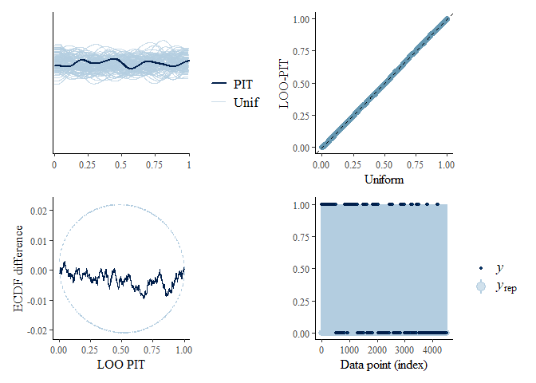<!-- -->

We see no problems with PIT (probability integral transform; see, e.g.,
*Nine Circles of Bayesian Modeling: The Second Circle: Checking,
Evaluating, and Comparing Bayesian Models, Part Two*). The diagnostics
of Hamiltonian MCM are as follows.

``` r
np <- nuts_params(stan_fit)
p1 <- mcmc_nuts_energy(np, merge_chains = TRUE, bins = 50)
p2 <-mcmc_nuts_divergence(np, log_posterior(stan_fit))

(p1 + p2) + plot_layout(ncol = 2)
```

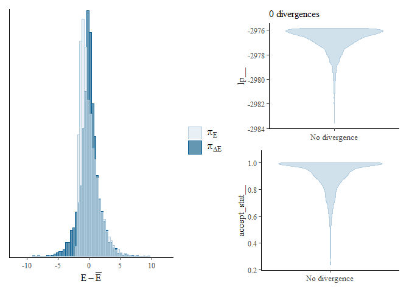<!-- -->

There were no divergent transitions. Lastly, let us check the
sensitivity of our estimates to our choice of priors.

    ## Sensitivity based on cjs_dist
    ## Prior selection: all priors
    ## Likelihood selection: all data
    ## 
    ##  variable prior likelihood diagnosis
    ##      a[1] 0.001      0.092         -
    ##      a[2] 0.007      0.079         -

We see that our estimates are insensitive. Let’s plot the posterior
distribution of the coefficients.

``` r
a_posterior <- extract(stan_fit)$a

dens <- density(plogis(a_posterior[,1]))
dens_data1 <- data.frame(x = dens$x, y = dens$y)

dens <- density(plogis(a_posterior[,2]))
dens_data2 <- data.frame(x = dens$x, y = dens$y)

ggplot(dens_data1, aes(x = x, y = y)) + 
  geom_line(linewidth = 1, color = 'blue') +
  geom_line(aes(x = dens_data2$x, y = dens_data2$y), linewidth = 1, color = 'red') +
  xlab('Probability of Admittance (men: blue, women: red)') + ylab('Posterior Density')
```

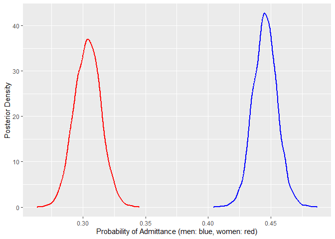<!-- -->

We can also simulate the average total treatment effect using the
posterior draws

``` r
p_male <- matrix(0, 1000, length(ucb_dep_long$Admitted))
p_female <- matrix(0, 1000, length(ucb_dep_long$Admitted))

for (i in 1:1000){
  for (j in 1:length(ucb_dep_long$Admitted)){
     p_male[i,j]   <- plogis(a_posterior[i,1])
     p_female[i,j] <- plogis(a_posterior[i,2])
  }
}

mean(p_male-p_female)
```

    ## [1] 0.1413057

``` r
sd(p_male-p_female)
```

    ## [1] 0.01416949

and the plot the posterior density.

``` r
dens <- density(p_male-p_female)
dens_data1 <- data.frame(x = dens$x, y = dens$y)

ggplot(dens_data1, aes(x = x, y = y)) +
  geom_line(aes(x = dens_data1$x, y = dens_data1$y), linewidth = 1, color = 'blue') + geom_vline(xintercept = mean(p_male-p_female), color = "red") + xlab('Risk Difference (men - women)') + ylab('Posterior Density')
```

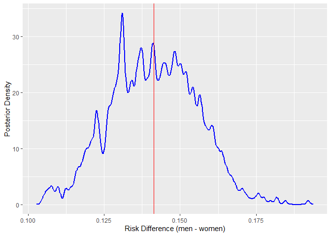<!-- -->

The Bayesian framework yields the same result as the standard logistic
regression. The total effect of gender is clearly in favor of men.

### Bayesian Model for Direct Effect of Gender

Let’s move to the direct effect of gender. The Stan code of the Bayesian
model

``` math
 \begin{aligned}
\text{logit } p_i &= \text{Gender\_Department}_i\\
\text{Gender\_Department}_\text{Male, Dep. A} & \sim N(0,2.25)\\
\text{Gender\_Department}_\text{Female, Dep. A} & \sim N(0,2.25)\\
\text{Gender\_Department}_\text{Male, Dep. B} & \sim N(0,2.25)\\
&\ldots
\end{aligned}
```
is as follows.

``` r
ulam_model <- ulam(
    alist(
        A ~ bernoulli(p),
        logit(p) <- a[G,D],
        matrix[G,D]:a ~ normal(0,1.5)
    ), data = ucb_dep_long_data , log_lik = TRUE, chains=1, cores=1, iter = 0)
```

    ## Running MCMC with 1 chain, with 1 thread(s) per chain...

``` r
stancode(ulam_model)
```

    ## data{
    ##     array[4526] int A;
    ##     array[4526] int D;
    ##     array[4526] int G;
    ## }
    ## parameters{
    ##      matrix[2,6] a;
    ## }
    ## model{
    ##      vector[4526] p;
    ##     to_vector( a ) ~ normal( 0 , 1.5 );
    ##     for ( i in 1:4526 ) {
    ##         p[i] = a[G[i], D[i]];
    ##         p[i] = inv_logit(p[i]);
    ##     }
    ##     A ~ bernoulli( p );
    ## }
    ## generated quantities{
    ##     vector[4526] log_lik;
    ##      vector[4526] p;
    ##     for ( i in 1:4526 ) {
    ##         p[i] = a[G[i], D[i]];
    ##         p[i] = inv_logit(p[i]);
    ##     }
    ##     for ( i in 1:4526 ) log_lik[i] = bernoulli_lpmf( A[i] | p[i] );
    ## }

Hence, the modified code is

``` default
data{
    array[4526] int A;
    array[4526] int D;
    array[4526] int G;
}
parameters{
     matrix[2,6] a;
}
model{
    vector[4526] p;
    to_vector( a ) ~ normal( 0 , 1.5 );
    for ( i in 1:4526 ) {
        p[i] = a[G[i], D[i]];
        p[i] = inv_logit(p[i]);
    }
    A ~ bernoulli( p );
}
generated quantities{
    vector[4526] log_lik;
    vector[4526] p;
    array[4526] int A_sim;
    real lprior;

    lprior = normal_lpdf(to_vector(a) | 0, 1.5);

    for ( i in 1:4526 ) {
        p[i] = a[G[i], D[i]];
        p[i] = inv_logit(p[i]);
        A_sim[i] = bernoulli_rng(p[i]);
    }
    for ( i in 1:4526 ) log_lik[i] = bernoulli_lpmf( A[i] | p[i] );
}
```

We fit the model.

``` r
stan_fit <- rstan::stan(
  file  = "C:/Users/elini/Desktop/first casualty/ubc_adm_2.stan",
  data = ucb_dep_long_data,
  chains = 4,
  iter = 2000,
  warmup = 1000,
  seed = 123,
  refresh = 0
)
```

The model parameters are as follows.

``` r
summary(stan_fit, pars = "a")$summary
```

    ##              mean      se_mean         sd       2.5%        25%        50%       75%      97.5%     n_eff      Rhat
    ## a[1,1]  0.4936061 0.0008352285 0.07358790  0.3506764  0.4443663  0.4934415  0.5423854  0.6407594  7762.511 0.9996270
    ## a[1,2]  0.5331730 0.0008817616 0.08568607  0.3672574  0.4753513  0.5334783  0.5882955  0.7055735  9443.175 0.9998433
    ## a[1,3] -0.5326548 0.0011632755 0.11268966 -0.7534767 -0.6084242 -0.5339483 -0.4564727 -0.3097580  9384.323 0.9995399
    ## a[1,4] -0.7025014 0.0010243308 0.10524824 -0.9077402 -0.7736000 -0.7021407 -0.6311624 -0.5003679 10557.212 0.9993048
    ## a[1,5] -0.9503099 0.0015884988 0.16235444 -1.2778601 -1.0572747 -0.9491958 -0.8426699 -0.6358832 10446.110 0.9992512
    ## a[1,6] -2.7352540 0.0024043525 0.21501699 -3.1688888 -2.8772776 -2.7276225 -2.5922476 -2.3222003  7997.409 0.9993435
    ## a[2,1]  1.5218622 0.0027582770 0.25903710  1.0432861  1.3444271  1.5119779  1.6924878  2.0415869  8819.585 0.9994568
    ## a[2,2]  0.7198749 0.0044305910 0.41121984 -0.0529612  0.4407579  0.7091944  0.9838030  1.5583599  8614.395 0.9999162
    ## a[2,3] -0.6578974 0.0009713155 0.08674815 -0.8253038 -0.7173328 -0.6569195 -0.5986976 -0.4935131  7976.268 0.9999037
    ## a[2,4] -0.6217654 0.0011841499 0.10660223 -0.8328283 -0.6942757 -0.6208402 -0.5489347 -0.4171611  8104.369 0.9994551
    ## a[2,5] -1.1539979 0.0013339935 0.11647638 -1.3888656 -1.2313401 -1.1537583 -1.0759600 -0.9278873  7623.744 0.9995569
    ## a[2,6] -2.5477894 0.0022828442 0.20186133 -2.9551221 -2.6827159 -2.5412587 -2.4097160 -2.1723627  7819.045 1.0000206

Let’s check the model.

``` r
loo_fit <- loo(stan_fit, save_psis = TRUE)
psis_object <- loo_fit$psis_object
lw <- weights(psis_object)
A_sim <- extract(stan_fit)$A_sim

p1 <- ppc_loo_pit_overlay(ucb_dep_long_data$A, A_sim, lw = lw)
p2 <- ppc_loo_pit_qq(ucb_dep_long_data$A, A_sim, lw = lw)
p3 <- ppc_loo_pit_ecdf(ucb_dep_long_data$A, A_sim, lw = lw, plot_diff = TRUE)
p4 <- ppc_loo_intervals(ucb_dep_long_data$A, A_sim, psis_object = psis_object, prob = 0.75, prob_outer = 0.99)

(p1 + p2 + p3 + p4) + plot_layout(ncol = 2)
```

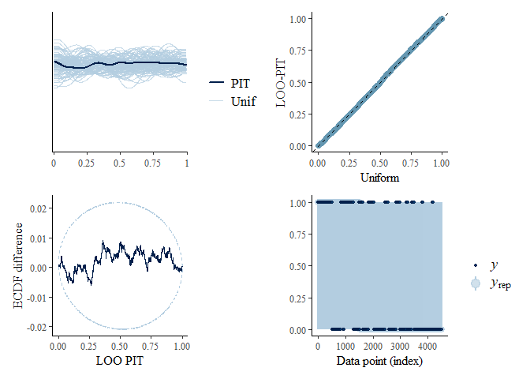<!-- -->

``` r
np <- nuts_params(stan_fit)
p1 <- mcmc_nuts_energy(np, merge_chains = TRUE, bins = 50)
p2 <-mcmc_nuts_divergence(np, log_posterior(stan_fit))

(p1 + p2) + plot_layout(ncol = 2)
```

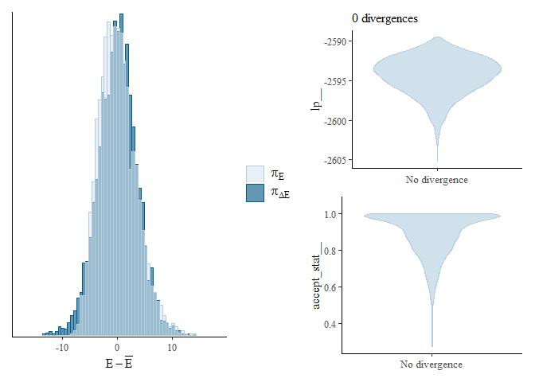<!-- -->

    ## Sensitivity based on cjs_dist
    ## Prior selection: all priors
    ## Likelihood selection: all data
    ## 
    ##  variable prior likelihood diagnosis
    ##    a[1,1] 0.002      0.089         -
    ##    a[2,1] 0.029      0.086         -
    ##    a[1,2] 0.005      0.084         -
    ##    a[2,2] 0.029      0.065         -
    ##    a[1,3] 0.004      0.084         -
    ##    a[2,3] 0.004      0.084         -
    ##    a[1,4] 0.006      0.089         -
    ##    a[2,4] 0.009      0.075         -
    ##    a[1,5] 0.010      0.078         -
    ##    a[2,5] 0.011      0.081         -
    ##    a[1,6] 0.039      0.087         -
    ##    a[2,6] 0.036      0.076         -

No problems here. Let’s plot the posterior distributions.

``` r
a_posterior <- extract(stan_fit)$a

dens <- density(plogis(a_posterior[,1,1]))
dens_data1 <- data.frame(x = dens$x, y = dens$y)
dens <- density(plogis(a_posterior[,2,1]))
dens_data2 <- data.frame(x = dens$x, y = dens$y)
dens <- density(plogis(a_posterior[,1,2]))
dens_data3 <- data.frame(x = dens$x, y = dens$y)
dens <- density(plogis(a_posterior[,2,2]))
dens_data4 <- data.frame(x = dens$x, y = dens$y)

p1 <-  ggplot(dens_data1, aes(x = x, y = y)) + 
  geom_line(linewidth = 1, color = 'blue') +
  geom_line(aes(x = dens_data2$x, y = dens_data2$y), linewidth = 1, color = 'red') +
  xlab('Probability of Admittance for Department A (men: blue, women: red)') + ylab('Posterior Density')

p2 <-  ggplot(dens_data3, aes(x = x, y = y)) + 
  geom_line(linewidth = 1, color = 'blue') +
  geom_line(aes(x = dens_data4$x, y = dens_data4$y), linewidth = 1, color = 'red') +
  xlab('Probability of Admittance for Department B (men: blue, women: red)') + ylab('Posterior Density')

(p1 + p2) + plot_layout(ncol = 1)
```

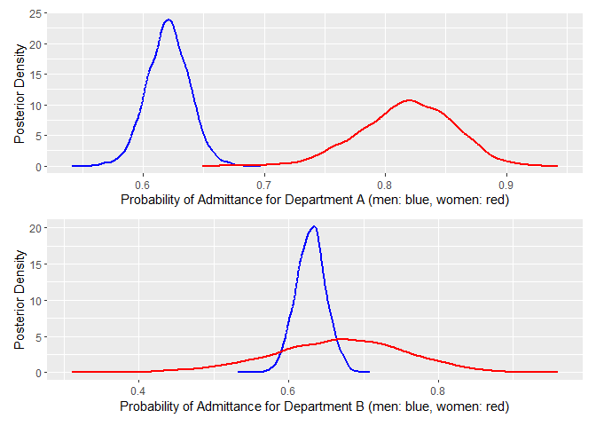<!-- -->

``` r
dens <- density(plogis(a_posterior[,1,3]))
dens_data1 <- data.frame(x = dens$x, y = dens$y)
dens <- density(plogis(a_posterior[,2,3]))
dens_data2 <- data.frame(x = dens$x, y = dens$y)
dens <- density(plogis(a_posterior[,1,4]))
dens_data3 <- data.frame(x = dens$x, y = dens$y)
dens <- density(plogis(a_posterior[,2,4]))
dens_data4 <- data.frame(x = dens$x, y = dens$y)

p1 <-  ggplot(dens_data1, aes(x = x, y = y)) + 
  geom_line(linewidth = 1, color = 'blue') +
  geom_line(aes(x = dens_data2$x, y = dens_data2$y), linewidth = 1, color = 'red') +
  xlab('Probability of Admittance for Department C (men: blue, women: red)') + ylab('Posterior Density')


p2 <-  ggplot(dens_data3, aes(x = x, y = y)) + 
  geom_line(linewidth = 1, color = 'blue') +
  geom_line(aes(x = dens_data4$x, y = dens_data4$y), linewidth = 1, color = 'red') +
  xlab('Probability of Admittance for Department D (men: blue, women: red)') + ylab('Posterior Density')

(p1 + p2) + plot_layout(ncol = 1)
```

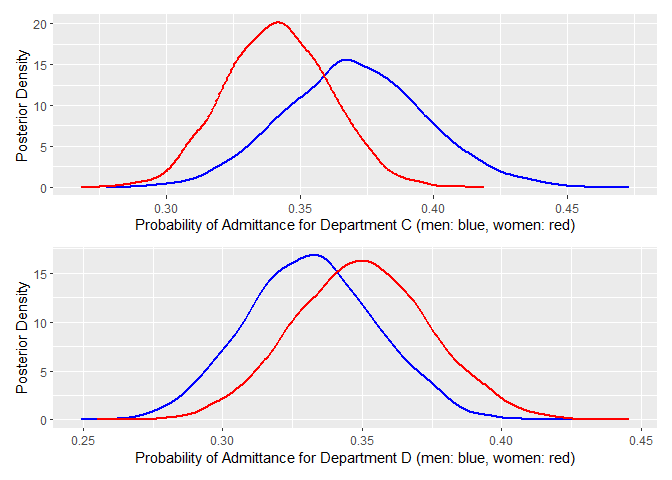<!-- -->

``` r
dens <- density(plogis(a_posterior[,1,5]))
dens_data1 <- data.frame(x = dens$x, y = dens$y)
dens <- density(plogis(a_posterior[,2,5]))
dens_data2 <- data.frame(x = dens$x, y = dens$y)
dens <- density(plogis(a_posterior[,1,6]))
dens_data3 <- data.frame(x = dens$x, y = dens$y)
dens <- density(plogis(a_posterior[,2,6]))
dens_data4 <- data.frame(x = dens$x, y = dens$y)

p1 <-  ggplot(dens_data1, aes(x = x, y = y)) + 
  geom_line(linewidth = 1, color = 'blue') +
  geom_line(aes(x = dens_data2$x, y = dens_data2$y), linewidth = 1, color = 'red') +
  xlab('Probability of Admittance for Department E (men: blue, women: red)') + ylab('Posterior Density')

p2 <-  ggplot(dens_data3, aes(x = x, y = y)) + 
  geom_line(linewidth = 1, color = 'blue') +
  geom_line(aes(x = dens_data4$x, y = dens_data4$y), linewidth = 1, color = 'red') +
  xlab('Probability of Admittance for Department F (men: blue, women: red)') + ylab('Posterior Density')

(p1 + p2) + plot_layout(ncol = 1)
```

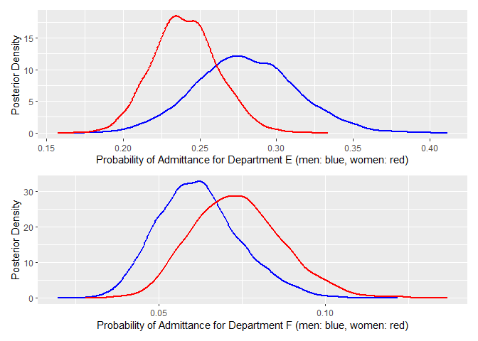<!-- -->

We see that department A makes all the difference in the distribution.
However, as we discussed, this estimate may be biased. Let us
investigate how the unobserved confounding can change the effect.

``` r
p_male <- matrix(0, 1000, length(ucb_dep_long$Admitted))
p_female <- matrix(0, 1000, length(ucb_dep_long$Admitted))

for (i in 1:1000){
  for (j in 1:length(ucb_dep_long$Admitted)){
     p_male[i,j]   <- plogis(a_posterior[i,1,ucb_dep_long_data$D[j]])
     p_female[i,j] <- plogis(a_posterior[i,2,ucb_dep_long_data$D[j]])
  }
}

mean(p_male-p_female)
```

    ## [1] -0.04018354

``` r
sd(p_male-p_female)
```

    ## [1] 0.09478918

``` r
dens <- density(p_male)
dens_data1 <- data.frame(x = dens$x, y = dens$y)
dens <- density(p_female)
dens_data2 <- data.frame(x = dens$x, y = dens$y)

ggplot(dens_data1, aes(x = x, y = y)) + 
  geom_line(linewidth = 1, color = 'blue') +
  geom_line(aes(x = dens_data2$x, y = dens_data2$y), linewidth = 1, color = 'red') +
  xlab('Probability of Admittance (all men: blue, all women: red)') + ylab('Posterior Density')
```

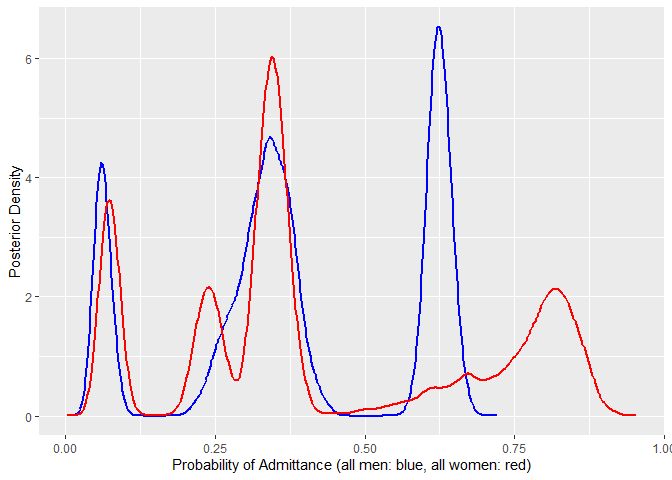<!-- -->

``` r
dens <- density(p_male-p_female)
dens_data1 <- data.frame(x = dens$x, y = dens$y)

ggplot(dens_data1, aes(x = x, y = y)) +
  geom_line(aes(x = dens_data1$x, y = dens_data1$y), linewidth = 1, color = 'blue') + geom_vline(xintercept = mean(p_male-p_female), color = "red") + xlab('Risk Difference (men - women)') + ylab('Posterior Density')
```

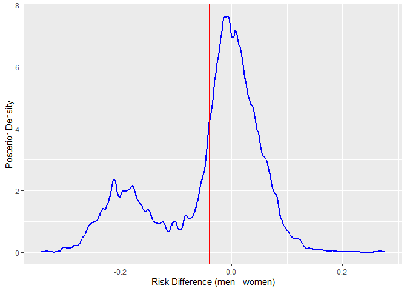<!-- -->

We see that the department A makes all the difference in the
distribution. However, as we discussed this estimate may be biased. Let
us investigate how the unobserved confounding can change the effect.

### Bayesian Model for Direct Effect of Gender (with Confounding)

Let us return to our model with a hidden confounder (an individual’s
ability) $`u`$.

``` r
dag <- dagify(A ~ G + D + U, D ~ G + U,  exposure = 'G', outcome = 'A')
ggdag_status(dag) + theme_dag() + theme(legend.position = "none")
```

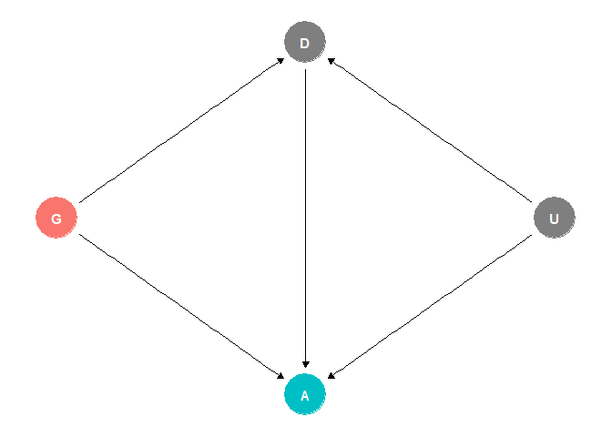<!-- -->

Let’s denote the probability of choosing the department $`A`$ as $`q`$,
which is influenced by gender and $`u`$. We cannot observe the
confounder $`u`$ directly, but we can include it in the Bayesian model
as follows.

``` math
 \begin{aligned}
\text{logit } p_i &= \text{Gender\_Department}_i + \beta_i u_i\\
\text{logit } q_i &= \text{Gender}_i + \gamma_i u_i\\
\text{Gender\_Department}_\text{Male, Dep. A} & \sim N(0,2.25)\\
\text{Gender\_Department}_\text{Female, Dep. A} & \sim N(0,2.25)\\
\text{Gender\_Department}_\text{Male, Dep. B} & \sim N(0,2.25)\\
&\ldots\\
\text{Gender}_\text{Male} & \sim N(0,1)\\
\text{Gender}_\text{Female} & \sim N(0,1)\\
\end{aligned}
```

We see that the model now consists of two equations, and the individual
latent variables $`u_i`$s appear in both. Since we do not observe them,
they are essentially additional parameters in the model. We will assume
priors $`u_i \sim N(0,1)`$.

Further, let’s assume, for simplicity, a scenario in which we set
$`\beta_\text{Female} = \beta_\text{Male} = 1`$ (ability increases the
probability of admittance the same way for everyone). Also, we set
$`\gamma_\text{Male} = 0`$ and $`\gamma_\text{Female} = 1`$ (women’s
ability increases the probability of selecting department A).

Of course, we cannot assume this is the true model. The goal is to
create alternative scenarios with hidden confounding and assess how they
affect our inference results. The Stan code is as follows.

``` r
ucb_dep_long_data_conf <- ucb_dep_long_data

ucb_dep_long_data_conf$D1 <- ifelse(ucb_dep_long_data$D==1,1,0)       # department == A
ucb_dep_long_data_conf$N <- length(ucb_dep_long_data$D)
ucb_dep_long_data_conf$b <- c(1,1)
ucb_dep_long_data_conf$g <- c(0,1.5)

ucb_dep_long_data <- list( 
    A = ucb_dep_long$Admitted,                          
    G = ifelse(ucb_dep_long$Gender=="Female",2,1),      
    D = as.numeric(factor(ucb_dep_long$Department))   
)

ulam_model <- ulam(
    alist( 
        # Admitted model
        A ~ bernoulli(p),
        logit(p) <- a[G,D] + b[G]*u[i],
        matrix[G,D]:a ~ normal(0,1.5),

        # Department model
        D1 ~ bernoulli(q),
        logit(q) <- delta[G] + g[G]*u[i],
        delta[G] ~ normal(0,1),

        # declare unobserved u
        vector[N]:u ~ normal(0,1)
    ), data = ucb_dep_long_data_conf, log_lik = TRUE, chains=1, cores=1, iter = 0)
```

    ## Running MCMC with 1 chain, with 1 thread(s) per chain...

``` r
stancode(ulam_model)
```

    ## data{
    ##      int N;
    ##     array[4526] int A;
    ##     array[2] int b;
    ##     array[4526] int D;
    ##     array[4526] int D1;
    ##      vector[2] g;
    ##     array[4526] int G;
    ## }
    ## parameters{
    ##      matrix[2,6] a;
    ##      vector[2] delta;
    ##      vector[N] u;
    ## }
    ## model{
    ##      vector[4526] p;
    ##      vector[4526] q;
    ##     u ~ normal( 0 , 1 );
    ##     delta ~ normal( 0 , 1 );
    ##     for ( i in 1:4526 ) {
    ##         q[i] = delta[G[i]] + g[G[i]] * u[i];
    ##         q[i] = inv_logit(q[i]);
    ##     }
    ##     D1 ~ bernoulli( q );
    ##     to_vector( a ) ~ normal( 0 , 1.5 );
    ##     for ( i in 1:4526 ) {
    ##         p[i] = a[G[i], D[i]] + b[G[i]] * u[i];
    ##         p[i] = inv_logit(p[i]);
    ##     }
    ##     A ~ bernoulli( p );
    ## }
    ## generated quantities{
    ##     vector[4526] log_lik;
    ##      vector[4526] p;
    ##      vector[4526] q;
    ##     for ( i in 1:4526 ) {
    ##         q[i] = delta[G[i]] + g[G[i]] * u[i];
    ##         q[i] = inv_logit(q[i]);
    ##     }
    ##     for ( i in 1:4526 ) {
    ##         p[i] = a[G[i], D[i]] + b[G[i]] * u[i];
    ##         p[i] = inv_logit(p[i]);
    ##     }
    ##     for ( i in 1:4526 ) log_lik[i] = bernoulli_lpmf( A[i] | p[i] );
    ## }

Our resulting Stan code is as follows.

``` default
data{
     int N;
    array[4526] int A;
    array[2] int b;
    array[4526] int D;
    array[4526] int D1;
    vector[2] g;
    array[4526] int G;
}
parameters{
     matrix[2,6] a;
     vector[2] delta;
     vector[N] u;
}
model{
     vector[4526] p;
     vector[4526] q;
    u ~ normal( 0 , 1 );
    delta ~ normal( 0 , 1 );
    for ( i in 1:4526 ) {
        q[i] = delta[G[i]] + g[G[i]] * u[i];
        q[i] = inv_logit(q[i]);
    }
    D1 ~ bernoulli( q );
    to_vector( a ) ~ normal( 0 , 1.5 );
    for ( i in 1:4526 ) {
        p[i] = a[G[i], D[i]] + b[G[i]] * u[i];
        p[i] = inv_logit(p[i]);
    }
    A ~ bernoulli( p );
}
generated quantities{
    vector[4526] log_lik;
    vector[4526] p;
    vector[4526] q;
    array[4526] int A_sim;
    real lprior;

    lprior = normal_lpdf(u | 0, 1) + normal_lpdf(delta | 0, 1) + normal_lpdf(to_vector(a) | 0, 1.5);
    
    for ( i in 1:4526 ) {
        q[i] = delta[G[i]] + g[G[i]] * u[i];
        q[i] = inv_logit(q[i]);
    }
    for ( i in 1:4526 ) {
        p[i] = a[G[i], D[i]] + b[G[i]] * u[i];
        p[i] = inv_logit(p[i]);
        A_sim[i] = bernoulli_rng(p[i]);
    }
    for ( i in 1:4526 ) log_lik[i] = bernoulli_lpmf( A[i] | p[i] );
}
```

Let us fit the model

``` r
stan_fit <- rstan::stan(
  file  = "C:/Users/elini/Desktop/first casualty/ubc_adm_3.stan",
  data = ucb_dep_long_data_conf,
  chains = 4,
  iter = 2000,
  warmup = 1000,
  seed = 123,
  refresh = 0
)
```

and check the diagnostics.

``` r
loo_fit <- loo(stan_fit, save_psis = TRUE)
psis_object <- loo_fit$psis_object
lw <- weights(psis_object)
A_sim <- extract(stan_fit)$A_sim

p1 <- ppc_loo_pit_overlay(ucb_dep_long_data$A, A_sim, lw = lw)
p2 <- ppc_loo_pit_qq(ucb_dep_long_data$A, A_sim, lw = lw)
p3 <- ppc_loo_pit_ecdf(ucb_dep_long_data$A, A_sim, lw = lw, plot_diff = TRUE)
p4 <- ppc_loo_intervals(ucb_dep_long_data$A, A_sim, psis_object = psis_object, prob = 0.75, prob_outer = 0.99)

(p1 + p2 + p3 + p4) + plot_layout(ncol = 2)
```

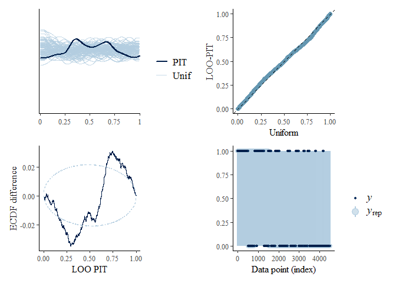<!-- -->

``` r
np <- nuts_params(stan_fit)
p1 <- mcmc_nuts_energy(np, merge_chains = TRUE, bins = 50)
p2 <-mcmc_nuts_divergence(np, log_posterior(stan_fit))

(p1 + p2) + plot_layout(ncol = 2)
```

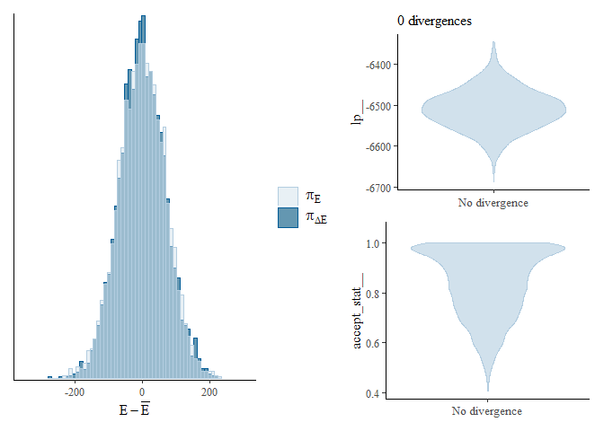<!-- -->

    ## Sensitivity based on cjs_dist
    ## Prior selection: all priors
    ## Likelihood selection: all data
    ## 
    ##  variable prior likelihood                     diagnosis
    ##    a[1,1] 0.294      0.168 potential prior-data conflict
    ##    a[2,1] 0.507      0.130 potential prior-data conflict
    ##    a[1,2] 0.389      0.250 potential prior-data conflict
    ##    a[2,2] 0.197      0.129 potential prior-data conflict
    ##    a[1,3] 0.221      0.123 potential prior-data conflict
    ##    a[2,3] 0.308      0.201 potential prior-data conflict
    ##    a[1,4] 0.369      0.152 potential prior-data conflict
    ##    a[2,4] 0.307      0.200 potential prior-data conflict
    ##    a[1,5] 0.246      0.171 potential prior-data conflict
    ##    a[2,5] 0.343      0.107 potential prior-data conflict
    ##    a[1,6] 0.337      0.175 potential prior-data conflict
    ##    a[2,6] 0.370      0.112 potential prior-data conflict

We see that the fit is slightly off. The priors have a notable impact on
our estimates, but that’s what we want. Let’s compare the proportions
predicted by our model with the observed ones.

``` r
A_sim_mean <- apply(A_sim,2,mean)
A <- ucb_dep_long_data_conf$A
G <- ucb_dep_long_data_conf$G
D <- ucb_dep_long_data_conf$D

counts <- rbind(                 
c(mean(A[D == 1 & G == 1]), mean(A_sim_mean[D == 1 & G == 1])), 
c(mean(A[D == 2 & G == 1]), mean(A_sim_mean[D == 2 & G == 1])),
c(mean(A[D == 3 & G == 1]), mean(A_sim_mean[D == 3 & G == 1])), 
c(mean(A[D == 4 & G == 1]), mean(A_sim_mean[D == 4 & G == 1])), 
c(mean(A[D == 5 & G == 1]), mean(A_sim_mean[D == 5 & G == 1])), 
c(mean(A[D == 6 & G == 1]), mean(A_sim_mean[D == 6 & G == 1])), 
c(mean(A[D == 1 & G == 2]), mean(A_sim_mean[D == 1 & G == 2])), 
c(mean(A[D == 2 & G == 2]), mean(A_sim_mean[D == 2 & G == 2])), 
c(mean(A[D == 3 & G == 2]), mean(A_sim_mean[D == 3 & G == 2])), 
c(mean(A[D == 4 & G == 2]), mean(A_sim_mean[D == 4 & G == 2])), 
c(mean(A[D == 5 & G == 2]), mean(A_sim_mean[D == 5 & G == 2])), 
c(mean(A[D == 6 & G == 2]), mean(A_sim_mean[D == 6 & G == 2]))  
)  


colnames(counts) <- c('Observed', 'Predicted')
rownames(counts) <- c('Department A, Men', 'Department B, Men', 'Department C, Men', 'Department D, Men', 'Department E, Men', 'Department F, Men','Department A, Women', 'Department B, Women', 'Department C, Women', 'Department D, Women', 'Department E, Women', 'Department F, Women')
counts
```

    ##                       Observed  Predicted
    ## Department A, Men   0.62060606 0.62018212
    ## Department B, Men   0.63035714 0.62958884
    ## Department C, Men   0.36923077 0.36981923
    ## Department D, Men   0.33093525 0.33239568
    ## Department E, Men   0.27748691 0.28092277
    ## Department F, Men   0.05898123 0.06305496
    ## Department A, Women 0.82407407 0.82129167
    ## Department B, Women 0.68000000 0.66473000
    ## Department C, Women 0.34064081 0.34115936
    ## Department D, Women 0.34933333 0.34928400
    ## Department E, Women 0.23918575 0.24014249
    ## Department F, Women 0.07038123 0.07394795

We see that the proportions match. The estimates of gender effects are
as follows.

``` r
summary(stan_fit, pars = "a")$summary
```

    ##              mean      se_mean         sd        2.5%        25%        50%        75%      97.5%     n_eff      Rhat
    ## a[1,1]  0.5916630 0.0009070855 0.08706032  0.41794670  0.5333856  0.5916697  0.6512236  0.7626138  9211.791 0.9995937
    ## a[1,2]  0.6424842 0.0012069214 0.10393472  0.44297853  0.5727688  0.6429153  0.7124057  0.8464528  7415.890 0.9995223
    ## a[1,3] -0.6439567 0.0014560133 0.13717680 -0.91852897 -0.7342985 -0.6434697 -0.5534416 -0.3791218  8876.274 0.9994311
    ## a[1,4] -0.8430552 0.0012579647 0.12248670 -1.09550002 -0.9228803 -0.8418986 -0.7593792 -0.6068925  9480.712 0.9995855
    ## a[1,5] -1.1303846 0.0018880967 0.19127923 -1.51306038 -1.2594360 -1.1277544 -1.0047396 -0.7490616 10263.303 0.9992501
    ## a[1,6] -3.1251915 0.0021625368 0.22535332 -3.58981541 -3.2643112 -3.1190831 -2.9756475 -2.7018722 10859.277 0.9994773
    ## a[2,1]  0.5689284 0.0028695034 0.27833752  0.04148998  0.3849374  0.5612991  0.7508136  1.1242265  9408.708 0.9992157
    ## a[2,2]  0.8914338 0.0053073598 0.47814725 -0.03029041  0.5757422  0.8851662  1.2015441  1.8676247  8116.453 0.9990944
    ## a[2,3] -0.7089989 0.0012014113 0.10336406 -0.91069321 -0.7777784 -0.7078863 -0.6410638 -0.5122284  7402.113 0.9992446
    ## a[2,4] -0.6634034 0.0013604151 0.12576811 -0.91289136 -0.7477802 -0.6611908 -0.5796069 -0.4179134  8546.695 0.9996320
    ## a[2,5] -1.2841819 0.0013815027 0.13225201 -1.54896529 -1.3686858 -1.2838036 -1.1941765 -1.0260424  9164.338 0.9995229
    ## a[2,6] -2.8202153 0.0022046729 0.21647640 -3.25819580 -2.9640843 -2.8162541 -2.6708355 -2.4171987  9641.238 0.9996204

``` r
a_posterior <- extract(stan_fit)$a

dens <- density(plogis(a_posterior[,1,1]))
dens_data1 <- data.frame(x = dens$x, y = dens$y)
dens <- density(plogis(a_posterior[,2,1]))
dens_data2 <- data.frame(x = dens$x, y = dens$y)
dens <- density(plogis(a_posterior[,1,2]))
dens_data3 <- data.frame(x = dens$x, y = dens$y)
dens <- density(plogis(a_posterior[,2,2]))
dens_data4 <- data.frame(x = dens$x, y = dens$y)

p1 <-  ggplot(dens_data1, aes(x = x, y = y)) + 
  geom_line(linewidth = 1, color = 'blue') +
  geom_line(aes(x = dens_data2$x, y = dens_data2$y), linewidth = 1, color = 'red') +
  xlab('Probability of Admittance for Department A (men: blue, women: red)') + ylab('Posterior Density')

p2 <-  ggplot(dens_data3, aes(x = x, y = y)) + 
  geom_line(linewidth = 1, color = 'blue') +
  geom_line(aes(x = dens_data4$x, y = dens_data2$y), linewidth = 1, color = 'red') +
  xlab('Probability of Admittance for Department B (men: blue, women: red)') + ylab('Posterior Density')

(p1 + p2) + plot_layout(ncol = 1)
```

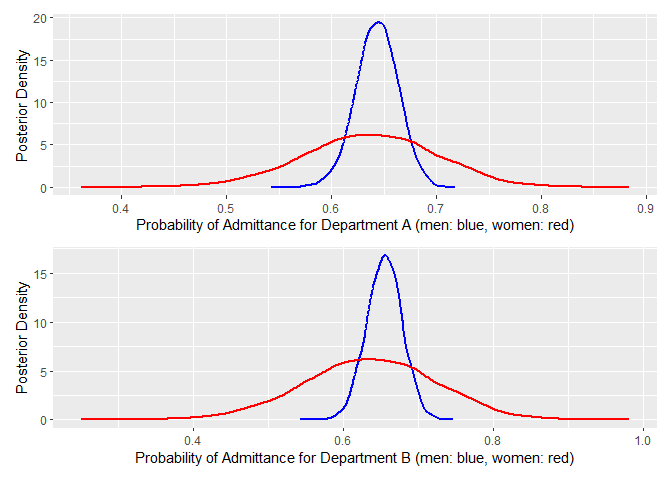<!-- -->

``` r
dens <- density(plogis(a_posterior[,1,3]))
dens_data1 <- data.frame(x = dens$x, y = dens$y)
dens <- density(plogis(a_posterior[,2,3]))
dens_data2 <- data.frame(x = dens$x, y = dens$y)
dens <- density(plogis(a_posterior[,1,4]))
dens_data3 <- data.frame(x = dens$x, y = dens$y)
dens <- density(plogis(a_posterior[,2,4]))
dens_data4 <- data.frame(x = dens$x, y = dens$y)


p1 <- ggplot(dens_data1, aes(x = x, y = y)) + 
  geom_line(linewidth = 1, color = 'blue') +
  geom_line(aes(x = dens_data2$x, y = dens_data2$y), linewidth = 1, color = 'red') +
  xlab('Probability of Admittance for Department C (men: blue, women: red)') + ylab('Posterior Density')


p2 <-  ggplot(dens_data3, aes(x = x, y = y)) + 
  geom_line(linewidth = 1, color = 'blue') +
  geom_line(aes(x = dens_data4$x, y = dens_data2$y), linewidth = 1, color = 'red') +
  xlab('Probability of Admittance for Department D (men: blue, women: red)') + ylab('Posterior Density')

(p1 + p2) + plot_layout(ncol = 1)
```

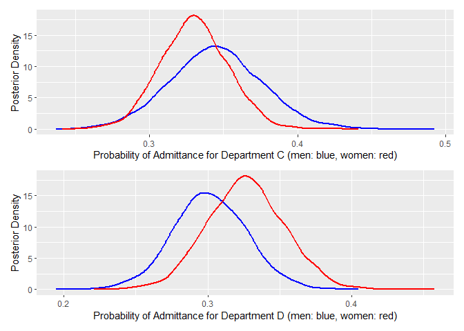<!-- -->

``` r
dens <- density(plogis(a_posterior[,1,5]))
dens_data1 <- data.frame(x = dens$x, y = dens$y)
dens <- density(plogis(a_posterior[,2,5]))
dens_data2 <- data.frame(x = dens$x, y = dens$y)
dens <- density(plogis(a_posterior[,1,6]))
dens_data3 <- data.frame(x = dens$x, y = dens$y)
dens <- density(plogis(a_posterior[,2,6]))
dens_data4 <- data.frame(x = dens$x, y = dens$y)


p1 <-  ggplot(dens_data1, aes(x = x, y = y)) + 
  geom_line(linewidth = 1, color = 'blue') +
  geom_line(aes(x = dens_data2$x, y = dens_data2$y), linewidth = 1, color = 'red') +
  xlab('Probability of Admittance for Department E (men: blue, women: red)') + ylab('Posterior Density')


p2 <-  ggplot(dens_data3, aes(x = x, y = y)) + 
  geom_line(linewidth = 1, color = 'blue') +
  geom_line(aes(x = dens_data4$x, y = dens_data2$y), linewidth = 1, color = 'red') +
  xlab('Probability of Admittance for Department F (men: blue, women: red)') + ylab('Posterior Density')

(p1 + p2) + plot_layout(ncol = 1)
```

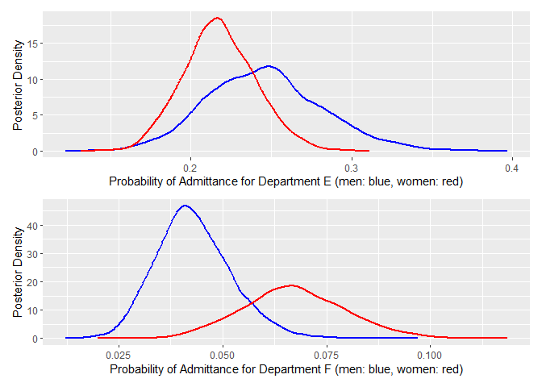<!-- -->

We see that confounding has a major influence on our estimates of the
gender effect on admission for department A. Women are no longer
advantaged. The average direct effect of gender is as follows.

``` r
a_posterior <- extract(stan_fit)$a
u_posterior <- extract(stan_fit)$u


p_male <- matrix(0, 1000, dim(u_posterior)[2])
p_female <- matrix(0, 1000, dim(u_posterior)[2])

for (i in 1:1000){
  for (j in 1:dim(u_posterior)[2]){
     p_male[i,j]   <- plogis(a_posterior[i,1,ucb_dep_long_data_conf$D[j]] + u_posterior[i,j])
     p_female[i,j] <- plogis(a_posterior[i,2,ucb_dep_long_data_conf$D[j]] + u_posterior[i,j])
  }
}

mean(p_male-p_female)
```

    ## [1] -0.007605024

``` r
sd(p_male-p_female)
```

    ## [1] 0.05628521

``` r
dens <- density(p_male)
dens_data1 <- data.frame(x = dens$x, y = dens$y)
dens <- density(p_female)
dens_data2 <- data.frame(x = dens$x, y = dens$y)

ggplot(dens_data1, aes(x = x, y = y)) + 
  geom_line(linewidth = 1, color = 'blue') +
  geom_line(aes(x = dens_data2$x, y = dens_data2$y), linewidth = 1, color = 'red') +
  xlab('Probability of Admittance (all men: blue, all women: red)') + ylab('Posterior Density')
```

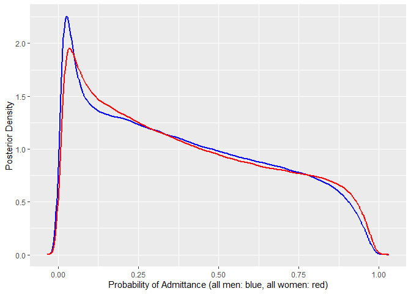<!-- -->

``` r
dens <- density(p_male-p_female)
dens_data1 <- data.frame(x = dens$x, y = dens$y)

ggplot(dens_data1, aes(x = x, y = y)) +
  geom_line(aes(x = dens_data1$x, y = dens_data1$y), linewidth = 1, color = 'blue') + geom_vline(xintercept = mean(p_male-p_female), color = "red") + xlab('Risk Difference (men - women)') + ylab('Posterior Density')
```

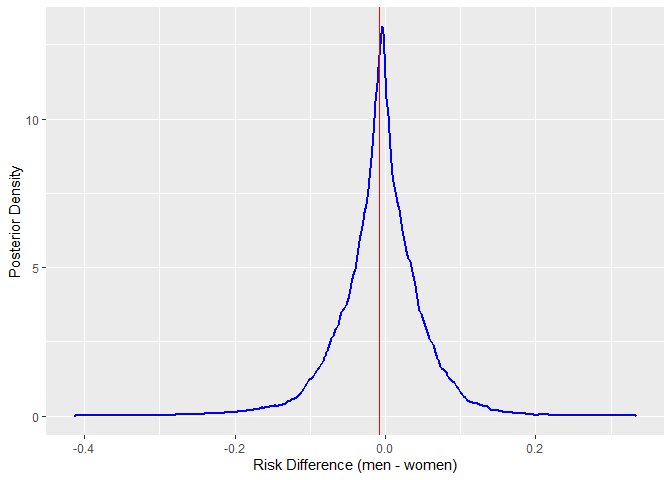<!-- -->

We see that the direct effects are now identical across genders. Of
course, we could crank up the effect of selection for department A even
a bit more and observe that women are now disadvantaged in department A.

``` r
ucb_dep_long_data_conf$g <- c(0, 2.5)
```

``` r
stan_fit <- rstan::stan(
  file  = "C:/Users/elini/Desktop/first casualty/ubc_adm_3.stan",
  data = ucb_dep_long_data_conf,
  chains = 4,
  iter = 2000,
  warmup = 1000,
  seed = 123,
  refresh = 0
)
```

``` r
a_posterior <- extract(stan_fit)$a

dens <- density(plogis(a_posterior[,1,1]))
dens_data1 <- data.frame(x = dens$x, y = dens$y)
dens <- density(plogis(a_posterior[,2,1]))
dens_data2 <- data.frame(x = dens$x, y = dens$y)
dens <- density(plogis(a_posterior[,1,2]))


ggplot(dens_data1, aes(x = x, y = y)) + 
  geom_line(linewidth = 1, color = 'blue') +
  geom_line(aes(x = dens_data2$x, y = dens_data2$y), linewidth = 1, color = 'red') +
  xlab('Probability of Admittance for Department A (men: blue, women: red)') + ylab('Posterior Density')
```

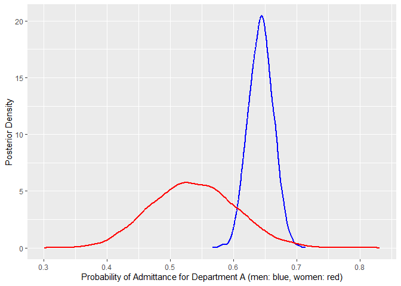<!-- -->

The average direct effect would now be as follows.

``` r
a_posterior <- extract(stan_fit)$a
u_posterior <- extract(stan_fit)$u

p_male <- matrix(0, 1000, dim(u_posterior)[2])
p_female <- matrix(0, 1000, dim(u_posterior)[2])

for (i in 1:1000){
  for (j in 1:dim(u_posterior)[2]){
     p_male[i,j]   <- plogis(a_posterior[i,1,ucb_dep_long_data_conf$D[j]] + u_posterior[i,j])
     p_female[i,j] <- plogis(a_posterior[i,2,ucb_dep_long_data_conf$D[j]] + u_posterior[i,j])
  }
}

mean(p_male-p_female)
```

    ## [1] 0.005164929

``` r
sd(p_male-p_female)
```

    ## [1] 0.0702382

``` r
dens <- density(p_male-p_female)
dens_data1 <- data.frame(x = dens$x, y = dens$y)

ggplot(dens_data1, aes(x = x, y = y)) +
  geom_line(aes(x = dens_data1$x, y = dens_data1$y), linewidth = 1, color = 'blue') + geom_vline(xintercept = mean(p_male-p_female), color = "red") + xlab('Risk Difference (men - women)') + ylab('Posterior Density')
```

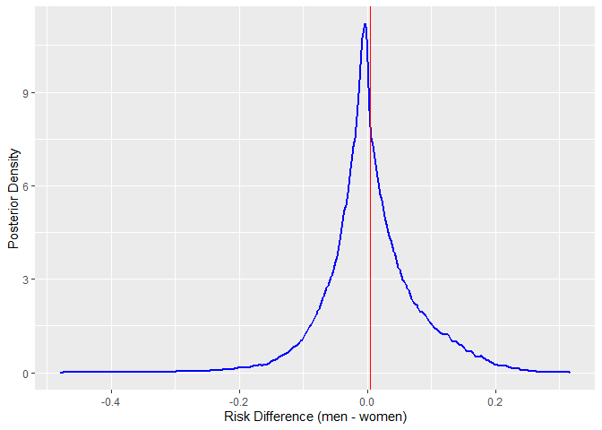<!-- -->

We would need to introduce much more unobserved confounding to shift the
overall average significantly.

## References

<div id="refs" class="references csl-bib-body hanging-indent">

<div id="ref-bickel1975sex" class="csl-entry">

Bickel, Peter J, Eugene A Hammel, and J William O’Connell. 1975. “Sex
Bias in Graduate Admissions: Data from Berkeley: Measuring Bias Is
Harder Than Is Usually Assumed, and the Evidence Is Sometimes Contrary
to Expectation.” *Science* 187 (4175): 398–404.

</div>

</div>
