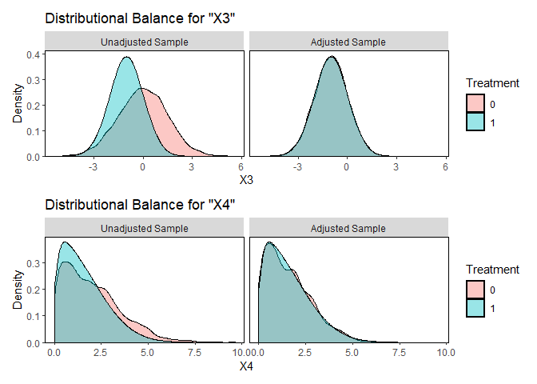
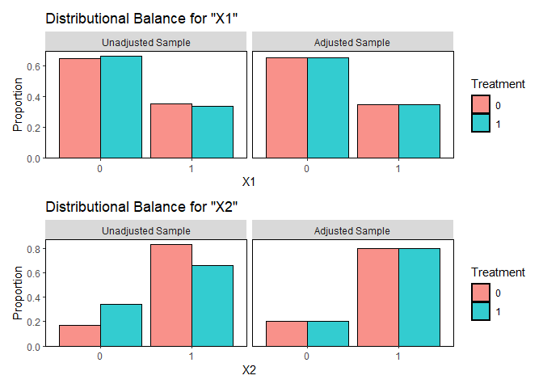
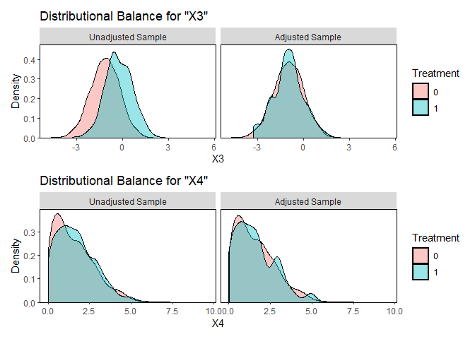
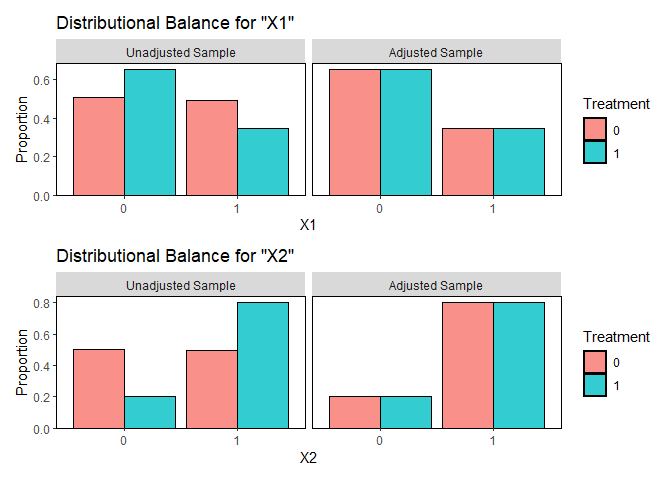
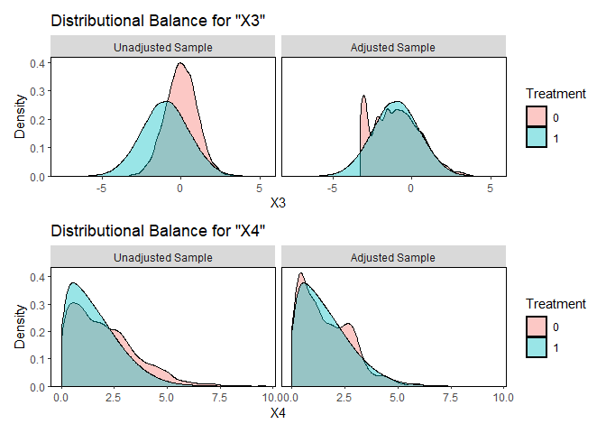
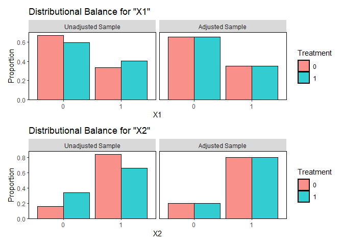
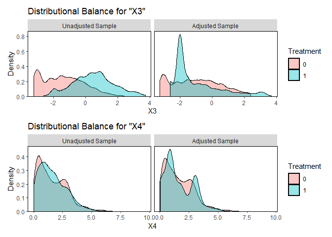

# The First Casualty of Statistics: Part Twenty
<big>**Generalization**</big>

<br/>
Jiří Fejlek

2026-09-28
<br/>

<br/> We discussed in Part Ten that when the treatment effect is
heterogeneous, the marginal effects, such as the average treatment
effect (ATE), depend on the population. Since the population of interest
often does not coincide with the population on which the treatment
effect is estimated (the tested population is often a *subsample* of the
population of interest), we have to recompute the marginal effects for
these new populations to assess the treatment effect correctly. This
process is known as *generalization*, and we will see that, at least in
principle, transferring the causal effect estimates from one population
to another is quite straightforward using the methods we already know
from previous presentations. <br/>

## Table of Contents

- [Post-stratification](#post-stratification)
- [Regression Adjustment](#regression-adjustment)
- [Weighting](#weighting)
- [Generalizing an Observational
  Study](#generalizing-an-observational-study)
- [References](#references)

``` r
library(tidyr)
library(dplyr)
library(tibble)
library(ggplot2)
library(patchwork)
library(dagitty)
library(ggdag)
library(modelsummary)
library(GGally)
library(estimatr)
library(WeightIt)
library(MatchIt)
library(cobalt)
library(mgcv)
library(marginaleffects)
```

## Post-stratification

We will first assume a case in which all covariates are discrete, i.e.,
we can separate the population into a finite number of strata. Let’s
assume, for example, 4 binary covariates (16 strata in total), for which
we generate individual expected potential outcomes as
``` math
Y(0) = 1 + 2X_1 - 0.5 X_2 + 3X_3 - 2 X_4 + X_1X_2 - 1.5X_3X_4
```
and
``` math
Y(1) = 0.75 - 0.5 X_2 + 3X_3 - X_4 + X_1X_2 + 3X_1X_2 - 1.5X_3X_4.
```

``` r
X1_values <- c(0,1)
X2_values <- c(0,1)
X3_values <- c(0,1)
X4_values <- c(0,1)

X_comb <- expand.grid(X1 = X1_values, X2 = X2_values, X3 = X3_values, X4 = X4_values)
Y0 <- numeric(16)
Y1 <- numeric(16)

for (i in 1:16){
  Y0[i] <- 1 + 2*X_comb[i,1] -0.5*X_comb[i,2]  + 3*X_comb[i,3] -2*X_comb[i,4] + X_comb[i,1]*X_comb[i,2] - 1.5* X_comb[i,3]*X_comb[i,4]
  Y1[i] <- 0.25 + Y0[i] + X_comb[i,4] + 3*X_comb[i,2]*X_comb[i,3] - 2*X_comb[i,1]
}
```

We will assume that we conducted a stratified randomized experiment
(SRE), i.e., a completely randomized experiment (CRE) within each
stratum (300 treated and 500 control individuals per stratum).

``` r
set.seed(123)
n_block <- 16
n_treat_block  <- 300
n_control_block  <- 500
n_obs_block <- n_treat_block + n_control_block

design_matrix_1 <- matrix(NA,0,9)

for (i in 1:n_block){

  reg <- X_comb[i,] %>% slice(rep(1:n(), each = n_obs_block))
  tr <-  sample(c(rep(1,n_treat_block), rep(0,n_control_block)))
  y0 <- rep(Y0[i],n_obs_block) + rnorm(n_obs_block,0,0.5)
  y1 <- rep(Y1[i],n_obs_block) + rnorm(n_obs_block,0,0.5)
  outc <- tr*y1 + (1-tr)*y0
  design_matrix_1 <- rbind(design_matrix_1, 
                           cbind(reg,rep(i,n_obs_block), tr,outc,y0,y1))
}

colnames(design_matrix_1) <- c('X1','X2', 'X3','X4','Stratum','T','Y','Y0','Y1')
head(design_matrix_1)
```

    ##       X1 X2 X3 X4 Stratum T             Y            Y0            Y1
    ## 1      0  0  0  0       1 0  0.7188526366  0.7188526366  0.9601759282
    ## 2      0  0  0  0       1 0  1.9589015245  1.9589015245  1.3444589930
    ## 3      0  0  0  0       1 1  1.0743674383  0.8756725316  1.0743674383
    ## 4      0  0  0  0       1 0  1.6903218735  1.6903218735  1.1277243688
    ## 5      0  0  0  0       1 1  1.7973968931  1.0603035446  1.7973968931
    ## 6      0  0  0  0       1 1  0.4946086131  0.8697590062  0.4946086131

The true ATE for the experiment population is as follows.

``` r
mean(design_matrix_1$Y1 - design_matrix_1$Y0)
```

    ## [1] 0.5125185

Let’s compute the simple ATE estimate first.

``` r
# ATE simple estimate
ATE_simple <- c(mean(design_matrix_1$Y[design_matrix_1$T == 1]) - mean(design_matrix_1$Y[design_matrix_1$T == 0]),
  sqrt(var(design_matrix_1$Y[design_matrix_1$T == 1])/sum(design_matrix_1$T == 1) +  var(design_matrix_1$Y[design_matrix_1$T == 0])/sum(design_matrix_1$T == 0)))
names(ATE_simple) <- c('ATE simple', 'sd')
ATE_simple
```

    ## ATE simple         sd 
    ##  0.5105942  0.0433086

Since the experimental design was stratified to balance the number of
observations in each stratum, we can estimate ATE using the Neyman
inference for SRE from Part Five, yielding a significantly smaller
standard error.

``` r
# ATE stratified estimate
n_matrix <- data.frame(n_0 = n_control_block, n_1 = n_treat_block, ratio = 1/n_block) %>% slice(rep(1:n(), each = n_block))
tstat_matrix <- matrix(0,n_block,3)
for (i in 1:n_block){
  
  treat_0 <- design_matrix_1$Y[design_matrix_1$Stratum == i & design_matrix_1$T == 0]
  treat_1 <- design_matrix_1$Y[design_matrix_1$Stratum == i & design_matrix_1$T == 1]
  
  tstat_matrix[i, 1] <- mean(treat_1) - mean(treat_0)
  tstat_matrix[i, 2] <- var(treat_0)
  tstat_matrix[i, 3] <- var(treat_1) 
}

vstat <- sum(n_matrix[,3]^2*(tstat_matrix[,2]/n_matrix[,1] + tstat_matrix[,3]/n_matrix[,2]))
tstat <- sum(n_matrix[,3]*tstat_matrix[,1])/sqrt(vstat)

ATE_strat <- c(sum(n_matrix[,3]*tstat_matrix[,1]), sqrt(vstat))
names(ATE_strat) <- c('ATE strat.', 'sd')
ATE_strat
```

    ##  ATE strat.          sd 
    ## 0.510594214 0.009058458

Now, the experimental population was artificially balanced to measure
the treatment effect as accurately as possible. However, the general
population for which we wish to apply the treatment is not. 
Let’s assume the general population consists of 100000,
and the population’s strata are as follows.

``` r
set.seed(123)
n_pop <- 100000

design_matrix_2 <-  matrix(NA,0,9)

pop_probs <- rep(1,n_block)
for (i in 2:n_block){
  pop_probs[i] <- exp(2.5*X_comb[i,1] - 0.2*X_comb[i,2]  + 0.5*X_comb[i,3] - 0.1*X_comb[i,4] + 0.25*X_comb[i,1]*X_comb[i,3])
}
pop_probs <- pop_probs/sum(pop_probs)
pop_block_counts <- rmultinom(n = 1, size = 100000, prob = pop_probs)

data.frame(Stratum = 1:16, Probability = pop_probs, Counts = pop_block_counts)
```

    ##    Stratum Probability Counts
    ## 1        1 0.007105868    689
    ## 2        2 0.086567193   8594
    ## 3        3 0.005817793    630
    ## 4        4 0.070875223   7057
    ## 5        5 0.011715596   1193
    ## 6        6 0.183262749  18034
    ## 7        7 0.009591918    987
    ## 8        8 0.150042848  14901
    ## 9        9 0.006429655    663
    ## 10      10 0.078329235   7808
    ## 11      11 0.005264156    528
    ## 12      12 0.064130554   6508
    ## 13      13 0.010600709   1080
    ## 14      14 0.165822992  16698
    ## 15      15 0.008679127    819
    ## 16      16 0.135764383  13811

Let’s simulate the ATE for this new population.

``` r
set.seed(123)

design_matrix_1_new_pop <- matrix(NA,0,6)
for (i in 1:n_block){

  reg <- X_comb[i,] %>% slice(rep(1:n(), each = pop_block_counts[i]))
  y0 <- rep(Y0[i],pop_block_counts[i]) + rnorm(pop_block_counts[i],0,0.5)
  y1 <- rep(Y1[i],pop_block_counts[i]) + rnorm(pop_block_counts[i],0,0.5)
  design_matrix_1_new_pop <- rbind(design_matrix_1_new_pop, 
                           cbind(reg,rep(i,pop_block_counts[i]),y0,y1))
}

colnames(design_matrix_1_new_pop) <- c('X1','X2', 'X3','X4','Stratum','Y0','Y1')
head(design_matrix_1_new_pop)
```

    ##       X1 X2 X3 X4 Stratum           Y0            Y1
    ## 1      0  0  0  0       1  0.719762177  0.2107553656
    ## 2      0  0  0  0       1  0.884911255  1.2042828622
    ## 3      0  0  0  0       1  1.779354157  1.8435934053
    ## 4      0  0  0  0       1  1.035254196  1.8458006343
    ## 5      0  0  0  0       1  1.064643868  0.8555183909
    ## 6      0  0  0  0       1  1.857532493  0.4761117282

``` r
mean(design_matrix_1_new_pop$Y1 - design_matrix_1_new_pop$Y0)
```

    ## [1] -0.2240439

We see that the true effect for the new population is negative; thus,
naively using the ATE estimate based on the experimental population
would be wrong.

We will use *post-stratification* to obtain a correct estimate of ATE
for this new (*target*) population
(<https://mc-stan.org/docs/stan-users-guide/poststratification.html>).
We encountered this term before in Part Five in the context of using
adjustment for discrete covariates in the CRE inference. Unfortunately,
the same term is applied to two unrelated concepts in literature.

First, we need to estimate ATE in each stratum of the experiment’s
population.

``` r
results <- data.frame(matrix(0, 16, 4))
results[,1] <- 1:16
strat <- design_matrix_1$Stratum

for (i in 1:16){
  
  results[i,2] <- mean(design_matrix_1$Y[design_matrix_1$T == 1 & strat == i]) - mean(design_matrix_1$Y[design_matrix_1$T == 0 & strat == i])
  
  results[i,3] <- sqrt(var(design_matrix_1$Y[design_matrix_1$T == 1 & strat == i])/sum(design_matrix_1$T[strat == i] == 1) +  var(design_matrix_1$Y[design_matrix_1$T == 0 & strat == i])/sum(design_matrix_1$T[strat == i] == 0))
  
  results[i,4] <- mean(design_matrix_1$Y1[strat == i] - design_matrix_1$Y0[strat == i])
} 

colnames(results) <- c('Stratum', 'ATE est','sd', 'True ATE')
results
```

    ##    Stratum    ATE est         sd   True ATE
    ## 1        1  0.2565072 0.03782971  0.2501436
    ## 2        2 -1.7849611 0.03632720 -1.7641973
    ## 3        3  0.2260241 0.03431624  0.2508587
    ## 4        4 -1.6756710 0.03609958 -1.7003776
    ## 5        5  0.2629526 0.03632098  0.2935403
    ## 6        6 -1.7874374 0.03627675 -1.7596028
    ## 7        7  3.2448882 0.03485040  3.2549485
    ## 8        8  1.2587556 0.03701940  1.2384716
    ## 9        9  1.3460389 0.03673651  1.3030818
    ## 10      10 -0.7546662 0.03741323 -0.7370822
    ## 11      11  1.2073097 0.03629272  1.2309374
    ## 12      12 -0.7258765 0.03563287 -0.7715240
    ## 13      13  1.2911267 0.03436162  1.2877210
    ## 14      14 -0.6894197 0.03686894 -0.7317387
    ## 15      15  4.2686218 0.03718086  4.2980444
    ## 16      16  2.2253144 0.03599818  2.2570716

Then, we will use observed proportions of each stratum in the target
population and reweight the ATE estimate as (Hernán and Robins 2010)
``` math
\widehat{ATE}_\text{target} = \sum_{i = 1}^S w_i \hat \tau_i,
```
where $`w_i = P_\text{target}[X \in S_i]`$ is the probability that an
individual from the target population belongs to the $`i`$-th stratum
$`S_i`$, and $`\hat \tau_i`$ is the estimate of the ATE for the $`i`$-th
stratum.

``` r
est_prob <- table(design_matrix_1_new_pop$Stratum)/length(design_matrix_1_new_pop$Stratum)
sum(est_prob*results$`ATE est`)
```

    ## [1] -0.2178181

We observe that we obtained an accurate estimate of ATE for the new
population. We will use a pairs cluster bootstrap to get the standard
errors.

``` r
set.seed(123)
n_sim <- 100
ATE_est <- numeric(n_sim)

design_matrix_1_split <- split(design_matrix_1, design_matrix_1$Stratum)

for (i in 1:n_sim){
  
  design_matrix_1_new <-  design_matrix_1 %>% group_by(Stratum) %>% slice_sample(n = 800, replace = TRUE)
  design_matrix_1_new_pop_new <-  design_matrix_1_new_pop[sample(nrow(design_matrix_1_new_pop) , rep=TRUE),]
  
  strat <- design_matrix_1_new$Stratum
  
  CATE_new <-  numeric(16)
  for (j in 1:16){
    CATE_new[j] <- mean(design_matrix_1_new$Y[design_matrix_1_new$T == 1 & design_matrix_1_new$Stratum == j]) -
      mean(design_matrix_1_new$Y[design_matrix_1_new$T == 0 & design_matrix_1_new$Stratum == j])
  } 
  
  est_prob_new <- table(design_matrix_1_new_pop_new$Stratum)/length(design_matrix_1_new_pop_new$Stratum)
  ATE_est[i] <- sum(est_prob_new*CATE_new)
}

quantile(ATE_est, c(0.025,0.975))
```

    ##       2.5%      97.5% 
    ## -0.2423899 -0.1914280

## Regression Adjustment

Post-stratification is a sound approach, but the number of strata grows
exponentially with each covariate, making it infeasible for datasets
with many covariates. In addition, we also need to discretize continuous
variables. Hence, we may need to employ regression adjustment instead
(<https://mc-stan.org/docs/stan-users-guide/poststratification.html>).

Using regression adjustment to estimate the target population average
treatment effect is pretty straightforward in principle. We need to
learn a model of the conditional treatment effect (CATE) from the
experimental data and then impute potential outcomes for the target
population to estimate the average treatment effect.

Let’s simulate new data. We will assume the following completely
randomized experiment.

``` r
set.seed(123)
n_treat <- 1000
n_control <- 2000

n_obs <- n_treat + n_control

X1 <- rbinom(n_obs,1,0.5)
X2 <- rbinom(n_obs,1,0.5)
X3 <- rnorm(n_obs,0,1.5)
X4 <- abs(rnorm(n_obs,0,2.5))

Y0 <- 1 + 2.5*X1 - 0.5*X2 + 2*X3 + X4 - 0.25*X4*X2 
Y1 <- 1.25 + Y0 - 0.25*X2 + X3 - 0.1*X4

Y0 <- Y0 + rnorm(n_obs, 0.25)
Y1 <- Y1 + rnorm(n_obs, 0.40)

T <- sample(c(rep(1,n_treat), rep(0,n_control)))
Y <- Y0
Y[T == 1] <- Y1[T == 1]

design_matrix_2<- data.frame(X1 = X1, X2 = X2, X3 = X3, X4 = X4, T = T, Y = Y, Y0 = Y0, Y1 = Y1)
head(design_matrix_2)
```

    ##   X1 X2          X3        X4 T         Y         Y0        Y1
    ## 1  0  0 -0.22546122 1.7480703 0  4.478724  4.4787238  3.396250
    ## 2  1  1 -0.49163570 2.4911288 0  3.518601  3.5186006  5.345267
    ## 3  0  0 -2.17224794 1.7318634 0 -1.925200 -1.9252000 -3.494785
    ## 4  1  1 -1.04592688 0.2587076 1  1.861016  0.3622138  1.861016
    ## 5  1  0  3.89773535 1.5096652 0 15.786363 15.7863635 18.418652
    ## 6  0  1 -0.05612252 1.5201125 0  1.056173  1.0561731  3.680998

The true treatment effect on the experiment’s population is as follows.

``` r
mean(design_matrix_2$Y1 - design_matrix_2$Y0)
```

    ## [1] 1.066458

We can estimate this effect quite accurately using the following CATE
model (we need to include the interaction between treatment and
covariates).

``` r
lm_model <- lm(Y ~ T*(X1 + X2 + X3 + X4), data = design_matrix_2)
avg_comparisons(lm_model, variable = 'T')
```

    ## 
    ##  Estimate Std. Error    z Pr(>|z|)     S 2.5 % 97.5 %
    ##      1.08     0.0395 27.3   <0.001 542.1 0.999   1.15
    ## 
    ## Term: T
    ## Type: response
    ## Comparison: 1 - 0

Next, we will generate the target population with a slightly different
distribution of covariates.

``` r
set.seed(123)
n_obs <- 100000

X1 <- rbinom(n_obs,1,0.35)
X2 <- rbinom(n_obs,1,0.8)
X3 <- rnorm(n_obs,-1,1)
X4 <- abs(rnorm(n_obs,0,2))

Y0 <- 1 + 2.5*X1 - 0.5*X2 + 2*X3 + X4 - 0.25*X4*X2 
Y1 <- 1.25 + Y0 - 0.25*X2 + X3 - 0.1*X4

Y0 <- Y0 + rnorm(n_obs, 0.25)
Y1 <- Y1 + rnorm(n_obs, 0.40)

T <- rep(0,n_obs)
Y <- Y0

design_matrix_2_new_pop<- data.frame(X1 = X1, X2 = X2, X3 = X3, X4 = X4, T = T, Y = Y, Y0 = Y0, Y1 = Y1)
head(design_matrix_2_new_pop)
```

    ##   X1 X2         X3        X4 T          Y         Y0        Y1
    ## 1  0  1 -0.7350066 0.5781602 0 -0.3594380 -0.3594380 1.1655840
    ## 2  1  1  0.8307475 1.6362740 0  6.8499886  6.8499886 8.2097316
    ## 3  0  0 -1.0593783 3.0465464 0  2.2604160  2.2604160 2.4169796
    ## 4  1  1 -1.0532094 0.8577684 0  0.6687403  0.6687403 0.6959093
    ## 5  1  1 -0.5620958 1.7746810 0  2.1406122  2.1406122 4.2646326
    ## 6  0  0  0.3374490 0.3621935 0  3.0496160  3.0496160 4.6319749

The average treatment effect on this population is much smaller.

``` r
mean(design_matrix_2_new_pop$Y1 - design_matrix_2_new_pop$Y0)
```

    ## [1] 0.03920841

To estimate this value, we impute potential outcomes and compute the
average treatment effect (using the so-called *g-computation*). We can
perform this in R extremely easily using *avg_comparisons*.

``` r
avg_comparisons(lm_model, variable = 'T', newdata = design_matrix_2_new_pop)
```

    ## 
    ##  Estimate Std. Error   z Pr(>|z|)   S   2.5 % 97.5 %
    ##    0.0664     0.0555 1.2    0.232 2.1 -0.0424  0.175
    ## 
    ## Term: T
    ## Type: response
    ## Comparison: 1 - 0

We successfully recovered the population average treatment effect. Of
course, this will be much harder in practice, since the regression
approach requires the correct specification of CATEs, i.e., crucially,
the correct specification of all interactions between the treatment and
the covariates. Post-stratification does not suffer from this, since we
estimate the treatment effect independently in each stratum. Flexible
machine learning approaches, such as random forests/boosted trees, might
help alleviate this concern. Still, the trade-off is that a reliable fit
will require much more data.

## Weighting

The last method we will cover here is weighting, such as inverse
propensity score weighting and entropy balancing. The idea is to weight
the experiment’s population so that it resembles the target population.
We can then estimate the treatment effect on the weighted experiment
population as usual (Stuart et al. 2011) and (Dahabreh et al. 2019).

First, we will unite the datasets. We will also add a new column,
*target*, to separate the populations.

``` r
design_matrix_2$target <- 0
design_matrix_2_new_pop$target <- 1
design_matrix_2_full <- rbind(design_matrix_2, design_matrix_2_new_pop)
```

Next, we will compute weights with respect to the indicator *target*.
Since we want to reweight the experiment’s population to mimic the
target population, we need to set *estimand = “ATT”*.

``` r
sample_weights <- weightit(formula = target ~ X1 + X2 + X3 + X4, data = design_matrix_2_full, method = "ebal",   estimand = "ATT", moment = 2)
bal.tab(sample_weights, un = TRUE, int = TRUE, stats = c('m', 'c', 'v'))
```

    ## Balance Measures
    ##                Type Diff.Un V.Ratio.Un Diff.Adj V.Ratio.Adj
    ## X1           Binary -0.1457          .  -0.0000           .
    ## X2           Binary  0.3042          .  -0.0000           .
    ## X3          Contin. -0.9875     0.4527  -0.0000      0.9991
    ## X4          Contin. -0.3496     0.6198  -0.0000      0.9991
    ## X1_0 * X2_0  Binary -0.1248          .  -0.0004           .
    ## X1_0 * X2_1  Binary  0.2705          .   0.0004           .
    ## X1_0 * X3   Contin. -0.6965     0.7837  -0.0110      1.0086
    ## X1_0 * X4   Contin.  0.0279     0.7027   0.0201      1.0254
    ## X1_1 * X2_0  Binary -0.1794          .   0.0004           .
    ## X1_1 * X2_1  Binary  0.0338          .  -0.0004           .
    ## X1_1 * X3   Contin. -0.4445     0.5241   0.0135      0.9752
    ## X1_1 * X4   Contin. -0.4388     0.4901  -0.0239      0.9449
    ## X2_0 * X3   Contin. -0.3272     0.3330   0.0006      0.9889
    ## X2_0 * X4   Contin. -0.8222     0.3270   0.0009      1.0057
    ## X2_1 * X3   Contin. -0.8093     0.8439  -0.0004      1.0025
    ## X2_1 * X4   Contin.  0.2122     0.7003  -0.0006      0.9972
    ## X3 * X4     Contin. -0.6661     0.3881   0.0010      0.9749
    ## 
    ## Effective sample sizes
    ##            Control Treated
    ## Unadjusted  3000.   100000
    ## Adjusted    1136.7  100000

``` r
p1 <- bal.plot(sample_weights, var = c('X1'), which = 'both')
p2 <- bal.plot(sample_weights, var = c('X2'), which = 'both')
(p1 + p2) + plot_layout(ncol = 1)
```

<!-- -->

``` r
p1 <- bal.plot(sample_weights, var = c('X3'), which = 'both')
p2 <- bal.plot(sample_weights, var = c('X4'), which = 'both')
(p1 + p2 ) + plot_layout(ncol = 1)
```

<!-- -->

We see that entropy balancing successfully weighted the original
population to look like the target population. Since the treatment
assignment was random, we can now directly estimate the treatment
effect.

``` r
lm_model_weighted <- lm(Y ~ T, data = design_matrix_2, weights  = sample_weights$weights[design_matrix_2_full$target == 0])
avg_comparisons(lm_model_weighted, variable = 'T', newdata = design_matrix_2_new_pop)
```

    ## 
    ##  Estimate Std. Error     z Pr(>|z|)   S  2.5 % 97.5 %
    ##    0.0898      0.117 0.768    0.442 1.2 -0.139  0.319
    ## 
    ## Term: T
    ## Type: response
    ## Comparison: 1 - 0

We can also add the covariates to reduce the estimator’s variance
(Dahabreh et al. 2019).

``` r
lm_model_weighted <- lm(Y ~ T*(X1 + X2 + X3 + X4), 
                        data = design_matrix_2, weights  = sample_weights$weights[design_matrix_2_full$target == 0])
avg_comparisons(lm_model_weighted, variable = 'T', newdata = design_matrix_2_new_pop)
```

    ## 
    ##  Estimate Std. Error   z Pr(>|z|)   S  2.5 % 97.5 %
    ##    0.0543     0.0389 1.4    0.163 2.6 -0.022  0.131
    ## 
    ## Term: T
    ## Type: response
    ## Comparison: 1 - 0

Let’s compute the confidence interval using a bootstrap.

``` r
set.seed(123)
n_sim <- 100
ATE_est <- numeric(n_sim)

for (i in 1:n_sim){
  
  design_matrix_2_new <-  design_matrix_2[sample(nrow(design_matrix_2) , rep=TRUE),]
  design_matrix_2_new_pop_new <-  design_matrix_2_new_pop[sample(nrow(design_matrix_2_new_pop) , rep=TRUE),]
  design_matrix_2_full_new <- rbind(design_matrix_2_new, design_matrix_2_new_pop_new)
  
  sample_weights_new <- weightit(formula = target ~ X1 + X2 + X3 + X4, 
                                 data = design_matrix_2_full_new, method = "ebal",   estimand = "ATT", moment = 2)

  lm_model_weighted_new <- lm(Y ~ T*(X1 + X2 + X3 + X4),
                              data = design_matrix_2_new,
                              weights  = sample_weights_new$weights[design_matrix_2_full_new$target == 0])
  
  ATE_est[i] <- avg_comparisons(lm_model_weighted_new, variable = 'T', newdata = design_matrix_2_new_pop_new)$estimate
}

quantile(ATE_est, c(0.025,0.975))
```

    ##        2.5%       97.5% 
    ## -0.05888215  0.17053329

## Generalizing an Observational Study

We assumed up to this point that the data on the treatment effect were
gathered from a randomized experiment. Let’s now assume that the
treatment assignment depends on observed covariates $`X`$, i.e., we are
dealing with an observational study.

First, we will modify our simulated experiment dataset to introduce a
treatment-assignment bias (while keeping the target population
unchanged).

``` r
set.seed(123)

n_obs <- n_treat + n_control

X1 <- rbinom(n_obs,1,0.5)
X2 <- rbinom(n_obs,1,0.5)
X3 <- rnorm(n_obs,0,1.5)
X4 <- abs(rnorm(n_obs,0,2.5))

Y0 <- 1 + 2.5*X1 - 0.5*X2 + 2*X3 + X4 - 0.25*X4*X2 
Y1 <- 1.25 + Y0 - 0.25*X2 + X3 - 0.1*X4

Y0 <- Y0 + rnorm(n_obs, 0.25)
Y1 <- Y1 + rnorm(n_obs, 0.40)

T <- as.numeric(runif(n_obs,0,1) <  plogis(-X2 + X3))
  
Y <- Y0
Y[T == 1] <- Y1[T == 1]

design_matrix_2_alt<- data.frame(X1 = X1, X2 = X2, X3 = X3, X4 = X4, T = T, Y = Y, Y0 = Y0, Y1 = Y1)
```

Due to the observed confounding, the naive ATE estimate is no longer
valid.

``` r
mean(design_matrix_2_alt$Y1 - design_matrix_2_alt$Y0)
```

    ## [1] 1.066458

``` r
mean(design_matrix_2_alt$Y1[design_matrix_2_alt$T == 1]) - mean(design_matrix_2_alt$Y0[design_matrix_2_alt$T == 0])
```

    ## [1] 5.216875

In terms of regression adjustment, nothing really changes. Provided that
all confounding is accounted for and we specify the outcome model
correctly, we can again estimate the CATE and impute potential outcomes
for the target population.

``` r
lm_model <- lm(Y ~ T*(X1 + X2 + X3 + X4), data = design_matrix_2_alt)
avg_comparisons(lm_model, variable = 'T', newdata = design_matrix_2_new_pop)
```

    ## 
    ##   Estimate Std. Error        z Pr(>|z|)   S  2.5 % 97.5 %
    ##  -0.000249     0.0677 -0.00368    0.997 0.0 -0.133  0.133
    ## 
    ## Term: T
    ## Type: response
    ## Comparison: 1 - 0

Weighting is a bit more involved; the first step is the same. We need to
weight the population with observed treatment effects to match the
target population.

``` r
design_matrix_2_alt$target <- 0
design_matrix_2_full_alt <- rbind(design_matrix_2_alt, design_matrix_2_new_pop)

sample_weights_alt <- weightit(formula = target ~ X1 + X2 + X3 + X4, data = design_matrix_2_full_alt, method = "ebal",   estimand = "ATT", moment = 2)
bal.tab(sample_weights_alt, un = TRUE, int = TRUE, stats = c('m', 'c', 'v'))
```

    ## Balance Measures
    ##                Type Diff.Un V.Ratio.Un Diff.Adj V.Ratio.Adj
    ## X1           Binary -0.1457          .  -0.0000           .
    ## X2           Binary  0.3042          .  -0.0000           .
    ## X3          Contin. -0.9875     0.4527  -0.0000      0.9991
    ## X4          Contin. -0.3496     0.6198  -0.0000      0.9991
    ## X1_0 * X2_0  Binary -0.1248          .  -0.0004           .
    ## X1_0 * X2_1  Binary  0.2705          .   0.0004           .
    ## X1_0 * X3   Contin. -0.6965     0.7837  -0.0110      1.0086
    ## X1_0 * X4   Contin.  0.0279     0.7027   0.0201      1.0254
    ## X1_1 * X2_0  Binary -0.1794          .   0.0004           .
    ## X1_1 * X2_1  Binary  0.0338          .  -0.0004           .
    ## X1_1 * X3   Contin. -0.4445     0.5241   0.0135      0.9752
    ## X1_1 * X4   Contin. -0.4388     0.4901  -0.0239      0.9449
    ## X2_0 * X3   Contin. -0.3272     0.3330   0.0006      0.9889
    ## X2_0 * X4   Contin. -0.8222     0.3270   0.0009      1.0057
    ## X2_1 * X3   Contin. -0.8093     0.8439  -0.0004      1.0025
    ## X2_1 * X4   Contin.  0.2122     0.7003  -0.0006      0.9972
    ## X3 * X4     Contin. -0.6661     0.3881   0.0010      0.9749
    ## 
    ## Effective sample sizes
    ##            Control Treated
    ## Unadjusted  3000.   100000
    ## Adjusted    1136.7  100000

``` r
p1 <- bal.plot(sample_weights_alt, var = c('X1'), which = 'both')
p2 <- bal.plot(sample_weights_alt, var = c('X2'), which = 'both')
(p1 + p2) + plot_layout(ncol = 1)
```

<!-- -->

``` r
p1 <- bal.plot(sample_weights_alt, var = c('X3'), which = 'both')
p2 <- bal.plot(sample_weights_alt, var = c('X4'), which = 'both')
(p1 + p2 ) + plot_layout(ncol = 1)
```

<!-- -->

However, the treatment assignment was not random, and hence, we cannot
simply compute the treatment effect.

``` r
lm_model_weighted_alt <- lm(Y ~ T, 
                        data = design_matrix_2_alt, 
                        weights  = sample_weights_alt$weights[design_matrix_2_full_alt$target == 0])
avg_comparisons(lm_model_weighted_alt, variable = 'T')
```

    ## 
    ##  Estimate Std. Error    z Pr(>|z|)     S 2.5 % 97.5 %
    ##      2.83      0.128 22.1   <0.001 355.7  2.58   3.08
    ## 
    ## Term: T
    ## Type: response
    ## Comparison: 1 - 0

Instead, we have to employ the second weighting scheme to balance the
treatment-weighted and control-weighted groups (Stuart et al. 2011) and (Dahabreh et al. 2019).
We perform this in *weightit* using *s.weights*, which substitutes in
the weights.

``` r
s_weights  = sample_weights_alt$weights[design_matrix_2_full_alt$target == 0]

observational_weights <- weightit(formula = T ~ X1 + X2 + X3 + X4, data = design_matrix_2_alt, method = "ebal",   estimand = "ATE", moments = 2, s.weights = s_weights)
bal.tab(observational_weights, un = TRUE, int = TRUE, stats = c('m', 'c', 'v'))
```

    ## Balance Measures
    ##                Type Diff.Un V.Ratio.Un Diff.Adj V.Ratio.Adj
    ## X1           Binary -0.0124          .  -0.0000           .
    ## X2           Binary -0.1706          .   0.0000           .
    ## X3          Contin.  0.9827     0.8900  -0.0000      1.0124
    ## X4          Contin.  0.0881     0.9359   0.0000      1.0124
    ## X1_0 * X2_0  Binary  0.1230          .   0.0180           .
    ## X1_0 * X2_1  Binary -0.1106          .  -0.0180           .
    ## X1_0 * X3   Contin.  0.7131     0.5920   0.0068      1.0990
    ## X1_0 * X4   Contin.  0.0848     1.0387   0.0526      1.1178
    ## X1_1 * X2_0  Binary  0.0476          .  -0.0180           .
    ## X1_1 * X2_1  Binary -0.0600          .   0.0180           .
    ## X1_1 * X3   Contin.  0.4493     0.4878  -0.0082      0.8889
    ## X1_1 * X4   Contin.  0.0009     0.9771  -0.0606      0.8167
    ## X2_0 * X3   Contin.  0.1335     0.8499  -0.1637      1.7486
    ## X2_0 * X4   Contin.  0.3238     1.9275  -0.0230      0.9478
    ## X2_1 * X3   Contin.  0.9731     0.5536   0.1130      0.8023
    ## X2_1 * X4   Contin. -0.1560     0.9580   0.0171      1.0134
    ## X3 * X4     Contin.  0.5965     0.6680  -0.1126      1.2084
    ## 
    ## Effective sample sizes
    ##            Control Treated
    ## Unadjusted  854.    341.33
    ## Adjusted   1004.23   75.6

``` r
p1 <- bal.plot(observational_weights, var = c('X1'), which = 'both')
p2 <- bal.plot(observational_weights, var = c('X2'), which = 'both')
(p1 + p2) + plot_layout(ncol = 1)
```

<!-- -->

``` r
p1 <- bal.plot(observational_weights, var = c('X3'), which = 'both')
p2 <- bal.plot(observational_weights, var = c('X4'), which = 'both')
(p1 + p2 ) + plot_layout(ncol = 1)
```

<!-- -->

Finally, we obtain the average treatment effect on the target population
by multiplying the *sample weights* (balancing with respect to the
target population) and the *observational weights* (balancing the
treatment and control groups).

``` r
lm_model_weighted_alt <- lm(Y ~ T, 
                        data = design_matrix_2_alt, 
                        weights  = observational_weights$weights*s_weights)
avg_comparisons(lm_model_weighted_alt, variable = 'T', newdata = design_matrix_2_new_pop)
```

    ## 
    ##  Estimate Std. Error    z Pr(>|z|)   S  2.5 % 97.5 %
    ##     0.108      0.107 1.01    0.311 1.7 -0.101  0.317
    ## 
    ## Term: T
    ## Type: response
    ## Comparison: 1 - 0

Again, we can also employ regression adjustment to reduce the standard
error.

``` r
lm_model_weighted_alt <- lm(Y ~ T*(X1+X2+X3+X4), 
                        data = design_matrix_2_alt, 
                        weights  = observational_weights$weights*s_weights)
avg_comparisons(lm_model_weighted_alt, variable = 'T', newdata = design_matrix_2_new_pop)
```

    ## 
    ##  Estimate Std. Error    z Pr(>|z|)   S  2.5 % 97.5 %
    ##     0.108     0.0346 3.12  0.00179 9.1 0.0402  0.176
    ## 
    ## Term: T
    ## Type: response
    ## Comparison: 1 - 0

Let’s bootstrap the result.

``` r
set.seed(123)
n_sim <- 100
ATE_est <- numeric(n_sim)

for (i in 1:n_sim){
  
  design_matrix_2_new <-  design_matrix_2_alt[sample(nrow(design_matrix_2_alt) , rep=TRUE),]
  design_matrix_2_new_pop_new <-  design_matrix_2_new_pop[sample(nrow(design_matrix_2_new_pop) , rep=TRUE),]
  design_matrix_2_full_new <- rbind(design_matrix_2_new, design_matrix_2_new_pop_new)
  
  sample_weights_new<- weightit(formula = target ~ X1 + X2 + X3 + X4, 
                                data = design_matrix_2_full_new, method = "ebal",   estimand = "ATT", moment = 2)
  
  s_weights_new  = sample_weights_new$weights[design_matrix_2_full_new$target == 0]
  
  observational_weights_new <- weightit(formula = T ~ X1 + X2 + X3 + X4, data = design_matrix_2_new, 
                                    method = "ebal",   estimand = "ATE", moments = 2, s.weights = s_weights_new)
  

  lm_model_weighted_new <- lm(Y ~ T*(X1 + X2 + X3 + X4),
                              data = design_matrix_2_new,
                              weights  = observational_weights_new$weights*s_weights_new)
  ATE_est[i] <- avg_comparisons(lm_model_weighted_new, variable = 'T', newdata = design_matrix_2_new_pop_new)$estimate
}

quantile(ATE_est, c(0.025,0.975))
```

    ##        2.5%       97.5% 
    ## -0.04789964  0.23441818

One thing to note is that the original population size for the
experiment was 3000. Notice that after double-weighting, the effective
sample size is only about 400, and only 75 in the treated group! The
cost for double weighting was quite high indeed. We should also note
that this scenario was designed to be very favorable: the population on
which the experiment was conducted nicely overlapped with the target
population (see $`X_3`$ in particular, where the target population has a
much narrower distribution).

Let’s, for illustration, switch the variances of $`X_3`$ between the
experiment’s population and the target population.

``` r
set.seed(123)
n_obs <- n_treat + n_control

X1 <- rbinom(n_obs,1,0.5)
X2 <- rbinom(n_obs,1,0.5)
X3 <- rnorm(n_obs,0,1)
X4 <- abs(rnorm(n_obs,0,2.5))

Y0 <- 1 + 2.5*X1 - 0.5*X2 + 2*X3 + X4 - 0.25*X4*X2 
Y1 <- 1.25 + Y0 - 0.25*X2 + X3 - 0.1*X4

Y0 <- Y0 + rnorm(n_obs, 0.25)
Y1 <- Y1 + rnorm(n_obs, 0.40)

T <- as.numeric(runif(n_obs,0,1) <  plogis(-X2 + X3))
  
Y <- Y0
Y[T == 1] <- Y1[T == 1]

design_matrix_3 <- data.frame(X1 = X1, X2 = X2, X3 = X3, X4 = X4, T = T, Y = Y, Y0 = Y0, Y1 = Y1)
```

``` r
set.seed(123)
n_obs <- 100000

X1 <- rbinom(n_obs,1,0.35)
X2 <- rbinom(n_obs,1,0.8)
X3 <- rnorm(n_obs,-1,1.5)
X4 <- abs(rnorm(n_obs,0,2))

Y0 <- 1 + 2.5*X1 - 0.5*X2 + 2*X3 + X4 - 0.25*X4*X2 
Y1 <- 1.25 + Y0 - 0.25*X2 + X3 - 0.1*X4

Y0 <- Y0 + rnorm(n_obs, 0.25)
Y1 <- Y1 + rnorm(n_obs, 0.40)

T <- rep(0,n_obs)
Y <- Y0

design_matrix_3_new_pop<- data.frame(X1 = X1, X2 = X2, X3 = X3, X4 = X4, T = T, Y = Y, Y0 = Y0, Y1 = Y1)
```

We can immediately notice that the overlap with respect to $`X_3`$ is
much worse.

``` r
design_matrix_3$target <- 0
design_matrix_3_new_pop$target <- 1
design_matrix_3_full <- rbind(design_matrix_3, design_matrix_3_new_pop)

sample_weights <- weightit(formula = target ~ X1 + X2 + X3 + X4, data = design_matrix_3_full, method = "ebal",   estimand = "ATT", moment = 2)
bal.tab(sample_weights, un = TRUE, int = TRUE, stats = c('m', 'c', 'v'))
```

    ## Balance Measures
    ##                Type Diff.Un V.Ratio.Un Diff.Adj V.Ratio.Adj
    ## X1           Binary -0.1457          .   0.0000           .
    ## X2           Binary  0.3042          .   0.0000           .
    ## X3          Contin. -0.6574     2.2918  -0.0000      0.9955
    ## X4          Contin. -0.3496     0.6198  -0.0000      0.9955
    ## X1_0 * X2_0  Binary -0.1248          .   0.0019           .
    ## X1_0 * X2_1  Binary  0.2705          .  -0.0019           .
    ## X1_0 * X3   Contin. -0.4981     3.4026   0.0833      0.9180
    ## X1_0 * X4   Contin.  0.0279     0.7027   0.0228      1.0042
    ## X1_1 * X2_0  Binary -0.1794          .  -0.0019           .
    ## X1_1 * X2_1  Binary  0.0338          .   0.0019           .
    ## X1_1 * X3   Contin. -0.3379     2.0762  -0.1075      1.2880
    ## X1_1 * X4   Contin. -0.4388     0.4901  -0.0271      0.9610
    ## X2_0 * X3   Contin. -0.2525     1.2712  -0.0692      1.2313
    ## X2_0 * X4   Contin. -0.8222     0.3270   0.0143      1.0808
    ## X2_1 * X3   Contin. -0.5643     3.8819   0.0385      0.9723
    ## X2_1 * X4   Contin.  0.2122     0.7003  -0.0096      0.9757
    ## X3 * X4     Contin. -0.4806     1.6775  -0.0114      1.0085
    ## 
    ## Effective sample sizes
    ##            Control Treated
    ## Unadjusted 3000.    100000
    ## Adjusted    222.52  100000

``` r
p1 <- bal.plot(sample_weights, var = c('X1'), which = 'both')
p2 <- bal.plot(sample_weights, var = c('X2'), which = 'both')
(p1 + p2) + plot_layout(ncol = 1)
```

<!-- -->

``` r
p1 <- bal.plot(sample_weights, var = c('X3'), which = 'both')
p2 <- bal.plot(sample_weights, var = c('X4'), which = 'both')
(p1 + p2 ) + plot_layout(ncol = 1)
```

<!-- -->

This is because the target population consists of individuals with
$`X_3`$ who are not present in the original sample. Entropy balancing
fixes the moments by inflating the extreme observations in terms of
$`X_3`$, but it cannot solve the fundamental lack of overlap. No
weighting method can.

If we proceed anyway, we get the following.

``` r
s_weights  = sample_weights$weights[design_matrix_3_full$target == 0]

observational_weights <- weightit(formula = T ~ X1 + X2 + X3 + X4, data = design_matrix_3, method = "ebal",   estimand = "ATE", moments = 2, s.weights = s_weights)
bal.tab(observational_weights, un = TRUE, int = TRUE, stats = c('m', 'c', 'v'))
```

    ## Balance Measures
    ##                Type Diff.Un V.Ratio.Un Diff.Adj V.Ratio.Adj
    ## X1           Binary  0.0710          .  -0.0000           .
    ## X2           Binary -0.1808          .   0.0000           .
    ## X3          Contin.  1.4467     0.9965   0.0000      1.0657
    ## X4          Contin.  0.0186     0.8718  -0.0000      1.0657
    ## X1_0 * X2_0  Binary  0.0986          .  -0.0543           .
    ## X1_0 * X2_1  Binary -0.1696          .   0.0543           .
    ## X1_0 * X3   Contin.  1.1244     0.5181   0.0580      0.8070
    ## X1_0 * X4   Contin. -0.0312     0.9368  -0.0438      0.9877
    ## X1_1 * X2_0  Binary  0.0822          .   0.0543           .
    ## X1_1 * X2_1  Binary -0.0112          .  -0.0543           .
    ## X1_1 * X3   Contin.  0.6509     1.2564  -0.0754      1.8391
    ## X1_1 * X4   Contin.  0.0570     0.9765   0.0507      1.2034
    ## X2_0 * X3   Contin.  0.4078     1.5398  -0.1866      1.8542
    ## X2_0 * X4   Contin.  0.3640     2.1149   0.1813      1.8708
    ## X2_1 * X3   Contin.  1.3196     0.6127   0.1160      0.9445
    ## X2_1 * X4   Contin. -0.2428     0.8656  -0.1298      0.9282
    ## X3 * X4     Contin.  1.0371     0.6073   0.0592      1.0779
    ## 
    ## Effective sample sizes
    ##            Control Treated
    ## Unadjusted  138.1   514.71
    ## Adjusted    198.97   15.07

``` r
p1 <- bal.plot(observational_weights, var = c('X1'), which = 'both')
p2 <- bal.plot(observational_weights, var = c('X2'), which = 'both')
(p1 + p2) + plot_layout(ncol = 1)
```

<!-- -->

``` r
p1 <- bal.plot(observational_weights, var = c('X3'), which = 'both')
p2 <- bal.plot(observational_weights, var = c('X4'), which = 'both')
(p1 + p2 ) + plot_layout(ncol = 1)
```

<!-- -->

We see that our adjusted population is decimated; we have effectively
only 15 observations from 1000 in the treated group! Consequently, the
estimated average treatment effect is noticeably biased.

``` r
lm_model_weighted <- lm(Y ~ T, 
                        data = design_matrix_3, 
                        weights  = observational_weights$weights*s_weights)
avg_comparisons(lm_model_weighted, variable = 'T', newdata = design_matrix_3_new_pop)
```

    ## 
    ##  Estimate Std. Error    z Pr(>|z|)   S  2.5 % 97.5 %
    ##     0.402      0.159 2.52   0.0117 6.4 0.0896  0.714
    ## 
    ## Term: T
    ## Type: response
    ## Comparison: 1 - 0

``` r
mean(design_matrix_3_new_pop$Y1 - design_matrix_3_new_pop$Y0)
```

    ## [1] 0.04181615

If we skip weighting and use regression adjustment, everything appears
fine.

``` r
lm_model <- lm(Y ~ T*(X1 + X2 + X3 + X4), data = design_matrix_3)
avg_comparisons(lm_model, variable = 'T', newdata = design_matrix_3_new_pop)
```

    ## 
    ##  Estimate Std. Error      z Pr(>|z|)   S  2.5 % 97.5 %
    ##   0.00196     0.0718 0.0273    0.978 0.0 -0.139  0.143
    ## 
    ## Term: T
    ## Type: response
    ## Comparison: 1 - 0

But this is only because our outcome model was linear; hence, it just happens to be correctly specified. Thus, our imputation of the potential outcomes is correct. But crucially, this imputation is an *extrapolation* due to the lack of overlap for $`X_3`$. We cannot rely on the fact that such extrapolation of potential outcomes would be correct in general.
Consequently, this regression estimate would be too unreliable in practice.

## References

<div id="refs" class="references csl-bib-body hanging-indent">

<div id="ref-dahabreh2019generalizing" class="csl-entry">

Dahabreh, Issa J, Sarah E Robertson, Eric J Tchetgen, Elizabeth A
Stuart, and Miguel A Hernán. 2019. “Generalizing Causal Inferences from
Individuals in Randomized Trials to All Trial-Eligible Individuals.”
*Biometrics* 75 (2): 685–94.

</div>

<div id="ref-hernan2010causal" class="csl-entry">

Hernán, Miguel A, and James M Robins. 2010. *Causal Inference*. CRC Boca
Raton, FL.

</div>

<div id="ref-stuart2011use" class="csl-entry">

Stuart, Elizabeth A, Stephen R Cole, Catherine P Bradshaw, and Philip J
Leaf. 2011. “The Use of Propensity Scores to Assess the Generalizability
of Results from Randomized Trials.” *Journal of the Royal Statistical
Society Series A: Statistics in Society* 174 (2): 369–86.

</div>

</div>