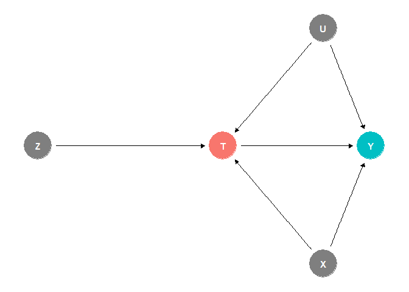
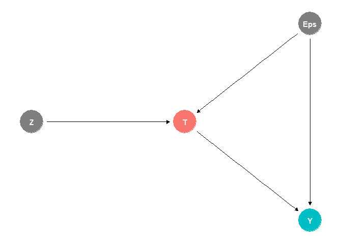
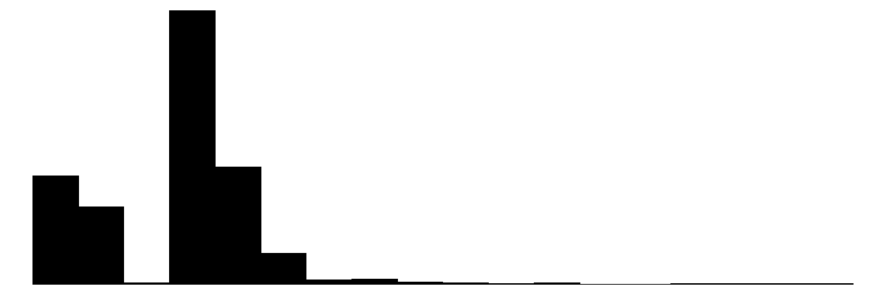
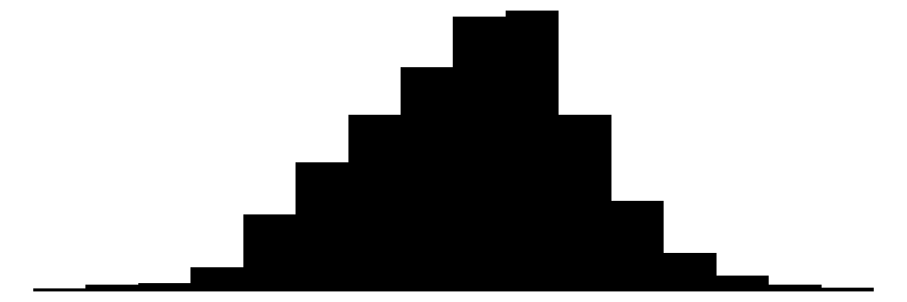
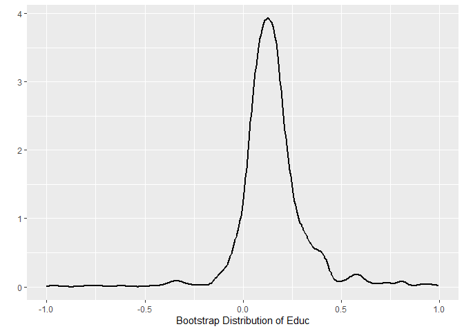
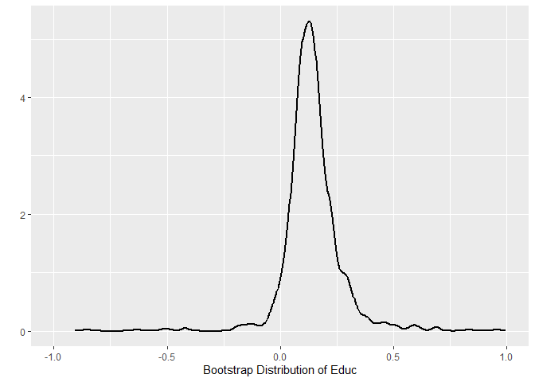
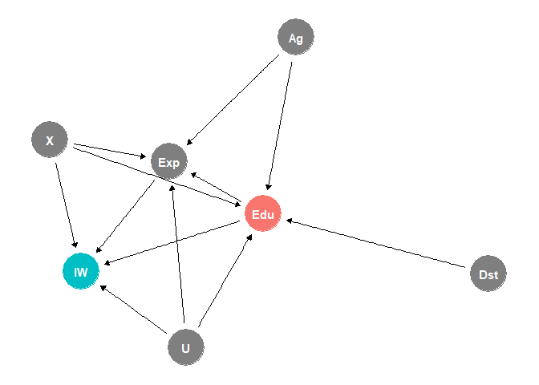

# The First Casualty of Statistics: Part Twenty One
<big>**Two-Stage Least Squares**</big>

<br/>
Jiří Fejlek

2026-09-31
<br/>

<br/> When discussing compliance in Part Sixteen, we computed the local
average treatment effect (LATE) using the Wald estimator, also known as
the *instrumental variable* (IV) estimator. The term instrumental
variable (or simply an *instrument*) refers to a particular variable in
the model. An instrument is a variable that causes the treatment but has
no direct effect on the outcome, and, as we will see, it can be used to
estimate the treatment effect even when unobserved confounding is
present. Here, we will focus particularly on *two-stage least squares*,
a popular method based on linear regression. <br/>

## Table of Contents

- [Instrumental Variables](#instrumental-variables)
- [Linear Instrumental Variable
  Model](#linear-instrumental-variable-model)
- [Two-Stage Least Squares](#two-stage-least-squares)
- [David Card’s Dataset](#david-cards-dataset)
- [Post-Treatment Variable Bias in
  2SLS](#post-treatment-variable-bias-in-2sls)
- [References](#references)

``` r
library(tidyr)
library(dplyr)
library(tibble)
library(ggplot2)
library(patchwork)
library(dagitty)
library(ggdag)
library(modelsummary)
library(GGally)
library(estimatr)
library(WeightIt)
library(MatchIt)
library(cobalt)
library(mgcv)
library(marginaleffects)
```

## Instrumental Variables

Let’s assume a treatment $`T`$, an outcome $`Y`$, observed confounders
$`X`$, and unobserved confounders $`U`$. We will also assume an
instrumental variable (IV) $`Z`$ that causes $`T`$, but it is
unconfounded with $`X`$ and $`U`$ (in practice, we ideally want $`Z`$ to
be close to randomized) (Ding 2024).

Overall, we get the following DAG.

``` r
dag <- dagify(Y ~ T + X + U, T ~  Z + X + U,  exposure = 'T', outcome = 'Y')
ggdag_status(dag) + theme_dag() + theme(legend.position = "none")
```

<!-- -->

We encountered this DAG before, when we discussed the problem of
estimating treatment effects in the presence of noncompliance. In this
example, $`Z`$ denotes the treatment assignment, and $`T`$ denotes the
actual treatment status of individuals. Another example we discussed in
Part Sixteen was the problem of estimating buyers’ spending after they
were sent an advertising email.

(Ding 2024) summarizes several other famous examples of exploiting this
particular causal structure to determine the treatment causal effect.
For example, (Hearst et al. 1986) reported that men with low Vietnam Era
draft lottery numbers had higher mortality rates afterward. Since
lottery numbers are assigned randomly and men with lower lottery numbers
are more likely to have served in the military, the authors attributed
this to the negative effect of military service. (Angrist and Krueger
1991) used the quarter of birth as the IV to estimate the return of
schooling in years on earnings. This works because the quarter of birth
is (pseudo)randomized, and people born early in the year start school
later and can legally drop out with fewer total years of schooling.
Another famous example is from (Card 1993), in which David Card studied
the effect of schooling on wages, using the geographic variation in
college proximity as an IV (although, as (Ding 2024) notes, this IV
might be invalid, since where a subject grew up might be confounded with
the outcome).

## Linear Instrumental Variable Model

Let us assume the true generating process for the outcome
``` math
Y =  T\beta + \varepsilon
```
and an instrument $`Z`$.

``` r
dag <- dagify(Y ~ T + Eps, T ~  Eps + Z,  exposure = 'T', outcome = 'Y')
ggdag_status(dag) + theme_dag() + theme(legend.position = "none")
```

<!-- -->

Let $`T`$ and $`Z`$ have the same rank (just-identified case). Since,
$`\mathbb{E}Z^T\varepsilon = 0`$, we get (Ding 2024)
``` math
\mathbb{E}Z^T\varepsilon =  \mathbb{E}Z^T(Y-T\beta) = 0
```
and hence,
``` math
\mathbb{E}Z^TY = \mathbb{E}Z^TT\beta.
```
Consequently, we can estimate $`\beta`$ as
``` math
\beta = (\mathbb{E}Z^TT)^{-1}\mathbb{E}Z^TY,
```
if $`\mathbb{E}ZT`$ is invertible. For $`T`$ and $`Z`$ both scalar, we
get (Ding 2024)
``` math
\beta = \frac{\text{Cov}(Z, Y)}{\text{Cov}(Z, T)} = \frac{\text{Cov}(Z, Y)/\text{Var }Z}{\text{Cov}(Z, T)/\text{Var }Z},
```
i.e., $`\beta`$ equals the ratio between the coefficients of $`Z`$ in
the linear regressions $`Y`$ on $`Z`$ and $`T`$ on $`Z`$. If $`Z`$ is
binary, these coefficients are equal to differences in means (Ding 2024)
``` math
\beta = \frac{\mathbb{E}(Y \mid Z = 1) - \mathbb{E}(Y \mid Z = 0)}{\mathbb{E}(T \mid Z = 1) - \mathbb{E}(T \mid Z = 0)}.
```
We recovered the LATE estimator from Part Sixteen.

Let’s demonstrate the estimator on some simulated data.

``` r
set.seed(123)
n_sample <- 1000

epsilon <- rt(n_sample, 5)                             # unobserved confounder
Z <- rnorm(n_sample,0,1)                               # instrumental variable    

T <- 0.25*Z + 0.5*epsilon + rnorm(n_sample,0,0.25)     # treatment
Y <- 1 + 2*T - 2.5*epsilon + rnorm(n_sample,0,1.5)     # outcome
```

We see that the naive estimate is clearly biased due to unobserved
confounding.

``` r
summary(lm(Y~T))
```

    ## 
    ## Call:
    ## lm(formula = Y ~ T)
    ## 
    ## Residuals:
    ##     Min      1Q  Median      3Q     Max 
    ## -6.3503 -1.4769  0.0206  1.4423  7.1424 
    ## 
    ## Coefficients:
    ##             Estimate Std. Error t value Pr(>|t|)    
    ## (Intercept)  1.02761    0.06849   15.00   <2e-16 ***
    ## T           -1.95538    0.09141  -21.39   <2e-16 ***
    ## ---
    ## Signif. codes:  0 '***' 0.001 '**' 0.01 '*' 0.05 '.' 0.1 ' ' 1
    ## 
    ## Residual standard error: 2.162 on 998 degrees of freedom
    ## Multiple R-squared:  0.3144, Adjusted R-squared:  0.3137 
    ## F-statistic: 457.6 on 1 and 998 DF,  p-value: < 2.2e-16

The instrumental variable estimator is unbiased.

``` r
coefficients(lm(Y~Z))[2]/coefficients(lm(T~Z))[2]
```

    ##        Z 
    ## 2.144008

We can obtain the confidence interval via a bootstrap.

``` r
n_sim <- 1000
model_matrix <- data.frame(T = T, Y = Y, epsilon = epsilon, Z = Z)
iv_est <- numeric(n_sim)

for (i in 1:n_sim){
  
  model_matrix_new <-  model_matrix[sample(nrow(model_matrix) , rep=TRUE),]
  iv_est[i] <- coefficients(lm(Y~Z, data = model_matrix_new))[2]/coefficients(lm(T~Z, data = model_matrix_new))[2]
}

quantile(iv_est, c(0.025,0.975))
```

    ##     2.5%    97.5% 
    ## 1.229229 3.328844

One important condition for this procedure is that the correlation
between the instrument and the treatment be sufficiently strong. If the
correlation is *weak*, e.g.,

``` r
set.seed(123)
n_sample <- 1000

epsilon <- rt(n_sample, 5)                             # unobserved confounder
Z <- rnorm(n_sample,0,1)                               # instrumental variable    

T <- 0.05*Z + 0.5*epsilon + rnorm(n_sample,0,0.25)     # treatment
Y <- 1 + 2*T - 2.5*epsilon + rnorm(n_sample,0,1.5)     # outcome
```

the estimator will be too inaccurate to be useful.

``` r
n_sim <- 1000
model_matrix <- data.frame(T = T, Y = Y, epsilon = epsilon, Z = Z)
iv_est <- numeric(n_sim)

for (i in 1:n_sim){
  
  model_matrix_new <-  model_matrix[sample(nrow(model_matrix) , rep=TRUE),]
  iv_est[i] <- coefficients(lm(Y~Z, data = model_matrix_new))[2]/coefficients(lm(T~Z, data = model_matrix_new))[2]
}

results <- c(coefficients(lm(Y~Z))[2]/coefficients(lm(T~Z))[2], quantile(iv_est, c(0.025,0.975)))
names(results) <- c('Estimate', '2.5%', '97.5%')
results
```

    ##   Estimate       2.5%      97.5% 
    ##  2.6942559 -0.6319363 19.7147297

We can include the observed confounder covariates to improve the
precision. Let’s assume the following data.

``` r
set.seed(123)

epsilon <- 0.25*rt(n_sample, 5)                                                   # unobserved confounder
X1 <- rbinom(n_sample,1,0.25)                                                     # observed confounders
X2 <- rnorm(n_sample,0,1.5)
X3 <- abs(rnorm(n_sample,0,0.5))

Z <- rnorm(n_sample,0,1)                                                          # instrumental variable    

T <- 0.25*Z + 0.5*epsilon + X1 - 0.25*X3 + rnorm(n_sample,0,0.25)                 # treatment
Y <- 1 + 2*T - 2.5*epsilon - 5*X1 + 0.5*X2 + 1.5*X3 + rnorm(n_sample,0,1.5)       # outcome
```

If we ignore the observed confounders, we get the following IV
estimator.

``` r
n_sim <- 1000
model_matrix <- data.frame(T = T, Y = Y, epsilon = epsilon, Z = Z, X1 = X1, X2 = X2, X3 = X3)
iv_est <- numeric(n_sim)

for (i in 1:n_sim){
  
  model_matrix_new <-  model_matrix[sample(nrow(model_matrix) , rep=TRUE),]
  iv_est[i] <- coefficients(lm(Y~Z, data = model_matrix_new))[2]/coefficients(lm(T~Z, data = model_matrix_new))[2]
}

results <- c(coefficients(lm(Y~Z))[2]/coefficients(lm(T~Z))[2], quantile(iv_est, c(0.025,0.975)))
names(results) <- c('Estimate', '2.5%', '97.5%')
results
```

    ## Estimate     2.5%    97.5% 
    ## 3.050565 2.107402 4.257024

After we include the observed covariates in both regressions, we obtain
estimates with increased precision.

``` r
n_sim <- 1000
model_matrix <- data.frame(T = T, Y = Y, epsilon = epsilon, Z = Z, X1 = X1, X2 = X2, X3 = X3)
iv_est <- numeric(n_sim)

for (i in 1:n_sim){
  
  model_matrix_new <-  model_matrix[sample(nrow(model_matrix) , rep=TRUE),]
  iv_est[i] <- coefficients(lm(Y~Z+X1+X2+X3, data = model_matrix_new))[2]/coefficients(lm(T~Z, data = model_matrix_new))[2]
}

results <- c(coefficients(lm(Y~Z+X1+X2+X3))[2]/coefficients(lm(T~Z+X1+X2+X3))[2], quantile(iv_est, c(0.025,0.975)))
names(results) <- c('Estimate', '2.5%', '97.5%')
results
```

    ## Estimate     2.5%    97.5% 
    ## 1.956884 1.760321 2.947497

## Two-Stage Least Squares

Let’s consider a more complex case in which we have more than one
instrument and possibly more than one treatment variable of interest (we
assume that we have at least as many instruments as treatment variables;
otherwise, the system is *under-identified* and $`\beta`$ is not
unique).

If this is the case, we can use the two-stage least squares (2SLS)
method to estimate $`\beta`$. The method has, as the name would suggest,
two stages (Ding 2024).

- Perform linear regression $`T \sim Z`$ and obtain predictions
  $`\hat T`$
- Perform linear regression $`Y \sim \hat T`$ and obtain the
  coefficient $`\hat \beta`$

This estimator works since
``` math
\hat\beta_\text{2SLS} = (\hat T^T \hat T)^{-1}\hat T^TY = (\hat T^T \hat T)^{-1}\hat T^T(T\beta + \varepsilon) = \beta + (\hat T^T \hat T)^{-1}\hat T^T \varepsilon,
```

where we used that
$`\hat T^T T =  \hat T^T (\hat T^T + \tilde \varepsilon) = \hat T^T \hat T`$.
These equations hold because $`\tilde \varepsilon`$ is a residual from
the linear regression and is therefore orthogonal to the model’s
predictions.

Let us denote the projection matrix for the first-stage regression by
$`\Gamma`$, i.e., $`\hat T = \Gamma Z`$. The bias term we derived meets
``` math
(\hat T^T \hat T)^{-1}\hat T \varepsilon =  ((\Gamma Z)^T \Gamma Z)^{-1} Z^T\Gamma^T  \varepsilon = (Z^T \Gamma Z)^{-1}Z^T \Gamma \varepsilon = \left(\frac{1}{n}Z^T \Gamma Z\right)^{-1}\frac{1}{n}Z^T \Gamma \varepsilon
```
We used the fact that $`\Gamma`$ is a projection matrix, and thus it is
symmetric ($`\Gamma^T = \Gamma`$) and idempotent
($`\Gamma\Gamma = \Gamma`$). In addition,  
``` math
\left(\frac{1}{n}Z^T \Gamma Z\right)^{-1} = \left(\frac{1}{n}Z^TZ(Z^TZ)^{-1}Z^TZ\right)^{-1} \rightarrow Q^{-1}
```
for $`n \rightarrow + \infty`$, where $`Q`$ is the correlation matrix of
instruments $`Z`$. Moreover,
``` math
\frac{1}{n}Z^T\Gamma \varepsilon \rightarrow 0
```
for $`n \rightarrow + \infty`$, since $`Z`$ is uncorrelated with
$`\varepsilon`$. Consequently, the bias term goes to zero as $`n`$
increases; $`\hat\beta_\text{2SLS}`$ is a consistent estimator of
$`\beta`$.

We should note that when we use 2SLS for one treatment variable and one
instrument, 2SLS reduces to the IV estimator
``` math
\hat \beta = \frac{\text{Cov}(Z, Y)}{\text{Cov}(Z, T)},
```
we derived earlier (Ding 2024).

## David Card’s Dataset

We will have a look at the famous (Card 1993) dataset, which was used to
estimate the effect of education on wages. As we mentioned in the
introduction, the instrumental variable used was college proximity. The
variables in the dataset are as follows
(<https://www.rdocumentation.org/packages/ivmodel/versions/1.9.1/topics/card.data>):

- **id**: person identifier
- **nearc2**: (1: near 2 yr college, 1966, 0: no)
- **nearc4**: (1: near 4 yr college, 1966, 0: no)
- **educ**: years of schooling, 1976
- **age**: in years
- **fatheduc**: father’s schooling
- **motheduc**: mother’s schooling
- **weight**: National Longitudinal Surveys sampling weight, 1976
- **momdad14**: (1: live with mom, dad at 14, 0: no)
- **sinmom14**: (1: with single mom at 14, 0: no)
- **step14**: (1: if with step parent at 14, 0: no)
- **reg661**: (1: region 1, 1966, 0: no)
- **reg662**: (1: region 2, 1966, 0: no)
- **reg663**: (1: region 3, 1966, 0: no)
- **reg664**: (1: region 4, 1966, 0: no)
- **reg665**: (1: region 5, 1966, 0: no)
- **reg666**: (1: region 6, 1966, 0: no)
- **reg667**: (1: region 7, 1966, 0: no)
- **reg668**: (1: region 8, 1966, 0: no)
- **reg669**: (1: region 9, 1966, 0: no)
- **south66**: (1: south in 1966, 0: no)
- **black**: (1: black, 0: no)
- **smsa**: (1: in SMSA, 1976, 0: no)  
- **south**: (1: in south, 1976, 0: no)
- **smsa66**: (1: in SMSA, 1966, 0: no)
- **wage**: hourly wage in cents, 1976
- **enroll**: (1: if enrolled in school, 1976, 0: no)  
- **KWW**: knowledge world of work score, 1966
- **IQ**: IQ score
- **married**: married status 1976 (1: married, 2: married, spouse
  absent, 3: separated, 4: divorced, 5: widowed, 6: never married)
- **libcrd14**: (1: lib. card in home at 14, 0: no)
- **exper**: age - educ - 6
- **lwage**: log(wage)
- **expersq**: exper^2

``` r
options(width = 1000)
card <- read.csv("C:/Users/elini/Desktop/first casualty/card.csv")
head(card)
```

    ##   rownames id nearc2 nearc4 educ age fatheduc motheduc weight momdad14 sinmom14 step14 reg661 reg662 reg663 reg664 reg665 reg666 reg667 reg668 reg669 south66 black smsa south smsa66 wage enroll KWW  IQ married libcrd14 exper    lwage expersq
    ## 1        1  2      0      0    7  29       NA       NA 158413        1        0      0      1      0      0      0      0      0      0      0      0       0     1    1     0      1  548      0  15  NA       1        0    16 6.306275     256
    ## 2        2  3      0      0   12  27        8        8 380166        1        0      0      1      0      0      0      0      0      0      0      0       0     0    1     0      1  481      0  35  93       1        1     9 6.175867      81
    ## 3        3  4      0      0   12  34       14       12 367470        1        0      0      1      0      0      0      0      0      0      0      0       0     0    1     0      1  721      0  42 103       1        1    16 6.580639     256
    ## 4        4  5      1      1   11  27       11       12 380166        1        0      0      0      1      0      0      0      0      0      0      0       0     0    1     0      1  250      0  25  88       1        1    10 5.521461     100
    ## 5        5  6      1      1   12  34        8        7 367470        1        0      0      0      1      0      0      0      0      0      0      0       0     0    1     0      1  729      0  34 108       1        0    16 6.591674     256
    ## 6        6  7      1      1   12  26        9       12 380166        1        0      0      0      1      0      0      0      0      0      0      0       0     0    1     0      1  500      0  38  85       1        1     8 6.214608      64

Let us check the predictors.

``` r
card <- card %>% mutate(across(c(nearc2, nearc4, momdad14, sinmom14, step14, reg661, reg662, reg663, reg664, reg665, reg666, reg667, reg668, reg669, south66, black, smsa, south, smsa66, enroll, married, libcrd14), as.factor))
datasummary_skim(card)
```
<head>
<meta charset="UTF-8">
<style>
  body {
    font-family: -apple-system, BlinkMacSystemFont, "Segoe UI", Roboto, Helvetica, Arial, sans-serif;
    margin: 20px;
    color: #333;
  }
  table {
    border-collapse: collapse;
    width: 100%;
    max-width: 1000px;
    margin-bottom: 30px;
    font-size: 14px;
  }
  th, td {
    padding: 8px 12px;
    text-align: left;
    border-bottom: 1px solid #ddd;
  }
  th {
    background-color: #f5f5f7;
    font-weight: 600;
  }
  tr:hover {
    background-color: #f9f9f9;
  }
  .num {
    text-align: right;
  }
  .section-header {
    background-color: #eef2f5;
    font-weight: bold;
  }
</style>
</head>
<body>

<table>
  <thead>
    <tr>
      <th>Variable</th>
      <th class="num">Unique</th>
      <th class="num">Missing Pct.</th>
      <th class="num">Mean</th>
      <th class="num">SD</th>
      <th class="num">Min</th>
      <th class="num">Median</th>
      <th class="num">Max</th>
      <th>Histogram</th>
    </tr>
  </thead>
  <tbody>
    <tr>
      <td><strong>rownames</strong></td>
      <td class="num">3010</td>
      <td class="num">0</td>
      <td class="num">1505.5</td>
      <td class="num">869.1</td>
      <td class="num">1.0</td>
      <td class="num">1505.5</td>
      <td class="num">3010.0</td>
      <td></td>
    </tr>
    <tr>
      <td><strong>id</strong></td>
      <td class="num">3010</td>
      <td class="num">0</td>
      <td class="num">2581.7</td>
      <td class="num">1500.5</td>
      <td class="num">2.0</td>
      <td class="num">2541.0</td>
      <td class="num">5225.0</td>
      <td></td>
    </tr>
    <tr>
      <td><strong>educ</strong></td>
      <td class="num">18</td>
      <td class="num">0</td>
      <td class="num">13.3</td>
      <td class="num">2.7</td>
      <td class="num">1.0</td>
      <td class="num">13.0</td>
      <td class="num">18.0</td>
      <td></td>
    </tr>
    <tr>
      <td><strong>age</strong></td>
      <td class="num">11</td>
      <td class="num">0</td>
      <td class="num">28.1</td>
      <td class="num">3.1</td>
      <td class="num">24.0</td>
      <td class="num">28.0</td>
      <td class="num">34.0</td>
      <td></td>
    </tr>
    <tr>
      <td><strong>fatheduc</strong></td>
      <td class="num">20</td>
      <td class="num">23</td>
      <td class="num">10.0</td>
      <td class="num">3.7</td>
      <td class="num">0.0</td>
      <td class="num">10.0</td>
      <td class="num">18.0</td>
      <td></td>
    </tr>
    <tr>
      <td><strong>motheduc</strong></td>
      <td class="num">20</td>
      <td class="num">12</td>
      <td class="num">10.3</td>
      <td class="num">3.2</td>
      <td class="num">0.0</td>
      <td class="num">12.0</td>
      <td class="num">18.0</td>
      <td></td>
    </tr>
    <tr>
      <td><strong>weight</strong></td>
      <td class="num">348</td>
      <td class="num">0</td>
      <td class="num">321185.3</td>
      <td class="num">170645.8</td>
      <td class="num">75607.0</td>
      <td class="num">365200.0</td>
      <td class="num">1752340.0</td>
      <td></td>
    </tr>
    <tr>
      <td><strong>wage</strong></td>
      <td class="num">755</td>
      <td class="num">0</td>
      <td class="num">577.3</td>
      <td class="num">263.0</td>
      <td class="num">100.0</td>
      <td class="num">537.5</td>
      <td class="num">2404.0</td>
      <td></td>
    </tr>
    <tr>
      <td><strong>KWW</strong></td>
      <td class="num">51</td>
      <td class="num">2</td>
      <td class="num">33.5</td>
      <td class="num">8.6</td>
      <td class="num">4.0</td>
      <td class="num">34.0</td>
      <td class="num">56.0</td>
      <td></td>
    </tr>
    <tr>
      <td><strong>IQ</strong></td>
      <td class="num">93</td>
      <td class="num">32</td>
      <td class="num">102.4</td>
      <td class="num">15.4</td>
      <td class="num">50.0</td>
      <td class="num">103.0</td>
      <td class="num">149.0</td>
      <td></td>
    </tr>
    <tr>
      <td><strong>exper</strong></td>
      <td class="num">24</td>
      <td class="num">0</td>
      <td class="num">8.9</td>
      <td class="num">4.1</td>
      <td class="num">0.0</td>
      <td class="num">8.0</td>
      <td class="num">23.0</td>
      <td></td>
    </tr>
    <tr>
      <td><strong>lwage</strong></td>
      <td class="num">755</td>
      <td class="num">0</td>
      <td class="num">6.3</td>
      <td class="num">0.4</td>
      <td class="num">4.6</td>
      <td class="num">6.3</td>
      <td class="num">7.8</td>
      <td></td>
    </tr>
    <tr>
      <td><strong>expersq</strong></td>
      <td class="num">24</td>
      <td class="num">0</td>
      <td class="num">95.6</td>
      <td class="num">84.6</td>
      <td class="num">0.0</td>
      <td class="num">64.0</td>
      <td class="num">529.0</td>
      <td></td>
    </tr>
  </tbody>
</table>
<table>
  <thead>
    <tr>
      <th>Variable</th>
      <th>Value</th>
      <th class="num">N</th>
      <th class="num">%</th>
    </tr>
  </thead>
  <tbody>
    <tr>
      <td rowspan="2"><strong>nearc2</strong></td>
      <td>0</td>
      <td class="num">1683</td>
      <td class="num">55.9%</td>
    </tr>
    <tr>
      <td>1</td>
      <td class="num">1327</td>
      <td class="num">44.1%</td>
    </tr>
    <tr>
      <td rowspan="2"><strong>nearc4</strong></td>
      <td>0</td>
      <td class="num">957</td>
      <td class="num">31.8%</td>
    </tr>
    <tr>
      <td>1</td>
      <td class="num">2053</td>
      <td class="num">68.2%</td>
    </tr>
    <tr>
      <td rowspan="2"><strong>momdad14</strong></td>
      <td>0</td>
      <td class="num">634</td>
      <td class="num">21.1%</td>
    </tr>
    <tr>
      <td>1</td>
      <td class="num">2376</td>
      <td class="num">78.9%</td>
    </tr>
    <tr>
      <td rowspan="2"><strong>sinmom14</strong></td>
      <td>0</td>
      <td class="num">2707</td>
      <td class="num">89.9%</td>
    </tr>
    <tr>
      <td>1</td>
      <td class="num">303</td>
      <td class="num">10.1%</td>
    </tr>
    <tr>
      <td rowspan="2"><strong>step14</strong></td>
      <td>0</td>
      <td class="num">2893</td>
      <td class="num">96.1%</td>
    </tr>
    <tr>
      <td>1</td>
      <td class="num">117</td>
      <td class="num">3.9%</td>
    </tr>
    <tr>
      <td rowspan="2"><strong>reg661</strong></td>
      <td>0</td>
      <td class="num">2870</td>
      <td class="num">95.3%</td>
    </tr>
    <tr>
      <td>1</td>
      <td class="num">140</td>
      <td class="num">4.7%</td>
    </tr>
    <tr>
      <td rowspan="2"><strong>reg662</strong></td>
      <td>0</td>
      <td class="num">2526</td>
      <td class="num">83.9%</td>
    </tr>
    <tr>
      <td>1</td>
      <td class="num">484</td>
      <td class="num">16.1%</td>
    </tr>
    <tr>
      <td rowspan="2"><strong>reg663</strong></td>
      <td>0</td>
      <td class="num">2421</td>
      <td class="num">80.4%</td>
    </tr>
    <tr>
      <td>1</td>
      <td class="num">589</td>
      <td class="num">19.6%</td>
    </tr>
    <tr>
      <td rowspan="2"><strong>reg664</strong></td>
      <td>0</td>
      <td class="num">2817</td>
      <td class="num">93.6%</td>
    </tr>
    <tr>
      <td>1</td>
      <td class="num">193</td>
      <td class="num">6.4%</td>
    </tr>
    <tr>
      <td rowspan="2"><strong>reg665</strong></td>
      <td>0</td>
      <td class="num">2383</td>
      <td class="num">79.2%</td>
    </tr>
    <tr>
      <td>1</td>
      <td class="num">627</td>
      <td class="num">20.8%</td>
    </tr>
    <tr>
      <td rowspan="2"><strong>reg666</strong></td>
      <td>0</td>
      <td class="num">2721</td>
      <td class="num">90.4%</td>
    </tr>
    <tr>
      <td>1</td>
      <td class="num">289</td>
      <td class="num">9.6%</td>
    </tr>
    <tr>
      <td rowspan="2"><strong>reg667</strong></td>
      <td>0</td>
      <td class="num">2679</td>
      <td class="num">89.0%</td>
    </tr>
    <tr>
      <td>1</td>
      <td class="num">331</td>
      <td class="num">11.0%</td>
    </tr>
    <tr>
      <td rowspan="2"><strong>reg668</strong></td>
      <td>0</td>
      <td class="num">2925</td>
      <td class="num">97.2%</td>
    </tr>
    <tr>
      <td>1</td>
      <td class="num">85</td>
      <td class="num">2.8%</td>
    </tr>
    <tr>
      <td rowspan="2"><strong>reg669</strong></td>
      <td>0</td>
      <td class="num">2738</td>
      <td class="num">91.0%</td>
    </tr>
    <tr>
      <td>1</td>
      <td class="num">272</td>
      <td class="num">9.0%</td>
    </tr>
    <tr>
      <td rowspan="2"><strong>south66</strong></td>
      <td>0</td>
      <td class="num">1763</td>
      <td class="num">58.6%</td>
    </tr>
    <tr>
      <td>1</td>
      <td class="num">1247</td>
      <td class="num">41.4%</td>
    </tr>
    <tr>
      <td rowspan="2"><strong>black</strong></td>
      <td>0</td>
      <td class="num">2307</td>
      <td class="num">76.6%</td>
    </tr>
    <tr>
      <td>1</td>
      <td class="num">703</td>
      <td class="num">23.4%</td>
    </tr>
    <tr>
      <td rowspan="2"><strong>smsa</strong></td>
      <td>0</td>
      <td class="num">864</td>
      <td class="num">28.7%</td>
    </tr>
    <tr>
      <td>1</td>
      <td class="num">2146</td>
      <td class="num">71.3%</td>
    </tr>
    <tr>
      <td rowspan="2"><strong>south</strong></td>
      <td>0</td>
      <td class="num">1795</td>
      <td class="num">59.6%</td>
    </tr>
    <tr>
      <td>1</td>
      <td class="num">1215</td>
      <td class="num">40.4%</td>
    </tr>
    <tr>
      <td rowspan="2"><strong>smsa66</strong></td>
      <td>0</td>
      <td class="num">1055</td>
      <td class="num">35.0%</td>
    </tr>
    <tr>
      <td>1</td>
      <td class="num">1955</td>
      <td class="num">65.0%</td>
    </tr>
    <tr>
      <td rowspan="2"><strong>enroll</strong></td>
      <td>0</td>
      <td class="num">2732</td>
      <td class="num">90.8%</td>
    </tr>
    <tr>
      <td>1</td>
      <td class="num">278</td>
      <td class="num">9.2%</td>
    </tr>
    <tr>
      <td rowspan="6"><strong>married</strong></td>
      <td>1</td>
      <td class="num">2144</td>
      <td class="num">71.2%</td>
    </tr>
    <tr>
      <td>2</td>
      <td class="num">14</td>
      <td class="num">0.5%</td>
    </tr>
    <tr>
      <td>3</td>
      <td class="num">3</td>
      <td class="num">0.1%</td>
    </tr>
    <tr>
      <td>4</td>
      <td class="num">155</td>
      <td class="num">5.1%</td>
    </tr>
    <tr>
      <td>5</td>
      <td class="num">102</td>
      <td class="num">3.4%</td>
    </tr>
    <tr>
      <td>6</td>
      <td class="num">585</td>
      <td class="num">19.4%</td>
    </tr>
    <tr>
      <td rowspan="2"><strong>libcrd14</strong></td>
      <td>0</td>
      <td class="num">976</td>
      <td class="num">32.4%</td>
    </tr>
    <tr>
      <td>1</td>
      <td class="num">2021</td>
      <td class="num">67.1%</td>
    </tr>
  </tbody>
</table>
</body>


Some covariates have missing values.

``` r
colSums(is.na(card))
```

    ## rownames       id   nearc2   nearc4     educ      age fatheduc motheduc   weight momdad14 sinmom14   step14   reg661   reg662   reg663   reg664   reg665   reg666   reg667   reg668   reg669  south66    black     smsa    south   smsa66     wage   enroll      KWW       IQ  married libcrd14    exper    lwage  expersq 
    ##        0        0        0        0        0        0      690      353        0        0        0        0        0        0        0        0        0        0        0        0        0        0        0        0        0        0        0        0       47      949        7       13        0        0        0

We see that **IQ**, in particular, is often missing. For simplicity, we
will consider case-complete analysis here. We will drop **IQ** from the
model and combine **fatheduc** and **motheduc** into a single predictor
(taking the maximum of both values). Overall, we get the following
dataset (losing about 300 observations).

``` r
card_complete <- card

card_complete$peduc <- pmax(card_complete$fatheduc, card_complete$motheduc, na.rm = TRUE)
card_complete[, c("motheduc", "fatheduc", "IQ")] <- NULL
card_complete$agesq <- card$age^2

levels(card_complete$married) <- list(
  "1" = c(1,2,3,4,5),
  "0" = c(6)
)

card_complete <- card_complete[rowSums(is.na(card_complete)) == 0,]
dim(card_complete)
```

    ## [1] 2698   34

Let’s estimate the direct effect of **educ** on **lwage**. Now, we have
to take into consideration that work experience **exper** and
**expersq** are post-treatment variables. Consequently, we have to treat
**exper** and **expersq** as treatment variables for 2SLS (many
introductory causal inference/econometrics texts such as (Ding 2024)
skip this issue). Otherwise, we introduce a collider bias into the
estimation. We will explore this a bit more later.

Let’s first ignore the covariates and estimate unadjusted treatment
effects. Note that we will use the survey weights from the dataset to
represent true covariate proportions in the population. First, we
perform the first stage and predict **educ**, **exper**, and **expersq**
using instruments **nearc4**, **age**, and **agesq**.

``` r
educ_hat <- lm(educ ~ nearc4 + age + agesq, data = card_complete, weights = weight)$fitted.values
exper_hat <- lm(exper ~  nearc4 + age + agesq, data = card_complete, weights = weight)$fitted.values
expersq_hat <- lm(expersq ~  nearc4 + age + agesq, data = card_complete, weights = weight)$fitted.values
```

Next, we perform the second stage and regress **lwage** on the predicted
values.

``` r
summary(lm(lwage ~ educ_hat + exper_hat + expersq_hat, weights = weight, data = card_complete))
```

    ## 
    ## Call:
    ## lm(formula = lwage ~ educ_hat + exper_hat + expersq_hat, data = card_complete, 
    ##     weights = weight)
    ## 
    ## Weighted Residuals:
    ##      Min       1Q   Median       3Q      Max 
    ## -1276.99  -143.01    -7.55   135.57  1134.45 
    ## 
    ## Coefficients:
    ##             Estimate Std. Error t value Pr(>|t|)    
    ## (Intercept) 3.040927   0.313407   9.703   <2e-16 ***
    ## educ_hat    0.220377   0.025621   8.602   <2e-16 ***
    ## exper_hat   0.015283   0.022091   0.692    0.489    
    ## expersq_hat 0.001561   0.001148   1.360    0.174    
    ## ---
    ## Signif. codes:  0 '***' 0.001 '**' 0.01 '*' 0.05 '.' 0.1 ' ' 1
    ## 
    ## Residual standard error: 231 on 2694 degrees of freedom
    ## Multiple R-squared:  0.1337, Adjusted R-squared:  0.1328 
    ## F-statistic: 138.6 on 3 and 2694 DF,  p-value: < 2.2e-16

We see that the direct effect of **educ** is significant and positive.
Now, the standard errors in the summary are wrong, because they ignore
the first stage. To get the correct values, we need to fit the model
using a specialized library for 2SLS, such as *ivreg* (or perform a
bootstrap).

``` r
library(ivreg)
summary(ivreg(lwage  ~ educ  + exper + expersq | nearc4 + age + agesq, data = card_complete, weights = weight))
```

    ## 
    ## Call:
    ## ivreg(formula = lwage ~ educ + exper + expersq | nearc4 + age + 
    ##     agesq, data = card_complete, weights = weight)
    ## 
    ## Weighted Residuals:
    ##      Min       1Q   Median       3Q      Max 
    ## -1818.27  -171.83    14.05   185.45  1092.34 
    ## 
    ## Coefficients:
    ##             Estimate Std. Error t value Pr(>|t|)    
    ## (Intercept) 3.040927   0.410014   7.417 1.60e-13 ***
    ## educ        0.220377   0.033518   6.575 5.83e-11 ***
    ## exper       0.015283   0.028900   0.529    0.597    
    ## expersq     0.001561   0.001502   1.040    0.299    
    ## 
    ## Diagnostic tests:
    ##                             df1  df2 statistic  p-value    
    ## Weak instruments (educ)       3 2694     17.93 1.60e-11 ***
    ## Weak instruments (exper)      3 2694   1299.68  < 2e-16 ***
    ## Weak instruments (expersq)    3 2694   1172.00  < 2e-16 ***
    ## Wu-Hausman                    2 2692     15.38 2.28e-07 ***
    ## Sargan                        0   NA        NA       NA    
    ## ---
    ## Signif. codes:  0 '***' 0.001 '**' 0.01 '*' 0.05 '.' 0.1 ' ' 1
    ## 
    ## Residual standard error: 302.2 on 2694 degrees of freedom
    ## Multiple R-Squared: -0.4827, Adjusted R-squared: -0.4843 
    ## Wald test: 80.99 on 3 and 2694 DF,  p-value: < 2.2e-16

We see that the standard error increased slightly. *ivreg* also performs
several additional tests. The Durbin–Wu–Hausman test compares 2SLS and
OLS. The significant result indicates a difference between these two
models and thus evidence of confounding. Consequently, we should not use
simple OLS to estimate the effect of **educ**. In addition, the *ivreg*
package also tests whether the instruments explain sufficient variation
in the treatment variables; all three tests are significant, indicating
that the instruments are strong enough. The Sargan–Hansen test addresses
over-identified fits and is not applicable since our model is
just-identified.

Let’s include the rest of the covariates.

``` r
educ_hat <- lm(educ ~ nearc4 + age + agesq + peduc + sinmom14 + step14 + reg662 + reg663 + reg664 + reg665 + reg666 + reg667 + reg668 + reg669 + black + smsa + south + libcrd14 + married + KWW, data = card_complete, weights = weight)$fitted.values
exper_hat <- lm(exper ~  nearc4 + age + agesq + peduc + sinmom14 + step14 + reg662 + reg663 + reg664 + reg665 + reg666 + reg667 + reg668 + reg669 + black + smsa + south + libcrd14 + married + KWW, data = card_complete, weights = weight)$fitted.values
expersq_hat <- lm(expersq ~  nearc4 + age + agesq + peduc + sinmom14 + step14 + reg662 + reg663 + reg664 + reg665 + reg666 + reg667 + reg668 + reg669 + black + smsa + south + libcrd14 + married + KWW, data = card_complete, weights = weight)$fitted.values
```

``` r
summary(lm(lwage ~ educ_hat + exper_hat + expersq_hat + peduc + sinmom14 + step14 + reg662 + reg663 + reg664 + reg665 + reg666 + reg667 + reg668 + reg669 + black + smsa + south + libcrd14 + married + KWW, data = card_complete, weights = weight))
```

    ## 
    ## Call:
    ## lm(formula = lwage ~ educ_hat + exper_hat + expersq_hat + peduc + 
    ##     sinmom14 + step14 + reg662 + reg663 + reg664 + reg665 + reg666 + 
    ##     reg667 + reg668 + reg669 + black + smsa + south + libcrd14 + 
    ##     married + KWW, data = card_complete, weights = weight)
    ## 
    ## Weighted Residuals:
    ##      Min       1Q   Median       3Q      Max 
    ## -1263.73  -116.31     5.47   126.38  1066.01 
    ## 
    ## Coefficients:
    ##               Estimate Std. Error t value Pr(>|t|)    
    ## (Intercept)  4.3146459  0.4774462   9.037  < 2e-16 ***
    ## educ_hat     0.1420641  0.0857377   1.657   0.0976 .  
    ## exper_hat    0.0370750  0.0228465   1.623   0.1048    
    ## expersq_hat  0.0001136  0.0013569   0.084   0.9333    
    ## peduc       -0.0154429  0.0193034  -0.800   0.4238    
    ## sinmom141    0.0283496  0.0416625   0.680   0.4963    
    ## step141      0.0024874  0.0612769   0.041   0.9676    
    ## reg6621      0.0484910  0.0708254   0.685   0.4936    
    ## reg6631      0.0880030  0.0585566   1.503   0.1330    
    ## reg6641     -0.0388364  0.0801240  -0.485   0.6279    
    ## reg6651      0.0625636  0.0555398   1.126   0.2601    
    ## reg6661      0.0488292  0.0534662   0.913   0.3612    
    ## reg6671      0.0414919  0.0592996   0.700   0.4842    
    ## reg6681     -0.1325663  0.0924090  -1.435   0.1515    
    ## reg6691      0.0536276  0.0841375   0.637   0.5239    
    ## black1      -0.1642544  0.0409539  -4.011 6.22e-05 ***
    ## smsa1        0.1260561  0.0206100   6.116 1.10e-09 ***
    ## south1      -0.1278274  0.0325610  -3.926 8.86e-05 ***
    ## libcrd141   -0.0458130  0.0632960  -0.724   0.4693    
    ## married0    -0.2531744  0.0616013  -4.110 4.08e-05 ***
    ## KWW         -0.0024608  0.0096048  -0.256   0.7978    
    ## ---
    ## Signif. codes:  0 '***' 0.001 '**' 0.01 '*' 0.05 '.' 0.1 ' ' 1
    ## 
    ## Residual standard error: 210.7 on 2677 degrees of freedom
    ## Multiple R-squared:  0.2834, Adjusted R-squared:  0.2781 
    ## F-statistic: 52.94 on 20 and 2677 DF,  p-value: < 2.2e-16

After adjusting, the direct effect of **educ** is a bit lower. Let’s get
the valid standard errors.

``` r
summary(ivreg(lwage  ~ educ  + exper + expersq + peduc + sinmom14 + step14 + reg662 + reg663 + reg664 + reg665 + reg666 + reg667 + reg668 + reg669 + black + smsa + south + libcrd14 + married + KWW | nearc4 + age + agesq + peduc + sinmom14 + step14 + reg662 + reg663 + reg664 + reg665 + reg666 + reg667 + reg668 + reg669 + black + smsa + south + libcrd14 + married + KWW, data = card_complete, weights = weight))
```

    ## 
    ## Call:
    ## ivreg(formula = lwage ~ educ + exper + expersq + peduc + sinmom14 + 
    ##     step14 + reg662 + reg663 + reg664 + reg665 + reg666 + reg667 + 
    ##     reg668 + reg669 + black + smsa + south + libcrd14 + married + 
    ##     KWW | nearc4 + age + agesq + peduc + sinmom14 + step14 + 
    ##     reg662 + reg663 + reg664 + reg665 + reg666 + reg667 + reg668 + 
    ##     reg669 + black + smsa + south + libcrd14 + married + KWW, 
    ##     data = card_complete, weights = weight)
    ## 
    ## Weighted Residuals:
    ##       Min        1Q    Median        3Q       Max 
    ## -1422.378  -125.080     7.618   132.615   906.784 
    ## 
    ## Coefficients:
    ##               Estimate Std. Error t value Pr(>|t|)    
    ## (Intercept)  4.3146459  0.5189819   8.314  < 2e-16 ***
    ## educ         0.1420641  0.0931964   1.524 0.127539    
    ## exper        0.0370750  0.0248340   1.493 0.135578    
    ## expersq      0.0001136  0.0014750   0.077 0.938596    
    ## peduc       -0.0154429  0.0209827  -0.736 0.461807    
    ## sinmom141    0.0283496  0.0452869   0.626 0.531368    
    ## step141      0.0024874  0.0666078   0.037 0.970213    
    ## reg6621      0.0484910  0.0769869   0.630 0.528840    
    ## reg6631      0.0880030  0.0636507   1.383 0.166905    
    ## reg6641     -0.0388364  0.0870944  -0.446 0.655697    
    ## reg6651      0.0625636  0.0603715   1.036 0.300152    
    ## reg6661      0.0488292  0.0581176   0.840 0.400883    
    ## reg6671      0.0414919  0.0644584   0.644 0.519825    
    ## reg6681     -0.1325663  0.1004482  -1.320 0.187032    
    ## reg6691      0.0536276  0.0914571   0.586 0.557677    
    ## black1      -0.1642544  0.0445167  -3.690 0.000229 ***
    ## smsa1        0.1260561  0.0224030   5.627 2.03e-08 ***
    ## south1      -0.1278274  0.0353937  -3.612 0.000310 ***
    ## libcrd141   -0.0458130  0.0688024  -0.666 0.505556    
    ## married0    -0.2531744  0.0669604  -3.781 0.000160 ***
    ## KWW         -0.0024608  0.0104403  -0.236 0.813686    
    ## 
    ## Diagnostic tests:
    ##                             df1  df2 statistic  p-value    
    ## Weak instruments (educ)       3 2677     9.713 2.25e-06 ***
    ## Weak instruments (exper)      3 2677  1694.120  < 2e-16 ***
    ## Weak instruments (expersq)    3 2677  1534.358  < 2e-16 ***
    ## Wu-Hausman                    2 2675     1.048    0.351    
    ## Sargan                        0   NA        NA       NA    
    ## ---
    ## Signif. codes:  0 '***' 0.001 '**' 0.01 '*' 0.05 '.' 0.1 ' ' 1
    ## 
    ## Residual standard error: 229.1 on 2677 degrees of freedom
    ## Multiple R-Squared: 0.1533,  Adjusted R-squared: 0.147 
    ## Wald test:  44.8 on 20 and 2677 DF,  p-value: < 2.2e-16

We see that the effect is no longer significant. Although this is
largely caused by **KWW** (knowledge world of work score).

``` r
summary(ivreg(lwage  ~ educ  + exper + expersq + peduc + sinmom14 + step14 + reg662 + reg663 + reg664 + reg665 + reg666 + reg667 + reg668 + reg669 + black + smsa + south + libcrd14 + married | nearc4 + age + agesq + peduc + sinmom14 + step14 + reg662 + reg663 + reg664 + reg665 + reg666 + reg667 + reg668 + reg669 + black + smsa + south + libcrd14 + married, data = card_complete, weights = weight))
```

    ## 
    ## Call:
    ## ivreg(formula = lwage ~ educ + exper + expersq + peduc + sinmom14 + 
    ##     step14 + reg662 + reg663 + reg664 + reg665 + reg666 + reg667 + 
    ##     reg668 + reg669 + black + smsa + south + libcrd14 + married | 
    ##     nearc4 + age + agesq + peduc + sinmom14 + step14 + reg662 + 
    ##         reg663 + reg664 + reg665 + reg666 + reg667 + reg668 + 
    ##         reg669 + black + smsa + south + libcrd14 + married, data = card_complete, 
    ##     weights = weight)
    ## 
    ## Weighted Residuals:
    ##       Min        1Q    Median        3Q       Max 
    ## -1415.194  -123.289     8.205   132.961   903.693 
    ## 
    ## Coefficients:
    ##               Estimate Std. Error t value Pr(>|t|)    
    ## (Intercept)  4.3365403  0.4269305  10.157  < 2e-16 ***
    ## educ         0.1367883  0.0706476   1.936 0.052948 .  
    ## exper        0.0326915  0.0387042   0.845 0.398382    
    ## expersq      0.0002097  0.0017820   0.118 0.906338    
    ## peduc       -0.0160111  0.0232407  -0.689 0.490931    
    ## sinmom141    0.0255196  0.0367407   0.695 0.487374    
    ## step141      0.0014673  0.0629211   0.023 0.981397    
    ## reg6621      0.0513773  0.0663281   0.775 0.438649    
    ## reg6631      0.0900637  0.0565577   1.592 0.111408    
    ## reg6641     -0.0358136  0.0760063  -0.471 0.637541    
    ## reg6651      0.0645140  0.0549935   1.173 0.240852    
    ## reg6661      0.0496098  0.0564982   0.878 0.379980    
    ## reg6671      0.0451439  0.0552513   0.817 0.413964    
    ## reg6681     -0.1303137  0.0921420  -1.414 0.157399    
    ## reg6691      0.0601332  0.0676770   0.889 0.374334    
    ## black1      -0.1516324  0.0362222  -4.186 2.93e-05 ***
    ## smsa1        0.1228094  0.0319581   3.843 0.000124 ***
    ## south1      -0.1268092  0.0330648  -3.835 0.000128 ***
    ## libcrd141   -0.0496454  0.0839475  -0.591 0.554312    
    ## married0    -0.2523029  0.0632062  -3.992 6.74e-05 ***
    ## 
    ## Diagnostic tests:
    ##                             df1  df2 statistic  p-value    
    ## Weak instruments (educ)       3 2678    14.892 1.29e-09 ***
    ## Weak instruments (exper)      3 2678  1449.496  < 2e-16 ***
    ## Weak instruments (expersq)    3 2678  1293.884  < 2e-16 ***
    ## Wu-Hausman                    2 2676     0.918    0.399    
    ## Sargan                        0   NA        NA       NA    
    ## ---
    ## Signif. codes:  0 '***' 0.001 '**' 0.01 '*' 0.05 '.' 0.1 ' ' 1
    ## 
    ## Residual standard error: 228 on 2678 degrees of freedom
    ## Multiple R-Squared: 0.161,   Adjusted R-squared: 0.155 
    ## Wald test: 44.15 on 19 and 2678 DF,  p-value: < 2.2e-16

The issue is that **KWW**, which serves as a proxy for a person’s
abilities, is closely correlated with education (to put it bluntly,
smarter people tend to attain higher education and higher wages), making
it difficult to separate these two effects.

Let’s bootstrap both models.

``` r
set.seed(123)
n_sim <- 1000
iv_est <- numeric(n_sim)
for (i in 1:n_sim){
  
  card_complete_new <-  card_complete[sample(nrow(card_complete) , rep=TRUE),]
  iv_est[i] <- coefficients(ivreg(lwage  ~ educ  + exper + expersq + peduc + sinmom14 + step14 + reg662 + reg663 + reg664 + reg665 + reg666 + reg667 + reg668 + reg669 + black + smsa + south + libcrd14 + married + KWW | nearc4 + age + agesq + peduc + sinmom14 + step14 + reg662 + reg663 + reg664 + reg665 + reg666 + reg667 + reg668 + reg669 + black + smsa + south + libcrd14 + married + KWW, data = card_complete_new, weights = weight))[2]
}

quantile(iv_est, c(0.025, 0.975))
```

    ##      2.5%     97.5% 
    ## -0.143087  0.743160

``` r
dens <- density(iv_est[iv_est > -1 & iv_est < 1]) # to ignore some extreme resamples for kernel density estimation
dens_data <- data.frame(x = dens$x, y = dens$y)

ggplot(dens_data, aes(x = x, y = y)) +  geom_line(linewidth = 1) + xlab('Bootstrap Distribution of Educ') + ylab('') + xlim(c(-1,1))
```

<!-- -->

``` r
set.seed(123)
n_sim <- 1000
iv_est <- numeric(n_sim)
for (i in 1:n_sim){
  
  card_complete_new <-  card_complete[sample(nrow(card_complete) , rep=TRUE),]
  iv_est[i] <- coefficients(ivreg(lwage  ~ educ  + exper + expersq + peduc + sinmom14 + step14 + reg662 + reg663 + reg664 + reg665 + reg666 + reg667 + reg668 + reg669 + black + smsa + south + libcrd14 + married | nearc4 + age + agesq + peduc + sinmom14 + step14 + reg662 + reg663 + reg664 + reg665 + reg666 + reg667 + reg668 + reg669 + black + smsa + south + libcrd14 + married, data = card_complete_new, weights = weight))[2]
}

quantile(iv_est, c(0.025, 0.975))
```

    ##        2.5%       97.5% 
    ## -0.08090721  0.47892978

``` r
dens <- density(iv_est[iv_est > -1 & iv_est < 1])
dens_data <- data.frame(x = dens$x, y = dens$y)

ggplot(dens_data, aes(x = x, y = y)) +  geom_line(linewidth = 1) + xlab('Bootstrap Distribution of Educ') + ylab('') + xlim(c(-1,1))
```

<!-- -->

We see that the data suggest that the effect is positive, but we would
need more to get a clearly significant result.

## Post-Treatment Variable Bias in 2SLS

We mentioned earlier that we should not include work experience
**exper** and **expersq** as covariates in the 2SLS because they are
post-treatment variables (work experience is clearly reduced by the
number of years spent in education). This issue is particularly
noticeable in the first stage of 2SLS, where we would use **exper** and
**expersq** to predict **edu**, which clearly does not make sense
causally.

Let’s simulate a simple dataset, inspired by Card’s Dataset, to
illustrate that this fact indeed causes bias in 2SLS.

``` r
set.seed(123)
n_sim <- 100000
U <- rnorm(n_sim, 0, 2.5)            # unobserved confounders
X <- rnorm(n_sim, 0, 1)              # observed confounders 

nearc4_sim <- rnorm(n_sim, 10, 2)   
age <- rnorm(n_sim, mean = 30, 1)          

edu <- 0.15*nearc4_sim + 0.05*age + 0.5*U + rnorm(n_sim, 4, 1)       
exper <- age - edu + 0.25*U + rnorm(n_sim, 0, 1)               
lwage <- 0.1*edu + 0.2*exper + 0.5*U + 0.3*X + rnorm(n_sim, 4, 1)

sim_dataset <- data.frame(lwage = lwage, edu = edu, exper = exper, age = age, nearc4_sim = nearc4_sim)

model_exper_exog <- ivreg(lwage ~ edu + exper + X| nearc4_sim + exper + X, data = sim_dataset)
summary(model_exper_exog)
```

    ## 
    ## Call:
    ## ivreg(formula = lwage ~ edu + exper + X | nearc4_sim + exper + 
    ##     X, data = sim_dataset)
    ## 
    ## Residuals:
    ##       Min        1Q    Median        3Q       Max 
    ## -8.273213 -1.346597 -0.002917  1.342240  8.050233 
    ## 
    ## Coefficients:
    ##              Estimate Std. Error t value Pr(>|t|)    
    ## (Intercept) 19.164563   0.874602  21.912   <2e-16 ***
    ## edu         -0.409392   0.044873  -9.123   <2e-16 ***
    ## exper       -0.304257   0.024452 -12.443   <2e-16 ***
    ## X            0.285082   0.006309  45.189   <2e-16 ***
    ## 
    ## Diagnostic tests:
    ##                    df1   df2 statistic p-value    
    ## Weak instruments     1 99996      1204  <2e-16 ***
    ## Wu-Hausman           1 99995      1840  <2e-16 ***
    ## Sargan               0    NA        NA      NA    
    ## ---
    ## Signif. codes:  0 '***' 0.001 '**' 0.01 '*' 0.05 '.' 0.1 ' ' 1
    ## 
    ## Residual standard error: 2.001 on 99996 degrees of freedom
    ## Multiple R-Squared: -0.4556, Adjusted R-squared: -0.4556 
    ## Wald test: 922.8 on 3 and 99996 DF,  p-value: < 2.2e-16

We see that if we treat **exper** as another covariate in the model (an exogenous variable in the econometric sense), the estimate of the direct effect of **edu** is significantly biased. However, if we correctly treat **exper** as the treatment (endogenous) variable and include **age** as the instrument, the bias in **edu** disappears.

``` r
model_exper_endg <- ivreg(lwage ~ edu + exper + X| nearc4_sim + age + X, data = sim_dataset)
summary(model_exper_endg)
```

    ## 
    ## Call:
    ## ivreg(formula = lwage ~ edu + exper + X | nearc4_sim + age + 
    ##     X, data = sim_dataset)
    ## 
    ## Residuals:
    ##        Min         1Q     Median         3Q        Max 
    ## -6.6742552 -1.0871906 -0.0005454  1.0914429  6.6043102 
    ## 
    ## Coefficients:
    ##             Estimate Std. Error t value Pr(>|t|)    
    ## (Intercept) 3.841366   0.181092  21.212  < 2e-16 ***
    ## edu         0.095106   0.017182   5.535 3.12e-08 ***
    ## exper       0.208268   0.005162  40.343  < 2e-16 ***
    ## X           0.291559   0.005083  57.365  < 2e-16 ***
    ## 
    ## Diagnostic tests:
    ##                            df1   df2 statistic p-value    
    ## Weak instruments (edu)       2 99996      1756  <2e-16 ***
    ## Weak instruments (exper)     2 99996     20937  <2e-16 ***
    ## Wu-Hausman                   2 99994      2363  <2e-16 ***
    ## Sargan                       0    NA        NA      NA    
    ## ---
    ## Signif. codes:  0 '***' 0.001 '**' 0.01 '*' 0.05 '.' 0.1 ' ' 1
    ## 
    ## Residual standard error: 1.613 on 99996 degrees of freedom
    ## Multiple R-Squared: 0.05382, Adjusted R-squared: 0.05379 
    ## Wald test:  1618 on 3 and 99996 DF,  p-value: < 2.2e-16

So yeah, we still have to follow the rules of causal inference, even
when using 2SLS. What is happening here is that by conditioning on the
mediator **exper**, we are opening non-causal paths that cause
**nearc4_sim** to no longer be a valid instrument, which requires that
an instrument influences the outcome only through the effect of
treatment (the open non-causal path is **lwage** $`\leftarrow`$ **U**
$`\rightarrow`$ **exper** $`\leftarrow`$ **edu** $`\leftarrow`$
**nearc4_sim**).

``` r
set.seed(125)
dag <- dagify(lW ~ Exp + Edu + X + U, Edu ~  Ag + Dst + X + U, Exp ~  Edu + Ag + X + U,  exposure = 'Edu', outcome = 'lW')
ggdag_status(dag) + theme_dag() + theme(legend.position = "none")
```

<!-- -->

## References

<div id="refs" class="references csl-bib-body hanging-indent">

<div id="ref-angrist1991does" class="csl-entry">

Angrist, Joshua D, and Alan B Krueger. 1991. “Does Compulsory School
Attendance Affect Schooling and Earnings?” *The Quarterly Journal of
Economics* 106 (4): 979–1014.

</div>

<div id="ref-card1993using" class="csl-entry">

Card, David. 1993. *Using Geographic Variation in College Proximity to
Estimate the Return to Schooling*. National Bureau of Economic Research
Cambridge, Mass., USA.

</div>

<div id="ref-ding2024first" class="csl-entry">

Ding, Peng. 2024. *A First Course in Causal Inference*. CRC press.

</div>

<div id="ref-hearst1986delayed" class="csl-entry">

Hearst, Norman, Thomas B Newman, and Stephen B Hulley. 1986. “Delayed
Effects of the Military Draft on Mortality.” *New England Journal of
Medicine* 314 (10): 620–24.

</div>

</div>
