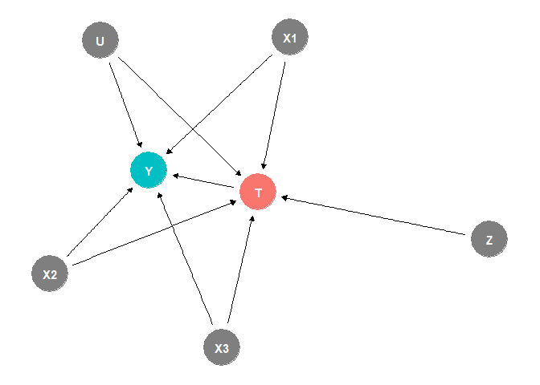

# The First Casualty of Statistics: Part Twenty Two
<big>**2SLS and LATE I**</big>

<br/>
Jiří Fejlek

2026-10-05
<br/>

<br/> In Part Twenty One, we introduced instrumental variables and the 2SLS
method, which allow us to estimate the treatment effect even in the
presence of unobserved confounding. However, one major limitation of the
2SLS method is that it relies on linear regression, which is almost
always misspecified in practice. In addition, if we check the derivation
of 2SLS, we will find that it relies heavily on properties of linear
regression (namely, 2SLS uses the fact that linear regression performs
an orthogonal projection of observed outcomes onto the subspace of
covariates). Consequently, extending 2SLS beyond linear regression is
not trivial and is often based on machine learning methods (we will
cover some of these in later parts).

Here, we will focus on a different strategy. Yes, the 2SLS method is
usually misspecified in practice. However, under some assumptions, the
estimator it produces has a causal interpretation. We mentioned an
example of this briefly in the previous part: provided that the
treatment and the instrument are binary, then, under some assumptions,
the IV estimator estimates LATE, which we know from estimating treatment
effects under compliance (Part Sixteen). <br/>


## Table of Contents

- [Connection between IV Estimator and LATE for Binary Treatment and
  Binary
  Instrument](#connection-between-iv-estimator-and-late-for-binary-treatment-and-binary-instrument)
- [Conditional Instruments](#conditional-instruments)
- [Multicategorical Instrument](#multicategorical-instrument)
- [Multiple Binary Instruments](#multiple-binary-instruments)
- [Limited Monotonicity](#limited-monotonicity)
- [References](#references)


``` r
library(tidyr)
library(dplyr)
library(tibble)
library(ggplot2)
library(patchwork)
library(dagitty)
library(ggdag)
library(modelsummary)
library(GGally)
library(estimatr)
library(WeightIt)
library(MatchIt)
library(cobalt)
library(mgcv)
library(marginaleffects)
library(ivreg)
```

## Connection between IV Estimator and LATE for Binary Treatment and Binary Instrument

In the previous presentation, we introduced the instrumental variables
(IVs) framework. Let us assume an outcome $`Y`$, a binary treatment
$`T`$, a binary exogeneous (i.e., randomized) instrument $`Z`$ and a
true generating process
``` math
Y =  T\beta +  \varepsilon
```
The IV estimator of $`\beta`$ is
``` math
\beta_\text{IV} = \frac{\text{Cov} (Z, Y)}{\text{Cov}(Z, T)} = \frac{\mathbb{E}(Y \mid Z = 1)- \mathbb{E}(Y \mid Z = 0)}{\mathbb{E}(T \mid Z = 1)- \mathbb{E}(T \mid Z = 0)} = \frac{\tau_Y}{\tau_T}
```

where $`\tau_Y`$ is ATE of $`Z`$ on $`Y`$ and $`\tau_T`$ is ATE of $`Z`$
on $`T`$.

We know this formula from Part Sixteen. Assuming exclusion restriction
for $`Z`$ (which is met because $`Z`$ is instrument) and monotonicity
assumption (no defiers)
``` math
\text{LATE} = \mathbb{E}(Y(1)-Y(0) \mid G = \text{complier}) = \frac{\tau_Y}{\tau_T}. 
```
Consequently, for binary treatment and binary instrument, the IV
estimator can estimate LATE, even when the true generating process is
not linear! Provided that the treatment effect is homogeneous, the IV
estimator can even estimate ATE under unobserved confounding! This is a
quite famous result from (Angrist and Imbens 1995).

Let’s demonstrate the result using some simulated data. We assume a
binary treatment $`T`$ with non-random treatment assignment given by
observed confounders $`X_1, X_2, X_3`$, an unobserved confounder $`U`$,
and a binary instrument $`Z`$, which we assume is randomized.

``` r
set.seed(125)
dag <- dagify(Y ~ X1 + X2 + X3 + U + T, T ~  X1 + X2 + X3 + U + Z,  exposure = 'T', outcome = 'Y')
ggdag_status(dag) + theme_dag() + theme(legend.position = "none")
```

<!-- -->

``` r
set.seed(123)
n_sample <- 100000

# observed confounders
X1 <- rnorm(n_sample, mean = 0, sd = 2.5)
X2 <- round(runif(n_sample, 0.1, 1)) + 0
X3 <- abs(rnorm(n_sample, mean = 0, sd = 2))

# unobserved confounder
U <- rt(n_sample,2)   

# treatment probabilities
p_t_0 <- plogis(-2 + X1 - 0.1*X1^2 + X2 + 0.15*X3 + 0.25*X2*X3 + U)
p_t_1 <- plogis(-2 + X1 - 0.1*X1^2 + X2 + 0.15*X3 + 0.25*X2*X3 + U + 2 + 0.25*X3)

rand <- runif(n_sample,0,1)
T_0 <- (rand < p_t_0) + 0
T_1 <- (rand < p_t_1) + 0

# potential outcomes Y for treatment
y_0 <- 100 + 5*X1 - 0.25*X1^2 + X2 + 2*X3 - 5*U + rnorm(n_sample) 
y_1 <- 125 + 5*X1 - 0.25*X1^2 + 0.25*X2 + 10*X3 - 5*U + rnorm(n_sample)


# treatment
Z <- sample(c(rep(0,n_sample/2),rep(1,n_sample/2)))
T <- T_0
T[Z == 1] <- T_1[Z == 1]

# outcomes 
y <- y_0
y[T == 1] <- y_1[T == 1]

data_sim <- data.frame(Y = y, X1 = X1, X2 = X2, X3 = X3, T = T, Z = Z, U = U)
```

If we estimate the treatment effect naively using the observed
covariates, we get a clearly biased result.

``` r
# naive ATE estimate
coefficients(lm(Y ~ T + X1 + X2 + X3, data = data_sim))[2]
```

    ##        T 
    ## 26.48197

``` r
# true ATE
mean(y_1-y_0)
```

    ## [1] 37.36072

Let’s use the IV estimator. Since we simulated the dataset, we can check
that there are no defiers.

``` r
groups <- c(
sum(T_1 == T_0 & T_1 == 1),
sum(T_1 == T_0 & T_1 == 0),
sum(T_1 > T_0),
sum(T_1 < T_0))

names(groups) <- c('Always-takers', 'Never-takers', 'Compliers', 'Defiers')
groups
```

    ## Always-takers  Never-takers     Compliers       Defiers 
    ##         34899         38290         26811             0

The estimated average treatment effect for the compliers using the IV
estimator is as follows.

``` r
# IV estimator
coefficients(lm(Y ~ Z + X1 + X2 + X3, data = data_sim))[2]/coefficients(lm(T ~ Z + X1 + X2 + X3, data = data_sim))[2]
```

    ##        Z 
    ## 38.10786

We can verify that this value matches the true simulated value.

``` r
# true LATE
mean((y_1-y_0)[T_1 > T_0])
```

    ## [1] 38.21149

We note that LATE does not equal ATE because the treatment effect is
heterogeneous. In other words, the IV estimator estimates an average
treatment effect, but only for the subpopulation of compliers, those for
which the instrument actually changed the treatment. We have to keep
this in mind when interpreting the IV results in practice.

If we change the simulation to make the treatment effect homogeneous,
the IV estimator will estimate ATE (since LATE equals ATE).

``` r
set.seed(123)

# observed confounders
X1 <- rnorm(n_sample, mean = 0, sd = 2.5)
X2 <- round(runif(n_sample, 0.1, 1)) + 0
X3 <- abs(rnorm(n_sample, mean = 0, sd = 2))

# unobserved confounder
U <- rt(n_sample,2)   

# treatment probabilities
p_t_0 <- plogis(-2 + X1 - 0.1*X1^2 + X2 + 0.15*X3 + 0.25*X2*X3 + U)
p_t_1 <- plogis(-2 + X1 - 0.1*X1^2 + X2 + 0.15*X3 + 0.25*X2*X3 + U + 2 + 0.25*X3)

rand <- runif(n_sample,0,1)
T_0 <- (rand < p_t_0) + 0
T_1 <- (rand < p_t_1) + 0

# potential outcomes Y for treatment
y_0 <- 100 + 5*X1 - 0.25*X1^2 + X2 + 2*X3 - 5*U + rnorm(n_sample) 
y_1 <- 125 + 5*X1 - 0.25*X1^2 + X2 + 2*X3 - 5*U + rnorm(n_sample) 


# treatment
Z <- sample(c(rep(0,n_sample/2),rep(1,n_sample/2)))
T <- T_0
T[Z == 1] <- T_1[Z == 1]

# outcomes 
y <- y_0
y[T == 1] <- y_1[T == 1]

data_sim <- data.frame(Y = y, X1 = X1, X2 = X2, X3 = X3, T = T, Z = Z, U = U)
```

``` r
results <- c(
  mean(y_1-y_0),
  mean((y_1-y_0)[T_1 > T_0]),
  coefficients(lm(Y ~ Z + X1 + X2 + X3, data = data_sim))[2]/coefficients(lm(T ~ Z + X1 + X2 + X3, data = data_sim))[2]
)

names(results) <- c('True ATE', 'True LATE', 'IV Estimate')
results
```

    ##    True ATE   True LATE IV Estimate 
    ##    24.99496    24.99525    24.97082

## Conditional Instruments

There is one important fact that is often glossed over. The
randomization of $`Z`$ (i.e., $`Z`$ is independent of $`X, U`$ and
$`Y`$) is a key assumption! If $`Z`$ is merely conditionally independent
of $`Y`$ given observed confounders $`X`$, the 2SLS estimation can still
be used. This is how instruments are often employed in practice, since
it is rare to have one that is truly randomized.

We can quickly demonstrate it by modifying a simulation from the
previous presentation. Let’s assume the following linear model in which
the instrument is confounded with observed $`X_1`$. In this case, the
unadjusted IV estimator provides a nonsensical result.

``` r
set.seed(123)
n_sample <- 100000

epsilon <- 0.25*rt(n_sample, 5)                                                 # unobserved confounder
X1 <- rbinom(n_sample,1,0.25)                                                   # observed confounders
X2 <- rnorm(n_sample,0,1.5)
X3 <- abs(rnorm(n_sample,0,0.5))

Z <- rnorm(n_sample,X1,1)                                                       # instrumental variable that depends on X1!

T <- 0.25*Z + 0.5*epsilon + X1 - 0.25*X3 + rnorm(n_sample,0,0.25)               # treatment
Y <- 1 + 2*T - 2.5*epsilon - 5*X1 + 0.5*X2 + 1.5*X3 + rnorm(n_sample,0,1.5)     # outcome

model_matrix <- data.frame(T = T, Y = Y, epsilon = epsilon, Z = Z, X1 = X1, X2 = X2, X3 = X3)
coefficients(lm(Y~Z))[2]/coefficients(lm(T~Z))[2]
```

    ##          Z 
    ## 0.06644727

But if we adjust correctly for observed confounders, $`Z`$ is
independent of the outcome and becomes a valid instrument. Consequently,
the IV estimator works.

``` r
model_matrix <- data.frame(T = T, Y = Y, epsilon = epsilon, Z = Z, X1 = X1, X2 = X2, X3 = X3)
coefficients(lm(Y~Z+X1+X2+X3))[2]/coefficients(lm(T~Z+X1+X2+X3))[2]
```

    ##        Z 
    ## 2.001826

However, the theorem that the IV estimator estimates the LATE *no longer
holds* in general for conditional instruments! It can be shown that, in
this case, the IV estimator now also depends on the treatment effects on
always-takers and never-takers (i.e., on their counterfactuals).
Consequently, the IV estimator does not have a causal interpretation
(Blandhol et al. 2022).

Let’s demonstrate, via simulation, that IV no longer estimates LATE in
general when $`Z`$ is subject to observed confounding.

``` r
set.seed(123)
n_sample <- 100000

# observed confounders
X1 <- rnorm(n_sample, mean = 0, sd = 2.5)
X2 <- round(runif(n_sample, 0.1, 1)) + 0
X3 <- abs(rnorm(n_sample, mean = 0, sd = 2))

# unobserved confounder
U <- rt(n_sample,2)   

# treatment probabilities
p_t_0 <- plogis(-2 + X1 - 0.1*X1^2 + X2 + 0.15*X3 + 0.25*X2*X3 + U)
p_t_1 <- plogis(-2 + X1 - 0.1*X1^2 + X2 + 0.15*X3 + 0.25*X2*X3 + U + 2 + 0.25*X3)

rand <- runif(n_sample,0,1)
T_0 <- (rand < p_t_0) + 0
T_1 <- (rand < p_t_1) + 0

# potential outcomes Y for treatment
y_0 <- 100 + 5*X1 - 0.25*X1^2 + X2 + 2*X3 - 5*U + rnorm(n_sample) 
y_1 <- 125 + 5*X1 - 0.25*X1^2 + X2 + 2*X3 - 5*U + rnorm(n_sample) 


# confounded instrument
Z <- (rand < plogis(5*X1 - 5*X2 - 5*X3) + 0)

# treatment
T <- T_0
T[Z == 1] <- T_1[Z == 1]

# outcomes 
y <- y_0
y[T == 1] <- y_1[T == 1]

data_sim <- data.frame(Y = y, X1 = X1, X2 = X2, X3 = X3, T = T, Z = Z, U = U)
```

``` r
results <- c(
  mean(y_1-y_0),
  mean((y_1-y_0)[T_1 > T_0]),
  coefficients(lm(Y ~ Z + X1 + X2 + X3, data = data_sim))[2]/coefficients(lm(T ~ Z + X1 + X2 + X3, data = data_sim))[2]
)

names(results) <- c('True ATE', 'True LATE', 'IV Estimate')
results
```

    ##    True ATE   True LATE IV Estimate 
    ##    24.99496    24.99525    16.59229

We see that the IV estimator is clearly off; it underestimates both LATE
and ATE. Let’s bootstrap the IV estimate.

``` r
set.seed(123)
nb <- 100

late_est <- numeric(nb)

for(i in 1:nb){
  data_sim_new <-  data_sim[sample(nrow(data_sim) , rep=TRUE),]
  late_est[i] <- coefficients(lm(Y ~ Z + X1 + X2 + X3, data = data_sim_new))[2]/coefficients(lm(T ~ Z + X1 + X2 + X3, data = data_sim_new))[2]
}

quantile(late_est, c(0.025,0.5, 0.975))
```

    ##     2.5%      50%    97.5% 
    ## 15.81239 16.57877 17.24360

The bootstrap CI clearly does not include LATE nor ATE.

We mentioned one case in which the IV estimate works: when the
instrument is randomized. In general, the 2SLS must be *saturated*
(Blandhol et al. 2022)
``` math
\mathbb{E} (Z \mid X) = \mathbb{L} (Z \mid X),
```
where $`\mathbb{L} (Z \mid X)`$ denotes the linear projection of $`Z`$
on the covariates $`X`$. Apart of instrument being independent of $`X`$,
this *rich covariates* assumption can be met when all $`X`$ are
discrete; we need to separate the data into strata given by all
combinations of factor levels in $`X`$. Let’s discretize our dataset and
do that.

``` r
data_sim$strata <- interaction(factor(round(X1)),factor(X2),factor(round(X3)))
```

``` r
results <- c(
  mean(y_1-y_0),
  mean((y_1-y_0)[T_1 > T_0]),
  coefficients(lm(Y ~ Z + strata, data = data_sim))[2]/coefficients(lm(T ~ Z + strata, data = data_sim))[2]
)

names(results) <- c('True ATE', 'True LATE', 'IV Estimate')
results
```

    ##    True ATE   True LATE IV Estimate 
    ##    24.99496    24.99525    25.44520

``` r
set.seed(123)
nb <- 100

late_est <- numeric(nb)

for(i in 1:nb){
  data_sim_new <-  data_sim[sample(nrow(data_sim) , rep=TRUE),]
  late_est[i] <- coefficients(lm(Y ~ Z + strata, data = data_sim_new))[2]/coefficients(lm(T ~ Z + strata, data = data_sim_new))[2]
}

quantile(late_est, c(0.025,0.5, 0.975))
```

    ##     2.5%      50%    97.5% 
    ## 24.34667 25.37925 26.34707

We see that now the IV estimate is much closer to LATE. Of course, the
practical applicability of this method is somewhat limited, since the
number of strata will grow multiplicatively with each covariate added to
the model (it is the same problem as with post-stratification).

## Multicategorical Instrument

Let’s assume an exogenous multicategorical instrument $`Z`$ with
categories denoted $`{z_1, \ldots, z_K}`$. We know from the previous
Part Twenty One that the IV estimator can, in the general case, be
computed using two-stage least squares (2SLS) (Ding 2024)

1.  Perform linear regression $`T \sim Z`$ and obtain predictions
    $`\hat T`$
2.  Perform linear regression $`Y \sim \hat T`$ and obtain the
    coefficient $`\hat \beta`$

The question is whether $`\hat \beta`$ has some general causal
interpretation. Provided that $`Z`$ is a single binary instrument, we
know that 2SLS reduces to the standard (Wald) IV estimator, and that
$`\beta_\text{2SLS}`$ estimates LATE in the absence of defiers. It turns
out that this result can be generalized to a multicategorical $`Z`$.

The definition of monotonicity from (Angrist and Imbens 1995) is
actually stated as

*For all* $`z,z' \in \mathcal{Z}`$ *either* $`T_i(z) \geq T_i(z')`$ *for
all individuals* $`i`$ *or* $`T_i(z) \leq T_i(z')`$ *for all
individuals* $`i`$,

where $`T_i(z), T_i(z’)`$ are potential outcomes of treatment under the
values of instrument $`z`$ and $`z’`$ respectively. For a binary $`Z`$,
this condition reduces to the assumption that there are no defiers.

(Angrist and Imbens 1995) showed that under monotonicity the 2SLS
estimate is a positively weighted average of LATEs. We will explain what
is meant by that concretely on an example in a moment, but intuitively,
since the instrument $`Z`$ has more levels than just two, there are more
“types” of compliers. For example, let’s assume that $`Z`$ represents an
incentive and $`z_1`$ is the lowest level of the incentive (e.g., no
incentive). Increasing the level from $`z_1`$ to $`z_2`$ causes some
individuals to take the treatment $`T`$, making them compliers with
respect to the transition $`z_1 \rightarrow z_2`$. If we increase the
incentive further from $`z_2`$ to $`z_3`$, even more individuals will
take the treatment, etc.

Overall, we obtain the following structure of potential outcomes, which
separates all individuals into the following groups based on their
compliance.

``` r
names <- c('Always-taker (at)', 'Z2 Complier (2c)', 'Z3 Complier (3c)', 'Z4 Complier (4c)', 'Never-taker (nt)')
z1 <- c(1,0,0,0,0)
z2 <- c(1,1,0,0,0)
z3 <- c(1,1,1,0,0)
z4 <- c(1,1,1,1,0)

data.frame(Group = names, 'Z1' = z1, 'Z2' = z2, 'Z3' = z3, 'Z4' = z4)
```

    ##               Group Z1 Z2 Z3 Z4
    ## 1 Always-taker (at)  1  1  1  1
    ## 2  Z2 Complier (2c)  0  1  1  1
    ## 3  Z3 Complier (3c)  0  0  1  1
    ## 4  Z4 Complier (4c)  0  0  0  1
    ## 5  Never-taker (nt)  0  0  0  0

Crucially, the structure is monotonous. If someone is a *2c* complier,
they also take the treatment under $`z_2, z_3, \ldots`$. A *3c* complier
takes the treatment under $`z_4`$, etc. Monotonicity implies that the
levels of factor $`Z`$ can be ordered in such a way that this holds for
any individuals in the population, i.e., there is no defier who, for
example, takes the treatment under $`z_1`$ but not under $`z_3`$.

Let’s simulate some data for this setup.

``` r
set.seed(123)
n_sample <- 100000

# Unobserved confounders
U   <- rnorm(n_sample, 0, 1)
U1 <-  runif(n_sample, 0, 2)
U2 <-  runif(n_sample, 0, 2.5)
U3 <-  runif(n_sample, 0, 3.5)

rand <- runif(n_sample,0,1)

T1 <- (plogis(-2.5 + U) > rand) + 0                     
T2 <- (plogis(-2.5 + U + U1) > rand) + 0                 
T3 <- (plogis(-2.5 + U + U1 + U2) > rand) + 0                 
T4 <- (plogis(-2.5 + U + U1 + U2 + U3) > rand) + 0    

ctypes <- rep(NA, n_sample)

ctypes[T1 == 1 & T2 == 1 & T3 == 1 & T4 == 1] <- 1   # at
ctypes[T1 == 0 & T2 == 0 & T3 == 0 & T4 == 0] <- 2   # nt
ctypes[T1 == 0 & T2 == 1 & T3 == 1 & T4 == 1] <- 3   # 1c
ctypes[T1 == 0 & T2 == 0 & T3 == 1 & T4 == 1] <- 4   # 2c
ctypes[T1 == 0 & T2 == 0 & T3 == 0 & T4 == 1] <- 5   # 3c

any(is.na(ctypes))
```

    ## [1] FALSE

Overall, our population is split as follows.

``` r
sum_c <- summary(factor(ctypes))/n_sample
names(sum_c) <- c('at','nt','2c','3c','4c')
sum_c
```

    ##      at      nt      2c      3c      4c 
    ## 0.10746 0.26658 0.12617 0.22228 0.27751

Let’s generate some potential outcomes (we will confound them using
latent individual variables *U, U1, U2, U3*)

``` r
Y0 <- 10 + 25*U + rnorm(n_sample, 0, 1)
Y1 <- 25 + 25*U + 10*U1 + -25*U2 + 10*U3 + rnorm(n_sample, 0, 1) 
```

The ATE for this population is

``` r
mean(Y1-Y0)
```

    ## [1] 11.21475

We can also compute true average treatment effects in each group.

``` r
comp_ate <- tapply(Y1-Y0,factor(ctypes), mean)
names(comp_ate) <- c('at','nt','2c','3c','4c')
data.frame(comp_ate)
```

    ##      comp_ate
    ## at 11.5297961
    ## nt 10.8791538
    ## 2c 15.0374565
    ## 3c  0.6191832
    ## 4c 18.1639640

Instead of one LATE, we have three, each corresponding to the average
treatment effect for one compliance group. Let’s generate a treatment
assignment and create a dataset of data we would actually observe.

``` r
Z <- sample(c(1,2,3,4), n_sample, replace = TRUE)

Z1 <- (Z == 1) + 0
Z2 <- (Z == 2) + 0 
Z3 <- (Z == 3) + 0
Z4 <- (Z == 4) + 0

T <- (Z1 == 1)*T1 + (Z2 == 1)*T2 + (Z3 == 1)*T3 + (Z4 == 1)*T4
Y <- Y0*(1-T) + Y1*T
data_sim <- data.frame(Y = Y, T = T, Z1 = Z1, Z2 = Z2, Z3 = Z3, Z4 = Z4)
```

The observed (naive) ATE is as follows.

``` r
mean(Y[T==1]) - mean(Y[T==0])
```

    ## [1] 24.94837

This estimate is clearly biased due to unobserved confounding. Hence,
let’s use the fact that $`Z`$ is randomized, and employ IV estimators.
Now, we could separate the data and estimate the LATEs with respect to
individual instrument levels $`z_1`$ and $`z_2`$, $`z_2`$ and $`z_3`$,
$`z_3`$ and $`z_4`$.

``` r
coefs <- numeric(3)
coefs[1] <- coefficients(ivreg(Y ~ T | Z1 + Z2, data = data_sim[data_sim$Z1 == 1 | data_sim$Z2 == 1,]))[2]
coefs[2] <- coefficients(ivreg(Y ~ T | Z2 + Z3, data = data_sim[data_sim$Z2 == 1 | data_sim$Z3 == 1,]))[2]
coefs[3] <- coefficients(ivreg(Y ~ T | Z3 + Z4, data = data_sim[data_sim$Z3 == 1 | data_sim$Z4 == 1,]))[2]

names(coefs) <- c('LATE Z1->Z2', 'LATE Z2->Z3', 'LATE Z3->Z4')
data.frame(coefs)
```

    ##                 coefs
    ## LATE Z1->Z2 12.785945
    ## LATE Z2->Z3  2.194708
    ## LATE Z3->Z4 17.120924

Using the result from the previous section, each coefficient is an
estimate of the particular LATE. The question is: what interpretation
can be given to the IV estimate when all instruments are used together?

``` r
coefficients(ivreg(Y ~ T | Z1 + Z2 + Z3 + Z4, data = data_sim))
```

    ## (Intercept)           T 
    ##    10.11042    10.09113

This value differs significantly from other LATEs. It was shown by
(Angrist and Imbens 1995) that under monotonicity
``` math
\beta_\text{2SLS} = \sum_{i = 2}^K w_i \text{LATE}_i,
```
where
``` math
\text{LATE}_i = \mathbb{E}(Y(1)-Y(0) \mid T(z_i) > T(z_{i-1}))
```
is the LATE for the transition from $`z_{i-1}`$ to $`z_i`$ and $`w_i`$
are nonnegative weights, such that $`\sum w_i = 1`$. We can compute
these weights as (Angrist and Pischke 2009)

``` math
w_i = \frac{\text{Cov}(T, I(Z\geq z_i))(\mathbb{E}(T(z_i) - T(z_{i-1})))}{\sum w_j}
```
If we substitute the observed values,

``` r
weights <-c(
cov(T,(Z > 1) + 0)*(mean(T[Z == 2]) - mean(T[Z == 1])),
cov(T,(Z > 2) + 0)*(mean(T[Z == 3]) - mean(T[Z == 2])),
cov(T,(Z > 3) + 0)*(mean(T[Z == 4]) - mean(T[Z == 3]))
)

weights <- weights/sum(weights)
weights
```

    ## [1] 0.1500860 0.4273806 0.4225334

we recover exactly the IV estimate.

``` r
unname(weights[1]*coefs[1] + weights[2]*coefs[2] + weights[3]*coefs[3]) 
```

    ## [1] 10.09113

To conclude, the IV estimate for a multicategory instrument is (under
monotonicity) the weighted average of LATEs. Provided that the treatment
effect is homogeneous, the IV estimator will estimate ATE.

## Multiple Binary Instruments

Let us now assume that $`Z`$ is a multicategorical instrument, in which
each category corresponds to particular levels of multiple binary
instruments. The monotonicity assumption from (Angrist and Imbens 1995)
is quite strict. It is realistic for a single binary instrument or, as
we have discussed, for a single ordinal instrument (e.g., increasing the
level of incentive increases the number of compliers). But as shown in
(Mogstad et al. 2021), it breaks down when considering more than one
instrument. The monotonicity implies that (Mogstad et al. 2021)

*For any individual* $`i \in \mathcal{I}`$, we define
$`Z_i = \{z \in \mathcal{Z} \mid T_i(z) = 1\}.`$ *Monotonicity holds if
and only if for all* $`j, k \in \mathcal{I}`$, $`Z_j \subseteq Z_k`$
*or* $`Z_k \subseteq Z_j.`$

This implies, for example, that for two binary instruments
``` math
 z \in \{(0,0), (0,1), (1,0), (1,1)\}.
```
we cannot have an individual in the population that has $`T = 1`$ only
if $`(1,0)`$ or $`(1,1)`$ and at the same time have an individual that
has $`T = 1`$ only if $`(0,1)`$ or $`(1,1)`$, since these two sets are
not nested. In other words, the effect of instruments must be
essentially homogeneous for monotonicity to hold, as in (Angrist and
Imbens 1995).

Fortunately, the monotonicity assumption can be made weaker. Let
$`z = (z_1, \ldots, z_L) \in \mathcal{Z}`$ and let us denote
$`z = (z_l, z_{-l})`$ to explicitly separate the *l*th component of
$`z`$. We define *partial monotonicity* as follows (Mogstad et al. 2021)

*For any* $`l \in 1, \ldots L`$ and any
$`(z_l, z_{-l}), (z'_l, z_{-l}) \in \mathcal{Z}`$,
$`T_i(z_l, z_{-l}) \geq T_i(z_l', z_{-l})`$ *for all individuals* $`i`$
*or* $`T_i(z_l, z_{-l}) \leq T_i(z'_l, z_{-l})`$ *for all individuals*
$`i`$.

Partial monotonicity requires a monotonicity assumption for each
component of the instrument $`Z`$, with the rest held fixed.

Let’s demonstrate it using two binary instruments. We will assume
partial monotonicity such that
``` math
 T_i(0,0) \leq T_i(0,1) \leq T_i(1,1)
```
and
``` math
 T_i(0,0) \leq T_i(1,0) \leq T_i(1,1)
```
for each individual.

The population is split into six groups (Mogstad et al. 2021)

``` r
names <- c('Always-taker (at)', 'Never-taker (nt)', 'Eager Complier (ec)', 'Reluctant Complier (rc)', 'Z1 Complier (1c)', 'Z2 Complier (2c)')
z1 <- c(1,0,0,0,0,0)
z2 <- c(1,0,1,0,0,1)
z3 <- c(1,0,1,0,1,0)
z4 <- c(1,0,1,1,1,1)

data.frame(Group = names, 'Z00' = z1, 'Z01' = z2, 'Z10' = z3, 'Z11' = z4)
```

    ##                     Group Z00 Z01 Z10 Z11
    ## 1       Always-taker (at)   1   1   1   1
    ## 2        Never-taker (nt)   0   0   0   0
    ## 3     Eager Complier (ec)   0   1   1   1
    ## 4 Reluctant Complier (rc)   0   0   0   1
    ## 5        Z1 Complier (1c)   0   0   1   1
    ## 6        Z2 Complier (2c)   0   1   0   1

Let’s simulate the data for this setup.

``` r
set.seed(123)
n_sample <- 100000

# We will denote the compliance groups as
# 1. Always-Takers:     [1, 1, 1, 1]
# 2. Never-Takers:      [0, 0, 0, 0]
# 3. Eager Comp.:       [0, 1, 1, 1] 
# 4. Reluctant Comp.:   [0, 0, 0, 1] 
# 5. Z1 Comp.:          [0, 0, 1, 1] 
# 6. Z2 Comp.:          [0, 1, 0, 1] 

# Unobserved confounders
U   <- rnorm(n_sample, 0, 1)
U1  <- runif(n_sample, 0, 5)
U2  <- runif(n_sample, 0, 2.5)

rand <- runif(n_sample,0,1)

T00 <- plogis(-2.5 + U) > rand + 0                      # T for Z1 = Z2 = 0
T10 <- plogis(-2.5 + U + U1) > rand + 0                 # T for Z1 = 1, Z2 = 0
T01 <- plogis(-2.5 + U + U2) > rand + 0                 # T for Z1 = 0, Z2 = 1
T11 <- plogis(-2.5 + U + U1 + U2) > rand + 0            # T for Z1 = 1, Z2 = 1


ctypes <- rep(NA, n_sample)

ctypes[T00 == 1 & T01 == 1 & T10 == 1 & T11 == 1] <- 1
ctypes[T00 == 0 & T01 == 0 & T10 == 0 & T11 == 0] <- 2
ctypes[T00 == 0 & T01 == 1 & T10 == 1 & T11 == 1] <- 3
ctypes[T00 == 0 & T01 == 0 & T10 == 0 & T11 == 1] <- 4
ctypes[T00 == 0 & T01 == 0 & T10 == 1 & T11 == 1] <- 5
ctypes[T00 == 0 & T01 == 1 & T10 == 0 & T11 == 1] <- 6

any(is.na(ctypes))
```

    ## [1] FALSE

The proportions of compliance groups in the sample are as follows.

``` r
sum_c <- summary(factor(ctypes))/n_sample
names(sum_c) <- c('at','nt','ec','rc','1c','2c')
sum_c
```

    ##      at      nt      ec      rc      1c      2c 
    ## 0.10454 0.31618 0.13720 0.15044 0.25810 0.03354

Let us generate the observed data.

``` r
Y0 <- 10 + 50*U + rnorm(n_sample, 0, 1)
Y1 <- 50 + 50*U + 25*U1*U2 - 15*U1 - 10*U2 + rnorm(n_sample, 0, 1) 

Z1 <- rbinom(n_sample, 1, 0.5)
Z2 <- rbinom(n_sample, 1, 0.5)

T <- (Z1 == 0 & Z2 == 0)*T00 + (Z1 == 1 & Z2 == 0)*T10 + (Z1 == 0 & Z2 == 1)*T01 + (Z1 == 1 & Z2 == 1)*T11
Y <- Y0*(1-T) + Y1*T

Z10 <- (Z1 == 1 & Z2 == 0) + 0
Z11 <- (Z1 == 1 & Z2 == 1) + 0
Z01 <- (Z1 == 0 & Z2 == 1) + 0
Z00 <- (Z1 == 0 & Z2 == 0) + 0

data_sim <- data.frame(Y = Y, T = T, Z10 = Z10, Z11 = Z11, Z01 = Z01, Z00 = Z00, ctypes = ctypes)
```

The true ATE effect is as follows.

``` r
mean(Y1-Y0)
```

    ## [1] 68.20747

The true group average treatment effects are

``` r
comp_ate <- tapply(Y1-Y0,factor(ctypes), mean)
names(comp_ate) <- c('at','nt','ec','rc','1c','2c')
data.frame(comp_ate)
```

    ##     comp_ate
    ## at  67.96012
    ## nt  43.44449
    ## ec 106.50175
    ## rc  85.30454
    ## 1c  71.29033
    ## 2c  45.35926

The naive ATE estimate is again significantly confounded.

``` r
mean(Y[T == 1]) - mean(Y[T == 0])
```

    ## [1] 107.6409

Hence, we could consider using the IV estimator since $`Z`$ is
randomized. One complication compared to the monotone ordinal instrument
from the previous section is that we can no longer easily estimate a
single LATE. For example, if we investigate transition
$`z_{00} \rightarrow z_{10}`$, the compliers for this transition are
both eager compliers and $`Z_1`$ compliers. Consequently, when we
perform the appropriate 2SLS,

``` r
coefficients(ivreg(Y ~ T| Z10 + Z00, data = data_sim[data_sim$Z10 == 1 | data_sim$Z00 == 1,]))[2]
```

    ##        T 
    ## 83.25102

the result is not a single LATE, but a weighted average of two LATEs for
these two compliers (weights are proportions of *ec* and *1c* compliers
in the population).

``` r
unname((sum_c[3]*comp_ate[3] + sum_c[5] *comp_ate[5]) / (sum_c[3] + sum_c[5]))
```

    ## [1] 83.51145

Similarly, the transition $`z_{00} \rightarrow z_{01}`$ corresponds to
the mixture of *ec* and *2c* compliers.

``` r
coefficients(ivreg(Y ~ T| Z01 + Z00, data = data_sim[data_sim$Z01 == 1 | data_sim$Z00 == 1,]))[2]
```

    ##        T 
    ## 97.04676

``` r
unname((sum_c[3]*comp_ate[3] + sum_c[6]*comp_ate[6]) / (sum_c[3] + sum_c[6]))
```

    ## [1] 94.49098

The transition $`z_{10} \rightarrow z_{11}`$ corresponds to the mixture
of *rc* and *2c* compliers

``` r
coefficients(ivreg(Y ~ T| Z10 + Z11, data = data_sim[data_sim$Z10 == 1 | data_sim$Z11 == 1,]))[2]
```

    ##        T 
    ## 78.87222

``` r
unname((sum_c[4]*comp_ate[4] + sum_c[6] *comp_ate[6]) / (sum_c[4] + sum_c[6]))
```

    ## [1] 78.02242

and the transition $`z_{10} \rightarrow z_{11}`$ corresponds to the
mixture of *rc* and *1c* compliers.

``` r
coefficients(ivreg(Y ~ T| Z01 + Z11, data = data_sim[data_sim$Z01 == 1 | data_sim$Z11 == 1,]))[2]
```

    ##        T 
    ## 75.43589

``` r
unname((sum_c[4]*comp_ate[4] + sum_c[5] *comp_ate[5]) / (sum_c[4] + sum_c[5]))
```

    ## [1] 76.4509

Lastly, the transition from $`z_{10} \rightarrow z_{01}`$ or from
$`z_{01} \rightarrow z_{10}`$ does not make much sense to investigate,
since it would involve defiers that make the groups incomparable.

The final question is what 2SLS regression on the full dataset
estimates.

``` r
summary(ivreg(Y ~ T| Z00 + Z01 + Z10 + Z11, data = data_sim))
```

    ## 
    ## Call:
    ## ivreg(formula = Y ~ T | Z00 + Z01 + Z10 + Z11, data = data_sim)
    ## 
    ## Residuals:
    ##      Min       1Q   Median       3Q      Max 
    ## -250.437  -39.501   -3.357   35.343  329.891 
    ## 
    ## Coefficients:
    ##             Estimate Std. Error t value Pr(>|t|)    
    ## (Intercept)   9.7274     0.3824   25.44   <2e-16 ***
    ## T            80.6091     0.8528   94.52   <2e-16 ***
    ## 
    ## Diagnostic tests:
    ##                    df1   df2 statistic  p-value    
    ## Weak instruments     2 99996   5191.17  < 2e-16 ***
    ## Wu-Hausman           1 99997   1347.89  < 2e-16 ***
    ## Sargan               2    NA     30.88 1.97e-07 ***
    ## ---
    ## Signif. codes:  0 '***' 0.001 '**' 0.01 '*' 0.05 '.' 0.1 ' ' 1
    ## 
    ## Residual standard error: 59.67 on 99998 degrees of freedom
    ## Multiple R-Squared: 0.4204,  Adjusted R-squared: 0.4204 
    ## Wald test:  8934 on 1 and 99998 DF,  p-value: < 2.2e-16

To determine that we will follow the results from (Mogstad et al. 2021).
First, we will compute the observed treatment proportions across all
strata given by $`Z_1`$ and $`Z_2`$.

``` r
ps <- c(
  mean(T[Z1 == 1 & Z2 == 0]),
  mean(T[Z1 == 1 & Z2 == 1]),
  mean(T[Z1 == 0 & Z2 == 0]),
  mean(T[Z1 == 0 & Z2 == 1]))

names(ps) <- c('(1,0)', '(1,1)','(0,0)', '(0,1)')
ps
```

    ##     (1,0)     (1,1)     (0,0)     (0,1) 
    ## 0.4983202 0.6860915 0.1026435 0.2755893

We order them from smallest to largest, i.e., $`z^1 = (0,0)`$,
$`z^2 = (0,1)`$, $`z^3 = (1,0)`$, $`z^4 = (1,1)`$. Next, we will define
for each group
$`g \in \{\text{at},\text{nt},\text{ec},\text{rc},\text{1c},\text{2c}\}`$

``` math
\mathcal{C}_g = \{k \in \{2, \ldots, K\} \mid T_i(z^{k-1}) < T_i(z^{k}) \text{ for all } i \text{ with } G_i = g\}
```
and

``` math
\mathcal{D}_g = \{k \in \{2, \ldots, K\} \mid T_i(z^{k-1}) > T_i(z^{k}) \text{ for all } i \text{ with } G_i = g\}.
```

These denote the compliers and defiers for the transitions
$`z^k \rightarrow z^{k+1}`$. For example, $`z^1 \rightarrow z^2`$ causes
*ec* and *2c* to switch treatment to 1. Transitioning
$`z^2 \rightarrow z^3`$ causes the 1c to switch treatment to 1, but the
*2c* become defiers and switch back to treatment 0. The transition
$`z^3 \rightarrow z^4`$ causes switch for *rc* compliers and *2c*
compliers. Overall, we get the following.

``` r
names <- c('Always-taker (at)', 'Never-taker (nt)', 'Eager Complier (ec)', 'Reluctant Complier (rc)', 'Z1 Complier (1c)', 'Z2 Complier (2c)')


C_g <- c('Empty', 'Empty', '2', '4', '3', '2, 4')
D_g <- c('Empty', 'Empty', 'Empty', 'Empty', 'Empty', '3')

data.frame(Group = names, C_g = C_g, D_g = D_g)
```

    ##                     Group   C_g   D_g
    ## 1       Always-taker (at) Empty Empty
    ## 2        Never-taker (nt) Empty Empty
    ## 3     Eager Complier (ec)     2 Empty
    ## 4 Reluctant Complier (rc)     4 Empty
    ## 5        Z1 Complier (1c)     3 Empty
    ## 6        Z2 Complier (2c)  2, 4     3

We can finally state the result from (Mogstad et al. 2021), which is
that
``` math
\beta_{2SLS} = \sum_{\mathcal{C}_g \neq \emptyset} w_g \text{LATE}_g
```

where $`\sum_{\mathcal{C}_g \neq \emptyset} w_g = 1`$ and

``` math
\text{sign}(w_g) = I(P[G = g]>0)\times \text{sign}\left( \sum_{k=2}^K (I(k \in \mathcal{C}_g) - I(k \in \mathcal{D}_g)) \text{Cov} (T_i, I(p(Z_i)\geq p(z^k)))\right),
```
where $`p(Z_i) = P(T_i = 1 \mid Z_i)`$. The result does not give us a
formula for computing the weight. However, we can check whether they are
all positive, i.e., whether $`\beta_\text{2SLS}`$ is a weighted average
of LATEs.

First, we compute $`p(Z_i) = P(T_i = 1 \mid Z_i)`$ for each observation.

``` r
p_zi <-  numeric(n_sample)
p_zi[Z1 == 1 & Z2 == 0] <- ps[1]
p_zi[Z1 == 1 & Z2 == 1] <- ps[2]
p_zi[Z1 == 0 & Z2 == 0] <- ps[3]
p_zi[Z1 == 0 & Z2 == 1] <- ps[4]
```

We also reorder *ps*.

``` r
ps <- ps[c(3, 4, 1, 2)]
ps
```

    ##     (0,0)     (0,1)     (1,0)     (1,1) 
    ## 0.1026435 0.2755893 0.4983202 0.6860915

Then, we substitute into the formula. We have
$`\mathcal{C}_\text{ec} = \{2\}`$ and
$`\mathcal{D}_\text{ec} = \emptyset`$. The sign of weight is positive
provided

``` r
cov(T, p_zi >= ps[2])
```

    ## [1] 0.07238725

is positive. Which it is. $`\mathcal{C}_\text{rc} = \{3\}`$ and
$`\mathcal{D}_\text{ec} = \emptyset`$. Hence, the sign is equal to the
sign of

``` r
cov(T, p_zi >= ps[4])
```

    ## [1] 0.07424387

$`\mathcal{C}_\text{1c} = \{3\}`$ and
$`\mathcal{D}_\text{1c} = \emptyset.`$

``` r
cov(T, p_zi >= ps[3])
```

    ## [1] 0.1010145

Finally, $`\mathcal{C}_\text{2c} = \{2,4\}`$ and
$`\mathcal{D}_\text{2c} = \{3\}`$.

``` r
cov(T, p_zi >= ps[2]) + cov(T, p_zi >= ps[4]) - cov(T, p_zi >= ps[3])
```

    ## [1] 0.0456166

All the weights are positive, and thus $`\beta_\text{2SLS}`$ is a causal estimate. If
we could assume that the treatment effect is homogeneous (which is not
the case in our study), we would obtain an estimate of the ATE.

## Limited Monotonicity

Partial monotonicity provides a more realistic condition for 2SLS to
yield a weighted average of LATEs across multiple binary instruments.
Unfortunately, we could only determine that the weights are positive,
not their actual values. *Limited monotonicity*
(<span class="nocase">Hoff et al.</span> 2023), which is monotonicity
wrt. all binary instruments are zero versus all binary instruments are
one, i.e.,

$`T_i(z_{0 \ldots 0}) \geq T_i(z_{1 \ldots 1})`$ *for all individuals*
$`i`$ *or* $`T_i(z_{0 \ldots 0}) \leq T_i(z_{1 \ldots 1})`$ *for all
individuals* $`i`$

is a weaker alternative to the partial monotonicity that allows
estimation of a particular average treatment effect. Namely, CC-LATE (
combined compliers local average treatment), the average treatment
effect of all compliers
``` math
\text{CC-LATE} = \mathbb{E}(Y(1)-Y(0) \mid G \in \text{cc}),
```

where *cc* denotes a group of compliers, i.e., the group that complies
with at least one of the instruments, or a combination of them. In our
previous example, this would be ec, rc, 1c, and 2c.
(<span class="nocase">Hoff et al.</span> 2023) showed that under limited
monotonicity

``` math
\text{CC-LATE} =  \frac{\mathbb{E}(Y \mid Z_1 = 1, Z_2 = 1,  \ldots Z_K = 1 ) - \mathbb{E}(Y \mid Z_1 = 0, Z_2 = 0,  \ldots Z_K = 0)}{\mathbb{E}(T \mid Z_1 = 1, Z_2 = 1,  \ldots Z_K = 1 ) - \mathbb{E}(T \mid Z_1 = 0, Z_2 = 0,  \ldots Z_K = 0).}
```
If we use our example, we get an estimate

``` r
(mean(Y[Z1 == 1 & Z2 == 1]) - mean(Y[Z1 == 0 & Z2 == 0]))/(mean(T[Z1 == 1 & Z2 == 1]) - mean(T[Z1 == 0 & Z2 == 0]))
```

    ## [1] 81.84179

which indeed corresponds to the true value

``` r
mean((Y1-Y0)[ctypes != 1 & ctypes != 2 ])
```

    ## [1] 81.76813

We should note that we can obtain this estimate using the *2SLS* on a
subpopulation for which $`Z_1 = Z_2`$ (<span class="nocase">Hoff et
al.</span> 2023)

``` r
summary(ivreg(Y ~ T| Z00 + Z01 + Z10 + Z11, data = data_sim[data_sim$Z11 == 1 | data_sim$Z00 == 1,]))
```

    ## 
    ## Call:
    ## ivreg(formula = Y ~ T | Z00 + Z01 + Z10 + Z11, data = data_sim[data_sim$Z11 == 
    ##     1 | data_sim$Z00 == 1, ])
    ## 
    ## Residuals:
    ##     Min      1Q  Median      3Q     Max 
    ## -249.84  -38.50   -2.85   35.61  325.06 
    ## 
    ## Coefficients:
    ##             Estimate Std. Error t value Pr(>|t|)    
    ## (Intercept)   8.4508     0.4378    19.3   <2e-16 ***
    ## T            81.8418     0.8935    91.6   <2e-16 ***
    ## 
    ## Diagnostic tests:
    ##                    df1   df2 statistic p-value    
    ## Weak instruments     0 50263      -Inf     NaN    
    ## Wu-Hausman           1 50262     745.4  <2e-16 ***
    ## Sargan               0    NA        NA      NA    
    ## ---
    ## Signif. codes:  0 '***' 0.001 '**' 0.01 '*' 0.05 '.' 0.1 ' ' 1
    ## 
    ## Residual standard error: 58.44 on 50263 degrees of freedom
    ## Multiple R-Squared: 0.4074,  Adjusted R-squared: 0.4074 
    ## Wald test:  8390 on 1 and 50263 DF,  p-value: < 2.2e-16

The nice thing about CC-LATE compared to other 2SLS estimators we
discussed is that it is both easy to compute and easy to interpret under
very general conditions. Other than that, we saw that the relative ease
of computing 2SLS is quite deceptive. The causal interpretation of the
2SLS results gets quite difficult very fast unless we are willing to
make very strong assumptions. In the next part, we will wrap up this
topic by covering 2SLS with continuous instruments and continuous
treatment.

## References

<div id="refs" class="references csl-bib-body hanging-indent">

<div id="ref-angrist2009mostly" class="csl-entry">

Angrist, Joshua D, and Jörn-Steffen Pischke. 2009. *Mostly Harmless
Econometrics: An Empiricist’s Companion*. Princeton university press.

</div>

<div id="ref-angrist1995identification" class="csl-entry">

Angrist, Joshua, and Guido Imbens. 1995. *Identification and Estimation
of Local Average Treatment Effects*. National Bureau of Economic
Research Cambridge, Mass., USA.

</div>

<div id="ref-blandhol2022tsls" class="csl-entry">

Blandhol, Christine, John Bonney, Magne Mogstad, and Alexander
Torgovitsky. 2022. *When Is TSLS Actually LATE?* National Bureau of
Economic Research Cambridge, MA.

</div>

<div id="ref-ding2024first" class="csl-entry">

Ding, Peng. 2024. *A First Course in Causal Inference*. CRC press.

</div>

<div id="ref-van2023limited" class="csl-entry">

<span class="nocase">Hoff, Nadja van’t, Arthur Lewbel, Giovanni Mellace,
et al.</span> 2023. *Limited Monotonicity and the Combined Compliers
LATE*. University of Southern Denmark, Faculty of Business; Social
Sciences ….

</div>

<div id="ref-mogstad2021causal" class="csl-entry">

Mogstad, Magne, Alexander Torgovitsky, and Christopher R Walters. 2021.
“The Causal Interpretation of Two-Stage Least Squares with Multiple
Instrumental Variables.” *American Economic Review* 111 (11): 3663–98.

</div>

</div>
