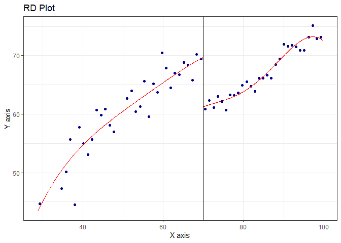
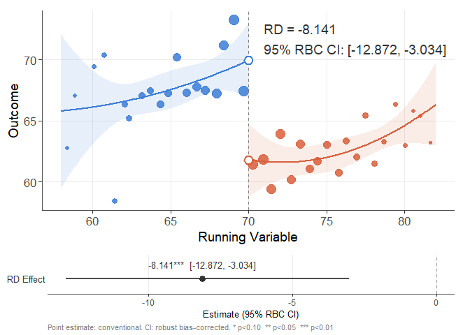
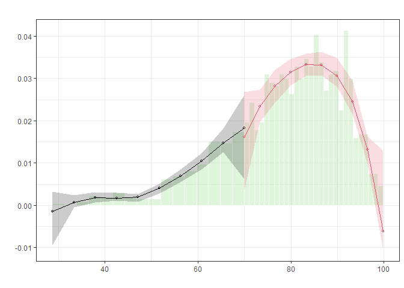
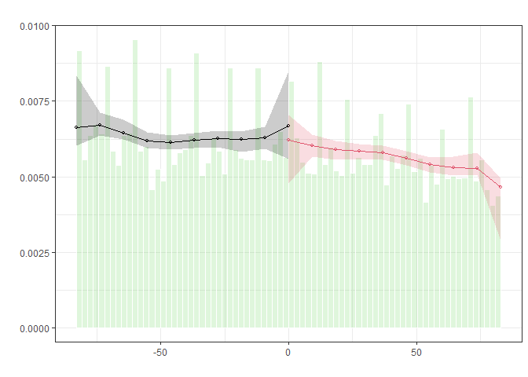
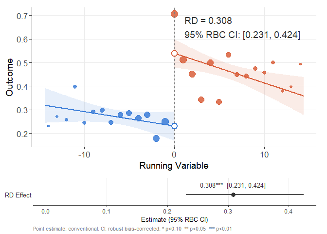
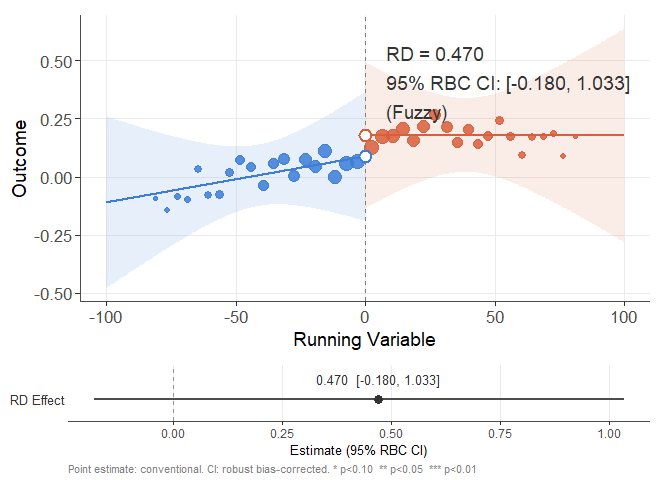
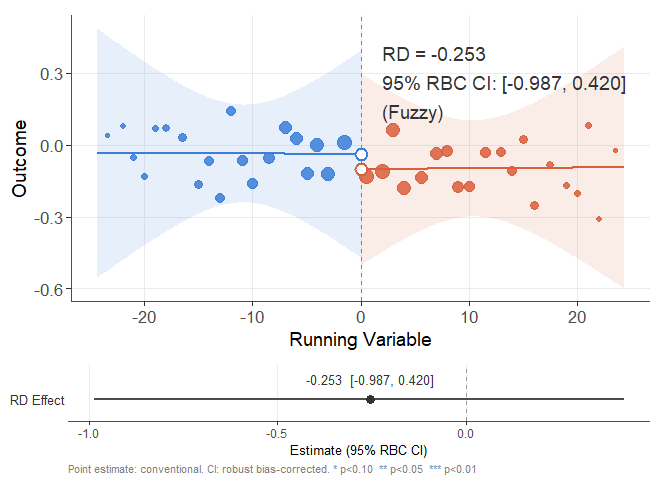
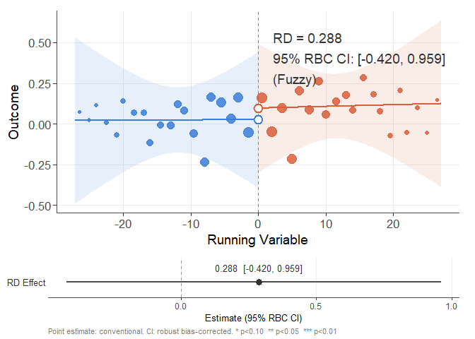
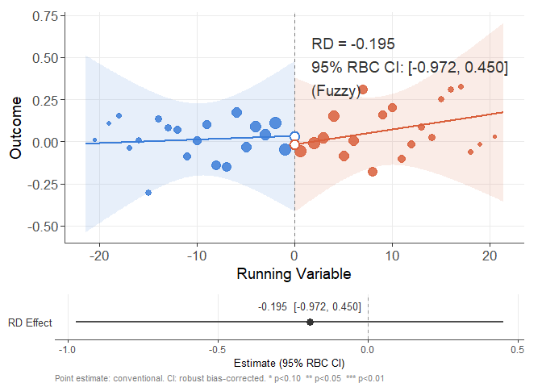
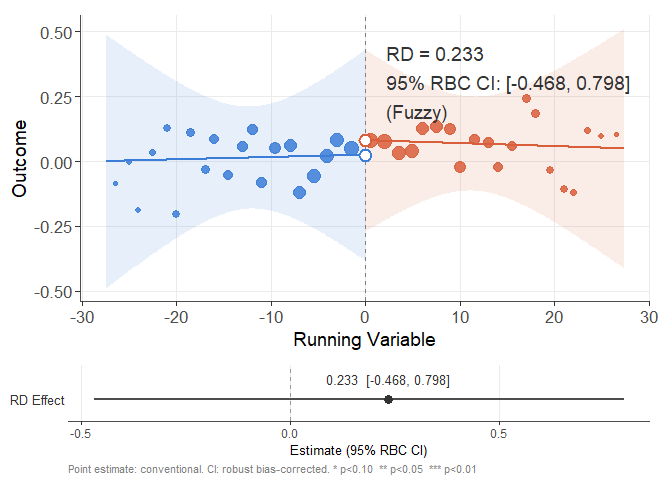

# The First Casualty of Statistics: Part Twenty Two
<big>**Regression Discontinuity Designs**</big>

<br/>
Jiří Fejlek

2026-10-08
<br/>

<br/> In this presentation, we will have a brief look at regression 
discontinuity designs, in which treatment is assigned based on exceeding 
some predefined threshold. As we will see, this design allows estimation 
of the treatment effect for individuals near it. <br/>

## Table of Contents

- [Sharp Regression Discontinuity](#sharp-regression-discontinuity)
- [Tutoring Program Dataset](#tutoring-program-dataset)
- [Fuzzy Regression Discontinuity](#fuzzy-regression-discontinuity)
- [Indianroad Dataset](#indianroad-dataset)
- [References](#references)


``` r
library(tidyr)
library(dplyr)
library(tibble)
library(ggplot2)
library(patchwork)
library(dagitty)
library(ggdag)
library(modelsummary)
library(GGally)
library(estimatr)
library(WeightIt)
library(MatchIt)
library(cobalt)
library(mgcv)
library(marginaleffects)
library(ivreg)
```

## Sharp Regression Discontinuity

The standard assumptions of causal inference in observational studies
(e.g., methods based on weighting or matching) rely on two critical
assumptions (Ding 2024) \* unconfoundedness
``` math
 T \perp \{Y(0), Y(1)\} \mid X
```
and \* positive overlap
``` math
0 < e(x) < 1
```

Let’s assume that the treatment assignment is deterministic
``` math
T = I(X\geq x_0),
```
where $`X`$ is known as the *running variable* (Ding 2024). Since $`T`$
is a deterministic function of $`X`$, the treatment assignment is
unconfounded. However, the probabilities of treatment assignment are
$`e(x) = 1`$ for $`x \geq 0`$ and $`e(x) = 0`$ for $`x < 0`$, which
implies that the positive overlap assumption is clearly violated.
Consequently, the usual methods of causal inference are not applicable.

Deterministic treatment assignment may seem contrived, but it happens in
practice; e.g., consider assigning HIV medication to a patient when the
number of white blood cells per cubic millimeter of blood exceeds a
given threshold (Ding 2024).

Let us have a look at how to perform the causal inference using *sharp
regression discontinuity*. We will define the local average treatment
effect (LATE) at cutoff point $`x_0`$ as (Ding 2024)
``` math
\text{LATE}(x_0) =  \mathbb{E}(Y(1)-Y(0)  \mid X = x_0).
```
Assuming $`\mathbb{E}(Y(1)\mid X= x_0)`$ is continuous from the right
and $`\mathbb{E}(Y(0)\mid X= x_0)`$ is continuous from the left, we
derive (Ding 2024)
``` math
\mathbb{E}(Y(1)\mid X= x_0) = \lim_{\varepsilon \rightarrow 0^+} \mathbb{E}(Y \mid X= x_0 + \varepsilon) = \lim_{\varepsilon \rightarrow 0^+} \mathbb{E}(Y\mid X= x_0 + \varepsilon, T = 1)
```
and
``` math
\mathbb{E}(Y(1)\mid X= x_0)  = \lim_{\varepsilon \rightarrow 0^-} \mathbb{E}(Y \mid X= x_0 + \varepsilon, T = 0).
```
Consequently,
``` math
\text{LATE}(x_0) =  \lim_{\varepsilon \rightarrow 0^+} \mathbb{E}(Y\mid X= x_0 + \varepsilon, T = 1) - \lim_{\varepsilon \rightarrow 0^-} \mathbb{E}(Y \mid X= x_0 + \varepsilon, T = 0)
```
The assumption of continuity of $`Y`$ from the right and from the left
is crucial. Otherwise, the effect which we attribute to the treatment is
actually caused by this discontinuity. To provide a practical example of
this, consider a situation in which individuals are aware of the cutoff
point for treatment assignment before receiving treatment and manipulate
their running variable accordingly (Sasabuchi 2022).

As far as estimating $`\text{LATE}(x_0)`$ is concerned, in principle, we
need to estimate a potential outcomes model in the left and right
neighborhoods of $`x_0`$. Let’s assume that
$`Y = X\hat\beta_1 + \hat\gamma_1`$ for the right neighborhood and
$`Y = X\hat\beta_0 + \hat\gamma_0`$ for the left neighborhood. Then,
(Ding 2024)
``` math
\widehat{\text{LATE}}(x_0) = (\hat \gamma_1 - \hat \gamma_0) + (\hat \beta_1 - \hat \beta_0)x_0
```

The main computational complication is determining the neighborhood of
$`x_0`$. Since we are interested only in the estimate of the treatment
effect on the boundary, increasing the neighborhood will increase the
bias of the estimate but decrease the variance (Sasabuchi 2022).

Lastly, we should note that this is a local average treatment effect;
thus, we need to keep in mind that the estimate of the treatment effect
is only for those near the cutoff.

## Tutoring Program Dataset

We will demonstrate sharp regression discontinuity inference by
reanalyzing the dataset from
<https://carlos-mendez.org/tutorials/stata_rd/>. The dataset describes
the effect of tutoring on the **exit_exam score**. The tutoring was
assigned based on **entrance_exam**.

``` r
tutoring <- read.csv("C:/Users/elini/Desktop/first casualty/tutoring.csv")
head(tutoring)
```

    ##   id entrance_exam tutoring_text exit_exam tutoring
    ## 1  1          92.4      No tutor      78.1        0
    ## 2  2          72.8      No tutor      58.2        0
    ## 3  3          53.7         Tutor      62.0        1
    ## 4  4          98.3      No tutor      67.5        0
    ## 5  5          69.7         Tutor      54.1        1
    ## 6  6          68.1         Tutor      60.1        1

The treatment assignment should be deterministic (the cutoff point is
70). Let us check that.

``` r
summary(tutoring$tutoring[tutoring$entrance_exam <= 70])
```

    ##    Min. 1st Qu.  Median    Mean 3rd Qu.    Max. 
    ##       1       1       1       1       1       1

``` r
summary(tutoring$tutoring[tutoring$entrance_exam > 70])
```

    ##    Min. 1st Qu.  Median    Mean 3rd Qu.    Max. 
    ##       0       0       0       0       0       0

It is indeed. We will perform regression discontinuity inference using
the *rdrobust* package. Let’s plot the data using the package.

``` r
library(rdrobust)
rdplot(exit_exam, entrance_exam, c = 70, data = tutoring)
```

<!-- -->

The jump in **exit_exam** is quite noticeable. Let’s analyze the data
formally using *rdrobust*, which employs local polynomial regression
with a triangular kernel (the polynomial order is given by *p*) and
robust bias-corrected confidence intervals (the polynomial order used to
estimate the bias is given by *q*); see
<https://www.rdocumentation.org/packages/rdrobust/versions/3.0.0/topics/rdrobust>
for more details.

``` r
RDDest <- rdrobust(y = tutoring$exit_exam, x = tutoring$entrance_exam, c = 70, p = 2, q = 3)
cbind(RDDest$coef, RDDest$ci)
```

    ##                    Coeff  CI Lower  CI Upper
    ## Conventional   -8.141282 -12.41598 -3.866583
    ## Bias-Corrected -7.953031 -12.22773 -3.678332
    ## Robust         -7.953031 -12.87235 -3.033709

We can visualize the fit as follows.

``` r
plot(RDDest, tutoring$exit_exam, tutoring$entrance_exam, show_effect = TRUE)
```

<!-- -->

We see that tutoring improved the **exit_exam** scores. Let us check the
bandwidth (the size of the neighborhood around the cutoff) estimated by
*rdrobust*.

``` r
RDDest$bws
```

    ##       left    right
    ## h 12.02566 12.02566
    ## b 15.71809 15.71809

Let us check how much the choice of the bandwidth influences the
estimate.

``` r
h <- c(6, 8,10,12,14,16,18)
b <- c(10,12,14,16,18,20,22)

coefs <- matrix(NA,3,length(h))

for (i in 1:length(h)){
  coefs[,i] <- rdrobust(y = tutoring$exit_exam, x = tutoring$entrance_exam, c = 70, p = 2, q = 3, h = h[i], b = b[i])$coef
}
colnames(coefs) <- c('h=6,b=10','h=8,b=12','h=10,b=14','h=12,b=16','h=14,b=18','h=16,b=20','h=18,b=22')
rownames(coefs) <- c('Conventional','Bias-Corrected','Robust')
coefs
```

    ##                 h=6,b=10  h=8,b=12 h=10,b=14 h=12,b=16 h=14,b=18 h=16,b=20
    ## Conventional   -7.563467 -7.848120 -7.814569 -8.138826 -8.284315 -8.370670
    ## Bias-Corrected -7.470057 -7.629972 -7.620706 -7.962519 -8.199616 -8.309115
    ## Robust         -7.470057 -7.629972 -7.620706 -7.962519 -8.199616 -8.309115
    ##                h=18,b=22
    ## Conventional   -8.362211
    ## Bias-Corrected -8.462454
    ## Robust         -8.462454

We see that not by much.

As we have discussed, we should check whether the individuals
manipulated their running variable to shift their treatment assignment.
The following function *rddensity*
(<https://github.com/rdpackages/rddensity>) (Cattaneo et al. 2018)
compares the distributions of the running variable $`X`$ to the left and
right of the cutoff point $`x_0`$. The discontinuity in the density
indicates some systematic manipulation in treatment assignment (McCrary
2008).

``` r
library(rddensity)
rdd <- rddensity(tutoring$entrance_exam, p = 3, q = 4, c = 70, binoNW = 5)
summary(rdd)
```

    ## 
    ## Manipulation testing using local polynomial density estimation.
    ## 
    ## Number of obs =       1000
    ## Model =               unrestricted
    ## Kernel =              triangular
    ## BW method =           estimated
    ## VCE method =          jackknife
    ## 
    ## c = 70                Left of c           Right of c          
    ## Number of obs         237                 763                 
    ## Eff. Number of obs    191                 440                 
    ## Order est. (p)        3                   3                   
    ## Order bias (q)        4                   4                   
    ## BW est. (h)           16.012              15.504              
    ## 
    ## Method                T                   P > |T|             
    ## Robust                -0.1151             0.9084

    ## 
    ## P-values of binomial tests (H0: p=0.5).
    ## 
    ## Window Length / 2          <c     >=c    P>|T|
    ## 0.900                      20      21    1.0000
    ## 1.800                      36      38    0.9076
    ## 2.700                      47      57    0.3776
    ## 3.600                      62      78    0.2047
    ## 4.500                      75      98    0.0941

``` r
rdplotdensity(rdd, tutoring$entrance_exam, type = "both")$Estplot
```

<!-- -->![]

We observe that the distribution of the running variable is continuous
at the cutoff point, indicating that no such manipulation has taken
place.

## Fuzzy Regression Discontinuity

The sharp regression discontinuity assumption assumes that treatment
assignment is deterministic. But what if the running variable changes
discontinuously, merely altering the probabilities of the treatments
received at the cutoff point? This modification is known as *fuzzy
regression discontinuity*, and as we will see, it combines sharp
regression discontinuity with the method of instrumental variables.

Let us assume a running variable $`X`$ which defines a cutoff point as
``` math
Z = I(X \geq x_0).
```
We can interpret $`Z`$ as an instrumental variable that causes a jump
discontinuity of the treatment assignment probability
$`P(T = 1 \mid X)`$ at $`x_0`$.

We use a sharp regression discontinuity estimate to determine the LATE
of the outcome $`Y`$ and the treatment $`T`$ with respect to $`Z`$ as
``` math
\tau_T(x_0) = \mathbb{E}(T(1)-T(0) \mid X = x_0) = \lim_{\varepsilon \rightarrow 0^+} \mathbb{E}(T\mid X= x_0 + \varepsilon, Z = 1) - \lim_{\varepsilon \rightarrow 0^-} \mathbb{E}(T \mid X= x_0 + \varepsilon, Z = 0),
```
``` math
\tau_Y(x_0) = \mathbb{E}(Y(1)-Y(0) \mid X = x_0) = \lim_{\varepsilon \rightarrow 0^+} \mathbb{E}(Y\mid X= x_0 + \varepsilon, Z = 1) - \lim_{\varepsilon \rightarrow 0^-} \mathbb{E}(Y \mid X= x_0 + \varepsilon, Z = 0).
```
To get a valid LATE estimate, we will assume a monotonicity assumption
(Ding 2024): $`T_i(1) \geq T_i(0)`$ and
$`T_i(1) = T_i(0) \Rightarrow Y_i(1) = Y_i(0)`$, on some neighborhood of
$`x_0`$. Consequently, we can use the Wald estimator to estimate LATE at
$`x_0`$
``` math
\tau_c(x_0) = \frac{\mathbb{E}(Y(1)-Y(0) \mid X = x_0)}{\mathbb{E}(T(1)-T(0) \mid X = x_0)}= \frac{\lim_{\varepsilon \rightarrow 0^+} \mathbb{E}(Y\mid X= x_0 + \varepsilon, Z = 1) - \lim_{\varepsilon \rightarrow 0^-} \mathbb{E}(Y \mid X= x_0 + \varepsilon, Z = 0)}{\lim_{\varepsilon \rightarrow 0^+} \mathbb{E}(T\mid X= x_0 + \varepsilon, Z = 1) - \lim_{\varepsilon \rightarrow 0^-} \mathbb{E}(T \mid X= x_0 + \varepsilon, Z = 0)}.
```

## Indianroad Dataset

Let us have a look at the *Indianroad* dataset from (Asher and Novosad
2020) in which the authors investigate the effect of building new roads
on local economic development in rural areas of India. The government
prioritized connecting unconnected villages based on population
thresholds, which formed a natural cutoff (centered to be 0 in the
dataset).

``` r
indianroad <- read.csv("C:/Users/elini/Desktop/first casualty/indianroad.csv")
head(indianroad)
```

    ##   transport_index_andrsn occupation_index_andrsn firms_index_andrsn
    ## 1              0.2294292             -0.53692758        -0.22754674
    ## 2             -0.6857497              1.44797190        -0.36850739
    ## 3              0.6792668              0.05293373         2.29903940
    ## 4              1.3638802             -1.36518310         0.35144857
    ## 5              2.7288966             -0.28853330         0.05583254
    ## 6              0.2294292             -0.44346148         0.27563861
    ##   consumption_index_andrsn agriculture_index_andrsn r2012 t left right
    ## 1                1.4276736               0.82491314     0 0  -42     0
    ## 2                1.0348541               1.26404360     0 0  -71     0
    ## 3                1.8552666               0.73733830     0 0   -3     0
    ## 4                0.3810506              -0.09156802     1 1    0    75
    ## 5                1.1738154               1.40737010     0 0  -43     0
    ## 6                0.8008583               0.79718453     0 1    0    61
    ##   mainsample
    ## 1          1
    ## 2          1
    ## 3          1
    ## 4          1
    ## 5          1
    ## 6          1

The treatment variable **r2012** is whether the village actually
received a new road network. Outcome variables are several economic
indices: **transport_index_andrsn** (transportation services),
**occupation_index_andrsn** (sectoral allocation of labor),
**firms_index_andrsn** (employment in nonfarm village firms),
**consumption_index_andrsn** (income, assets and predicted consumption),
and **agriculture_index_andrsn** (agricultural investment and yields).

First, we compute the running variable.

``` r
indianroad$run_var = indianroad$left + indianroad$right
```

We notice that the cutoff is not deterministic, so we have to use fuzzy
regression discontinuity.

``` r
summary(indianroad$r2012[indianroad$run_var <= 0])
```

    ##    Min. 1st Qu.  Median    Mean 3rd Qu.    Max. 
    ##  0.0000  0.0000  0.0000  0.2545  1.0000  1.0000

``` r
summary(indianroad$r2012[indianroad$run_var > 0])
```

    ##    Min. 1st Qu.  Median    Mean 3rd Qu.    Max. 
    ##  0.0000  0.0000  0.0000  0.4761  1.0000  1.0000

Before we fit the model, let us first check the distribution of the
running variable.

``` r
rdd <- rddensity(indianroad$run_var, p = 3, q = 4, c = 0, binoNW = 10)
summary(rdd)
```

    ## 
    ## Manipulation testing using local polynomial density estimation.
    ## 
    ## Number of obs =       11432
    ## Model =               unrestricted
    ## Kernel =              triangular
    ## BW method =           estimated
    ## VCE method =          jackknife
    ## 
    ## c = 0                 Left of c           Right of c          
    ## Number of obs         6018                5414                
    ## Eff. Number of obs    2646                2473                
    ## Order est. (p)        3                   3                   
    ## Order bias (q)        4                   4                   
    ## BW est. (h)           37.001              35.666              
    ## 
    ## Method                T                   P > |T|             
    ## Robust                -1.1946             0.2322

    ## 
    ## P-values of binomial tests (H0: p=0.5).
    ## 
    ## Window Length / 2          <c     >=c    P>|T|
    ## 1.000                      68     144    0.0000
    ## 2.000                     141     204    0.0008
    ## 3.000                     220     277    0.0119
    ## 4.000                     303     361    0.0269
    ## 5.000                     387     421    0.2457
    ## 6.000                     455     498    0.1736
    ## 7.000                     516     565    0.1443
    ## 8.000                     593     626    0.3594
    ## 9.000                     658     685    0.4780
    ## 10.000                    732     753    0.6038

``` r
rdplotdensity(rdd, indianroad$run_var, type = "both")$Estplot
```

<!-- -->![]

We see that the distribution of $`X`$ is close to being uniform.

Let’s move to the fuzzy regression discontinuity design. First, we will
check the first stage: the influence of **run_var** on **r2012**.

``` r
RDDest <- rdrobust(y = indianroad$r2012, x = indianroad$run_var, c = 0, p = 1, q = 2)
cbind(RDDest$coef, RDDest$ci)
```

    ##                    Coeff  CI Lower  CI Upper
    ## Conventional   0.3084945 0.2226253 0.3943637
    ## Bias-Corrected 0.3275594 0.2416902 0.4134286
    ## Robust         0.3275594 0.2307754 0.4243435

``` r
plot(RDDest, indianroad$r2012, indianroad$run_var, show_effect = TRUE)
```

<!-- -->

We see that the instrument clearly influences the treatment assignment.
Let’s compute the Wald estimates for all outcomes.

``` r
RDDest <- rdrobust(y = indianroad$transport_index_andrsn, x = indianroad$run_var, fuzzy = indianroad$r2012, c = 0, p = 1, q = 2, b = 100, h = 100)
cbind(RDDest$coef, RDDest$ci)
```

    ##                    Coeff     CI Lower  CI Upper
    ## Conventional   0.4698411  0.049772490 0.8899097
    ## Bias-Corrected 0.4266778  0.006609189 0.8467463
    ## Robust         0.4266778 -0.180007345 1.0333629

``` r
plot(RDDest, indianroad$transport_index_andrsn, indianroad$run_var, fuzzy = indianroad$r2012, show_effect = TRUE)
```

<!-- -->

``` r
RDDest <- rdrobust(y = indianroad$occupation_index_andrsn, x = indianroad$run_var, fuzzy = indianroad$r2012, c = 0, p = 1, q = 2)
cbind(RDDest$coef, RDDest$ci)
```

    ##                     Coeff   CI Lower  CI Upper
    ## Conventional   -0.2533235 -0.8423411 0.3356941
    ## Bias-Corrected -0.2834882 -0.8725057 0.3055294
    ## Robust         -0.2834882 -0.9866871 0.4197107

``` r
plot(RDDest, indianroad$occupation_index_andrsn, indianroad$run_var, show_effect = TRUE)
```

<!-- -->

``` r
RDDest <- rdrobust(y = indianroad$firms_index_andrsn, x = indianroad$run_var, fuzzy = indianroad$r2012, c = 0, p = 1, q = 2)
cbind(RDDest$coef, RDDest$ci)
```

    ##                    Coeff   CI Lower  CI Upper
    ## Conventional   0.2883667 -0.2877066 0.8644400
    ## Bias-Corrected 0.2694904 -0.3065830 0.8455637
    ## Robust         0.2694904 -0.4202693 0.9592500

``` r
plot(RDDest, indianroad$firms_index_andrsn, indianroad$run_var, show_effect = TRUE)
```

<!-- -->

``` r
RDDest <- rdrobust(y = indianroad$consumption_index_andrsn, x = indianroad$run_var, fuzzy = indianroad$r2012, c = 0, p = 1, q = 2)
cbind(RDDest$coef, RDDest$ci)
```

    ##                     Coeff   CI Lower  CI Upper
    ## Conventional   -0.1949754 -0.7932863 0.4033355
    ## Bias-Corrected -0.2607702 -0.8590811 0.3375407
    ## Robust         -0.2607702 -0.9716138 0.4500734

``` r
plot(RDDest, indianroad$consumption_index_andrsn, indianroad$run_var, show_effect = TRUE)
```

<!-- -->

``` r
RDDest <- rdrobust(y = indianroad$agriculture_index_andrsn, x = indianroad$run_var, fuzzy = indianroad$r2012, c = 0, p = 1, q = 2)
cbind(RDDest$coef, RDDest$ci)
```

    ##                    Coeff   CI Lower  CI Upper
    ## Conventional   0.2334908 -0.3036729 0.7706544
    ## Bias-Corrected 0.1649385 -0.3722252 0.7021021
    ## Robust         0.1649385 -0.4682477 0.7981246

``` r
plot(RDDest, indianroad$agriculture_index_andrsn, indianroad$run_var, show_effect = TRUE)
```

<!-- -->

We find that building a new road did not significantly affect the
outcome variables.

## References

<div id="refs" class="references csl-bib-body hanging-indent">

<div id="ref-asher2020rural" class="csl-entry">

Asher, Sam, and Paul Novosad. 2020. “Rural Roads and Local Economic
Development.” *American Economic Review* 110 (3): 797–823.

</div>

<div id="ref-cattaneo2018manipulation" class="csl-entry">

Cattaneo, Matias D, Michael Jansson, and Xinwei Ma. 2018. “Manipulation
Testing Based on Density Discontinuity.” *The Stata Journal* 18 (1):
234–61.

</div>

<div id="ref-ding2024first" class="csl-entry">

Ding, Peng. 2024. *A First Course in Causal Inference*. CRC press.

</div>

<div id="ref-mccrary2008manipulation" class="csl-entry">

McCrary, Justin. 2008. “Manipulation of the Running Variable in the
Regression Discontinuity Design: A Density Test.” *Journal of
Econometrics* 142 (2): 698–714.

</div>

<div id="ref-sasabuchi2022introduction" class="csl-entry">

Sasabuchi, Yusuke. 2022. “Introduction to Regression Discontinuity
Design.” *Annals of Clinical Epidemiology* 4 (1): 1–5.

</div>

</div>
