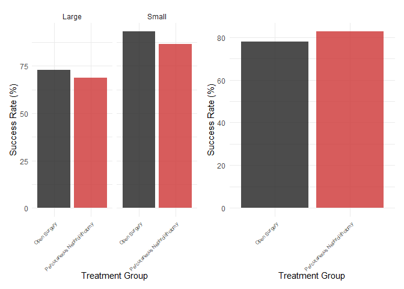
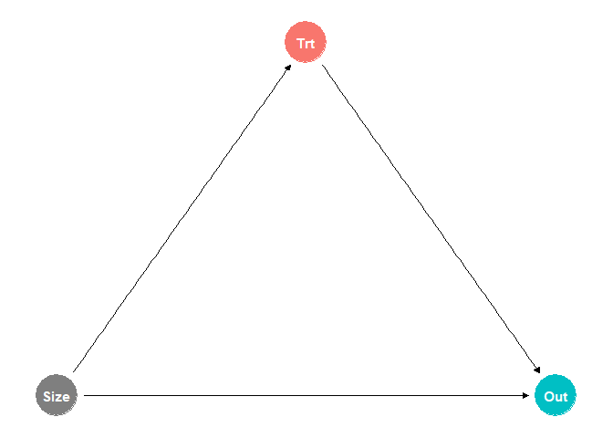
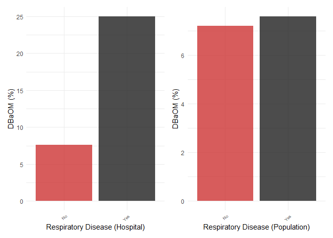
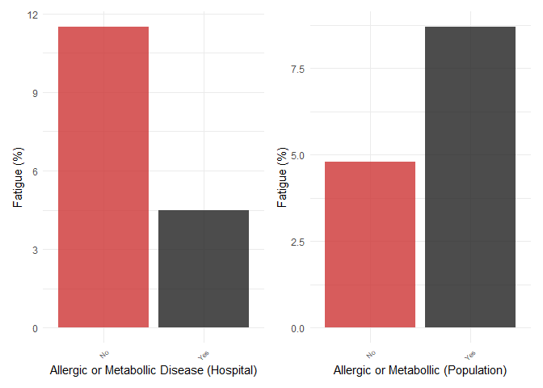
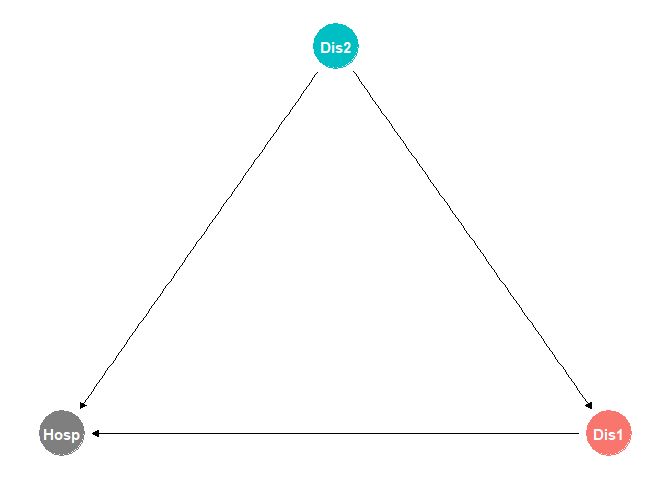
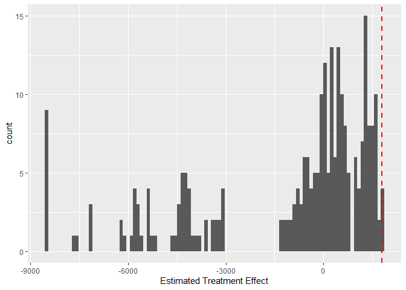

# The First Casualty of Statistics: Part One
<big>**Association Paradoxes**</big>

<br/>
Jiří Fejlek

2026-08-06
<br/>

<br/> This is the first part of a series of short presentations on *causal
inference*. Causal inference is a crucial piece of the puzzle for
providing interpretations of models. Statistical models (or machine
learning models if you want) are all pretty good at approximating
$`P(Y \mid X)`$, i.e., what is the distribution of $`Y`$ when we
*observed* $`X`$. However, these models can be hilariously wrong at
determining the distribution of $`Y`$ when we act, *intervene* on $`X`$,
which is often denoted as $`P(Y \mid \text{do}(X))`$.

The thing is that we do not want to sit back there and watch and
predict. We want to act. We need to act. Causal inference provides us
with a framework that helps us decide whether $`P(Y \mid X)`$ and
$`P(Y \mid \text{do}(X))`$ coincide, i.e., whether actions based on the
model’s predictions are justified.

In this first part, we will describe two paradoxes: Simpson’s Paradox
and Berkson’s Paradox, corresponding to *confounder bias* and *collider
bias*, respectively, which often go wrong. <br/>

## Table of Contents

- [Simpson’s Paradox](#simpsons-paradox)
- [Berkson’s Paradox](#berksons-paradox)
- [Dataset cps1re74](#dataset-cps1re74)
- [References](#references)


``` r
library(tidyr)
library(dplyr)
library(ggplot2)
library(patchwork)
```

## Simpson’s Paradox

It is decreed by law that any introductory course on statistics
eventually covers the Kidney stone dataset from 1986 (Charig et al.
1986). The dataset compares two treatment method success rates (open
surgery and percutaneous nephrolithotomy) across about 700 patients.

``` r
kidney_stones_aggr <- as.data.frame(matrix(c('Open Surgery', 273, 77, 'Percutaneous Nephrolithotomy', 289, 61), nrow = 2, ncol = 3, byrow = TRUE)) 


colnames(kidney_stones_aggr) <- c('Treatment', 'Success', 'Failure') 
kidney_stones_aggr <- kidney_stones_aggr %>% mutate_at(c('Success', 'Failure'), as.numeric)
kidney_stones_aggr
```

    ##                      Treatment Success Failure
    ## 1                 Open Surgery     273      77
    ## 2 Percutaneous Nephrolithotomy     289      61

To compare these two treatments, we compute the risk difference (Ding
2024)
``` math
\begin{split}
P[\text{Outcome} = \text{Succes} \mid \text{Treatment} = \text{Open Surgery}] - \\
P[\text{Outcome} = \text{Succes} \mid \text{Treatment} &= \text{Percutaneous Nephrolithotomy}]
\end{split}
```

``` r
273/(77+273) - 289/(289+61)
```

    ## [1] -0.04571429

``` r
kidney_stones_aggr <- kidney_stones_aggr %>%
  mutate(
    Success_Rate = round(Success / (Success + Failure) * 100, 1)
  )
kidney_stones_aggr
```

    ##                      Treatment Success Failure Success_Rate
    ## 1                 Open Surgery     273      77         78.0
    ## 2 Percutaneous Nephrolithotomy     289      61         82.6

It seems that **Percutaneous Nephrolithotomy** is a better treatment
than open surgery. However, these data are not the result of a
*randomized clinical trial*, in which treatment is assigned randomly to
patients. These data come from an *observational study*; therefore,
treatment assignment was not controlled. This means that there might be
a *confounder*, a common cause, that influences both what treatment was
assigned to a patient and whether the treatment was successful.

Fortunately, those who gathered the data thought ahead about this
problem and also measured the severity of kidney stones in terms of
their size.

``` r
kidney_stones <- data.frame(
  Treatment = rep(c("Open Surgery", "Percutaneous Nephrolithotomy"), each = 4),
  Size = rep(c("Small", "Large"), each = 2, times = 2),
  Outcome = rep(c("Success", "Failure"), times = 4),
  Counts = c(81, 6, 192, 71, 234, 36, 55, 25))
kidney_stones
```

    ##                      Treatment  Size Outcome Counts
    ## 1                 Open Surgery Small Success     81
    ## 2                 Open Surgery Small Failure      6
    ## 3                 Open Surgery Large Success    192
    ## 4                 Open Surgery Large Failure     71
    ## 5 Percutaneous Nephrolithotomy Small Success    234
    ## 6 Percutaneous Nephrolithotomy Small Failure     36
    ## 7 Percutaneous Nephrolithotomy Large Success     55
    ## 8 Percutaneous Nephrolithotomy Large Failure     25

``` r
summary_table <- kidney_stones %>%
  pivot_wider(names_from = Outcome, values_from = Counts) %>%
  mutate(
    Success_Rate = round(Success / (Success + Failure) * 100, 1)
  )

summary_table
```

    ## # A tibble: 4 × 5
    ##   Treatment                    Size  Success Failure Success_Rate
    ##   <chr>                        <chr>   <dbl>   <dbl>        <dbl>
    ## 1 Open Surgery                 Small      81       6         93.1
    ## 2 Open Surgery                 Large     192      71         73  
    ## 3 Percutaneous Nephrolithotomy Small     234      36         86.7
    ## 4 Percutaneous Nephrolithotomy Large      55      25         68.8

We observe that **Open Surgery** has a better success rate in both
groups. What we got here is the famous *Simpson’s paradox*: the effect
of the treatment in each group reverses when those groups are combined.

``` r
g1 <- ggplot(summary_table, aes(x = Treatment, y = Success_Rate, fill = Treatment)) +
  geom_bar(stat = "identity", position = "dodge", alpha = 0.8, show.legend = FALSE) +
  facet_wrap(~Size) +
  labs(y = "Success Rate (%)", x = "Treatment Group") +
  scale_fill_manual(values = c("Open Surgery" = "gray12", "Percutaneous Nephrolithotomy" = "brown3")) +
  theme_minimal() +
  theme(axis.text.x = element_text(angle = 45, vjust = 1, hjust = 1, size = 6))

g2 <- ggplot(kidney_stones_aggr, aes(x = Treatment, y = Success_Rate, fill = Treatment)) +
  geom_bar(stat = "identity", position = "dodge", alpha = 0.8, show.legend = FALSE) +
  labs(y = "Success Rate (%)", x = "Treatment Group") +
  scale_fill_manual(values = c("Open Surgery" = "gray12", "Percutaneous Nephrolithotomy" = "brown3")) +
  theme_minimal() +
  theme(axis.text.x = element_text(angle = 45, vjust = 1, hjust = 1, size = 6))

(g1 +g2) + plot_layout(ncol = 2)
```

<!-- -->

What happened here is that patients with smaller kidney stones, which
are more likely to be treated successfully, are also more likely to be
assigned less invasive **Percutaneous Nephrolithotomy**. **Open
Surgery** is more often used to treat the patients with larger kidney
stones, and since their condition is more severe, it is less likely that
the procedure will be successful.

As we mentioned earlier, these relations imply that **Size** is a
confounder. We can visualize this fact by using a directed acyclic graph
(DAG) (Pearl 2009).

``` r
library(dagitty)
library(ggdag)
```

    ## 
    ## Attaching package: 'ggdag'

    ## The following object is masked from 'package:stats':
    ## 
    ##     filter

``` r
dag <- dagify(Out ~ Trt + Size, Trt ~ Size,  exposure = 'Trt', outcome = 'Out')
ggdag_status(dag) + theme_dag() + theme(legend.position = "none")
```

<!-- -->

The arrow directions denote the direction of relations, i.e., **Size**
causes **Treatment**, not the other way around.

Now, let us move to the aggregated data (i.e., we ignore **Size**). We
can model the **Outcome** via logistic regression.

``` r
summary_table$Treatment <- relevel(as.factor(summary_table$Treatment), 'Percutaneous Nephrolithotomy')
summary(glm(cbind(Success, Failure) ~ Treatment, data = summary_table, family = binomial))
```

    ## 
    ## Call:
    ## glm(formula = cbind(Success, Failure) ~ Treatment, family = binomial, 
    ##     data = summary_table)
    ## 
    ## Coefficients:
    ##                       Estimate Std. Error z value Pr(>|z|)    
    ## (Intercept)             1.5556     0.1409  11.040   <2e-16 ***
    ## TreatmentOpen Surgery  -0.2899     0.1911  -1.517    0.129    
    ## ---
    ## Signif. codes:  0 '***' 0.001 '**' 0.01 '*' 0.05 '.' 0.1 ' ' 1
    ## 
    ## (Dispersion parameter for binomial family taken to be 1)
    ## 
    ##     Null deviance: 33.124  on 3  degrees of freedom
    ## Residual deviance: 30.809  on 2  degrees of freedom
    ## AIC: 54.156
    ## 
    ## Number of Fisher Scoring iterations: 4

We again observe that **Open Surgery** seems to have a negative effect
on the outcome. Now, despite what we discussed, the aggregated model
above is not *wrong*. However, we need to interpret that it actually
models
``` math
 P[\text{Outcome} = \text{Success} \mid \text{Treatment} = \text{Open Surgery}],
```
i.e., the conditional probability of **Outcome** provided that we
*observed* **Treatment**. And it is completely valid to predict the
probability of **Outcome** for a patient based on the fact that he was
assigned the **Open Surgery** treatment.

However, what this example shows us is that this probability is not
necessarily equal to the probability of a successful outcome provided
that we *intervene*; we apply the chosen **Treatment** (while assuming
that everything else stays the same). We denote this probability as
*do-probability* (Pearl 2009)
``` math
 P[\text{Outcome} = \text{Success} \mid \text{do} (\text{Treatment} = \text{Open Surgery})].
```

To estimate this probability, we have to remove the confounding by
including **Size** in the model

``` r
summary_table$Treatment <- relevel(as.factor(summary_table$Treatment), 'Percutaneous Nephrolithotomy')
summary(glm(cbind(Success, Failure) ~ Treatment + Size, data = summary_table, family = binomial))
```

    ## 
    ## Call:
    ## glm(formula = cbind(Success, Failure) ~ Treatment + Size, family = binomial, 
    ##     data = summary_table)
    ## 
    ## Coefficients:
    ##                       Estimate Std. Error z value Pr(>|z|)    
    ## (Intercept)             0.6760     0.2080   3.249  0.00116 ** 
    ## TreatmentOpen Surgery   0.3572     0.2291   1.559  0.11890    
    ## SizeSmall               1.2606     0.2390   5.274 1.33e-07 ***
    ## ---
    ## Signif. codes:  0 '***' 0.001 '**' 0.01 '*' 0.05 '.' 0.1 ' ' 1
    ## 
    ## (Dispersion parameter for binomial family taken to be 1)
    ## 
    ##     Null deviance: 33.1239  on 3  degrees of freedom
    ## Residual deviance:  1.0082  on 1  degrees of freedom
    ## AIC: 26.355
    ## 
    ## Number of Fisher Scoring iterations: 3

and provided that there are no other hidden (unobserved) confounders
(which is a *big if*), the modeled conditional probabilities equal the
do-probabilities

``` math
\begin{split}
P[\text{Outcome} = \text{Success} &\mid \text{Treatment} = \text{Open Surgery}, \text{ Size}] =\\
P[\text{Outcome} &= \text{Success} \mid \text{do} (\text{Treatment} = \text{Open Surgery}), \text{ Size]},
\end{split}
```
i.e., the effect of **Treatment** estimated in the model corresponds to
the *causal* effect.

With the knowledge of Simpson’s paradox, one might be tempted to include
any possible covariate into the model to minimize the chance of the
confounder bias. This is unfortunately ill-advised, since the bias can
also be caused by *including* some variables.

## Berkson’s Paradox

Simpson’s paradox is tied to a hidden confounder, a common cause of the
outcome and the treatment (the variable of interest). The solution is to
condition on the confound, i.e., to include it in the model. Berkson’s
paradox is not as famous as Simpson’s paradox, but just as dangerous. It
is caused by including in (or conditioning on) a *collider*, a variable
that is caused by the treatment and the outcome.

To illustrate collider bias, let’s first consider the data from (Sackett
1979). We will have a look at the relation between people with disease
of bones and organs of movement and with respiratory disease. The
crucial detail is that all people in the study were in the hospital in
the prior 6 months.

``` r
hospital_data <- as.data.frame(matrix(c('Yes', 5, 15, 'No', 18, 219), nrow = 2, ncol = 3, byrow = TRUE)) 


colnames(hospital_data) <- c('Respiratory_Disease', 'DBaOM_Yes', 'DBaOM_No') 
hospital_data <- hospital_data %>% mutate_at(c('DBaOM_Yes', 'DBaOM_No'), as.numeric)
hospital_data
```

    ##   Respiratory_Disease DBaOM_Yes DBaOM_No
    ## 1                 Yes         5       15
    ## 2                  No        18      219

Let us fit the appropriate logistic model.

``` r
summary(glm(cbind(DBaOM_Yes, DBaOM_No) ~ Respiratory_Disease, data = hospital_data, family = binomial))
```

    ## 
    ## Call:
    ## glm(formula = cbind(DBaOM_Yes, DBaOM_No) ~ Respiratory_Disease, 
    ##     family = binomial, data = hospital_data)
    ## 
    ## Coefficients:
    ##                        Estimate Std. Error z value Pr(>|z|)    
    ## (Intercept)             -2.4987     0.2452 -10.191   <2e-16 ***
    ## Respiratory_DiseaseYes   1.4001     0.5717   2.449   0.0143 *  
    ## ---
    ## Signif. codes:  0 '***' 0.001 '**' 0.01 '*' 0.05 '.' 0.1 ' ' 1
    ## 
    ## (Dispersion parameter for binomial family taken to be 1)
    ## 
    ##     Null deviance:  5.0150e+00  on 1  degrees of freedom
    ## Residual deviance: -2.2204e-15  on 0  degrees of freedom
    ## AIC: 11.854
    ## 
    ## Number of Fisher Scoring iterations: 3

We observe that people with respiratory disease have an increased
probability of having disease of bones and organs of movement
($`\text{OR} = \exp(1.4001) \approx 4.06`$). However, when the data was
taken from the whole population, the association between the diseases
disappears.

``` r
population_data <- as.data.frame(matrix(c('Yes', 17, 207, 'No', 184, 2376), nrow = 2, ncol = 3, byrow = TRUE)) 


colnames(population_data) <- c('Respiratory_Disease', 'DBaOM_Yes', 'DBaOM_No') 
population_data <- population_data %>% mutate_at(c('DBaOM_Yes', 'DBaOM_No'), as.numeric)
population_data
```

    ##   Respiratory_Disease DBaOM_Yes DBaOM_No
    ## 1                 Yes        17      207
    ## 2                  No       184     2376

``` r
summary(glm(cbind(DBaOM_Yes, DBaOM_No) ~ Respiratory_Disease, data = population_data, family = binomial))
```

    ## 
    ## Call:
    ## glm(formula = cbind(DBaOM_Yes, DBaOM_No) ~ Respiratory_Disease, 
    ##     family = binomial, data = population_data)
    ## 
    ## Coefficients:
    ##                        Estimate Std. Error z value Pr(>|z|)    
    ## (Intercept)            -2.55824    0.07652 -33.431   <2e-16 ***
    ## Respiratory_DiseaseYes  0.05873    0.26365   0.223    0.824    
    ## ---
    ## Signif. codes:  0 '***' 0.001 '**' 0.01 '*' 0.05 '.' 0.1 ' ' 1
    ## 
    ## (Dispersion parameter for binomial family taken to be 1)
    ## 
    ##     Null deviance:  4.8945e-02  on 1  degrees of freedom
    ## Residual deviance: -2.1294e-13  on 0  degrees of freedom
    ## AIC: 15.581
    ## 
    ## Number of Fisher Scoring iterations: 3

``` r
population_data <- population_data %>%
  mutate(
    Rate = round(DBaOM_Yes / (DBaOM_Yes + DBaOM_No) * 100, 1)
  )

hospital_data <- hospital_data %>%
  mutate(
    Rate = round(DBaOM_Yes / (DBaOM_Yes + DBaOM_No) * 100, 1)
  )


g1 <- ggplot(hospital_data, aes(x = Respiratory_Disease, y = Rate, fill = Respiratory_Disease)) +
  geom_bar(stat = "identity", position = "dodge", alpha = 0.8, show.legend = FALSE) +
  labs(y = "DBaOM (%)", x = "Respiratory Disease (Hospital)") +
  scale_fill_manual(values = c("Yes" = "gray12", "No" = "brown3")) +
  theme_minimal() +
  theme(axis.text.x = element_text(angle = 45, vjust = 1, hjust = 1, size = 6))

g2 <- ggplot(population_data, aes(x = Respiratory_Disease, y = Rate, fill = Respiratory_Disease)) +
  geom_bar(stat = "identity", position = "dodge", alpha = 0.8, show.legend = FALSE) +
  labs(y = "DBaOM (%)", x = "Respiratory Disease (Population)") +
  scale_fill_manual(values = c("Yes" = "gray12", "No" = "brown3")) +
  theme_minimal() +
  theme(axis.text.x = element_text(angle = 45, vjust = 1, hjust = 1, size = 6))

(g1 +g2) + plot_layout(ncol = 2)
```

<!-- -->

There is also another example in (Sackett 1979), in which restricting
the analysis to the people who were in hospital inverts an association,
namely between allergic or metabolic disease and fatigue.

``` r
hospital_data <- as.data.frame(matrix(c('Yes', 1, 21, 'No', 27, 208), nrow = 2, ncol = 3, byrow = TRUE)) 


colnames(hospital_data) <- c('Allergic_metabolic', 'Fatigue_Yes', 'Fatigue_No') 
hospital_data <- hospital_data %>% mutate_at(c('Fatigue_Yes', 'Fatigue_No'), as.numeric)
hospital_data
```

    ##   Allergic_metabolic Fatigue_Yes Fatigue_No
    ## 1                Yes           1         21
    ## 2                 No          27        208

``` r
summary(glm(cbind(Fatigue_Yes, Fatigue_No) ~ Allergic_metabolic, data = hospital_data, family = binomial))
```

    ## 
    ## Call:
    ## glm(formula = cbind(Fatigue_Yes, Fatigue_No) ~ Allergic_metabolic, 
    ##     family = binomial, data = hospital_data)
    ## 
    ## Coefficients:
    ##                       Estimate Std. Error z value Pr(>|z|)    
    ## (Intercept)            -2.0417     0.2046  -9.981   <2e-16 ***
    ## Allergic_metabolicYes  -1.0028     1.0438  -0.961    0.337    
    ## ---
    ## Signif. codes:  0 '***' 0.001 '**' 0.01 '*' 0.05 '.' 0.1 ' ' 1
    ## 
    ## (Dispersion parameter for binomial family taken to be 1)
    ## 
    ##     Null deviance:  1.2269e+00  on 1  degrees of freedom
    ## Residual deviance: -2.1094e-14  on 0  degrees of freedom
    ## AIC: 10.972
    ## 
    ## Number of Fisher Scoring iterations: 4

Data from the hospital indicates that having allergic or metabolic
diseases decreases the probability of fatigue, whereas the data from the
whole population indicate the exact opposite.

``` r
population_data <- as.data.frame(matrix(c('Yes', 13, 136, 'No', 127, 2508), nrow = 2, ncol = 3, byrow = TRUE)) 


colnames(population_data) <- c('Allergic_metabolic', 'Fatigue_Yes', 'Fatigue_No') 
population_data <- population_data %>% mutate_at(c('Fatigue_Yes', 'Fatigue_No'), as.numeric)
population_data
```

    ##   Allergic_metabolic Fatigue_Yes Fatigue_No
    ## 1                Yes          13        136
    ## 2                 No         127       2508

``` r
summary(glm(cbind(Fatigue_Yes, Fatigue_No) ~ Allergic_metabolic, data = population_data, family = binomial))
```

    ## 
    ## Call:
    ## glm(formula = cbind(Fatigue_Yes, Fatigue_No) ~ Allergic_metabolic, 
    ##     family = binomial, data = population_data)
    ## 
    ## Coefficients:
    ##                       Estimate Std. Error z value Pr(>|z|)    
    ## (Intercept)           -2.98305    0.09095 -32.797   <2e-16 ***
    ## Allergic_metabolicYes  0.63535    0.30422   2.088   0.0368 *  
    ## ---
    ## Signif. codes:  0 '***' 0.001 '**' 0.01 '*' 0.05 '.' 0.1 ' ' 1
    ## 
    ## (Dispersion parameter for binomial family taken to be 1)
    ## 
    ##     Null deviance:  3.7732e+00  on 1  degrees of freedom
    ## Residual deviance: -9.0816e-14  on 0  degrees of freedom
    ## AIC: 14.958
    ## 
    ## Number of Fisher Scoring iterations: 3

``` r
population_data <- population_data %>%
  mutate(
    Rate = round(Fatigue_Yes / (Fatigue_Yes + Fatigue_No) * 100, 1)
  )

hospital_data <- hospital_data %>%
  mutate(
    Rate = round(Fatigue_Yes / (Fatigue_Yes + Fatigue_No) * 100, 1)
  )


g1 <- ggplot(hospital_data, aes(x = Allergic_metabolic, y = Rate, fill = Allergic_metabolic)) +
  geom_bar(stat = "identity", position = "dodge", alpha = 0.8, show.legend = FALSE) +
  labs(y = "Fatigue (%)", x = "Allergic or Metabollic Disease (Hospital)") +
  scale_fill_manual(values = c("Yes" = "gray12", "No" = "brown3")) +
  theme_minimal() +
  theme(axis.text.x = element_text(angle = 45, vjust = 1, hjust = 1, size = 6))

g2 <- ggplot(population_data, aes(x = Allergic_metabolic, y = Rate, fill = Allergic_metabolic)) +
  geom_bar(stat = "identity", position = "dodge", alpha = 0.8, show.legend = FALSE) +
  labs(y = "Fatigue (%)", x = "Allergic or Metabollic (Population)") +
  scale_fill_manual(values = c("Yes" = "gray12", "No" = "brown3")) +
  theme_minimal() +
  theme(axis.text.x = element_text(angle = 45, vjust = 1, hjust = 1, size = 6))

(g1 +g2) + plot_layout(ncol = 2)
```

<!-- -->

The issue with these examples is that being in the hospital is a clear
*collider* (having a disease causes visiting a hospital).

``` r
dag <- dagify(Dis1 ~ Dis2, Hosp ~ Dis1+Dis2,  exposure = 'Dis1', outcome = 'Dis2')

ggdag_status(dag) + theme_dag() + theme(legend.position = "none")
```

<!-- -->

An intuitive way to understand that a collider induces a bias is to
think of two conditions, at least one of which must be met for a subject
to be part of the analysis. For example, think of students of some
private school. To get into the school, students have to be talented or
their family wealthy. Hence, it is likely that there will be a negative
correlation between students’ talent and their families’ wealth (because
it is less likely that a student will meet both conditions).

The examples we looked at are instances of *selection bias*, but we can
also get collider bias via including a collider in a regression model;
this is another form of conditioning after all. Let’s simulate a very
simple example.

``` r
set.seed(123)
X <- rnorm(1000, 0, 1)                # treatment
Y <- X + rnorm(1000, 0, 0.5)          # outcome
Z <- X + 0.5*Y + rnorm(1000, 0, 0.1)  # collider
```

If we regress $`Y`$ on $`X`$, we recover the generative process as
expected.

``` r
summary(lm(Y ~ X))
```

    ## 
    ## Call:
    ## lm(formula = Y ~ X)
    ## 
    ## Residuals:
    ##      Min       1Q   Median       3Q      Max 
    ## -1.51394 -0.34572  0.00213  0.35436  1.64557 
    ## 
    ## Coefficients:
    ##             Estimate Std. Error t value Pr(>|t|)    
    ## (Intercept)  0.02052    0.01591    1.29    0.198    
    ## X            1.04402    0.01605   65.03   <2e-16 ***
    ## ---
    ## Signif. codes:  0 '***' 0.001 '**' 0.01 '*' 0.05 '.' 0.1 ' ' 1
    ## 
    ## Residual standard error: 0.5032 on 998 degrees of freedom
    ## Multiple R-squared:  0.8091, Adjusted R-squared:  0.8089 
    ## F-statistic:  4229 on 1 and 998 DF,  p-value: < 2.2e-16

However, when we include $`Z`$, madness.

``` r
summary(lm(Y ~ X + Z))
```

    ## 
    ## Call:
    ## lm(formula = Y ~ X + Z)
    ## 
    ## Residuals:
    ##     Min      1Q  Median      3Q     Max 
    ## -0.5908 -0.1254  0.0018  0.1186  0.5160 
    ## 
    ## Coefficients:
    ##              Estimate Std. Error t value Pr(>|t|)    
    ## (Intercept)  0.006252   0.005718   1.093    0.275    
    ## X           -1.575627   0.032424 -48.594   <2e-16 ***
    ## Z            1.723335   0.020990  82.101   <2e-16 ***
    ## ---
    ## Signif. codes:  0 '***' 0.001 '**' 0.01 '*' 0.05 '.' 0.1 ' ' 1
    ## 
    ## Residual standard error: 0.1807 on 997 degrees of freedom
    ## Multiple R-squared:  0.9754, Adjusted R-squared:  0.9754 
    ## F-statistic: 1.977e+04 on 2 and 997 DF,  p-value: < 2.2e-16

Notice that dependence on $`X`$ is opposite. What is also funny about
this example is that since $`Z`$ encompasses $`Y`$ and has lower noise
than $`Y`$, $`Z`$ is actually a *perfect* predictor to include for
predicting $`Y`$ ($`R^2`$ is almost one!). Also, it’s not like $`X`$ is
doing nothing in the model.

``` r
summary(lm(Y ~ Z))
```

    ## 
    ## Call:
    ## lm(formula = Y ~ Z)
    ## 
    ## Residuals:
    ##      Min       1Q   Median       3Q      Max 
    ## -0.92458 -0.22616  0.00698  0.21471  0.98939 
    ## 
    ## Coefficients:
    ##             Estimate Std. Error t value Pr(>|t|)    
    ## (Intercept) 0.013760   0.010486   1.312     0.19    
    ## Z           0.719583   0.006847 105.097   <2e-16 ***
    ## ---
    ## Signif. codes:  0 '***' 0.001 '**' 0.01 '*' 0.05 '.' 0.1 ' ' 1
    ## 
    ## Residual standard error: 0.3315 on 998 degrees of freedom
    ## Multiple R-squared:  0.9171, Adjusted R-squared:  0.9171 
    ## F-statistic: 1.105e+04 on 1 and 998 DF,  p-value: < 2.2e-16

Dropping $`X`$ decrease $`R^2`$ significantly. In other words, if we
went for a model based on prediction accuracy, we would definitely go
for $`Y \sim X + Z`$. But god help us, if we intervened on $`X`$ based
on this model with some stakes on the line …

## Dataset cps1re74

As the last step of this part, we will do a bit of a teaser and look at
the famous *cps1re74* dataset about the effect of a job training program
on earnings (Ding 2024).

``` r
cps1re74 <- read.csv("C:/Users/elini/Desktop/first casualty/cps1re74.csv")
cps1re74
```

    ##      treat age educ black hispan married nodegree       re74        re75         re78
    ## 1        1  37   11     1      0       1        1     0.0000     0.00000    9930.0460
    ## 2        1  22    9     0      1       0        1     0.0000     0.00000    3595.8940
    ## 3        1  30   12     1      0       0        0     0.0000     0.00000   24909.4500
    ## 4        1  27   11     1      0       0        1     0.0000     0.00000    7506.1460
    ## 5        1  33    8     1      0       0        1     0.0000     0.00000     289.7899
    ## 6        1  22    9     1      0       0        1     0.0000     0.00000    4056.4940
    ## 7        1  23   12     1      0       0        0     0.0000     0.00000       0.0000
    ## 8        1  32   11     1      0       0        1     0.0000     0.00000    8472.1580
    ## 9        1  22   16     1      0       0        0     0.0000     0.00000    2164.0220
    ## 10       1  33   12     0      0       1        0     0.0000     0.00000   12418.0700

What is interesting about this dataset is the fact that it is based on a
randomized experiment (i.e., the causal effect of the treatment could
have been estimated). However, the original control group was
subsequently removed from the dataset and replaced with a
non-experimental comparison group pulled from a population survey, i.e.,
the original randomization is compromised. The goal is to test whether
some method can recover the causal effect.

At this point we are not ready to tackle this. But let’s do some
regressing. For reference, the effect of treatment determined by the
randomized experiment was \$1,794. Let us start with simple regression
with merely treatment **treat**.

``` r
summary(lm(re78 ~ treat, data = cps1re74))
```

    ## 
    ## Call:
    ## lm(formula = re78 ~ treat, data = cps1re74)
    ## 
    ## Residuals:
    ##    Min     1Q Median     3Q    Max 
    ## -14856  -9006   1444  10744  53959 
    ## 
    ## Coefficients:
    ##             Estimate Std. Error t value Pr(>|t|)    
    ## (Intercept) 14855.64      76.22  194.90   <2e-16 ***
    ## treat       -8506.50     712.77  -11.93   <2e-16 ***
    ## ---
    ## Signif. codes:  0 '***' 0.001 '**' 0.01 '*' 0.05 '.' 0.1 ' ' 1
    ## 
    ## Residual standard error: 9639 on 16175 degrees of freedom
    ## Multiple R-squared:  0.008729,   Adjusted R-squared:  0.008668 
    ## F-statistic: 142.4 on 1 and 16175 DF,  p-value: < 2.2e-16

Nope. Let’s adjust for everything.

``` r
summary(lm(re78 ~ ., data = cps1re74))
```

    ## 
    ## Call:
    ## lm(formula = re78 ~ ., data = cps1re74)
    ## 
    ## Residuals:
    ##    Min     1Q Median     3Q    Max 
    ## -25128  -3651   1268   3760  54823 
    ## 
    ## Coefficients:
    ##               Estimate Std. Error t value Pr(>|t|)    
    ## (Intercept) 5719.54716  445.53381  12.838  < 2e-16 ***
    ## treat        704.69703  548.07562   1.286   0.1985    
    ## age         -101.86907    5.88566 -17.308  < 2e-16 ***
    ## educ         161.04469   28.61624   5.628 1.86e-08 ***
    ## black       -838.34740  212.99515  -3.936 8.32e-05 ***
    ## hispan      -218.81996  218.83855  -1.000   0.3174    
    ## married       73.28504  142.52196   0.514   0.6071    
    ## nodegree     374.24547  177.73143   2.106   0.0352 *  
    ## re74           0.28949    0.01208  23.959  < 2e-16 ***
    ## re75           0.47194    0.01219  38.726  < 2e-16 ***
    ## ---
    ## Signif. codes:  0 '***' 0.001 '**' 0.01 '*' 0.05 '.' 0.1 ' ' 1
    ## 
    ## Residual standard error: 7009 on 16167 degrees of freedom
    ## Multiple R-squared:  0.4761, Adjusted R-squared:  0.4758 
    ## F-statistic:  1632 on 9 and 16167 DF,  p-value: < 2.2e-16

We are getting closer. Let’s add all interaction terms.

``` r
summary(lm(re78 ~ (.-treat)^2 + treat, data = cps1re74))
```

    ## 
    ## Call:
    ## lm(formula = re78 ~ (. - treat)^2 + treat, data = cps1re74)
    ## 
    ## Residuals:
    ##    Min     1Q Median     3Q    Max 
    ## -24585  -3347   1435   3616  54556 
    ## 
    ## Coefficients: (1 not defined because of singularities)
    ##                    Estimate Std. Error t value Pr(>|t|)    
    ## (Intercept)       6.690e+01  1.463e+03   0.046 0.963527    
    ## age              -3.867e+01  4.416e+01  -0.876 0.381272    
    ## educ              8.103e+02  1.066e+02   7.605 3.01e-14 ***
    ## black            -2.418e+03  1.696e+03  -1.426 0.153876    
    ## hispan            2.130e+02  1.650e+03   0.129 0.897273    
    ## married          -6.641e+01  1.084e+03  -0.061 0.951160    
    ## nodegree          7.855e+02  9.247e+02   0.850 0.395613    
    ## re74              5.404e-01  9.468e-02   5.708 1.16e-08 ***
    ## re75              2.290e-01  9.660e-02   2.370 0.017785 *  
    ## treat             1.543e+03  5.849e+02   2.639 0.008322 ** 
    ## age:educ         -1.258e+01  3.129e+00  -4.022 5.80e-05 ***
    ## age:black         6.727e+01  2.237e+01   3.008 0.002636 ** 
    ## age:hispan       -2.668e+00  2.348e+01  -0.114 0.909520    
    ## age:married       1.344e+01  1.475e+01   0.911 0.362172    
    ## age:nodegree      8.337e+00  1.908e+01   0.437 0.662167    
    ## age:re74          3.427e-03  1.252e-03   2.738 0.006196 ** 
    ## age:re75          2.156e-03  1.294e-03   1.666 0.095762 .  
    ## educ:black       -1.916e+01  1.101e+02  -0.174 0.861769    
    ## educ:hispan      -4.661e+01  1.000e+02  -0.466 0.641295    
    ## educ:married     -5.950e+01  7.110e+01  -0.837 0.402706    
    ## educ:nodegree    -7.567e+00  7.165e+01  -0.106 0.915891    
    ## educ:re74        -2.711e-02  5.848e-03  -4.636 3.58e-06 ***
    ## educ:re75         1.990e-02  5.933e-03   3.355 0.000797 ***
    ## black:hispan             NA         NA      NA       NA    
    ## black:married    -4.140e+02  4.875e+02  -0.849 0.395693    
    ## black:nodegree   -8.144e+02  6.226e+02  -1.308 0.190846    
    ## black:re74       -7.705e-02  5.037e-02  -1.530 0.126116    
    ## black:re75        1.093e-01  5.127e-02   2.132 0.033007 *  
    ## hispan:married    5.949e+02  5.622e+02   1.058 0.289994    
    ## hispan:nodegree   4.802e+02  6.851e+02   0.701 0.483376    
    ## hispan:re74      -1.153e-01  4.698e-02  -2.455 0.014103 *  
    ## hispan:re75       7.866e-02  4.786e-02   1.644 0.100287    
    ## married:nodegree  3.486e+02  4.697e+02   0.742 0.458053    
    ## married:re74      9.440e-02  3.024e-02   3.121 0.001803 ** 
    ## married:re75     -3.450e-02  3.056e-02  -1.129 0.258906    
    ## nodegree:re74    -8.779e-02  4.020e-02  -2.184 0.028989 *  
    ## nodegree:re75     1.356e-02  4.065e-02   0.334 0.738727    
    ## re74:re75        -5.382e-06  8.757e-07  -6.145 8.17e-10 ***
    ## ---
    ## Signif. codes:  0 '***' 0.001 '**' 0.01 '*' 0.05 '.' 0.1 ' ' 1
    ## 
    ## Residual standard error: 6959 on 16140 degrees of freedom
    ## Multiple R-squared:  0.4845, Adjusted R-squared:  0.4833 
    ## F-statistic: 421.3 on 36 and 16140 DF,  p-value: < 2.2e-16

Almost there. For fun, let’s try every simple linear regression with
treat as a predictor (other covariates enter linearly with all possible
interactions).

``` r
outcome <- "re78"
fixed_covariate <- "treat"
other_covariates <- c("age", "educ", "black", "hispan", "married", "nodegree", "re74", "re75")

all_combinations <- list()
all_combinations[[1]] <- character(0)
counter <- 2

for (i in 1:length(other_covariates)) {
  combos <- combn(other_covariates, i, simplify = FALSE)
  for (c in combos) {
    all_combinations[[counter]] <- c
    counter <- counter + 1
  }
}

results <- data.frame()

for (i in 1:length(all_combinations)) {
  
  covariates <- all_combinations[[i]]
  
  if (length(covariates) > 1){
    formula_str <- paste(outcome, "~ treat + (", paste(covariates, collapse = " + "),")^2")
    model_formula <- as.formula(formula_str)
    fit <- lm(model_formula, data = cps1re74)
    fit_summary <- summary(fit)
  } else {
    fit <- lm(re78~treat, data = cps1re74)
    fit_summary <- summary(fit)
  }
  
  
  
  if (fixed_covariate %in% rownames(fit_summary$coefficients)) {
    treat_stats <- fit_summary$coefficients[fixed_covariate, ]
    
    row <- data.frame(
      model_id = i,
      formula = paste(deparse(formula(fit)), collapse = " "),
      num_covariates = length(all_combinations[[i]]),
      treat_coef = treat_stats["Estimate"],
      treat_se = treat_stats["Std. Error"],
      treat_pvalue = treat_stats["Pr(>|t|)"],
      adj_r2 = fit_summary$adj.r.squared,
      r2 = fit_summary$r.squared,
      aic = AIC(fit)
    )
    results <- rbind(results, row)
  }
}
```

Let’s plot the estimates of the treatment effects.

``` r
ggplot(data = results, aes(x = treat_coef))  + geom_histogram(bins = 100) + xlab('Estimated Treatment Effect') + geom_vline(xintercept = 1794., color = "red", linetype = "dashed", linewidth = 1)
```

<!-- -->

There may be a “correct answer” among the models after all.

``` r
results$treat_coef[which.min((results$treat_coef-1794)^2)]
```

    ## [1] 1806.396

``` r
results$formula[which.min((results$treat_coef-1794)^2)]
```

    ## [1] "re78 ~ treat + (black + nodegree + re74 + re75)^2"

But again, it is not the model that *predicts best*.

``` r
# best model based on ajd. R^2
results$treat_coef[which.max(results$adj_r2)]
```

    ## [1] 1543.484

``` r
results$formula[which.max(results$adj_r2)]
```

    ## [1] "re78 ~ treat + (age + educ + black + hispan + married + nodegree +      re74 + re75)^2"

``` r
# best model based on AIC
results$treat_coef[which.min(results$aic)]
```

    ## [1] 1554.888

``` r
results$formula[which.min(results$aic)]
```

    ## [1] "re78 ~ treat + (age + educ + black + married + nodegree + re74 +      re75)^2"

##  References

<div id="refs" class="references csl-bib-body hanging-indent">

<div id="ref-charig1986comparison" class="csl-entry">

Charig, Clive R, David R Webb, Stephen Richard Payne, and John E
Wickham. 1986. “Comparison of Treatment of Renal Calculi by Open
Surgery, Percutaneous Nephrolithotomy, and Extracorporeal Shockwave
Lithotripsy.” *British Medical Journal (Clinical Research Ed.)* 292
(6524): 879–82.

</div>

<div id="ref-ding2024first" class="csl-entry">

Ding, Peng. 2024. *A First Course in Causal Inference*. CRC press.

</div>

<div id="ref-pearl2009causality" class="csl-entry">

Pearl, Judea. 2009. *Causality: Models, Reasoning, and Inference*. 2nd
ed. Cambridge University Press.

</div>

<div id="ref-sackett1979bias" class="csl-entry">

Sackett, David L. 1979. “Bias in Analytic Research.” In *The
Case-Control Study Consensus and Controversy*. Elsevier.

</div>

</div>
